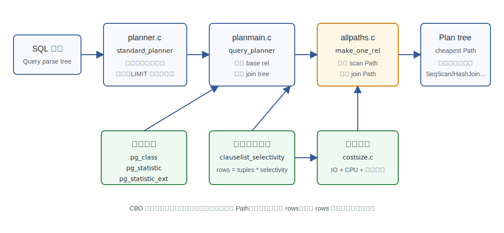
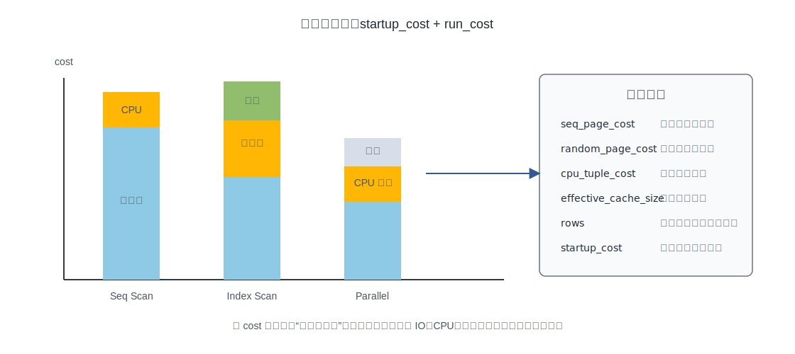
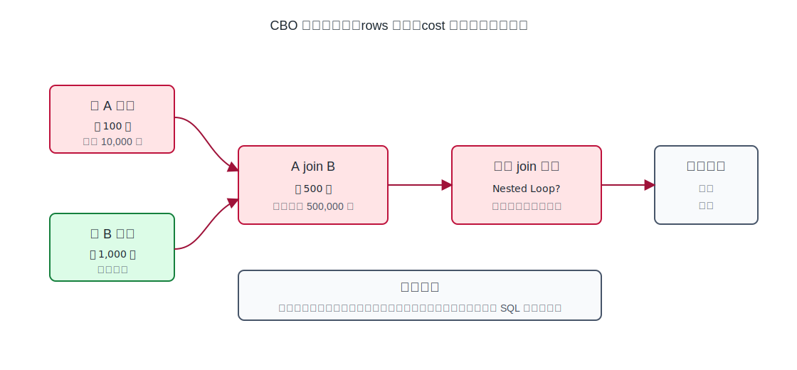
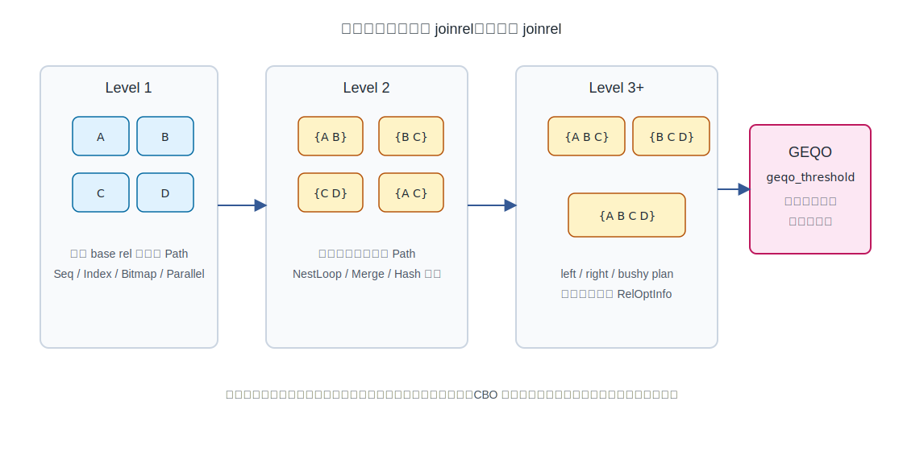
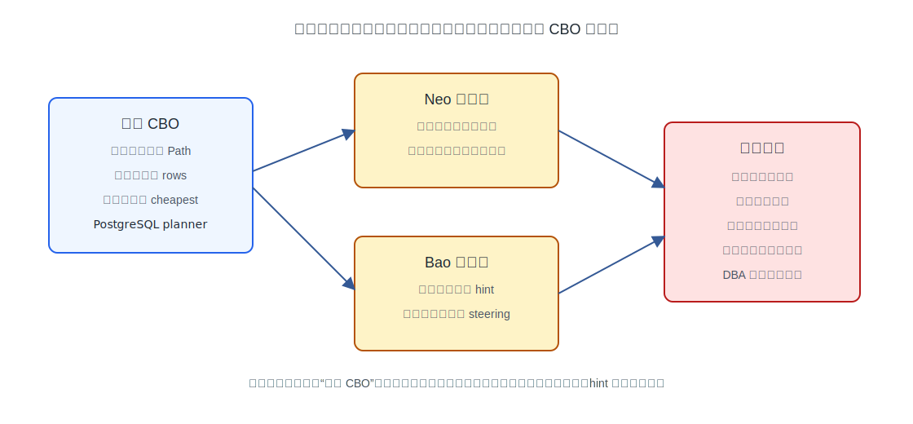

## 数据库筑基课 - 优化器之 CBO

### 作者
digoal

### 日期
2026-05-31

### 标签
PostgreSQL , 应用开发者 , 数据库筑基课 , 优化器 , CBO , Query Optimizer , Cardinality Estimation

----

## 背景


本文聚焦 CBO，也就是 cost-based optimization，属于“优化器 / 扫描与执行规划机制”这一类基础能力。

业务开发者看到的是一条 SQL，数据库看到的是一个巨大的选择空间：先扫哪张表？用顺序扫描还是索引扫描？先连接订单和用户，还是先连接订单和明细？使用 Nested Loop、Hash Join 还是 Merge Join？是否值得并行？是否为了 `ORDER BY` 保留有序路径？

RBO 可以用固定规则缩小这个空间，例如“谓词下推”“常量折叠”“能用索引就考虑索引”。但真实负载里，同一个规则在不同数据分布下可能完全相反：选择率 0.01% 的索引扫描很香，选择率 80% 的索引回表可能比顺序扫描还差。CBO 的核心价值就是把“可行计划”放到同一把代价尺子上比较。

本文的基本假设：

- 你已经会看基本 `EXPLAIN`。
- 你关心 PostgreSQL 这类成熟数据库的工程实现，而不是只记“CBO 等于按成本选计划”。
- 本文不伪造 benchmark 数字。示例 SQL 是可执行实验，但本轮没有启动 PostgreSQL 实例执行它们。

## 一、它解决什么问题？

CBO 解决的是“正确计划很多，但成本相差几个数量级”的问题。

例如一个三表查询：

```sql
SELECT *
FROM orders o
JOIN customers c ON c.id = o.customer_id
JOIN order_items i ON i.order_id = o.id
WHERE c.region = 'CN'
  AND o.created_at >= now() - interval '7 days'
  AND i.sku = 'A100';
```

这条 SQL 至少有这些选择：

- `customers` 先按 `region` 过滤，再找 `orders`。
- `order_items` 先按 `sku` 过滤，再找 `orders`。
- `orders` 先按时间过滤，再连接两边。
- 对每个连接点再选择 Nested Loop、Hash Join、Merge Join。
- 对每张表选择 Seq Scan、Index Scan、Index Only Scan、Bitmap Heap Scan、Parallel Seq Scan 等路径。

如果优化器只按语法顺序执行，SQL 写法就会变成性能的一部分；如果优化器只按固定规则执行，数据分布一变就会误判。CBO 把问题转成：

1. 生成候选路径。
2. 估算每条路径输出多少行。
3. 把 IO、CPU、排序、哈希、并行通信等成本折算成统一 cost。
4. 选择预计代价最低的路径。

它牺牲的是规划时间、模型复杂度和可解释性。也就是说，CBO 不是免费午餐：它用更多规划期开销换取更低执行期开销。

## 二、它是什么？

CBO 是一种以代价模型为核心的查询优化方法。它不是一个单独函数，而是一套流水线：

- 逻辑重写：把 SQL 转成更容易优化的关系代数结构。
- 候选生成：为 base relation 和 join relation 构造 `Path`。
- 统计估计：用表行数、页数、直方图、MCV、相关性、扩展统计信息估算选择率和基数。
- 代价计算：用 `seq_page_cost`、`random_page_cost`、`cpu_tuple_cost` 等参数估算路径成本。
- 搜索与裁剪：在 join order、join method、scan method、pathkeys、parameterized path 之间搜索，同时丢弃被支配的路径。
- 计划生成：把胜出的 `Path` 转成执行器使用的 `Plan`。

在 PostgreSQL 源码里，几个关键词非常重要：

| 名词 | 含义 | PostgreSQL 位置 |
|---|---|---|
| `RelOptInfo` | 一个 base relation 或一组 joined relations 的优化期表示 | `src/include/nodes/pathnodes.h` |
| `Path` | 生成某个 `RelOptInfo` 的一种方法，带 rows、startup_cost、total_cost、pathkeys | `src/backend/optimizer/README` |
| `PathKey` | 路径输出顺序，影响是否需要额外排序 | `src/backend/optimizer/README` |
| `Selectivity` | 谓词通过比例，例如 0.01 表示预计 1% 行通过 | `src/backend/optimizer/path/clausesel.c` |
| `startup_cost` | 第一行输出前的成本 | `src/backend/optimizer/path/costsize.c` |
| `total_cost` | 路径跑完整的总成本 | `src/backend/optimizer/path/costsize.c` |

PostgreSQL 的优化器 README 明确说明：优化器会构建 `Path` 树，选择能生成目标 relation 的 cheapest Path，再把它转成 executor 使用的 Plan。对一个 primitive table，它会考虑顺序扫描、索引扫描、bitmap index scan 等路径；对 join，则会考虑 nested loop、merge join、hash join 等方法。

## 三、核心原理



图 1 说明：CBO 的关键不是“最后选 cheapest”，而是前面三件事是否靠谱：候选 Path 是否覆盖了好计划，统计信息能否估准 rows，代价模型是否贴近本机负载。任一环节失真，最后的 cheapest 都可能只是“模型里的 cheapest”。

### 3.1 从 planner 到 Path

PostgreSQL 的主流程可以从这些文件理解：

- `src/backend/optimizer/plan/planner.c`：优化器外部入口，处理上层结构。
- `src/backend/optimizer/plan/planmain.c`：`query_planner()` 规划基本 scan/join 查询。
- `src/backend/optimizer/path/allpaths.c`：生成 base rel 和 join rel 的访问路径。
- `src/backend/optimizer/path/joinrels.c`：按层构造 join relation。
- `src/backend/optimizer/path/joinpath.c`：给某个 joinrel 添加 NestLoop、MergeJoin、HashJoin 等路径。
- `src/backend/optimizer/path/costsize.c`：代价和行数估计的主要实现。
- `src/backend/optimizer/path/clausesel.c`：布尔条件选择率估计。
- `src/backend/utils/adt/selfuncs.c` 和 `src/backend/statistics/`：具体操作符、类型、扩展统计信息相关估计。

`query_planner()` 的主线是：

1. `add_base_rels_to_query()` 为 jointree 里的 base relation 建 `RelOptInfo`。
2. `deconstruct_jointree()` 分解连接树和谓词。
3. 生成等价类、外连接约束、外键匹配、OR 条件抽取等信息。
4. `make_one_rel()` 进入主规划。
5. `set_base_rel_sizes()` 估 base relation 的 rows、width。
6. `set_base_rel_pathlists()` 生成 base relation 的 scan paths。
7. `make_rel_from_joinlist()` 生成整体 join tree 的 paths。

`set_plain_rel_pathlist()` 很直观：先考虑 TID scan，再加 sequential scan；如果可并行，生成 parallel seq scan；最后调用 `create_index_paths()` 考虑索引路径。这也解释了一个常见误区：建了索引不代表优化器一定用索引，索引只是候选 Path 之一。

### 3.2 代价模型：统一比较不同物理路径



图 2 说明：`cost` 不是毫秒，也不是真实 IO 次数，而是一组相对单位。PostgreSQL 官方文档也强调，cost 参数只看相对值；默认以顺序页读取成本 `seq_page_cost = 1.0` 为基准。改变所有 cost 常量的同一比例不会改变计划选择。

以 `cost_seqscan()` 为例，简化后可以理解为：

```text
disk_run_cost = seq_page_cost * baserel->pages
cpu_run_cost  = (cpu_tuple_cost + qual_per_tuple_cost) * baserel->tuples
total_cost    = startup_cost + disk_run_cost + cpu_run_cost + targetlist_cost
```

文档里的例子也展示了类似计算：一个表有 345 页、10000 行，默认 `seq_page_cost = 1.0`、`cpu_tuple_cost = 0.01`，顺序扫描成本约为 `345 * 1.0 + 10000 * 0.01 = 445`。

`cost_index()` 更复杂，至少要考虑：

- 索引自身扫描成本，由 access method 的 `amcostestimate` 提供。
- 索引选择率 `indexSelectivity`。
- 预计回表 tuple 数：`indexSelectivity * baserel->tuples`。
- 表页面访问数，包含缓存影响和 Mackert-Lohman 近似。
- 索引顺序与堆表物理顺序的相关性 `indexCorrelation`。
- index only scan 可借助 visibility map 减少 heap page fetch。
- parallel path 的 CPU 分摊。

这解释了为什么一些“看起来应该走索引”的 SQL 不走索引：如果选择率高、回表随机读多、表又大，索引路径的 `total_cost` 可能高于顺序扫描。

### 3.3 基数估计：CBO 最脆弱的输入

PostgreSQL 对 base relation 的行数估计大致是：

```text
rel->rows = rel->tuples * clauselist_selectivity(restrict_clauses)
```

源码位置是 `set_baserel_size_estimates()`。对 join relation，内连接的核心形态大致是：

```text
nrows = outer_rows * inner_rows * fkselec * jselec
```

源码位置是 `calc_joinrel_size_estimate()`。这几个乘法非常关键：单表误差会进入 join，join 误差又会进入更上层 join、sort、aggregate、limit。



图 3 说明：如果表 A 的过滤结果被低估 100 倍，优化器可能以为 nested loop 的内层只会被访问少量次数，于是选了一个在真实数据量下非常慢的路径。很多“优化器选错计划”的根因不是 join 算法实现差，而是 rows 估错。

`clauselist_selectivity()` 的注释非常值得读。它会优先尝试 extended statistics 来捕捉跨列依赖；剩余条件通常按独立性相乘；对 `x > low AND x < high` 这类范围查询，会特殊合并上下界，而不是简单相乘。这说明 PostgreSQL 并不是“傻乘”，但它仍然受统计信息质量限制。

### 3.4 统计信息：CBO 的传感器

PostgreSQL 官方文档把统计信息分成几个层次：

- `pg_class.relpages`、`pg_class.reltuples`：表页数和行数，`VACUUM`、`ANALYZE` 和部分 DDL 会更新，但不是实时精确值。
- `pg_statistic` / `pg_stats`：单列统计信息，包括 null fraction、n_distinct、most_common_vals、histogram_bounds 等。
- `pg_statistic_ext` / `pg_statistic_ext_data`：扩展统计信息，用于多列或表达式统计。

`ANALYZE` 对大表使用随机采样，所以统计信息即使刚更新也是近似的。`default_statistics_target` 或列级 `ALTER TABLE ... SET STATISTICS` 能提高 MCV 和 histogram 的容量，代价是更长的 `ANALYZE` 时间、更大的统计信息存储和更多估计开销。

扩展统计信息特别重要。官方文档指出，多列条件相关时，优化器通常假设条件独立，这会导致错误估计；`CREATE STATISTICS` 可以收集多变量统计。目前支持的 multivariate statistics kind 包括：

- `ndistinct`：多列 distinct 估计，常用于 group count。
- `dependencies`：函数依赖，适合强相关列。
- `mcv`：多列 most-common-values 列表，适合热点组合和数据倾斜。

注意一个边界：PostgreSQL 文档明确说，扩展统计信息目前不用于 table join 的 selectivity estimation。也就是说，它能改善很多单表多条件估计，但不能指望它解决所有 join 基数误差。

### 3.5 搜索空间：System R 到 PostgreSQL 的工程折中

System R 的经典论文 *Access Path Selection in a Relational Database Management System* 奠定了关系数据库优化器的基本套路：为单表选择 access path，为 join 枚举连接顺序和连接方法，用代价估计选择低成本计划。PostgreSQL 的 `optimizer/README` 也明确写到，标准优化器使用 dynamic programming 构造 join tree：先找二元 joinrel，再找三元 joinrel，直到包含全部 relation 的 final joinrel。



图 4 说明：同一个 join relation，例如 `{A B C}`，只建一个 `RelOptInfo`；不同构造方式以不同 `Path` 竞争。这个设计让优化器可以在构造更大 joinrel 之前，对小 joinrel 的路径做裁剪。

PostgreSQL 不只考虑左深树，也会考虑 right-handed 和 bushy plan。`joinrels.c` 的 `join_search_one_level()` 注释说明：对某个 level，它先考虑 level-1 joinrel 与 base relation 的连接，再考虑 bushy plans，也就是 `{A B}` join `{C D}` 这类两边都是 joinrel 的组合。

搜索空间不会无限放开。相关控制参数包括：

- `join_collapse_limit`：显式 `JOIN` 是否被展开重排。设为 1 可阻止显式 JOIN 重排。
- `from_collapse_limit`：子查询折叠到上层 FROM 的限制。
- `geqo_threshold`：FROM 项达到阈值后使用 genetic query optimization，默认 12。
- `geqo_effort`、`geqo_pool_size`、`geqo_generations`、`geqo_seed`：控制 GEQO 搜索质量和规划时间。

官方文档对 GEQO 的解释很直接：关系数很多时，穷举搜索太慢，甚至会超过执行一个次优计划的损失，所以用阈值管理 GEQO。

### 3.6 路径裁剪：不是所有候选都会留下

`add_path()` 是理解 PostgreSQL CBO 工程性的关键。它不是把所有 Path 都保存到最后再排序，而是在每个 `RelOptInfo` 的 pathlist 里持续比较和裁剪：

- 总成本更低的 Path 可能支配旧 Path。
- startup cost 更低的 Path 在 `LIMIT`、`EXISTS`、cursor 等场景可能值得保留。
- pathkeys 更好，即输出已有目标排序，可能避免上层 sort。
- parameterized path 可能行数更少，但只能在特定 outer relation 已经可用时使用。
- parallel-safe path 在并行场景下更有价值。

这就是 CBO 的现实形态：它不是理论上枚举所有计划，而是在“规划时间、内存、搜索质量”之间做连续折中。

### 3.7 Volcano、Cascades 与 PostgreSQL

Volcano 和 Cascades 论文代表了另一条重要脉络：把优化器做成可扩展的搜索框架，用 transformation rule、implementation rule、memo、property、cost bound 来组织搜索。它们的思想影响了很多商业数据库和研究系统。

PostgreSQL 不是一个照搬 Cascades memo 架构的优化器。它有自己的 `RelOptInfo`、`Path`、pathlist、hook、FDW/custom path 机制。相同点在于：都把逻辑等价表达、物理实现、代价比较和搜索剪枝分开；差异在于 PostgreSQL 的主优化器更贴近手写工程结构，而不是通用 optimizer generator。

## 四、横向对比

| 维度 | PostgreSQL CBO | System R 风格 CBO | Volcano/Cascades | 学习型优化器 Neo / Bao |
|---|---|---|---|---|
| 主要目标 | 在成熟 SQL 引擎中稳定生成低成本计划 | 奠定 access path 与 join order 代价搜索框架 | 提供可扩展优化器生成和 memo 搜索框架 | 用数据反馈修正或替代部分优化决策 |
| 搜索结构 | `RelOptInfo` + `Path` + 动态规划 + GEQO | 动态规划枚举 left-deep 为主的连接计划 | memo group、规则变换、property 驱动搜索 | Neo 倾向学习计划选择；Bao 倾向给优化器 hint/steering |
| 统计依赖 | `pg_class`、`pg_statistic`、扩展统计、操作符 selectivity 函数 | catalog statistics | 取决于具体实现 | 依赖执行反馈、训练数据和特征 |
| 可扩展性 | planner hook、join/search hook、FDW、CustomPath、AM cost estimate | 原始论文框架较固定 | 设计目标就是可扩展 | 取决于系统，常有训练和部署复杂度 |
| 规划时间控制 | path 裁剪、collapse limit、GEQO | 通过枚举范围控制 | cost bound、promise、rule scheduling | 训练/推理开销需要额外控制 |
| 风险 | 统计过期、相关性、数据倾斜、代价常数不匹配 | 同样受统计和搜索范围限制 | 框架复杂，规则交互难调 | 泛化、数据漂移、解释性和失败兜底 |
| 适合场景 | 通用 OLTP/OLAP 混合、复杂 SQL、成熟生产系统 | 经典关系查询优化 | 需要高度可扩展 optimizer 的系统 | 重复 workload、可收集反馈、可容忍学习系统运维成本 |

横向看，CBO 的核心矛盾没有变：计划空间非常大，真实成本不可提前精确知道，只能用统计信息和模型近似。System R 给出了“枚举 + 代价”的基本框架；Volcano/Cascades 提高了优化器框架的可扩展性；PostgreSQL 给出了一套长期演化的工程实现；Neo/Bao 这类学习型优化器则试图用运行反馈修正传统模型的盲区。



图 5 说明：学习型优化器更现实的落点通常不是“推翻 CBO”，而是在成熟 CBO 旁边做计划选择、hint steering 或基数/代价校准。Bao 的思路尤其偏工程：保留底层优化器，用学习反馈决定何时给什么 hint，让系统渐进改善。

## 五、效果如何？

CBO 的收益来自几类选择：

- 在小结果集时选择 index scan / nested loop，避免全表扫描。
- 在大结果集时选择 seq scan / hash join，避免大量随机回表。
- 在有序路径存在时利用 pathkeys，减少额外 sort。
- 在多表 join 中先做高选择率过滤，减少中间结果。
- 在大扫描时使用 parallel path，但只在并行启动和通信成本值得时使用。

代价也同样明确：

- 规划成本上升。join 表越多，搜索空间越大。
- 对统计信息高度敏感。`ANALYZE` 不及时或 sample 无法代表尾部数据，会直接影响 rows。
- 对 workload 平均值敏感。全局 `random_page_cost` 不能同时完美代表冷数据、热数据、SSD、网络盘、全内存场景。
- 对参数化 SQL 有额外挑战。prepared statement 的 generic plan 可能不适合某个具体参数。
- 对极端相关性、复杂表达式、用户自定义类型和函数，默认 selectivity 可能不足。

评价 CBO 效果不能只看“有没有用索引”。正确方法是看：

```sql
EXPLAIN (ANALYZE, BUFFERS, VERBOSE)
SELECT ...;
```

重点比较每个节点：

- `rows` 估计值 vs `actual rows`。
- `loops` 是否导致内层节点被重复执行很多次。
- `Buffers` 是否出现超预期读放大。
- Sort / Hash 是否 spill 到磁盘。
- Join 顺序是否把大中间结果提前放大。
- Planning Time 是否在短查询中占比过高。

官方文档也强调，`EXPLAIN ANALYZE` 会实际执行 SQL；对 DML 要放在事务里并 `ROLLBACK`，或者只在测试环境执行。

## 六、实操 DEMO

下面给一个最小实验，用来观察“多列相关性导致基数低估，以及扩展统计如何改善单表估计”。本轮没有连接 PostgreSQL 实例执行，所以不提供实际输出。

```sql
DROP TABLE IF EXISTS cbo_demo;

CREATE TABLE cbo_demo AS
SELECT
  i AS id,
  i / 100 AS city_id,
  i / 100 AS zip_id,
  md5(i::text) AS payload
FROM generate_series(1, 1000000) AS s(i);

ANALYZE cbo_demo;

EXPLAIN (ANALYZE, BUFFERS)
SELECT *
FROM cbo_demo
WHERE city_id = 100
  AND zip_id = 100;

CREATE STATISTICS cbo_demo_city_zip_dep (dependencies, mcv)
ON city_id, zip_id
FROM cbo_demo;

ANALYZE cbo_demo;

EXPLAIN (ANALYZE, BUFFERS)
SELECT *
FROM cbo_demo
WHERE city_id = 100
  AND zip_id = 100;
```

你应该观察：

- 创建扩展统计前，优化器可能把 `city_id = 100` 和 `zip_id = 100` 当成独立条件相乘，低估结果行数。
- 创建 `dependencies` / `mcv` 并 `ANALYZE` 后，单表多条件估计通常更接近实际。
- 如果再加索引，计划可能从 Seq Scan 变成 Bitmap Heap Scan 或 Index Scan，但这取决于选择率、表大小、缓存和 cost 参数。

再观察 join 搜索和 join 方法：

```sql
DROP TABLE IF EXISTS c CASCADE;
DROP TABLE IF EXISTS o CASCADE;
DROP TABLE IF EXISTS i CASCADE;

CREATE TABLE c AS
SELECT id, CASE WHEN id % 10 = 0 THEN 'CN' ELSE 'US' END AS region
FROM generate_series(1, 100000) AS id;

CREATE TABLE o AS
SELECT id, (id % 100000) + 1 AS customer_id, now() - (id % 365) * interval '1 day' AS created_at
FROM generate_series(1, 1000000) AS id;

CREATE TABLE i AS
SELECT id, (id % 1000000) + 1 AS order_id, CASE WHEN id % 100 = 0 THEN 'A100' ELSE 'B200' END AS sku
FROM generate_series(1, 3000000) AS id;

CREATE INDEX ON c(region);
CREATE INDEX ON o(customer_id);
CREATE INDEX ON o(created_at);
CREATE INDEX ON i(order_id);
CREATE INDEX ON i(sku);

ANALYZE c;
ANALYZE o;
ANALYZE i;

EXPLAIN (ANALYZE, BUFFERS, VERBOSE)
SELECT *
FROM o
JOIN c ON c.id = o.customer_id
JOIN i ON i.order_id = o.id
WHERE c.region = 'CN'
  AND o.created_at >= now() - interval '7 days'
  AND i.sku = 'A100';
```

可以临时对比不同规划开关，但不要把它当长期优化手段：

```sql
BEGIN;

SET LOCAL enable_hashjoin = off;
SET LOCAL enable_mergejoin = off;

EXPLAIN (ANALYZE, BUFFERS)
SELECT ...

ROLLBACK;
```

这些开关适合定位“如果不用某类路径会怎样”，不适合在生产中粗暴关闭某个 join 方法。

## 七、最佳实践

### 面向数据库架构师

1. 把模型设计成优化器容易估计的样子。

   强相关列、JSON 深层表达式、隐式类型转换、函数包裹列、过度动态 SQL，都会增加估计难度。高频查询里使用的表达式可以考虑表达式索引或表达式统计。

2. 用数据分布设计索引，而不是只看谓词字段。

   多列索引的顺序、覆盖性、相关性、回表成本、排序需求都影响 CBO。`WHERE a = ? AND b BETWEEN ? AND ? ORDER BY c` 与 `WHERE b BETWEEN ? AND ?` 不是同一个索引问题。

3. 把分区、约束、外键当成优化器信息。

   分区裁剪、约束排除、外键 join selectivity 都能帮助优化器缩小搜索和估计空间。没有约束的“事实正确”，优化器不一定知道。

### 面向 DBA

1. 先看 rows 误差，再调 cost 参数。

   如果 `actual rows` 与 `rows` 差几个数量级，优先处理统计信息、数据倾斜、相关性、表达式统计。不要一上来调 `random_page_cost`。

2. 让 `ANALYZE` 跟上数据变化。

   批量导入、分区切换、热点表大规模更新后，主动 `ANALYZE`。恢复 dump 后也应重新分析统计信息。

3. 谨慎调全局 cost。

   官方文档提醒，没有确定理想 cost 常量的好方法，它们更像 workload 平均值。建议先用表空间级参数、会话级验证或小范围灰度，而不是直接全局修改。

4. 对多列相关性创建扩展统计。

   常见候选是：省市区、状态与时间、租户与业务类型、枚举组合、表达式组合。创建后必须 `ANALYZE` 才会收集数据。

### 面向业务开发者

1. 不要把 SQL 写成优化器看不懂的形式。

   避免无意义函数包裹索引列，例如 `WHERE date(created_at) = ...`。更好的写法通常是范围条件：`created_at >= ... AND created_at < ...`。

2. 用 `EXPLAIN (ANALYZE, BUFFERS)` 验证真实路径。

   只看 `EXPLAIN` 只能看到估计，不能看到实际行数和 buffer 行为。诊断慢 SQL 时，估计与实际的差异比“走了哪个索引”更重要。

3. 警惕“测试环境快，生产慢”。

   测试环境数据量、分布、缓存、参数、统计信息都可能不同。CBO 面向的是当前数据库看到的统计世界，不是你脑中的业务世界。

## 八、适合与不适合场景

适合：

- 多表 join、多索引、多谓词组合的复杂查询。
- 数据分布会变化，固定规则无法长期稳定的系统。
- OLTP + 报表混合负载，需要在低延迟和吞吐之间动态选择计划。
- 有成熟统计信息、约束、索引和可观测体系的生产数据库。

不适合或效果有限：

- 极短、极简单 SQL，规划成本可能比执行成本还明显。
- 统计信息严重缺失或长期过期。
- 谓词高度依赖 UDF、外部服务、不可估函数。
- 数据分布剧烈漂移，但 `ANALYZE` 和反馈机制跟不上。
- join 相关性强，但系统无法收集或使用相应统计信息。
- 强实时系统里要求计划完全可预测，不接受成本模型导致的计划波动。

## 九、常见坑

1. 把 cost 当成毫秒。

   PostgreSQL 文档明确说 cost 是任意尺度的相对单位。`cost=1000` 不表示 1000 毫秒。

2. 看到 Seq Scan 就认为错了。

   如果要读表的大部分页面，顺序扫描常常比大量随机回表便宜。索引不是目的，少做无用 IO 才是目的。

3. 忽略 `loops`。

   Nested Loop 内层节点显示 `actual rows=1 loops=100000`，总处理量不是 1 行，而是约 100000 次内层执行。

4. 扩展统计创建后忘记 `ANALYZE`。

   `CREATE STATISTICS` 只是登记要收集什么，实际数据由 `ANALYZE` 采集。

5. 误以为扩展统计能修复所有 join 估计。

   PostgreSQL 官方文档说明，扩展统计目前不用于 table join selectivity estimation。它不是万能药。

6. 用禁用开关替代索引和统计治理。

   `SET enable_nestloop = off` 可以辅助定位，但长期关闭某类路径可能伤害其他 SQL。

7. 忽略 prepared statement 的 generic plan。

   参数分布差异很大时，一个 generic plan 可能对某些参数很差。需要结合 `plan_cache_mode`、SQL 形态和具体版本行为分析。

8. 只调数据库参数，不看 SQL 语义。

   隐式类型转换、排序需求、分页方式、CTE materialization、`OR` 条件、函数包裹列，都可能改变候选 Path。

## 十、扩展问题

1. 为什么一个查询加了 `LIMIT 10` 后，优化器可能选 startup cost 更低但 total cost 更高的路径？
2. 为什么 `random_page_cost` 降低后，优化器更偏向索引扫描？在全内存数据库里应该如何理解它？
3. 如果 `EXPLAIN ANALYZE` 显示某个 join 节点估 100 行、实际 1000 万行，你会先查统计信息、索引，还是 join 方法？
4. 为什么多列相关性会让独立性假设失效？`dependencies` 和 `mcv` 分别适合什么数据分布？
5. Cascades 的 memo 架构和 PostgreSQL 的 `RelOptInfo` + `Path` 有哪些相同目标和不同取舍？
6. Bao 这类 learned optimizer 为什么选择 steering 传统优化器，而不是完全生成执行计划？

## 十一、扩展阅读

官方文档与源码：

- PostgreSQL 文档：`EXPLAIN`、planner statistics、extended statistics、planner cost constants、GEQO。
- PostgreSQL 源码：`src/backend/optimizer/README`。
- PostgreSQL 源码：`src/backend/optimizer/plan/planner.c`。
- PostgreSQL 源码：`src/backend/optimizer/plan/planmain.c`。
- PostgreSQL 源码：`src/backend/optimizer/path/allpaths.c`。
- PostgreSQL 源码：`src/backend/optimizer/path/joinrels.c`。
- PostgreSQL 源码：`src/backend/optimizer/path/joinpath.c`。
- PostgreSQL 源码：`src/backend/optimizer/path/costsize.c`。
- PostgreSQL 源码：`src/backend/optimizer/path/clausesel.c`。
- PostgreSQL 源码：`src/backend/statistics/` 与 `src/backend/utils/adt/selfuncs.c`。
- DeepWiki：`postgres/postgres`。本轮 CLI 查询返回错误，未作为最终事实来源；重要结论均回到本地源码与官方文档核对。

论文：

- *Access Path Selection in a Relational Database Management System*，Selinger 等，System R 优化器经典论文。
- *The Volcano Optimizer Generator: Extensibility and Efficient Search*，Goetz Graefe 和 William J. McKenna。
- *The Cascades Framework for Query Optimization*，Goetz Graefe。
- *On the Propagation of Errors in the Size of Join Results*，Ioannidis 和 Christodoulakis。
- *How Good Are Query Optimizers, Really?*，Leis 等，Join Order Benchmark。
- *Neo: A Learned Query Optimizer*，Marcus 等。
- *Bao: Making Learned Query Optimization Practical*，Marcus 等。

实践建议：

- 读慢 SQL 时，先用 `EXPLAIN (ANALYZE, BUFFERS)` 找 rows 误差最大的节点。
- 对强相关列尝试 `CREATE STATISTICS ... (dependencies, mcv)`，再 `ANALYZE`。
- 对 join 表很多的 SQL，关注 `join_collapse_limit`、`from_collapse_limit`、`geqo_threshold` 和 Planning Time。
- 对计划波动，记录 SQL、参数、统计信息更新时间、`pg_stats`、`pg_statistic_ext_data`、相关 GUC，再判断是统计问题、搜索空间问题还是代价常数问题。
  
## 附录 
1、问 gemini
```
数据库 CBO 优化器相关的论文
```

2、克隆代码  
```  
git clone --depth 1 https://github.com/postgres/postgres
```  
  
3、启用 codex, 使用 [数据库筑基课 skill](../skills/README.md).  
```
文章标题: 
  数据库筑基课 - 优化器之 CBO
项目源码(本地目录):  
  postgres
项目 codebase 文件名: 
  postgres/CLAUDE.md
相关的论文或文档名:
  Access Path Selection in a Relational Database Management System
  The Volcano Optimizer Generator: Extensibility and Efficient Search
  The Cascades Framework for Query Optimization
  On the Propagation of Errors in the Size of Join Results
  How Good Are Query Optimizers, Really?
  Neo: A Learned Query Optimizer
  Bao: Making Learned Query Optimization Practical
开源项目相关的 deepwiki repoName: 
  postgres/postgres
```
    
  
#### [PostgreSQL 解决方案集合](../201706/20170601_02.md "40cff096e9ed7122c512b35d8561d9c8")
  
  
#### [德哥 / digoal's Github - 公益是一辈子的事.](https://github.com/digoal/blog/blob/master/README.md "22709685feb7cab07d30f30387f0a9ae")
  
  
#### [About 德哥](https://github.com/digoal/blog/blob/master/me/readme.md "a37735981e7704886ffd590565582dd0")
  
  

  
