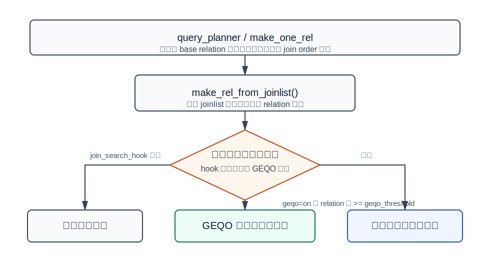
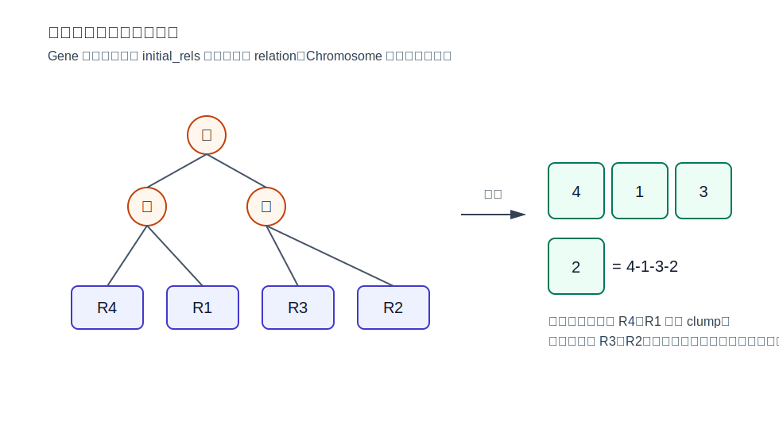
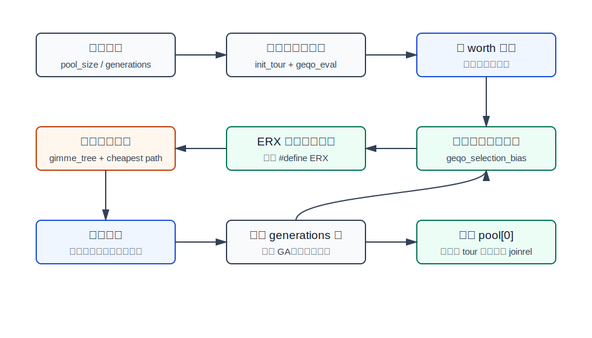
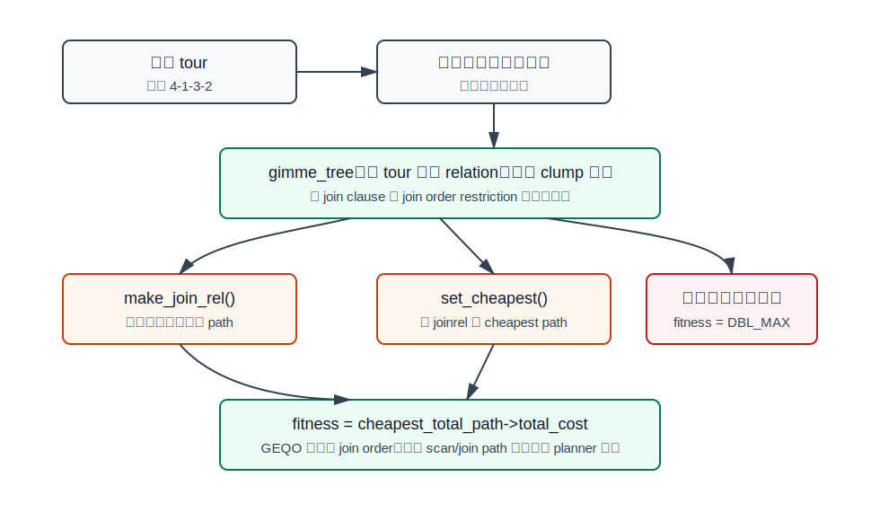
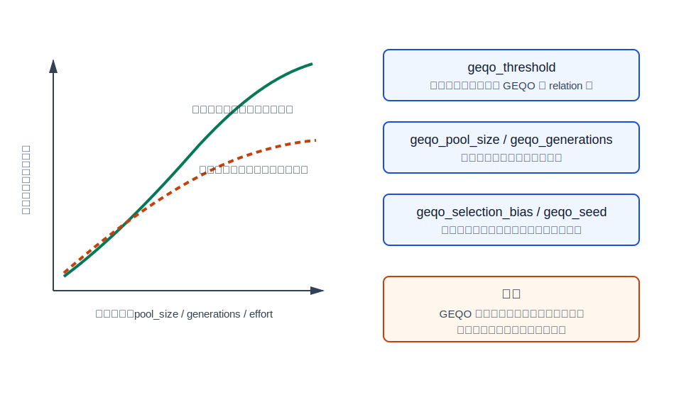

## 数据库筑基课 - 优化器之 GEQO

### 作者
digoal

### 日期
2026-05-31

### 标签
PostgreSQL , 应用开发者 , 数据库筑基课 , 优化器 , GEQO , Join Order , Genetic Algorithm

----

## 背景


本文聚焦 PostgreSQL 的 GEQO，也就是 genetic query optimizer，属于“优化器 / 连接顺序搜索算法”这一类基础能力。

SQL 写得越像报表、风控、权限、推荐、知识图谱或星型模型查询，越容易出现很多表连接。少数几张表时，优化器可以较充分地枚举 join order；十几张、几十张表时，连接顺序空间会快速膨胀。此时数据库面临一个现实问题：

- 用标准动态规划继续搜，规划时间和内存可能爆炸。
- 提前放弃搜索，执行阶段可能拿到很差的 join order。
- 让应用强制指定 join 顺序，又会把数据分布变化的风险转嫁给开发者。

GEQO 的工程取舍就是：当 join relation 数达到阈值后，不再近穷举连接顺序，而是用随机启发式搜索在有限规划时间内找一个“足够好”的计划。它不是让 PostgreSQL 变聪明的魔法，而是给大 join 查询一个可控的规划时间上限。

本文的基本假设：

- 你已经理解 CBO 会用代价模型比较 scan path、join path 和 join order。
- 你关心 PostgreSQL 的真实实现，而不是只记“遗传算法 = 选择、交叉、变异”。
- 本文不伪造 benchmark 数字。示例 SQL 是可执行实验模板，但本轮没有启动 PostgreSQL 实例执行。

## 一、它解决什么问题？

GEQO 解决的是“大量表连接时，join order 搜索空间过大”的问题。

假设一个查询连接 12 张表。哪怕只考虑连接顺序，不考虑每一步的 Nested Loop、Hash Join、Merge Join、索引路径、排序路径、并行路径，候选空间也已经很大。PostgreSQL 标准 join 搜索使用动态规划：先构造二元 joinrel，再构造三元 joinrel，逐层向上构造最终 joinrel。这个方法能系统地复用子问题结果，但 relation 数上来后，joinrel 和 path 数量都会迅速增加。

PostgreSQL 官方开发文档说得很直接：少于 `geqo_threshold` 个 relation 时，会进行近穷举搜索；超过阈值后，join sequence 由启发式方法决定。运行时配置文档也说明，对于很多表的查询，穷举搜索可能太慢，甚至比执行一个次优计划造成的损失更大。

GEQO 把问题改写成：

```text
原问题：在巨大 join order 空间里找全局最优计划
转化后：随机生成和演化一批 join order，在限定评价次数内保留低成本候选
代价：不保证最优；同一查询可能因 geqo_seed 和参数不同探索到不同路径
收益：规划时间和内存更可控，大 join 查询不会轻易卡死在优化阶段
```

这也是 DBA 需要理解 GEQO 的原因：很多“偶发慢 SQL”不是执行器突然变慢，而是大 join 查询进入 GEQO 后，探索到的 join order 质量变化了。

## 二、它是什么？

GEQO 是 PostgreSQL 优化器中的一个 join order 搜索模块。它不替代整个 CBO，也不替代 scan/join path 的代价估计。

更精确地说：

- 标准 planner 仍然负责 base relation 的 scan path，例如 Seq Scan、Index Scan、Bitmap Scan。
- GEQO 负责给多表连接提供候选 relation 顺序，也就是一个 tour。
- 每个 tour 会交给标准 planner 的 join 构造和 cost 逻辑评价。
- 成本最低的 tour 被视为更“适应环境”，最终用当前种群里最优的 tour 生成 finished join relation。

PostgreSQL 源码里，GEQO 的核心文件包括：

| 文件 | 作用 |
|---|---|
| `src/backend/optimizer/path/allpaths.c` | 在 `make_rel_from_joinlist()` 中决定使用 hook、GEQO 还是 `standard_join_search()` |
| `src/backend/optimizer/geqo/geqo_main.c` | GEQO 主循环，初始化种群、选择父代、重组、评价、替换 |
| `src/backend/optimizer/geqo/geqo_eval.c` | 把一个 tour 变成 join tree，并用 cheapest path 的 total cost 作为 fitness |
| `src/backend/optimizer/geqo/geqo_pool.c` | 管理种群，随机初始化、排序、把子代插回种群 |
| `src/backend/optimizer/geqo/geqo_selection.c` | 按线性偏置从种群中选择父代 |
| `src/backend/optimizer/geqo/geqo_erx.c` | 默认 ERX，edge recombination crossover |
| `src/include/optimizer/geqo_gene.h` | 定义 `Gene`、`Chromosome`、`Pool` |
| `src/backend/utils/misc/guc_parameters.dat` | 定义 `geqo`、`geqo_threshold`、`geqo_effort` 等 GUC |

关键数据结构很小：

```c
typedef int Gene;

typedef struct Chromosome
{
    Gene   *string;
    Cost    worth;
} Chromosome;

typedef struct Pool
{
    Chromosome *data;
    int         size;
    int         string_length;
} Pool;
```

这里的 `Gene` 是整数，代表 `initial_rels` 里的第几个 relation；`Chromosome` 是一个完整 join order；`worth` 是这个候选顺序被评价出来的成本，越小越好。

## 三、核心原理



图 1 说明：GEQO 只接管 join order search 这一段。`make_rel_from_joinlist()` 会先看是否存在 `join_search_hook`，否则在 `enable_geqo` 为真且 `levels_needed >= geqo_threshold` 时调用 `geqo()`；不满足条件则走 `standard_join_search()`。

### 3.1 触发条件：relation 数达到阈值

源码入口在 `src/backend/optimizer/path/allpaths.c`：

```c
if (join_search_hook)
    return (*join_search_hook) (root, levels_needed, initial_rels);
else if (enable_geqo && levels_needed >= geqo_threshold)
    return geqo(root, levels_needed, initial_rels);
else
    return standard_join_search(root, levels_needed, initial_rels);
```

默认配置来自 `src/backend/utils/misc/guc_parameters.dat` 和 `postgresql.conf.sample`：

| 参数 | 默认值/范围 | 含义 |
|---|---:|---|
| `geqo` | `on` | 是否启用 genetic query optimization |
| `geqo_threshold` | 默认 `12`，最小 `2` | FROM item 达到该阈值后使用 GEQO |
| `geqo_effort` | 默认 `5`，范围 `1..10` | 不直接搜索，只用于推导默认 pool/generation |
| `geqo_pool_size` | 默认 `0` | 种群个体数；0 表示按 effort 和表数推导 |
| `geqo_generations` | 默认 `0` | 迭代次数；0 表示按 pool size 推导 |
| `geqo_selection_bias` | 默认 `2.0`，范围 `1.5..2.0` | 选择压力，越偏向低成本个体 |
| `geqo_seed` | 默认 `0.0`，范围 `0.0..1.0` | 随机数种子，影响探索路径和可复现性 |

注意 `join_collapse_limit` 和 `from_collapse_limit` 也会间接影响 GEQO：它们控制显式 JOIN 或子查询是否被折叠成更大的 FROM list。官方文档提醒，把这些值设到 `geqo_threshold` 或更高，可能触发 GEQO，并带来非最优计划。

### 3.2 编码：把 join order 当成 TSP tour



图 2 说明：PostgreSQL GEQO 把候选计划编码为整数串。文档中的例子 `4-1-3-2` 表示先尝试处理 relation 4 和 1，再按序加入 3 和 2。这个序列不是最终执行计划树的完整物理描述，而是生成 join tree 的指南。

PostgreSQL 文档把 GEQO 类比为旅行商问题 TSP：一个 tour 访问每个 relation 一次。这个类比适合遗传算法编码，但也有局限。官方 GEQO 文档在“Future Implementation Tasks”里指出：TSP 的子串成本可以独立于 tour 其他部分，但查询优化不是这样；一个 join 子树的成本和上层选择、谓词、外连接约束、参数化路径等都可能相关。因此，GEQO 是工程启发式，不是理论上天然匹配 join optimization 的完美模型。

### 3.3 主循环：稳态遗传算法



图 3 说明：PostgreSQL GEQO 使用稳态 GA。它不是每一代整体替换种群，而是选择父代、生成一个子代、评价子代，然后把足够好的子代插回已排序种群，挤掉最差个体。

`geqo_main.c` 的流程可以简化为：

```text
1. geqo_set_seed(root, Geqo_seed)
2. pool_size = gimme_pool_size(number_of_rels)
3. generations = gimme_number_generations(pool_size)
4. random_init_pool(): 随机生成 tour，并立即用 geqo_eval 评价
5. sort_pool(): worth 从小到大排序
6. 循环 generations 次：
   a. geqo_selection(): 按 selection_bias 选两个父代
   b. ERX: 用 edge recombination crossover 生成子代 tour
   c. geqo_eval(): 计算子代 worth
   d. spread_chromo(): 若子代不差于最差个体，插回种群
7. 用 pool[0] 的 best_tour 生成最终 joinrel
```

默认重组机制在 `src/include/optimizer/geqo.h` 中是：

```c
#define ERX
```

源码里也保留了 PMX、CX、PX、OX1、OX2 等重组实现，但当前编译选择的是 ERX。官方文档称 PostgreSQL 的 GEQO 使用 steady-state GA 和 edge recombination crossover，部分代码源自 Darrell Whitley 的 Genitor 算法。

### 3.4 参数推导：默认 pool 和 generation

如果没有手工设置 `geqo_pool_size`，`gimme_pool_size()` 会先按 `2^(nr_rel + 1)` 估一个规模，再被 `geqo_effort` 限制在一个范围内：

```text
maxsize = 50 * geqo_effort   -- effort=5 时上限 250
minsize = 10 * geqo_effort   -- effort=5 时下限 50
```

如果没有手工设置 `geqo_generations`，默认等于 `pool_size`。因此默认情况下，GEQO 的评价次数大致是：

```text
初始种群评价次数 pool_size + 迭代评价次数 pool_size
```

这不是严格执行时间公式，因为每次 `geqo_eval()` 的成本取决于 relation 数、join 约束、path 构造、统计估计、内存上下文分配等因素。但它能帮助 DBA 理解一个直接关系：调大 pool 或 generations，规划阶段会做更多候选评价，计划质量可能提高，规划时间也会上升。

### 3.5 评价：GEQO 不自己估成本，仍调用标准 planner



图 4 说明：`geqo_eval()` 的关键不是自己发明一套成本模型，而是用 tour 指导 `gimme_tree()` 构造 join relation，再读取 `joinrel->cheapest_total_path->total_cost` 作为 fitness。也就是说，GEQO 负责“搜哪些顺序”，标准 CBO 负责“这个顺序下有哪些物理路径，成本是多少”。

`geqo_eval.c` 有几个工程细节很重要：

- 每次评价会创建一个名为 `GEQO` 的临时内存上下文，评价结束后删除，避免大量候选评价污染整个 planner 生命周期。
- `gimme_tree()` 会把 tour 作为 guideline，而不是死板照单执行。
- 它维护一组已经连接的 `clump`，新 relation 会尝试并入已有 clump。
- `desirable_join()` 优先接受有相关 join clause 或 join order restriction 的连接。
- 如果 tour 暂时无法形成理想连接，会推迟；最后仍有多个 clump 时，会尝试 force join。
- 如果不能形成单个合法 join relation，`geqo_eval()` 返回 `DBL_MAX`，表示极差候选。

这解释了一个容易误解的点：GEQO 的整数串不是“绝对执行顺序”。现实 SQL 里有 outer join、LATERAL、semijoin、antijoin、join clause 分布、笛卡尔连接等约束，`gimme_tree()` 必须修正或拒绝不合法顺序。源码注释也承认，当前启发式在某些 LATERAL 约束下仍可能失败。

### 3.6 随机性：可复现，但不是穷举

GEQO 是随机启发式搜索，但 PostgreSQL 为它提供了可复现控制。`geqo_set_seed(root, Geqo_seed)` 会在每次 GEQO 运行前用当前 `geqo_seed` 初始化私有随机数状态。官方文档明确说明：只要 `geqo_seed` 和其他 GEQO 参数固定，同一个查询在统计信息等 planner 输入不变时会生成同样计划；想探索其他路径，可以修改 `geqo_seed`。

这对排障很实用：

- 如果大 join SQL 在 GEQO 下计划不稳定，先固定 `geqo_seed` 做对比。
- 如果某个 seed 下计划很差，可以尝试不同 seed 验证是否存在更好 join order。
- 不要把“换 seed 变快”当成根治方案。它只说明搜索空间里有更好候选，真正稳定的办法通常是改善统计、缩小 join 搜索空间、重写 SQL 或调整 schema/index。

## 四、横向对比

| 维度 | PostgreSQL 标准 join search | PostgreSQL GEQO | 手工指定 JOIN 顺序 | Volcano/Cascades 类优化器 |
|---|---|---|---|---|
| 主要目标 | 系统枚举较小 join 空间 | 控制大 join 查询规划成本 | 把顺序选择交给人 | 用规则、memo、property 组织可扩展搜索 |
| 搜索方式 | 动态规划，逐层构造 joinrel | 随机初始化 + 选择 + 重组 + 评价 | `join_collapse_limit=1` 等约束优化器 | 逻辑/物理转换规则 + cost bound |
| 最优性 | 小规模下更接近最优 | 不保证最优 | 取决于人和数据分布 | 取决于规则、剪枝和搜索预算 |
| 规划时间 | relation 数增多后增长很快 | 由 pool/generation 控制 | 通常较低 | 取决于实现和搜索策略 |
| 对统计信息依赖 | 高 | 高，评价仍使用 CBO | 仍依赖单步 path 成本 | 高 |
| 适合场景 | 普通 OLTP/OLAP SQL | 大量表连接、规划时间不可接受 | 少数关键 SQL，已明确更优顺序 | 商业数据库或研究系统的通用优化框架 |
| 风险 | 规划阶段太重 | 探索不到好顺序 | 数据变化后人工顺序过期 | 实现复杂度高 |

表里的关键点是：GEQO 和标准 join search 不是“一个聪明、一个笨”的关系。它们共享 PostgreSQL 的代价模型和 path 生成能力，区别在于 join order 搜索策略。GEQO 的价值是用搜索质量换规划可控性。

## 五、效果如何？

GEQO 的收益主要在规划阶段：

- 避免大量 relation 的 join order 动态规划爆炸。
- 把候选评价次数约束在 pool 和 generation 参数附近。
- 让大 join 查询有机会在合理时间内完成规划。

它的成本也很明确：

- 可能错过标准搜索能找到的更优 join order。
- 计划质量受随机路径、种群大小、迭代次数、统计信息质量共同影响。
- 对复杂约束查询，tour 只是 guideline，`gimme_tree()` 的启发式可能失败或被迫产生不理想连接。
- 调大 GEQO 参数会增加规划时间，但不保证线性提高计划质量。



图 5 说明：`geqo_effort`、`geqo_pool_size`、`geqo_generations` 增大，会提高搜索覆盖和找到好计划的概率，但也会增加规划时间。它不是“越大越好”的参数，而是需要按 workload 设预算。

PostgreSQL 官方 GEQO 文档还指出两个未来改进方向，本质上也是当前边界：

1. 每个候选 join sequence 都会从头调用标准 planner 的 join selection 和 cost estimation，类似子连接会重复计算；缓存子连接成本可能加速，但会消耗更多内存。
2. 用 TSP 的遗传算法处理查询优化是否合适并不确定，因为查询优化中的子序列成本不独立于整体上下文。

这两点非常重要：GEQO 是成熟系统里的务实模块，不是学术上已经终结的最优答案。

## 六、实操 DEMO

下面给一个最小实验模板，用来观察 GEQO 是否触发，以及不同 seed 是否影响计划。示例 SQL 未在本轮执行。

### 6.1 构造多表连接

```sql
DROP SCHEMA IF EXISTS geqo_demo CASCADE;
CREATE SCHEMA geqo_demo;
SET search_path = geqo_demo;

CREATE TABLE t1  (id int PRIMARY KEY, v int);
CREATE TABLE t2  (id int PRIMARY KEY, v int);
CREATE TABLE t3  (id int PRIMARY KEY, v int);
CREATE TABLE t4  (id int PRIMARY KEY, v int);
CREATE TABLE t5  (id int PRIMARY KEY, v int);
CREATE TABLE t6  (id int PRIMARY KEY, v int);
CREATE TABLE t7  (id int PRIMARY KEY, v int);
CREATE TABLE t8  (id int PRIMARY KEY, v int);
CREATE TABLE t9  (id int PRIMARY KEY, v int);
CREATE TABLE t10 (id int PRIMARY KEY, v int);
CREATE TABLE t11 (id int PRIMARY KEY, v int);
CREATE TABLE t12 (id int PRIMARY KEY, v int);

INSERT INTO t1  SELECT g, g % 100 FROM generate_series(1, 10000) g;
INSERT INTO t2  SELECT g, g % 100 FROM generate_series(1, 10000) g;
INSERT INTO t3  SELECT g, g % 100 FROM generate_series(1, 10000) g;
INSERT INTO t4  SELECT g, g % 100 FROM generate_series(1, 10000) g;
INSERT INTO t5  SELECT g, g % 100 FROM generate_series(1, 10000) g;
INSERT INTO t6  SELECT g, g % 100 FROM generate_series(1, 10000) g;
INSERT INTO t7  SELECT g, g % 100 FROM generate_series(1, 10000) g;
INSERT INTO t8  SELECT g, g % 100 FROM generate_series(1, 10000) g;
INSERT INTO t9  SELECT g, g % 100 FROM generate_series(1, 10000) g;
INSERT INTO t10 SELECT g, g % 100 FROM generate_series(1, 10000) g;
INSERT INTO t11 SELECT g, g % 100 FROM generate_series(1, 10000) g;
INSERT INTO t12 SELECT g, g % 100 FROM generate_series(1, 10000) g;

ANALYZE;
```

### 6.2 强制低阈值触发 GEQO

```sql
SET geqo = on;
SET geqo_threshold = 4;
SET geqo_seed = 0.0;

EXPLAIN (VERBOSE, COSTS ON, SETTINGS ON)
SELECT count(*)
FROM t1
JOIN t2  USING (id)
JOIN t3  USING (id)
JOIN t4  USING (id)
JOIN t5  USING (id)
JOIN t6  USING (id)
JOIN t7  USING (id)
JOIN t8  USING (id)
JOIN t9  USING (id)
JOIN t10 USING (id)
JOIN t11 USING (id)
JOIN t12 USING (id)
WHERE t1.v = 42;
```

观察点：

- `EXPLAIN ... SETTINGS ON` 应能显示非默认 planner 参数，例如 `geqo_threshold`、`geqo_seed`。
- 多次固定 `geqo_seed` 重复执行，计划应保持可复现，前提是统计信息和环境不变。
- 改成 `SET geqo_seed = 0.7;` 后再次 `EXPLAIN`，可能看到不同 join order，也可能因为数据太规则而没有明显差异。

### 6.3 对比标准搜索

```sql
SET geqo = off;

EXPLAIN (VERBOSE, COSTS ON, SETTINGS ON)
SELECT count(*)
FROM t1
JOIN t2  USING (id)
JOIN t3  USING (id)
JOIN t4  USING (id)
JOIN t5  USING (id)
JOIN t6  USING (id)
JOIN t7  USING (id)
JOIN t8  USING (id)
JOIN t9  USING (id)
JOIN t10 USING (id)
JOIN t11 USING (id)
JOIN t12 USING (id)
WHERE t1.v = 42;
```

不要在生产库随意对超大 join 查询关闭 GEQO。这个实验的目的只是比较计划形态和规划耗时。真实排障时，应使用 `EXPLAIN (ANALYZE, BUFFERS, SETTINGS)` 在可控环境执行，并关注 planning time、execution time、实际行数与估算行数差距。

## 七、最佳实践

### 7.1 给数据库架构师

把 GEQO 当作复杂模型查询的最后防线，而不是常规调优工具。

推荐做法：

- 对报表、BI、权限展开、宽星型模型、自动生成 SQL 的系统，控制单条 SQL 的 join relation 数。
- 通过物化中间结果、预聚合、宽表、语义层拆分、分阶段查询，减少一次性 join 搜索空间。
- 对 ORM 或查询生成器设置上限，避免动态拼出几十张表的单 SQL。
- 对关键查询建立可重复的计划回归测试，至少记录 `EXPLAIN (SETTINGS, COSTS)` 和主要 join order。

原因：GEQO 可以让大 join SQL 不至于规划爆炸，但它不能保证每次都找到业务上最优的连接路径。

### 7.2 给 DBA

调 GEQO 前，先确认慢在 planning 还是 execution。

推荐排查路径：

1. 用 `EXPLAIN (ANALYZE, BUFFERS, SETTINGS)` 看 planning time、execution time、参数和实际行数误差。
2. 如果 planning time 占比高，检查 relation 数、`join_collapse_limit`、`from_collapse_limit`、`geqo_threshold`。
3. 如果 execution time 高，先看 rows 估计是否偏差巨大，再看 join method 和索引路径。
4. 对 GEQO 计划质量问题，固定 `geqo_seed`，再尝试不同 seed、pool、generation 做对照。
5. 如果某个 SQL 极关键，可以在会话级临时调整参数，不建议全库盲目改。

常见参数策略：

- 想减少进入 GEQO：提高 `geqo_threshold`，但要接受更高规划成本。
- 想让 GEQO 多探索：提高 `geqo_pool_size` 或 `geqo_generations`，但要接受更长 planning time。
- 想降低自动展开导致的搜索空间：降低 `join_collapse_limit` 或 `from_collapse_limit`。
- 想验证人工 join 顺序：设置 `join_collapse_limit = 1`，用显式 JOIN 固定顺序做实验。

### 7.3 给业务开发者

不要把 GEQO 问题理解成“数据库不行”。它通常是 SQL 复杂度、数据分布和搜索预算共同作用的结果。

建议：

- 不要一次性把权限、标签、画像、事实表、维表、明细表全部拼成一个无限膨胀的 SQL。
- 对自动生成 SQL，限制可选维度数量，必要时先落临时表或物化视图。
- 避免无谓的笛卡尔连接和缺失 join 条件。
- 给高选择性过滤条件建立合适索引，并及时 `ANALYZE`。
- 当 DBA 要求提供业务选择性、字段相关性和典型参数时，不要只给 SQL 模板；实际参数分布会影响计划。

## 八、适合与不适合场景

适合 GEQO 的场景：

- 查询连接 relation 数很多，标准 join search 规划时间明显不可接受。
- SQL 来自报表、BI、规则引擎、知识库推理、自动查询生成器。
- 业务能接受启发式计划，只要求整体规划时间可控。
- 查询不是极端延迟敏感的点查，而是复杂分析或管理后台查询。

不适合依赖 GEQO 的场景：

- 少数核心交易 SQL，延迟和计划稳定性要求极高。
- 连接数其实不多，真正问题是统计信息过期、索引缺失或谓词不可优化。
- 多表连接存在强相关、严重倾斜，但没有合适统计信息支撑。
- 应用把几十个可选维度全部拼进一条 SQL，并期望数据库自动永远选对。
- 你需要严格可解释和可预测的 join order，却没有计划回归测试。

一句话：GEQO 是“大 join 查询规划成本”的保险丝，不是“坏 SQL 自动变好”的优化器外挂。

## 九、常见坑

### 9.1 只调 `geqo_seed`，不修统计信息

换 seed 可能让某条 SQL 变快，但它只是换了一条随机探索路径。如果根因是 rows 估计错，换 seed 只能碰运气。应同时检查 `ANALYZE`、扩展统计信息、数据倾斜、过滤条件选择率和索引设计。

### 9.2 全库关闭 GEQO

`SET geqo = off` 对实验有用，但全局关闭可能让大 join 查询在规划阶段消耗巨大时间和内存。生产环境应按 SQL、角色、会话或数据库粒度谨慎设置。

### 9.3 把 `geqo_effort` 当成直接开关

官方文档明确说，`geqo_effort` 本身不直接做搜索，只用于计算其他 GEQO 参数的默认值。如果你已经手工设置了 `geqo_pool_size` 和 `geqo_generations`，再调 `geqo_effort` 未必产生你预期的效果。

### 9.4 忽略 `join_collapse_limit`

显式 JOIN 默认仍可能被优化器重排。若你想验证人工 join 顺序，必须理解 `join_collapse_limit`。设为 1 可以阻止显式 JOIN 被重排，但这也会把计划质量风险交给 SQL 写法。

### 9.5 忽略 planning time

很多排障只看 execution time。GEQO 的价值和风险都在 planning 阶段，必须看 `EXPLAIN (ANALYZE, SETTINGS)` 或日志中的 planning time。

### 9.6 期待 GEQO 解决所有多表问题

GEQO 只影响 join order 搜索。它不能自动修复错误的 join 条件、缺失索引、过期统计、表达式不可索引、隐式类型转换、数据倾斜、work_mem 不足、IO 瓶颈。

## 十、扩展问题

1. 如果一个 15 表查询进入 GEQO 后偶发慢，你会先固定 `geqo_seed`，还是先提高 `geqo_pool_size`？为什么？
2. 为什么 `gimme_tree()` 不应该机械执行 tour，而要根据 join clause、join order restriction 和合法性推迟某些连接？
3. 如果 `geqo_pool_size` 从 250 提到 1000，规划时间、计划质量、稳定性分别可能如何变化？
4. 为什么 TSP 的 edge recombination crossover 不一定天然适合 join optimization？
5. 对 ORM 自动生成的超大 SQL，应该优先改数据库参数，还是优先约束 SQL 生成器？边界在哪里？

## 十一、扩展阅读

- PostgreSQL 官方文档：[Genetic Query Optimizer](https://www.postgresql.org/docs/current/geqo.html)，本地对应 `doc/src/sgml/geqo.sgml`。
- PostgreSQL 官方文档：[Query Planning / GEQO configuration](https://www.postgresql.org/docs/current/runtime-config-query.html)，本地对应 `doc/src/sgml/config.sgml`，覆盖 `geqo`、`geqo_threshold`、`geqo_effort`、`geqo_pool_size`、`geqo_generations`、`geqo_selection_bias`、`geqo_seed`、`join_collapse_limit`、`from_collapse_limit`。
- PostgreSQL 源码：`src/backend/optimizer/path/allpaths.c`，`make_rel_from_joinlist()` 与 GEQO 触发逻辑。
- PostgreSQL 源码：`src/backend/optimizer/geqo/geqo_main.c`，GEQO 主循环和默认参数推导。
- PostgreSQL 源码：`src/backend/optimizer/geqo/geqo_eval.c`，候选 tour 的评价逻辑。
- PostgreSQL 源码：`src/include/optimizer/geqo_gene.h`，`Gene`、`Chromosome`、`Pool` 数据结构。
- PostgreSQL 源码：`src/backend/optimizer/geqo/geqo_erx.c`，edge recombination crossover 实现。
- DeepWiki：`postgres/postgres`，用于交叉理解 optimizer/geqo 模块结构；关键事实已回到本地源码和官方文档核验。
- Ioannidis, Y. E., Kang, Y. C. *Randomized Algorithms for Optimizing Large Join Queries*, SIGMOD 1990。
- Bennett, K. P., Ferris, M. C., Ioannidis, Y. E. *A Genetic Algorithm for Database Query Optimization*, 1991；也可对应阅读题名相近的 *Genetic Query Optimization in Database Systems* 资料。
- Whitley, D., Starkweather, T., Fuquay, D. *Scheduling Problems and Traveling Salesmen: The Genetic Edge Recombination Operator*, 1989；以及 *Genetic Algorithms for Ordering, Sequence, and Serialization Problems* 相关工作。
- Bauer, R. J. *Genetic Algorithms and Investment Strategies*, 1994。它不是数据库论文，但可作为遗传算法在组合搜索问题中应用和调参风险的旁证阅读。
  
## 附录 
1、问 gemini
```
PostgreSQL 数据库 GEQO 优化器相关的论文
```

2、克隆代码  
```  
git clone --depth 1 https://github.com/postgres/postgres
```  
  
3、启用 codex, 使用 [数据库筑基课 skill](../skills/README.md).  
```
文章标题: 
  数据库筑基课 - 优化器之 GEQO
项目源码(本地目录):  
  postgres
项目 codebase 文件名: 
  postgres/CLAUDE.md
相关的论文或文档名:
  Genetic Algorithms & Investment Strategies
  Randomized Algorithms for Optimizing Large Join Queries
  Genetic Query Optimization in Database Systems
  Genetic Algorithms for Ordering, Sequence, and Serialization Problems
开源项目相关的 deepwiki repoName: 
  postgres/postgres
```
  
  
#### [PostgreSQL 解决方案集合](../201706/20170601_02.md "40cff096e9ed7122c512b35d8561d9c8")
  
  
#### [德哥 / digoal's Github - 公益是一辈子的事.](https://github.com/digoal/blog/blob/master/README.md "22709685feb7cab07d30f30387f0a9ae")
  
  
#### [About 德哥](https://github.com/digoal/blog/blob/master/me/readme.md "a37735981e7704886ffd590565582dd0")
  
  

  
