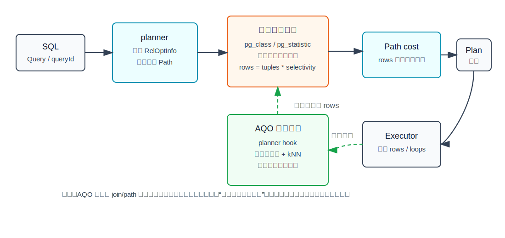
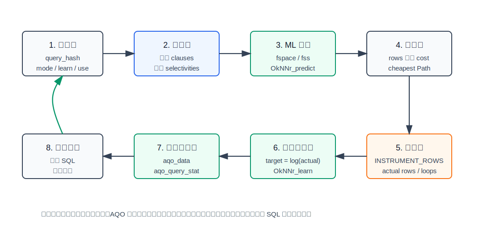
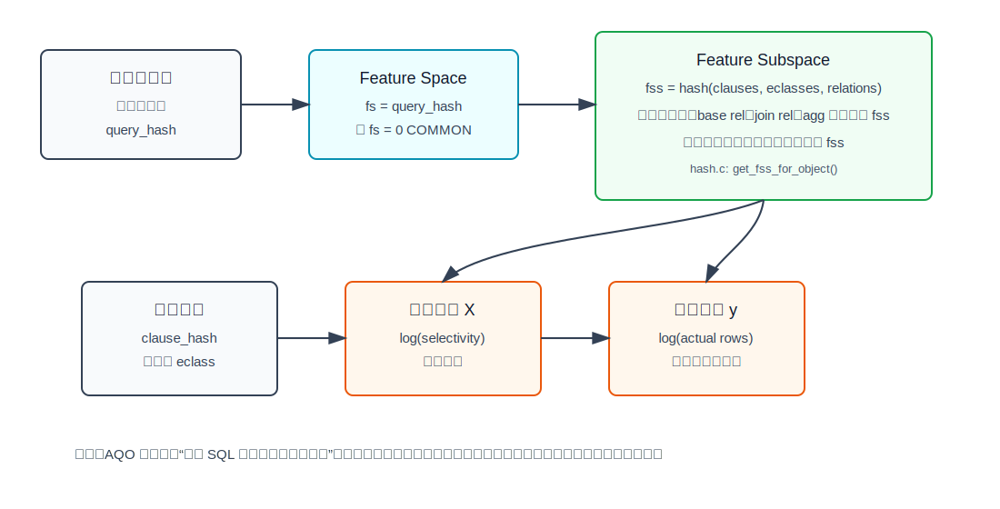
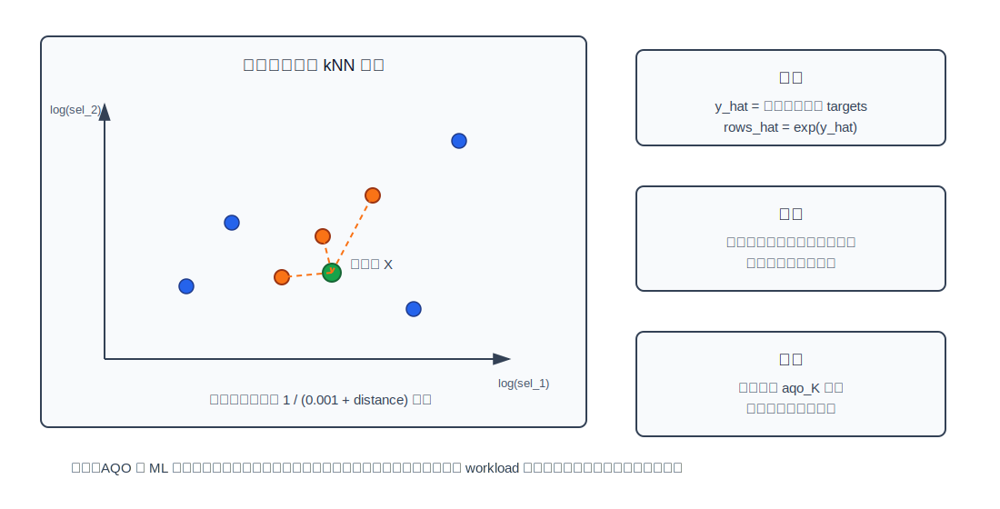
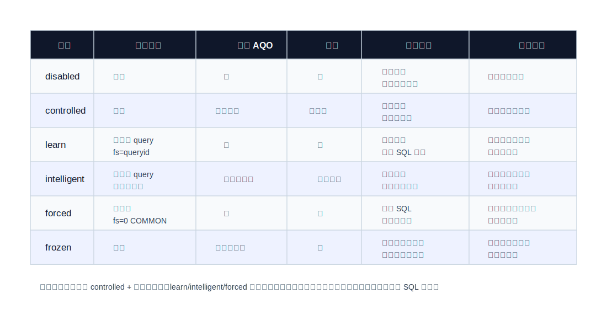

## 数据库筑基课 - 优化器之 AQO(Adaptive Query Optimization)

### 作者
digoal

### 日期
2026-05-31

### 标签
PostgreSQL , 应用开发者 , 数据库筑基课 , 优化器 , AQO , Adaptive Query Optimization , Cardinality Estimation , Learned Optimizer  

----

## 背景

  
本文聚焦 AQO，也就是 adaptive query optimization，属于“优化器 / 基数估算 / 扫描与执行规划机制”这一类基础能力。

CBO 的核心公式很朴素：生成候选路径，估算每条路径会输出多少行，再用行数驱动成本模型选择计划。现实问题是，复杂 SQL 里最容易错的也正是“输出多少行”。

一个典型症状是：

```text
优化器估计某个 join 只输出 1 行
实际执行时输出 10 万行
优化器因此选择 Nested Loop
执行阶段把内表访问放大成灾难
```

传统 PostgreSQL 会用 `pg_class`、`pg_statistic`、扩展统计信息、选择率函数、外键选择率等机制估计行数。它已经很成熟，但仍然有天然边界：多表相关性、复杂谓词、函数表达式、数据倾斜、业务参数组合、统计信息过期，都可能让估计误差跨 join tree 放大。

AQO 的直觉是：既然数据库已经执行过类似 SQL，为什么不把上次真实的 `actual rows` 反馈给下次规划？这就是本文要讲的“优化器学习闭环”。

本文的基本假设：

- 你已经理解 PostgreSQL CBO 的 `RelOptInfo`、`Path`、`rows`、`cost` 和 `EXPLAIN ANALYZE`。
- 你关心 PostgreSQL/AQO 源码里的真实工程边界，而不是只记“机器学习优化器更智能”。
- 本文不伪造 benchmark 数字。文中的 SQL 是可执行实验模板，但本轮没有启动 PostgreSQL 实例执行。

## 一、它解决什么问题？

AQO 解决的是“传统基数估算对某类重复查询长期估不准”的问题。

假设一个业务系统有固定查询模板：

```sql
SELECT *
FROM orders o
JOIN order_items i ON i.order_id = o.id
JOIN customers c ON c.id = o.customer_id
WHERE c.city = $1
  AND o.created_at >= $2
  AND i.sku = $3;
```

不同用户、城市、SKU、时间窗口会传入不同常量。语法结构相同，但选择率组合可能非常不均匀：

- 某些城市订单极少，某些城市订单极多。
- 某些 SKU 是长尾，某些 SKU 是爆品。
- `city`、`sku`、`created_at` 之间可能存在业务相关性。
- 单列统计信息知道每列分布，却未必知道这些条件组合后的真实行数。

传统优化器通常只能基于统计信息和独立性假设推断。AQO 把问题改写成：

```text
原问题：只靠预先统计信息估算本次查询的 rows
转化后：用历史执行反馈学习“相似谓词结构 + 当前选择率特征 -> 实际 rows”
收益：相似查询重复出现时，rows 可能越来越贴近真实值
代价：需要训练样本、共享内存、执行期采集、模型维护，以及生产治理
```

它不是用 ML 直接生成计划，也不是保证每条 SQL 变快。AQO 的源码和 README 都把核心目标限定在 cardinality estimation，也就是改善 planner 用到的行数估计；最终是否换成更好计划，仍然取决于 PostgreSQL 原有 path 搜索和 cost model。

## 二、它是什么？

AQO 是一个 PostgreSQL 扩展加 PostgreSQL 源码补丁的组合。README 明确说，它不只是普通 `CREATE EXTENSION` 插件：需要把 AQO 放到 `contrib/aqo`，对 PostgreSQL 源码应用补丁并重新编译，然后通过 `shared_preload_libraries = 'aqo'` 在实例启动时加载。原因是 AQO 要在 planner/executor 关键路径上挂 hook，并使用共享内存保存知识库。

从架构上看，AQO 包含几部分：

| 模块 | 源码文件 | 作用 |
|---|---|---|
| 初始化与 GUC | `aqo/aqo.c` | 定义 `aqo.mode`、`aqo.show_details`、`aqo.k` 等参数，注册 hook，申请共享内存 |
| 查询预处理 | `aqo/preprocessing.c` | 计算 `query_hash`，查找或创建 `aqo_queries` 设置，决定 `learn_aqo`、`use_aqo`、`feature space` |
| 基数估算 hook | `aqo/cardinality_hooks.c` | 拦截 base rel、join rel、parameterized path、group 数估计 |
| 特征与哈希 | `aqo/hash.c` | 把 clauses、等价类、关系集合、selectivity 转成 feature subspace 和特征向量 |
| ML 预测 | `aqo/cardinality_estimation.c`、`aqo/machine_learning.c` | 用 kNN 变体预测 `log(rows)`，再 `exp()` 回行数 |
| 执行反馈 | `aqo/postprocessing.c` | 打开 `INSTRUMENT_ROWS`，执行后遍历 `PlanState`，采集真实 rows 并学习 |
| 存储 | `aqo/storage.c`、`aqo/storage.h`、`aqo/aqo_shared.c` | 保存 query text、query settings、执行统计和 ML 数据 |
| 自动调优 | `aqo/auto_tuning.c` | 根据有无 AQO 的执行时间与估算误差，调整 `learn_aqo` 和 `use_aqo` |



图 1 说明：AQO 位于“行数估算”这一层。它不替代 parser，不替代 join order/path 生成，也不替代 executor。它影响 `RelOptInfo->rows`、`Path->rows` 或 group cardinality，进而影响成本模型和最终计划选择。

## 三、核心原理

### 3.1 PostgreSQL 原生估算入口

理解 AQO 前，先看 PostgreSQL 原生入口。

PostgreSQL 对 base relation 的估计入口在 `src/backend/optimizer/path/costsize.c`：

```text
set_baserel_size_estimates()
  rel->rows = rel->tuples * clauselist_selectivity(...)
```

join relation 的估计入口在同一文件：

```text
set_joinrel_size_estimates()
  rel->rows = calc_joinrel_size_estimate(...)
```

`clauselist_selectivity()` 位于 `src/backend/optimizer/path/clausesel.c`。它会尝试使用扩展统计信息，处理范围条件，然后把剩余条件的选择率组合起来。PostgreSQL 官方文档也说明，统计信息来自 `pg_class`、`pg_statistic` 和扩展统计对象，`ANALYZE` 负责采样更新。

AQO 的补丁在这些入口周围加了 hook。`aqo/aqo_master.patch` 显示它增加了：

- `set_baserel_rows_estimate_hook`
- `get_parameterized_baserel_size_hook`
- `set_joinrel_size_estimates_hook`
- `get_parameterized_joinrel_size_hook`

并在 `RelOptInfo` 中增加了 AQO 需要的字段，例如 `predicted_cardinality` 和 `fss_hash`。这就是为什么 AQO 需要 patched PostgreSQL，而不是单纯 SQL extension。

### 3.2 查询类型：相同结构，不同常量

AQO 先把查询归为 query type。`aqo/preprocessing.c` 的注释说得很直接：如果两个查询相等，或者只在常量上不同，就认为它们是同一种查询类型。PostgreSQL 的 `queryId` 被用作 `query_context.query_hash`。

例如：

```sql
SELECT * FROM t WHERE a < 10 AND b = 'x';
SELECT * FROM t WHERE a < 20 AND b = 'y';
```

在 AQO 的语义里，它们应该共享一个 query type，因为结构相同，差别只在常量。这样 AQO 才能从一次执行反馈迁移到下一次类似执行。

`preprocessing.c` 还负责决定未知 query type 怎么处理：

- `controlled`：未知查询直接走 PostgreSQL 原生估算。
- `learn`：登记 query type，`learn_aqo=true`、`use_aqo=true`。
- `intelligent`：登记 query type，但先收集非 AQO 执行基线，再由 auto tuning 决定。
- `forced`：不登记每个 query type，统一使用 `fs=0` 的 COMMON feature space。
- `frozen`：只使用已知模型，不继续写入学习结果。
- `disabled`：当前查询禁用 AQO。

### 3.3 规划期：从 clauses 到预测 rows

AQO 的规划期路径以 `aqo/cardinality_hooks.c` 为主。

对 base relation，`aqo_set_baserel_rows_estimate()` 做几件事：

1. 如果当前查询禁用 AQO，直接调用原生估算。
2. 如果 `learn_aqo` 或 `use_aqo` 为真，调用 `get_selectivities()` 取谓词选择率。
3. 如果 `use_aqo=false`，只保留学习需要的信息，然后回退原生估算。
4. 如果 `use_aqo=true`，把 clauses、selectivities、relation signatures 交给 `predict_for_relation()`。
5. 如果预测值非负，把 `rel->rows` 和 `rel->predicted_cardinality` 改成 AQO 预测值。
6. 如果预测失败，回退 PostgreSQL 原生估算。

join relation 的 `aqo_set_joinrel_size_estimates()` 类似，只是它会组合当前 join clauses、outer path clauses、inner path clauses 和对应 selectivities。parameterized baserel/joinrel 也有单独 hook。

这说明 AQO 的工程设计比较保守：模型没有可用样本、样本不足、没有底层 plain table、feature subspace 找不到时，它会拒绝预测并回退原生估算。



图 2 说明：AQO 的价值来自闭环。规划期用模型预测，执行期采集真实行数，后处理把真实行数写回模型。没有重复查询、没有执行反馈、没有稳定结构，就谈不上学习收益。

### 3.4 特征空间：AQO 到底学什么？

AQO 不是直接记住“这个 SQL 用 Hash Join 更快”。它学的是某个关系集合、谓词结构和选择率特征下的真实输出行数。

`aqo/hash.c` 的 `get_fss_for_object()` 把一个计划对象转换成 feature subspace：

- 对每个 clause 计算 `clause_hash`。
- 对等价类计算 `eclass_hash`。
- 对 relation signatures 计算关系集合 hash。
- 组合出 `fss_hash`。
- 把每个选择率转换成 `log(selectivity)`，并用 `log_selectivity_lower_bound` 做下限截断。
- 对相同 clause hash 的常量条件做排序，使特征尽量不受谓词排列顺序影响。

这里有两个层次：

- `feature space`，简称 `fs`：通常对应 query type，也可以多个 query type 共享。
- `feature subspace`，简称 `fss`：对应一个具体 plan object，例如 base relation、join relation 或 group 估算对象。



图 3 说明：同一个 SQL 查询内部可能产生多个 `fss`，因为每个 base rel、join rel、agg 节点面对的 clauses 和 relation 集合不同。AQO 的训练样本实际存储在 `(fs, fss)` 下面。

### 3.5 ML 核心：OkNN 回归器

`aqo/machine_learning.c` 的开头明确说，这个模块“不知道 DBMS、cardinality”，只做矩阵、预测和学习。它实现的是一个有限样本的 kNN 回归变体。

预测过程可以简化为：

```text
输入：features = [log(sel_1), log(sel_2), ...]
读取：当前 (fs, fss) 下的训练矩阵 matrix 和 targets
计算：features 到每个历史样本的 L2 距离
选择：最近的 aqo_k 个样本
加权：weight = 1 / (0.001 + distance)
输出：加权平均 target
返回：rows = exp(target)
```

学习过程可以简化为：

```text
target = log(actual rows)
如果新样本和已有样本距离很小：
    用 learning_rate 做平滑更新
否则如果样本数还没达到 aqo_K：
    追加一行训练样本
否则：
    调整近邻样本，保持矩阵规模不超过 aqo_K
```

这个设计的优点是低开销、增量式、容易和共享内存结合。缺点也明显：它依赖局部相似性，不能像大模型那样从全局 SQL 语义中推理；当 workload 结构漂移、数据分布突变、样本太少或 query type 太分散时，它可能无法泛化。



图 4 说明：AQO 的 kNN 不是魔法。它用“相似选择率特征的历史样本”估算当前行数。样本越贴近当前 workload，预测越可能有用；样本混杂或过期，预测就可能误导 planner。

### 3.6 执行期：从 PlanState 学真实 rows

学习发生在执行之后。`aqo/postprocessing.c` 负责这个闭环。

在 `aqo_ExecutorStart()` 中，如果当前查询需要 AQO、需要学习或强制采集统计，AQO 会打开：

```text
queryDesc->instrument_options |= INSTRUMENT_ROWS
```

执行结束后，AQO 遍历 `PlanState` 树。`learnOnPlanState()` 读取每个节点的 instrumentation：

- `ntuples`
- `nloops`
- parallel worker instrumentation
- 节点是否从未执行
- AQO 当时预测值或 PostgreSQL 原始 `plan_rows`

然后把真实行数转成学习样本：

```text
learn_rows = ntuples / nloops
target = log(learn_rows)
```

如果是 timeout 中的部分执行数据，AQO 会降低可靠性因子 `rfactor`，避免低可信样本强行覆盖完整执行样本。`should_learn()` 里能看到这种逻辑：完整执行用较高 reliability，timeout 部分数据用较低 reliability。

### 3.7 存储：知识库不是系统表本体

AQO 的知识库存放在共享内存和持久化文件中，并通过 SQL 函数/视图暴露。

`aqo/storage.h` 中几个核心结构：

| 结构 | 含义 |
|---|---|
| `QueriesEntry` | 每个 query type 的 `fs`、`learn_aqo`、`use_aqo`、`auto_tuning` |
| `QueryTextEntry` | `queryid -> query text` 映射 |
| `StatEntry` | 有无 AQO 的执行时间、规划时间、估算误差 |
| `DataEntry` | `(fs, fss)` 对应的 feature matrix、targets、reliability、oids |

`aqo/storage.c` 里可以看到持久化文件名：

- `pgaqo_statistics.stat`
- `pgaqo_query_texts.stat`
- `pgaqo_data.stat`
- `pgaqo_queries.stat`

这也是生产治理要注意的地方：AQO 会消耗共享内存和动态共享区域；query type 太多、feature subspace 太多、动态 SQL 结构太散，都会让知识库膨胀。

### 3.8 自动调优：决定是否继续用 AQO

`aqo/auto_tuning.c` 的策略不是“永远相信 AQO”。它会比较有无 AQO 的规划+执行时间，观察估算误差是否收敛，并以探索概率决定下一次是否继续使用 AQO。

简化后的策略：

1. 新 query type 先跑若干次不用 AQO，收集 baseline。
2. 再启用 `use_aqo` 和 `learn_aqo`，直到 cardinality quality 收敛。
3. 比较 AQO 和非 AQO 的执行表现。
4. 如果 AQO 更好，倾向继续使用；如果更差，倾向关闭。
5. 超过最大迭代后仍不值得使用，就把 `auto_tuning`、`learn_aqo`、`use_aqo` 关掉。

这说明 `intelligent` 模式不是“生产无脑开关”，而是一个自动实验器。AQO README 也明确提醒，`intelligent` 不一定总是工作得好，不推荐在生产中完全依赖它。

## 四、横向对比

| 维度 | PostgreSQL 原生统计估算 | PostgreSQL 扩展统计 | AQO kNN | 神经网络 AQO / Learned CE |
|---|---|---|---|---|
| 主要目标 | 用 catalog 统计和选择率函数估算 rows | 捕捉多列相关性、MCV、ndistinct、dependencies | 用历史执行反馈修正相似查询的 rows | 用更强模型学习复杂分布和泛化 |
| 训练来源 | `ANALYZE` 采样 | `CREATE STATISTICS` + `ANALYZE` | `EXPLAIN ANALYZE`/真实执行的 plan node rows | 离线或在线训练数据 |
| 生效层次 | base rel、join rel、group 等传统路径 | 主要改善多列条件和 group 估计 | base rel、join rel、parameterized path、group 估算 hook | 取决于实现 |
| 对重复 workload 依赖 | 低 | 低 | 高 | 通常高 |
| 对动态 SQL 结构 | 友好 | 友好 | `learn/intelligent` 不友好，`forced` 可试 | 取决于模型 |
| 规划开销 | 低到中 | 中 | 中，需查模型和预测 | 可能较高 |
| 执行开销 | 无额外学习 | 无额外学习 | 学习期需 instrumentation 和写模型 | 取决于训练方式 |
| 可解释性 | 高 | 中高 | 中，能看 fss/样本/误差 | 低到中 |
| 主要风险 | 相关性和倾斜估不准 | 覆盖范围有限 | 模型过期、样本污染、内存膨胀 | 训练成本、过拟合、工程复杂 |

表里的重点是：AQO 不是替代 `ANALYZE` 和扩展统计信息。更合理的顺序是：

1. 先保证表统计信息新鲜。
2. 对明显多列相关的业务谓词建立扩展统计信息。
3. 对仍然长期误估、重复出现、执行成本高的 SQL 模板，再考虑 AQO。

## 五、效果如何？

AQO README 给了一个 JOB/IMDB 风格复杂查询示例：原计划由于错误基数估算选择了代价很差的 join 顺序，学习后行数估计和 join 顺序改变，执行时间显著下降。这个例子能说明 AQO 的收益机制，但不能外推成“所有查询都会快几个数量级”。

更工程化地看，AQO 可能带来三类效果：

### 5.1 正收益

- 复杂 join 查询的行数估计更接近真实值。
- join order、join method 或 scan method 因 rows 改善而改变。
- 重复 SQL 模板在训练后趋于稳定。
- `EXPLAIN ANALYZE` 中 estimated rows 和 actual rows 的数量级差距缩小。

### 5.2 中性

- 原生估算已经足够好，AQO 预测不会改变计划。
- AQO 没有足够样本，拒绝预测并回退原生估算。
- 查询执行时间主要受 IO、锁、网络、排序落盘、缓存状态影响，而不是基数估算。

### 5.3 负收益

- 样本来自旧数据分布，模型过期。
- `forced` 模式把不相似查询塞进 COMMON feature space，样本互相污染。
- 学习期开启 instrumentation 和模型更新，增加规划/执行开销。
- AQO 改善 rows，但 PostgreSQL cost model 仍然因为硬件参数、缓存、相关性等原因选错计划。

FOSDEM 2021 的 “Adaptive Query Optimization in PostgreSQL: approaches and challenges” 也强调了 kNN-based AQO 的适用性限制，并介绍了 neural network-based AQO 作为潜在改进方向。这里的判断应保守：当前本地 `aqo` 源码实现的是 kNN 变体，不是神经网络 AQO。

## 六、实操 DEMO

以下是最小实验模板。本轮没有启动 patched PostgreSQL + AQO 实例，所以没有执行输出；请把它当作可运行的实验步骤，而不是已经验证的 benchmark。

### 6.1 安装前提

AQO README 的安装前提是：

```bash
cd postgresql-source
git clone https://github.com/postgrespro/aqo.git contrib/aqo
patch -p1 --no-backup-if-mismatch < contrib/aqo/aqo_pg<version>.patch
make clean && make && make install
cd contrib/aqo
make && make install
```

然后在 PostgreSQL 配置中启用：

```conf
shared_preload_libraries = 'aqo'
```

重启后：

```sql
CREATE EXTENSION aqo;
```

### 6.2 构造一个容易误估的相关数据集

```sql
DROP TABLE IF EXISTS aqo_city_order_items;
DROP TABLE IF EXISTS aqo_orders;
DROP TABLE IF EXISTS aqo_customers;

CREATE TABLE aqo_customers (
  id bigint PRIMARY KEY,
  city text NOT NULL
);

CREATE TABLE aqo_orders (
  id bigint PRIMARY KEY,
  customer_id bigint NOT NULL REFERENCES aqo_customers(id),
  created_at date NOT NULL
);

CREATE TABLE aqo_city_order_items (
  order_id bigint NOT NULL REFERENCES aqo_orders(id),
  sku text NOT NULL,
  qty int NOT NULL
);

INSERT INTO aqo_customers
SELECT g, CASE WHEN g <= 90000 THEN 'hot_city' ELSE 'cold_city' END
FROM generate_series(1, 100000) AS g;

INSERT INTO aqo_orders
SELECT g, g, DATE '2026-01-01' + (g % 120)
FROM generate_series(1, 100000) AS g;

INSERT INTO aqo_city_order_items
SELECT o.id,
       CASE WHEN c.city = 'hot_city' AND o.id % 10 = 0 THEN 'hot_sku'
            WHEN c.city = 'cold_city' AND o.id % 100 = 0 THEN 'hot_sku'
            ELSE 'tail_sku'
       END,
       1
FROM aqo_orders o
JOIN aqo_customers c ON c.id = o.customer_id;

CREATE INDEX ON aqo_customers(city);
CREATE INDEX ON aqo_orders(customer_id);
CREATE INDEX ON aqo_orders(created_at);
CREATE INDEX ON aqo_city_order_items(sku);
CREATE INDEX ON aqo_city_order_items(order_id);

ANALYZE aqo_customers;
ANALYZE aqo_orders;
ANALYZE aqo_city_order_items;
```

### 6.3 观察原生估算误差

```sql
SET aqo.mode = 'disabled';

EXPLAIN (ANALYZE, BUFFERS, VERBOSE)
SELECT count(*)
FROM aqo_orders o
JOIN aqo_city_order_items i ON i.order_id = o.id
JOIN aqo_customers c ON c.id = o.customer_id
WHERE c.city = 'hot_city'
  AND i.sku = 'hot_sku'
  AND o.created_at >= DATE '2026-02-01';
```

观察重点：

- 每个节点的 `rows=` 估计值和 `actual rows=` 差距。
- 是否因为低估选择了 Nested Loop。
- join 顺序是否从高选择性条件开始。
- `Buffers` 是否暴露了大量随机访问。

### 6.4 开启 AQO 学习

```sql
BEGIN;

SET aqo.mode = 'learn';
SET aqo.show_details = on;
SET aqo.show_hash = off;

EXPLAIN (ANALYZE, BUFFERS, VERBOSE)
SELECT count(*)
FROM aqo_orders o
JOIN aqo_city_order_items i ON i.order_id = o.id
JOIN aqo_customers c ON c.id = o.customer_id
WHERE c.city = 'hot_city'
  AND i.sku = 'hot_sku'
  AND o.created_at >= DATE '2026-02-01';

EXPLAIN (ANALYZE, BUFFERS, VERBOSE)
SELECT count(*)
FROM aqo_orders o
JOIN aqo_city_order_items i ON i.order_id = o.id
JOIN aqo_customers c ON c.id = o.customer_id
WHERE c.city = 'hot_city'
  AND i.sku = 'hot_sku'
  AND o.created_at >= DATE '2026-02-01';

COMMIT;
```

README 的建议是：训练时反复执行直到计划停止变化。生产上不要把这个过程直接放到高峰流量里做。

### 6.5 切回 controlled 并检查知识库

```sql
SET aqo.mode = 'controlled';

SELECT query_hash, query_text
FROM aqo_query_texts
WHERE query_text LIKE '%aqo_orders%';

SELECT queryid, fs, learn_aqo, use_aqo, auto_tuning
FROM aqo_queries
WHERE queryid IN (
  SELECT query_hash FROM aqo_query_texts
  WHERE query_text LIKE '%aqo_orders%'
);

SELECT *
FROM aqo_query_stat
WHERE queryid IN (
  SELECT query_hash FROM aqo_query_texts
  WHERE query_text LIKE '%aqo_orders%'
);
```

### 6.6 常用排障开关

```sql
-- 当前会话临时禁用 AQO，但保留数据
SET aqo.mode = 'disabled';

-- 只看已配置 query type，生产更推荐
SET aqo.mode = 'controlled';

-- 对已收敛模型停止学习
SET aqo.mode = 'frozen';

-- 对单个 query type 停止使用 AQO
UPDATE aqo_queries
SET use_aqo = false, learn_aqo = false, auto_tuning = false
WHERE queryid = <query_hash>;
```

## 七、最佳实践

### 7.1 数据库架构师

- 把 AQO 定位为“复杂重复查询的基数估算增强”，不要定位为通用 SQL 加速器。
- 先梳理业务查询模板，找出高频、复杂 join、行数误差大、执行代价高的候选。
- 设计查询归一化边界：常量变化可以学习，结构变化太多会导致 query type 爆炸。
- 对分区表、临时表、FDW、动态 SQL、只读副本等场景提前验证限制。
- 把 AQO 模型生命周期纳入发布流程：上线前训练，上线后 controlled/frozen，数据分布变更后重新验证。

### 7.2 DBA

- 默认不要全库长期 `learn`。生产优先 `controlled`，对少数 SQL 白名单启用。
- 训练阶段必须用 `EXPLAIN (ANALYZE, BUFFERS)` 和 `aqo.show_details` 对比 estimated/actual rows。
- 监控 `aqo_query_stat`、`aqo_data`、`aqo_queries` 的规模，避免共享内存和 DSA 压力失控。
- 对性能回退的 query type，先 `SET aqo.mode='disabled'` 做 A/B，再关闭该 query 的 `use_aqo`。
- 重大 `ANALYZE`、数据重分布、批量归档、schema 变更后，不要默认旧模型继续可靠。

### 7.3 业务开发者

- 保持 SQL 结构稳定，使用 bind parameter，不要拼接出大量不同结构的动态 SQL。
- 关注 `EXPLAIN ANALYZE` 的 rows 误差，不要只看总耗时。
- 对报表 SQL，优先让 DBA 看到固定模板、参数分布和执行频率。
- 如果查询只有简单点查或小表扫描，AQO 往往不值得引入。
- 不要把 AQO 当成“弥补糟糕索引和糟糕 SQL 写法”的工具。索引、统计、SQL 形态仍然是第一层。



图 5 说明：AQO 的模式就是治理边界。`controlled` 适合生产白名单，`learn` 适合训练，`intelligent` 适合受控实验，`forced` 适合动态结构场景试验但风险更高，`frozen` 适合已收敛模型的稳定运行。

## 八、适合与不适合场景

适合：

- 重复出现的复杂 SQL 模板。
- 多表 join、半连接、聚合前过滤等对 cardinality 极敏感的查询。
- 原生统计信息和扩展统计仍然无法消除数量级误差的查询。
- 参数组合有业务规律，历史执行能代表未来执行。
- 可以承受训练阶段实验和回滚治理的系统。

不适合：

- 一次性 ad hoc 查询。
- 每次 SQL 结构都不同的动态报表，除非受控使用 `forced` 并接受污染风险。
- 简单主键点查、小表查询、已稳定走最优计划的 SQL。
- 数据分布剧烈变化但没有再训练机制的场景。
- 临时对象密集场景。AQO README 指出，临时对象内部 OID 会变化，即使名字相同也会影响归一化和模型使用。
- 只读副本上直接学习。README 指出副本只读，不能采集并写入统计。

## 九、常见坑

1. **误把 AQO 当成 plan baseline**

AQO 学的是 rows，不是固定计划。数据、统计、GUC、索引、版本变化后，即使 rows 类似，最终计划也可能变。

2. **全库常开 learn**

`learn` 会为未知 query type 建模型。动态 SQL 多时，query type 和 feature subspace 会膨胀，学习开销可能超过收益。

3. **forced 模式污染 COMMON feature space**

`forced` 把未知查询都映射到 `fs=0`。如果查询结构并不相似，历史样本会互相污染，预测反而更差。

4. **样本过期**

AQO 没有自动理解业务数据变更。大促、归档、迁移、冷热数据切换后，旧模型可能需要丢弃或重新学习。

5. **只看总耗时，不看 rows 误差**

AQO 解决的是基数误差。若慢在锁等待、IO 抖动、排序落盘、网络传输、JIT 编译、并发争抢，AQO 不是第一工具。

6. **忽视 cost model**

即使 AQO 给出更准 rows，`random_page_cost`、`effective_cache_size`、并行成本参数、表膨胀、相关性等仍可能影响计划选择。

7. **EXPLAIN ONLY 不能学习**

`aqo_ExecutorStart()` 里会区分 `EXEC_FLAG_EXPLAIN_ONLY`。只有真实执行并采集 `INSTRUMENT_ROWS`，才有可靠 actual rows。

## 十、扩展问题

1. 如果 PostgreSQL 已经有扩展统计信息，为什么还需要 AQO？反过来，AQO 能不能完全替代扩展统计？

2. AQO 改善了 cardinality，但计划仍然不好，应该优先怀疑 cost model、索引设计、join 搜索空间，还是模型样本？

3. 对一个多租户 SaaS 系统，应该让所有租户共享 feature space，还是按租户隔离模型？

4. 如果业务有明显季节性，例如白天和夜间参数分布不同，AQO 是否需要分时段模型？

5. kNN AQO 和 neural network-based AQO 的核心取舍是什么？是泛化能力、训练成本、可解释性，还是线上推理延迟？

## 十一、扩展阅读

源码与本地材料：

- PostgreSQL optimizer README：`../postgres/src/backend/optimizer/README`
- PostgreSQL CBO 核心估算：`../postgres/src/backend/optimizer/path/costsize.c`
- PostgreSQL clause selectivity：`../postgres/src/backend/optimizer/path/clausesel.c`
- PostgreSQL statistics：`../postgres/src/backend/statistics/`
- AQO README：`../aqo/README.md`
- AQO planner hook 与模式：`../aqo/preprocessing.c`
- AQO cardinality hooks：`../aqo/cardinality_hooks.c`
- AQO 特征哈希：`../aqo/hash.c`
- AQO 预测：`../aqo/cardinality_estimation.c`
- AQO kNN 学习器：`../aqo/machine_learning.c`
- AQO 执行反馈：`../aqo/postprocessing.c`
- AQO 存储：`../aqo/storage.c`、`../aqo/storage.h`
- AQO 自动调优：`../aqo/auto_tuning.c`
- AQO PostgreSQL 补丁：`../aqo/aqo_master.patch`
- 本系列前置文章：[database-foundation-optimizer-cbo.md](./database-foundation-optimizer-cbo.md)、[database-foundation-optimizer-geqo.md](./database-foundation-optimizer-geqo.md)

官方文档与公开资料：

- PostgreSQL 文档：[Planner Statistics](https://www.postgresql.org/docs/current/planner-stats.html)
- PostgreSQL 文档：[Row Estimation Examples](https://www.postgresql.org/docs/current/row-estimation-examples.html)
- PostgreSQL 文档：[Controlling the Planner with Explicit JOIN Clauses](https://www.postgresql.org/docs/current/explicit-joins.html)
- AQO GitHub 项目：[postgrespro/aqo](https://github.com/postgrespro/aqo)
- DeepWiki: [postgres/postgres](https://deepwiki.com/postgres/postgres)
- DeepWiki: [postgrespro/aqo](https://deepwiki.com/postgrespro/aqo)
- FOSDEM 2021: [Adaptive Query Optimization in PostgreSQL: approaches and challenges](https://archive.fosdem.org/2021/schedule/event/postgres_query_optimization/)
- TIB AV-Portal: [Adaptive Query Optimization: Approaches and Challenges](https://av.tib.eu/en/media/53264)
- arXiv: [Adaptive Cardinality Estimation, arXiv:1711.08330](https://arxiv.org/abs/1711.08330)

关于用户给出的 “Neural Network-Based Adaptive Query Optimization in PostgreSQL”：本轮可验证来源是 FOSDEM 2021 同一主题材料中对 neural network-based AQO 的介绍；本地 `aqo` 代码实现仍以 kNN-based AQO 为准，未把神经网络 AQO 当作当前源码行为描述。
  
## 附录 
1、问 gemini
```
数据库 AQO (https://github.com/postgrespro/aqo) 优化器相关的论文
```

2、克隆代码  
```  
git clone --depth 1 https://github.com/postgres/postgres
git clone --depth 1 https://github.com/postgrespro/aqo
```  
  
3、启用 codex, 使用 [数据库筑基课 skill](../skills/README.md).  
```
文章标题: 
  数据库筑基课 - 优化器之 AQO(Adaptive Query Optimization)
项目源码(本地目录): 
  postgres
  aqo
项目 codebase 文件名: 
  postgres/CLAUDE.md
  aqo/CLAUDE.md
相关的论文或文档名:
  Adaptive Query Optimization: Approaches and Challenges
  Neural Network-Based Adaptive Query Optimization in PostgreSQL
开源项目相关的 deepwiki repoName: 
  postgres/postgres
  postgrespro/aqo
```

  
  
#### [PostgreSQL 解决方案集合](../201706/20170601_02.md "40cff096e9ed7122c512b35d8561d9c8")
  
  
#### [德哥 / digoal's Github - 公益是一辈子的事.](https://github.com/digoal/blog/blob/master/README.md "22709685feb7cab07d30f30387f0a9ae")
  
  
#### [About 德哥](https://github.com/digoal/blog/blob/master/me/readme.md "a37735981e7704886ffd590565582dd0")
  
  

  
