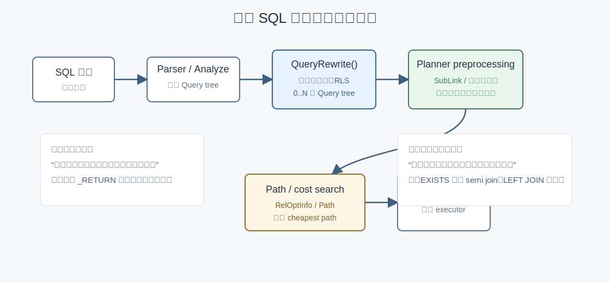
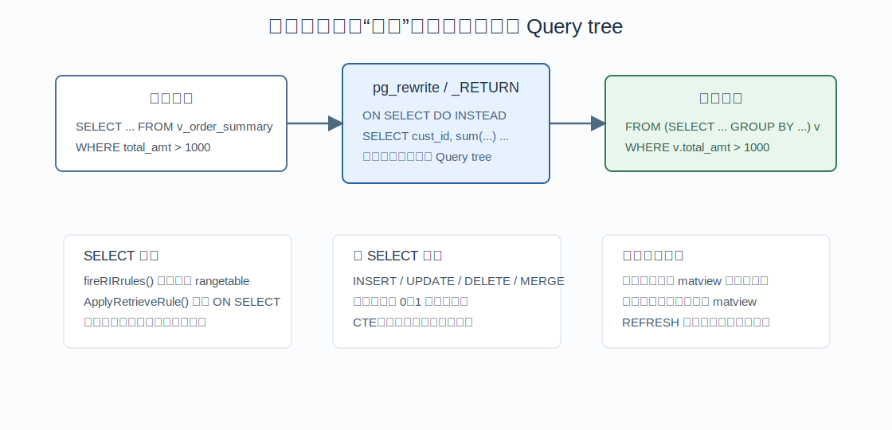
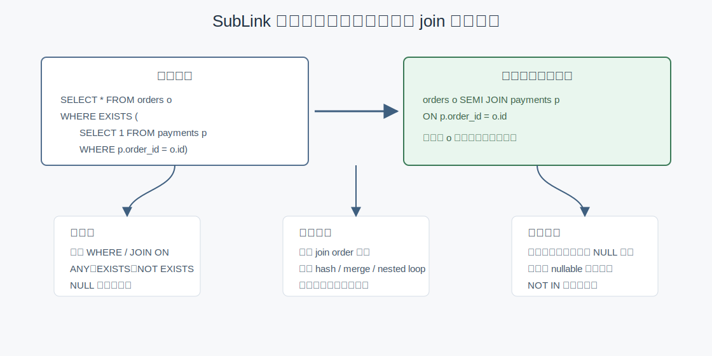
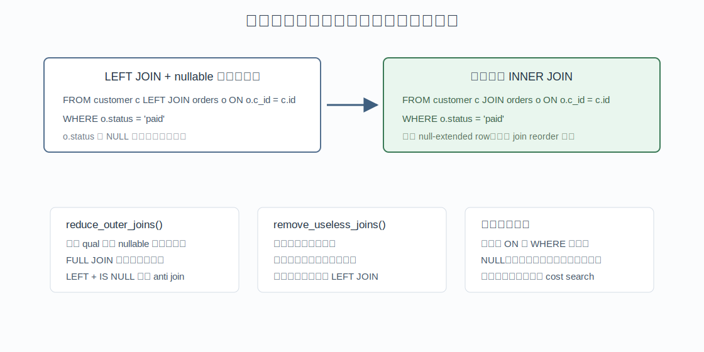

## 数据库筑基课 - query rewrite

### 作者
digoal

### 日期
2026-05-31

### 标签
PostgreSQL , 应用开发者 , 数据库筑基课 , 优化器 , 查询改写 , 规则系统 , 子查询优化  

----

## 背景


数据库筑基课的大纲文件未在当前项目中检索到；本文把 `query rewrite` 归入“优化器与查询处理基础能力”。它位于 SQL 语义和物理执行之间：业务开发者写的是一条 SQL，数据库真正优化的是一棵经过解析、规则展开、语义保持变换后的查询树。

工程痛点通常不是“SQL 写不出来”，而是：

- 为什么视图查询看起来简单，执行计划却展开成一大坨子查询？
- 为什么 `EXISTS` 有时变成 `Hash Semi Join`，有时仍然是 `SubPlan`？
- 为什么 `LEFT JOIN` 加一个右表过滤条件后，计划里看不到外连接了？
- 为什么 PostgreSQL 的物化视图不会像某些商业数据库或 Calcite 一样被透明匹配？

这些问题的共同答案是：query rewrite 不是一个单点功能，而是一组在不同阶段发生的“保持语义、暴露搜索空间、降低执行代价”的改写。

## 一、它解决什么问题？

用户提交 SQL 时，写法往往服务于人的表达，而不是服务于优化器搜索。

例如：

```sql
SELECT *
FROM orders o
WHERE EXISTS (
  SELECT 1
  FROM payments p
  WHERE p.order_id = o.id
);
```

人的意图是“找有支付记录的订单”。如果数据库逐行执行相关子查询，代价可能接近 `orders * payments`。如果能证明语义等价，就可以把它改写成半连接，让它进入 join order、join method、索引路径的统一搜索空间。

再例如：

```sql
SELECT c.id
FROM customers c
LEFT JOIN orders o ON o.customer_id = c.id
WHERE o.status = 'paid';
```

`WHERE o.status = 'paid'` 会过滤掉右表补 NULL 的行。此时外连接不再需要保留 unmatched customers，可以降级为内连接。这个改写不是为了“看起来优雅”，而是为了减少无意义结果行，并释放更多连接重排空间。

代价是：数据库必须非常保守。SQL 的 NULL、重复行、外连接、权限、行安全、易失函数、CTE 物化边界都会让“看似等价”的改写变成错误结果。因此 query rewrite 的第一原则不是快，而是语义正确。

## 二、它是什么？

本文把 query rewrite 分成三层：

| 层次 | PostgreSQL 位置 | 典型改写 | 主要目标 |
|---|---|---|---|
| 查询规则重写 | `src/backend/rewrite` | 视图展开、规则改写、行安全策略、可更新视图改写 | 把规则系统定义的语义合并进查询树 |
| Planner preprocessing | `src/backend/optimizer/prep` 与 `planner.c` | `ANY/EXISTS` 拉起、函数 RTE 内联、子查询 pull-up、外连接降级 | 暴露更多可优化结构 |
| Planner simplification | `src/backend/optimizer/plan` | 无用左连接移除、唯一性证明、半连接降级 | 在统计信息和约束信息可用后继续删减搜索空间 |

PostgreSQL 官方文档把 rule system 定义为 query rewrite rule system：它位于 parser 和 planner 之间，输入一棵 query tree 和规则，输出零棵、一棵或多棵 query tree。源码入口是 `QueryRewrite()`，注释也明确说它可能返回 `0 or many queries`。

优化器预处理则不属于用户可定义的规则系统。它是 planner 内部的语义保持变换。`prepjointree.c` 文件头部列出了调用顺序：`pull_up_sublinks`、`preprocess_function_rtes`、`pull_up_subqueries`、`flatten_simple_union_all`、表达式预处理、`reduce_outer_joins`、`remove_useless_result_rtes`。



图 1 说明：PostgreSQL 有两条容易被混淆的线。第一条是 parser 后、planner 前的规则系统，负责视图、规则、RLS 等语义展开。第二条是 planner 内部 preprocessing，负责把仍然等价的查询树改成更适合代价搜索的形态。

## 三、核心原理

### 3.1 规则系统：把视图和规则展开成 Query tree

普通视图在 PostgreSQL 中不是每次临时拼字符串，而是通过规则系统保存查询定义。`CREATE VIEW` 最终会创建一个 ON SELECT 规则，源码在 `src/backend/commands/view.c` 中调用 `DefineQueryRewrite()` 保存 `_RETURN` 规则。

执行查询时，`QueryRewrite()` 做两步关键工作：

1. 调用 `RewriteQuery()` 处理非 SELECT 规则，例如 INSERT、UPDATE、DELETE、MERGE 相关规则。
2. 对每个结果查询调用 `fireRIRrules()`，扫描 rangetable，遇到普通视图的 ON SELECT 规则时调用 `ApplyRetrieveRule()` 展开。

`fireRIRrules()` 还会递归处理子查询和 CTE，并用 `activeRIRs` 检测递归视图，避免无限展开。源码中也有一个重要边界：查询引用物化视图时会跳过 RIR 展开，把物化视图当作可扫描关系，而不是透明替换回定义查询。



图 2 说明：视图名不是执行器才理解的特殊对象。规则重写阶段会把视图定义合并进查询树，使 planner 面对的是普通关系、子查询、条件和目标列组成的树。这个阶段同时处理权限、行安全和可更新视图的一部分边界。

### 3.2 子查询拉起：把 SubLink 变成 join 问题

`pull_up_sublinks()` 尝试把顶层 `WHERE` 或 `JOIN/ON` 中的 `ANY`、`EXISTS`、`NOT EXISTS` 改写成 semijoin 或 anti-semijoin。源码注释明确限制了适用范围：它只在顶层条件中安全，因为涉及 NULL 时，嵌在复杂布尔表达式里的 `ANY` 可能需要返回 FALSE 或 NULL，不能简单改成 join。

这类改写的收益很直接：

- 子查询内部关系进入 rangetable。
- 相关条件变成 join qual。
- planner 可以选择 hash、merge、nested loop 等实现。
- 连接顺序搜索、索引路径、统计信息估算都能参与。

但它不是万能的。`NOT IN` 尤其危险，因为右侧只要出现 NULL，三值逻辑就会改变结果。PostgreSQL 新版本在安全条件满足时会扩大 `NOT IN` 到 anti join 的改写范围，但仍然必须先证明 NULL 语义不会被破坏。



图 3 说明：子查询拉起的关键不是“把 SQL 文本改短”，而是把逐行相关判断转换成 join 搜索空间。只要 NULL、外连接 nullable 侧、易失表达式等因素导致语义不能证明，优化器就应该保留 SubPlan 或更保守的形态。

### 3.3 子查询 pull-up：把简单 derived table 合并进父查询

`pull_up_subqueries()` 处理 FROM 里的 subquery。如果子查询没有聚合、分组、窗口、LIMIT、DISTINCT、安全屏障等特殊语义，planner 可以把它合并进父查询 jointree。

典型例子：

```sql
SELECT *
FROM (
  SELECT id, customer_id, amount
  FROM orders
  WHERE amount > 100
) s
JOIN customers c ON c.id = s.customer_id;
```

如果子查询足够简单，优化器可以把 `amount > 100`、`orders`、`customers` 放进同一个优化问题里。这样索引选择、谓词下推、连接顺序就不会被 derived table 人为隔开。

但如果子查询含有 `GROUP BY` 或 `LIMIT`，直接拉起可能改变行数、重复行、排序或聚合语义。这个边界与论文《Unnesting Arbitrary Queries》中的思想形成对照：论文讨论用更系统的代数方法处理任意查询解嵌套，而 PostgreSQL 的实现更偏工程保守，覆盖高价值、安全可证明的模式。

### 3.4 外连接降级：严格条件证明 null-extended row 无用

`reduce_outer_joins()` 的源码注释给了经典例子：

```sql
SELECT ...
FROM a LEFT JOIN b ON (...)
WHERE b.y = 42;
```

如果 `=` 是严格操作符，`b.y` 为 NULL 时条件不可能为 true。LEFT JOIN 为 unmatched `a` 行补出的 NULL 行必然会被 WHERE 过滤，所以该 LEFT JOIN 可以降级为 inner join。

更进一步，LEFT JOIN 加上 `WHERE b.z IS NULL`，如果能证明所有匹配行的 `b.z` 都不为 NULL，那么查询真正表达的是 anti-semijoin：保留左表中没有匹配右表的行。



图 4 说明：外连接改写必须先证明语义。`ON` 和 `WHERE` 对外连接不等价，PostgreSQL 文档也明确指出外连接必须保留 unmatched row 的补 NULL 语义。因此优化器只能在严格条件、NOT NULL 约束、连接键唯一性等证据充分时降级或删除连接。

### 3.5 无用连接移除：证明右侧既唯一又无上层引用

`analyzejoins.c` 中的 `remove_useless_joins()` 在初始查询分析之后运行。它扫描 `join_info_list`，寻找可删除的 LEFT JOIN。源码里的核心约束包括：

- 只考虑特定 LEFT JOIN 形态。
- 右侧 relation 不能是结果目标关系。
- 右侧列不能被 join 以上的目标列、条件、PlaceHolderVar 等使用。
- 必须证明右侧在相关连接条件上是唯一的，否则删除连接会改变重复行数量。

这就是为什么下面的 JOIN 有时可删、有时不可删：

```sql
SELECT c.id
FROM customers c
LEFT JOIN customer_profile p ON p.customer_id = c.id;
```

如果 `p.customer_id` 有唯一约束，且查询不使用 `p` 的列，那么 join 不改变结果行数，可以删除。如果 `p.customer_id` 不唯一，删除 join 会把一对多重复行消掉，结果就变了。

## 四、横向对比

| 维度 | PostgreSQL | Apache Calcite | 传统商业优化器的物化视图改写 |
|---|---|---|---|
| 核心形态 | 内置规则系统 + planner preprocessing + cost search | 可扩展 rule set + Volcano/Cascades 风格搜索 | 基于查询等价、约束、聚合补偿的透明 rewrite |
| 用户可扩展性 | SQL rule system 可用，但优化器 rewrite 本身不以用户规则插件为主 | 规则、trait、adapter、materialization 都更框架化 | 通常封装在数据库内核，用户通过 MV、约束、统计信息影响 |
| 视图处理 | 普通视图通过 `_RETURN` 规则展开 | 逻辑计划层可用规则处理 | 通常可做 view merge、predicate pushdown |
| 物化视图 | 查询引用 matview 时当表；不会自动把任意查询匹配到 matview | 官方文档支持 materialized view rewriting 的框架能力 | 论文《Optimizing Queries Using Materialized Views》代表这一类问题 |
| 子查询解嵌套 | 覆盖安全且高价值的 `ANY/EXISTS`、简单 subquery pull-up 等 | 通过规则体系表达更多变换 | 视产品实现，可能覆盖更广但也更依赖约束证明 |
| 外连接处理 | 明确实现外连接降级、anti join 识别、无用 LEFT JOIN 删除 | 通常以规则形式实现 outer join simplify | 常见于成熟优化器，但安全边界复杂 |
| 主要风险 | 误以为所有 SQL 写法都会被等价改写 | 规则爆炸、搜索空间控制 | 透明 rewrite 难解释，过期 MV 与补偿逻辑复杂 |

Calcite 论文《Extensible/Rule-Based Query Optimization in Calcite》强调的是可扩展规则优化框架：规则可以匹配表达式树、替换子树，并由 planner 管理搜索空间。PostgreSQL 则更像“内核工程师把关键变换固化在正确阶段”：规则系统处理 SQL 规则语义，preprocessing 处理高收益语义改写，path search 处理代价选择。

物化视图论文《Optimizing Queries Using Materialized Views: A Practical, Scalable Solution》的核心问题是：给定用户查询和一组已物化结果，如何判断能否用 MV 回答查询，必要时补偿过滤、连接、聚合。PostgreSQL 当前没有把这类透明 MV matching 做成通用内核能力。你可以直接查询 materialized view，也可以靠应用或中间层改写 SQL，但不能期待 planner 自动把基表查询替换成某个 matview。

## 五、效果如何？

query rewrite 的收益来自“减少搜索对象”和“扩大正确搜索空间”两个方向。

| 改写 | 直接收益 | 潜在代价 |
|---|---|---|
| 视图展开 | 让 planner 看见底层表和谓词 | 复杂视图会让查询树膨胀，权限和 security barrier 限制下推 |
| `EXISTS` 到 semi join | 避免逐行 SubPlan，进入 join path 搜索 | NULL、外连接、相关引用复杂时不能改 |
| 简单 subquery pull-up | 消除 derived table 边界，释放谓词和连接重排 | 聚合、LIMIT、DISTINCT 等会阻止拉起 |
| 外连接降级 | 减少 null-extended row，放开 join reorder | 必须依赖严格条件或约束证明 |
| 无用 LEFT JOIN 删除 | 少扫一张表，减少 join path 数量 | 右侧不唯一或被上层引用时不能删除 |

不要把 rewrite 理解为“越多越好”。每一次改写都会增加 planner 自身 CPU 成本，也可能扩大搜索空间。成熟优化器的难点是：在有限优化时间内，只做那些能证明正确且大概率有收益的变换。

## 六、实操 DEMO

以下 DEMO 是最小可验证 SQL。本文没有在本地启动 PostgreSQL 实例执行，因此不提供伪造输出；读者可以在 PostgreSQL 环境中用 `EXPLAIN (ANALYZE, VERBOSE, COSTS OFF)` 验证。

### 6.1 观察视图重写

```sql
SET client_min_messages = debug1;
SET debug_print_rewritten = on;

CREATE TABLE orders_demo (
  id bigint PRIMARY KEY,
  customer_id bigint NOT NULL,
  amount numeric NOT NULL
);

CREATE VIEW v_orders_demo AS
SELECT customer_id, sum(amount) AS total_amount
FROM orders_demo
GROUP BY customer_id;

SELECT *
FROM v_orders_demo
WHERE total_amount > 1000;
```

验证点：服务器日志中可以看到 rewritten query tree。普通视图会被展开成规则动作对应的查询树。`debug_print_rewritten` 是 PostgreSQL 文档列出的调试参数。

### 6.2 观察 EXISTS 到 semi join

```sql
CREATE TABLE orders_demo (
  id bigint PRIMARY KEY,
  customer_id bigint NOT NULL
);

CREATE TABLE payments_demo (
  id bigint PRIMARY KEY,
  order_id bigint NOT NULL
);

CREATE INDEX ON payments_demo(order_id);
ANALYZE orders_demo;
ANALYZE payments_demo;

EXPLAIN (VERBOSE, COSTS OFF)
SELECT *
FROM orders_demo o
WHERE EXISTS (
  SELECT 1
  FROM payments_demo p
  WHERE p.order_id = o.id
);
```

验证点：如果统计信息和数据分布合适，计划可能出现 `Hash Semi Join`、`Nested Loop Semi Join` 或类似半连接形态。不同版本和数据量下具体物理 join 不同，重点是逻辑上不再必须逐行执行 SubPlan。

### 6.3 观察 LEFT JOIN 降级

```sql
CREATE TABLE customers_demo (
  id bigint PRIMARY KEY
);

CREATE TABLE orders_demo (
  id bigint PRIMARY KEY,
  customer_id bigint NOT NULL,
  status text NOT NULL
);

ANALYZE customers_demo;
ANALYZE orders_demo;

EXPLAIN (VERBOSE, COSTS OFF)
SELECT c.id
FROM customers_demo c
LEFT JOIN orders_demo o ON o.customer_id = c.id
WHERE o.status = 'paid';
```

验证点：`WHERE o.status = 'paid'` 会拒绝右侧补 NULL 行，planner 有机会把 LEFT JOIN 降级为普通 join。

### 6.4 观察无用 LEFT JOIN 删除

```sql
CREATE TABLE customers_demo (
  id bigint PRIMARY KEY
);

CREATE TABLE customer_profile_demo (
  customer_id bigint PRIMARY KEY,
  level text NOT NULL
);

ANALYZE customers_demo;
ANALYZE customer_profile_demo;

EXPLAIN (VERBOSE, COSTS OFF)
SELECT c.id
FROM customers_demo c
LEFT JOIN customer_profile_demo p ON p.customer_id = c.id;
```

验证点：因为右侧 `customer_profile_demo.customer_id` 唯一，且上层不引用右侧列，该 LEFT JOIN 有机会被删除。删除主键约束或选择 `p.level` 后，计划应不同。

## 七、最佳实践

### 面向数据库架构师

1. 把 query rewrite 当成语义层能力，而不是 SQL 美化器。设计视图、RLS、物化视图、应用 SQL 生成器时，要清楚哪些边界会进入规则系统，哪些边界只在 planner 内部处理。
2. 如果依赖连接消除或外连接降级，必须给优化器证据：主键、唯一约束、NOT NULL、外键、合理统计信息。没有约束，优化器不能凭业务常识删除 join。
3. 不要把 PostgreSQL materialized view 当透明查询加速器。需要透明改写时，应在应用层、SQL 生成层或专门的加速产品中设计 routing/rewrite。

### 面向 DBA

1. 用 `EXPLAIN (VERBOSE)` 看逻辑形态，用 `debug_print_rewritten` 定位规则系统输出。前者看 planner 之后的计划，后者看 parser 到 planner 之间的 rewrite 结果。
2. 复杂视图慢时，先判断是视图展开后查询树过大，还是统计信息/索引不足。不要只看视图 SQL 的表面复杂度。
3. 遇到 `EXISTS`、`IN`、`NOT IN` 性能问题时，重点检查 NULL 约束、相关条件位置、是否在复杂 OR 表达式中、是否能改成显式 join 或 `NOT EXISTS`。

### 面向业务开发者

1. `LEFT JOIN ... WHERE right_col = ...` 通常表达的是内连接语义。若业务确实要保留左表未匹配行，应把右表过滤放到 `ON` 中并明确处理 NULL。
2. 能写 `EXISTS` 就不要为了“看起来快”手工写 `COUNT(*) > 0`。`EXISTS` 更直接表达半连接语义，优化器更容易处理。
3. `NOT IN` 对 NULL 敏感。除非右侧列明确 `NOT NULL`，反连接语义优先使用 `NOT EXISTS`。

## 八、适合与不适合场景

适合依赖 query rewrite 的场景：

- 视图封装基础模型，但希望查询仍能下推过滤、参与 join 优化。
- OLTP 查询中大量 `EXISTS`、`NOT EXISTS` 表达存在性判断。
- 数据模型有完整主键、唯一约束、NOT NULL，适合连接消除。
- SQL 生成器会产生冗余 derived table，需要优化器拉平简单子查询。

不适合盲目依赖 query rewrite 的场景：

- 把复杂报表堆成多层 security barrier view，还期待所有谓词都能下推。
- 用物化视图存预聚合，但仍查询基表并期待 PostgreSQL 自动替换。
- 在缺少唯一约束和 NOT NULL 约束的库里，指望优化器按业务约定删除 join。
- 复杂 `OR`、`NOT IN`、外连接 nullable 边条件混用，期望所有子查询都能解嵌套。

## 九、常见坑

1. 把 `debug_print_rewritten` 和 `EXPLAIN` 混为一谈。前者看规则系统输出，后者看 planner 之后的执行计划。
2. 以为普通视图和物化视图 rewrite 行为一样。普通视图会被 `_RETURN` 规则展开；物化视图在普通查询中是一个真实可扫描关系。
3. 以为 `LEFT JOIN` 的 `ON` 条件和 `WHERE` 条件可以随便互换。PostgreSQL 文档明确指出外连接下二者不等价。
4. 用 `NOT IN` 表达反连接，却没有处理右侧 NULL。结果可能不是慢，而是语义不符合预期。
5. 忽略约束。优化器做连接消除需要证明唯一性和非空性，应用代码里的“理论上唯一”没有用。
6. 多层视图叠加后，权限、RLS、security barrier 可能阻止下推。性能问题不一定是索引问题。

## 十、扩展问题

1. 为什么 `EXISTS` 可以自然映射到 semi join，而 `COUNT(*) > 0` 不一定等价？
2. 为什么删除一个 LEFT JOIN 必须证明右侧唯一？如果右侧一对多，会改变什么？
3. 如果 PostgreSQL 要支持透明物化视图 rewrite，至少需要哪些元数据：约束、依赖、freshness、聚合补偿、权限？
4. Calcite 这类规则框架更灵活，为什么数据库内核不一定都选择完全外部可扩展的规则优化器？
5. security barrier view 为什么会影响谓词下推？这和性能、权限泄露之间有什么 tradeoff？

## 十一、扩展阅读

- PostgreSQL 源码：`src/backend/rewrite/rewriteHandler.c`，`QueryRewrite()`、`RewriteQuery()`、`fireRIRrules()`、`ApplyRetrieveRule()`。
- PostgreSQL 源码：`src/backend/optimizer/plan/planner.c`，planner preprocessing 的调用顺序。
- PostgreSQL 源码：`src/backend/optimizer/prep/prepjointree.c`，`pull_up_sublinks()`、`pull_up_subqueries()`、`reduce_outer_joins()`。
- PostgreSQL 源码：`src/backend/optimizer/plan/analyzejoins.c`，`remove_useless_joins()` 与 LEFT JOIN 删除条件。
- PostgreSQL 文档：`doc/src/sgml/rules.sgml`，The Rule System。
- PostgreSQL 文档：`doc/src/sgml/queries.sgml`，外连接 `ON` 与 `WHERE` 条件语义、CTE materialization。
- PostgreSQL 文档：`doc/src/sgml/config.sgml`，`debug_print_parse`、`debug_print_rewritten`、`debug_print_plan`。
- Apache Calcite: Julian Hyde 等，`Extensible/Rule-Based Query Optimization in Apache Calcite`。
- Thomas Neumann, Alfons Kemper, `Unnesting Arbitrary Queries`。
- Goldstein, Larson, `Optimizing Queries Using Materialized Views: A Practical, Scalable Solution`。
- Galindo-Legaria, Rosenthal, `Outerjoin Simplification and Reordering for Query Optimization`，以及相关 outer join elimination 文献。
- DeepWiki：`postgres/postgres` 的 query processing / optimizer / planner 相关页面，用于快速建立代码导航；关键结论应回到 PostgreSQL 源码和官方文档核对。

## 本文校验记录

- 文章标题与用户给定主题一致。
- 主题分类为优化器/query processing/query rewrite。
- SVG 图均为独立文件，使用相对路径引用。
- SQL 示例未在本地 PostgreSQL 实例执行，文中已明确标注。
- 未编造性能数字；收益与代价均按机制描述。
- 物化视图自动 rewrite 明确标为 PostgreSQL 当前边界，而不是 PostgreSQL 能力。
  
## 附录 
1、问 gemini
```
数据库 query rewrite 相关的论文
```

2、克隆代码  
```  
git clone --depth 1 https://github.com/postgres/postgres
git clone --depth 1 https://github.com/postgrespro/aqo
```  
  
3、启用 codex, 使用 [数据库筑基课 skill](../skills/README.md).  
```
文章标题: 
  数据库筑基课 - query rewrite
项目源码(本地目录): 
  postgres
项目 codebase 文件名: 
  postgres/CLAUDE.md
相关的论文或文档名:
  Extensible/Rule-Based Query Optimization in Calcite
  Unnesting Arbitrary Queries
  Optimizing Queries Using Materialized Views: A Practical, Scalable Solution
  Outer Join Elimination in SQL Queries
开源项目相关的 deepwiki repoName: 
  postgres/postgres
```
  
  
#### [PostgreSQL 解决方案集合](../201706/20170601_02.md "40cff096e9ed7122c512b35d8561d9c8")
  
  
#### [德哥 / digoal's Github - 公益是一辈子的事.](https://github.com/digoal/blog/blob/master/README.md "22709685feb7cab07d30f30387f0a9ae")
  
  
#### [About 德哥](https://github.com/digoal/blog/blob/master/me/readme.md "a37735981e7704886ffd590565582dd0")
  
  

  
