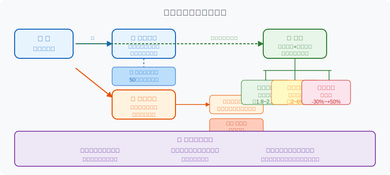
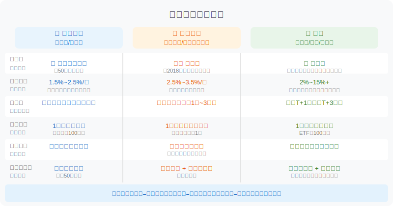
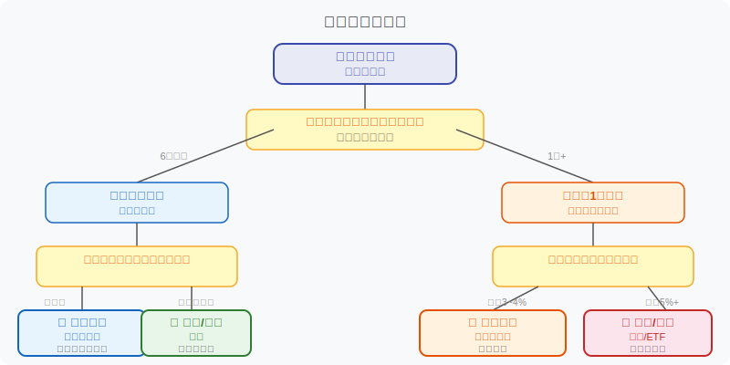

## 散户投资小白金融全品种操盘手册 - 3.8 银行理财、存款、基金 —— 长得像，但完全不同的三种动物
  
### 作者  
digoal  
  
### 日期  
2026-05-31  
  
### 标签  
金融产品 , 金融工具 , 散户 , 投资小白 , 全品操盘手册  
  
----  
  
## 背景 

## 先问你一个问题

你把钱放在银行理财里，银行倒闭了，你的钱还在吗？

很多人的第一反应是："应该没事吧，放在银行里嘛。"

但答案取决于：你的钱是**存款**，还是**银行理财**？两者在同一个银行APP里，可能只差一个页面——但法律性质完全不同，遇到风险时的结局也可能天壤之别。

这一节把三类产品讲清楚：**银行存款、银行理财、基金**。它们长得像，但本质不同。搞清楚这三个，你就不会再被"预期收益"四个字蒙住眼睛。

---

## 核心概念：你的钱到底流向哪里？

**先说结论，再展开：**

- **存款**：你把钱"借"给银行，银行欠你的债，到期还本付息。
- **银行理财**：你把钱交给银行（旗下理财子公司），让它帮你去投资，赚了分你，亏了你承担。
- **基金**：你把钱交给基金公司，它帮你去市场上买资产，风险收益都是你的，基金公司只赚管理费。

三句话说完了本质差异。但细节里藏着魔鬼，继续展开。

---

## 第一个：银行存款

### 它是怎么运作的

存款是最简单的关系：你把钱存进去，银行出具"欠条"（即存款合同），按约定时间还你本金加利息。利息多少由央行基准利率和各行定价决定，活期大约0.1%~0.3%，定期一年期大约1.5%~2.5%（2024-2025年继续下行）。

### 为什么存款是"最安全的"

中国有**存款保险制度**（2015年正式实施）。每家银行，同一存款人，本息合计**50万元以内**，由存款保险基金全额赔付——哪怕那家银行破产。超过50万的部分，才有可能损失。

这50万是整个银行体系的保障底线，不需要你额外购买，开立存款账户自动享有。

### 存款的主要缺点

**收益在下行通道里**。2024年以来，国有大行定期存款利率屡次下调，1年期定存利率基本落在1.5%~2%区间，扣除通胀后实际购买力增长极为有限。把大量长期资金全锁在存款里，是在慢慢稀释财富。

**另一个坑**：大额存单利率会高一些（一般比普通定存高0.2%~0.5%），但起购通常20万以上，且部分产品流动性差，提前支取按活期计息。购买前要确认清楚。

---

## 第二个：银行理财

### 它的前世今生——"打破刚兑"是什么意思

2018年前，银行理财基本默认"保本保收益"，哪怕底层资产亏损，银行也会自掏腰包补足。这叫"刚性兑付"（简称刚兑）。

2018年，监管出台《资管新规》，明确禁止刚兑，要求理财产品净值化管理——也就是说，现在的银行理财，**亏损你自己承担，银行不再兜底**。

这是一次根本性的变化。但很多投资者没意识到。

### 银行理财现在投的是什么

银行理财子公司将募集资金投向一个"资产池"，典型配置包括：

- **债券**：国债、金融债、信用债（占比最大，通常60%~80%）
- **货币市场工具**：银行间市场、回购等
- **非标资产**：信托、资产支持证券等（占比受监管限制）
- 少量股票、公募基金（只有部分"混合类"理财会配置）

这种配置相对保守，正常年份波动不大，多数产品年化收益2.5%~3.5%。

**但"波动不大"不等于"不会亏"。** 2022年11月，债市大幅调整，大量银行理财产品净值跌破1，许多投资者才惊觉"银行理财居然可以亏本"。这不是异常，而是制度设计的正常结果。

### 银行理财的主要特点

- **封闭期**：多数产品有1个月到2年不等的封闭期，到期前赎回不了
- **起购门槛**：部分产品1元起（近年已大幅下调），传统产品曾需1万起
- **流动性弱于货币基金**：封闭型产品无法随时赎回
- **信息不如基金透明**：底层资产披露频率不如公募基金

---

## 第三个：基金

### 基金的本质

基金是一种"集合投资"：基金公司发起一个产品，把众多投资者的钱集中起来，由基金经理负责按照约定的投资策略去买资产。你持有的"份额"，代表你对这笔资产的权益。

基金公司不是拿你的钱去做自己的生意——你的钱有**独立的托管账户**，由托管银行保管，基金公司只能按照法规约定范围投资，不能挪用。就算基金公司倒闭，你的资产也不会蒸发。

这是基金和银行理财一个重要区别：**基金公司欠你的是"投资服务"，不是你的钱本身；你的钱始终是你的。**

### 基金的主要类型（按风险从低到高）

| 类型 | 投资方向 | 风险 | 年化参考 |
|------|---------|------|---------|
| 货币基金 | 银行间市场、国债回购 | 极低 | 1.8%~2.2% |
| 短债基金 | 1年内到期债券 | 低 | 2%~3.5% |
| 中长债基金 | 中长期债券 | 中低 | 2%~6%（随利率波动） |
| 混合基金 | 股债混合 | 中高 | -15%~+25% |
| 股票基金/ETF | 股票为主 | 高 | -40%~+60% |

**货币基金**（余额宝、微信零钱通的底层）是最接近"活期存款替代品"的基金，但并非无风险，历史上极端情况下也发生过货基出现负收益（概率极低）。

### 基金的优势

1. **品种选择丰富**：从最稳健的货基到最激进的量化私募，任你挑选
2. **监管严格、信息透明**：证监会监管，基金合同、季报年报必须定期披露
3. **托管隔离保护**：基金公司倒闭不影响持有人资产
4. **流动性灵活**：货基T+1可取，ETF场内实时交易

### 基金的局限

- 股票型基金波动大，心理压力高
- 主动型基金管理费叠加，长期摊薄收益
- 选基金也是门功课，劣质基金多

---

## 三类产品全图对比

---

## 第一性原理分析：为什么存款"更安全"？

**支撑"存款比银行理财更安全"成立需要以下前提：**

- **前提A**：存款保险制度持续有效执行 → 【常量】→ 有法律保障，中国已运行超10年，制度设计严格
- **前提B**：存款余额在50万以内 → 【变量】→ 超额部分不受保障；如果被推翻（余额超50万），部分资金在极端情况下有损失风险
- **前提C**：银行理财底层资产没有系统性信用违约 → 【变量】→ 信用周期恶化时，非标资产违约可能引发理财净值大幅亏损

**情景推演：**

| 情景 | 描述 | 对策 |
|------|------|------|
| 正常情景（全部前提成立）| 存款绝对安全，银行理财温和波动 | 按正常配置执行 |
| 压力情景（前提B被推翻：余额超50万）| 超额存款在银行破产时有损失风险 | 分散多家银行存款，单行不超50万 |
| 极端情景（前提C被推翻：信用危机）| 理财净值大幅下跌，甚至发生流动性问题 | 降低银行理财敞口，增加存款和货基比例 |

---

## 真实案例：不要被"预期收益"四个字催眠

**案例一（数据来源：中国基金报，2022年11月）**

2022年11月，债市利率快速上行，导致债券价格普遍下跌。根据统计，当月有超过**4000只**银行理财产品净值跌破1元面值，部分产品单月跌幅达到-1%~-3%，相当于抹掉数月累积收益。很多买了"稳健型"理财的投资者第一次意识到"银行理财不保本"。

这不是黑天鹅，而是在《资管新规》后早晚会发生一次的"市场教育"。

**案例二（正面对比）**

同期，货币基金几乎不受影响，7日年化收益率依旧在2%左右，且日日到账。持有货基的投资者完全没有体验到这次市场波动。

两个案例说明：**选择"类存款替代品"时，货基的安全性优于银行短期理财，尽管收益略低。**

历史规律不代表未来一定重复，但利率市场的波动特征不会消失。

---

## 实操例子

**场景：小王，工资结余12万，家庭备用金+短期理财目标**

小王月薪2万，攒了12万。其中3万是"应急备用金"（可能随时要用），5万打算3个月后付首付补款，4万是"不着急用的长期闲置"。

**第一步：3万应急备用金**
→ 存入货币基金（如余额宝、天弘余额宝等）。T+1可提现，约2%年化，完全满足流动性需求。**不要放活期存款**（利率更低且不如货基灵活）。

**第二步：5万付款备用金**
→ 存3个月定期存款，或购买同期限银行理财（低风险固收类）。定期存款保本保息，3个月理财通常也波动极小。**如果看重确定性，选定期存款；如果可以接受轻微波动换更高收益，选封闭期≤3月的理财。**
→ 判断依据：3个月内要用的钱，封闭期必须对得上，不要买6个月或1年的产品。

**第三步：4万长期闲置**
→ 根据风险承受能力做决策：
- 保守（不想亏任何一分钱）：1年期定存，约2%年化
- 稳健（接受轻微波动）：银行理财固收类，约2.5%~3.5%
- 成长（3年以上不用，接受10%以内波动）：短债基金+货基组合，或直接考虑宽基ETF定投（见第四章）

**如果操作错误会怎样？**
若小王把付款备用金买了6个月封闭期理财，3个月后需要急用钱时，无法赎回，被迫缺口。纠偏方式：临时消费贷（但有利息成本），或向家人短期借款。代价是让自己陷入被动。**所以"封闭期与用款时间完全匹配"是硬约束，不是建议。**

---

## 选择决策树

---

## 可复用框架

### 【三问选产品】

**适用场景**：任何时候面对一款现金类理财/存款/基金产品，不知道该不该买

**核心逻辑**：用三个问题过滤掉99%的错误选择

**操作步骤：**
1. **问流动性**：这笔钱最快什么时候可能要用？产品封闭期≤使用时间节点，否则直接排除
2. **问保障**：这笔钱亏了我能不能接受？能接受→可考虑理财/基金；一分都不能亏→只选存款或货基
3. **问收益来源**：收益从哪里来？讲清楚底层资产是什么，不清楚的理财产品不买

**举一反三**：这个框架同样适用于购买保险理财产品（年金险、增额终身寿）和信托产品。

---

### 【50万分散法】

**适用场景**：存款金额超过50万

**核心逻辑**：存款保险单家银行上限50万，超额部分有理论风险

**操作步骤：**
1. 单家银行存款本息合计控制在50万以内
2. 如有多家银行关系，按优先级分散：国有大行→股份制银行→城商行→农商行（风险依次递增）
3. 农村信用社、小型银行建议更谨慎，单家上限保守设定为20万以内

**举一反三**：信用社、村镇银行适用同样规则，且经营风险更高，上限建议更保守。

---

## 本节行动清单

1. **查查你的"活期存款"**：如果余额超过1万且短期不用，考虑转入货币基金，年化收益至少高出0.5%~1%
2. **翻出你持有的银行理财**：找到产品说明书，确认（a）封闭期是否与你的用款时间对得上，（b）该产品是"净值型"还是"预期收益型"，前者已打破刚兑
3. **核查单家银行存款总额**：本息合计是否超过50万？超过则规划分散
4. **确认你持有的基金类型**：货基≠股票基金，弄清楚自己的每一笔钱是什么类型
5. **下次买产品前**：用"三问选产品"框架过一遍，三个问题都能清楚回答，再下单

---

## 一句话总结

存款是银行欠你的债，保本有法律兜底；银行理财是帮你投资，亏了你自己承担；基金是专业代理你投资，你的钱独立托管不会消失——三个产品，三种法律关系，搞清楚了才算真正理解自己的钱在哪里。

---

> ⚠️ **声明**：本文内容为投资教育目的，所有历史数据、策略框架均为辅助学习工具，不构成证券投资建议。市场有风险，投资需谨慎。实际操作请结合自身风险承受能力，必要时咨询专业投顾。
  
  
#### [PostgreSQL 解决方案集合](../201706/20170601_02.md "40cff096e9ed7122c512b35d8561d9c8")
  
  
#### [德哥 / digoal's Github - 公益是一辈子的事.](https://github.com/digoal/blog/blob/master/README.md "22709685feb7cab07d30f30387f0a9ae")
  
  
#### [About 德哥](https://github.com/digoal/blog/blob/master/me/readme.md "a37735981e7704886ffd590565582dd0")
  
  

  
