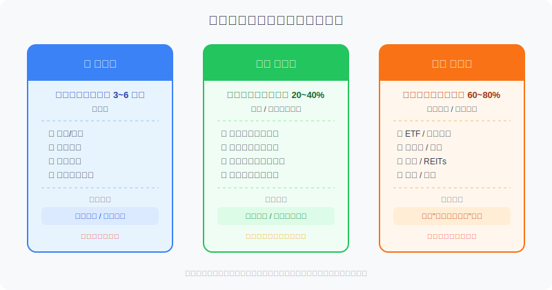
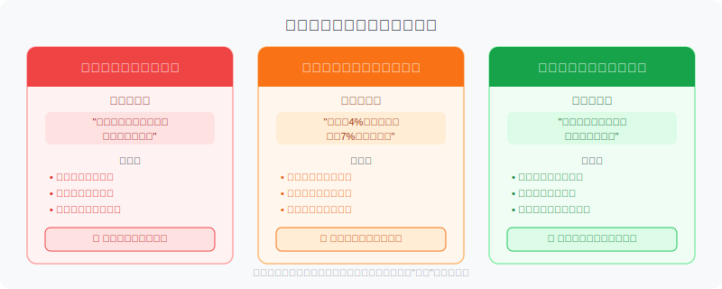
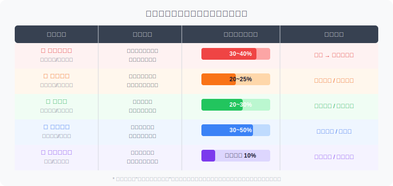

## 散户投资小白金融全品种操盘手册 - 3.9 现金仓位怎么设 —— 生活钱、防守钱、进攻钱
  
### 作者  
digoal  
  
### 日期  
2026-05-31  
  
### 标签  
金融产品 , 金融工具 , 散户 , 投资小白 , 全品操盘手册  
  
----  
  
## 背景 
  

## 先说一个让大多数人亏损的根本原因

散户亏钱，通常不是因为选错了股票，而是因为**用了不该投资的钱去投资**。

一个你可能不知道的数据：根据中国证券投资基金业协会2023年对散户行为的跟踪调查，超过60%的亏损者在被问及最惨烈的一次操作时，都提到了同一个场景——**需要用钱的时候，仓位还被套在里面，被迫割肉**。

不是市场把他们淘汰的，是他们自己把不该进场的钱推进了场。

这一节不讲怎么选股，讲一件更基础的事：**在动任何一笔钱去投资之前，先搞清楚这笔钱是哪种属性的钱**。

---

## 核心概念：三桶钱模型

用一个比喻来理解：想象你家有三个水桶，分别装着不同的水。

- **第一个桶：生活用水**——每天要喝的、洗澡的、做饭的，绝对不能断
- **第二个桶：备用水**——万一停水了，能撑一段时间；也能在旱季买便宜水时补充到第三个桶
- **第三个桶：农业用水**——浇地的，会随着天气干旱或洪涝有多有少，但影响不了你喝水

三桶钱模型就是这个逻辑：

三桶钱的关键不在于比例数字，而在于**它们之间的边界**：
- 生活钱不参与任何投资
- 防守钱只放低风险工具，不追求高收益
- 进攻钱才是真正去承担风险、追求回报的部分

---

## 第一桶：生活钱

### 定义
生活钱 = **未来3~6个月的家庭刚性支出**

刚性支出包括：房租/房贷月供、水电煤网、餐饮日用、医疗应急、孩子教育费用等任何"不支付就会影响正常生活"的钱。

> 计算方法很简单：把过去3个月的流水账单加起来除以3，得到月均刚性支出，乘以3~6，就是生活钱的底线。

### 放在哪里
**活期存款或货币基金**。不要为了多那0.5%收益率把它放到任何有波动的地方。

货币基金（比如余额宝类产品）的T+1或实时到账机制完全满足流动性需求，同时年化收益比活期稍好，是生活钱的最优容器。

### 铁律：生活钱绝对不能投资

不是"尽量不要"，是"绝对不能"。

原因有两层：

**第一层，实际损失**：市场下跌时，你没有选择权，必须卖出，而最惨烈的抛售往往发生在最低点。

**第二层，心理损失**：一旦知道"这笔钱要用"，人的判断会严重失真。你会忍不住盯盘，你会因为浮亏而焦虑，你会在最不该操作的时候做出最糟糕的决策。

---

## 第二桶：防守钱

### 定义
防守钱 = **在投资系统中充当缓冲垫和机会弹药的资金**

它有两个使命：
1. 当整体投资组合出现较大回撤时，它本身保持相对稳定，不会"雪上加霜"
2. 当市场极度恐慌、优质资产极度低估时，它是你出手的底气

### 占比建议
防守钱建议占**投资资产（不含生活钱）的20%~40%**，具体比例随市场环境动态调整。

| 市场环境 | 防守钱建议比例 | 调整逻辑 |
|---------|------------|---------|
| 牛市初中期 | 20~25% | 趋势向上，多配置进攻 |
| 牛市疯狂期 | 30~40% | 主动减仓，储备弹药 |
| 震荡市 | 20~30% | 维持基础仓位 |
| 熊市初期 | 30~50% | 避开下行，等待机会 |
| 熊市深度期 | 逐步降至10% | 分批建仓，释放弹药 |

### 放在哪里
防守钱适合放在**低波动、有一定收益、随时可赎回**的工具里：
- **短债基金**（持仓以1年以内债券为主，年化2.5%~3.5%，极端情况也可能短暂轻微亏损）
- **同业存单指数基金**（收益稳定，波动极小，适合大多数散户）
- **国债逆回购**（适合节假日前后短期停泊资金，详见第三节）

**防守钱的常见错误**：为了让防守钱"更有用"，把它买成了债券基金、可转债，甚至低估值股票——这些都是进攻仓的品种，遇到熊市一起跌，防守钱等于消失了。

---

## 第三桶：进攻钱

### 定义
进攻钱 = **能够承担本金波动甚至阶段性亏损的真正投资资金**

判断标准只有一条：**这笔钱亏了30%，对你的生活和心理状态有影响吗？**

如果有很大影响——减少进攻钱，增加防守钱。
如果基本没影响——这才是进攻钱真正的规模上限。

### 占比建议
进攻钱占投资资产的60%~80%，是三桶钱里比例最大的部分。但要特别注意：这里说的"进攻钱"只是相对于防守钱而言的"敢于承担风险"，**不是说要满仓、不是说要借钱、不是说要押注单一品种**。

进攻钱内部，还有自己的仓位管理逻辑（详见第十五章），比如：
- 单只ETF不超过进攻仓的30%
- 单只个股不超过进攻仓的10%
- 单一行业不超过进攻仓的30%

### 进攻钱能放什么
ETF、指数基金、个股、可转债、黄金ETF、REITs、QDII、港股、美股——所有有明确风险属性、你能理解其逻辑的品种，都可以放入进攻仓。

**进攻钱的铁律：只用自有资金，不借钱**。借钱投资意味着你引入了一个外部强制结束点（还款日/爆仓线），它会在市场最混乱的时刻强迫你卖出。

---

## 第一性原理分析

### 核心观点：三桶钱分离是让投资系统正常运转的前提

**前提清单**：

| 前提 | 类型 | 理由 |
|-----|------|------|
| 前提A：生活支出是刚性的，不能被中断 | 常量 | 人的基本生存需求不随市场变化 |
| 前提B：市场是不可预测的，随时可能大幅下跌 | 常量 | 历史上从未有任何人能长期精准预测 |
| 前提C：投资者在极度压力下判断力会下降 | 常量 | 行为经济学的大量研究结论 |
| 前提D：优质机会往往在市场恐慌时出现 | 变量 | 依赖于市场整体估值水平和流动性状况 |

**情景推演**：

- **正常情景**（前提全部成立）：三桶钱分离，生活无忧 → 投资决策冷静 → 熊市底部有弹药 → 穿越周期，长期复利
- **压力情景**（前提D被推翻，没有低估值机会）：防守钱收益低，但核心逻辑不变——三桶钱分离依然保证你在任何市场环境下不被迫卖出
- **极端情景**（前提C+D被推翻，市场极度混乱且久无机会）：即便如此，生活钱和防守钱的隔离仍保证了基本的系统稳定性

**结论**：三桶钱框架的价值不依赖于某种特定市场环境，它是投资系统的基础设施，在任何情景下都成立。

---

## 散户最常见的三桶钱混用陷阱

三个陷阱有同一个根源：**把不同属性的钱放在同一个"账户"里，没有做物理隔离**。

解决方法很简单：**开不同的账户，物理隔离**。

- 生活钱：银行储蓄账户或货币基金账户
- 防守钱：基金账户（专门存短债基金或同业存单基金）
- 进攻钱：证券账户

账户分开之后，看到股票账户里的浮亏，你知道那不是你要吃饭的钱，心态就不一样了。

---

## 不同市场环境下的防守钱配置

调整防守钱比例的关键信号有三个：

1. **估值信号**：全市场市盈率（PE）中位数是否处于历史高位？
   - 用中证全指、沪深300的PE历史百分位来判断
   - PE百分位 > 80%：开始主动补充防守钱
   - PE百分位 < 20%：考虑将防守钱逐步释放为进攻仓

2. **情绪信号**：市场是否过度亢奋或过度恐慌？
   - 新开户人数激增、朋友圈全是"荐股信息"→ 补充防守
   - 新闻标题清一色"股市崩了"、身边人全在割肉 → 减少防守

3. **流动性信号**：央行是否在收紧还是放松流动性？
   - MLF利率下调、降准 → 流动性宽松，进攻可以多一点
   - 流动性收紧、资金面紧张 → 防守比例提高

---

## 实操例子：小王的三桶钱怎么分

**场景设定**：小王，月收入1.5万，月刚性支出约5000元，目前有20万可以动用的存款，想开始系统性投资。

**第一步：锁定生活钱**

月刚性支出5000 × 6个月 = 30000元

但小王总资产才20万，先按3个月算：5000 × 3 = 15000元

生活钱 = 1.5万，存入货币基金，**就当这笔钱不存在**。

**第二步：确定投资资产总量**

投资资产 = 20万 - 1.5万 = 18.5万

**第三步：分配防守钱和进攻钱**

当前市场处于震荡期，防守钱比例取25%：
- 防守钱 = 18.5万 × 25% ≈ 4.5万 → 买入同业存单指数基金
- 进攻钱 = 18.5万 × 75% ≈ 14万 → 按照第四章ETF操盘策略进行配置

**第四步：建立动态调整机制**

小王设定每季度末做一次回顾：
- 如果市盈率百分位超过70%，将防守钱比例提到35%
- 如果市盈率百分位跌到25%以下，将防守钱比例降到15%
- 生活钱保持不动，只在支出后及时补充

**如果判断错误怎么办**？

假设小王在震荡期按25%防守、75%进攻配置后，市场突然进入熊市，进攻仓亏损30%（14万亏至9.8万），此时：
- 生活钱1.5万不受影响，生活正常
- 防守钱4.5万基本稳定（短债基金轻微波动），等待机会
- 进攻仓虽亏损，但这是预期内的风险，不需要割肉

纠偏操作：市场跌到PE百分位20%以下，把防守钱的20%（约9000元）逐步转入进攻仓，低位加仓。

---

## 可复用框架

**【三桶账户法】**

适用场景：任何规模的投资者在开始系统性投资前的资产规划

核心逻辑：将资金按使用属性而非金额分类，通过物理隔离（不同账户）消除"被迫卖出"的风险

操作步骤：
1. 计算家庭月刚性支出，乘以3~6，得到生活钱，存入货币基金
2. 剩余资金为投资资产，按20%~40%设定防守钱（随市场环境调整），存入短债或同业存单基金
3. 其余70%~80%为进攻钱，依据第四章/第五章的品种选择框架进行配置
4. 每季度末检查三桶比例，依据估值信号和情绪信号动态调整防守仓比例

举一反三：这个框架还可以用在**家庭财务规划**（紧急备用金 + 保险 + 投资）、**企业现金管理**（运营资金 + 储备资金 + 投资资金）等场景

---

**【防守钱调节法】**

适用场景：已经建立三桶账户，需要动态管理仓位的投资者

核心逻辑：防守钱不是固定比例，而是市场的"反指标"——市场越热，防守钱越多；市场越冷，防守钱越少

操作步骤：
1. 建立市场温度观测表：每月记录沪深300/中证全指PE百分位、成交量趋势、新开户人数
2. 设定自己的触发线（例如：PE百分位>70%触发加防守，<25%触发减防守）
3. 每次调整幅度控制在5%~10%，不要一次性大幅调整

举一反三：这个框架的底层逻辑——**逆市场情绪调整仓位**——同样适用于单个品种的加仓减仓决策

---

## 本节行动清单

1. **今天就做**：计算你的月刚性支出，确认生活钱规模，把它从你的"投资可用资金"中扣除
2. **本周完成**：开一个独立的基金账户（或在现有平台新建子账户），专门存放防守钱，买入同业存单指数基金或短债基金
3. **本月完成**：查询沪深300和中证全指当前PE百分位，对照本节表格，确认当前防守仓比例是否合适
4. **定期执行**：每季度末，花30分钟检查三桶钱的比例是否符合当前市场环境，做必要调整
5. **建立铁律**：在手机备忘录或交易软件的备注里，写下"生活钱永远不进市场"，每次想动用前先看一眼

---

## 一句话总结

**三桶钱不是财务技巧，是投资系统的地基——地基不稳，上面盖什么都会塌。**

---

> ⚠️ **声明**：本文内容为投资教育目的，所有历史数据、策略框架均为辅助学习工具，不构成证券投资建议。市场有风险，投资需谨慎。实际操作请结合自身风险承受能力，必要时咨询专业投顾。
  
  
#### [PostgreSQL 解决方案集合](../201706/20170601_02.md "40cff096e9ed7122c512b35d8561d9c8")
  
  
#### [德哥 / digoal's Github - 公益是一辈子的事.](https://github.com/digoal/blog/blob/master/README.md "22709685feb7cab07d30f30387f0a9ae")
  
  
#### [About 德哥](https://github.com/digoal/blog/blob/master/me/readme.md "a37735981e7704886ffd590565582dd0")
  
  

  
