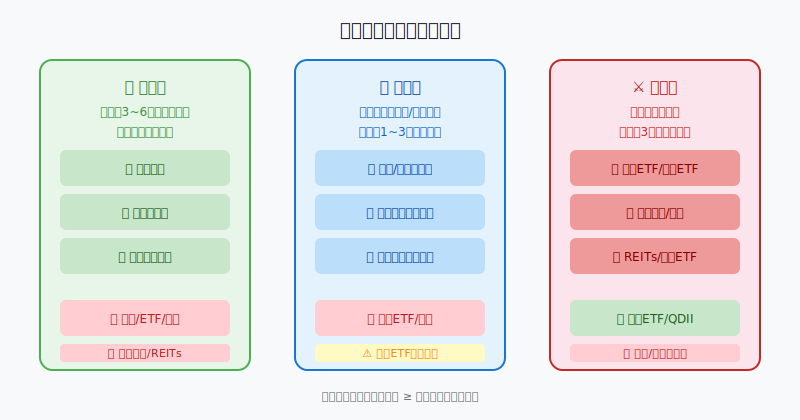
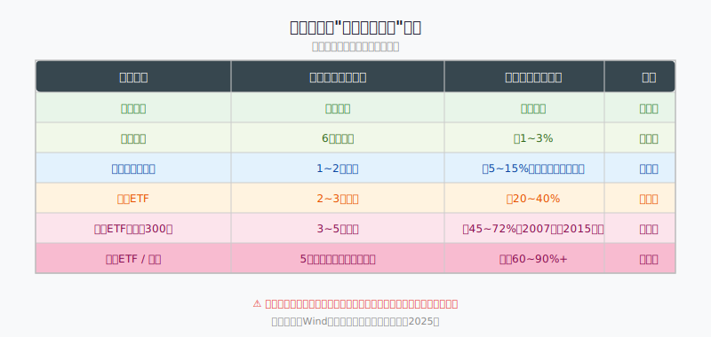
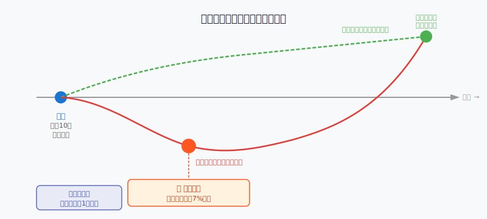

## 散户投资小白金融全品种操盘手册 - 3.10 常见错误 —— 拿短期钱买长期波动资产
  
### 作者  
digoal  
  
### 日期  
2026-05-31  
  
### 标签  
金融产品 , 金融工具 , 散户 , 投资小白 , 全品操盘手册  
  
----  
  
## 背景 
  

## 一个你可能不知道自己犯过的错

2022年，某投资论坛上有人发帖：

> "我拿明年要交首付的60万买了债券基金，结果遇上债市大跌，亏了将近8%，首付差了将近5万。现在进退两难，卖了亏钱，不卖到期拿不出首付……"

很多人看到这个帖子，第一反应是："债券基金不是很安全吗？怎么还亏这么多？"

这个问题问错了。

正确的问题是：**"他犯的根本不是选错资产的错，而是把短期钱投进了需要长期持有的容器。"**

这一节，就讲这个很多人默默犯过、却从不知道症结在哪的错误。

---

## 核心概念：钱有"用途时间"，资产有"安全持有周期"

先理解两个概念：

**用途时间**：这笔钱什么时候要用？3个月后、1年后、还是5年后都不一定用？

**安全持有周期**：一种资产，在历史上，持有多久之后，大概率能抹平短期波动、实现正收益？

**这两件事必须匹配——这就是"时间匹配原则"。**

打一个比方：你今晚要请朋友吃饭，却把买菜的钱锁进了一张3年期定存。钱没有不见，但就是用不了。金融资产也一样——资金质量是好的，但如果时间不对，照样出问题。

---

## 第一性原理分析：为什么短期钱不能买长期资产

### 【前提清单】

支撑"时间匹配"成立需要以下前提：

- **前提A：波动性资产存在短期下跌可能** → 【常量】→ 无论债券、股票、黄金，短期净值都可能为负，这是市场的基本属性
- **前提B：用途时间是刚性的** → 【变量】→ 首付、学费、医疗这类支出是刚性的；但有些支出的时间点可以推迟
- **前提C：资产持有够久才能抹平波动** → 【常量】→ 历史数据显示，宽基指数持有3~5年以上的胜率显著提升；债券基金持有1年以上的亏损概率大幅降低

### 【情景推演】

**正常情景（三个前提全部成立）**：短期用款时市场恰好未下跌 → 安全取出，皆大欢喜 → 这是"侥幸"，不是"正确"

**压力情景（前提B成立，前提A触发）**：钱到期时市场正好下跌 → 被迫在低点割肉 → 损失已是真实亏损，不可挽回

**极端情景（市场深度调整、持续1年以上）**：债券大熊市（如2022年11月中国债市快速下跌）、股灾（如2015年6~8月）→ 短期亏损幅度超过预期 → 若刚性用款，将被迫深度割肉

**应对方案**：一旦意识到短期钱已经投入长期资产，唯一正确的路径是：评估用途时间能否延迟（延迟→等待修复），无法延迟→接受部分亏损立刻赎回，不要赌"会涨回来"。

---

## 为什么这个错误如此普遍？四个心理陷阱

**陷阱一：低估波动性**

"债券基金很稳"、"红利ETF有分红"、"黄金是避险资产"——这些说法并不错，但稳的意思是**长期持有的稳**，而不是**任何时候取出都稳**。2022年11月，纯债基金单月回调普遍在1~3%，长久期利率债基金跌幅超过5%，对于1个月内要用钱的人来说，就是真金白银的损失。

**陷阱二：低估用款的刚性**

很多人开始投资时觉得："这笔钱其实可能也用不到，万一不买房呢？"结果计划变了、孩子要上学、家里有事——原本"可能用"的钱变成了"必须用"的钱，而资产还锁在市场波动里。

**陷阱三：高估自己的"等得起"**

买了基金亏了5%，心里说"等等就好了"。但真到需要用钱，"等"的意志力会迅速瓦解。亏7%时卖，和亏5%时卖，差别不大；亏7%时决定再等，可能在亏10%时彻底崩溃——这叫"情绪止损"，是最差的止损方式。

**陷阱四：把"预期收益"当成确定收益**

"理财说预期年化3.5%，我放半年就取回来刚好用"——但预期收益是基于正常市场环境，不是承诺。尤其是净值型产品，任何时候取出，都是按当时净值计算。

---

## 权威数据：短期持有波动资产的亏损概率

以沪深300指数为基准（Wind数据，2004~2024年共20年历史）：

- 持有**1个月**，亏损概率约43%
- 持有**1年**，亏损概率约28%
- 持有**3年**，亏损概率约18%
- 持有**5年**，亏损概率约11%
- 持有**10年**，亏损概率约5%以下（2007~2017年区间是个明显例外）

对于债券型基金（混合短债基金为基准，2015~2024年数据）：

- 持有**1个月**，亏损概率约22%
- 持有**3个月**，亏损概率约14%
- 持有**1年**，亏损概率约6%
- 持有**2年**，亏损概率约2%以下

**结论：持有时间越短，亏损概率越高。这不是常识，这是数据。**

历史不代表未来，但这个规律的成因是结构性的——短期市场受情绪和资金流动影响，长期市场才真正反映经济基本面——这个底层逻辑不会消失。

---

## 实操例子：三个场景的正确做法

### 场景一：明年要交的30万首付款，现在怎么放？

**错误做法**：买中长期债券基金或者宽基ETF，因为"比存款收益高"。

**正确做法**：
- 第一步：确认首付时间（假设12个月后）
- 第二步：将30万放入货币基金或银行存款（定期12个月）
- 第三步：如果一定要追求更高收益，最多将其中**20%以内**放入短债基金，且账户设置提醒，到第9个月时检查是否浮亏，如亏损则立刻赎回，保本优先
- 第四步：任何情况下，**不碰股票、ETF、可转债、黄金**

**判断依据**：首付是刚性支出，30万缺口无法用其他钱补。宁愿少赚1%的利息，也不冒5~10%亏损被迫违约的风险。

---

### 场景二：公司年底要发奖金（约5万），提前两个月收到，想做短期投资

**错误做法**：说"两个月正好买个基金"，或者"趁现在市场好追进某行业ETF"。

**正确做法**：
- 第一步：确认这5万两个月后是否**一定**需要（如果可以随时不用，则另当别论）
- 第二步：如果确定2个月后要用，只买货币基金或国债逆回购（到期日和用款日对齐）
- 第三步：国债逆回购的具体操作是：在交易所购买1天或7天期逆回购（GC001/GC007），节假日前购买尤其划算（见本章第三节）
- 第四步：不要因为"两个月只有一点点收益"而觉得"不值得"——短期资金的目标是**保本**，不是**增值**

**如果操作错误**：买了波动资产，两个月到期时恰好市场下跌——面临"亏着取出"还是"推迟用款"的两难。亏损可能造成计划失败，推迟用款可能有其他成本。

**纠偏方法**：如果已经买入，且时间充裕（用款还有1个月以上），观察每天净值，跌破买入价3%立刻止损赎回，不等"回本"。

---

### 场景三：手里有20万"近期不太用但也说不定"的钱

这类情况最难处理，也最容易误判。

**正确做法**：
- 第一步：分类评估。把20万分成两份：确定1年内可能用的（假设10万）+确定3年内不用的（另外10万）
- 第二步：10万确定短期要用部分→货币基金/短债基金
- 第三步：10万长期不用部分→可以放入宽基ETF定投，或根据市场环境进入其他进攻性资产
- 第四步：每季度复盘一次：这"3年不用"的判断还成立吗？如果用途时间缩短，资产也要同步调整

**核心逻辑**：不确定，就按"确定要用"来处理。保守没有成本，激进有真实代价。

---

## 可复用框架

### 【用途时间匹配框架】（时间对齐法）

**适用场景**：任何要把一笔钱投入某种资产之前

**核心逻辑**：钱的用途时间，必须 ≥ 该资产的建议最短持有周期

**操作步骤**：
1. 确认这笔钱的"最早可能用途时间"（越早越要保守）
2. 查该资产的建议最短持有周期（参考上方表格）
3. 对比：用途时间 ≥ 持有周期 → 可以投；用途时间 < 持有周期 → 不投，降级到更短期的品种
4. 每季度重新评估用途时间是否发生变化，及时调整资产配置

**举一反三**：这个框架不只适用于现金管理，个股、可转债、REITs都可以用同样的逻辑检查——你的持仓是否需要被迫在你不想卖的时候卖？

---

### 【资金分桶框架】（三桶水法）

**适用场景**：日常资产分类管理

**核心逻辑**：把所有资金分成三桶，每桶对应不同容器

**操作步骤**：

| 桶 | 功能 | 规模建议 | 对应资产 |
|---|---|---|---|
| 生活桶 | 日常开销备用 | 3~6个月生活费 | 货币基金、活期存款 |
| 防守桶 | 应急/中期目标 | 年收入30~50% | 短债、理财、存款 |
| 进攻桶 | 长期增值 | 剩余可投资资产 | ETF、股票、黄金等 |

三桶之间**不能互借**——生活桶的钱，永远不能进入进攻桶的品种。

**举一反三**：这三桶对应三类账户的风险承受能力，每次新收到一笔钱（工资、奖金、意外收入），都先过一遍"这笔钱该进哪个桶？"再决定投哪里。

---

## 本节行动清单

1. **清点现有持仓**：检查每一笔投资——这笔钱的"用途时间"是多久？对应资产的"建议持有周期"是多久？时间对齐了吗？

2. **如果发现时间错配**：评估用途是否可以推迟；如果不能推迟，提前规划赎回时间，不要等到用钱时才赎回。

3. **建立资金三桶**：今天就用备忘录或电子表格，把手里的资金分成生活桶、防守桶、进攻桶，写清楚每桶有多少、放在哪里。

4. **设定季度检查提醒**：每三个月检查一次：用途时间有没有变化？如果有，及时调整对应资产。

5. **下次收到一笔钱时**：先问"这笔钱最早什么时候可能用？"，再决定放在哪里。不问这个问题，就不操作。

---

## 一句话总结

**不是资产选错了，是拿了短期钱去买了长期容器——时间错配，才是大多数"莫名其妙亏损"的真相。**

---

> ⚠️ **声明**：本文内容为投资教育目的，所有历史数据、策略框架均为辅助学习工具，不构成证券投资建议。市场有风险，投资需谨慎。实际操作请结合自身风险承受能力，必要时咨询专业投顾。
  
  
#### [PostgreSQL 解决方案集合](../201706/20170601_02.md "40cff096e9ed7122c512b35d8561d9c8")
  
  
#### [德哥 / digoal's Github - 公益是一辈子的事.](https://github.com/digoal/blog/blob/master/README.md "22709685feb7cab07d30f30387f0a9ae")
  
  
#### [About 德哥](https://github.com/digoal/blog/blob/master/me/readme.md "a37735981e7704886ffd590565582dd0")
  
  

  
