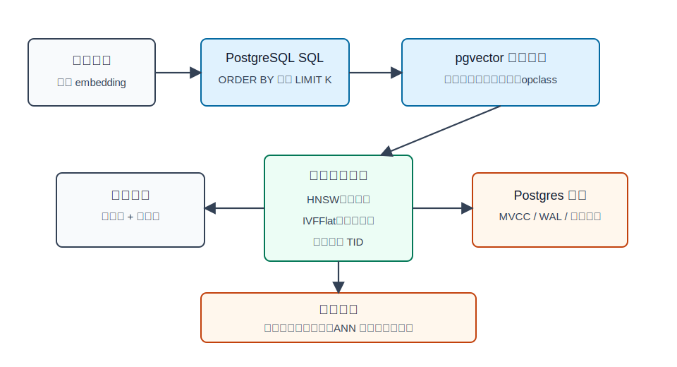
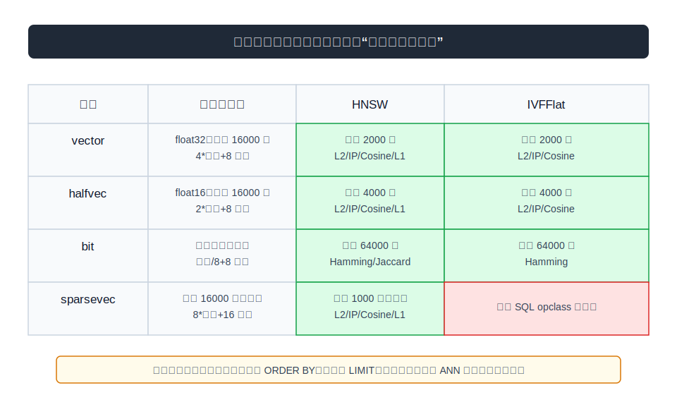
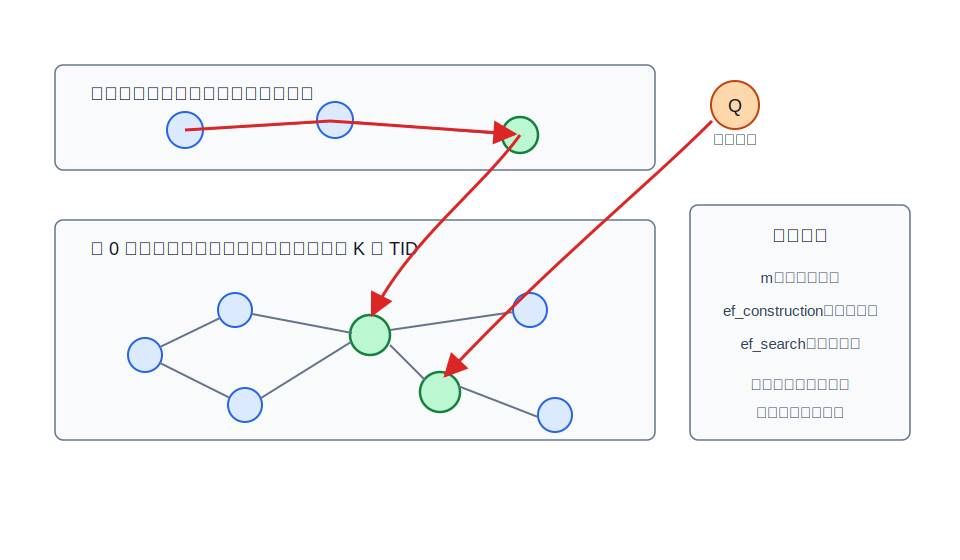
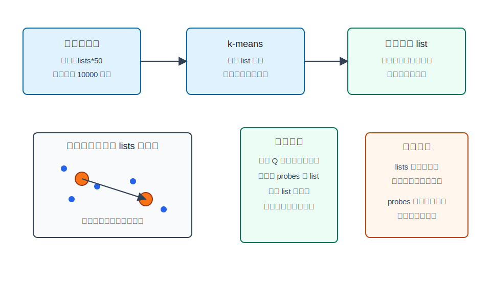
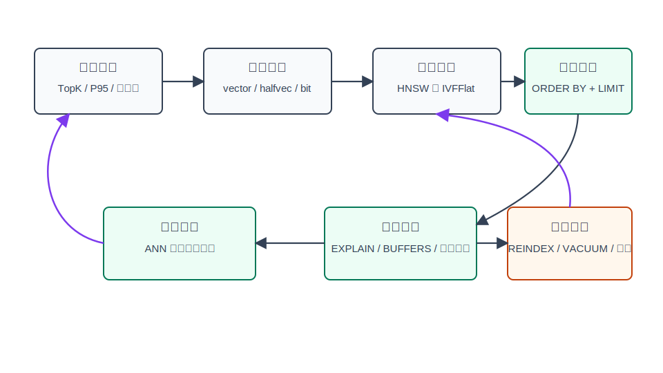

## 数据库筑基课 - 应用实践之 pgvector

### 作者
digoal

### 日期
2026-05-31

### 标签
PostgreSQL , 应用开发者 , 数据库筑基课 , 向量检索 , ANN , HNSW , IVFFlat    

----

## 背景
  


本文属于“应用实践 + 数据类型/操作符 + 索引结构”的交叉主题。当前工作区未发现“数据库筑基课”总纲文件，因此本文按用户给定标题独立成篇。

AI 应用接入数据库后，第一个工程问题通常不是“能不能存 embedding”，而是：向量、业务属性、权限、事务、审计、冷热数据、备份恢复能不能放在同一个系统里管理。把向量单独放进专用向量库可以获得专门优化，但也会带来双写、一致性、权限同步、召回结果回表、故障恢复链路变长等成本。pgvector 的定位是把向量相似搜索放回 PostgreSQL：用扩展注册向量类型、距离操作符和索引访问方法，让应用在 SQL、事务、WAL、备份恢复和普通关系查询里完成向量检索。

这不是免费午餐。pgvector 的近似索引 HNSW 和 IVFFlat 本质上是 ANN（Approximate Nearest Neighbor）结构：它们用召回率换延迟和吞吐。对数据库架构师、DBA 和业务开发者来说，核心不是会写 `CREATE EXTENSION vector;`，而是理解下面这条线：

> 向量表示如何落到 PostgreSQL 类型；距离如何成为操作符；操作符如何绑定 opclass；opclass 如何让优化器选择 HNSW/IVFFlat；ANN 结果如何被业务过滤、召回率、维护成本和 MVCC 语义影响。

## 一、它解决什么问题？

pgvector 解决的是“把向量检索纳入数据库工程体系”的问题。

传统做法有三类：

| 做法 | 好处 | 主要问题 |
|---|---|---|
| 只用 PostgreSQL 表存数组，顺序扫描算距离 | 事务简单，工程栈少 | 大表 TopK 延迟高，表达距离语义困难 |
| 向量放专用向量库，业务数据放 PostgreSQL | 检索能力强，生态成熟 | 双写、一致性、权限、备份、回表链路复杂 |
| PostgreSQL + pgvector | 向量和业务数据共库，SQL 组合能力强 | ANN 索引需要调参，召回率和维护成本要自己验证 |

它把问题从“我需要一个新的存储系统吗”转化为“我能否在 PostgreSQL 内用足够好的向量索引满足业务 SLA”。代价也清楚：如果业务需要极致大规模、复杂分布式召回、多阶段向量流水线或专门 GPU 检索，单机 PostgreSQL 扩展未必是最佳边界；如果业务强依赖事务一致性、权限控制、SQL 过滤和中小规模向量检索，pgvector 往往是更低工程复杂度的选择。

## 二、它是什么？

pgvector 是 PostgreSQL 扩展。它在 `sql/vector.sql` 中注册：

- `vector`、`halfvec`、`sparsevec` 类型，以及 PostgreSQL 原生 `bit` 类型上的距离函数。
- 距离操作符：`<->` L2、`<#>` 负内积、`<=>` cosine distance、`<+>` L1、`<~>` Hamming、`<%>` Jaccard。
- 两个索引访问方法：`ivfflat` 和 `hnsw`。
- 面向不同类型和距离的 operator class，例如 `vector_l2_ops`、`vector_cosine_ops`、`halfvec_l2_ops`、`bit_hamming_ops`、`sparsevec_l2_ops`。

从 PostgreSQL 视角看，pgvector 不是“外挂服务”，而是一个类型、函数、操作符、索引 AM 的组合。查询能够走索引，不是因为列名叫 `embedding`，而是因为 SQL 里出现了被 opclass 支持的距离操作符，并且查询形态是按距离升序排序再 `LIMIT`。



图 1 说明：应用生成 embedding 后写入 PostgreSQL；pgvector 在 SQL 层提供类型、操作符和索引访问方法；HNSW/IVFFlat 返回候选 TID，最终仍回到 PostgreSQL 的堆表、MVCC、WAL 和普通 SQL 执行体系里。

## 三、核心原理

### 3.1 类型：存储上限和索引上限要分开看

源码里 `src/vector.h` 定义 `VECTOR_MAX_DIM 16000`，`src/halfvec.h` 定义 `HALFVEC_MAX_DIM 16000`，`src/sparsevec.h` 定义 `SPARSEVEC_MAX_DIM 1000000000` 和 `SPARSEVEC_MAX_NNZ 16000`。README 的 Reference 部分给出存储成本：

| 类型 | 存储模型 | 存储成本 | 存储侧上限 | 常见用途 |
|---|---|---:|---:|---|
| `vector` | float32 稠密向量 | `4 * dimensions + 8` 字节 | 16000 维 | 常规 embedding |
| `halfvec` | float16 稠密向量 | `2 * dimensions + 8` 字节 | 16000 维 | 降低存储和索引工作集 |
| `bit` | 二进制向量 | `dimensions / 8 + 8` 字节 | README 描述为 bit 向量能力，索引侧有限制 | 二值量化、Hamming/Jaccard |
| `sparsevec` | 稀疏向量 | `8 * non-zero elements + 16` 字节 | 16000 非零元素 | 稀疏特征、关键词权重 |

但是 HNSW/IVFFlat 的索引限制更低：README 明确 HNSW 支持 `vector` 2000 维、`halfvec` 4000 维、`bit` 64000 维、`sparsevec` 1000 个非零元素；IVFFlat 支持 `vector` 2000 维、`halfvec` 4000 维、`bit` 64000 维。源码中 `src/hnsw.h` 有 `HNSW_MAX_DIM 2000`、`HNSW_MAX_NNZ 1000`，`src/ivfflat.h` 有 `IVFFLAT_MAX_DIM 2000`；`src/hnswutils.c` 和相关 support function 会按类型放宽 halfvec/bit 的可索引维度。

工程含义是：能存不等于能直接建 ANN 索引。如果模型输出超过 2000 维，常见路径是 half-precision indexing、binary quantization、subvector indexing 或降维，而不是盲目建 `vector_l2_ops`。



图 2 说明：类型、距离操作符和索引 opclass 是三层不同概念。建模时先选存储类型，再选距离语义，最后确认目标索引方法是否支持对应类型和维度。

### 3.2 操作符：距离语义必须写进 SQL

pgvector 的 SQL 接口把距离变成操作符：

```sql
SELECT id, content
FROM items
ORDER BY embedding <=> '[0.1,0.2,0.3]'::vector
LIMIT 10;
```

这里 `<=>` 是 cosine distance，不是 cosine similarity。相似度可以写成 `1 - (embedding <=> query)`，但 README 的 Troubleshooting 提醒：索引查询需要 `ORDER BY` 的结果是距离操作符本身，并且是升序。如果写成 `ORDER BY 1 - (embedding <=> query) DESC`，语义上等价，但不匹配 ANN opclass 的 `ORDER BY float_ops` 入口，优化器不会按预期使用索引。

`<#>` 返回“负内积”也是同一个原因：PostgreSQL 索引扫描按升序拿最小值更自然，所以最大内积被转化成最小负内积。业务展示真实 inner product 时需要乘以 `-1`。

### 3.3 HNSW：多层小世界图，用内存和构图成本换召回

HNSW 创建多层图。高层节点少、边长，负责快速接近目标区域；第 0 层节点全、边密，负责候选扩展。`src/hnswscan.c` 的 `GetScanItems()` 体现了论文式流程：先从 metapage 拿 `m` 和入口点；从入口点最高层向下逐层用 `ef=1` 贪心搜索；到第 0 层再用 `hnsw_ef_search` 扩展候选。

关键参数：

- `m`：每层最大连接数，默认 16，源码 `HNSW_DEFAULT_M`。
- `ef_construction`：构图候选列表大小，默认 64，越大通常召回越好，但构建更慢、插入更慢。
- `hnsw.ef_search`：查询候选列表大小，默认 40，越大召回越高、延迟和内存越高。
- `hnsw.iterative_scan`：过滤条件导致候选不足时，0.8.0 起可以继续扫描更多候选，支持 `strict_order` 和 `relaxed_order`。
- `hnsw.max_scan_tuples` 与 `hnsw.scan_mem_multiplier`：控制迭代扫描边界。

`src/hnswbuild.c` 的文件头说明了构建阶段的工程路径：先尽量把图放在内存里；当图超过 `maintenance_work_mem` 限制时，调用 `FlushPages()` 物化到磁盘并切换到 on-disk 阶段。源码在内存不足时会发出 “hnsw graph no longer fits into maintenance_work_mem...” 的 NOTICE。README 也建议在不耗尽服务器内存的前提下提高 `maintenance_work_mem` 来加速构建。



图 3 说明：HNSW 的快来自“先在稀疏高层找到方向，再在第 0 层扩展候选”。`m`、`ef_construction` 和 `ef_search` 本质上都在调“图质量、候选规模、资源消耗”的平衡。

### 3.4 IVFFlat：先聚类，再只扫一部分桶

IVFFlat 把向量空间切成多个 list。建索引时采样、k-means 求中心，再把每条向量放到最近中心对应的 list；查询时先计算查询向量到各中心的距离，只扫描最近的 `probes` 个 list。

源码路径很直接：

- `src/ivfbuild.c` 的 `InitBuildState()` 要求列有固定维度；维度超过 typeInfo 的 `maxDimensions` 会报错；cosine/IP 相关 opclass 会要求适当的 norm 处理。
- `ComputeCenters()` 目标采样数是 `lists * 50`，并至少 10000；如果样本数少于 lists，会发出“ivfflat index created with little data / This will cause low recall”的 NOTICE。
- `src/ivfscan.c` 的 `GetScanLists()` 会遍历 list 中心，保留距离最近的若干 list；`GetScanItems()` 扫描这些 list 内条目，把候选按真实距离排序。
- `src/ivfinsert.c` 的 `FindInsertPage()` 对新增向量查找最近中心并插入对应 list。

关键参数：

- `lists`：建索引时的倒排桶数，默认 100，源码 `IVFFLAT_DEFAULT_LISTS`。
- `ivfflat.probes`：查询时扫描多少个 list，默认 1。
- `ivfflat.iterative_scan` 与 `ivfflat.max_probes`：过滤条件或候选不足时控制迭代扫描。

README 给出经验起点：100 万行以内可从 `rows / 1000` 的 lists 开始，超过 100 万行可从 `sqrt(rows)` 开始；查询时 `probes` 可从 `sqrt(lists)` 开始。注意这只是起点，不是 SLA 保证。



图 4 说明：IVFFlat 的召回依赖中心质量和 probes。建索引前数据太少、lists 过多、probes 过低，都会让查询只看到局部空间，返回结果少或召回差。

### 3.5 优化器入口：没有 ORDER BY 距离 LIMIT，就不是 KNN 语义

`src/hnsw.c` 和 `src/ivfflat.c` 的 cost estimate 都有类似逻辑：如果 `path->indexorderbys == NIL`，就把索引启动成本和总成本设为无穷大。换句话说，ANN 索引不是普通过滤索引；它需要 `ORDER BY embedding <distance-op> query LIMIT k` 这个形态来表达 TopK 最近邻。

这也是很多线上“建了索引但不走索引”的根因。比如：

```sql
-- 容易走 pgvector ANN 索引
SELECT id
FROM items
ORDER BY embedding <-> '[3,1,2]'::vector
LIMIT 5;

-- 只是距离过滤，不是 KNN 索引入口；README 也提示要结合 ORDER BY 和 LIMIT
SELECT id
FROM items
WHERE embedding <-> '[3,1,2]'::vector < 5;
```

## 四、横向对比

| 维度 | 精确顺序扫描 | HNSW | IVFFlat | 专用向量库 |
|---|---|---|---|---|
| 主要目标 | 100% 召回，简单可靠 | 高召回低延迟 | 更快构建、更低内存 | 极致检索能力与专用生态 |
| 写入代价 | 低 | 较高，维护图结构 | 中等，找最近 list 后插入 | 取决于系统，通常需同步链路 |
| 读取代价 | O(N) 算距离 | 图遍历 + 候选扩展 | 中心匹配 + 扫描 probes 个 list | 取决于引擎和部署 |
| 空间成本 | 仅表数据 | 图边和索引元数据较多 | list 中心和倒排条目 | 额外服务和副本 |
| 事务/MVCC | PostgreSQL 原生 | PostgreSQL 原生，但 ANN 候选受死元组影响 | PostgreSQL 原生，但训练质量影响召回 | 通常需要应用层一致性方案 |
| 适合场景 | 小表、离线校验、召回基准 | 在线 TopK、高召回要求 | 数据相对稳定、快速建索引 | 超大规模、专用检索功能 |
| 不适合场景 | 大表高并发在线检索 | 极快构建、极低内存 | 空表建索引、数据分布剧烈变化 | 强 SQL 事务一致性但不想双写 |

这张表的关键不是“谁最好”，而是“哪个成本是你愿意承担的”。pgvector 的优势在工程一致性：一个 PostgreSQL 事务可以同时更新业务字段和 embedding；备份、WAL、复制、权限可以沿用数据库体系。但当向量检索成为独立核心基础设施，且规模、召回策略、重排链路都很复杂时，专用向量系统的收益会变大。

## 五、效果如何？

pgvector 的效果要从四组指标判断。

第一，召回率。README 明确：默认精确搜索有完美召回；加入近似索引后，查询结果可能不同。生产上必须用精确扫描作为基准抽样对比，例如在事务内临时关闭 indexscan，拿 ANN 结果和精确 TopK 做 recall@K。

第二，延迟和吞吐。HNSW 主要受 `ef_search`、图大小、过滤条件、内存命中影响；IVFFlat 主要受 `lists`、`probes`、桶均衡和 list 内条目数量影响。不要脱离 `EXPLAIN (ANALYZE, BUFFERS)` 谈性能。

第三，空间和内存。`halfvec` 可把稠密向量存储从每维 4 字节降到 2 字节；binary quantization 可把索引工作集进一步压低，但需要 re-rank 以改善召回。README 也提醒索引不必完全放入内存，但放入内存通常表现更好。

第四，维护成本。HNSW vacuum 可能耗时，README 建议先 `REINDEX INDEX CONCURRENTLY index_name;` 再 `VACUUM table_name;`。IVFFlat 对初始训练数据敏感，空表或少量数据时建索引会造成低召回，通常应先装载数据再建索引。



图 5 说明：pgvector 不是“一次建索引就结束”。业务目标、向量表示、索引参数、召回校验、性能观测和维护动作需要形成闭环。

## 六、实操 DEMO

以下 SQL 为最小可验证实验脚本。本文未在本机执行这些 SQL，因为当前任务没有启动 PostgreSQL 实例并安装本地 `pgvector` 扩展；语法按 pgvector README 和 `sql/vector.sql` 接口编写。

### 6.1 精确检索与 HNSW

```sql
CREATE EXTENSION IF NOT EXISTS vector;

DROP TABLE IF EXISTS items;

CREATE TABLE items (
    id bigserial PRIMARY KEY,
    category_id int NOT NULL,
    content text NOT NULL,
    embedding vector(3) NOT NULL
);

INSERT INTO items (category_id, content, embedding) VALUES
    (1, 'postgres vector search', '[1,2,3]'),
    (1, 'database index internals', '[1,1,2]'),
    (2, 'image embedding example', '[4,5,6]'),
    (2, 'semantic search demo', '[3,1,2]');

-- 精确 TopK：没有 ANN 索引也能执行
SELECT id, content, embedding <-> '[3,1,2]'::vector AS distance
FROM items
ORDER BY embedding <-> '[3,1,2]'::vector
LIMIT 3;

-- HNSW：为 L2 距离建立 opclass
CREATE INDEX items_embedding_hnsw_l2
ON items
USING hnsw (embedding vector_l2_ops);

SET hnsw.ef_search = 100;

EXPLAIN (ANALYZE, BUFFERS)
SELECT id, content
FROM items
ORDER BY embedding <-> '[3,1,2]'::vector
LIMIT 3;
```

### 6.2 过滤条件与迭代扫描

```sql
-- 业务过滤先用普通 B-tree 支撑
CREATE INDEX items_category_id_idx ON items (category_id);

-- ANN 索引扫描后才应用过滤；过滤选择性强时要校验召回
SET hnsw.iterative_scan = strict_order;
SET hnsw.max_scan_tuples = 20000;

SELECT id, content
FROM items
WHERE category_id = 1
ORDER BY embedding <-> '[3,1,2]'::vector
LIMIT 3;
```

### 6.3 IVFFlat 的正确建索引时机

```sql
-- IVFFlat 应在表里已有足够样本后创建
DROP INDEX IF EXISTS items_embedding_ivf_l2;

CREATE INDEX items_embedding_ivf_l2
ON items
USING ivfflat (embedding vector_l2_ops)
WITH (lists = 10);

SET ivfflat.probes = 4;

SELECT id, content
FROM items
ORDER BY embedding <-> '[3,1,2]'::vector
LIMIT 3;
```

真实生产数据上，示例中的 `lists = 10` 只用于演示。实际要按数据量、分布和 recall@K 结果调参。

### 6.4 用精确搜索校验 ANN 召回

```sql
-- ANN 结果
SELECT id
FROM items
ORDER BY embedding <=> '[3,1,2]'::vector
LIMIT 10;

-- 精确基准：临时禁用 indexscan，拿结果集合做离线对比
BEGIN;
SET LOCAL enable_indexscan = off;
SELECT id
FROM items
ORDER BY embedding <=> '[3,1,2]'::vector
LIMIT 10;
COMMIT;
```

README 使用这种思路监控 recall。线上不要只看 P95 latency，不看 recall@K；低延迟但召回错误，对推荐、检索增强生成和风控相似案例都可能是业务错误。

## 七、最佳实践

面向数据库架构师：

1. 先判断是否需要专用向量系统。若业务强依赖 PostgreSQL 事务、权限、SQL 过滤、备份恢复，优先评估 pgvector；若需要超大规模独立召回平台、复杂多路召回和专用硬件，评估专门系统。
2. 把向量召回设计成两阶段：ANN 取较大的候选集，再用原始向量或业务模型 re-rank。binary quantization 和 subvector indexing 尤其需要 re-rank。
3. 明确 SLA 同时包含 latency、QPS、recall@K、更新延迟、重建窗口和索引大小。

面向 DBA：

1. 建索引前先确认维度、opclass 和查询距离一致。`vector_cosine_ops` 对应 cosine distance，`vector_l2_ops` 对应 L2，不要一个索引用所有距离。
2. 批量导入后再建索引。HNSW 和 IVFFlat 都可从已有数据建更合理的结构；IVFFlat 对这一点尤其敏感。
3. HNSW 构建关注 `maintenance_work_mem` 和 NOTICE；IVFFlat 构建关注 `pg_stat_progress_create_index` 的 k-means、assigning tuples、loading tuples 阶段。
4. 生产建索引用 `CREATE INDEX CONCURRENTLY` 降低写阻塞；维护 HNSW 时评估 `REINDEX INDEX CONCURRENTLY` 后再 `VACUUM`。
5. 对“索引不使用”先查 SQL 形态：是否 `ORDER BY distance_operator ASC LIMIT k`，是否把距离包成表达式，表是否太小，opclass 是否匹配。

面向业务开发者：

1. 表结构里固定维度更利于索引和约束，例如 `embedding vector(1536)`；如果同表混多个模型维度，用 `model_id` + expression/partial index。
2. 对过滤条件要有选择性意识。ANN 先找近邻再过滤时，`WHERE category_id = 123` 可能导致返回不足；可考虑普通索引、partial index、partition 或 iterative scan。
3. 统一封装查询模板，禁止随意把 `ORDER BY embedding <=> query` 改成 `ORDER BY 1 - (...) DESC`。
4. 记录每次 embedding 模型升级的版本。不同模型、不同维度、不同归一化方式混用，会让距离语义失效。

## 八、适合与不适合场景

适合：

- RAG 知识库、企业内部文档检索、商品/内容相似推荐、用户画像相似人群等需要 TopK 相似搜索，同时强依赖关系过滤和事务一致性的场景。
- 中小规模到较大规模的在线向量检索，能够接受通过 recall@K 调参的 ANN 语义。
- 需要把向量和业务字段、租户权限、软删除、审计字段放在同一 SQL 模型中的系统。

不适合：

- 要求 ANN 结果和精确扫描完全一致，但又不能承担顺序扫描成本的场景。ANN 的定义就是近似。
- 数据刚开始很少却提前创建 IVFFlat，并期望未来自动得到高召回的场景。IVFFlat 的中心来自建索引时的数据。
- 高维向量直接超过索引维度上限，又不愿降维、halfvec、binary quantization 或 subvector 的场景。
- 过滤条件高度复杂且过滤后结果极少，却只依赖默认 `ef_search=40` 或 `probes=1` 的场景。
- 需要独立分布式向量平台能力、跨模态复杂召回编排、专用 GPU/压缩索引体系的场景。

## 九、常见坑

1. 把“能存 16000 维”误解成“能用 vector_l2_ops 建 16000 维 HNSW/IVFFlat 索引”。存储上限和索引上限不同。
2. 建了索引但 SQL 不走索引。最常见原因是缺少 `ORDER BY <distance_operator> LIMIT`，或把距离操作符包进相似度表达式。
3. 内积方向弄反。`<#>` 返回负内积，展示真实 inner product 要乘以 `-1`。
4. cosine 距离和 cosine 相似度混淆。`<=>` 是距离，越小越近；`1 - distance` 才是相似度展示值。
5. IVFFlat 空表建索引。源码和 README 都提示数据太少会低召回；应在有代表性样本后创建或重建。
6. 过滤条件后置导致返回不足。默认 `hnsw.ef_search=40` 时，如果过滤条件只命中 10%，平均只剩约 4 个候选命中；需要增大候选、启用 iterative scan，或调整数据建模。
7. 只看 latency 不看 recall。ANN 索引上线必须有精确基准抽样对比。
8. 忽略 dead tuples 和维护。README 提到 HNSW 查询结果可能受 dead tuples 影响，HNSW vacuum 也可能耗时。
9. 多模型 embedding 混在同一列但不记录模型版本。距离只在同一向量空间里有意义。
10. 把 halfvec 或 binary quantization 当无损优化。它们降低工作集，但可能影响精度，通常需要 re-rank。

## 十、扩展问题

1. 如果你的业务 TopK 必须带租户、类目、时间、权限过滤，应该用 partial index、partition、普通过滤索引，还是更大的 ANN candidate set？
2. 如果 embedding 模型从 768 维升级到 1536 维，表结构、索引、召回评估和回滚方案分别怎么设计？
3. HNSW 的 `ef_search` 从 40 提到 200 后，召回率、P95 latency、work_mem 消耗、CPU 使用率如何一起观测？
4. IVFFlat 的 `lists` 增大后，为什么查询可能更快也可能召回更差？这个结论和 `probes` 的关系是什么？
5. 什么时候应该把 pgvector 作为主检索，什么时候只把它作为候选召回或兜底精确校验？

## 十一、扩展阅读

- pgvector README：[`../pgvector/README.md`](../pgvector/README.md)
- pgvector SQL schema：[`../pgvector/sql/vector.sql`](../pgvector/sql/vector.sql)
- pgvector 架构提示：[`../pgvector/CLAUDE.md`](../pgvector/CLAUDE.md)
- `vector` 类型实现：[`../pgvector/src/vector.c`](../pgvector/src/vector.c)，[`../pgvector/src/vector.h`](../pgvector/src/vector.h)
- `halfvec` 类型实现：[`../pgvector/src/halfvec.c`](../pgvector/src/halfvec.c)，[`../pgvector/src/halfvec.h`](../pgvector/src/halfvec.h)
- `sparsevec` 类型实现：[`../pgvector/src/sparsevec.c`](../pgvector/src/sparsevec.c)，[`../pgvector/src/sparsevec.h`](../pgvector/src/sparsevec.h)
- HNSW 索引实现：[`../pgvector/src/hnsw.c`](../pgvector/src/hnsw.c)，[`../pgvector/src/hnsw.h`](../pgvector/src/hnsw.h)，[`../pgvector/src/hnswscan.c`](../pgvector/src/hnswscan.c)，[`../pgvector/src/hnswbuild.c`](../pgvector/src/hnswbuild.c)，[`../pgvector/src/hnswutils.c`](../pgvector/src/hnswutils.c)
- IVFFlat 索引实现：[`../pgvector/src/ivfflat.c`](../pgvector/src/ivfflat.c)，[`../pgvector/src/ivfflat.h`](../pgvector/src/ivfflat.h)，[`../pgvector/src/ivfbuild.c`](../pgvector/src/ivfbuild.c)，[`../pgvector/src/ivfscan.c`](../pgvector/src/ivfscan.c)，[`../pgvector/src/ivfinsert.c`](../pgvector/src/ivfinsert.c)
- DeepWiki：`pgvector/pgvector` 架构问答，本次用于导航，关键结论已回查本地 README、SQL schema 和 C 源码。
  
## 附录 

1、克隆代码  
```  
git clone --depth 1 https://github.com/pgvector/pgvector
```  
  
2、启用 codex, 使用 [数据库筑基课 skill](../skills/README.md).  
```
文章标题: 
  数据库筑基课 - 应用实践之 pgvector
项目源码(本地目录): 
  pgvector
项目 codebase 文件名: 
  pgvector/CLAUDE.md 
开源项目相关的 deepwiki repoName: 
  pgvector/pgvector
```

  
  
#### [PostgreSQL 解决方案集合](../201706/20170601_02.md "40cff096e9ed7122c512b35d8561d9c8")
  
  
#### [德哥 / digoal's Github - 公益是一辈子的事.](https://github.com/digoal/blog/blob/master/README.md "22709685feb7cab07d30f30387f0a9ae")
  
  
#### [About 德哥](https://github.com/digoal/blog/blob/master/me/readme.md "a37735981e7704886ffd590565582dd0")
  
  

  
