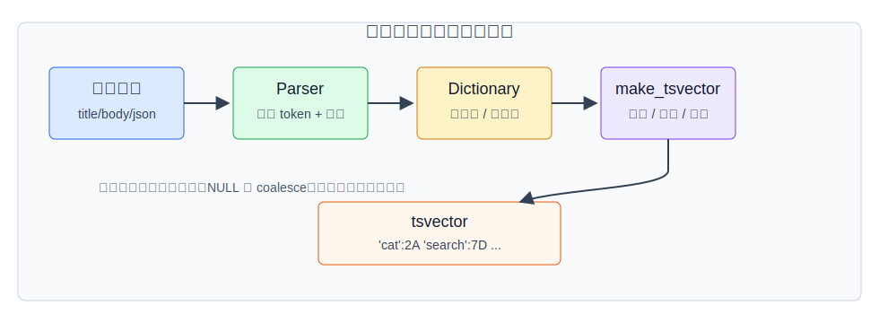
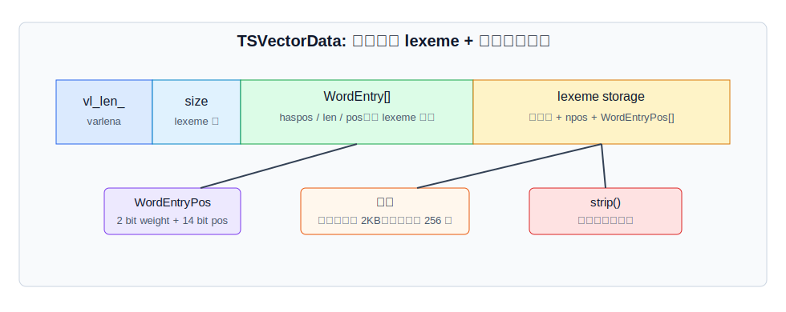
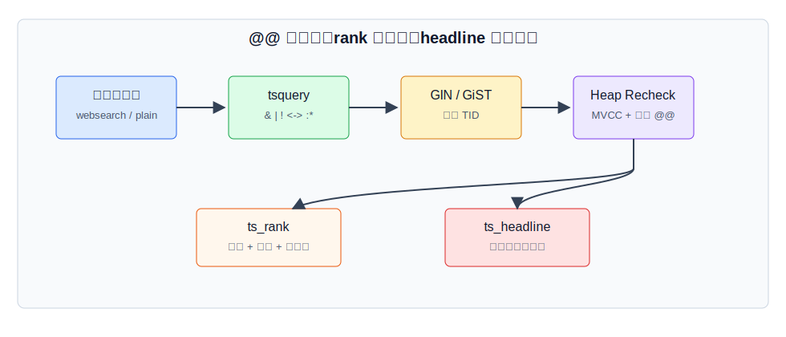
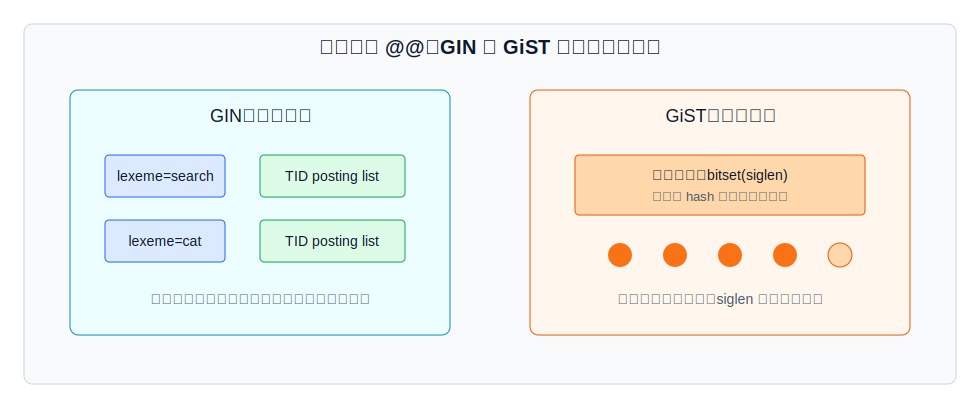
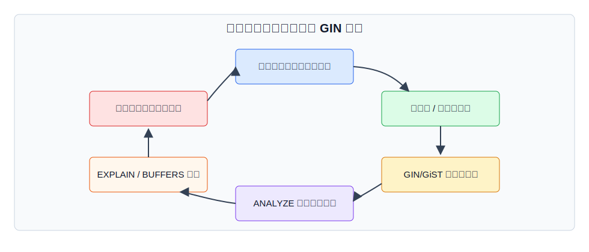

## 数据库筑基课 - 应用实践之 tsvector

### 作者
digoal

### 日期
2026-05-31

### 标签
PostgreSQL , 应用开发者 , 数据库筑基课 , 全文检索 , tsvector , GIN , GiST    

----

## 背景
  


本文属于“应用实践 + 数据类型/操作符 + 索引结构”的交叉主题。当前工作区未发现“数据库筑基课”总纲文件，因此本文按用户给定标题独立成篇。

很多应用一开始用 `LIKE '%keyword%'`、正则或外部搜索服务解决文本搜索。小数据量时这很直接；一旦文档有标题、正文、标签、语言差异、排序权重、分页、权限过滤和事务一致性，问题就变成了：搜索表示在哪里生成，怎么更新，怎么索引，怎么让优化器估算代价，怎么证明结果不是“能查到但不好用”。

PostgreSQL 的 `tsvector` 是把自然语言文本变成数据库可索引表示的基础类型。它不是一个完整搜索产品，而是全文检索链路中的“文档表示层”：parser 把文本切成 token，dictionary 把 token 归一化成 lexeme，`tsvector` 保存 lexeme、位置和权重，`tsquery` 表达查询，`@@` 判断匹配，GIN/GiST 负责加速候选集合。

核心判断是：

> `tsvector` 把“文本搜索”转化为“归一化词项集合上的布尔匹配 + 位置/权重排序 + 索引候选回表确认”。它的优势是 SQL、事务、MVCC、权限和业务过滤一体化；代价是语言配置、索引维护、排序质量和召回边界需要应用自己验证。

## 一、它解决什么问题？

`tsvector` 解决的不是“字符串包含”问题，而是“面向自然语言的可维护、可索引、可排序的文档检索表示”问题。

传统做法有三个明显短板：

| 做法 | 好处 | 主要问题 |
|---|---|---|
| `LIKE` / `ILIKE` / 正则 | 实现快，不需要额外模型 | 缺少词形归一化、停用词、相关性排序；大表常要扫描大量文本 |
| 应用侧分词后存普通数组/JSON | 可控性高 | 查询语义和索引能力弱，统计信息、排序、维护都要自己拼 |
| 外部搜索引擎 | 功能强，生态成熟 | 双写、一致性、权限同步、回表、备份恢复链路变长 |

`tsvector` 的价值在于把文档预处理结果放进 PostgreSQL 类型系统：它可以进入表达式索引或存储生成列，可以被 GIN/GiST 索引，可以被 `ANALYZE` 收集 lexeme 统计信息，也可以和普通 SQL 条件组合。

代价也很清楚：PostgreSQL 全文检索不是倒排搜索引擎的完整替代品。它适合和关系数据强绑定的站内搜索、工单、知识库、商品标题、日志摘要、权限过滤搜索；如果需要复杂召回策略、分布式大规模索引、多字段 BM25 调参、拼写纠错、同义词运营平台和专门相关性学习，外部搜索系统通常更合适。

## 二、它是什么？

`tsvector` 是 PostgreSQL 内置全文检索类型，用来保存预处理后的文档。官方文档把全文检索的预处理拆成三步：把文档解析为 token；用 dictionary 把 token 转成归一化 lexeme 并过滤停用词；把结果保存成适合搜索的表示。`tsvector` 对应第三步。

一个典型值长这样：

```sql
SELECT to_tsvector('english', 'A fat cat sat on a mat and ate fat rats');
-- 示例形态：'ate':9 'cat':3 'fat':2,11 'mat':7 'rat':12 'sat':4
```

这里有几个容易混淆的点：

- token 是 parser 从原文切出来的片段；lexeme 是 dictionary 归一化后的检索词。
- `tsvector` 本身不“理解语言”，语言规则来自 text search configuration。
- `tsvector` 保存的是去重、排序后的 lexeme；可选保存位置和权重。
- `tsquery` 是查询表达式，支持 `&`、`|`、`!`、`<->`、前缀匹配和权重限制。
- `@@` 只是匹配判断；相关性排序要显式调用 `ts_rank` 或 `ts_rank_cd`。



图 1 说明：业务文本不会直接进入索引。它先按配置切分和归一化，再在 `make_tsvector()` 中排序、去重并保存位置。工程上最重要的约束是：配置要显式、NULL 要处理、字段权重要在生成阶段设计好。

## 三、核心原理

### 3.1 生成链路：配置决定结果

`to_tsvector(config, document)` 在源码 `src/backend/tsearch/to_tsany.c` 中走 `parsetext()`，然后由 `make_tsvector()` 生成最终值。`make_tsvector()` 会：

1. 对解析出的词按 lexeme 和位置排序。
2. 合并重复 lexeme。
3. 为每个 lexeme 保存位置数组。
4. 构造 `TSVectorData` 这个 varlena 值。

这解释了为什么同一段原文在不同配置下结果不同。英文配置会做词干化和停用词过滤；中文、日文、混合语言如果没有合适 parser/dictionary，默认效果通常不能满足业务语义。多语言系统不要依赖会话级 `default_text_search_config`，应该把配置显式写进生成列、表达式索引或每行 `regconfig` 字段。

### 3.2 物理表示：lexeme 排序，位置和权重打包

`src/include/tsearch/ts_type.h` 给出了 `tsvector` 的物理结构：

- varlena 头。
- `int32 size`，表示 lexeme 个数。
- `WordEntry[]`，每个 lexeme 一个条目，按 `tsCompareString()` 排序。
- lexeme 字符串存储区，字符串不以 `\0` 结尾。
- 如果有位置信息，则保存 `npos` 和 `WordEntryPos[]`。

`WordEntry` 里 `len` 是 11 bit，单个 lexeme 最长约 2KB；`pos` 是 20 bit，词位区偏移最大约 1MB。`WordEntryPos` 用 16 bit 同时保存权重和位置，其中 2 bit 是权重，14 bit 是位置；源码定义每个 lexeme 最多保存 256 个位置。



图 2 说明：`tsvector` 不是原文副本，而是紧凑的检索表示。`strip(tsvector)` 可以移除位置和权重，节省空间，但会让 `ts_rank_cd` 这类依赖位置的排序失效或退化。

### 3.3 匹配语义：`@@` 执行 tsquery 表达式树

`@@` 在系统目录中绑定到 `ts_match_vq` 和 `ts_match_qv`，选择率函数是 `tsmatchsel`。源码 `src/backend/utils/adt/tsvector_op.c` 中，`ts_match_vq()` 会把 `tsvector` 的 `WordEntry[]` 和 lexeme 字符串传给 `TS_execute()`，按 `tsquery` 的表达式树递归判断。

这带来三个实践结论：

- 空 `tsquery` 不匹配任何行。
- `!foo` 这类没有正向必需词的查询很难高效利用倒排候选。
- 短语查询和权重限制通常需要位置信息或回表 recheck，不能只看索引是否返回候选。

常用查询构造函数的边界不同：

| 函数 | 适合输入 | 特点 |
|---|---|---|
| `to_tsquery` | 已按 `tsquery` 语法组织的输入 | 支持操作符、权重、前缀；用户输入不可信时要谨慎 |
| `plainto_tsquery` | 普通关键词 | 不识别操作符，通常用 `&` 连接词项 |
| `phraseto_tsquery` | 短语 | 用 `<->` 或带距离的短语操作符表达相邻关系 |
| `websearch_to_tsquery` | 搜索框文本 | 更接近 Web 搜索语法，不因普通用户写法轻易报错 |

### 3.4 排序语义：匹配不等于相关

`@@` 只回答“是否匹配”。如果要把更相关的结果排前面，需要显式计算 rank：

- `ts_rank` 主要基于匹配 lexeme 的频率、权重和归一化选项。
- `ts_rank_cd` 使用 cover density ranking，会考虑匹配词之间的接近程度；官方文档说明它依赖位置信息， stripped lexeme 会被忽略。
- 默认权重数组是 `{0.1, 0.2, 0.4, 1.0}`，顺序对应 `{D, C, B, A}`。
- `ts_headline` 生成高亮摘要时使用原始文档，而不是只靠 `tsvector`。



图 3 说明：索引只能减少候选行；精确匹配、排序和摘要仍要看 `tsvector` 或原文。线上优化要分开看三段耗时：候选召回、回表 recheck、rank/headline 计算。

### 3.5 GIN：倒排索引，全文检索的默认优先选择

官方文档明确：GIN 是首选全文检索索引类型。GIN 为每个 lexeme 存一个索引项，后面接匹配位置的压缩 posting list。源码 `src/backend/utils/adt/tsginidx.c` 中：

- `gin_extract_tsvector()` 从 `tsvector` 提取每个 lexeme 作为 GIN key。
- `gin_extract_tsquery()` 从 `tsquery` 提取查询 operand，并为前缀匹配设置 partial match。
- `gin_tsquery_consistent()` / `gin_tsquery_triconsistent()` 用三值逻辑判断候选。
- 如果查询涉及权重或需要位置信息，GIN 可能返回 `MAYBE` 并要求 recheck。

GIN 的写入代价来自倒排结构：一行文档可能产生很多 lexeme index entries。`src/backend/access/gin/README` 和官方文档都说明了 fast update pending list：插入先进入临时未排序 pending list，VACUUM、autoanalyze、`gin_clean_pending_list()` 或超过 `gin_pending_list_limit` 时再批量合并到主 GIN 结构。

这提升写入吞吐，但带来两个运维风险：查询也要扫描 pending list，pending list 太大会拖慢搜索；触发前台 cleanup 的那次写入会明显变慢。

### 3.6 GiST：签名索引，空间和误判之间取舍

GiST 的 `tsvector_ops` 不是倒排表，而是签名索引。官方文档说明：每个文档被表示成固定长度 signature，默认 `siglen` 是 124 字节，最大 2024 字节；每个词 hash 到 bitset 的一个 bit，再 OR 成文档签名。不同词 hash 到同一 bit 会产生 false match，所以 GiST 是 lossy index，需要自动回表确认。

源码 `src/backend/utils/adt/tsgistidx.c` 对应这个模型：

- `gtsvector_compress()` 把 leaf 上的 `tsvector` 压成词项 CRC 数组；如果太大，再转成 bit signature。
- `gtsvector_consistent()` 明确把 `recheck` 设为 true。
- 非叶节点用 signature 做 union，查询时只能证明“不可能匹配”或“可能匹配”。

GiST 的优势是支持 `INCLUDE` 覆盖列，签名长度可调，某些写入和空间场景有价值；短板是误判导致随机回表，文档唯一词越多、签名越短，误判越明显。



图 4 说明：GIN 更像 lexeme 到行位置的倒排表，适合常规全文检索；GiST 更像文档签名树，靠 bitset 快速排除不可能匹配的行，但 false positive 是设计内代价。

### 3.7 统计信息：优化器需要知道常见 lexeme

`tsvector` 有自定义 typanalyze 函数 `ts_typanalyze`。源码 `src/backend/tsearch/ts_typanalyze.c` 说明，它不统计整列最常见 `tsvector` 值，而是统计最常见 lexeme，因为两行完整 `tsvector` 完全相同的概率通常很低。实现使用 Lossy Counting 算法近似统计高频 lexeme，并把结果放进 `pg_statistic` 的 MCELEM。

选择率估算在 `src/backend/tsearch/ts_selfuncs.c`。`tsmatchsel()` 只在能看到 `tsvector` 变量和常量 `tsquery` 时做比较好的估算；否则退回默认选择率 `0.005`。所以生产上要注意：

- 建索引后执行 `ANALYZE`。
- 高变化表依赖 autovacuum/autoanalyze 及时更新统计。
- 查询参数化或表达式过复杂时，估算可能退化。
- `EXPLAIN (ANALYZE, BUFFERS)` 比“我建了 GIN”更可信。

## 四、横向对比

| 维度 | `tsvector` + GIN | `tsvector` + GiST | `LIKE` / 正则 | 外部搜索引擎 |
|---|---|---|---|---|
| 主要目标 | PostgreSQL 内倒排全文检索 | 签名树过滤全文候选 | 简单字符串匹配 | 专门搜索能力 |
| 写入代价 | 中到高，lexeme 多时明显；pending list 可缓冲 | 中等，签名维护 | 低 | 取决于同步链路 |
| 读取代价 | 多词查询高效，可能 recheck | 可能 false positive 回表 | 大表常扫描 | 通常强，但要跨系统 |
| 排序能力 | `ts_rank` / `ts_rank_cd` | 同左 | 需要自写 | BM25/学习排序等更丰富 |
| 事务/MVCC | 原生 | 原生 | 原生 | 通常要处理双写一致性 |
| 适合场景 | 站内搜索、知识库、工单、商品标题 | 需要 GiST 特性或可接受误判 | 小表、后台低频查询 | 大规模搜索、复杂相关性 |
| 不适合场景 | 极复杂搜索产品、跨库全局搜索 | 高唯一词且不能接受误判回表 | 大表高并发搜索 | 强事务一致性且不愿双写 |

这张表的关键不是“PostgreSQL 全文检索替代一切”，而是“检索能力和工程复杂度在哪里平衡”。如果搜索结果必须和业务权限、事务更新、审计、备份恢复保持同一套数据库语义，`tsvector` 的工程价值很高。如果搜索本身就是产品核心，且召回、排序、纠错、推荐和多路召回都要运营，外部搜索系统更容易扩展。

## 五、效果如何？

效果要从四个角度评估。

第一，召回和匹配语义。`tsvector` 的召回取决于 parser/dictionary 配置。英文词干化能把 `rats` 归一化为 `rat`，但中文如果没有合适分词，默认配置很难得到业务想要的词项。评估前先看 `ts_debug()` 和 `to_tsvector()` 输出。

第二，查询延迟。GIN 多词匹配通常比顺序扫描文本快很多，但高频词、缺少正向必需词、pending list 过大、rank/headline 计算过重，都会让延迟升高。GiST 还要考虑 false positive 回表。

第三，写入和维护。存储生成列会让写入时计算 `tsvector`，GIN 会维护倒排索引。高写入表要监控 autovacuum、pending list、索引膨胀和前台 cleanup 抖动。

第四，排序质量。`ts_rank` 不是业务相关性的终点。字段权重、文档长度归一化、时间衰减、点击反馈、权限过滤后的 TopN 都可能影响最终排序。不要把 `@@` 当成“搜索质量完成”。



图 5 说明：正确路径是闭环：先定义文档单元和语言配置，再选择生成列或表达式索引，建立索引和统计信息，最后用 `EXPLAIN`、召回样本和线上指标反复校准。

## 六、实操 DEMO

以下 SQL 是最小可验证脚本。本文未在本机启动 PostgreSQL 实例执行这些 SQL，因此不提供伪造执行结果；语法依据 PostgreSQL 官方文档和本地源码接口。

### 6.1 用存储生成列维护 tsvector

```sql
DROP TABLE IF EXISTS articles;

CREATE TABLE articles (
    id bigserial PRIMARY KEY,
    tenant_id int NOT NULL,
    title text,
    body text,
    published_at timestamptz DEFAULT now(),
    search_doc tsvector GENERATED ALWAYS AS (
        setweight(to_tsvector('pg_catalog.english', coalesce(title, '')), 'A') ||
        setweight(to_tsvector('pg_catalog.english', coalesce(body,  '')), 'D')
    ) STORED
);

CREATE INDEX articles_search_doc_gin
ON articles USING GIN (search_doc);

INSERT INTO articles (tenant_id, title, body) VALUES
    (1, 'PostgreSQL full text search',
        'GIN indexes can accelerate tsvector queries.'),
    (1, 'Vector search in database',
        'Applications often combine keyword search and semantic search.'),
    (2, 'Operational notes',
        'Autovacuum and analyze keep planner statistics fresh.');

ANALYZE articles;
```

这里用存储生成列而不是触发器，是因为官方文档已经说明触发器方案被 stored generated column 替代。配置写成 `pg_catalog.english`，避免 `search_path` 或会话默认配置改变生成结果。

### 6.2 查询、排序和摘要

```sql
WITH q AS (
    SELECT websearch_to_tsquery('pg_catalog.english', 'postgres full text') AS query
)
SELECT
    a.id,
    a.title,
    ts_rank_cd(a.search_doc, q.query, 32) AS rank,
    ts_headline('pg_catalog.english', coalesce(a.body, ''), q.query) AS snippet
FROM articles a, q
WHERE a.tenant_id = 1
  AND a.search_doc @@ q.query
ORDER BY rank DESC, a.published_at DESC
LIMIT 10;
```

注意 `WHERE` 里的 `tenant_id` 是业务过滤，`search_doc @@ q.query` 是全文匹配，`ORDER BY rank DESC` 是相关性排序。GIN 索引负责减少候选行，不负责最终 rank 排序。

### 6.3 验证计划和 recheck

```sql
EXPLAIN (ANALYZE, BUFFERS)
WITH q AS (
    SELECT websearch_to_tsquery('pg_catalog.english', 'gin index') AS query
)
SELECT id, title
FROM articles a, q
WHERE a.search_doc @@ q.query
ORDER BY ts_rank_cd(a.search_doc, q.query, 32) DESC
LIMIT 10;
```

重点看：

- 是否使用 `Bitmap Index Scan` / `Bitmap Heap Scan` 或其他符合预期的索引路径。
- `Rows Removed by Index Recheck` 是否异常。
- buffer 命中和 heap blocks 是否说明回表过多。
- 排序是否在候选集合上完成，而不是全表计算 rank。

### 6.4 GIN pending list 维护

```sql
-- 查看 GIN 索引参数
SELECT relname, reloptions
FROM pg_class
WHERE relname = 'articles_search_doc_gin';

-- 手动清理 pending list，返回移除页数
SELECT gin_clean_pending_list('articles_search_doc_gin'::regclass);

-- 对单个索引调整 pending list 阈值
ALTER INDEX articles_search_doc_gin
SET (gin_pending_list_limit = '16MB');
```

这不是日常必须操作。正常情况下应让 autovacuum/autoanalyze 维持索引和统计信息；只有在批量写入、延迟抖动或维护窗口中，才需要显式处理。

## 七、最佳实践

面向数据库架构师：

- 先定义“文档单元”。一行是一个文档，还是标题、正文、评论、附件分开建模，会直接影响权限过滤、排序和索引大小。
- 多语言场景把 `regconfig` 作为建模字段，不要混用会话默认配置。
- PostgreSQL 内全文检索适合强事务、强权限、关系过滤场景；跨业务域全局搜索要评估外部搜索系统。
- 字段权重在生成阶段设计，例如标题 A、摘要 B、正文 D；后期只调 SQL rank 很难弥补表示层错误。

面向 DBA：

- 常规优先选 GIN，除非有明确 GiST 需求。
- 批量导入时可先装载数据再建 GIN，构建时给足 `maintenance_work_mem`。
- 高写入表关注 `fastupdate`、`gin_pending_list_limit`、autovacuum、索引膨胀和前台 cleanup 抖动。
- 建索引后执行 `ANALYZE`，并用 `EXPLAIN (ANALYZE, BUFFERS)` 验证真实路径。

面向业务开发者：

- 用户输入优先用 `websearch_to_tsquery` 或 `plainto_tsquery`，不要直接拼 `to_tsquery` 语法。
- 所有拼接字段使用 `coalesce()`，否则一个 NULL 会污染整个表达式。
- `@@` 只做过滤，排序要显式定义 rank、时间、业务权重和稳定 tie-breaker。
- `ts_headline` 需要原文，且可能消耗 CPU；分页列表中要控制摘要长度和返回条数。

## 八、适合与不适合场景

适合：

- 工单、知识库、文章、商品、配置项等关系数据内的站内搜索。
- 搜索必须和租户、权限、状态、时间范围等 SQL 条件强绑定。
- 数据量中等或可分区，查询以关键词匹配和简单相关性排序为主。
- 希望减少外部搜索系统双写和一致性成本。

不适合：

- 中文等语言没有合适分词配置，却期望开箱即用获得高质量召回。
- 搜索是核心产品能力，需要复杂同义词运营、拼写纠错、向量 + 关键词多路召回和学习排序。
- 全局超大规模文档集合，需要独立扩缩容、跨库聚合和专门搜索集群。
- 高写入高查询并发，但没有维护 autovacuum、pending list 和索引膨胀的能力。

## 九、常见坑

1. 表达式索引和查询表达式不一致。  
   `CREATE INDEX ... (to_tsvector('english', body))` 只能匹配同样显式配置的查询表达式；`to_tsvector(body)` 不能等价使用这个索引。

2. 忘记 `coalesce()`。  
   `title || ' ' || body` 中任意字段为 NULL，结果就是 NULL。生成列和表达式索引都应显式处理。

3. 把 `to_tsquery` 暴露给普通搜索框。  
   用户输入包含特殊符号时容易报错或改变语义。搜索框优先用 `websearch_to_tsquery`。

4. 以为 GIN 保存权重和位置。  
   官方文档说明 GIN 保存 lexeme，不保存权重标签；涉及权重或位置的查询需要 recheck。

5. 对中文直接套 `english` 配置。  
   `tsvector` 的质量取决于 parser/dictionary。语言配置错，索引再快也只是快速返回错误表示上的结果。

6. 只看是否命中索引，不看 rank 和回表。  
   查询慢可能发生在 rank 排序、headline 生成、heap recheck 或 pending list 扫描，不一定是索引没用。

7. 长文档不做字段拆分和权重。  
   标题、摘要、正文混在一个低权重向量里，排序质量通常不好。

8. 批量写入后不维护统计信息。  
   `ts_typanalyze` 统计常见 lexeme，优化器依赖它估算 `@@` 选择率。统计过旧会影响计划选择。

## 十、扩展问题

1. 如果同一张表里有英文、中文、日文文档，你会用单列 `tsvector`、多列 `tsvector`，还是每行 `regconfig`？为什么？

2. 对一个租户隔离系统，应该建 `(tenant_id, search_doc)` 组合索引吗？为什么 GIN 多列索引、普通 B-tree 过滤和分区会有不同代价？

3. `ts_rank_cd` 依赖位置信息。如果为了省空间使用 `strip(search_doc)`，排序质量会发生什么变化？

4. 什么场景下你会把 PostgreSQL `tsvector` 和外部搜索引擎同时使用？谁作为权威数据源，如何验证一致性？

5. 如果搜索慢，如何用 `EXPLAIN (ANALYZE, BUFFERS)` 区分“候选太多”“回表太多”“rank 太重”“headline 太重”和“统计信息错误”？

## 十一、扩展阅读

- PostgreSQL 官方文档：`doc/src/sgml/textsearch.sgml`，Full Text Search。
- PostgreSQL 官方文档：`doc/src/sgml/func/func-textsearch.sgml`，Text Search Functions and Operators。
- PostgreSQL 官方文档：`doc/src/sgml/gin.sgml`，GIN index 和 fast update pending list。
- PostgreSQL 源码：`src/include/tsearch/ts_type.h`，`TSVectorData`、`WordEntry`、`WordEntryPos` 定义。
- PostgreSQL 源码：`src/backend/tsearch/to_tsany.c`，`to_tsvector()` 和 `make_tsvector()`。
- PostgreSQL 源码：`src/backend/utils/adt/tsvector_op.c`，`@@` 匹配和 `TS_execute()`。
- PostgreSQL 源码：`src/backend/utils/adt/tsginidx.c`，GIN `tsvector_ops` 支持函数。
- PostgreSQL 源码：`src/backend/utils/adt/tsgistidx.c`，GiST `tsvector_ops` 签名索引支持函数。
- PostgreSQL 源码：`src/backend/tsearch/ts_typanalyze.c` 和 `src/backend/tsearch/ts_selfuncs.c`，全文检索统计信息和选择率估算。
- DeepWiki：`postgres/postgres` 关于 PostgreSQL 全文检索组件的架构导览；关键结论已用本地源码和官方文档核对。
  
## 附录 

1、克隆代码  
```  
git clone --depth 1 https://github.com/postgres/postgres
```  
  
2、启用 codex, 使用 [数据库筑基课 skill](../skills/README.md).  
```
文章标题: 
  数据库筑基课 - 应用实践之 tsvector
项目源码(本地目录): 
  postgres
项目 codebase 文件名: 
  postgres/CLAUDE.md 
开源项目相关的 deepwiki repoName: 
  postgres/postgres
```

  
  
#### [PostgreSQL 解决方案集合](../201706/20170601_02.md "40cff096e9ed7122c512b35d8561d9c8")
  
  
#### [德哥 / digoal's Github - 公益是一辈子的事.](https://github.com/digoal/blog/blob/master/README.md "22709685feb7cab07d30f30387f0a9ae")
  
  
#### [About 德哥](https://github.com/digoal/blog/blob/master/me/readme.md "a37735981e7704886ffd590565582dd0")
  
  

  
