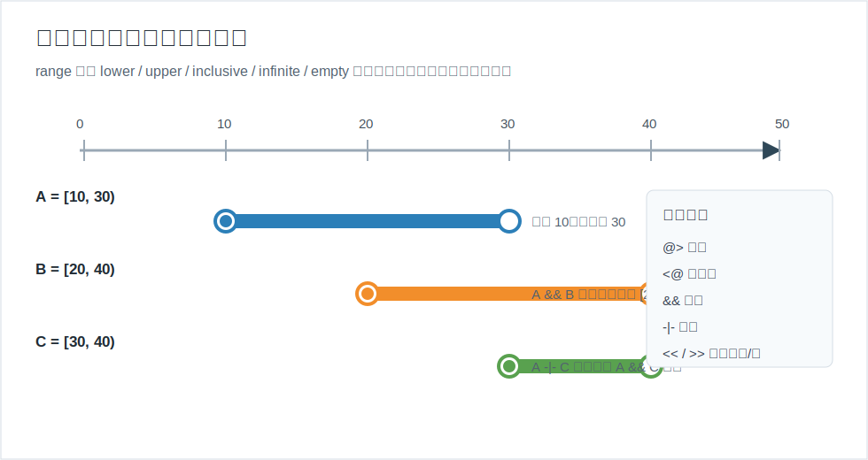
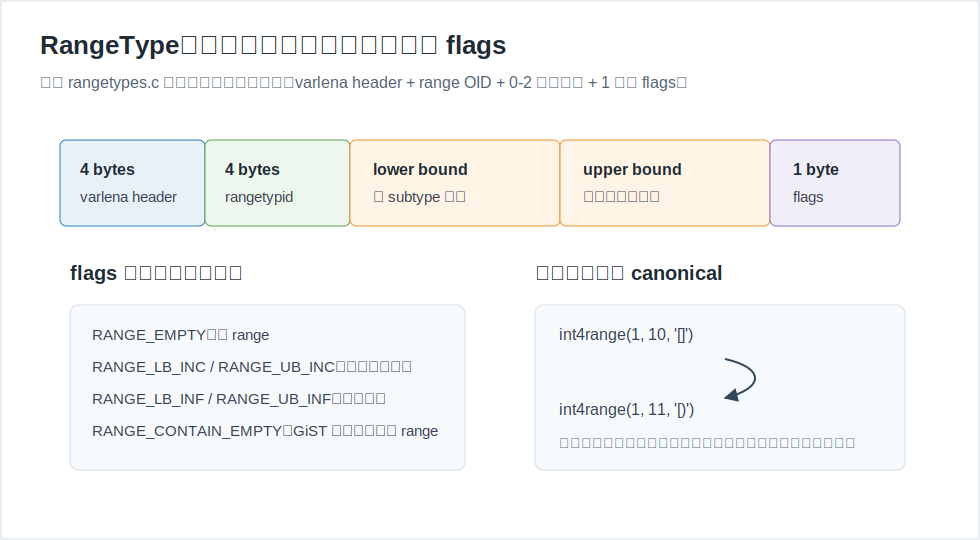
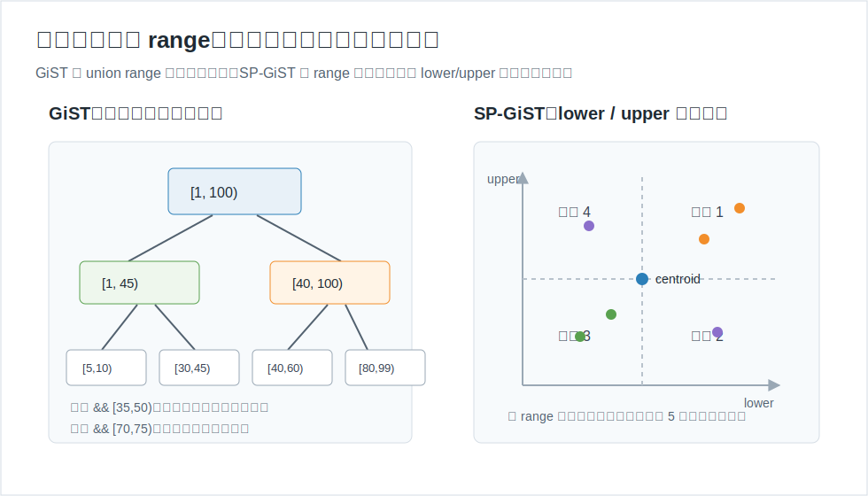
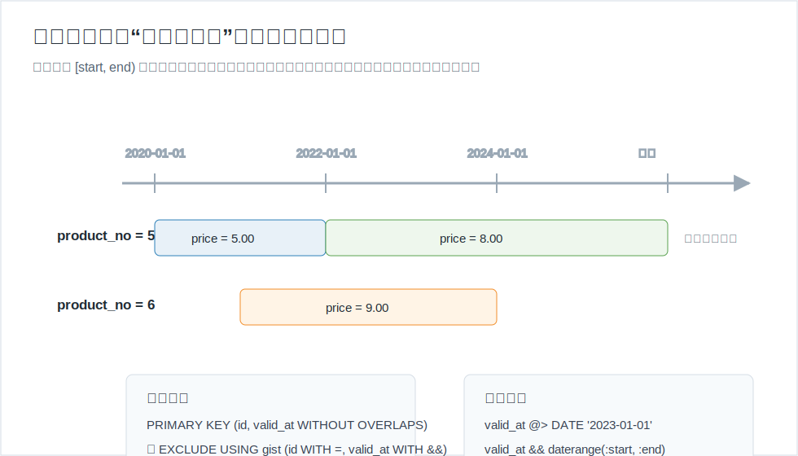
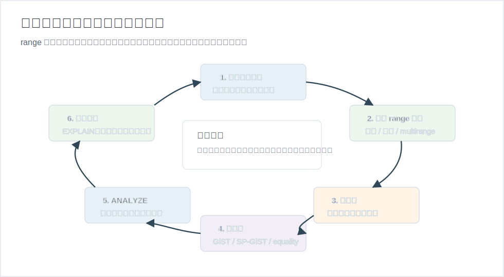

## 数据库筑基课 - 应用实践之 range

### 作者
digoal

### 日期
2026-05-31

### 标签
PostgreSQL , 应用开发者 , 数据库筑基课 , range , multirange , GiST , SP-GiST , 时态建模    

----

## 背景
  


本文属于“应用实践 + 数据类型/操作符 + 索引结构”的交叉主题。当前工作区未发现“数据库筑基课”总纲文件，因此本文按用户给定标题独立成篇。

很多业务都在处理“区间”，但一开始通常不会把它当成独立数据类型：会议室从几点到几点被占用，商品价格从哪天到哪天生效，优惠券适用金额段，设备采样值落在哪个阈值区间，用户权限在某段时间内有效。最常见的表设计是两个字段：

```sql
start_at timestamptz,
end_at   timestamptz
```

这个设计看起来简单，但工程上会很快遇到问题：边界到底包不包含，`end_at` 为 `NULL` 是未知还是无限未来，两个区间是否重叠如何表达，如何防止同一房间同一时间被重复预订，如何索引“某个点落在哪个区间”，如何把多个不连续区间作为一个业务对象保存。

PostgreSQL 的 `range` 和 `multirange` 类型把这些问题放进类型系统：一个 `range` 表示某个有全序关系的 subtype 上的一段点集；一个 `multirange` 表示有序、非连续、非空、非 NULL 的多个 range。它的核心价值不是少写一个字段，而是让“包含、重叠、相邻、左右、交并差、无重叠约束、GiST/SP-GiST 索引、选择率估算”变成数据库可以理解的语义。

核心判断是：

> `range` 把“两个边界字段上的隐式约定”转化为“数据库类型系统里的点集关系”。优势是表达清楚、约束可落库、索引和优化器可利用；代价是边界语义、空区间、离散/连续 subtype、索引方法和统计信息必须被认真设计。

## 一、它解决什么问题？

`range` 解决的是“区间数据的正确建模、查询和约束”问题。

传统 `start/end` 双字段做法有四类常见风险：

| 风险 | 典型表现 | 后果 |
|---|---|---|
| 边界不统一 | 有的代码用闭区间，有的代码用半开区间 | 相邻版本被误判为重叠，或真实重叠漏掉 |
| 无限边界含义混乱 | `end_at IS NULL` 有时表示未知，有时表示无限未来 | 查询条件和约束很难统一 |
| 约束难写 | 防止同一资源时间重叠要写触发器或复杂锁 | 并发下容易出现重复预订、价格版本交叉 |
| 索引语义弱 | `WHERE start_at <= x AND end_at > x` 只能靠普通组合条件 | 优化器不知道这是一个区间关系，复杂关系更难估算 |

`range` 把问题转化为集合关系：

```sql
-- 点是否落在区间内
valid_at @> DATE '2026-05-31'

-- 两个区间是否有交集
reserved_at && tsrange('2026-05-31 10:00', '2026-05-31 11:00')

-- 两个区间是否正好相邻
int4range(1, 10) -|- int4range(10, 20)

-- 区间交集
daterange('2026-01-01', '2026-06-01') * daterange('2026-05-01', '2026-12-01')
```

这带来一个重要工程变化：应用不用把“什么叫重叠”散落在各处，数据库可以用同一套操作符、索引和约束来执行它。

代价也很明确：`range` 不是任意集合类型。单个 range 只能表示连续区间；如果差集或并集会产生两个不连续片段，需要用 `multirange`。并且 subtype 必须有全序关系，否则“在区间之前、之后、内部”没有可定义的含义。

## 二、它是什么？

PostgreSQL 内置 6 组 range/multirange：

| range 类型 | multirange 类型 | subtype | 常见用途 |
|---|---|---|---|
| `int4range` | `int4multirange` | `integer` | 序号、整数额度、离散桶 |
| `int8range` | `int8multirange` | `bigint` | 大整数 ID 段、版本号段 |
| `numrange` | `nummultirange` | `numeric` | 金额、度量值、连续数值 |
| `tsrange` | `tsmultirange` | `timestamp` | 不带时区的时间区间 |
| `tstzrange` | `tstzmultirange` | `timestamptz` | 带时区的时间区间 |
| `daterange` | `datemultirange` | `date` | 日期有效期、账期、价格历史 |

一个非空 range 有下界和上界。`[` / `]` 表示闭边界，`(` / `)` 表示开边界。`empty` 表示空区间。省略某个边界表示无界，不是 subtype 里的普通 NULL。

```sql
SELECT '[3,7)'::int4range;      -- 包含 3，不包含 7
SELECT '(,2026-01-01]'::daterange; -- 无下界，上界闭合
SELECT 'empty'::numrange;       -- 空 range
SELECT '{[1,3), [5,8)}'::int4multirange; -- 两段不连续整数区间
```

内置文档强调一个前提：range 的 subtype 必须有全序关系。因为只有能比较大小，数据库才能判断一个点是在区间内、区间前，还是区间后。`pg_range` 系统目录保存了 range 类型和 subtype、subtype B-tree opclass、canonical 函数、subtype_diff 函数、对应 multirange 类型之间的关系。

## 三、核心原理

### 3.1 逻辑模型：range 是点集，不是两个裸字段

最重要的心智模型是：`range` 表示点集。`[10,30)` 的意思不是“start=10,end=30”这两个字段拼在一起，而是“所有大于等于 10 且小于 30 的点”。操作符也围绕点集关系定义。



图 1 说明：`[10,30)` 和 `[30,40)` 是相邻关系，不是重叠关系。这个半开区间约定特别适合版本有效期、排班、账期等场景，因为相邻版本可以无缝覆盖时间线而不冲突。

常用操作符可以按工程用途分组：

| 操作符 | 含义 | 典型用途 |
|---|---|---|
| `@>` | 左侧包含右侧 range、multirange 或元素 | 某时间点是否在有效期内 |
| `<@` | 左侧被右侧包含 | 某申请区间是否完全落在授权区间内 |
| `&&` | 两个区间有交集 | 冲突检测、候选过滤 |
| `-|-` | 相邻 | 合并连续版本、检查是否可拼接 |
| `<<` / `>>` | 严格在左 / 严格在右 | 时间线排序、剪枝 |
| `&<` / `&>` | 不延伸到右侧 / 不延伸到左侧 | 更宽松的边界过滤 |
| `+` / `*` / `-` | 并、交、差 | 区间计算 |

需要注意：range 的 `+` 和 `-` 仍然返回单个 range。如果并集或差集会产生两个不连续片段，单个 range 无法表达，操作会失败。需要不连续结果时，先使用 multirange。

### 3.2 物理表示：varlena + OID + 边界 + flags

源码 `src/backend/utils/adt/rangetypes.c` 的文件头直接给出了 range 的序列化格式：

- 4 字节 varlena header。
- 4 字节 range type OID。
- 0 到 2 个边界值，按 subtype 的对齐要求存放。
- 最后 1 字节 flags。

头文件 `src/include/utils/rangetypes.h` 定义了 `RangeType` 和 flags，例如 `RANGE_EMPTY`、`RANGE_LB_INC`、`RANGE_UB_INC`、`RANGE_LB_INF`、`RANGE_UB_INF`。`range_in()` 负责解析文本输入，`make_range()` 负责序列化并在需要时调用 canonical 函数，`range_deserialize()` 在执行操作符、索引支持函数和统计分析时把值拆回上下界。



图 2 说明：边界闭合、无界、空区间不是应用层注释，而是 flags 的一部分。离散类型还会经过 canonical 归一化，保证等价区间有同一存储表示。

multirange 也是 varlena。源码 `src/backend/utils/adt/multirangetypes.c` 说明它保存 multirange type OID、range 数量、range item 指针、每段 range 的 flags 和边界值。输入时会忽略空 range，并通过 `multirange_canonicalize()` 合并、排序、去重相邻或重叠片段，最终形成“有序、非连续、非空、非 NULL”的表示。

### 3.3 canonical：离散类型必须统一等价表示

离散 range 和连续 range 的核心差异在于“有没有明确的下一点”。

`int4range`、`int8range`、`daterange` 是离散 range。对整数来说，`[1,10]`、`[1,11)`、`(0,11)` 表示同一组整数点。PostgreSQL 内置 canonical 函数把它们归一化到统一的半开形式 `[)`。源码里 `int4range_canonical()`、`int8range_canonical()`、`daterange_canonical()` 会把开下界向后挪一步，把闭上界向后挪一步并改为开上界。

`numrange`、`tsrange`、`tstzrange` 通常按连续类型处理。虽然 timestamp 有有限精度，但文档明确说通常不应该把它当作离散类型，因为步长并不是业务天然固定的。如果业务要求“按小时为步长”的 timestamp range，应自定义 range 类型并提供 canonical 函数，而不是假设数据库知道你的步长。

这个机制解释了一个常见现象：

```sql
SELECT int4range(1, 10, '[]');
-- 显示时会归一化成 [1,11)

SELECT numrange(1, 10, '[]');
-- 连续 numeric range 不会被改写成 [1,11)
```

工程结论：如果你自定义离散 range 类型，却没有提供 canonical 函数，两个语义等价但边界写法不同的值可能不会相等，索引、唯一性和约束判断都会变得难以预测。

### 3.4 空区间、无界区间和 NULL 不是一回事

`empty` 表示没有任何点。`NULL` 表示这个字段没有值。无界表示某一侧没有边界。三者不能混用。

官方函数文档给出几个重要语义：

- `lower()` / `upper()` 对空 range 或无界一侧返回 NULL。
- `lower_inf()` / `upper_inf()` 判断是否缺少边界。
- 左右关系和相邻关系遇到空 range 或空 multirange 总是 false。
- 其他地方空 range/multirange 像加法单位元：任何值与空值求并仍是自身，从任何值中减空值仍是自身。
- 每个 range 都包含空 range；空 multirange 和空 range 表示相同点集。

因此生产表要明确约束：

```sql
-- 有效期通常不允许为空区间
CHECK (NOT isempty(valid_at))

-- 如果业务要求必须有开始时间
CHECK (NOT lower_inf(valid_at))

-- 如果业务要求结束时间可无限未来，但不能 NULL
valid_at daterange NOT NULL
```

不要用 `NULL` 代替无限未来。`daterange(DATE '2026-01-01', NULL)` 已经能表达无上界，语义比 `end_at IS NULL` 更清楚。

### 3.5 索引：GiST 和 SP-GiST 加速区间关系

PostgreSQL 文档说明：range 列可以创建 GiST 和 SP-GiST 索引；multirange 列可以创建 GiST 索引。它们能加速 `=`, `&&`, `<@`, `@>`, `<<`, `>>`, `-|-`, `&<`, `&>` 这类 range 关系。B-tree 和 hash 也支持 range，但基本只适合等值、排序、哈希聚合、内部执行需要；range 的 B-tree 顺序是先比下界再比上界，文档明确说这种整体排序通常不是业务上有用的排序。



图 3 说明：GiST 内部节点保存覆盖子树的 union range，用它判断某个子树是否还可能命中查询；SP-GiST 把 range 映射成二维点 `(lower, upper)`，用四叉树思想划分空间。两者都不是“把区间按 start 排个序”这么简单。

GiST range opclass 的源码在 `src/backend/utils/adt/rangetypes_gist.c`。几个关键点：

- `range_gist_union()` 形成覆盖多个子项的 union range。
- `range_gist_penalty()` 根据插入新 range 会让原有覆盖范围扩张多少来计算代价；如果提供了 `subtype_diff`，扩张量可以更准确。
- `range_gist_picksplit()` 尽量把不同类别的 range 分开，例如普通有限 range、无界 range、空 range。
- 对普通 range，`range_gist_consistent()` 注释写明支持的操作符是 exact，`recheck=false`。
- 对 multirange，`multirange_gist_compress()` 会把 multirange 近似成无缺口的 union range，`multirange_gist_consistent()` 设置 `recheck=true`，因为这种近似会把缺口也覆盖进去。

SP-GiST range opclass 的源码在 `src/backend/utils/adt/rangetypes_spgist.c`。文件头说明它把 range 映射为二维点：lower bound 是横轴，upper bound 是纵轴；picksplit 用两个轴的中位数形成 centroid；空 range 没有上下界，因此根节点可有第 5 象限专门处理空 range。

工程上怎么选：

| 维度 | GiST range_ops | SP-GiST range_ops | B-tree / hash range_ops |
|---|---|---|---|
| 主要目标 | 通用区间关系索引，支持 range 和 multirange | range 的空间划分索引 | 等值、排序、哈希内部能力 |
| 支持 multirange | GiST 支持，但用 union range 近似，需要 recheck | 文档列出 range_ops，不是 multirange_ops | 支持等值类能力 |
| 查询关系 | `&&`, `@>`, `<@`, `-|-`, 左右关系等 | range 上的同类关系 | 主要是 `=` |
| 写入代价 | 维护树和覆盖范围，subtype_diff 影响质量 | 维护空间划分树 | 普通 B-tree/hash 代价 |
| 适合场景 | 排班、时态约束、重叠查询、multirange | 大量 range 的包含/重叠点查，数据分布适合空间划分 | 去重、聚合、内部排序 |
| 主要风险 | 宽区间、无界区间、空区间混杂会降低剪枝质量 | 数据分布倾斜可能影响树形 | 不适合复杂区间关系 |

### 3.6 统计信息：优化器需要边界和长度分布

range 不是普通标量列。`src/backend/utils/adt/rangetypes_typanalyze.c` 说明 `range_typanalyze()` 会收集：

- NULL 比例。
- empty range 比例。
- 下界直方图。
- 上界直方图。
- range 长度直方图。

multirange 的 typanalyze 使用包含整个 multirange 的最小大 range 来估算，也就是忽略内部缺口。这和 GiST multirange compress 的思想类似：先用外包络做近似，再在执行阶段确认。

选择率估算在 `src/backend/utils/adt/rangetypes_selfuncs.c`。当表达式不是“变量 op 常量”，或常量类型不能识别，或统计信息不足时，会退回默认选择率。例如 overlap 默认 0.01，contains/contained 默认 0.005，element contained 近似使用普通不等式默认选择率。

生产含义：

- 建索引后要 `ANALYZE`。
- 高频更新表依赖 autovacuum/autoanalyze 及时更新统计。
- 宽区间、无界区间和空区间比例很高时，估算更容易偏。
- `EXPLAIN (ANALYZE, BUFFERS)` 比“我建了 GiST”更可信。

### 3.7 约束：range 的杀手级用法是防止重叠

对于 scalar，`UNIQUE` 很自然；对于 range，真正自然的是“同一个业务键下区间不能重叠”。

传统写法是排他约束：

```sql
CREATE EXTENSION IF NOT EXISTS btree_gist;

CREATE TABLE room_reservation (
    room text NOT NULL,
    during tsrange NOT NULL,
    EXCLUDE USING gist (
        room WITH =,
        during WITH &&
    )
);
```

含义是：对任意两行，不能同时满足 `room = room` 且 `during && during`。这样数据库在并发写入时也会维护“不重叠”约束，而不是让应用代码先查再插。

当前本地 PostgreSQL 文档还包含 SQL 标准风格的时态主键/唯一约束说明：

```sql
CREATE TABLE products (
    product_no integer,
    price numeric,
    valid_at daterange,
    PRIMARY KEY (product_no, valid_at WITHOUT OVERLAPS)
);
```

文档说明 `WITHOUT OVERLAPS` 语义等价于在普通键上做等值比较、在 application time range 上做 overlaps 比较，并且会拒绝空 application time。它背后使用 GiST 索引；如果普通键部分需要 GiST 等值能力，实际使用中通常需要 `btree_gist` 扩展。



图 4 说明：用 `[start,end)` 表示有效期，两个相邻版本可以覆盖连续时间线而不重叠。约束要落在数据库里，否则并发写入时“先查无冲突再插入”的应用逻辑并不可靠。

## 四、横向对比

| 维度 | PostgreSQL range | `start/end` 双字段 | JSON/数组保存区间 | 外部规则引擎/搜索系统 |
|---|---|---|---|---|
| 主要目标 | 类型化表达区间关系 | 简单保存两个边界 | 灵活保存复杂结构 | 跨系统规则匹配 |
| 查询表达 | `@>`, `&&`, `<@`, `-|-` 等直接表达 | 需要手写不等式组合 | 需要展开或函数解析 | 取决于外部系统 |
| 约束能力 | GiST 排他约束、`WITHOUT OVERLAPS` | 常靠触发器或应用锁 | 难以约束 | 需要跨系统一致性 |
| 索引能力 | GiST/SP-GiST 支持区间关系 | B-tree 组合索引可处理部分点查 | 通常弱 | 专用能力强，但链路长 |
| 空/无界语义 | 类型内建 | 常用 NULL 约定，容易混乱 | 应用自定义 | 应用自定义 |
| 适合场景 | 时态、排班、价格、额度、阈值、版本有效期 | 极简单场景，只有少量固定查询 | 高度非结构化区间集合 | 复杂规则网络、跨数据源 |
| 不适合场景 | subtype 无全序、需要任意集合逻辑 | 需要强约束和复杂区间查询 | 需要数据库级约束和索引 | 强事务一致性且不愿双写 |

这张表的关键不是“range 一定替代双字段”。如果业务只是展示开始和结束时间，几乎不做重叠、包含、相邻判断，双字段足够。但一旦区间关系进入核心业务规则，range 的类型语义、索引和约束会显著降低出错概率。

## 五、效果如何？

range 的效果要从正确性、查询、写入维护和建模复杂度四个角度看。

第一，正确性。`range` 最大收益是把边界语义固定下来。半开区间 `[)`、`empty`、无界、canonical、`&&` 和 `-|-` 都由数据库统一解释，减少应用代码重复实现区间逻辑的机会。

第二，查询性能。GiST/SP-GiST 可以把明显不可能命中的子树剪掉，对重叠、包含、点落入区间这类查询很有价值。但如果大量区间都非常宽、无界，或者查询本身选择率很高，索引剪枝能力会下降。multirange GiST 因为用 union range 近似内部缺口，可能产生更多 recheck。

第三，写入和维护。range 索引、排他约束、时态约束都会增加写入成本。排他约束尤其要考虑并发冲突、事务等待和错误处理。高写入表要关注 autovacuum、索引膨胀、`ANALYZE` 频率和冲突重试策略。

第四，建模复杂度。range 能简化区间关系，但不能替你决定业务语义。比如“结束日期当天是否有效”“价格版本是否允许空档”“NULL 是未知还是无限”“多个不连续授权期是否应该合并成 multirange”，这些必须在建模阶段写清楚。



图 5 说明：range 的落地顺序应是先定义业务点集和边界，再选择 range/multirange 类型，然后加约束、建索引、收集统计信息，最后用真实边界样本和执行计划验证。

## 六、实操 DEMO

以下 SQL 是最小可验证脚本。本文未在本机启动 PostgreSQL 实例执行这些 SQL，因此不提供伪造执行结果；语法依据本地 PostgreSQL 文档、回归测试和源码接口。

### 6.1 用 range 表达会议室预订

```sql
CREATE EXTENSION IF NOT EXISTS btree_gist;

DROP TABLE IF EXISTS room_reservation;

CREATE TABLE room_reservation (
    room text NOT NULL,
    during tsrange NOT NULL,
    CHECK (NOT isempty(during)),
    EXCLUDE USING gist (
        room WITH =,
        during WITH &&
    )
);

INSERT INTO room_reservation (room, during) VALUES
    ('A101', tsrange('2026-06-01 09:00', '2026-06-01 10:00')),
    ('A101', tsrange('2026-06-01 10:00', '2026-06-01 11:00')),
    ('A102', tsrange('2026-06-01 09:30', '2026-06-01 10:30'));

-- 这个插入应失败，因为 A101 的 09:30-10:30 与既有 09:00-10:00 重叠
INSERT INTO room_reservation (room, during) VALUES
    ('A101', tsrange('2026-06-01 09:30', '2026-06-01 10:30'));

-- 查询某个时间点可见的预订
SELECT room, during
FROM room_reservation
WHERE during @> TIMESTAMP '2026-06-01 09:45';

-- 查询与目标区间冲突的预订
EXPLAIN (ANALYZE, BUFFERS)
SELECT room, during
FROM room_reservation
WHERE room = 'A101'
  AND during && tsrange('2026-06-01 09:30', '2026-06-01 10:30');
```

### 6.2 用 daterange 表达价格有效期

```sql
DROP TABLE IF EXISTS product_price;

CREATE TABLE product_price (
    product_no integer NOT NULL,
    price numeric NOT NULL,
    valid_at daterange NOT NULL,
    CHECK (NOT isempty(valid_at)),
    EXCLUDE USING gist (
        product_no WITH =,
        valid_at WITH &&
    )
);

INSERT INTO product_price VALUES
    (5, 5.00, daterange(DATE '2020-01-01', DATE '2022-01-01')),
    (5, 8.00, daterange(DATE '2022-01-01', NULL)),
    (6, 9.00, daterange(DATE '2021-01-01', DATE '2024-01-01'));

SELECT product_no, price
FROM product_price
WHERE product_no = 5
  AND valid_at @> DATE '2023-01-01';
```

如果使用当前源码文档中的时态约束语法，可以把排他约束改写成：

```sql
CREATE TABLE product_price_temporal (
    product_no integer,
    price numeric,
    valid_at daterange,
    PRIMARY KEY (product_no, valid_at WITHOUT OVERLAPS)
);
```

实际生产前要确认目标 PostgreSQL 版本是否支持该语法；传统 `EXCLUDE USING gist` 是更通用的写法。

### 6.3 range、multirange 的并交差边界

```sql
-- 单个 range 的并集要求结果仍是一个连续 range
SELECT numrange(1.0, 2.0) + numrange(2.0, 3.0);
SELECT numrange(1.0, 2.0) + numrange(2.5, 3.0); -- 应失败

-- multirange 可以表达不连续结果
SELECT nummultirange(numrange(1.0, 2.0))
     + nummultirange(numrange(2.5, 3.0));

-- 差集可能产生两个片段，使用 multirange 更稳妥
SELECT int4multirange(int4range(1, 10))
     - int4multirange(int4range(4, 7));
```

### 6.4 观察 canonical 和边界函数

```sql
SELECT int4range(1, 10, '[]') AS canonical_int_range;
SELECT daterange(DATE '2026-01-01', DATE '2026-01-31', '[]') AS canonical_date_range;
SELECT numrange(1, 10, '[]') AS continuous_numeric_range;

SELECT
    lower(int4range(1, 10)) AS lb,
    upper(int4range(1, 10)) AS ub,
    lower_inc(int4range(1, 10)) AS lb_inc,
    upper_inc(int4range(1, 10)) AS ub_inc,
    isempty(int4range(1, 1)) AS is_empty;
```

## 七、最佳实践

面向数据库架构师：

- 先决定业务点集和边界约定。时间有效期、账期、价格版本优先考虑 `[start,end)`。
- 能用内置 range 就不要自定义。自定义 range 前必须确认 subtype 全序、opclass、canonical 和 subtype_diff。
- 不连续集合用 multirange，不要把多个区间塞进 JSON 再自己解析。
- 对“同一业务键下不能重叠”的规则，优先用排他约束或 `WITHOUT OVERLAPS`，不要只靠应用先查后插。
- 明确 `NULL`、`empty`、无界的语义，分别写成 `NOT NULL`、`CHECK (NOT isempty(...))`、`lower_inf/upper_inf` 约束。

面向 DBA：

- range 关系查询优先评估 GiST/SP-GiST。multirange 目前按文档使用 GiST。
- 建索引后执行 `ANALYZE`，高变化表要关注自动分析是否及时。
- 用 `EXPLAIN (ANALYZE, BUFFERS)` 分辨是索引剪枝差、回表多、锁等待，还是约束冲突重试。
- 排他约束可能带来并发等待和冲突错误，应用必须有重试或冲突提示策略。
- 宽区间、无界区间、空区间比例高时，单纯加索引未必有效，要结合数据分布拆分或额外约束。

面向业务开发者：

- 使用构造函数 `tsrange(start_at, end_at)`、`daterange(start_date, end_date)`，比拼接文本 literal 更安全。
- 不要把 `end_at = NULL` 当成约定俗成的无限未来；range 构造函数用 NULL 边界即可表达无界。
- 用户输入区间时，要在应用层就明确是否允许空区间、是否允许开区间、是否允许无界。
- 遇到“可用时间段扣掉已占用时间段”这类问题，直接考虑 multirange。
- 写单元测试覆盖相邻、重叠、完全包含、空区间、无界、同一边界点这些样本。

## 八、适合与不适合场景

适合：

- 会议室、车辆、设备、医生号源、库存锁定等排班/预订系统。
- 商品价格、合同条款、权限、配置、规则的有效期版本管理。
- 时态表、应用时间、慢变维、历史状态查询。
- 额度、分段费率、测量值阈值、序号段、ID 段。
- 查询和约束都围绕“点是否落入区间”“区间是否重叠”“区间是否相邻”的业务。

不适合：

- subtype 没有稳定全序关系，例如复杂对象、图结构、非可比 JSON。
- 需要表示任意复杂集合且频繁做集合代数，单个 range 不够，multirange 也可能不够。
- 查询只展示开始和结束，不做区间关系、不做约束，双字段更简单。
- 分布式大规模规则匹配，且规则跨多个外部系统，数据库内 range 只是局部能力。
- 业务无法接受排他约束导致的并发冲突错误，却又没有重试或排队策略。

## 九、常见坑

1. 把 `NULL`、`empty`、无界混为一谈。它们的含义不同，约束和查询结果也不同。
2. 忘记半开区间约定。`[start,end)` 是时态建模的常见安全默认值，闭区间很容易让相邻版本重叠。
3. 对连续类型期待离散 canonical。`numrange(1,10,'[]')` 不会等价改写成 `[1,11)`。
4. 自定义离散 range 不写 canonical。等价区间可能不相等，索引和约束语义会变差。
5. 用 B-tree 索引期待加速 `&&`。复杂区间关系应评估 GiST/SP-GiST。
6. multirange GiST 忽略 recheck 代价。内部缺口会被 union range 覆盖，候选可能变多。
7. 只在应用层查冲突。并发下两个事务都可能看到“无冲突”，最终插入重叠记录。
8. 建索引后不 `ANALYZE`。优化器缺少边界和长度分布，可能误估。
9. 允许过多无界大区间。大区间覆盖太广，索引剪枝能力会明显下降。
10. 不测试边界样本。相邻、同点、空、无界、完全覆盖是 range 逻辑最容易出错的地方。

## 十、扩展问题

1. 如果把 `start_at/end_at` 双字段迁移到 `tsrange`，现有 NULL 语义如何映射到无界或未知？
2. 同一实体是否允许有效期有空档？如果不允许，除了“无重叠”还需要什么约束或校验？
3. 对价格区间、时间区间、整数区间，哪些应该用 range，哪些应该用 multirange？
4. 宽区间很多时，是否需要按业务键、时间分区或冷热拆分来改善索引剪枝？
5. 自定义 range 的 subtype_diff 是否真的反映排序距离？如果不反映，GiST split/penalty 会受什么影响？
6. 当 PostgreSQL range 与外部搜索/规则系统共存时，谁负责最终一致性和冲突检测？

## 十一、扩展阅读

- PostgreSQL 本地文档：`../postgres/doc/src/sgml/rangetypes.sgml`，range/multirange 类型、输入、canonical、自定义类型、索引、排他约束。
- PostgreSQL 本地文档：`../postgres/doc/src/sgml/func/func-range.sgml`，range/multirange 操作符和函数。
- PostgreSQL 本地文档：`../postgres/doc/src/sgml/gist.sgml`，GiST 内置 range_ops / multirange_ops 和 GiST 方法。
- PostgreSQL 本地文档：`../postgres/doc/src/sgml/spgist.sgml`，SP-GiST 内置 range_ops。
- PostgreSQL 本地文档：`../postgres/doc/src/sgml/ddl.sgml`，application time、`WITHOUT OVERLAPS`、时态主键/唯一约束。
- PostgreSQL 源码：`../postgres/src/include/utils/rangetypes.h`，`RangeType`、flags、策略号和内部函数声明。
- PostgreSQL 源码：`../postgres/src/backend/utils/adt/rangetypes.c`，range 输入输出、操作符、canonical、序列化/反序列化。
- PostgreSQL 源码：`../postgres/src/backend/utils/adt/multirangetypes.c`，multirange 输入输出、canonical、序列化格式。
- PostgreSQL 源码：`../postgres/src/backend/utils/adt/rangetypes_gist.c`，range/multirange GiST 支持。
- PostgreSQL 源码：`../postgres/src/backend/utils/adt/rangetypes_spgist.c`，range SP-GiST 四叉划分实现。
- PostgreSQL 源码：`../postgres/src/backend/utils/adt/rangetypes_typanalyze.c`，range/multirange 统计信息采集。
- PostgreSQL 源码：`../postgres/src/backend/utils/adt/rangetypes_selfuncs.c`，range 操作符选择率估算。
- PostgreSQL 源码：`../postgres/src/include/catalog/pg_range.dat` 和 `../postgres/src/include/catalog/pg_range.h`，内置 range catalog 定义。
- PostgreSQL 回归测试：`../postgres/src/test/regress/sql/rangetypes.sql` 和 `../postgres/src/test/regress/sql/multirangetypes.sql`，输入、操作符、canonical、索引和统计行为样本。
- DeepWiki：`postgres/postgres` 关于 range/multirange catalog、表示、操作符、统计和 GiST/SP-GiST 支持的架构总结。
  
## 附录 

1、克隆代码  
```  
git clone --depth 1 https://github.com/postgres/postgres
```  
  
2、启用 codex, 使用 [数据库筑基课 skill](../skills/README.md).  
```
文章标题: 
  数据库筑基课 - 应用实践之 range
项目源码(本地目录): 
  postgres
项目 codebase 文件名: 
  postgres/CLAUDE.md 
开源项目相关的 deepwiki repoName: 
  postgres/postgres
```
  
  
#### [PostgreSQL 解决方案集合](../201706/20170601_02.md "40cff096e9ed7122c512b35d8561d9c8")
  
  
#### [德哥 / digoal's Github - 公益是一辈子的事.](https://github.com/digoal/blog/blob/master/README.md "22709685feb7cab07d30f30387f0a9ae")
  
  
#### [About 德哥](https://github.com/digoal/blog/blob/master/me/readme.md "a37735981e7704886ffd590565582dd0")
  
  

  
