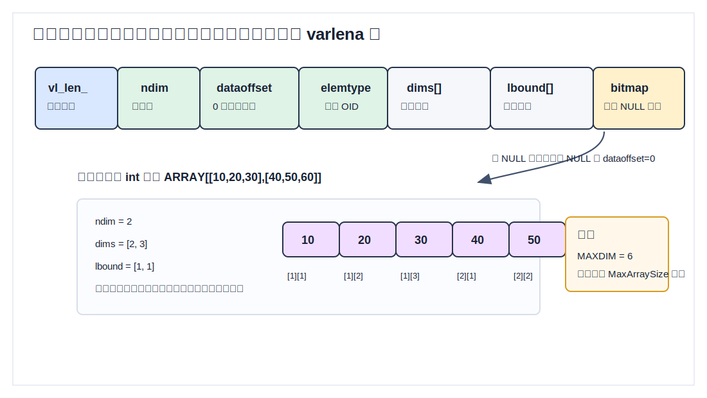
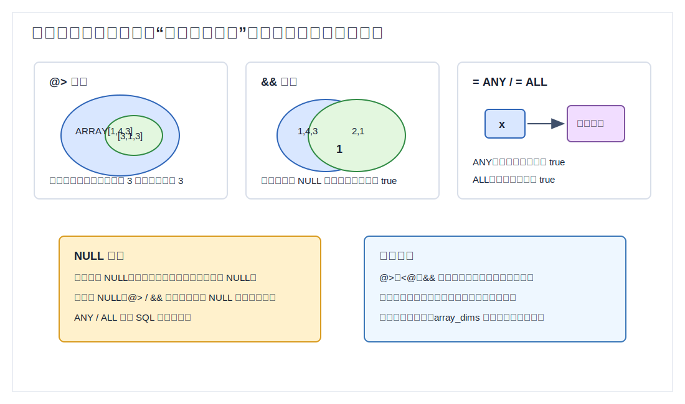
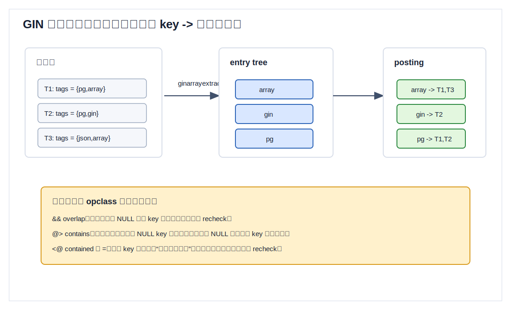
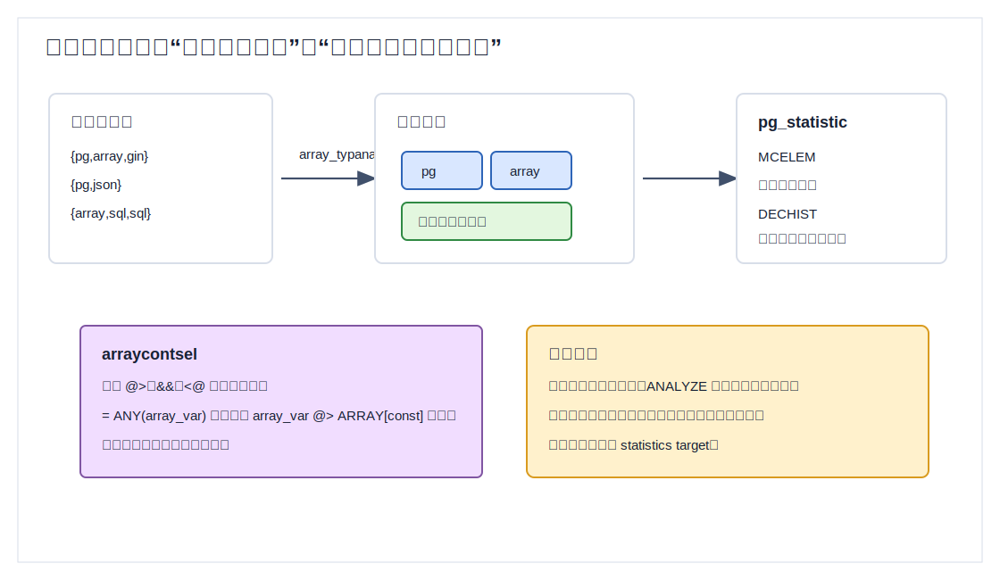
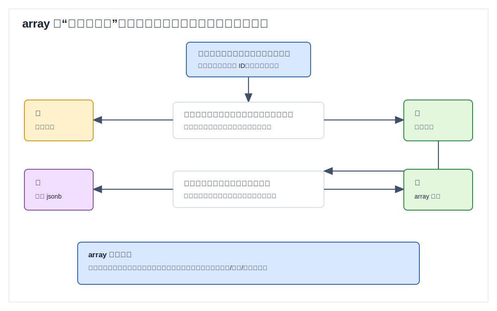
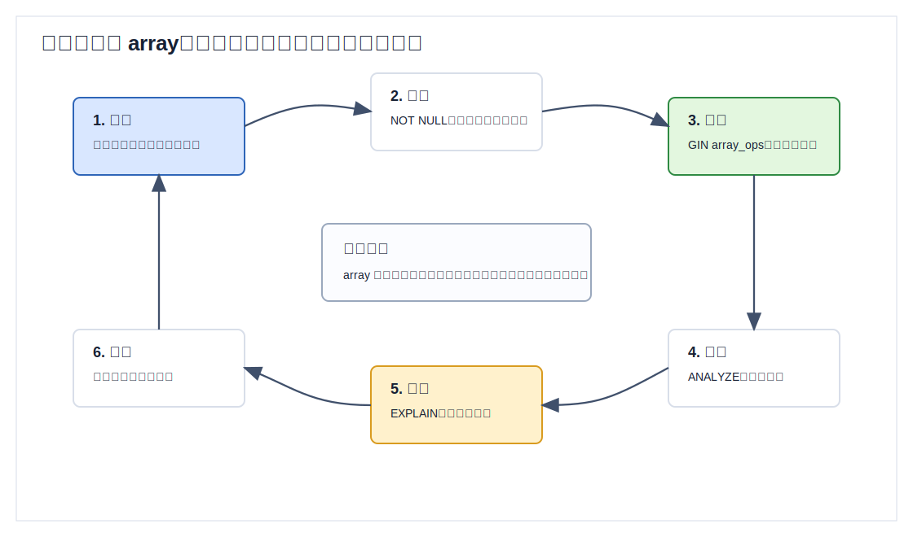

## 数据库筑基课 - 应用实践之 array

### 作者
digoal

### 日期
2026-05-31

### 标签
PostgreSQL , 应用开发者 , 数据库筑基课 , array , GIN , 数据建模 , 选择率估算    

----

## 背景
  


本文属于“应用实践 + 数据类型/操作符”的主题。当前工作区未发现“数据库筑基课”总纲文件，因此本文按用户给定标题独立成篇。

应用开发里经常出现“一行记录天然带一组值”的需求：用户有多个标签，商品有多个适用渠道，文章有多个关键词，规则命中多个枚举项，设备一次上报多个指标，某个配置项是一组同类型参数。最常见的做法有三种：

1. 把值用逗号拼成字符串。
2. 拆成一张子表。
3. 存成 JSON。

这三种都能跑，但问题不同。逗号字符串让数据库失去类型、比较和索引语义；子表最规范，但对小集合字段可能过重；JSON 灵活，但如果值本质是“同类型数组”，会引入不必要的结构自由度。

PostgreSQL 的 `array` 类型把“行内同类型小集合”放进类型系统：每个元素有确定类型，数组有维度和下界，支持下标、切片、拼接、`unnest`、`ANY`/`ALL`、包含 `@>`、被包含 `<@`、重叠 `&&`，并且可以用 GIN 建倒排索引。

核心判断是：

> `array` 适合保存一行内部的小规模、同类型、多值属性。优势是表达紧凑、类型明确、成员查询可索引；代价是数组整体仍是一个列值，局部更新、外键、审计、复杂关系约束和高基数明细建模不如子表自然。

## 一、它解决什么问题？

`array` 解决的是“同一行上多值属性的表达和查询”问题。

比如文章标签：

```sql
CREATE TABLE article (
    id      bigserial PRIMARY KEY,
    title   text NOT NULL,
    tags    text[] NOT NULL DEFAULT '{}'
);
```

有了数组，业务查询可以直接写成集合关系：

```sql
-- 包含指定标签
SELECT * FROM article WHERE tags @> ARRAY['postgres'];

-- 任意标签相交
SELECT * FROM article WHERE tags && ARRAY['database', 'optimizer'];

-- 某个标量是否等于任意元素
SELECT * FROM article WHERE 'postgres' = ANY(tags);

-- 展开数组做统计
SELECT tag, count(*)
FROM article CROSS JOIN LATERAL unnest(tags) AS tag
GROUP BY tag
ORDER BY count(*) DESC;
```

这比逗号字符串更可靠：

| 做法 | 查询表达 | 类型安全 | 索引语义 | 主要风险 |
|---|---|---|---|---|
| 逗号字符串 | `LIKE`、正则、分割函数 | 弱 | 弱，容易误匹配 | 分隔符转义、大小写、空格、误匹配 |
| `array` | `@>`、`&&`、`ANY`、下标、切片 | 强 | GIN 支持成员关系 | 不适合复杂多对多生命周期 |
| 子表 | JOIN、EXISTS、外键 | 强 | B-tree、唯一约束、外键 | 表和 JOIN 增加，写法较重 |
| `jsonb` | `@>`、路径、键值查询 | 中等 | GIN 支持结构查询 | schema 漂移，元素类型不够刚性 |

`array` 的价值不是“少建一张表”，而是给小集合字段一个清晰边界：这个集合是否属于当前行的原子属性？如果是，数组很自然；如果集合里的每个元素都有自己的创建时间、来源、权限、状态、外键和审计，那它已经不是简单属性，应拆表。

## 二、它是什么？

PostgreSQL 允许表列定义为变长多维数组。数组元素可以是内置类型、用户定义基础类型、枚举、复合类型、range 或 domain。数组类型通常写成 `元素类型[]`，也可以使用 SQL 标准风格的 `元素类型 ARRAY`。

官方文档有两个容易被忽略的点：

1. 声明里的数组长度不会被当前实现强制执行。
2. 声明里的维度数量也不会被当前实现强制执行。

例如：

```sql
CREATE TABLE demo_array_decl (
    a integer[3],
    b text[][]
);
```

`integer[3]` 更像文档说明，不是运行时约束。真正需要长度或维度约束时，要显式写 `CHECK`：

```sql
CREATE TABLE rule_profile (
    id          bigserial PRIMARY KEY,
    allow_codes text[] NOT NULL DEFAULT '{}',
    CHECK (array_ndims(allow_codes) IS NULL OR array_ndims(allow_codes) = 1),
    CHECK (cardinality(allow_codes) <= 32)
);
```

几个基础概念要分清：

| 概念 | 说明 | 示例 |
|---|---|---|
| 空数组 | 一个非 NULL 的数组值，元素数为 0 | `'{}'::int[]` |
| NULL 数组 | 列值本身未知或不存在 | `NULL::int[]` |
| NULL 元素 | 数组存在，但其中某个元素是 NULL | `ARRAY[1,NULL,3]` |
| 下界 | 每个维度的起始下标，默认是 1，但可以不是 1 | `'[0:2]={10,20,30}'::int[]` |
| 维度 | 数组的轴数，PostgreSQL 内部限制 `MAXDIM` 为 6 | 二维矩阵、三维块 |

这几个概念直接影响查询结果。`array_length('{}'::int[], 1)` 返回 `NULL`，而 `cardinality('{}'::int[])` 返回 `0`。数组下标越界时返回 `NULL`，不是报错。切片完全越界时返回空的零维数组，这是历史行为，和单个下标访问不同。

## 三、核心原理

### 3.1 物理表示：varlena + 维度 + 下界 + 可选 NULL 位图

源码 `src/include/utils/array.h` 给出了普通数组的内部结构。标准 varlena array 包含：

- `vl_len_`：总字节数。
- `ndim`：维度数。
- `dataoffset`：有 NULL 位图时指向数据起点；无 NULL 位图时为 0。
- `elemtype`：元素类型 OID。
- `dimensions[]`：每个维度的长度。
- `lower bnds[]`：每个维度的下界。
- 可选 NULL bitmap。
- 实际元素数据。

元素按 row-major order 存放，也就是最后一个下标变化最快。这个点和文档中数组比较、`unnest` 的存储顺序是一致的。



图 1 说明：数组不是“文本里的一串值”。它记录了元素类型、维度、每维下界和可选 NULL 位图。因为元素类型固定，PostgreSQL 可以调用元素类型自己的输入输出、比较、哈希、排序和等值函数。

这也解释了几个工程现象：

- 宽数组会作为一个 varlena 值被 TOAST，整个数组可被压缩或外部存储。
- 可 TOAST 的元素不能各自独立 out-of-line TOAST；源码注释明确说 tuple toaster 不知道数组内部元素在哪里，所以数组整体才是 TOAST 单元。
- 对数组中一个元素做更新，本质仍会生成新的行版本。MVCC 下不是原地改一个小格子。
- 数组可以有非 1 下界，但绝大多数应用应避免依赖它，除非业务下标确实有意义。

### 3.2 输入、维度和下标：文档声明不是约束

数组字面量用花括号：

```sql
SELECT '{1,2,3}'::int[];
SELECT '{{1,2,3},{4,5,6}}'::int[];
SELECT '[0:2]={10,20,30}'::int[];
```

也可以用 `ARRAY` 构造器：

```sql
SELECT ARRAY[1,2,3];
SELECT ARRAY[['meeting','lunch'], ['training','presentation']];
```

多维数组要求每个子数组在对应维度上长度匹配。`{{1,2},{3}}` 这类不规则数组不是 PostgreSQL 原生 array 的模型；如果业务确实需要 ragged array，通常应该考虑 `jsonb` 或子表。

访问单个元素：

```sql
SELECT (ARRAY[10,20,30])[2];  -- 20
```

访问切片：

```sql
SELECT (ARRAY[[10,20,30],[40,50,60]])[1:2][2:3];
```

需要注意切片规则：只要某一维写了冒号，所有维都会按切片处理。为了避免误读，多维切片最好每一维都写成 `lower:upper`。

### 3.3 操作符：成员关系不是多重集合关系

数组最常用的关系操作符是：

| 操作符 | 含义 | 示例 |
|---|---|---|
| `@>` | 左数组包含右数组所有元素 | `ARRAY[1,4,3] @> ARRAY[3,1,3]` |
| `<@` | 左数组被右数组包含 | `ARRAY[2,2,7] <@ ARRAY[1,7,4,2,6]` |
| `&&` | 两个数组有共同元素 | `ARRAY[1,4,3] && ARRAY[2,1]` |
| `||` | 拼接数组或追加元素 | `ARRAY[1,2] || ARRAY[3,4]` |

官方文档明确说明，`@>` 对重复元素不做特殊处理：`ARRAY[1]` 和 `ARRAY[1,1]` 彼此都被认为包含对方。这意味着 `array` 的包含语义更接近“元素是否出现过”，不是“多重集合计数是否足够”。

源码 `src/backend/utils/adt/arrayfuncs.c` 中 `arrayoverlap()`、`arraycontains()`、`arraycontained()` 都调用 `array_contain_compare()`。文件注释说明这类比较只考虑数组元素，忽略维度信息；函数里会用元素类型的等值操作符逐元素比较。NULL 元素不会被当作普通值匹配。



图 2 说明：`@>`、`<@`、`&&` 适合做集合成员判断。它们不适合表达“第 3 个位置必须是什么”或“重复 2 次才算包含”。位置约束应使用下标、切片或更明确的数据模型。

`ANY` 和 `ALL` 是另一类常用语义：

```sql
-- 至少一个元素相等
SELECT * FROM article WHERE 'postgres' = ANY(tags);

-- 标量大于所有数组元素
SELECT 10 > ALL(ARRAY[1,2,3]);
```

`ANY`/`ALL` 遵守 SQL 三值逻辑：

- `ANY`：任一比较为 true 就是 true；没有 true 且存在 NULL 比较结果时，结果可能是 NULL。
- `ALL`：所有比较为 true 才是 true；存在 false 就是 false；没有 false 且存在 NULL 比较结果时，结果可能是 NULL。
- 空数组上，`ANY` 返回 false，`ALL` 返回 true。

生产代码里应尽量避免让数组元素为 NULL。对标签、枚举、角色这类字段，建议加约束或用写入规范保证元素非 NULL。NULL 数组、空数组、NULL 元素混在一起，会让应用判断和索引行为都更难解释。

### 3.4 GIN 索引：数组元素倒排

GIN 的核心思想是倒排索引。`src/backend/access/gin/README` 说明：GIN entry tree 里存 key，每个 key 指向包含该 key 的 heap 行指针集合。对数组来说，key 就是数组元素。

内置 `gin/array_ops` 在系统目录 `src/include/catalog/pg_amop.dat` 中登记了四个可索引操作符：

| 操作符 | GIN strategy | 含义 |
|---|---:|---|
| `&&` | 1 | overlap |
| `@>` | 2 | contains |
| `<@` | 3 | is contained by |
| `=` | 4 | equal |

支持函数在 `src/backend/access/gin/ginarrayproc.c`：

- `ginarrayextract()`：把待索引数组拆成元素 key。
- `ginqueryarrayextract()`：把查询数组拆成 key，并根据 strategy 选择 search mode。
- `ginarrayconsistent()` / `ginarraytriconsistent()`：根据 key 命中情况判断候选行是否可能满足查询。



图 3 说明：`tags @> ARRAY['pg','array']` 会变成两个 key 的倒排集合组合。`tags && ARRAY['pg','array']` 只要任意一个 key 命中即可。`tags <@ ARRAY[...]` 和 `tags = ARRAY[...]` 更难仅凭 key 完全证明，需要回表 recheck。

`ginarrayproc.c` 里还有几个非常实用的细节：

- 对 `&&`，只要至少一个非 NULL 查询元素命中即可，普通 consistent 路径可 `recheck=false`。
- 对 `@>`，所有查询元素都要命中，并且查询元素里有 NULL 时不能证明包含，结果为 false。
- 对 `<@`，源码直接注释“can't do anything else useful here”，需要 recheck。
- 对 `=`，也需要 recheck，因为数组相等还涉及维度、顺序、NULL 处理等完整语义。

因此，数组 GIN 的舒适区是：

```sql
CREATE INDEX article_tags_gin_idx ON article USING gin (tags);

SELECT * FROM article WHERE tags @> ARRAY['postgres'];
SELECT * FROM article WHERE tags && ARRAY['database','optimizer'];
```

不要期待 GIN 能高效解决所有数组问题。比如“找第 2 个标签是 postgres”的谓词不是 `array_ops` 的成员关系语义：

```sql
-- 这是位置查询，不是成员查询
SELECT * FROM article WHERE tags[2] = 'postgres';
```

如果这类查询重要，应考虑表达式索引或改模型：

```sql
CREATE INDEX article_second_tag_idx ON article ((tags[2]));
```

### 3.5 统计信息：优化器看的是常见元素和每行不同元素数

数组列的选择率估算不是普通标量估算。源码 `src/backend/utils/adt/array_typanalyze.c` 说明，数组 typanalyze 除了调用标准分析逻辑，还会为 `@>`、`&&`、`<@` 收集两类信息：

- Most common elements：常见数组元素及其出现频率。
- Distinct element count histogram：每个数组里不同元素个数的直方图。

它使用 Lossy Counting 算法估算高频元素。源码注释特别说明：同一个数组内的重复元素不会改变 `<@`、`&&`、`@>` 的行为，因此统计时每个元素在一行里只计一次。

选择率函数在 `src/backend/utils/adt/array_selfuncs.c`：

- `arraycontsel()` 估算 `@>`、`&&`、`<@` 的 restriction selectivity。
- `arraycontjoinsel()` 处理 join selectivity，目前实现返回默认估算。
- `scalararraysel_containment()` 可以把 `const = ANY(array_var)` 估算成类似 `array_var @> ARRAY[const]` 的数组包含问题。



图 4 说明：如果不 `ANALYZE`，或者数组元素分布高度偏斜但统计目标太低，优化器可能低估或高估过滤比例，进而选错顺序扫描、Bitmap Index Scan 或 JOIN 顺序。

生产建议：

```sql
ANALYZE article;

-- 当标签分布很偏、常见元素很多时，可提高列级统计目标
ALTER TABLE article ALTER COLUMN tags SET STATISTICS 1000;
ANALYZE article;
```

源码还设置了数组分析宽度阈值，避免超宽数组在 ANALYZE 阶段消耗太多内存、IO、CPU，或让 `pg_statistic` 行过大。这意味着“每行塞超大数组”不仅写入和 TOAST 成本高，也会让优化器统计质量下降。

### 3.6 MVCC 与更新：数组是列值，不是内嵌子表

数组在 SQL 层可以做下标更新：

```sql
UPDATE article
SET tags[2] = 'postgresql'
WHERE id = 1;
```

但从 MVCC 和存储角度看，这仍然是更新整行的一个列值。PostgreSQL 会生成新行版本，旧版本等待 vacuum 清理；如果数组较宽，可能牵涉 TOAST 值变化。频繁追加、删除数组元素，会带来行膨胀、WAL 增加、索引维护和 vacuum 压力。

这不是说不能更新数组，而是要把它当成“字段整体更新”，不要把它当成轻量级内嵌明细表。

## 四、横向对比

| 维度 | `array` | 子表 | `jsonb` | `range` / `multirange` |
|---|---|---|---|---|
| 主要目标 | 行内同类型多值属性 | 一对多、多对多关系实体 | 半结构化对象和数组 | 连续区间或不连续区间集合 |
| 类型约束 | 元素类型强 | 列类型强，可外键 | 弱于 SQL 列类型 | subtype 强，区间语义强 |
| 成员查询 | `@>`、`&&`、`ANY` | `EXISTS`、JOIN | JSON 路径、包含 | `@>`、`&&`、左右关系 |
| 索引 | GIN array_ops、表达式索引 | B-tree、hash、GIN、GiST 等 | GIN jsonb_ops/jsonb_path_ops | GiST、SP-GiST、B-tree/hash |
| 局部更新 | 本质更新列值 | 更新单独子表行 | 本质更新 JSON 值 | 本质更新列值 |
| 外键/唯一/审计 | 对元素不自然 | 最自然 | 不自然 | 对区间整体自然 |
| 适合场景 | 标签、枚举集合、小 ID 列表、固定维度参数 | 订单明细、成员关系、授权流水 | 动态属性、外部 payload | 时间有效期、价格区间、排班冲突 |
| 不适合场景 | 元素有生命周期、频繁局部写、超大集合 | 小集合读写过于繁琐 | 需要强类型和稳定 schema | 离散标签集合 |

原因很简单：`array` 是“列值”，子表是“关系”，`jsonb` 是“结构文档”，`range` 是“点集区间”。如果业务问题本质是集合成员判断，array 很好；如果本质是关系实体，array 会让约束和演化变难。



图 5 说明：选择 array 前先问两个问题：元素是否同类型且数量受控？元素是否需要独立生命周期和关系约束？前者为是、后者为否，array 才进入舒适区。

## 五、效果如何？

`array` 的收益主要体现在三方面：

1. 表达收益：把多值属性从字符串协议变成数据库类型。
2. 查询收益：成员关系可以用 `@>`、`&&`、`ANY` 清晰表达。
3. 索引收益：GIN 把元素倒排，避免每次扫描全表再拆数组。

代价也要算清楚：

| 代价 | 表现 | 规避方式 |
|---|---|---|
| 写放大 | 更新一个元素也生成新行版本 | 控制数组大小；频繁变更拆表 |
| 空间放大 | 宽数组 TOAST、WAL、GIN posting 维护 | 限制 cardinality；定期观察表和索引膨胀 |
| 统计不准 | 元素分布偏斜导致计划误判 | `ANALYZE`；提高 statistics target |
| 约束不足 | 元素不能直接外键、唯一、审计 | 用 CHECK 做简单约束；复杂关系拆表 |
| NULL 混乱 | NULL 数组、空数组、NULL 元素语义不同 | 默认空数组；禁止 NULL 元素 |

不要在没有测试的情况下承诺性能数字。实际效果取决于：

- 表行数。
- 每行数组元素个数。
- 元素基数和分布偏斜。
- 查询是 `@>`、`&&`、`<@` 还是位置访问。
- GIN pending list、maintenance work mem、vacuum 和写入频率。
- 返回行数是否很大，是否需要大量回表。

## 六、实操 DEMO

下面脚本是最小可验证实验。本文未在本机连接 PostgreSQL 服务执行，因此不提供虚构输出；读者可在 PostgreSQL 环境中直接运行并观察 `EXPLAIN`。

```sql
DROP TABLE IF EXISTS article;

CREATE TABLE article (
    id      bigserial PRIMARY KEY,
    title   text NOT NULL,
    tags    text[] NOT NULL DEFAULT '{}',
    CHECK (array_ndims(tags) IS NULL OR array_ndims(tags) = 1),
    CHECK (cardinality(tags) <= 16)
);

INSERT INTO article (title, tags)
VALUES
('array storage', ARRAY['postgres','array','storage']),
('gin index', ARRAY['postgres','gin','index']),
('json practice', ARRAY['postgres','json','schema']),
('optimizer stats', ARRAY['postgres','optimizer','statistics']),
('empty tags', ARRAY[]::text[]);

-- 成员包含
EXPLAIN (ANALYZE, BUFFERS)
SELECT * FROM article WHERE tags @> ARRAY['postgres'];

-- 任意重叠
EXPLAIN (ANALYZE, BUFFERS)
SELECT * FROM article WHERE tags && ARRAY['gin','array'];

-- 标量 = ANY(array)
EXPLAIN (ANALYZE, BUFFERS)
SELECT * FROM article WHERE 'optimizer' = ANY(tags);

CREATE INDEX article_tags_gin_idx ON article USING gin (tags);
ANALYZE article;

EXPLAIN (ANALYZE, BUFFERS)
SELECT * FROM article WHERE tags @> ARRAY['postgres'];

EXPLAIN (ANALYZE, BUFFERS)
SELECT * FROM article WHERE tags && ARRAY['gin','array'];

-- 展开统计
SELECT tag, count(*) AS n
FROM article CROSS JOIN LATERAL unnest(tags) AS tag
GROUP BY tag
ORDER BY n DESC, tag;
```

再验证几个容易踩坑的语义：

```sql
-- 空数组和 NULL 数组不同
SELECT
  cardinality('{}'::int[]) AS empty_cardinality,
  cardinality(NULL::int[]) AS null_cardinality;

-- array_length 对空数组返回 NULL，不是 0
SELECT array_length('{}'::int[], 1);

-- 重复元素不影响 @> 的包含语义
SELECT
  ARRAY[1] @> ARRAY[1,1] AS one_contains_two_ones,
  ARRAY[1,1] @> ARRAY[1] AS two_ones_contains_one;

-- NULL 元素不会被 @> 当成普通元素匹配
SELECT ARRAY[NULL]::int[] @> ARRAY[NULL]::int[];

-- ANY / ALL 的空数组语义
SELECT
  1 = ANY('{}'::int[]) AS any_empty,
  1 = ALL('{}'::int[]) AS all_empty;
```

如果执行计划没有使用 GIN，先检查：

```sql
SELECT attname, null_frac, n_distinct, most_common_elems
FROM pg_stats
WHERE schemaname = 'public'
  AND tablename = 'article'
  AND attname = 'tags';
```

小表不使用索引是正常的。真正要验证索引价值，应构造接近生产的数据量、元素分布和返回比例。

## 七、最佳实践

### 7.1 面向数据库架构师

把 `array` 定位成“行内小集合”，不是万能的一对多替代品。

推荐：

- 标签、枚举集合、少量候选 ID、固定长度参数可以优先考虑 array。
- 元素有属性、状态、创建时间、来源、权限、审计、外键时，直接拆子表。
- 对强约束写显式 `CHECK`，不要相信 `integer[3]` 这类声明会限制长度。
- 对业务上无序的集合，考虑写入前去重、排序，减少重复和展示不稳定。

可用约束示例：

```sql
CREATE OR REPLACE FUNCTION text_array_no_null(a text[])
RETURNS boolean
LANGUAGE sql
IMMUTABLE
AS $$
  SELECT NOT EXISTS (SELECT 1 FROM unnest(a) AS x WHERE x IS NULL)
$$;

CREATE TABLE product_channel_rule (
    product_id bigint PRIMARY KEY,
    channels   text[] NOT NULL DEFAULT '{}',
    CHECK (array_ndims(channels) IS NULL OR array_ndims(channels) = 1),
    CHECK (cardinality(channels) BETWEEN 1 AND 8),
    CHECK (text_array_no_null(channels))
);
```

上面的函数只是示例。生产中也可以把去重、排序、禁止 NULL 放到写入服务层，数据库约束用于兜底。

### 7.2 面向 DBA

DBA 关注的是计划、膨胀和维护。

推荐：

- 对 `@>`、`&&` 高频查询创建 GIN 索引。
- 建索引后 `ANALYZE`，观察 `pg_stats.most_common_elems`。
- 如果元素分布偏斜，提高列级统计目标。
- 观察 GIN 索引大小、写入延迟、autovacuum、WAL 和 pending list。
- 对超宽数组、频繁更新数组的表，重点检查表膨胀和 TOAST 表。

常用检查：

```sql
SELECT
    relname,
    pg_size_pretty(pg_relation_size(oid)) AS main_size,
    pg_size_pretty(pg_total_relation_size(oid)) AS total_size
FROM pg_class
WHERE relname IN ('article', 'article_tags_gin_idx');

SELECT *
FROM pg_stats
WHERE schemaname = 'public'
  AND tablename = 'article'
  AND attname = 'tags';
```

### 7.3 面向业务开发者

业务代码要把数组当成类型，而不是字符串协议。

推荐：

- 用参数绑定传数组，不要拼接 `'{...}'` 字符串。
- 默认值用空数组 `DEFAULT '{}'`，不要把 `NULL` 和空集合混用。
- 写入前去重和规范大小写，避免 `PG`、`pg`、`postgres`、`PostgreSQL` 混成四个标签。
- 成员查询优先写 `@>` 或 `&&`，让 GIN 有机会发挥作用。
- 需要保留元素顺序时，明确说明顺序语义；需要按元素独立查询和更新时，考虑拆表。



图 6 说明：数组上线不是建一个字段就结束。建模、约束、索引、统计、执行计划验证、后续演化要连成闭环，否则数组很容易从“简化模型”变成“难拆的数据包袱”。

## 八、适合与不适合场景

适合：

- 文章、商品、用户画像上的少量标签。
- 规则引擎中的少量枚举条件。
- 一行记录中的固定周期指标，例如四个季度金额。
- 查询模式主要是“是否包含某些值”或“是否与某集合相交”。
- 元素没有独立生命周期，不需要外键和审计。

不适合：

- 订单明细、购物车明细、班级学生、项目成员等强关系数据。
- 元素需要频繁单独增删改，且更新冲突明显。
- 元素需要外键、唯一约束、权限、审计字段。
- 每行数组可能有几千、几万甚至更多元素。
- 查询主要按位置、范围、排序窗口或元素属性过滤。
- 业务需要不规则多维结构。

一个简单判断：

```text
如果你会说“这行记录有几个标签”，array 可能合适。
如果你会说“这些标签本身要管理、授权、审计、过期、关联别的表”，请拆表。
```

## 九、常见坑

### 坑 1：声明长度不生效

```sql
CREATE TABLE t (a int[3]);
```

`int[3]` 不会强制只能存 3 个元素。需要：

```sql
CHECK (cardinality(a) = 3)
```

### 坑 2：把 NULL 数组当空数组

`NULL::int[]` 和 `'{}'::int[]` 是两回事。建议业务集合列使用：

```sql
tags text[] NOT NULL DEFAULT '{}'
```

### 坑 3：`array_length` 判断空数组

`array_length('{}'::int[], 1)` 返回 `NULL`。判断元素总数优先用：

```sql
cardinality(tags) = 0
```

### 坑 4：以为 `@>` 会计算重复次数

`ARRAY[1] @> ARRAY[1,1]` 为 true。需要多重集合语义时，array 包含操作符不够，应展开后计数或改模型。

### 坑 5：数组元素含 NULL

`@>`、`&&` 的元素匹配不把 NULL 当普通值。标签、枚举集合中一般应禁止 NULL 元素。

### 坑 6：GIN 索引不服务位置查询

`tags[1] = 'postgres'` 是位置查询，不是成员关系查询。需要表达式索引或拆模型。

### 坑 7：频繁局部更新导致膨胀

`UPDATE t SET tags = array_append(tags, 'x')` 对 MVCC 来说仍是更新行版本。高频变更集合应拆子表。

### 坑 8：过度使用多维数组

PostgreSQL 支持多维数组，但很多应用的二维结构实际是明细行或 JSON 文档。不要为了“看起来像矩阵”牺牲约束和可演化性。

## 十、扩展问题

1. 为什么 `ARRAY[1] @> ARRAY[1,1]` 是 true？这说明 `array` 包含操作符更像集合还是多重集合？
2. 如果标签需要记录创建人、创建时间、置信度，array 模型会遇到哪些问题？
3. `tags @> ARRAY['postgres']` 和 `'postgres' = ANY(tags)` 在可读性、选择率估算、索引利用上有什么差异？
4. 如果每行 tags 平均 5 个元素和平均 500 个元素，GIN 索引的写入成本和查询收益会如何变化？
5. 为什么 `array_typanalyze` 要统计“每行不同元素个数”，而不是简单统计数组长度？
6. 哪些场景应该从 array 演化为子表？迁移时如何保持读写兼容？

## 十一、扩展阅读

- PostgreSQL 官方文档：`doc/src/sgml/array.sgml`，数组声明、输入、访问、修改和搜索。
- PostgreSQL 官方文档：`doc/src/sgml/func/func-array.sgml`，数组操作符和函数。
- PostgreSQL 官方文档：`doc/src/sgml/func/func-comparisons.sgml`，`ANY` / `ALL` 数组比较语义。
- PostgreSQL 官方文档：`doc/src/sgml/gin.sgml` 与 `doc/src/sgml/xindex.sgml`，GIN operator class 和策略号。
- PostgreSQL 源码：`src/include/utils/array.h`，`ArrayType` 物理结构、`MAXDIM`、`MaxArraySize`。
- PostgreSQL 源码：`src/backend/utils/adt/arrayfuncs.c`，数组输入输出、下标、切片、比较、包含和重叠。
- PostgreSQL 源码：`src/backend/access/gin/ginarrayproc.c`，数组 GIN opclass 支持函数。
- PostgreSQL 源码：`src/backend/utils/adt/array_typanalyze.c`，数组列统计信息收集。
- PostgreSQL 源码：`src/backend/utils/adt/array_selfuncs.c`，数组选择率估算。
- PostgreSQL 系统目录定义：`src/include/catalog/pg_amop.dat`、`pg_amproc.dat`、`pg_operator.dat`、`pg_type.dat`。
- DeepWiki：`postgres/postgres`，用于辅助梳理 PostgreSQL 源码模块；关键结论已回到本地源码和官方文档核对。
  
## 附录 

1、克隆代码  
```  
git clone --depth 1 https://github.com/postgres/postgres
```  
  
2、启用 codex, 使用 [数据库筑基课 skill](../skills/README.md).  
```
文章标题: 
  数据库筑基课 - 应用实践之 array
项目源码(本地目录): 
  postgres
项目 codebase 文件名: 
  postgres/CLAUDE.md 
开源项目相关的 deepwiki repoName: 
  postgres/postgres
```
  
  
#### [PostgreSQL 解决方案集合](../201706/20170601_02.md "40cff096e9ed7122c512b35d8561d9c8")
  
  
#### [德哥 / digoal's Github - 公益是一辈子的事.](https://github.com/digoal/blog/blob/master/README.md "22709685feb7cab07d30f30387f0a9ae")
  
  
#### [About 德哥](https://github.com/digoal/blog/blob/master/me/readme.md "a37735981e7704886ffd590565582dd0")
  
  

  
