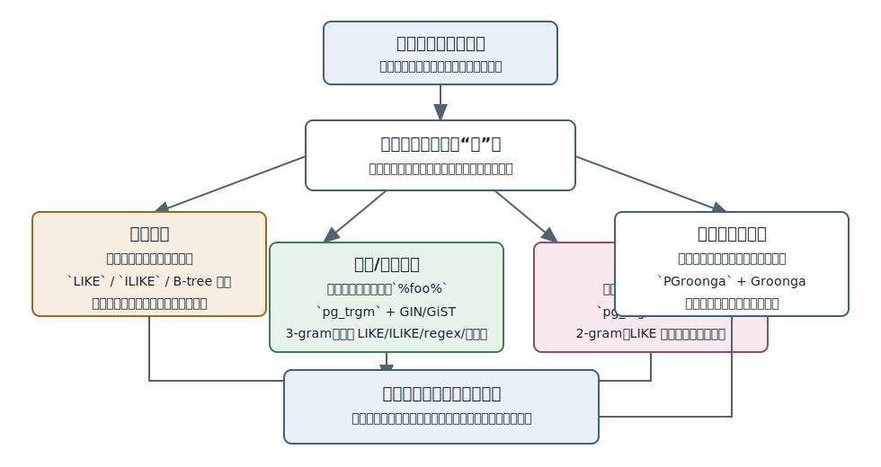
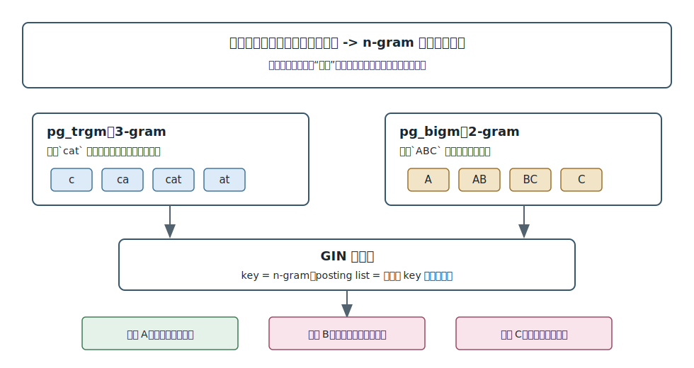
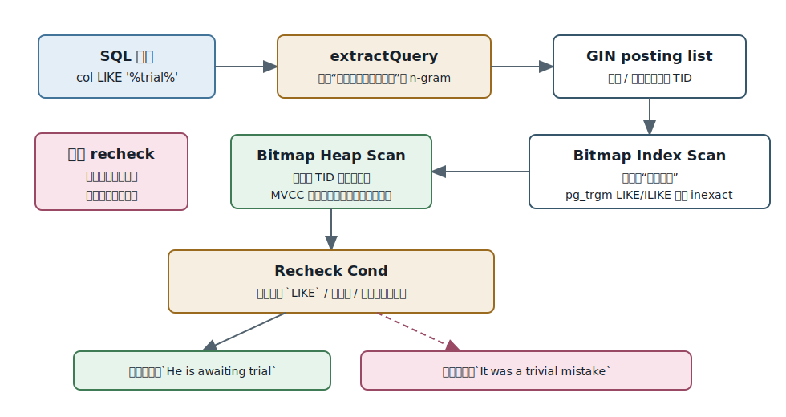
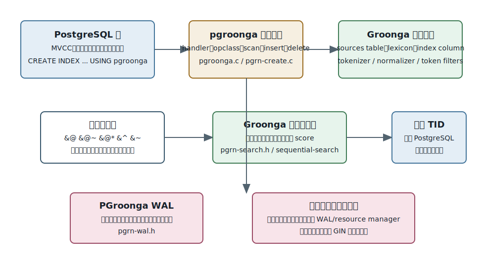
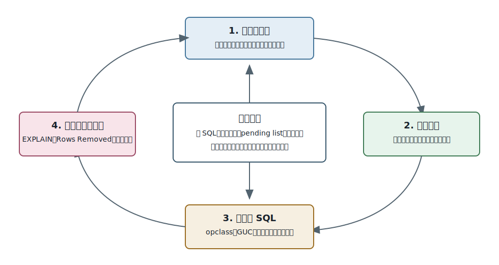

## 数据库筑基课 - 应用实践之 模糊搜索

### 作者
digoal

### 日期
2026-05-31

### 标签
PostgreSQL , 应用开发者 , 数据库筑基课 , 模糊搜索 , pg_trgm , pg_bigm , PGroonga , GIN    

----

## 背景
  


本文属于“应用实践 + 数据类型/操作符 + 索引结构”的交叉主题。当前工作区未发现“数据库筑基课”总纲文件，因此本文按用户给定标题独立成篇。

模糊搜索是应用里最容易被低估的能力。产品经理说“搜一下就行”，开发者第一反应往往是：

```sql
WHERE name ILIKE '%keyword%'
```

小表、低频、后台管理场景这样做没有问题。但当数据量上来，关键词变成中文、日文、拼写错误、1 到 2 个字符短词、前缀联想、相似推荐、权限过滤和分页排序时，问题就不是“SQL 能不能写出来”，而是：

- 怎么把“像”定义清楚：包含、相似、分词命中、前缀、正则，还是语义接近？
- 怎么让索引先缩小候选集，而不是每次扫描整列文本？
- 候选集会不会有误判，回表确认的成本能不能接受？
- 写入、更新、VACUUM、pending list、崩溃恢复和复制是否可控？
- 多语言文本到底用 PostgreSQL 原生能力、`pg_trgm`、`pg_bigm`、PGroonga，还是外部搜索服务？

核心判断是：

> 模糊搜索不是一个功能点，而是一组“搜索语义 + 候选召回 + 精确确认 + 排序 + 运维闭环”的组合。`LIKE` 只定义匹配语义；`pg_trgm`、`pg_bigm`、PGroonga 解决的是如何更快、更可控地找到候选集。



图 1 说明：不要先问“建什么索引”，先问业务里的“模糊”到底是什么。英文拼写近似、短词包含、中文日文分词、多字段评分和前缀补全，对应的技术路线不同。选错路线会出现两类问题：查得慢，或者查得快但结果不对。

## 一、它解决什么问题？

模糊搜索要解决的是“用户输入和数据库文本不完全相等时，如何在可接受延迟内返回可解释结果”。

常见业务痛点有五类。

第一，包含搜索。用户输入 `bigm`，希望匹配 `pg_bigm improves performance`。传统 `LIKE '%bigm%'` 语义准确，但前导 `%` 让普通 B-tree 难以发挥作用，大表容易变成顺序扫描。

第二，大小写和拼写近似。用户输入 `postgres`、`PostgreSQL`、`postgress`，希望结果不要因为大小写或轻微拼写差异全丢。`pg_trgm` 通过 trigram 集合相似度解决这类问题。

第三，短词和非空格语言。中文、日文、SKU、姓名、地址经常只有 1 到 2 个字符，3-gram 可能抽不出足够有效的候选 key。`pg_bigm` 用 2-gram 让短词和非空格语言更容易走 GIN 候选召回。

第四，多语言全文检索。用户不只是要“包含”，还要分词、归一化、前缀、正则、评分、高亮和复杂查询语法。PGroonga 把 Groonga 搜索引擎嵌进 PostgreSQL，能力比简单 n-gram 更完整。

第五，工程闭环。搜索结果要和租户、权限、状态、时间范围、事务一致性一起工作。数据库内搜索的优势是少一套同步系统；代价是索引写入放大和数据库维护责任也留在库内。

因此，模糊搜索的本质是把一个昂贵的字符串判断拆成两段：

1. 用索引快速找“可能匹配”的候选行。
2. 对候选行执行原始条件或更精确的搜索表达式，过滤误判并排序。

## 二、它是什么？

在 PostgreSQL 语境下，本文把“模糊搜索”分成四层。

| 层次 | 典型技术 | 解决的问题 | 关键代价 |
|---|---|---|---|
| 原始模式匹配 | `LIKE`、`ILIKE`、正则 | 语义直接，适合小表或前缀搜索 | 大表 `%keyword%` 容易扫描 |
| n-gram 候选召回 | `pg_trgm`、`pg_bigm` + GIN/GiST | 把字符串拆成片段，用倒排索引找候选 | 有误判，需要回表确认 |
| 数据库内全文引擎 | PGroonga | 多语言分词、归一化、评分、前缀、正则 | 独立索引结构和 WAL/恢复边界 |
| 语言级全文表示 | `tsvector`、`tsquery` | 文档词项化、布尔查询、rank、headline | 语言配置和排序质量要自己验证 |

本文重点是应用实践中的模糊搜索，因此主线放在 `LIKE`/`ILIKE`、`pg_trgm`、`pg_bigm`、PGroonga。`tsvector` 更适合“全文检索表示层”，已在同系列《数据库筑基课 - 应用实践之 tsvector》中单独展开。

几个术语需要先对齐：

- **n-gram**：把字符串切成连续 n 个字符的片段。`pg_trgm` 是 3-gram，`pg_bigm` 是 2-gram。
- **GIN**：Generalized Inverted Index，存储 `key -> posting list`，适合“一个值里有多个可检索元素”的场景。
- **候选集**：索引返回的可能匹配行，不一定是最终结果。
- **recheck**：回堆表后重新执行原始条件，过滤索引误判。
- **相似度阈值**：低阈值召回更多但误判和排序压力更大；高阈值更精确但可能漏召回。

## 三、核心原理

### 3.1 原生 `LIKE`：语义清楚，但索引能力有限

`LIKE` 的语义是模式匹配：

- `foo%` 是前缀匹配，某些排序规则和操作符类下可以利用 B-tree。
- `%foo%` 是包含匹配，普通 B-tree 很难定位起点。
- `_` 匹配单个字符，`%` 匹配任意长度字符串。
- `ILIKE` 是大小写不敏感匹配，行为受字符和排序规则影响。

这也是为什么“先写 `LIKE '%关键字%'`”容易出问题：数据库必须证明每一行文本是否包含目标片段。没有能排除大量行的索引时，只能扫描大量文本。

### 3.2 `pg_trgm`：3-gram 把模糊匹配转成集合问题

PostgreSQL contrib 模块 `pg_trgm` 提供 trigram 相似度函数、操作符，以及 GIN/GiST 操作符类。官方文档说明，trigram 是从字符串中取出的三个连续字符；模块会忽略非 word 字符，并在词左侧补两个空格、右侧补一个空格。源码 `postgres/contrib/pg_trgm/trgm.h` 中也定义了 `LPADDING 2`、`RPADDING 1`。

对 `LIKE`/`ILIKE`，关键路径在 `postgres/contrib/pg_trgm/trgm_gin.c`：

- `gin_extract_value_trgm()`：建索引时从列值抽取 trigram，作为 GIN key。
- `gin_extract_query_trgm()`：查询时按 strategy 判断是相似度、`LIKE`、`ILIKE`、正则还是等值；对 wildcard search 调用 `generate_wildcard_trgm()`。
- `gin_trgm_consistent()`：检查候选行是否包含查询抽出的 key。
- `gin_trgm_triconsistent()`：用 GIN 三值逻辑返回 `GIN_MAYBE` 或 `GIN_FALSE`。

`pg_trgm` 的 GIN 对 `LIKE`/`ILIKE` 是 inexact：索引能证明“缺少某个必需 trigram 的行一定不匹配”，但不能证明“拥有所有 trigram 的行一定满足原始模式”。因此源码中 `gin_trgm_consistent()` 对这些场景设置 `*recheck = true`。



图 2 说明：n-gram 索引的价值是把字符串扫描变成倒排 key 查找。它的边界也在这里：片段集合相同或相近，不代表原始字符串一定满足 `LIKE`、正则或相似度阈值。

### 3.3 `pg_bigm`：2-gram 更适合短词和非空格语言

`pg_bigm` 的 README 和文档明确说明：它基于 2-gram，为 PostgreSQL 提供 GIN 索引加速的全文搜索能力。它和 `pg_trgm` 的主要差异是：

- `pg_trgm` 用 3-gram；`pg_bigm` 用 2-gram。
- `pg_trgm` 支持 GIN 和 GiST；`pg_bigm` 只支持 GIN。
- `pg_trgm` 支持 `LIKE`、`ILIKE`、正则和相似度；`pg_bigm` 文档主线是 `LIKE` 和 `=%` 相似搜索。
- `pg_bigm` 对非 alphabetic language 和 1 到 2 字符关键词更友好。

源码路径很直观：

- `pg_bigm/bigm_op.c`：`generate_bigm()`、`generate_wildcard_bigm()`、`show_bigm()`、`likequery()`、`bigm_similarity()`。
- `pg_bigm/bigm_gin.c`：`gin_extract_value_bigm()`、`gin_extract_query_bigm()`、`gin_bigm_consistent()`、`gin_bigm_triconsistent()`、`pg_gin_pending_stats()`。
- `pg_bigm/pg_bigm--1.2.sql`：定义 `gin_bigm_ops`、`likequery(text)`、`=%` 等 SQL 对象。

`likequery()` 不是搜索引擎，它只是把用户关键词转换成安全的 `LIKE` pattern：前后加 `%`，并转义 `%`、`_`、`\`。这避免应用侧重复实现转义逻辑。

`pg_bigm.enable_recheck` 是正确性开关。文档用 `trial` 和 `trivial` 举例：`trivial` 包含 `trial` 的多个 2-gram 片段，可能被 GIN 召回，但不包含完整词 `trial`。如果关闭 recheck，误判可能直接进入最终结果。源码 `gin_bigm_consistent()` 也按这个 GUC 决定是否设置 `*recheck`。

`pg_bigm.gin_key_limit` 是性能开关。长关键词会抽出很多 2-gram，GIN 扫描成本会上升；限制 key 数可以降低索引扫描成本，但候选集会变宽，recheck 压力变大。这个旋钮不是“越小越快”，而是把成本从索引扫描转移到回表确认。



图 3 说明：GIN 在这里负责排除大量“不可能匹配”的行，不负责最终语义判定。`pg_trgm` 对 `LIKE`/`ILIKE` 总是需要 recheck；`pg_bigm` 在大多数包含搜索中也应保持 `pg_bigm.enable_recheck = on`，除非你明确只是在评估误判候选。

### 3.4 GIN 的写入和 pending list：搜索性能不只看查询

PostgreSQL 官方 GIN 文档说明，GIN 存储 `(key, posting list)`。同一行可能出现在多个 key 的 posting list 中；key 只存一份。对 n-gram 模糊搜索，一行文本越长，产生的 key 越多，索引写入放大越明显。

GIN 还有 fast update pending list 机制：插入先进入 pending list，之后由 VACUUM、autoanalyze、`gin_clean_pending_list()` 或超过 `gin_pending_list_limit` 时批量合并到主索引结构。它提升写入吞吐，但带来三个风险：

- 查询时可能还要扫描 pending list。
- pending list 太大会拖慢搜索。
- 前台触发 cleanup 的那次写入可能出现延迟尖刺。

`pg_bigm` 提供 `pg_gin_pending_stats(regclass)` 查看 GIN pending list 页数和 tuple 数。原生 PostgreSQL 也有相关扩展和运维手段。模糊搜索上线后，不看 pending list 和 VACUUM，只看平均查询耗时，是不完整的。

### 3.5 PGroonga：不是 GIN opclass，而是独立访问方法

PGroonga 的定位不同。它不是把 n-gram 塞进 PostgreSQL GIN，而是注册一个名为 `pgroonga` 的 index access method。`pgroonga/data/pgroonga.sql` 中可以看到：

```sql
CREATE ACCESS METHOD pgroonga
    TYPE INDEX
    HANDLER pgroonga_handler;
```

同时它定义了大量 operator class，例如 `pgroonga_text_full_text_search_ops_v2`、`pgroonga_text_term_search_ops_v2`、`pgroonga_text_regexp_ops_v2`、`pgroonga_jsonb_ops_v2`。常见操作符包括：

| 操作符 | 大致用途 | 备注 |
|---|---|---|
| `&@` | full text match | v2 主线匹配操作符 |
| `&@~` | Groonga query | 支持 Groonga 查询语法 |
| `&@*` | similar search | 相似搜索 |
| `&^` / `&^~` | prefix / prefix RK | 前缀与近似前缀 |
| `&~` | regexp | 正则搜索 |
| `~~` / `~~*` | `LIKE` / `ILIKE` | 在相关 opclass 中支持 |

PGroonga 的核心结构来自 Groonga：

- sources table 保存 PostgreSQL 行对应的源数据。
- lexicon 保存 token 或 key。
- index column 连接 lexicon 和 sources table。
- tokenizer、normalizer、token filters 决定分词和归一化行为。

源码 `pgroonga/src/pgrn-create.c` 中，`PGrnCreateLexicon()` 会根据 full text、regexp、prefix、semantic 等 use case 选择 tokenizer 和 normalizer；`PGrnCreateIndexColumn()` 对全文和正则搜索设置 `GRN_OBJ_WITH_POSITION`。这说明 PGroonga 的能力边界来自 Groonga 的词典和索引列，而不是 PostgreSQL GIN 的 key/posting list 接口。

PGroonga 也有独立的 WAL 和崩溃安全问题。源码 `pgroonga/src/pgrn-wal.h` 列出 `PGrnWALCreateTable()`、`PGrnWALCreateColumn()`、`PGrnWALInsertStart()`、`PGrnWALDelete()`、`PGrnWALApply()` 等接口；项目架构中还包含 `pgroonga-crash-safer`、`pgroonga-wal-applier`、`pgroonga-wal-resource-manager` 等模块。工程上必须把它当成一个嵌入式搜索引擎索引，而不是普通 GIN 索引。



图 4 说明：PGroonga 的强项是多语言搜索能力和 Groonga 生态；代价是索引结构、WAL、恢复、版本兼容和部署参数都要单独验证。它适合搜索能力要求更高、但又希望保留 PostgreSQL 事务和 SQL 组合能力的场景。

### 3.6 选择率和优化器：建索引不代表一定会用

模糊搜索常见误解是“建了索引就会快”。实际路径还受这些因素影响：

- 查询模式能不能抽出有效 n-gram。`LIKE '%%'`、很短且不含有效字符的 pattern，可能退化为全索引扫描或顺序扫描。
- 关键词是不是高频。高频片段召回候选过多，回表和排序仍然重。
- 统计信息是否新鲜。建索引后要 `ANALYZE`，高变化表依赖 autovacuum/autoanalyze。
- 其他过滤条件是否能先缩小范围。例如租户、状态、时间范围和分区裁剪。
- 排序是否昂贵。相似度排序、PGroonga score、业务权重排序都可能超过索引扫描本身。

所以验证方式必须是：

```sql
EXPLAIN (ANALYZE, BUFFERS)
SELECT ...
```

重点看：

- 是否走 `Bitmap Index Scan` / `Index Scan`。
- `Rows Removed by Index Recheck` 是否过高。
- heap block 命中和读取量。
- 排序是否 spill 到磁盘。
- limit/top-N 是否真的提前终止。
- pending list、VACUUM、写入延迟是否健康。

## 四、横向对比

| 维度 | `LIKE` / `ILIKE` | `pg_trgm` | `pg_bigm` | PGroonga | `tsvector` |
|---|---|---|---|---|---|
| 主要目标 | 简单模式匹配 | trigram 相似和 wildcard 加速 | bigram 短词/非空格语言 LIKE 加速 | 多语言全文搜索引擎能力 | 语言级全文检索表示 |
| 核心索引 | B-tree 前缀或顺序扫描 | GIN / GiST | GIN | `pgroonga` 访问方法 | GIN / GiST |
| 典型操作符 | `LIKE`、`ILIKE`、正则 | `%`、`<%`、`LIKE`、`ILIKE`、正则 | `LIKE`、`=%` | `&@`、`&@~`、`&@*`、`&^`、`&~`、`LIKE` | `@@` |
| 写入代价 | 低 | 中到高，文本越长 key 越多 | 中到高，2-gram key 更多 | 中到高，维护 Groonga 结构 | 中到高，生成 tsvector 和倒排 |
| 读取代价 | 小表低，大表高 | 候选缩小明显，但需要 recheck | 短词更友好，但可能更多候选 | 能力强，依赖 Groonga 表达式和索引 | 全文词项查询强 |
| 误判来源 | 无索引误判，直接执行条件 | trigram 集合近似 | bigram 集合近似 | 取决于搜索表达式和索引能力 | GIN/GiST 可能 recheck |
| 多语言能力 | 弱 | 拉丁文本较常见 | 中文/日文短词更友好 | 强，可配 tokenizer/normalizer | 取决于 text search configuration |
| 运维重点 | 慢 SQL | GIN pending list、recheck、阈值 | recheck、gin_key_limit、pending list | WAL、恢复、Groonga 配置、版本 | 词典配置、统计、GIN 维护 |
| 不适合场景 | 大表高并发 `%keyword%` | 极短词、复杂中文分词质量要求 | 复杂查询语法和排序运营 | 不愿承担额外索引引擎维护 | 单纯短词包含和模糊拼写 |

这张表的关键是：没有一个“最佳模糊搜索索引”。只有更贴近 workload 的组合。

如果只是后台偶尔查手机号、订单号、用户名，小表 `LIKE` 足够。  
如果是英文名称、标题、拼写近似和 `%keyword%`，先看 `pg_trgm`。  
如果是中文、日文、短关键词、姓名地址包含，`pg_bigm` 值得验证。  
如果是多语言全文搜索、前缀、复杂查询语法、score 和高亮，PGroonga 更像数据库内搜索引擎。  
如果是文档级词项检索、字段权重、rank、headline，`tsvector` 是 PostgreSQL 原生主线。

## 五、效果如何？

效果不能只用“平均耗时下降多少”衡量。模糊搜索至少要看六个指标。

第一，召回率。用户认为应该搜到的结果，有多少能搜到。降低相似度阈值、使用 2-gram、选择合适 tokenizer，通常能提高召回，但也会增加误判。

第二，精确率。搜出来的结果有多少是用户认为相关的。`pg_bigm.enable_recheck = off` 可以减少回表，但会牺牲正确性；除调试外不建议作为生产默认。

第三，候选集大小。候选越多，回表、MVCC 可见性检查、排序、分页都越重。`Rows Removed by Index Recheck` 是非常直接的观察点。

第四，写入放大。文本列每次 insert/update 都要维护多个索引 key。GIN pending list、PGroonga WAL、批量导入策略都会影响写入延迟。

第五，空间放大。n-gram 越细，key 和 posting list 越多。2-gram 对短词友好，但通常也意味着更多候选和索引维护成本。

第六，排序质量。相似度分数、PGroonga score、业务权重、时间衰减、点击反馈是不同层面的排序信号。索引解决“找得到”，不自动解决“排得好”。



图 5 说明：模糊搜索应先用真实搜索样本定义成功标准，再选技术路线。上线后继续用慢 SQL、回表比例、pending list、零结果率、点击率和写入延迟校准，而不是一次建索引后就结束。

## 六、实操 DEMO

以下 SQL 是最小可验证脚本。本文未在本机启动 PostgreSQL 实例执行这些 SQL，因此不提供伪造执行结果；语法依据 PostgreSQL 官方文档、本地扩展 SQL 定义和源码接口。

### 6.1 `pg_trgm`：加速 `%keyword%` 和相似搜索

```sql
DROP TABLE IF EXISTS products;
CREATE TABLE products (
    id bigserial PRIMARY KEY,
    tenant_id int NOT NULL,
    name text NOT NULL
);

INSERT INTO products (tenant_id, name) VALUES
    (1, 'PostgreSQL fuzzy search'),
    (1, 'pg_trgm trigram index'),
    (1, 'PGroonga multilingual search'),
    (2, 'unrelated document');

CREATE EXTENSION IF NOT EXISTS pg_trgm;

CREATE INDEX products_name_trgm_gin
ON products USING gin (name gin_trgm_ops);

ANALYZE products;

EXPLAIN (ANALYZE, BUFFERS)
SELECT id, name
FROM products
WHERE tenant_id = 1
  AND name ILIKE '%trgm%';

SET pg_trgm.similarity_threshold = 0.3;

EXPLAIN (ANALYZE, BUFFERS)
SELECT id, name, similarity(name, 'postgress') AS sml
FROM products
WHERE name % 'postgress'
ORDER BY sml DESC, id
LIMIT 10;
```

验证重点：

- 是否出现 `Bitmap Index Scan on products_name_trgm_gin`。
- `Rows Removed by Index Recheck` 是否可接受。
- `tenant_id` 是否需要单独索引或分区帮助先缩小范围。
- 相似度阈值改变后召回和误判如何变化。

### 6.2 `pg_bigm`：短词和非空格语言包含搜索

```sql
DROP TABLE IF EXISTS tickets;
CREATE TABLE tickets (
    id bigserial PRIMARY KEY,
    title text NOT NULL
);

INSERT INTO tickets (title) VALUES
    ('東京都の検索テスト'),
    ('東京と京都を含む文章'),
    ('中文模糊搜索测试'),
    ('PostgreSQL extension pg_bigm');

CREATE EXTENSION IF NOT EXISTS pg_bigm;

CREATE INDEX tickets_title_bigm_gin
ON tickets USING gin (title gin_bigm_ops);

ANALYZE tickets;

SET pg_bigm.enable_recheck = on;
SET pg_bigm.gin_key_limit = 0;

EXPLAIN (ANALYZE, BUFFERS)
SELECT id, title
FROM tickets
WHERE title LIKE likequery('東京');

EXPLAIN (ANALYZE, BUFFERS)
SELECT id, title, bigm_similarity(title, '検索') AS sml
FROM tickets
WHERE title =% '検索'
ORDER BY sml DESC, id;

SELECT * FROM pg_gin_pending_stats('tickets_title_bigm_gin');
```

验证重点：

- `likequery()` 是否正确转义用户输入。
- `pg_bigm.enable_recheck` 保持 `on` 时结果是否符合人工标注。
- 调整 `pg_bigm.gin_key_limit` 后，索引扫描和 recheck 成本如何转移。
- pending list 是否随写入增长。

### 6.3 PGroonga：多语言全文和前缀/相似能力

```sql
DROP TABLE IF EXISTS memos;
CREATE TABLE memos (
    id bigserial PRIMARY KEY,
    content text NOT NULL
);

INSERT INTO memos (content) VALUES
    ('PostgreSQL is a relational database.'),
    ('Groonga is a fast full text search engine.'),
    ('PGroonga is a PostgreSQL extension that uses Groonga.'),
    ('日本語と中文を含む検索テキスト');

CREATE EXTENSION IF NOT EXISTS pgroonga;

CREATE INDEX memos_content_pgroonga
ON memos USING pgroonga (content);

ANALYZE memos;

EXPLAIN (ANALYZE, BUFFERS)
SELECT id, content, pgroonga_score(tableoid, ctid) AS score
FROM memos
WHERE content &@ 'Groonga'
ORDER BY score DESC, id;

EXPLAIN (ANALYZE, BUFFERS)
SELECT id, content
FROM memos
WHERE content &@~ 'PostgreSQL OR Groonga';

EXPLAIN (ANALYZE, BUFFERS)
SELECT id, content
FROM memos
WHERE content &@* 'PostgreSQL';
```

如果要为特定语言调整 tokenizer 或 normalizer，可参考 PGroonga 测试用例中的写法：

```sql
CREATE INDEX memos_content_pgroonga_ngram
ON memos
USING pgroonga (content)
WITH (
    tokenizer = 'TokenNgram("loose_symbol", true)',
    normalizer = 'NormalizerNFKC100("unify_kana", true)'
);
```

验证重点：

- `&@`、`&@~`、`&@*` 是否对应业务需要的语义。
- tokenizer/normalizer 改动后，召回样本是否改善。
- `pgroonga_score()` 排序是否符合用户感知。
- 备份恢复、复制、崩溃恢复流程是否覆盖 PGroonga 索引。

## 七、最佳实践

### 面向数据库架构师

先定义搜索语义，再定义索引。至少把搜索需求分成五类：精确包含、大小写不敏感、拼写近似、语言分词、前缀补全。不要用一个 `%keyword%` 覆盖全部需求。

把租户、状态、时间范围和文本搜索拆开设计。很多慢查询不是模糊搜索本身慢，而是搜索先召回了全库候选，再过滤租户和状态。大表上常见做法是：

- 租户或时间范围先通过分区、普通 B-tree 或组合查询条件缩小范围。
- 文本列用 `pg_trgm`、`pg_bigm` 或 PGroonga。
- 对 TopN 排序加上稳定 tie breaker，例如 `ORDER BY score DESC, id DESC`。

搜索质量要有样本集。上线前准备真实关键词、错别字、短词、空输入、高频词、敏感词、无结果词，人工标注“应该命中”和“不应该命中”。没有样本，阈值调参就是猜。

### 面向 DBA

对 GIN 索引，监控 pending list、VACUUM、索引大小、回表比例和写入延迟。高写入表需要评估：

- `fastupdate` 是否开启。
- `gin_pending_list_limit` 是否合理。
- autovacuum 是否及时。
- 批量导入时是否先导入后建索引。

对 `pg_bigm`，生产默认保持 `pg_bigm.enable_recheck = on`。关闭它只适合诊断候选集、评估 recheck 成本或特殊容忍误判的离线场景。

对 PGroonga，把它纳入备份恢复和复制演练。确认当前 PostgreSQL 版本、PGroonga 版本、Groonga 版本、WAL/resource manager、crash safer 配置和重建索引流程。不要只验证查询 SQL。

### 面向业务开发者

不要拼接用户输入到 `LIKE` pattern。`pg_bigm` 用 `likequery()`；其他场景也应在应用层或 SQL 层统一处理 `%`、`_`、`\` 的转义。

搜索框要限制极端输入。空字符串、全 `%`、超长关键词、高频单字、复杂正则都可能让索引退化。合理做法是：

- 空输入直接返回默认列表，不触发模糊搜索。
- 过短关键词按业务决定是否允许。
- 正则搜索只给可信用户或后台任务。
- 分页限制最大 offset，深翻页改用 search-after 风格。

排序要可解释。只用相似度不一定满足业务；可以组合：

```sql
ORDER BY
    similarity(name, $1) DESC,
    updated_at DESC,
    id DESC
```

但每加一个排序条件，都要用 `EXPLAIN (ANALYZE, BUFFERS)` 看是否引入大排序或回表放大。

## 八、适合与不适合场景

### 适合 `LIKE` / `ILIKE`

适合：

- 小表、低频后台查询。
- 明确前缀匹配，例如 `code LIKE 'ABC%'`。
- 数据量小到顺序扫描可接受。

不适合：

- 大表高并发 `%keyword%`。
- 需要拼写相似、短词召回、多语言分词。

### 适合 `pg_trgm`

适合：

- 英文、拼音、拉丁字符名称、标题、邮箱局部、标签。
- `%keyword%` 包含搜索。
- 拼写近似和相似排序。
- 需要 `LIKE`、`ILIKE`、正则一起加速。

不适合：

- 1 到 2 字符关键词是主流查询。
- 中文日文等非空格语言需要高质量分词。
- 无法接受 recheck 或候选误判。

### 适合 `pg_bigm`

适合：

- 中文、日文、姓名、地址、短词包含搜索。
- `LIKE likequery(keyword)` 是主查询形态。
- 希望留在 PostgreSQL GIN 维护模型内。

不适合：

- 需要复杂查询语法、评分、高亮和分词运营。
- 可以容忍误判但不能回表确认的高并发极限场景。
- 单列超大文本，接近文档中 indexed column size 限制。

### 适合 PGroonga

适合：

- 多语言全文检索。
- 需要 tokenizer、normalizer、前缀、正则、相似搜索、score。
- 希望搜索结果和 PostgreSQL 事务、权限、SQL 过滤条件在同一库内组合。

不适合：

- 团队不愿维护额外搜索引擎依赖和恢复流程。
- 只需要简单后台 `%keyword%`。
- 对扩展版本、Groonga 版本、WAL 行为没有测试能力。

## 九、常见坑

1. 把 `%keyword%` 当成“简单需求”。  
   它简单在语法，不简单在执行。大表上没有候选缩小能力，就会扫描大量文本。

2. 看到走索引就认为完成。  
   `Bitmap Index Scan` 只是第一步。要继续看 heap blocks、recheck、排序和最终行数。

3. 关闭 `pg_bigm.enable_recheck`。  
   这会让候选误判直接变成结果误判。除调试外，不应作为生产默认。

4. 把相似度阈值调得过低。  
   阈值低会扩大召回，也会扩大误判、回表和排序成本。要用样本集评估。

5. 忽略短词。  
   用户搜索“张”“京”“AI”“DB”这类短词时，3-gram 路线可能没有足够有效 key。短词要单独测。

6. 忽略语言归一化。  
   大小写、全半角、假名、标点、空白、繁简、同义词都会影响结果。PGroonga 的 normalizer 或 PostgreSQL text search configuration 需要明确选择。

7. 没有处理用户输入转义。  
   用户输入 `%`、`_`、`\` 时，如果直接拼 `LIKE`，语义会改变。`likequery()` 或等价转义逻辑必须统一。

8. 把搜索和权限过滤分离。  
   外部搜索或库内搜索都要考虑权限。如果先召回大量无权限结果再过滤，分页和排序会出问题。

9. 不做恢复演练。  
   对 PGroonga，索引不只是 PostgreSQL 普通索引页，还涉及 Groonga 对象、WAL 和 crash safer。必须演练恢复和重建。

10. 用单个指标判断搜索质量。  
    延迟、召回率、精确率、零结果率、点击率、写入延迟、索引大小都要一起看。

## 十、扩展问题

1. 如果搜索关键词只有 1 个中文字符，你期望“包含这个字”还是“词语命中”？这会如何影响 `pg_bigm` 和 PGroonga 的选择？

2. 如果 `Rows Removed by Index Recheck` 很高，是降低阈值、提高阈值、改 tokenizer，还是增加业务过滤条件？

3. 为什么 `LIKE '%abc%'` 的正确性判断不能只靠 trigram 或 bigram 集合？

4. 一个商品搜索页同时需要标题命中、品牌命中、类目过滤、销量排序和权限过滤，应把哪些条件交给文本索引，哪些条件交给普通关系索引？

5. 如果搜索结果必须毫秒级且跨多个 PostgreSQL 实例，数据库内搜索和外部搜索引擎的边界在哪里？

## 十一、扩展阅读

主要一手资料和本地源码：

- PostgreSQL `pg_trgm` 官方文档：`postgres/doc/src/sgml/pgtrgm.sgml`
- PostgreSQL GIN 官方文档：`postgres/doc/src/sgml/gin.sgml`
- PostgreSQL `pg_trgm` GIN 源码：`postgres/contrib/pg_trgm/trgm_gin.c`
- PostgreSQL `pg_trgm` 操作与参数源码：`postgres/contrib/pg_trgm/trgm_op.c`
- PostgreSQL `pg_trgm` 头文件：`postgres/contrib/pg_trgm/trgm.h`
- pg_bigm 英文文档：`pg_bigm/docs/pg_bigm_en.md`
- pg_bigm SQL 定义：`pg_bigm/pg_bigm--1.2.sql`
- pg_bigm bigram 生成和函数源码：`pg_bigm/bigm_op.c`
- pg_bigm GIN 源码：`pg_bigm/bigm_gin.c`
- PGroonga README：`pgroonga/README.md`
- PGroonga SQL 定义和 operator class：`pgroonga/data/pgroonga.sql`
- PGroonga 访问方法和 scan 主体：`pgroonga/src/pgroonga.c`
- PGroonga 创建 Groonga table/lexicon/index column：`pgroonga/src/pgrn-create.c`
- PGroonga WAL 接口：`pgroonga/src/pgrn-wal.h`
- PGroonga 顺序搜索支持：`pgroonga/src/pgrn-sequential-search.c`
- PGroonga SQL 测试：`pgroonga/sql/full-text-search/`

DeepWiki 辅助资料：

- `postgres/postgres`：pg_trgm 与 GIN wildcard search 摘要，验证源码路径和 recheck 结论。
- `pgbigm/pg_bigm`：pg_bigm 架构摘要，验证 `likequery`、`enable_recheck`、`gin_key_limit` 和限制。
- `pgroonga/pgroonga`：PGroonga 架构摘要，验证访问方法、Groonga 集成、operator、tokenizer/normalizer、WAL/crash safety。

  
  
## 附录 

1、克隆代码  
```  
git clone --depth 1 https://github.com/postgres/postgres
git clone --depth 1 https://github.com/pgbigm/pg_bigm
git clone --depth 1 https://github.com/pgroonga/pgroonga
```  
  
2、启用 codex, 使用 [数据库筑基课 skill](../skills/README.md).  
```
文章标题: 
  数据库筑基课 - 应用实践之 模糊搜索
项目源码(本地目录): 
  postgres 
  pg_bigm 
  pgroonga 
项目 codebase 文件名: 
  postgres/CLAUDE.md 
  pg_bigm/CLAUDE.md 
  pgroonga/CLAUDE.md 
开源项目相关的 deepwiki repoName: 
  postgres/postgres 
  pgbigm/pg_bigm 
  pgroonga/pgroonga 
```
   
  
#### [PostgreSQL 解决方案集合](../201706/20170601_02.md "40cff096e9ed7122c512b35d8561d9c8")
  
  
#### [德哥 / digoal's Github - 公益是一辈子的事.](https://github.com/digoal/blog/blob/master/README.md "22709685feb7cab07d30f30387f0a9ae")
  
  
#### [About 德哥](https://github.com/digoal/blog/blob/master/me/readme.md "a37735981e7704886ffd590565582dd0")
  
  

  
