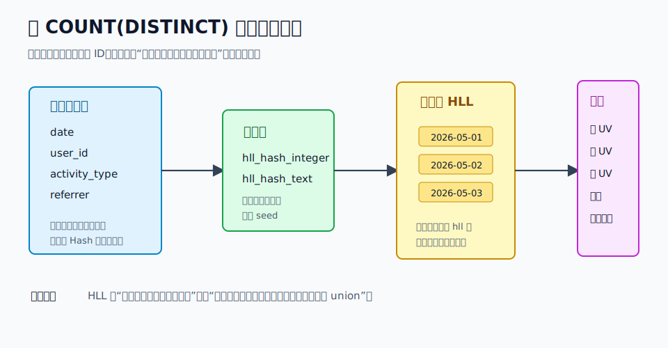
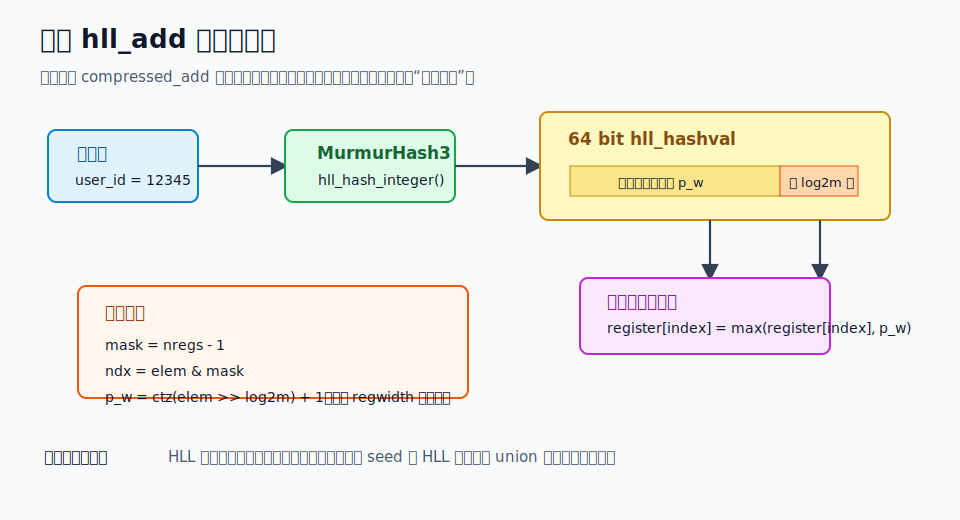
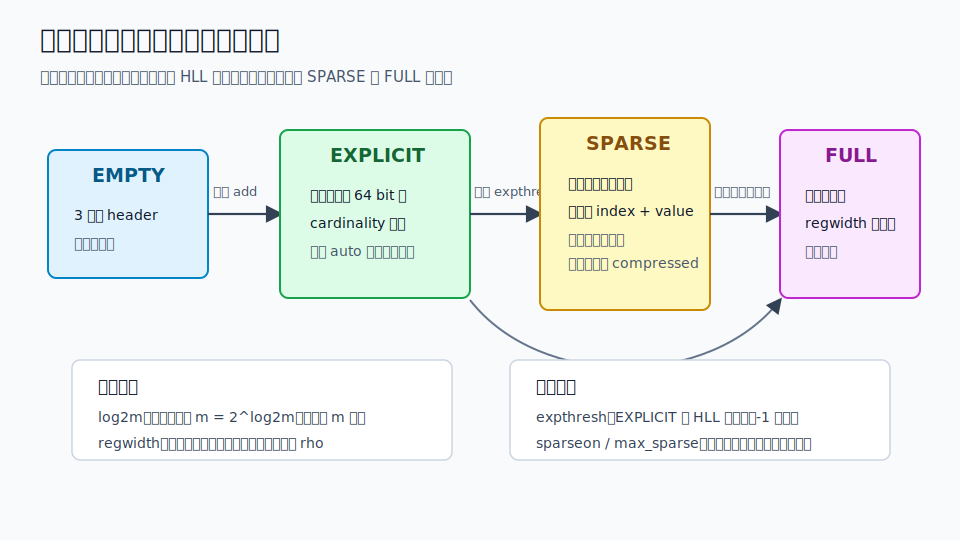
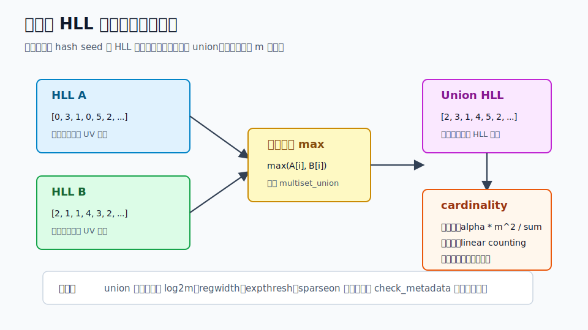

## 数据库筑基课 - 应用实践之 hll

### 作者
digoal

### 日期
2026-05-31

### 标签
PostgreSQL , 应用开发者 , 数据库筑基课 , HyperLogLog , hll , 近似去重 , 数据仓库    

----

## 背景
  


本文属于“应用实践 + 数据类型/操作符 + 聚合算子”的交叉主题。当前工作区未发现“数据库筑基课”总纲文件，因此本文按用户给定标题独立成篇。

很多业务都会遇到同一个指标：UV、独立设备数、去重订单买家数、去重广告曝光用户数、去重 API 调用主体数。

小表里直接写：

```sql
SELECT count(DISTINCT user_id) FROM events WHERE event_date = current_date;
```

这没有问题。但数据进入日志、埋点、广告、风控、IoT、消息投递之后，问题会变成：

- 每天几十亿明细行，`COUNT(DISTINCT)` 要排序或维护大 hash table。
- 产品不是只问“今天 UV”，还要问周 UV、月 UV、最近 7 天滑动 UV、渠道交叉 UV。
- 如果为每个问题都重新扫明细，计算成本和等待时间不可接受。
- 如果把每日去重用户明细集合都存下来，空间、隐私和合并成本也不可接受。

`postgresql-hll` 解决的是这类问题：把去重集合压成一个固定上界的小型概率摘要，并且摘要之间可以继续合并。它牺牲的是精确性，换来空间稳定、合并便宜、查询链路短。

核心判断是：

> HLL 不是 `COUNT(DISTINCT)` 的“更快写法”，而是把“精确保存集合成员”替换成“保存可合并的集合摘要”。只要业务能接受可量化误差，它就能把多粒度去重从明细扫描问题变成摘要合并问题。



图 1 说明：HLL 的工程价值来自“先汇总、再合并”。事实表里的 `user_id` 先被哈希，再聚合成日粒度 `hll`；周、月、滑动窗口只需要 `hll_union_agg()` 合并已有摘要，不必重新扫描明细用户集合。

## 一、它解决什么问题？

HLL 解决的是大规模去重统计中的三个矛盾。

第一，精确去重和空间的矛盾。精确 `COUNT(DISTINCT)` 需要记住足够多的成员信息，成员越多，内存或磁盘中间态越大。HLL 只保存寄存器数组，默认 `log2m=11`、`regwidth=5` 时，完整寄存器数据大约是 `2^11 * 5 / 8 = 1280` 字节，README 也用这个默认值说明可以估算很大集合且误差只有几个百分点。

第二，单次统计和多次复用的矛盾。今天的 UV、上周 UV、最近 30 天 UV、每个渠道月 UV，背后都是集合 union 后再求 cardinality。精确做法如果没有提前保存成员集合，就要反复扫描明细；HLL 的 union 是摘要级操作。

第三，实时应用和数仓应用的矛盾。业务需要毫秒到秒级看板，但数据仓库明细扫描可能以分钟计。`postgresql-hll` 的典型用法是把事实表按日期、租户、渠道等维度预聚合成 `hll` 列，再在查询时做 `hll_cardinality()` 或 `hll_union_agg()`。

代价也明确：

- 它返回估算值，不返回精确整数。
- 它要求输入先经过稳定、均匀的 hash。
- 它不保存成员，不能回答“具体有哪些用户”。
- 它不能从一个 HLL 中删除某个元素。
- 交集、差集只能基于 inclusion-exclusion 间接估算，误差可能被放大。

## 二、它是什么？

`postgresql-hll` 是一个 PostgreSQL 扩展，提供两个核心类型：

| 类型 | 含义 | 来源 |
|---|---|---|
| `hll` | HyperLogLog 集合摘要，PostgreSQL varlena 类型，支持输入输出、二进制收发、typmod | `update/hll--2.10.sql`、`src/hll.c` |
| `hll_hashval` | 64 bit 已哈希值，`hll_add()` 和 `hll_add_agg()` 只接受这个类型 | `update/hll--2.10.sql` |

它提供的核心 API 很少：

| API | 作用 |
|---|---|
| `hll_empty([log2m[, regwidth[, expthresh[, sparseon]]]])` | 创建空 HLL |
| `hll_hash_integer()`、`hll_hash_text()` 等 | 把原始值转成 `hll_hashval` |
| `hll_add(hll, hll_hashval)` | 向一个 HLL 加入一个已哈希值 |
| `hll_add_agg(hll_hashval, ...)` | 聚合一批已哈希值生成 HLL |
| `hll_union(hll, hll)` | 合并两个 HLL |
| `hll_union_agg(hll)` | 聚合合并一批 HLL |
| `hll_cardinality(hll)` / `#hll` | 返回基数估算 |
| `hll_print(hll)` | 调试内部表示 |

从模型上看，HLL 是“集合”的近似表示，不是索引。它不会帮优化器加速扫描明细行；它的使用方式通常是把明细提前转换成汇总表。

几个参数需要先对齐：

| 参数 | 含义 | 默认值 | 影响 |
|---|---|---:|---|
| `log2m` | 寄存器数量的 log2，`m = 2^log2m` | 11 | 越大误差越低，空间越大 |
| `regwidth` | 每个寄存器占用 bit 数 | 5 | 越大可表达的最大 rho 越高，空间越大 |
| `expthresh` | `EXPLICIT` 到 HLL 寄存器表示的提升阈值，`-1` 为自动 | -1 | 小集合精确保存多久 |
| `sparseon` | 是否允许稀疏磁盘表示 | 1 | 小到中等集合是否更省空间 |

源码 `src/hll.c` 中默认值定义为 `DEFAULT_LOG2M 11`、`DEFAULT_REGWIDTH 5`、`DEFAULT_EXPTHRESH -1`、`DEFAULT_SPARSEON 1`。README 从算法语义说明 `log2m` 可到 31；但当前本地代码的 `check_modifiers()` 受内部 `MS_MAXDATA = 128 * 1024` 缓冲约束，测试期望中 `log2m` 的错误提示为 `0..17`。实践时要以实际编译版本的 `hll_empty()` / `hll_add_agg()` 校验结果为准。

## 三、核心原理

### 3.1 先哈希：类型系统强制你走正确入口

HLL 的误差保证依赖输入近似均匀随机。README 的 “The Importance of Hashing” 明确强调输入必须 hash，并说明扩展内置 MurmurHash3。SQL 定义也把这个要求落实到类型系统：`hll_add()` 的第二个参数不是 `integer`、`text`，而是 `hll_hashval`。

典型写法是：

```sql
SELECT hll_add_agg(hll_hash_integer(user_id))
FROM facts;
```

不要写成：

```sql
SELECT hll_add_agg(user_id::hll_hashval)
FROM facts;
```

后者虽然在类型上可以绕过 hash，但只有在你非常明确输入已经是高质量 64 bit 均匀哈希值时才应该使用。直接把连续整数当 HLL 输入，会破坏“低位选寄存器、高位估计稀有程度”的假设。



图 2 说明：`src/hll.c` 的 `compressed_add()` 使用 `ndx = elem & (nregs - 1)` 选寄存器，再用 `elem >> log2nregs` 的尾随零数量计算 `p_w`。如果输入没有均匀 hash，寄存器分布就会偏斜，估算误差不再只是参数公式里的误差。

### 3.2 四级表示：小集合精确，大集合近似

`postgresql-hll` 不是从第一个元素开始就用完整寄存器数组。README、`CLAUDE.md` 和源码共同体现了四级表示：

| 表示 | 源码类型值 | 含义 | cardinality |
|---|---:|---|---|
| `EMPTY` | `MST_EMPTY = 0x1` | 空集合哨兵 | 精确为 0 |
| `EXPLICIT` | `MST_EXPLICIT = 0x2` | 排序去重的 64 bit 哈希值列表 | 精确 |
| `SPARSE` | `MST_SPARSE = 0x3` | 磁盘上只保存非零寄存器的 index/value | 近似 |
| `FULL` / `COMPRESSED` | `MST_COMPRESSED = 0x4` | 所有寄存器按 `regwidth` bit 打包 | 近似 |

源码里有一个容易误读的细节：`MST_SPARSE` 主要是磁盘编码。`multiset_unpack()` 遇到 `MST_SPARSE` 会把内存态设置为 `MST_COMPRESSED`，先把所有寄存器清零，再把稀疏编码里的非零寄存器填进去。`multiset_pack()` 输出时再根据 `sparseon`、`g_max_sparse`、稀疏 bit 数和完整 bit 数决定打包成 `MST_SPARSE` 还是 `MST_COMPRESSED`。



图 3 说明：`EMPTY` 和 `EXPLICIT` 是小集合优化，能避免低基数时 HLL 估算误差。超过 `expthresh` 后，`explicit_to_compressed()` 会把精确值逐个重新加入寄存器数组。`sparseon=0` 时可以跳过稀疏编码，直接使用完整寄存器表示。

### 3.3 EXPLICIT 为什么默认大约是 160 个值？

README 的动机很直观：默认完整 HLL 大约 1280 字节，刚好能放 160 个 64 bit 整数。因此小集合可以先存精确哈希值列表，直到再继续精确保存已经不比完整 HLL 省空间。

源码 `expthresh_value()` 也按空间做自动阈值推导：

- 完整寄存器大小约为 `nbits * nregs` bit。
- 一个 explicit 元素占 `64` bit。
- 自动阈值大致是 `nbits * nregs / 64`。

默认 `nbits=5`、`nregs=2048`，自动阈值就是 `5 * 2048 / 64 = 160`。回归测试 `expected/add_agg.out` 也显示默认 `hll_print(hll_add_agg(...))` 输出 `expthresh=-1(160)`。

这个设计的含义是：

- 小集合结果精确，不必承担 HLL 估算误差。
- 小集合空间不比完整 HLL 更差。
- 一旦超过阈值，会发生表示提升，写入路径从数组插入切换到寄存器更新。

### 3.4 FULL HLL：寄存器保存“最罕见尾部形态”

HLL 的直觉是：如果随机比特串里出现了很多个前导零或尾随零，说明样本空间可能很大。`postgresql-hll` 的实现使用低 `log2m` 位选择寄存器，用剩余位的尾随零数量 `p_w` 更新该寄存器最大值。

`compressed_add()` 的关键逻辑可以概括为：

```c
mask = nregs - 1;
ndx = elem & mask;
ss_val = elem >> log2nregs;
p_w = ss_val == 0 ? 0 : __builtin_ctzll(ss_val) + 1;
p_w = min(p_w, (1 << regwidth) - 1);
regs[ndx] = max(regs[ndx], p_w);
```

这解释了 `log2m` 和 `regwidth` 的代价：

- `log2m` 越大，寄存器越多，桶越细，估算方差越低，但完整表示空间线性增大。
- `regwidth` 越大，每个寄存器能记录的最大 `p_w` 越大，能覆盖更大基数，但空间也线性增大。
- `regwidth` 太小会饱和，源码会把 `p_w` 截断到最大寄存器值。

### 3.5 union：同参数 HLL 的寄存器逐位取最大值

HLL 的关键工程价值是可合并。两个 HLL 的 union 不需要成员明细，只需要把同一位置寄存器取最大值。

`src/hll.c` 的 `multiset_union()` 覆盖了几类组合：

- `EMPTY` 与任何集合 union，结果是另一个集合。
- `EXPLICIT + EXPLICIT` 走排序去重合并，必要时提升到寄存器表示。
- `EXPLICIT + COMPRESSED` 会把 explicit 元素逐个加入 compressed。
- `COMPRESSED + COMPRESSED` 要求寄存器数量一致，然后逐寄存器取最大值。

`hll_union()` 在合并前调用 `check_metadata()`，检查 `regwidth`、`nregs`、`expthresh`、`sparseon` 一致。不一致会报错，例如寄存器宽度、寄存器数量、explicit 阈值或 sparse 开关不匹配。工程上这意味着：同一个指标的 HLL 参数必须在建模时固定下来，不要让不同连接、不同批任务、不同版本随意设置默认值。



图 4 说明：union 是 HLL 最重要的可组合性来源。日 HLL 合成周 HLL、渠道 HLL 合成全站 HLL，本质都是寄存器逐位取 `max()`。但这个性质要求 hash seed 和 HLL 参数一致，否则集合语义就不成立。

### 3.6 cardinality：精确、小范围校正、原始估算、大范围校正

`multiset_card()` 的估算路径体现了经典 HLL 校正逻辑：

- `EMPTY` 返回 `0`。
- `EXPLICIT` 直接返回元素个数，精确。
- `COMPRESSED` 先计算所有寄存器的 `sum += 1.0 / (1L << rval)`。
- 估算值为 `gamma_register_count_squared(nregs) / sum`。
- 如果存在零寄存器，并且估算值小于 `5m/2`，使用 linear counting：`m * log(m / zero_count)`。
- 如果估算值没有超过大范围阈值，返回原始估算。
- 如果超过阈值，使用大范围校正公式。

`gamma_register_count_squared()` 对 `m=16/32/64` 使用常量 `0.673/0.697/0.709`，其他情况使用 `0.7213 / (1.0 + 1.079 / m) * m * m`。README 给出的相对误差近似为 `±1.04/sqrt(2^log2m)`，这是参数选择时最常用的心算公式。

## 四、横向对比

| 维度 | `postgresql-hll` | 精确 `COUNT(DISTINCT)` | 预聚合精确成员表 | 外部实时分析系统 |
|---|---|---|---|---|
| 主要目标 | 可合并的近似去重摘要 | 单次精确去重 | 可复用的精确集合 | 高吞吐多维分析 |
| 写入代价 | 需要 hash 和聚合，摘要小 | 明细写入简单 | 成员集合存储和去重成本高 | 取决于同步链路 |
| 查询代价 | 摘要 union 和估算，通常很低 | 大表上可能很高 | 集合 union 成本随成员数增长 | 通常低，但跨系统 |
| 空间成本 | 由参数控制，近似固定上界 | 不额外存储摘要 | 可能接近明细集合规模 | 另建存储系统 |
| 精确性 | 近似，有误差 | 精确 | 精确 | 视系统和函数而定 |
| 可合并性 | 强，union 后误差阶不变 | 需要原始数据或成员集合 | 强但空间大 | 强 |
| 事务/MVCC | PostgreSQL 原生 | PostgreSQL 原生 | PostgreSQL 原生 | 通常要处理一致性 |
| 适合场景 | 看板 UV、滑窗去重、离线/准实时汇总 | 小表、审计、计费、强精确 | 要查成员且可承受空间 | 超大规模多维 OLAP |
| 不适合场景 | 计费、审计、必须精确的风控拦截 | 大规模多次复用低延迟指标 | 成员量巨大且只需估算 | 不想引入双写和跨系统治理 |

这张表的关键不是“HLL 永远更好”。如果金额结算、合规审计、库存扣减需要精确答案，应坚持精确模型。HLL 的位置是大规模观测指标、趋势分析、实验看板、流量估算、运营漏斗这类允许误差但追求低成本复用的场景。

## 五、效果如何？

效果要分收益和代价两边看。

收益：

- **空间稳定**：FULL 表示的核心空间约为 `2^log2m * regwidth / 8` 字节。默认参数约 1280 字节。
- **可合并**：`hll_union_agg()` 可以做日到周、日到月、滑动窗口的摘要合并。
- **小集合精确**：默认 auto `expthresh` 下，小集合先用 `EXPLICIT` 精确保存。
- **SQL 集成**：`#users`、`users || hll_hash_integer(123)`、窗口聚合都能在 PostgreSQL 内完成。
- **测试覆盖明确**：项目回归测试覆盖 add、union、promotion、typmod、hash、operator、aggregate、window 等路径。

代价：

- **误差不可消除**：增大 `log2m` 只能降低方差，不能变成精确集合。
- **参数锁定**：同一指标不同 HLL 参数不能随意 union；源码会拒绝元数据不一致的合并。
- **hash seed 锁定**：同一集合、要 union 的集合必须使用相同 seed。
- **无法删除**：HLL 是只增摘要。迟到数据可以追加；撤销单个元素需要重算对应粒度摘要。
- **交集误差放大**：README 明确提醒，用 inclusion-exclusion 估算交集时，误差相对于交集本身可能很大，尤其是两个大集合交集很小的时候。

## 六、实操 DEMO

以下 SQL 是最小可验证路径。当前环境没有启动 PostgreSQL 并安装该扩展，因此本文没有执行这些 SQL；语法和函数来自本地 `update/hll--2.10.sql`、README 和项目回归测试。

### 6.1 创建扩展和明细表

```sql
CREATE EXTENSION hll;

CREATE TABLE facts (
  event_date    date,
  user_id       bigint,
  activity_type smallint,
  referrer      text
);

CREATE TABLE daily_uniques (
  event_date date PRIMARY KEY,
  users      hll
);
```

### 6.2 生成日粒度 HLL

```sql
INSERT INTO daily_uniques(event_date, users)
SELECT event_date,
       hll_add_agg(hll_hash_bigint(user_id))
FROM facts
GROUP BY event_date;
```

如果 `user_id` 是字符串：

```sql
SELECT event_date,
       hll_add_agg(hll_hash_text(user_id_text))
FROM raw_events
GROUP BY event_date;
```

### 6.3 查询日、周、月、滑动窗口

```sql
-- 每日 UV
SELECT event_date, #users AS uv
FROM daily_uniques
ORDER BY event_date;

-- 某一周 UV
SELECT #hll_union_agg(users) AS weekly_uv
FROM daily_uniques
WHERE event_date >= DATE '2026-05-25'
  AND event_date <  DATE '2026-06-01';

-- 按月 UV
SELECT date_trunc('month', event_date) AS month,
       #hll_union_agg(users) AS monthly_uv
FROM daily_uniques
GROUP BY 1
ORDER BY 1;

-- 7 天滑动 UV
SELECT event_date,
       #hll_union_agg(users) OVER (
         ORDER BY event_date
         ROWS BETWEEN 6 PRECEDING AND CURRENT ROW
       ) AS uv_7d
FROM daily_uniques
ORDER BY event_date;
```

### 6.4 观察内部表示和参数

```sql
SELECT hll_print(hll_add_agg(hll_hash_integer(val)))
FROM (VALUES (1), (2), (3)) AS t(val);

SELECT hll_log2m(users),
       hll_regwidth(users),
       hll_expthresh(users),
       hll_sparseon(users)
FROM daily_uniques
LIMIT 1;
```

项目自带 `expected/add_agg.out` 显示，三个整数默认会打印成 `EXPLICIT, 3 elements, nregs=2048, nbits=5, expthresh=-1(160), sparseon=1`。这说明小集合仍在精确表示中。

### 6.5 固定参数，避免不同任务混用默认值

```sql
CREATE TABLE daily_uniques_v2 (
  event_date date PRIMARY KEY,
  users      hll(12, 5, -1, 1)
);

INSERT INTO daily_uniques_v2(event_date, users)
SELECT event_date,
       hll_add_agg(hll_hash_bigint(user_id), 12, 5, -1, 1)
FROM facts
GROUP BY event_date;
```

不要依赖不同连接中的会话默认值长期一致。`hll_set_defaults()` 是 per-connection 的默认参数调整工具，适合临时会话或受控批任务，不适合作为跨系统指标契约。

## 七、最佳实践

面向数据库架构师：

- 先按指标定义固定 hash 字段、hash seed、`log2m`、`regwidth`、`expthresh`、`sparseon`，把它写进表定义或任务代码。
- 对强精确指标不要用 HLL，例如计费、审计、库存、权限判定。
- 维度建模时保存最低可复用粒度，例如 `date + tenant_id + channel + hll`，再从这个粒度向上 union。
- 对交集、差集类指标单独评估误差，不要把 `#A + #B - #(A union B)` 当成和单集合基数同等可靠。

面向 DBA：

- 用 `hll_print()`、`hll_log2m()`、`hll_regwidth()`、`hll_expthresh()` 定期抽查线上摘要是否参数一致。
- 版本升级前跑项目回归测试，尤其是 promotion、union、binary copy、typmod 和 hash 相关测试。
- 对大批量回填任务，优先按分区/日期生成 HLL，再增量写入汇总表，避免长事务里反复更新同一行 HLL。
- 关注 TOAST 和表膨胀。虽然单个 HLL 很小，但高维度组合很多时，汇总表仍可能快速增长。

面向业务开发者：

- 永远先调用 `hll_hash_*()`，不要为了省函数调用直接 cast 原始整数。
- 同一业务指标不要今天用 `hll_hash_integer()`，明天改成 `hll_hash_text()`；类型变化会改变 hash 输入字节。
- `hll_hash_any()` 方便但 README/REFERENCE 都提醒它会动态分发，已知类型应优先用类型专用函数。
- 报表文案要标注“估算 UV”或“约”，避免把近似结果包装成精确计数。

验证方式：

- 小样本同时计算 `COUNT(DISTINCT)` 和 `#hll_add_agg(...)`，确认模型链路正确。
- 中大样本按不同 `log2m` 做误差和空间对比，选择能被业务接受的参数。
- 对每日 HLL 和月度 HLL 做一致性检查：月度明细重算结果应与每日 union 结果在误差预期内。

## 八、适合与不适合场景

适合：

- 网站、App、广告系统的 UV、独立设备、独立账户估算。
- 实验平台按实验组、日期、渠道、版本做去重人群统计。
- 风控和安全里做趋势观测，例如独立 IP、独立设备指纹、独立 token 数。
- 日志平台按服务、接口、错误码聚合独立主体数。
- 多粒度看板：日、周、月、滑窗都从同一批日粒度摘要生成。

不适合：

- 账单、扣费、审计、合规报表等必须精确的计数。
- 需要列出成员、抽样成员、删除成员的集合应用。
- 基数非常小且要求完全精确的业务。虽然 `EXPLICIT` 能精确保存小集合，但一旦超过阈值就变成估算。
- 两个巨大集合的小交集估算。README 已说明这种情况下交集误差可能被大集合误差淹没。
- hash seed、参数、输入字段无法统一治理的多团队临时指标。

## 九、常见坑

**坑 1：没有 hash 就 add。**  
`123::hll_hashval` 只是把整数当作已哈希值，不等于 hash。除非上游已经提供高质量 64 bit hash，否则应使用 `hll_hash_integer(123)`。

**坑 2：不同 seed 的 HLL 做 union。**  
hash seed 是集合语义的一部分。两个 HLL 即使参数相同，如果 seed 不同，寄存器分布来自不同哈希空间，union 后没有正确业务含义。

**坑 3：不同参数的 HLL 混合。**  
`hll_union()` 会检查元数据并报错。不要让某些批任务用默认 `log2m=11`，另一些用 `log2m=12`，最后才发现不能合并。

**坑 4：把 HLL 当可删除集合。**  
HLL 寄存器只记录最大观察值。删除一个成员时，无法知道它是否贡献了某个寄存器最大值，也无法恢复次大值。需要删除语义时，应重算对应粒度摘要。

**坑 5：用差集估算流失但不解释误差。**  
`#union(two_days) - #today` 可以作为近似流失指标，但误差来自 union 和今日 HLL 两边。集合差很小时，相对误差会很难看。

**坑 6：过度调大 `log2m`。**  
误差按 `1/sqrt(m)` 降低，空间按 `m` 增长。`log2m` 每加 1，完整表示空间约翻倍；不是越大越划算。

**坑 7：忽略当前版本约束。**  
README 的算法说明和本地源码的实现约束不完全等价。当前本地代码受 `MS_MAXDATA` 影响，回归测试显示 `log2m` 上限为 17。生产环境应以实际扩展版本和测试结果为准。

## 十、扩展问题

1. 如果一个业务指标既要“估算 UV 趋势”，又要“抽取具体用户做召回”，应该同时保存哪些结构？HLL、样本表、精确成员表如何分层？
2. 如果你把 `log2m` 从 11 改到 14，误差和空间分别如何变化？业务是否真的需要这个误差改善？
3. 如果数据有迟到、撤回、重放，应该用“每日重算覆盖”还是“增量 update HLL”？两者对幂等性有什么要求？
4. 如果要估算 A/B 实验两个组的重叠用户，HLL 的 inclusion-exclusion 误差是否还能接受？如何用精确小样本验证？
5. PostgreSQL 内 HLL 和外部 OLAP 系统的 HLL/Theta Sketch/Bitmap/Roaring Bitmap 应该如何分工？

## 十一、扩展阅读

- 本地项目 README：`postgresql-hll/README.md`。用于确认算法层次、默认参数、SQL 用法、hash 重要性、union/intersection 说明。
- 本地 API 参考：`postgresql-hll/REFERENCE.md`。用于确认函数、操作符、聚合、metadata、override、hash API。
- 本地 SQL 定义：`postgresql-hll/update/hll--2.10.sql`。用于确认 `hll`、`hll_hashval`、`hll_add`、`hll_union`、`#`、`||`、`hll_add_agg`、`hll_union_agg` 的定义。
- 本地 C 实现：`postgresql-hll/src/hll.c`。重点参考默认参数、typmod、`compressed_add()`、`multiset_add()`、`explicit_to_compressed()`、`multiset_pack()`、`multiset_unpack()`、`multiset_union()`、`multiset_card()`。
- 本地 MurmurHash3 实现：`postgresql-hll/src/MurmurHash3.cpp`、`postgresql-hll/include/MurmurHash3.h`。
- 本地回归测试：`postgresql-hll/sql/add_agg.sql`、`postgresql-hll/expected/add_agg.out`、`postgresql-hll/sql/cumulative_add_comprehensive_promotion.sql`、`postgresql-hll/sql/cumulative_union_comprehensive.sql`。
- DeepWiki 目录：`citusdata/postgresql-hll`，页面包括 Overview、HyperLogLog Concepts、Promotion Hierarchy、Configuration Parameters、SQL Reference、C Implementation、Testing。本文仅使用其目录作为导航，实质技术结论以本地源码和文档核验为准。
- 原始 HyperLogLog 论文：Flajolet, Fusy, Gandouet, Meunier, *HyperLogLog: the analysis of a near-optimal cardinality estimation algorithm*。
- HLL 存储规范：`aggregateknowledge/hll-storage-spec` v1.0.0。README 指向该规范作为跨语言序列化依据。
  
## 附录 

1、克隆代码  
```  
git clone --depth 1 https://github.com/citusdata/postgresql-hll
```  
  
2、启用 codex, 使用 [数据库筑基课 skill](../skills/README.md).  
```
文章标题: 
  数据库筑基课 - 应用实践之 hll
项目源码(本地目录): 
  postgresql-hll
项目 codebase 文件名: 
  postgresql-hll/CLAUDE.md 
开源项目相关的 deepwiki repoName: 
  citusdata/postgresql-hll
```

  
  
#### [PostgreSQL 解决方案集合](../201706/20170601_02.md "40cff096e9ed7122c512b35d8561d9c8")
  
  
#### [德哥 / digoal's Github - 公益是一辈子的事.](https://github.com/digoal/blog/blob/master/README.md "22709685feb7cab07d30f30387f0a9ae")
  
  
#### [About 德哥](https://github.com/digoal/blog/blob/master/me/readme.md "a37735981e7704886ffd590565582dd0")
  
  

  
