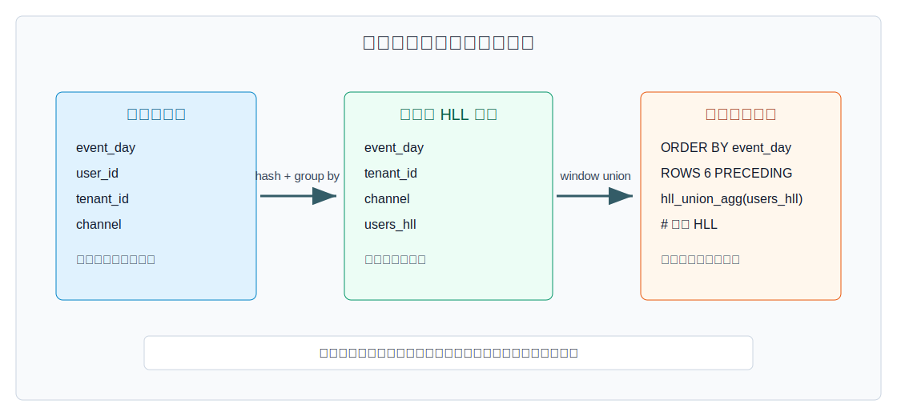
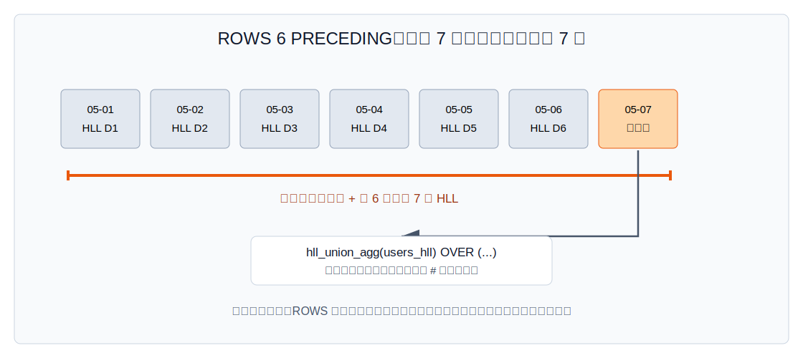
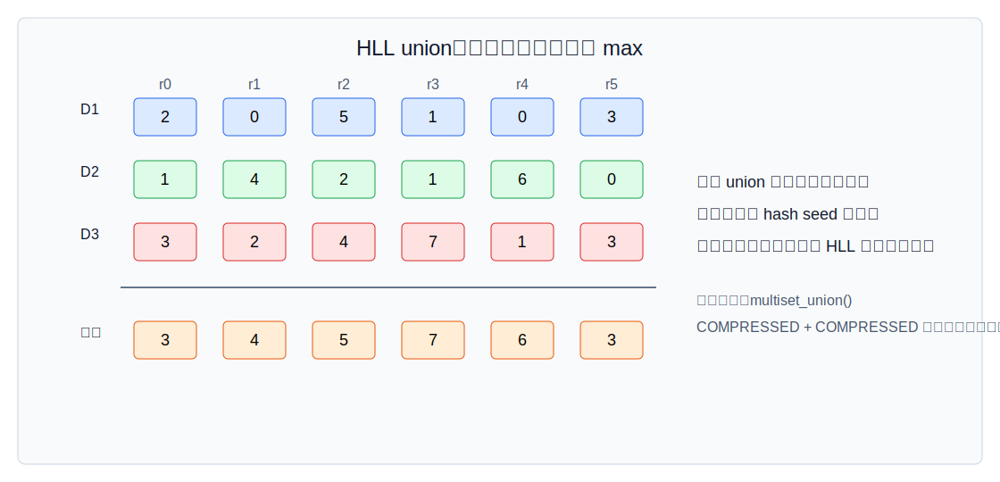
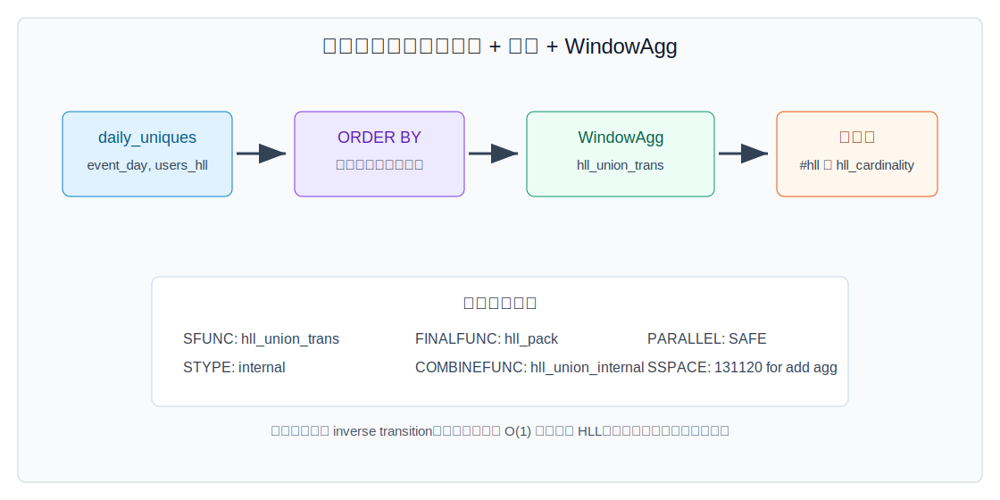
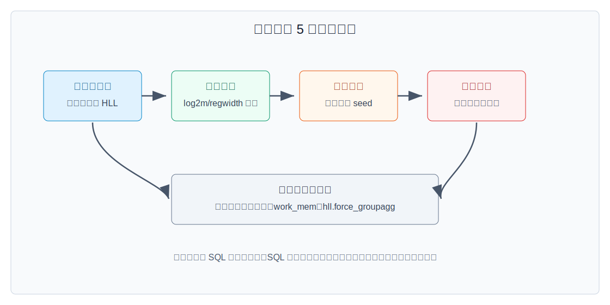

## 数据库筑基课 - 应用实践之 滑动窗口分析

### 作者
digoal

### 日期
2026-05-31

### 标签
PostgreSQL , 应用开发者 , 数据库筑基课 , 滑动窗口 , HyperLogLog , hll , 近似去重    

----

## 背景
  


本文属于“应用实践 + 聚合算子 + 数据类型/操作符”的交叉主题。当前工作区未发现“数据库筑基课”总纲文件，因此本文按用户给定标题独立成篇。

业务看板里最常见的需求之一，是“最近 N 天去重用户数”：

- 最近 7 天活跃用户数。
- 最近 30 天访问过某产品的去重账号数。
- 每天滚动展示过去 14 天的去重设备数。
- 按租户、渠道、活动、地域分别计算滑动 UV。

如果只问某一天，`COUNT(DISTINCT user_id)` 很直观；如果每天都要问“过去 7 天”，问题就变成了一个移动集合的 union。精确计算通常有三种做法：反复扫明细、保存每个窗口的精确结果、保存每天的用户明细集合再合并。它们分别把成本压到查询、存储或离线预计算上。

`postgresql-hll` 提供了另一种工程路径：把每天的用户集合先压成一个 `hll` 摘要，滑动窗口查询时只合并最近 N 天摘要，再对合并后的摘要取 cardinality。它牺牲的是精确性和可逆性，换来低空间、可复用、可组合的去重统计链路。

核心判断是：

> 滑动窗口 HLL 不是把 `COUNT(DISTINCT)` 换成一个更快函数，而是把“窗口内保存成员并精确去重”改成“窗口内合并集合摘要并近似估算”。



图 1 说明：明细事件表先按日、租户、渠道等稳定粒度预聚合成 `hll` 列。滑动窗口查询不再扫描明细事件，而是对窗口帧内的日摘要执行 `hll_union_agg()`，再用 `#` 或 `hll_cardinality()` 取估算值。

## 一、它解决什么问题？

滑动窗口分析的难点不在 SQL 语法，而在“集合成员跨窗口重复出现”。例如用户 A 在 5 月 1 日、5 月 3 日、5 月 7 日都活跃，最近 7 天 UV 只能算一次。窗口每天移动一步，旧日期退出，新日期进入，但用户重复关系跨日期存在。

传统精确做法的代价如下：

| 做法 | 优点 | 主要代价 |
|---|---|---|
| 每个日期重新扫最近 N 天明细并 `COUNT(DISTINCT)` | 口径直观，结果精确 | 明细越大、窗口越宽，重复扫描越重 |
| 预计算每个窗口结果 | 查询极快 | 窗口长度、维度组合一多，预计算爆炸 |
| 每天保存精确用户集合，再在查询时合并 | 可复用，结果精确 | 成员集合大，合并成本随成员数增长 |
| 每天保存 HLL 摘要，再在查询时合并 | 摘要小，可复用，合并便宜 | 结果近似，不能列出成员，不能从摘要中删除成员 |

`postgresql-hll` 适合把这类问题转化为：

1. 明细层：每条事件只负责提供 `user_id`。
2. 日汇总层：`hll_add_agg(hll_hash_*(user_id))` 得到每日集合摘要。
3. 查询层：窗口函数 `hll_union_agg(users_hll) OVER (...)` 合并最近 N 个摘要。
4. 展示层：`#` 操作符返回估算去重数。

它最适合指标看板、增长分析、实验观察、广告触达、活跃用户趋势这类允许可量化误差的场景。不适合计费、审计、风控强拦截、库存扣减等必须精确的场景。

## 二、它是什么？

从 PostgreSQL 视角看，滑动窗口 HLL 分析由三层能力组成。

第一层是 `hll` 类型。`postgresql-hll/REFERENCE.md` 定义 `hll` 为 HyperLogLog 数据结构，`hll_hashval` 为 64 bit 已哈希值。`hll_add()` 和 `hll_add_agg()` 只接受 `hll_hashval`，这是用类型系统提醒开发者：原始值必须先 hash。

第二层是可合并聚合。`hll_add_agg(hll_hashval, [log2m[, regwidth[, expthresh[, sparseon]]]])` 把一批已哈希成员聚成一个 `hll`；`hll_union_agg(hll)` 把一批已有 `hll` 合成一个更大的 `hll`。README 明确给出滑动窗口示例：

```sql
SELECT date, #hll_union_agg(users) OVER seven_days
FROM daily_uniques
WINDOW seven_days AS (ORDER BY date ASC ROWS 6 PRECEDING);
```

第三层是 PostgreSQL 窗口聚合执行。窗口函数并不知道业务上“最近 7 天”的含义，它只按 `OVER` 子句定义的分区、排序和窗口帧执行聚合。因此 `ROWS 6 PRECEDING` 的含义是“当前行和前 6 行”，不是自动补齐的自然 7 天。

几个核心函数和操作符：

| 函数/操作符 | 作用 | 典型位置 |
|---|---|---|
| `hll_hash_integer()`、`hll_hash_text()`、`hll_hash_bigint()` | 把原始 key 转成 `hll_hashval` | 明细到日汇总 |
| `hll_add_agg()` | 从明细 key 聚合生成 HLL | 日汇总 ETL |
| `hll_union_agg()` | 合并多个 HLL | 周、月、滑动窗口查询 |
| `hll_cardinality(hll)` | 返回估算基数 | 展示层 |
| `#hll` | `hll_cardinality()` 的简写 | 展示层 |
| `hll_union(hll, hll)` / `||` | 合并两个 HLL | 手工组合、调试 |

## 三、核心原理

### 3.1 预聚合：把可变长集合压成定长摘要

`postgresql-hll/README.md` 说明，默认 `log2m=11`、`regwidth=5` 时，完整 HLL 需要 `5 * 2^11 = 10240` bit，也就是约 1280 字节。相对误差近似为：

```text
±1.04 / sqrt(2^log2m)
```

默认 `log2m=11` 时，心算误差约为 `±1.04 / sqrt(2048) ≈ ±2.3%`。这不是本文实测值，而是 README 给出的 HLL 参数公式推导结果。实际误差还取决于 hash 质量、数据分布和实现校正路径。

日汇总表可以这样建模：

```sql
CREATE EXTENSION IF NOT EXISTS hll;

CREATE TABLE fact_events (
  event_time timestamptz NOT NULL,
  tenant_id  bigint      NOT NULL,
  channel    text        NOT NULL,
  user_id    bigint      NOT NULL
);

CREATE TABLE daily_uniques (
  event_day  date   NOT NULL,
  tenant_id  bigint NOT NULL,
  channel    text   NOT NULL,
  users_hll  hll    NOT NULL,
  PRIMARY KEY (event_day, tenant_id, channel)
);

INSERT INTO daily_uniques(event_day, tenant_id, channel, users_hll)
SELECT
  event_time::date AS event_day,
  tenant_id,
  channel,
  hll_add_agg(hll_hash_bigint(user_id)) AS users_hll
FROM fact_events
GROUP BY 1, 2, 3;
```

这段 SQL 是最小建模示例，当前环境未连接到已安装 `hll` 扩展的 PostgreSQL 实例，因此未执行。

### 3.2 窗口帧：`ROWS` 是行窗口，不是自然日窗口

滑动 7 日 UV 的直观写法：

```sql
SELECT
  event_day,
  tenant_id,
  channel,
  #hll_union_agg(users_hll) OVER (
    PARTITION BY tenant_id, channel
    ORDER BY event_day
    ROWS BETWEEN 6 PRECEDING AND CURRENT ROW
  ) AS uv_7d
FROM daily_uniques
ORDER BY tenant_id, channel, event_day;
```

这个写法成立有一个隐含条件：每个 `(tenant_id, channel)` 每天都有一行。如果某天没有数据而汇总表缺行，`ROWS 6 PRECEDING` 会拿“前 6 行”，可能覆盖 8 天、10 天甚至更长自然时间。

工程上有两种处理方式：

1. 用日期维表补齐每一天，没有事件的日期填 `hll_empty()`。
2. 使用范围语义重新建模，但要注意 PostgreSQL 的窗口 `RANGE` 对日期间隔和同值排序的语义，不要混淆自然日和排序 peer group。



图 2 说明：`ROWS 6 PRECEDING` 是当前行向前取 6 行。它很适合已经补齐日期的日汇总表；如果汇总表只保存有事件的日期，结果就不一定等于自然 7 天。

补齐日期的一种写法如下：

```sql
WITH dims AS (
  SELECT DISTINCT tenant_id, channel FROM daily_uniques
),
calendar AS (
  SELECT d::date AS event_day
  FROM generate_series(date '2026-05-01', date '2026-05-31', interval '1 day') AS g(d)
),
dense_daily AS (
  SELECT
    c.event_day,
    d.tenant_id,
    d.channel,
    COALESCE(u.users_hll, hll_empty()) AS users_hll
  FROM calendar c
  CROSS JOIN dims d
  LEFT JOIN daily_uniques u
    ON u.event_day = c.event_day
   AND u.tenant_id = d.tenant_id
   AND u.channel = d.channel
)
SELECT
  event_day,
  tenant_id,
  channel,
  #hll_union_agg(users_hll) OVER (
    PARTITION BY tenant_id, channel
    ORDER BY event_day
    ROWS BETWEEN 6 PRECEDING AND CURRENT ROW
  ) AS uv_7d
FROM dense_daily;
```

这段 SQL 也未在当前环境执行。实际生产环境还要把日期范围、维度枚举和空 HLL 参数固定下来。

### 3.3 union：窗口内摘要合并，而不是窗口内成员去重

HLL 能做滑动窗口的原因是 union 可组合。README 的 “On Unions and Intersections” 说明：多个 HLL 的 union 等价于把所有输入重新放入一个 HLL，且 union 后使用同样的 cardinality 误差保证。

源码 `src/hll.c` 的 `multiset_union()` 体现了这个性质：

- `EMPTY` 与任何集合 union，结果是另一个集合。
- `EXPLICIT + EXPLICIT` 走精确列表合并，必要时提升到寄存器表示。
- `EXPLICIT + COMPRESSED` 会把 explicit 元素加入 compressed。
- `COMPRESSED + COMPRESSED` 要求寄存器数组长度一致，然后逐寄存器取较大值。



图 3 说明：窗口 HLL 是多个日 HLL 的寄存器级 union。这个过程不需要知道具体用户是谁，也不能从结果中反推出用户是谁。它要求参与 union 的 HLL 使用兼容参数和一致 hash 口径。

### 3.4 聚合实现：`hll_union_agg` 可以当窗口聚合使用

在 `update/hll--2.14--2.15.sql` 中，`hll_union_agg(hll)` 被定义为：

```sql
CREATE AGGREGATE hll_union_agg (hll) (
       SFUNC = hll_union_trans,
       STYPE = internal,
       FINALFUNC = hll_pack,
       COMBINEFUNC = hll_union_internal,
       SERIALFUNC = hll_serialize,
       DESERIALFUNC = hll_deserialize,
       PARALLEL = SAFE
);
```

这说明它是标准 PostgreSQL 聚合函数，因此可以出现在 `GROUP BY` 聚合里，也可以出现在 `OVER (...)` 窗口聚合里。项目测试 `sql/cumulative_union_comprehensive.sql` 也包含窗口调用：

```sql
SELECT
    recno,
    hll_union_agg(test_rhswkjtc.compressed_multiset) OVER prev30
FROM test_rhswkjtc
WINDOW prev30 AS (ORDER BY recno ASC ROWS 29 PRECEDING);
```

但要注意一个执行层边界：聚合定义里有 transition、final、combine、serialize、deserialize，没有 inverse transition。也就是说，滑动窗口每前进一步，并没有一个“从 HLL 中删除退出窗口那天贡献”的精确逆操作。PostgreSQL 执行窗口聚合时具体如何复用状态取决于版本和执行器实现；从 HLL 抽象本身看，它只支持 add/union，不支持 delete。



图 4 说明：查询通常是扫描日汇总表、按窗口键排序、执行 `WindowAgg`，每行输出前由 `hll_pack` 得到 HLL，再用 `#` 取 cardinality。窗口越宽、分区越多、排序越大，资源消耗越需要验证。

### 3.5 四级表示：小窗口可能精确，大窗口通常近似

`postgresql-hll` 不是一开始就使用完整寄存器数组。README 和 `src/hll.c` 都体现了四级表示：

| 表示 | 源码枚举 | 含义 | 结果性质 |
|---|---:|---|---|
| `EMPTY` | `MST_EMPTY = 0x1` | 空集合 | 精确 |
| `EXPLICIT` | `MST_EXPLICIT = 0x2` | 排序去重的 64 bit hash 列表 | 精确 |
| `SPARSE` | `MST_SPARSE = 0x3` | 打包存储非零寄存器 | 近似 |
| `FULL` / `COMPRESSED` | `MST_COMPRESSED = 0x4` | 完整寄存器数组 | 近似 |

`multiset_add()` 中，空集合先进入 `EXPLICIT`；超过 `expthresh` 或内部容量后，通过 `explicit_to_compressed()` 提升到寄存器表示。`REFERENCE.md` 说明 `expthresh=-1` 表示 auto，`0` 表示跳过 explicit，正值表示指定提升阈值。

对滑动窗口来说，这有一个现实含义：低基数窗口可能仍是精确结果；基数提升后结果转为近似。不要在产品文案里写“精确 UV”，应该写“估算 UV”或在内部指标元数据里标注 `approximate=true`。

## 四、横向对比

| 维度 | HLL 滑动窗口 | 精确窗口 `COUNT(DISTINCT)` | 每窗口预计算精确值 | 外部 OLAP/流计算系统 |
|---|---|---|---|---|
| 主要目标 | 可复用的近似滑窗去重 | 临时精确计算 | 固定口径极速查询 | 高吞吐多维分析 |
| 查询代价 | 合并 N 个摘要，取估算 | 扫描窗口明细并去重 | 查结果表 | 取决于外部引擎 |
| 写入代价 | 需要维护日 HLL 汇总 | 明细写入简单 | 预计算任务重 | 需要同步链路 |
| 空间成本 | 每个粒度一个 HLL | 不额外存摘要 | 窗口数和维度组合越多越大 | 另建存储 |
| 精确性 | 近似，可量化误差 | 精确 | 精确 | 视函数实现而定 |
| 口径灵活性 | 窗口长度灵活，维度依赖预聚合粒度 | 灵活但慢 | 低，需提前定义 | 通常较高 |
| 可解释风险 | 需解释误差和 hash 口径 | 低 | 中 | 跨系统一致性风险 |
| 适合场景 | UV、设备数、触达数、活跃数趋势 | 小表或强精确分析 | 固定大屏指标 | 超大规模复杂分析 |
| 不适合场景 | 计费、审计、必须列明成员 | 大表高频看板 | 口径经常变化 | 不愿维护第二套系统 |

原因很直接：HLL 把集合成员丢掉，只保留可合并摘要。因此它在“合并”和“复用”上强，在“精确”和“可逆”上弱。

## 五、效果如何？

可以从四个维度评估。

第一，空间。默认完整 HLL 约 1280 字节。即使按 `tenant_id + channel + event_day` 保存，空间也主要由维度组合数决定，而不是由当天用户数决定。`EXPLICIT` 和 `SPARSE` 还会在小集合、中等集合时进一步节省存储。

第二，查询。最近 7 天窗口只需要合并 7 个日摘要；最近 30 天窗口只需要合并 30 个日摘要。它避免了窗口内明细行级去重，但没有消除排序、分区和窗口聚合本身的成本。

第三，误差。README 给出的相对误差近似为 `±1.04/sqrt(2^log2m)`。提高 `log2m` 会降低误差，但寄存器数量翻倍，完整表示空间也随之翻倍。`regwidth` 影响最大可估基数和寄存器饱和风险。

第四，复用。相同粒度的日 HLL 可以同时服务 7 日、14 日、30 日、自然周、自然月等 union 型指标。这个复用是 HLL 的核心价值。

但是不要误解为“窗口越大也一定很便宜”。如果有 5000 个租户、100 个渠道、每天跑 365 日、窗口宽度 90 天，窗口聚合仍然会产生大量摘要合并和排序工作。HLL 降低的是成员级去重成本，不是所有 SQL 执行成本。

## 六、实操 DEMO

下面给一个最小可验证流程。当前环境没有启动 PostgreSQL 并安装本地 `postgresql-hll` 扩展，因此仅给出可执行 SQL 形态，不提供伪造输出。

### 6.1 构造明细数据

```sql
CREATE EXTENSION IF NOT EXISTS hll;

DROP TABLE IF EXISTS fact_events;
CREATE TABLE fact_events (
  event_day date   NOT NULL,
  user_id   bigint NOT NULL
);

INSERT INTO fact_events(event_day, user_id)
SELECT d::date, (1000 + (g % 120))::bigint
FROM generate_series(date '2026-05-01', date '2026-05-20', interval '1 day') AS d
CROSS JOIN generate_series(1, 1000) AS g;
```

### 6.2 生成日 HLL

```sql
DROP TABLE IF EXISTS daily_uniques;
CREATE TABLE daily_uniques AS
SELECT
  event_day,
  hll_add_agg(hll_hash_bigint(user_id)) AS users_hll
FROM fact_events
GROUP BY event_day;

ALTER TABLE daily_uniques ADD PRIMARY KEY (event_day);
```

### 6.3 查询 7 行滑动窗口 UV

```sql
SELECT
  event_day,
  #users_hll AS uv_1d_est,
  #hll_union_agg(users_hll) OVER (
    ORDER BY event_day
    ROWS BETWEEN 6 PRECEDING AND CURRENT ROW
  ) AS uv_7row_est
FROM daily_uniques
ORDER BY event_day;
```

### 6.4 与精确结果抽样对照

```sql
WITH hll_result AS (
  SELECT
    event_day,
    #hll_union_agg(users_hll) OVER (
      ORDER BY event_day
      ROWS BETWEEN 6 PRECEDING AND CURRENT ROW
    ) AS uv_7row_est
  FROM daily_uniques
),
exact_result AS (
  SELECT
    d.event_day,
    count(DISTINCT f.user_id) AS uv_7d_exact
  FROM daily_uniques d
  JOIN fact_events f
    ON f.event_day BETWEEN d.event_day - 6 AND d.event_day
  GROUP BY d.event_day
)
SELECT
  e.event_day,
  e.uv_7d_exact,
  h.uv_7row_est,
  (h.uv_7row_est - e.uv_7d_exact) / NULLIF(e.uv_7d_exact, 0) AS relative_error
FROM exact_result e
JOIN hll_result h USING (event_day)
ORDER BY e.event_day;
```

这个对照查询适合在上线前抽样跑。不要只看平均误差，还要看最大偏差、低基数日期、不同租户/渠道的偏差。

## 七、最佳实践

面向数据库架构师：

- 先定义指标是否允许近似。如果指标参与结算、审计、处罚、权限判断，不要用 HLL 作为唯一依据。
- 固定摘要粒度。常见粒度是 `event_day + tenant_id + channel + metric_key`，不要把过多临时筛选条件都做成预聚合维度。
- 固化 HLL 参数。`log2m`、`regwidth`、`expthresh`、`sparseon` 应进入数据模型或 ETL 配置，不要依赖不同连接里的默认值漂移。
- 区分“自然 7 天”和“最近 7 行”。如果业务说自然日，就必须补齐日期。

面向 DBA：

- 给日汇总表建立符合窗口查询的索引，例如 `(tenant_id, channel, event_day)`。
- 定期用精确抽样校验误差，尤其是低基数、小租户、异常流量和版本升级后。
- 关注排序、窗口分区数和 `work_mem`。HLL 降低了去重状态，不代表排序免费。
- 了解 `hll.force_groupagg`。源码注册了 `hll.force_groupagg` GUC，并通过 planner hook 提高 HLL HashAggregate 路径成本，使规划器倾向 GroupAggregate；项目测试 `sql/disable_hashagg.sql` 覆盖了这个开关。

面向业务开发者：

- 所有进入 HLL 的 key 必须用同一类型、同一 seed 的 `hll_hash_*` 函数处理。
- 不要把 `hll_hash_any()` 当默认选择。`REFERENCE.md` 说明它会动态分派，明显慢于类型专用函数，适合输入类型无法提前确定时使用。
- API 返回字段名应体现近似性质，例如 `uv_7d_est`、`approx_unique_users_30d`。
- 不要试图从 HLL 中取回用户列表，也不要试图对 HLL 做精确差集。



图 5 说明：滑动窗口 HLL 的风险大多不是 SQL 写错，而是日期缺行、参数不一致、hash 口径漂移、误差被误用于精确场景、执行计划在高维度下失控。

## 八、适合与不适合场景

适合：

- UV、去重设备数、去重 IP 数、去重广告触达用户数。
- 趋势看板、实验组观测、运营分析、容量估算。
- 已经有离线或准实时汇总链路，可以稳定产生日粒度 HLL。
- 查询经常变换窗口长度，但维度粒度相对稳定。

不适合：

- 金额结算、审计报表、法务证据、处罚规则。
- 需要列出具体用户、回溯成员明细、删除单个成员贡献的场景。
- 窗口条件高度个性化，无法提前确定预聚合粒度。
- hash key 口径频繁变化，或者多系统无法保证同一 seed 和同一序列化方式。
- 交集很小但需要高精度交集结果的场景。README 明确提醒，用 inclusion-exclusion 估算交集时，误差相对小交集可能被放大。

## 九、常见坑

第一，把 `ROWS 6 PRECEDING` 当自然 7 天。只要日期缺行，语义就错。解决方式是补齐日期，或者明确指标定义为“最近 7 个有数据日”。

第二，不固定 hash seed。README 强调，同一个 HLL 的所有输入必须使用一致 seed；如果要 union 两个 HLL，它们的输入也必须使用一致 seed。

第三，不固定 HLL 参数。`hll_union()` 会通过 `check_metadata()` 检查 metadata，不兼容会报错。即使没有马上报错，指标系统也不应允许同一指标不同批次使用不同参数。

第四，用 HLL 做精确差集。README 示例里有 `(#hll_union_agg(users) OVER two_days) - #users AS lost_uniques`，这类写法可以做趋势估算，但不是精确“昨日来过今天没来”的用户数。两个估算值相减会传播误差。

第五，只验证查询速度，不验证误差。上线前至少抽样跑精确对照，记录误差分布，并在指标元数据里写清楚近似性质。

第六，忽视窗口宽度和分区数。HLL 摘要小，但窗口执行仍要排序、维护窗口帧、反复调用聚合函数。高维度宽窗口要看 `EXPLAIN (ANALYZE, BUFFERS)`。

第七，滥用 `hll_set_defaults()`。`REFERENCE.md` 说明默认值可以按连接修改。生产 ETL 更稳妥的做法是在 `hll_add_agg()` 或 `hll_empty()` 中显式传入参数，避免连接级状态影响结果。

## 十、扩展问题

1. 如果要同时支持 7 日、30 日、90 日窗口，应该保存日 HLL，还是再额外保存周 HLL、月 HLL？查询频率、延迟目标和存储成本如何权衡？
2. 如果一个租户每天只有几十个用户，默认 HLL 参数是否过大？是否应该让小租户保持精确计数，还是统一用 HLL 简化模型？
3. 对“最近 24 小时”这类小时级窗口，应按小时预聚合还是按分钟预聚合？窗口宽度和刷新频率如何影响摘要数量？
4. 如果业务要“最近 7 天活跃但今天未活跃”的用户数，HLL 差值估算是否满足误差要求？什么情况下必须回到精确成员表？
5. 在多语言、多系统产生 HLL 的架构里，如何证明 hash 算法、seed、字节序、类型序列化和 HLL 参数完全一致？

## 十一、扩展阅读

- [postgresql-hll README](../postgresql-hll/README.md)：项目动机、四级表示、聚合函数、滑动窗口示例、参数公式、hash 重要性、union/intersection 边界。
- [postgresql-hll REFERENCE](../postgresql-hll/REFERENCE.md)：`hll`、`hll_hashval`、`hll_add_agg()`、`hll_union_agg()`、metadata 和 hash 函数定义。
- [postgresql-hll CLAUDE.md](../postgresql-hll/CLAUDE.md)：本地项目架构摘要、构建命令、promotion hierarchy、typmod 参数。
- [postgresql-hll src/hll.c](../postgresql-hll/src/hll.c)：`multiset_add()`、`multiset_union()`、`multiset_card()`、`hll_union_trans()`、`hll_add_trans*()`、`hll.force_groupagg` 的实现。
- [postgresql-hll sql/cumulative_union_comprehensive.sql](../postgresql-hll/sql/cumulative_union_comprehensive.sql)：包含 `hll_union_agg(...) OVER prev30` 的窗口聚合回归测试。
- [postgresql-hll update/hll--2.14--2.15.sql](../postgresql-hll/update/hll--2.14--2.15.sql)：带 `COMBINEFUNC`、序列化函数和 `PARALLEL SAFE` 的聚合定义。
- DeepWiki `citusdata/postgresql-hll`：用于补充项目架构、聚合函数、参数权衡和限制的理解；关键结论已回到本地 README、REFERENCE、SQL 和源码核对。
  
## 附录 

1、克隆代码  
```  
git clone --depth 1 https://github.com/citusdata/postgresql-hll
```  
  
2、启用 codex, 使用 [数据库筑基课 skill](../skills/README.md).  
```
文章标题: 
  数据库筑基课 - 应用实践之 滑动窗口分析
项目源码(本地目录): 
  postgresql-hll
项目 codebase 文件名: 
  postgresql-hll/CLAUDE.md 
开源项目相关的 deepwiki repoName: 
  citusdata/postgresql-hll
```

  
  
#### [PostgreSQL 解决方案集合](../201706/20170601_02.md "40cff096e9ed7122c512b35d8561d9c8")
  
  
#### [德哥 / digoal's Github - 公益是一辈子的事.](https://github.com/digoal/blog/blob/master/README.md "22709685feb7cab07d30f30387f0a9ae")
  
  
#### [About 德哥](https://github.com/digoal/blog/blob/master/me/readme.md "a37735981e7704886ffd590565582dd0")
  
  

  
