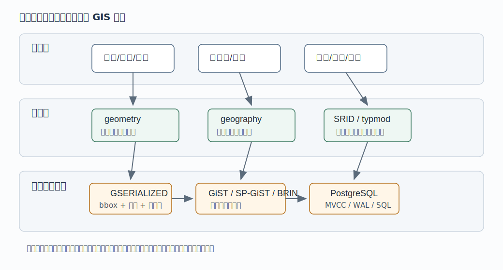
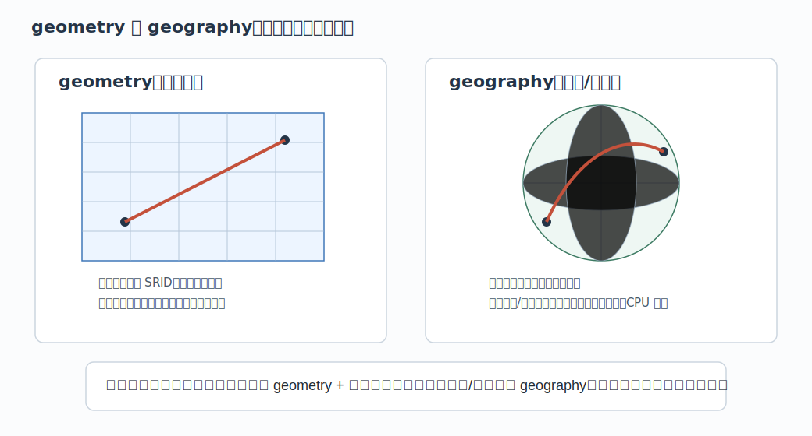
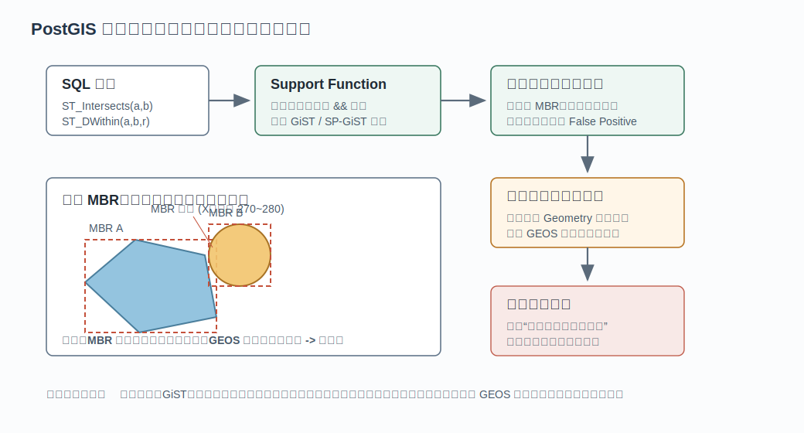
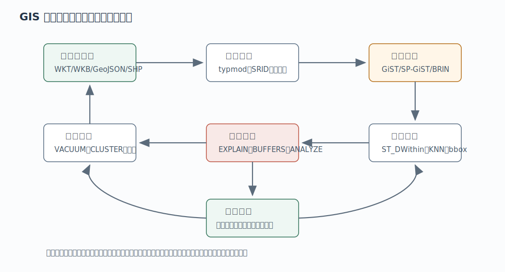

## 数据库筑基课 - 应用实践之 GIS 

### 作者
digoal

### 日期
2026-05-31

### 标签
PostgreSQL , 应用开发者 , 数据库筑基课 , GIS , PostGIS , GiST , SP-GiST , BRIN    

----

## 背景
  


本文属于“应用实践 + 数据类型/操作符 + 索引结构 + 查询执行”的交叉主题。当前工作区未发现“数据库筑基课”总纲文件，因此本文按用户给定标题独立成篇。

很多业务一开始并不会把自己称为 GIS 系统：附近门店、外卖配送范围、车辆轨迹、电子围栏、行政区归属、基站覆盖、航线距离、商圈分析、自然资源边界、城市网格治理，本质上都在问空间问题。最初的做法通常是两个数值列：

```sql
longitude numeric,
latitude  numeric
```

这能存点，但很快会遇到工程问题：经纬度的“度”不是米；不同坐标系不能直接比较；多边形包含、线面相交、最近邻、半径搜索不能靠普通 B-tree 解决；大行政区边界有很多顶点，顺序扫描会把大量 TOAST 数据读出来；应用代码里到处写空间判断，正确性和性能都不可控。

PostGIS 的价值不是让 PostgreSQL “多一个地图插件”，而是把空间数据变成数据库能理解的类型、操作符、索引、统计信息和执行路径。核心心智模型是：

> GIS 入库不是把经纬度塞进两列，而是把“空间对象、坐标系、包围盒、精确几何关系、距离模型、索引候选、业务过滤”放进同一个 SQL 执行体系里。

## 一、它解决什么问题？

PostGIS 解决的是“空间语义落库、空间查询加速、空间数据和业务数据一致管理”的问题。

传统应用层 GIS 做法通常有四类风险：

| 风险 | 典型表现 | 后果 |
|---|---|---|
| 坐标系混乱 | WGS84 经纬度、Web Mercator、地方投影混用 | 距离、面积、包含关系错误 |
| 查询表达弱 | 用 `lon BETWEEN ... AND ...` 粗略过滤 | 只能处理矩形，无法表达真实线面关系 |
| 索引不可用 | 对 `ST_Distance(...) < r` 做全表计算 | 大表半径搜索、空间 JOIN 延迟不可控 |
| 数据链路割裂 | 空间服务和业务库分离 | 双写、一致性、权限、备份恢复复杂 |

PostGIS 把这些问题转化为数据库对象：

```sql
-- 点在多边形内
ST_Contains(region.geom, store.geom)

-- 两个空间对象是否相交
ST_Intersects(road.geom, district.geom)

-- 3 公里内候选，能利用空间索引
ST_DWithin(store.geom, user_location, 3000)

-- 最近邻，能利用 GiST KNN 距离操作符
ORDER BY store.geom <-> user_location
LIMIT 10
```

代价也清楚：空间查询不是魔法。索引多数时候先处理包围盒，精确关系仍要调用几何算法；复杂几何会带来 CPU 和 TOAST 成本；`geometry` 和 `geography` 的距离模型不同；统计信息、数据分布、过滤条件、分区方式都会影响计划。做 GIS 应用，不能只会 `CREATE EXTENSION postgis;`，还要知道哪些查询形态能让优化器走正确路径。



图 1 说明：业务对象先被建模为点、线、面或轨迹；PostGIS 用 `geometry`/`geography`、SRID、typmod、空间函数和索引接住这些语义；最终仍由 PostgreSQL 的 MVCC、WAL、执行器、堆表和 TOAST 机制承载。

## 二、它是什么？

PostGIS 是 PostgreSQL 扩展。根据本地 `postgis/README.postgis` 和 `postgis/CLAUDE.md`，它的主要模块包括：

- `postgis/`：扩展入口、SQL 定义、`geometry`/`geography`、GiST/SP-GiST/BRIN 支持、选择率估算等。
- `liblwgeom/`：核心几何库，处理几何解析、序列化、算法和内部对象。
- `libpgcommon/`：PostGIS 与 PostgreSQL 之间的桥接层，例如 detoast、缓存、SRID/PROJ 转换支持。
- `raster/`：栅格扩展。
- `topology/`：拓扑扩展。
- `loader/`：`shp2pgsql`、`pgsql2shp` 等导入导出工具。
- `doc/`：官方文档源码。

从应用开发视角，最常用的是两类空间类型：

| 类型 | 模型 | 坐标/距离语义 | 优点 | 代价 |
|---|---|---|---|---|
| `geometry` | 平面几何模型 | 单位由 SRID 决定，可能是米、英尺或度 | 函数最丰富，性能通常更好，适合局部投影 | 经纬度直接算距离容易错 |
| `geography` | 球面/椭球面地理模型 | 经纬度输入，距离参数和测量结果以米为主 | 跨大范围距离/面积更符合地球表面 | 函数少一些，CPU 更贵 |

PostGIS 官方文档在 `using_postgis_dataman.xml` 中说明：`geometry` 基于平面，距离、面积、长度按坐标参考系单位计算；`geography` 面向经纬度坐标，测量单位以米为主，适合全球或大陆级范围，但函数覆盖更少、计算更复杂。



图 2 说明：`geometry` 把对象放在投影平面上，最短路径是直线；`geography` 把对象放在地球曲面模型上，最短路径是大圆弧或椭球面路径。经纬度字段如果仍按 `geometry` 直接算欧氏距离，得到的是“度”上的平面距离，不是米。

## 三、核心原理

### 3.1 空间对象：点、线、面、集合与 SRID

PostGIS 实现 OGC Simple Features 模型。空间对象不是只有点，还包括：

- `POINT`：门店、设备、用户位置。
- `LINESTRING` / `MULTILINESTRING`：道路、河流、轨迹。
- `POLYGON` / `MULTIPOLYGON`：行政区、商圈、电子围栏、地块。
- `GEOMETRYCOLLECTION`：混合对象集合。
- Z/M 维度：Z 常用于高程，M 可用于里程或时间等度量。

SRID 是空间参考系标识。它不是注释，而是计算语义的一部分。`geometry(Point, 4326)` 表示 WGS84 经纬度点；`geometry(Point, 3857)` 表示 Web Mercator 平面坐标；地方测绘或工程距离通常应选用合适的米制投影。`postgis/postgis/gserialized_typmod.c` 中的 typmod 逻辑会检查列声明里的类型、SRID、Z/M 维度是否与写入值一致。

建表时应尽量把约束写进类型：

```sql
CREATE TABLE stores (
    id       bigserial PRIMARY KEY,
    name     text NOT NULL,
    geom     geometry(Point, 4326) NOT NULL,
    status   text NOT NULL,
    created_at timestamptz NOT NULL DEFAULT now()
);
```

这比裸 `geometry` 更稳，因为数据库能在写入时拦住错误类型和错误 SRID。

### 3.2 内部表示：GSERIALIZED、LWGEOM 与包围盒

PostGIS 在 PostgreSQL 里存储的是不透明空间类型。应用通过函数访问它，而不是直接拆内部字段。核心路径大致是：

- 输入层解析 WKT/WKB/EWKT/EWKB/GeoJSON 等格式。
- `liblwgeom` 使用 `LWGEOM` 系列结构做内部几何对象处理。
- 存储层序列化为 `GSERIALIZED`，携带类型、SRID、维度标志、坐标数据，复杂对象还可能带缓存包围盒。
- PostgreSQL 调用函数时通过 `PG_GETARG_GSERIALIZED_P` 等宏读取，必要时 detoast。

包围盒是空间数据库性能的核心近似。一个复杂多边形可能有上万个顶点，但它的外接矩形只需要几个数就能判断“有没有可能相交”。PostGIS 文档把 extent / bounding box 描述为空间对象的重要属性；`postgis/postgis/gserialized_gist_2d.c` 中的 GiST 2D 索引以 `BOX2DF` 作为存储 key，并明确把 double 精度 `GBOX` 转成向外扩张的 float box，避免因为精度缩小漏掉候选。

### 3.3 两阶段过滤：索引给候选，精确函数给答案

空间索引通常不能直接回答“两个多边形是否真实相交”。它先回答的是“两个对象的包围盒是否可能相交”。典型流程是：

1. 查询里出现空间操作符或 index-aware 函数。
2. 优化器用 GiST、SP-GiST 或 BRIN 索引筛出包围盒候选。
3. 执行器对候选行调用精确空间函数。
4. 包围盒命中但真实几何不命中的行被剔除。

PostGIS 官方查询文档明确说明，`ST_DWithin` 会在内部使用扩展后的包围盒和 `&&` 逻辑减少候选，然后再计算真实距离。`ST_Intersects`、`ST_Contains`、`ST_Within`、`ST_DWithin` 等是 index-aware 函数；而单独写 `ST_Distance(geom, p) < r` 会对大量行计算距离，不能像 `ST_DWithin` 那样自然利用索引。



图 3 说明：包围盒过滤是便宜的候选筛选，不是最终答案。`ST_Intersects`、`ST_DWithin` 这类函数的工程价值在于把“索引候选 + 精确判断”组合进 SQL 语义。

### 3.4 优化器入口：support function 与选择率估算

PostGIS 不只是提供函数，还和 PostgreSQL 优化器协作。

`postgis/postgis/gserialized_supportfn.c` 中的 `postgis_index_supportfn` 会为一组空间函数添加索引条件。源码里的 `IndexableFunctions` 包括 `st_intersects`、`st_dwithin`、`st_contains`、`st_within`、`st_touches`、`st_3dintersects`、`st_coveredby`、`st_overlaps`、`st_covers`、`st_crosses` 等。对距离类函数，metadata 中有 `expand_arg`，用于构造扩展包围盒搜索。

同一个文件还限制了可增强的索引访问方法：只对 GiST、SP-GiST、BRIN 这类空间搜索索引添加条件，并检查 2D/3D opfamily，避免把 3D 索引条件误加到 2D 函数上。

选择率估算在 `postgis/postgis/gserialized_estimate.c`。文件头说明 `ANALYZE` 会计算 2D 和 ND 直方图，查询常量条件时对与搜索框重叠的直方图格子求和，空间 JOIN 时对两个关系重叠格子的乘积求和。工程含义是：空间列也需要 `ANALYZE`；数据分布变化后不更新统计信息，优化器就可能误判顺序扫描、索引扫描或 JOIN 顺序。

### 3.5 索引方法：GiST、SP-GiST、BRIN 各有边界

PostGIS 在 SQL 定义里注册了多个空间 opclass：

- `gist_geometry_ops_2d`：`geometry` 默认 GiST 2D opclass，支持 `&&`、位置关系、KNN `<->`、包围盒距离 `<#>` 等。
- `gist_geometry_ops_nd`：面向 N 维 `geometry`，支持 `&&&`、`<<->>`、`|=|` 等 ND 操作。
- `gist_geography_ops`：`geography` 的 GiST opclass，支持 `&&` 和 KNN `<->`。
- `spgist_geometry_ops_2d`、`spgist_geometry_ops_3d`、`spgist_geometry_ops_nd`、`spgist_geography_ops_nd`：空间划分型索引选择。
- `brin_geometry_inclusion_ops_*`、`brin_geography_inclusion_ops`：块级包围范围索引，适合天然按空间局部性装载的大表。

一般实践：

```sql
-- 通用选择：geometry 的 GiST
CREATE INDEX stores_geom_gist ON stores USING gist (geom);

-- 点数据且分布适合空间划分时，可测试 SP-GiST
CREATE INDEX stores_geom_spgist ON stores USING spgist (geom);

-- 超大表、数据按空间或时间局部写入、允许块级粗过滤时，可测试 BRIN
CREATE INDEX gps_points_geom_brin ON gps_points USING brin (geom);
```

不要把“有索引”当成性能保证。GiST 适合通用空间关系；SP-GiST 可能在点或较规则空间划分上有优势；BRIN 体积小、维护便宜，但本质是块级粗过滤，数据物理顺序越有空间局部性越有效。

### 3.6 geometry 与 geography 的选择

选择规则可以写得很简单：

- 只在城市、园区、县域、工程坐标等局部范围内做距离/面积/拓扑分析：优先 `geometry`，选择合适的米制投影。
- 数据覆盖全球或跨大陆，并且主要做点到点、点到线、多边形范围内的米制距离/面积：考虑 `geography`。
- 数据以 WGS84 经纬度进来，但业务距离要求米：可以存 `geometry(Point,4326)`，查询时 `ST_Transform` 到合适投影再计算；或直接用 `geography`，接受函数和 CPU 成本边界。
- 不要在 `geometry(Point,4326)` 上把 `ST_DWithin(geom, point, 3000)` 理解为 3000 米。这里的 3000 是 3000 度，语义错误。

`geography` 文档还说明：只支持经纬度类空间参考系；非 geodetic 的米制投影写成 geography 会报错。它的距离参数单位是米，默认使用 spheroid，更快但更粗的路径可以在部分函数中使用 sphere 计算参数。

## 四、横向对比

| 维度 | PostGIS in PostgreSQL | 独立 GIS 服务/引擎 | 应用层经纬度计算 | 专用搜索/地图平台 |
|---|---|---|---|---|
| 主要目标 | 空间数据和业务数据同库、一致查询 | 专门空间处理与服务化 | 简单点位计算 | 地图渲染、POI、路径等专用能力 |
| 查询表达 | SQL + 空间函数 + JOIN | API 或专用查询语言 | 代码函数 | 平台 API |
| 索引能力 | GiST/SP-GiST/BRIN + 优化器 | 取决于引擎 | 基本无 | 平台内置 |
| 事务/MVCC | 原生支持 | 通常需同步 | 依赖业务库 | 平台侧不可控或弱事务 |
| 运维成本 | 沿用 PostgreSQL，但需懂空间统计和索引 | 多系统运维 | 初期低，复杂后高 | 外部依赖和费用 |
| 适合场景 | 空间关系和业务过滤强耦合 | 重 GIS 专业处理 | 小规模简单距离 | 地图消费、路线规划、外部 POI |
| 不适合场景 | 极重地图渲染或复杂路径规划 | 强事务业务查询 | 大规模空间 JOIN | 强内控数据和复杂 SQL JOIN |

这张表的关键不是“PostGIS 替代所有 GIS 系统”。它更适合把空间关系变成业务数据库的一等查询条件：比如“找用户 3 公里内、营业中、库存满足、权限可见的门店”，这类查询天然需要空间索引和关系过滤一起工作。

## 五、效果如何？

PostGIS 的收益和代价要用可观测指标判断。

第一，候选削减。`ST_DWithin`、`ST_Intersects`、`&&`、KNN `<->` 的价值是减少进入精确计算的行数。验证方法是：

```sql
EXPLAIN (ANALYZE, BUFFERS)
SELECT id
FROM stores
WHERE ST_DWithin(
    geom::geography,
    ST_SetSRID(ST_MakePoint(121.47, 31.23), 4326)::geography,
    3000
);
```

观察是否走索引、扫描了多少 heap block、过滤掉多少候选、是否出现大量 recheck。

第二，CPU 成本。`ST_Intersects`、`ST_Contains`、`ST_Buffer`、`ST_Union`、`ST_Transform` 等可能很重。复杂多边形要考虑 `ST_Subdivide`、简化、预计算 bbox、冷热分层或离线物化结果。

第三，I/O 和 TOAST 成本。PostGIS performance tips 提到“小表大几何”场景：表行数很少，但每个 geometry 很大，优化器可能因表页少选择顺序扫描，结果 `&&` 比较仍要读取大量 TOAST 页面。规避方法包括观察 `EXPLAIN ANALYZE`、为 bbox 建单独缓存列、必要时临时影响计划或重构数据。

第四，统计信息。空间选择率依赖 `ANALYZE` 生成的直方图。数据批量导入、重新分区、空间分布变化后，应执行：

```sql
ANALYZE stores;
ANALYZE regions;
```

第五，正确性。性能快但 SRID 错，就是错误答案。所有空间数据入库时至少验证类型、SRID、有效性和业务范围。



图 4 说明：GIS 应用需要从导入、清洗、建模、索引、查询、观测到维护形成闭环。数据分布、业务半径、坐标系或过滤条件变化后，都要重新验证计划和正确性。

## 六、实操 DEMO

以下 SQL 是最小可验证脚本。本文未在本机执行这些 SQL，因为当前任务没有启动 PostgreSQL 实例并安装本地 PostGIS 扩展；语法按 PostGIS 文档和本地 SQL 定义编写。

### 6.1 建表、写入点、建立 GiST 索引

```sql
CREATE EXTENSION IF NOT EXISTS postgis;

DROP TABLE IF EXISTS stores;

CREATE TABLE stores (
    id bigserial PRIMARY KEY,
    name text NOT NULL,
    geom geometry(Point, 4326) NOT NULL,
    status text NOT NULL DEFAULT 'open'
);

INSERT INTO stores (name, geom) VALUES
    ('人民广场店', ST_SetSRID(ST_MakePoint(121.475, 31.233), 4326)),
    ('陆家嘴店',   ST_SetSRID(ST_MakePoint(121.505, 31.245), 4326)),
    ('徐家汇店',   ST_SetSRID(ST_MakePoint(121.438, 31.191), 4326));

CREATE INDEX stores_geom_gist ON stores USING gist (geom);

ANALYZE stores;
```

### 6.2 半径搜索：经纬度数据按米查询

如果使用 `geometry(Point,4326)`，半径单位是度，不适合直接写 3000 米。小规模查询可转 `geography`：

```sql
WITH q AS (
    SELECT ST_SetSRID(ST_MakePoint(121.47, 31.23), 4326)::geography AS geog
)
SELECT s.id, s.name
FROM stores s, q
WHERE ST_DWithin(s.geom::geography, q.geog, 3000)
ORDER BY s.geom::geography <-> q.geog
LIMIT 10;
```

如果是固定城市业务，更常见做法是准备一个米制投影列或函数索引，避免每次全量转换：

```sql
ALTER TABLE stores
ADD COLUMN geom_3857 geometry(Point, 3857)
GENERATED ALWAYS AS (ST_Transform(geom, 3857)) STORED;

CREATE INDEX stores_geom_3857_gist ON stores USING gist (geom_3857);

ANALYZE stores;

WITH q AS (
    SELECT ST_Transform(
        ST_SetSRID(ST_MakePoint(121.47, 31.23), 4326),
        3857
    ) AS geom
)
SELECT s.id, s.name
FROM stores s, q
WHERE ST_DWithin(s.geom_3857, q.geom, 3000)
ORDER BY s.geom_3857 <-> q.geom
LIMIT 10;
```

注意：EPSG:3857 在距离精度上并非所有业务都合适。严肃测量应选更适合区域的投影，或使用 `geography` 的米制计算。

### 6.3 多边形归属查询

```sql
DROP TABLE IF EXISTS districts;

CREATE TABLE districts (
    id bigserial PRIMARY KEY,
    name text NOT NULL,
    geom geometry(MultiPolygon, 4326) NOT NULL,
    CHECK (ST_IsValid(geom))
);

CREATE INDEX districts_geom_gist ON districts USING gist (geom);

-- 查找门店所在行政区
SELECT s.id, s.name, d.name AS district_name
FROM stores s
JOIN districts d
  ON ST_Contains(d.geom, s.geom);
```

如果行政区边界特别复杂，可评估对区域几何做 `ST_Subdivide` 生成子面表，用更小的包围盒提高候选过滤效率，再保留原始区域 ID 做聚合或回表。

### 6.4 查询计划验证

```sql
EXPLAIN (ANALYZE, BUFFERS, VERBOSE)
SELECT s.id, s.name
FROM stores s
WHERE ST_DWithin(
    s.geom_3857,
    ST_Transform(ST_SetSRID(ST_MakePoint(121.47, 31.23), 4326), 3857),
    3000
)
ORDER BY s.geom_3857 <-> ST_Transform(ST_SetSRID(ST_MakePoint(121.47, 31.23), 4326), 3857)
LIMIT 10;
```

验证重点不是某个固定计划名，而是：

- 是否使用空间索引。
- `Rows Removed by Filter` 是否说明包围盒候选很多但精确命中少。
- `Buffers` 是否显示大量 heap/TOAST 读取。
- 常量点是否被重复计算，可用 CTE 或应用参数绑定减少表达式噪声。
- 批量导入后是否执行了 `ANALYZE`。

## 七、最佳实践

### 面向数据库架构师

1. 先定义空间语义，再选类型。局部业务优先 `geometry + 合适投影`；全球经纬度距离优先评估 `geography`。
2. 把类型、维度、SRID 写入列 typmod，例如 `geometry(Point, 4326)`，不要长期使用裸 `geometry`。
3. 空间表要和业务过滤字段一起设计。真实查询通常是“空间条件 + 状态 + 权限 + 时间 + 品类”，必要时用组合策略、分区或物化表。
4. 对超大轨迹点、设备点表，考虑按时间分区，再在每个分区上建空间索引；空间和时间同时裁剪比单一空间索引更稳。
5. 对复杂面数据，保留原始几何，同时准备简化版、切分版或 bbox 辅助列，分别服务展示、候选过滤和精确判断。

### 面向 DBA

1. 批量导入后执行 `ANALYZE`，空间统计信息过期会直接影响计划。
2. 用 `EXPLAIN (ANALYZE, BUFFERS)` 验证，不只看是否有索引。
3. 关注 TOAST。小表大几何可能被误判为顺序扫描便宜，结果读取大量 TOAST 页面。
4. 索引方法要测试。GiST 是默认选择；SP-GiST、BRIN 必须结合数据分布和查询形态验证。
5. 对近只读空间表，可评估 `CLUSTER` 或物理重排提升局部访问，但要注意 GiST 对 NULL 的限制，必要时设置空间列 `NOT NULL`。

### 面向业务开发者

1. 不要用 `ST_Distance(...) < r` 替代 `ST_DWithin(...)` 做半径搜索。
2. 不要把 4326 经纬度下的距离参数当米。
3. 写入前明确坐标顺序。PostGIS 点通常写 `ST_MakePoint(longitude, latitude)`，不是反过来。
4. 需要展示距离时，确认单位和误差边界；需要排序时，确认使用的 `<->` 是你想要的距离模型。
5. 对用户上传的 polygon，先做 `ST_IsValid`，必要时用修复流程进入审核，不要让无效几何直接进入核心查询链路。

## 八、适合与不适合场景

适合：

- 门店、仓库、设备、车辆、用户位置等点位查询。
- 行政区、商圈、围栏、地块等面归属判断。
- 道路、管线、轨迹等线面相交、距离和裁剪。
- 空间关系和业务 SQL 强耦合的场景。
- 需要事务、权限、备份恢复和空间查询同库管理的系统。

不适合或要谨慎：

- 极重地图瓦片渲染和复杂路径规划，把 PostGIS 当专用地图引擎会很吃力。
- 经纬度距离精度要求高，但投影、椭球、误差边界没有定义。
- 频繁对超复杂几何做 `ST_Union`、`ST_Buffer`、`ST_Intersection` 的在线高并发请求。
- 空间数据更新频繁且索引维护成本高，但业务又不能接受延迟或异步物化。
- 只需要外部 POI、路线、导航、地图展示时，专业地图平台可能更合适。

## 九、常见坑

1. **经纬度顺序写反**：`ST_MakePoint(x, y)` 中 x 是经度、y 是纬度。写反后数据可能仍能入库，但空间位置完全错误。
2. **把 4326 的度当米**：`geometry(Point,4326)` 上的距离单位不是米。米制半径要转投影或使用 `geography`。
3. **只建索引，不改查询形态**：`ST_Distance(...) < r` 仍可能全表算距离。半径搜索优先 `ST_DWithin`。
4. **忽略 SRID**：不同 SRID 的对象不能直接比较。需要 `ST_Transform`，不是 `ST_SetSRID`。后者只是标记 SRID，不改变坐标。
5. **无效多边形入库**：自交、多环关系错误会让拓扑谓词结果异常。重要业务表应加 `CHECK (ST_IsValid(geom))` 或审核流程。
6. **复杂边界导致 bbox 过滤弱**：巨大多边形的包围盒覆盖很大，候选很多。可评估 `ST_Subdivide` 或按区域切分。
7. **批量导入后不 ANALYZE**：优化器没有新分布统计，可能选择错误计划。
8. **小表大对象误判**：表行少但 geometry 很大，顺序扫描会触发大量 TOAST 读取。需要用计划和 buffer 证据判断。
9. **在 OLTP 请求里做重型空间构造**：`ST_Buffer`、`ST_Union`、`ST_Intersection` 对复杂对象很重，常需要预计算或异步化。
10. **把 `<->` 当最终精确业务距离**：KNN 排序的语义取决于类型和 opclass。展示和计费距离应单独用明确函数计算。

## 十、扩展问题

1. 如果门店表有 1 亿行，查询条件是“3 公里内 + 营业中 + 指定品类 + 有库存”，你会按空间、时间、城市、品类中的哪个维度分区？为什么？
2. 同样是上海市内 5 公里半径搜索，使用 `geography`、EPSG:3857、地方投影三种方案，误差、性能、开发复杂度分别如何验证？
3. 一个全国行政区面表只有几千行，但每个面很复杂。为什么顺序扫描也可能很慢？bbox 缓存列和 `ST_Subdivide` 分别解决什么问题？
4. 轨迹点每秒写入，历史查询按时间范围和空间窗口过滤。BRIN、GiST、分区、冷热表如何组合？
5. 哪些空间判断可以接受 bbox 近似结果，哪些必须精确拓扑关系？业务风险如何分级？

## 十一、扩展阅读

- PostGIS 本地源码：`postgis/README.postgis`、`postgis/CLAUDE.md`。
- PostGIS 官方文档源码：`postgis/doc/using_postgis_dataman.xml`、`postgis/doc/using_postgis_query.xml`、`postgis/doc/reference_operator.xml`、`postgis/doc/reference_relationship.xml`、`postgis/doc/performance_tips.xml`。
- PostGIS 源码：`postgis/postgis/gserialized_gist_2d.c`、`postgis/postgis/gserialized_gist_nd.c`、`postgis/postgis/gserialized_spgist_2d.c`、`postgis/postgis/brin_2d.c`、`postgis/postgis/gserialized_supportfn.c`、`postgis/postgis/gserialized_estimate.c`、`postgis/postgis/gserialized_typmod.c`。
- PostGIS SQL 定义：`postgis/postgis/postgis.sql.in`、`postgis/postgis/geography.sql.in`、`postgis/postgis/postgis_spgist.sql.in`、`postgis/postgis/postgis_brin.sql.in`、`postgis/postgis/geography_brin.sql.in`。
- DeepWiki：`postgis/postgis` 的 `PostGIS Overview`、`System Architecture`、`Core Data Types` 页面，用于补充组件导航；关键结论已回到本地源码和官方文档核对。
- 官方网站：[https://postgis.net](https://postgis.net)
- OGC Simple Features Access：[https://www.ogc.org/standards/sfa](https://www.ogc.org/standards/sfa)
  
## 附录 

1、克隆代码  
```  
git clone --depth 1 https://github.com/postgis/postgis
```  
  
2、启用 codex, 使用 [数据库筑基课 skill](../skills/README.md).  
```
文章标题: 
  数据库筑基课 - 应用实践之 GIS
项目源码(本地目录): 
  postgis
项目 codebase 文件名: 
  postgis/CLAUDE.md 
开源项目相关的 deepwiki repoName: 
  postgis/postgis
```
  
  
#### [PostgreSQL 解决方案集合](../201706/20170601_02.md "40cff096e9ed7122c512b35d8561d9c8")
  
  
#### [德哥 / digoal's Github - 公益是一辈子的事.](https://github.com/digoal/blog/blob/master/README.md "22709685feb7cab07d30f30387f0a9ae")
  
  
#### [About 德哥](https://github.com/digoal/blog/blob/master/me/readme.md "a37735981e7704886ffd590565582dd0")
  
  

  
