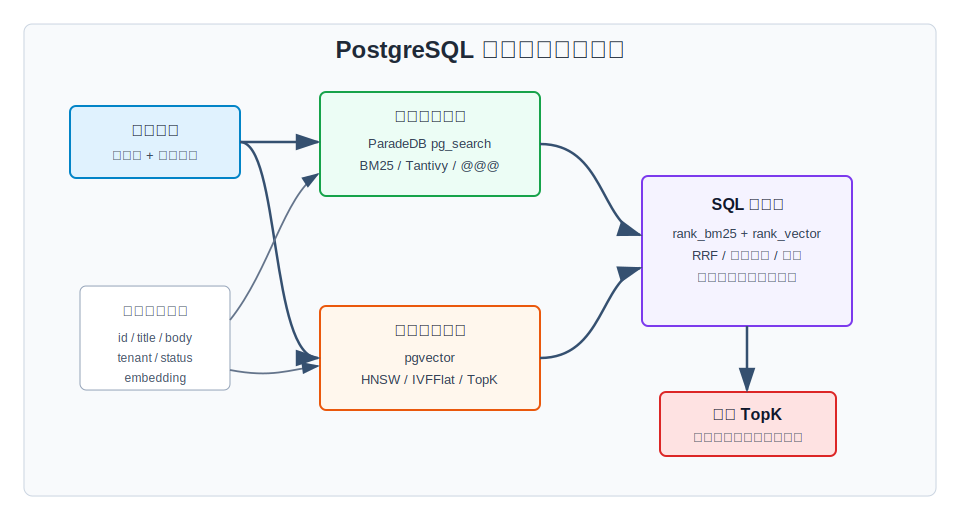
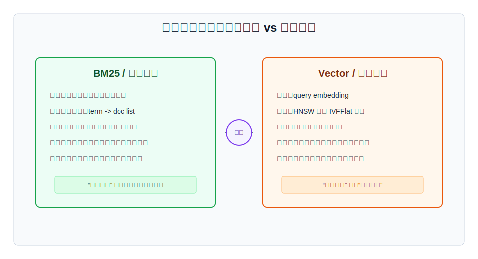
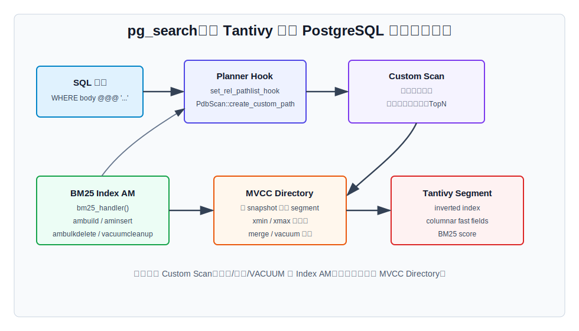
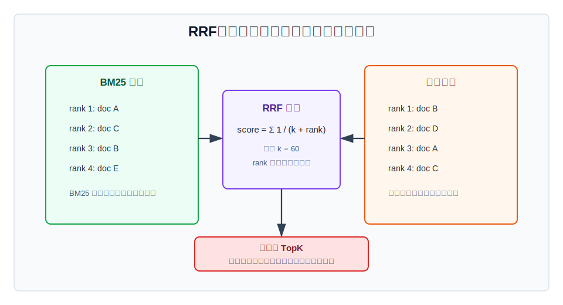
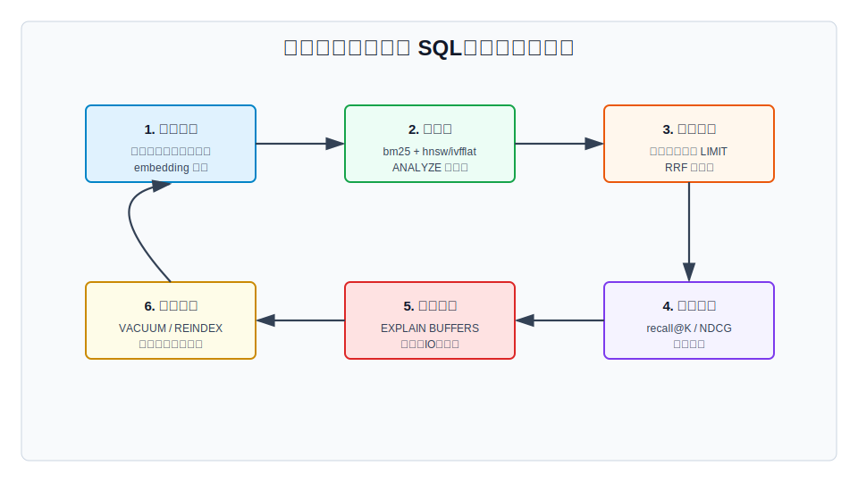

## 数据库筑基课 - 应用实践之 混合搜索

### 作者
digoal

### 日期
2026-05-31

### 标签
PostgreSQL , 应用开发者 , 数据库筑基课 , 混合搜索 , ParadeDB , pg_search , pgvector , BM25 , RRF     

----

## 背景
  


本文属于“应用实践 + 索引结构 + 查询执行”的交叉主题。当前工作区未发现“数据库筑基课”总纲文件，因此本文按用户给定标题独立成篇。

搜索应用最容易掉进两个极端：

- 只做关键词搜索：用户必须刚好输入文档里的词。型号、错误码、专名、字段过滤很稳，但“怎么退款”不一定命中“退货政策”。
- 只做向量搜索：同义表达、自然语言问题更容易召回，但数字、专有名词、版本号、权限过滤、精确排序经常不够可解释。

混合搜索要解决的不是“BM25 和向量谁更强”，而是把两类信号放进同一个数据库事务、同一张业务表、同一套 SQL 过滤和排序体系里：

> 关键词负责精确和可解释，向量负责语义和泛化，融合层负责把两个候选集变成一个稳定、可调、可验证的 TopK。

本文以 ParadeDB 的 `pg_search` 和 `pgvector` 为主线。需要先明确一个版本边界：ParadeDB 当前主线把 `pg_search` 定位为 PostgreSQL 内 BM25/全文检索扩展；混合搜索实践通常是 `pg_search` 负责词法召回，`pgvector` 负责语义召回，再在 SQL 层用 RRF、加权融合或重排模型合并结果。本文不会把它描述成“单个 ParadeDB 索引已经原生完成向量 + BM25 融合”。



图 1 说明：混合搜索的关键是把同一份业务数据同时接到两个召回分支。BM25 分支返回“词法相关”的候选，向量分支返回“语义相近”的候选，SQL 融合层再叠加租户、权限、状态、时间范围和业务排序。

## 一、它解决什么问题？

混合搜索解决的是“用户表达不稳定，但结果必须稳定、可解释、可运维”的问题。

典型业务痛点有五类。

第一，词面不一致。用户输入“无法登录”，文档写的是“认证失败”；用户输入“refund”，文档写的是“退货政策”。纯 BM25 可能漏召回。

第二，精确实体不能丢。用户输入 `PG::UndefinedTable`、`P20240218`、`iPhone 15 Pro Max`，向量模型可能把它们压成相近语义，却不保证精确字符串优先。纯向量搜索容易把“意思像”的结果排在“字面命中”的结果前面。

第三，业务过滤必须一致。搜索不是离线推荐，通常还要过滤租户、权限、上下架状态、时间范围、地区、价格、库存。把搜索放在 PostgreSQL 内，可以把召回结果和关系条件放在同一条 SQL 里组合；代价是数据库要承担更多索引写入、查询 CPU、内存和维护压力。

第四，结果质量要可调。BM25 的字段权重、tokenizer、stop words、snippet；向量的模型版本、距离、HNSW/IVFFlat 参数；融合的 `k`、候选集大小、重排逻辑，都会改变结果。上线后必须能用坏例反推是哪一层出了问题。

第五，架构复杂度要可控。外部搜索引擎 + 向量库当然能做，但同步链路、幂等、删除、事务一致性、权限漂移、备份恢复都会变长。PostgreSQL 内混合搜索的价值，是先用一套数据库工程体系覆盖中小规模和强一致场景。

因此，混合搜索把问题从“选 BM25 还是选向量”转化为：

1. 每个召回分支各自负责什么失败模式？
2. 两个分支各取多少候选？
3. 用排名、归一化分数还是模型重排来融合？
4. 如何用 `EXPLAIN`、召回率评测和慢查询观测验证它真的可控？

## 二、它是什么？

混合搜索不是一种单独索引，而是一种查询架构。它通常由四层组成。

| 层次 | 典型组件 | 解决的问题 | 主要代价 |
|---|---|---|---|
| 业务表 | PostgreSQL 表、主键、租户、权限、状态、文本、embedding | 保持事务、过滤和回表一致 | 表结构和写入链路更复杂 |
| 词法召回 | ParadeDB `pg_search`、BM25、Tantivy、`@@@` | 关键词、短语、字段、可解释相关性 | tokenizer、字段权重、索引维护 |
| 语义召回 | `pgvector`、HNSW、IVFFlat、距离操作符 | 同义表达、改写、自然语言意图 | ANN 召回率、参数、模型版本 |
| 融合排序 | RRF、加权归一化、cross-encoder 重排 | 把不同量纲结果变成最终 TopK | 查询更复杂，需要离线评测 |

几个术语先对齐：

- **BM25**：经典词法相关性算法，核心信号是词频、逆文档频率和字段长度归一化。它擅长“文档里有没有这些词，以及这些词有多重要”。
- **embedding**：模型把文本转成向量。语义接近的文本在向量空间中距离更近。
- **ANN**：Approximate Nearest Neighbor，近似最近邻。HNSW 和 IVFFlat 用召回率换延迟。
- **RRF**：Reciprocal Rank Fusion，倒数排名融合。它不直接相加 BM25 分数和向量距离，而是把每个分支的排名转成 `1 / (k + rank)` 后求和。
- **候选集**：每个分支先返回 TopN，不等于最终结果。候选集太小会漏召回，太大会增加排序和回表成本。



图 2 说明：BM25 和向量检索失败模式不同。BM25 更信词面，向量更信语义。混合搜索的价值就在于用两个不完全相关的信号互相补洞，而不是把其中一个包装成万能搜索。

## 三、核心原理

### 3.1 ParadeDB `pg_search`：把 Tantivy 接进 PostgreSQL

ParadeDB 的 `pg_search` 是 PostgreSQL 扩展，核心目标是在 PostgreSQL 内提供 BM25 全文搜索。DeepWiki 对 `paradedb/paradedb` 的架构梳理显示，`pg_search` 大致分成四层：

1. PostgreSQL 核心层：提供 buffer manager、index access method API、custom scan infrastructure。
2. 扩展层：初始化 hook，注册 `bm25_handler()`，在出现 ParadeDB 搜索谓词时创建 custom path。
3. 存储管理层：管理 metapage、buffer、linked list、segment 等索引存储结构。
4. 搜索引擎层：通过 Tantivy 执行倒排检索、BM25 打分和列式 fast field 访问。

DeepWiki 还指出，`pg_search` 的 BM25 索引通过 PostgreSQL index access method 接口实现，包含 `ambuild_handler()`、`aminsert_handler()`、`ambulkdelete_handler()`、`amvacuumcleanup_handler()` 等回调；查询侧通过 `set_rel_pathlist_hook` 和 `PdbScan::create_custom_path()` 生成 `CustomPath`，把可下推的搜索谓词、投影、TopN、聚合等交给索引执行。

这里的关键不是函数名，而是职责边界：

- 写入路径走 Index AM：建索引、插入、删除、VACUUM、空间回收。
- 读取路径走 Custom Scan：识别 `@@@` 等搜索谓词，估算成本，执行 BM25 检索。
- 事务可见性由 MVCC 目录承担：Tantivy segment 不是脱离 PostgreSQL 快照任意可见，而要按 `xmin`、`xmax` 和当前 snapshot 过滤。



图 3 说明：`pg_search` 的工程本质是“让 PostgreSQL 规划器看得见搜索索引，让 Tantivy 看得懂 PostgreSQL 的事务边界”。读写路径不同，排障方法也不同：查询慢看 Custom Scan 和候选规模；写入、删除、膨胀看 Index AM、segment、VACUUM 和 merge。

### 3.2 `pgvector`：把语义最近邻放进 SQL TopK

`pgvector` 在 PostgreSQL 内注册向量类型、距离操作符和索引访问方法。它支持精确最近邻，也支持 HNSW 和 IVFFlat 近似索引。

典型 SQL 形态是：

```sql
SELECT id, title
FROM docs
ORDER BY embedding <=> '[0.1,0.2,0.3]'::vector
LIMIT 20;
```

这里 `<=>` 是 cosine distance，越小越近。`pgvector` README 明确提醒：想用索引，应把距离操作符放在 `ORDER BY` 中并配合 `LIMIT`。如果只写距离过滤，或者把相似度改写成 `1 - distance DESC`，优化器未必能按 ANN 索引入口处理。

HNSW 和 IVFFlat 的边界也要记住：

- HNSW 用多层图换低延迟和较高召回，主要参数是 `m`、`ef_construction`、`hnsw.ef_search`。
- IVFFlat 先聚类分桶，查询时扫描最近的若干 list，主要参数是 `lists`、`ivfflat.probes`。
- ANN 过滤通常发生在索引返回候选之后。`pgvector` README 说明，如果过滤条件只匹配 10% 行，默认 `hnsw.ef_search = 40` 时平均可能只有约 4 行满足过滤；可以提高 `hnsw.ef_search`，或使用 0.8.0 起的 iterative index scans。

这对混合搜索很重要：如果向量分支先拿 Top20，再过滤租户和状态，可能最后只剩 2 条；如果先用普通 B-tree 或分区缩小范围，再做向量 TopK，又可能无法使用全局 ANN 最优路径。工程上需要按业务过滤选择分区、部分索引、候选集大小和迭代扫描策略。

### 3.3 为什么不能直接相加 BM25 分数和向量分数？

BM25 分数和向量距离不是同一量纲：

- BM25 通常越大越相关，数值受词频、文档长度、字段、语料分布影响。
- 向量距离通常越小越相近，数值受模型、归一化、距离函数、维度影响。
- 同一个 query 下两者可排序，不代表跨 query 可比。

直接写：

```sql
ORDER BY bm25_score + cosine_similarity DESC
```

看起来简单，但很容易让某个分支的数值尺度吞掉另一个分支。除非你有离线标注集、归一化策略和持续评测，否则更稳的起点是 RRF。

RRF 的思路是：不要相信原始分数的尺度，只相信每个分支内部的排名。

```text
rrf_score(doc) = sum(1.0 / (k + rank_i(doc)))
```

常见 `k = 60`。`k` 越大，头部排名优势越平滑；`k` 越小，rank 1、rank 2 的差距越大。



图 4 说明：RRF 适合做第一版混合搜索，因为它绕开了“BM25 分数和向量距离如何归一化”的难题。它的代价是只使用排名，不使用原始分数间距；如果你需要更精细的业务排序，后面可以叠加学习排序或 cross-encoder 重排。

### 3.4 SQL 执行形态：两个 TopN 候选集先收窄，再融合

混合搜索最常见的执行形态是：

1. BM25 分支按关键词取 TopN。
2. 向量分支按距离取 TopN。
3. 用主键合并两个候选集。
4. 计算 RRF 或业务融合分。
5. 回表补字段、应用最终过滤和排序。

注意“过滤放哪里”要非常谨慎：

- 租户、权限、软删除、状态这种强约束，原则上应尽早进入两个分支，避免召回了无权结果再丢弃。
- 价格、时间、品类这种会显著改变候选分布的过滤，要用真实数据测试：放在分支内可能影响索引路径，放在融合后可能候选不足。
- 分页不要直接对两个分支各自 offset 很深再融合。深分页会放大两个索引的读取成本，通常应使用游标、搜索会话缓存或扩大候选后做稳定排序。

### 3.5 写入路径：每次内容更新至少影响两个索引

混合搜索的写入成本容易被忽略。一次文档更新可能包含：

- 文本字段更新：BM25 索引要更新倒排结构和字段统计。
- embedding 更新：HNSW 图或 IVFFlat list 要更新。
- 权限或状态更新：如果索引、分区或部分索引依赖这些字段，也会影响检索路径。
- 删除：两个索引都要处理死元组、segment 可见性、VACUUM 或 merge。

所以混合搜索适合读多写少或中等写入的在线检索场景。如果内容高频更新、embedding 异步生成、权限变化频繁，就要设计版本字段、后台补偿、重嵌入队列、索引重建窗口和质量回归测试。

## 四、横向对比

| 维度 | PostgreSQL 原生全文 + pgvector | ParadeDB pg_search + pgvector | 外部搜索引擎 + 向量库 | 只用向量搜索 |
|---|---|---|---|---|
| 主要目标 | 低依赖、原生能力组合 | PostgreSQL 内更强 BM25/全文检索 + 语义召回 | 大规模搜索平台能力 | 快速语义召回 |
| 词法能力 | `tsvector`、`tsquery`、GIN/GiST | BM25、Tantivy、字段化搜索、Custom Scan | 最强，依赖具体引擎 | 弱 |
| 语义能力 | `pgvector` | `pgvector` | 专用向量库或引擎插件 | 强 |
| 事务一致性 | 强 | 强，但扩展索引维护更复杂 | 弱到中，通常靠同步链路 | 强，如果也在 PostgreSQL 内 |
| 查询组合 | SQL 内组合 | SQL 内组合 | 应用层或联邦查询 | SQL 内组合 |
| 写入代价 | 中 | 中到高 | 高，双写和同步 | 中 |
| 运维复杂度 | 中 | 中到高 | 高 | 低到中 |
| 适合场景 | 轻中量搜索、强一致 | 中等规模、希望 BM25 更强且留在 PostgreSQL | 超大规模、专门搜索团队 | FAQ、相似推荐、弱实体约束 |
| 不适合场景 | 复杂搜索产品 | 极高写入、极大语料、分布式检索 | 小团队强一致低复杂度场景 | 专名、数字、错误码要求高的搜索 |

这张表的核心不是谁替代谁，而是复杂度放在哪里。ParadeDB + pgvector 的优势是把搜索、向量、过滤、事务和 SQL 组合放回 PostgreSQL；代价是数据库节点要承担搜索引擎和 ANN 索引的资源消耗。

## 五、效果如何？

混合搜索的效果不能只看“点一下是不是有结果”，至少要看四类指标。

第一，召回质量。

- `recall@K`：相对人工标注或精确基准，TopK 覆盖多少相关结果。
- `NDCG@K`：越相关的结果是否越靠前。
- 坏例归因：是关键词没切对、字段权重错、embedding 模型差、候选集太小，还是融合参数错。

第二，延迟和 IO。

用：

```sql
EXPLAIN (ANALYZE, BUFFERS)
...
```

重点看两个分支是否都被限制在合理 TopN，是否出现大范围回表、排序 spill、Bitmap Heap Scan 过宽、向量分支过滤后候选不足。

第三，写入和维护。

BM25 倒排索引、Tantivy segment、HNSW 图、IVFFlat list 都不是零成本结构。要观察：

- 文档写入 P95/P99。
- 索引大小增长。
- VACUUM、REINDEX、segment merge 的耗时。
- embedding 重算期间旧版本和新版本如何切换。

第四，业务可解释性。

不要只返回最终分数。生产排障时建议保留：

- 是否来自 BM25 分支。
- 是否来自向量分支。
- BM25 rank、vector rank、RRF 分。
- 命中的字段、snippet 或 highlight。
- embedding 模型版本。

这些信息能让运营、客服、研发一起判断“为什么这个结果排在前面”。

## 六、实操 DEMO

以下 SQL 是最小可验证模板。本文未在本机执行这些 SQL，因为当前工作区未提供可用的 ParadeDB/PostgreSQL 实例，且本地也没有用户指定的 `paradedb` 源码目录；语法按 ParadeDB 文档/DeepWiki 架构说明、`pgvector` README 和 PostgreSQL SQL 习惯编写。实际使用时请以安装版本的 ParadeDB 文档为准校正 `CREATE INDEX USING bm25` 的字段参数。

### 6.1 建表与扩展

```sql
CREATE EXTENSION IF NOT EXISTS pg_search;
CREATE EXTENSION IF NOT EXISTS vector;

DROP TABLE IF EXISTS docs;

CREATE TABLE docs (
    id bigserial PRIMARY KEY,
    tenant_id int NOT NULL,
    status text NOT NULL DEFAULT 'active',
    title text NOT NULL,
    body text NOT NULL,
    embedding vector(3) NOT NULL,
    updated_at timestamptz NOT NULL DEFAULT now()
);

INSERT INTO docs (tenant_id, status, title, body, embedding) VALUES
    (1, 'active', '退货政策', '用户收到商品后可以按规则申请退款和退货。', '[0.10,0.20,0.30]'),
    (1, 'active', '登录失败排查', '认证失败通常来自密码错误、账号锁定或令牌过期。', '[0.20,0.10,0.35]'),
    (1, 'active', 'PostgreSQL 错误码', 'PG::UndefinedTable 表示查询访问了不存在的关系。', '[0.80,0.10,0.10]'),
    (2, 'active', '内部库存说明', '库存同步和上下架状态由后台任务维护。', '[0.12,0.22,0.31]');
```

### 6.2 建 BM25 和向量索引

ParadeDB 文档中的 `bm25` 索引语法会随版本演进。常见形态是为主键和文本字段建立 BM25 索引。请按当前安装版本确认 `key_field`、`text_fields` 或等价参数名称。

```sql
-- 示例：以当前 ParadeDB 版本文档为准校正参数名
CREATE INDEX docs_bm25_idx
ON docs
USING bm25 (id, title, body)
WITH (
    key_field = 'id',
    text_fields = '{"title": {}, "body": {}}'
);

CREATE INDEX docs_embedding_hnsw_idx
ON docs
USING hnsw (embedding vector_cosine_ops);

ANALYZE docs;
```

### 6.3 单独验证两个分支

```sql
-- 词法分支：字段和操作符按 ParadeDB 当前版本校正
EXPLAIN (ANALYZE, BUFFERS)
SELECT id, title, paradedb.score(id) AS bm25_score
FROM docs
WHERE tenant_id = 1
  AND status = 'active'
  AND (title @@@ '退款' OR body @@@ '退款')
ORDER BY bm25_score DESC
LIMIT 20;

-- 向量分支：query embedding 通常由应用侧模型生成
EXPLAIN (ANALYZE, BUFFERS)
SELECT id, title, embedding <=> '[0.11,0.19,0.29]'::vector AS distance
FROM docs
WHERE tenant_id = 1
  AND status = 'active'
ORDER BY embedding <=> '[0.11,0.19,0.29]'::vector
LIMIT 20;
```

### 6.4 RRF 融合模板

```sql
WITH
lexical AS MATERIALIZED (
    SELECT
        id,
        row_number() OVER (ORDER BY paradedb.score(id) DESC) AS rank_lexical
    FROM docs
    WHERE tenant_id = 1
      AND status = 'active'
      AND (title @@@ '退款' OR body @@@ '退款')
    ORDER BY paradedb.score(id) DESC
    LIMIT 50
),
semantic AS MATERIALIZED (
    SELECT
        id,
        row_number() OVER (ORDER BY embedding <=> '[0.11,0.19,0.29]'::vector) AS rank_semantic
    FROM docs
    WHERE tenant_id = 1
      AND status = 'active'
    ORDER BY embedding <=> '[0.11,0.19,0.29]'::vector
    LIMIT 50
),
fused AS (
    SELECT
        COALESCE(l.id, s.id) AS id,
        l.rank_lexical,
        s.rank_semantic,
        COALESCE(1.0 / (60 + l.rank_lexical), 0.0) +
        COALESCE(1.0 / (60 + s.rank_semantic), 0.0) AS rrf_score
    FROM lexical l
    FULL OUTER JOIN semantic s USING (id)
)
SELECT d.id, d.title, f.rank_lexical, f.rank_semantic, f.rrf_score
FROM fused f
JOIN docs d USING (id)
ORDER BY f.rrf_score DESC, d.id
LIMIT 10;
```

这个模板有三个有意为之的设计：

- 两个分支都先 `LIMIT 50`，避免把融合层变成全表排序。
- RRF 只依赖 rank，不依赖 BM25 分数和向量距离的尺度。
- `tenant_id`、`status` 这种强过滤放进两个分支，避免无权结果进入候选池。

生产上需要用真实标注集调候选集大小、`k` 值、字段权重和向量模型，不要把上面的 `50`、`60` 当成固定真理。

## 七、最佳实践

### 面向数据库架构师

把混合搜索拆成“召回、融合、重排、展示、评测”五个层次。第一版可以只做 BM25 TopN + 向量 TopN + RRF；当坏例积累到足够多，再引入字段权重、同义词、业务权重、cross-encoder 或学习排序。

优先保证主键、租户、权限、状态的建模清楚。混合搜索最怕“搜索结果看似相关，但用户不该看到”。强约束字段要么放进每个召回分支，要么通过分区、部分索引或安全策略保证不会漏控。

设计 embedding 版本字段。模型升级不是普通参数变更，而是索引语义变更。建议至少保留 `embedding_model`、`embedding_version`、`embedded_at`，并设计双写、回填、灰度和回滚路径。

### 面向 DBA

上线前必须拿真实数据跑：

```sql
EXPLAIN (ANALYZE, BUFFERS)
```

分别观察 BM25 分支、向量分支和融合 SQL。不要只看总耗时，要看两个分支候选数、heap block、排序、并行、内存和过滤后剩余行数。

为写入和维护留预算。BM25 索引和 HNSW/IVFFlat 都会增加写入放大。批量导入时通常先导表、生成 embedding、再建索引更可控；高频更新表要评估 REINDEX、VACUUM、segment merge 和备份恢复窗口。

把慢查询样本和搜索质量样本一起留存。数据库只能告诉你“慢在哪里”，不能告诉你“结果是否好”。混合搜索的 DBA 监控要和应用侧搜索日志打通。

### 面向业务开发者

不要把用户输入直接拼成复杂查询。要区分：

- 原始 query text：给 BM25 分支。
- 改写后的 query text：可选，用于扩展召回。
- query embedding：给向量分支。
- 过滤条件：租户、权限、状态、品类、时间。

接口返回时建议带上调试字段，至少在内部环境返回 `rank_lexical`、`rank_semantic`、`rrf_score`、命中字段和模型版本。没有这些字段，坏例只能靠猜。

分页要谨慎。混合搜索的结果来自两个 TopN 候选集，不适合无限深翻页。多数搜索产品应限制最大页数，或使用搜索会话缓存、游标和稳定排序键。



图 5 说明：混合搜索上线后，质量和性能是一个闭环。建完索引只是第二步，后面还要持续评测、观测、维护和演进。

## 八、适合与不适合场景

适合场景：

- 文档、商品、FAQ、工单、知识库、代码片段搜索，既有关键词又有自然语言问题。
- 数据规模在单个 PostgreSQL 集群可承受范围内，且强依赖事务、权限、租户过滤。
- 团队希望先减少外部搜索系统复杂度，用 SQL 快速迭代搜索质量。
- 结果需要可解释：既要知道语义相似，也要看到命中的词、字段和片段。

不适合场景：

- 超大规模互联网搜索，需要复杂分布式索引、爬虫、广告、在线学习排序和多机召回。
- 写入极高频、文档持续更新、embedding 持续变化，数据库节点无法承受双索引写放大。
- 搜索质量主要靠多阶段深度模型重排，数据库只适合作为候选源或结果存储。
- 只需要精确编号查询、前缀补全或简单后台筛选，混合搜索会过度设计。

## 九、常见坑

第一，把混合搜索误解成“分数相加”。BM25 分数和向量距离量纲不同，直接相加通常不可控。先用 RRF，等有标注集再做归一化或学习排序。

第二，候选集太小。两个分支各取 Top10 再融合，看似快，但相关结果可能在某个分支 rank 30。上线前要用 recall@K 找到合理候选大小。

第三，过滤后结果不足。ANN 分支如果先按全表取 TopK，再过滤租户或状态，可能剩不下几条。`pgvector` 对过滤后候选不足已有明确提示，要用更大的 `ef_search`、iterative scan、部分索引、分区或更大的候选集验证。

第四，只关注查询，不关注写入。文本和 embedding 同时更新会触发两个索引维护。批量导入、重嵌入、删除和 VACUUM 都要压测。

第五，模型升级没有版本。embedding 模型一换，向量空间就变了。旧向量和新向量混在一个索引里，搜索质量会变得不可解释。

第六，没有坏例闭环。搜索不是一次性功能。必须记录 query、过滤条件、候选、排名、点击、人工标注和失败原因，否则参数调整只能靠感觉。

第七，没有明确一致性边界。如果 embedding 异步生成，用户刚写入的文档可能能被 BM25 搜到，但向量分支搜不到。这个延迟要在产品语义里说明，或用状态字段控制可搜索范围。

## 十、扩展问题

1. 如果 query 同时包含错误码和自然语言描述，应该提高 BM25 权重，还是让错误码走单独精确过滤？
2. 当一个租户只有 1 万文档，另一个租户有 1 亿文档，应该用同一套索引、分区，还是独立实例？
3. RRF 的 `k` 和两个候选集的 TopN 如何通过标注集选择，而不是拍脑袋？
4. embedding 模型升级时，如何设计双版本索引、灰度流量和回滚？
5. 如果线上坏例显示“语义正确但业务不该推荐”，这是召回问题、融合问题，还是业务规则问题？

## 十一、扩展阅读

- ParadeDB 官方文档：`https://docs.paradedb.com/`
- ParadeDB GitHub 仓库：`https://github.com/paradedb/paradedb`
- DeepWiki：`paradedb/paradedb`，重点页面包括 Overview、System Architecture、Extension Architecture、Query System、Storage and Concurrency。
- pgvector README：`/Users/digoal/new/pgvector/README.md`，重点章节包括 Querying、Indexing、Filtering、Hybrid Search、Iterative Index Scans。
- pgvector SQL 定义：`/Users/digoal/new/pgvector/sql/vector.sql`，可查看距离操作符、HNSW/IVFFlat access method 和 opclass。
- PostgreSQL 官方文档：Full Text Search、Index Access Method、Custom Scan、EXPLAIN、VACUUM、Partitioning。
- Cormack, Clarke, Buettcher: Reciprocal Rank Fusion outperforms Condorcet and individual Rank Learning Methods, 2009。
  
## 附录 

1、克隆代码  
```  
git clone --depth 1 https://github.com/paradedb/paradedb
```  
  
2、启用 codex, 使用 [数据库筑基课 skill](../skills/README.md).  
```
文章标题: 
  数据库筑基课 - 应用实践之 混合搜索
项目源码(本地目录): 
  paradedb
项目 codebase 文件名: 
  paradedb/CLAUDE.md 
开源项目相关的 deepwiki repoName: 
  paradedb/paradedb
```
  
  
#### [PostgreSQL 解决方案集合](../201706/20170601_02.md "40cff096e9ed7122c512b35d8561d9c8")
  
  
#### [德哥 / digoal's Github - 公益是一辈子的事.](https://github.com/digoal/blog/blob/master/README.md "22709685feb7cab07d30f30387f0a9ae")
  
  
#### [About 德哥](https://github.com/digoal/blog/blob/master/me/readme.md "a37735981e7704886ffd590565582dd0")
  
  

  
