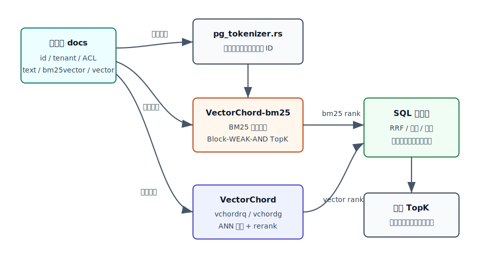
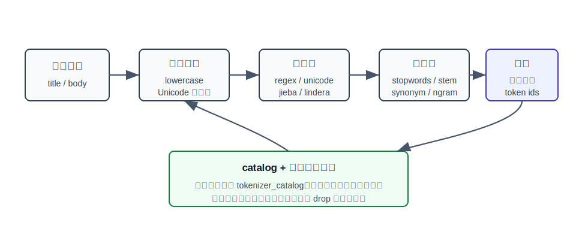
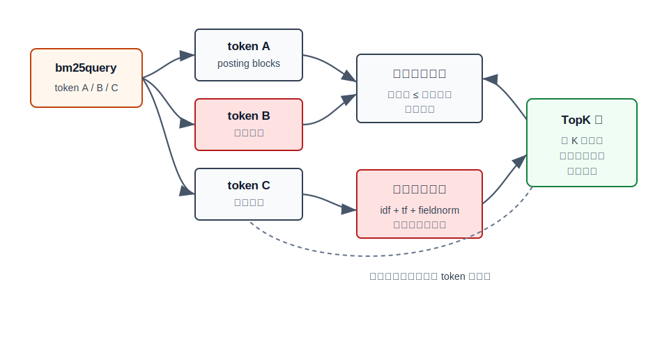
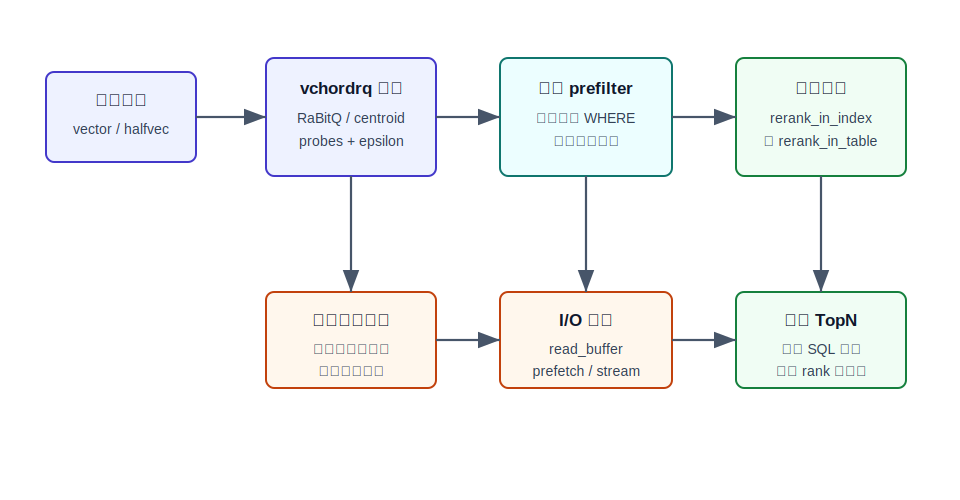
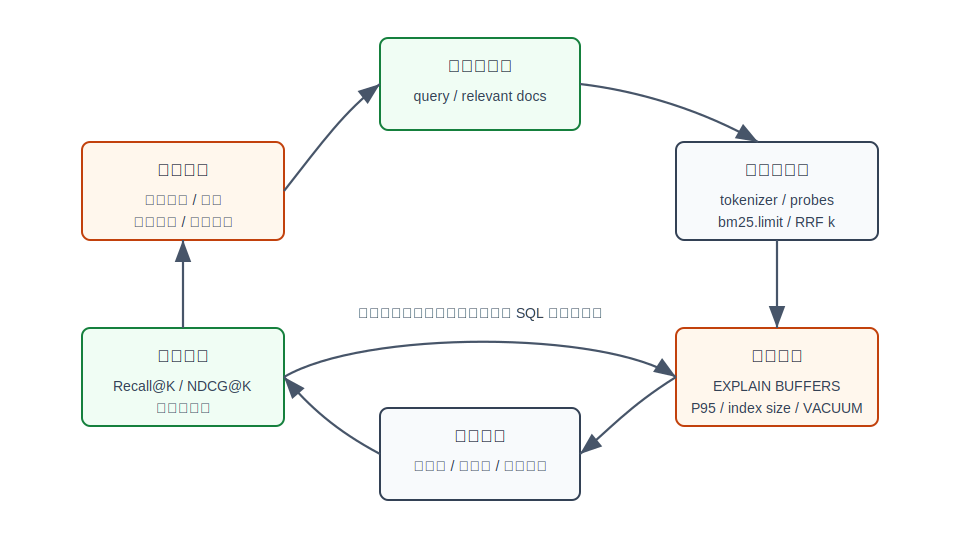

## 数据库筑基课 - 应用实践之 再谈混合搜索

### 作者
digoal

### 日期
2026-05-31

### 标签
PostgreSQL , 应用开发者 , 数据库筑基课 , 混合搜索 , VectorChord , VectorChord-bm25 , pg_tokenizer , BM25 , 向量检索    

----

## 背景
  


本文属于“应用实践 + 索引结构 + 查询执行 + 数据类型/操作符”的交叉主题。当前工作区未发现“数据库筑基课”总纲文件，因此本文按用户给定标题独立成篇。

前一篇《[数据库筑基课 - 应用实践之 混合搜索](20260531_28.md)》讲的是通用混合搜索：BM25 负责词法召回，向量负责语义召回，SQL 层用 RRF 或重排把两个候选集合并。那篇文章更像“方法论总图”。

这篇“再谈混合搜索”换一个角度：如果把搜索体系尽量留在 PostgreSQL 内，用 TensorChord 的三个开源项目组合，架构会长什么样？

- `pg_tokenizer.rs`：把原始文本变成稳定的 token id 数组。
- `VectorChord-bm25`：把 token id 数组或 `tsvector` 做成 BM25 排名索引，当前源码实现了 Block-WEAK-AND TopK 检索。
- `VectorChord`：提供 `vchordrq` 和 `vchordg` 向量索引，支持近似召回、低比特量化、过滤、重排和多种 I/O 策略。

这套组合的关键价值不是“又多了三个扩展”，而是把一件搜索系统必须面对的三类问题拆开：

1. 文本怎么切，词表怎么稳定，中文/英文/专业词怎么处理？
2. 关键词结果怎么按相关性排序，而不是只判断有没有命中？
3. 语义相似结果怎么低成本召回，并在业务过滤后仍有足够候选？



图 1 说明：`pg_tokenizer.rs` 解决文本表示，`VectorChord-bm25` 解决词法相关性，`VectorChord` 解决向量相似度。最终结果仍然在 SQL 层合并，这意味着租户、权限、状态、时间范围、回表字段和事务可见性都可以继续按数据库方式处理。

## 一、它解决什么问题？

混合搜索解决的是“用户表达不稳定，但业务结果必须稳定”的问题。

只用关键词搜索，最怕词面不一致。用户说“登录不了”，文档写“认证失败”；用户说“退钱”，文档写“退款政策”。BM25 能解释为什么命中，但不能天然理解同义表达。

只用向量搜索，最怕精确实体被稀释。错误码、SKU、型号、函数名、数据库参数、版本号、专有名词，往往需要字面命中优先。向量距离能找到“意思像”的内容，但不保证 `vchordrq.epsilon`、`PG::UndefinedTable`、`BM25` 这种词面对象排在最前。

把两者放在 PostgreSQL 内，还有一个现实动机：搜索结果不是孤立文档，而是业务行。一次搜索通常还要叠加：

- 租户和权限。
- 上下架、删除、审核状态。
- 时间范围、地区、品类、价格。
- 版本字段、模型版本、词表版本。
- 回表后的业务排序和展示字段。

所以混合搜索的真正问题不是“BM25 和向量谁赢”，而是：

> 如何让词法召回、语义召回、业务过滤、事务一致性、可观测性和质量评测处在同一条可验证链路里。

代价也很明确：同一份文档可能要维护文本、token、BM25 表示、embedding、两个索引和一套融合逻辑。写入、更新、删除、VACUUM、REINDEX、模型升级都会比单一索引更复杂。

## 二、它是什么？

在本文语境下，混合搜索不是一个单独索引，而是一种 PostgreSQL 内的查询架构。

| 层次 | 组件 | 主要职责 | 关键代价 |
|---|---|---|---|
| 文本表示层 | `pg_tokenizer.rs` | 清洗文本、分词、停用词、同义词、词表映射，输出 token id 数组 | 分词配置、词表版本、连接内对象缓存 |
| 词法召回层 | `VectorChord-bm25` | 用 BM25 对关键词候选排序，通过 Block-WEAK-AND 跳过低价值 posting block | 索引维护、候选上限、过滤位置 |
| 语义召回层 | `VectorChord` | 用 `vchordrq`/`vchordg` 做向量 TopK，支持量化、重排、预过滤 | ANN 召回率、I/O、回表重排、参数调优 |
| SQL 融合层 | PostgreSQL SQL | 合并两个 TopN 候选，做 RRF、加权排序或模型重排 | SQL 复杂度、排序内存、候选不足 |
| 运维评测层 | `EXPLAIN`、日志、离线标注 | 验证质量、延迟、索引体积、坏例归因 | 需要持续数据和流程 |

几个术语先对齐。

- **BM25**：词法相关性算法，核心信号是词频、逆文档频率和文档长度归一化。`VectorChord-bm25` 源码中的 `idf()`、`tf()`、`Cache::evaluate()` 对应这些计算。
- **Block-WEAK-AND**：TopK 检索剪枝算法。它利用 token 和 block 的分数上界，在当前 TopK 阈值足够高时跳过不可能进入结果集的文档块。
- **embedding**：模型生成的向量表示。语义相近的文本在向量空间里距离更近。
- **ANN**：近似最近邻。`vchordrq` 用量化和聚类结构降低成本；`vchordg` 走图搜索路线。
- **rerank**：ANN 先产生候选，再用更精确的向量距离重新排序。VectorChord 当前代码中可从索引内或堆表中读取向量做重排。
- **prefilter**：在索引候选流中更早检查 PostgreSQL 的过滤条件，减少无效重排或无效计分；但如果过滤选择性很强，也要防止候选数量不足。

## 三、核心原理

### 3.1 文本表示：先把“词”这件事做稳定

很多搜索系统的问题不是 BM25 算错了，而是输入表示一开始就不稳定。中文是否分词？英文是否大小写归一？`PostgreSQL`、`postgres`、`pg` 要不要同义？错误码里的符号是否保留？这些问题如果交给应用层散落处理，后面很难调。

`pg_tokenizer.rs` 的设计是把文本处理做成数据库内对象：

1. `TextAnalyzer`：字符过滤、预分词、token 过滤。
2. `TokenizerModel`：把 token 字符串映射到 token id。
3. `Tokenizer`：组合 `TextAnalyzer` 和 `TokenizerModel`，对外提供 `tokenize(text, tokenizer_name)`。

源码 `pg_tokenizer.rs/src/tokenizer.rs` 中 `Tokenizer::tokenize()` 的路径很直接：先 `text_analyzer.apply(text)` 得到 token 字符串，再 `model.apply_batch(tokens)` 得到 token id。`CLAUDE.md` 也把这个流程概括为 `Input Text -> TextAnalyzer -> TokenizerModel -> Vec<u32>`。



图 2 说明：混合搜索的第一层不是索引，而是表示。字符过滤、预分词、词过滤和模型映射共同决定了 BM25 分支能不能命中正确 token。`pg_tokenizer.rs` 把配置存在 `tokenizer_catalog`，并在连接内用对象池缓存；这提高了运行效率，但也带来事务回滚后缓存可能仍存在的边界，项目文档 `docs/07-limitation.md` 已明确提示。

对业务开发者来说，这里有三条实践线：

- 英文或空格语言，可以从 `unicode_segmentation`、小写化、停用词、词干化开始。
- 中文内容，应使用 `jieba` 或自定义词表，重点处理产品名、行业词、缩写、型号。
- 多语言或模型词表场景，可以用内置模型、HuggingFace tokenizer 或 custom model，但要把模型版本纳入发布流程。

### 3.2 BM25 召回：不是“包含关键词”，而是 TopK 排名问题

PostgreSQL 原生全文检索可以用 `tsvector`、`tsquery`、GIN、GiST 做匹配，也能用 `ts_rank` 排序。但大规模搜索最关心的是 TopK：不需要把所有匹配文档都算完，只要足够确定某些文档不可能超过当前第 K 名，就应该跳过。

`VectorChord-bm25` 的当前本地源码显示，它实现了一个自定义 PostgreSQL index access method：`CREATE ACCESS METHOD bm25 TYPE INDEX HANDLER bm25_amhandler`，并定义了 `<&>` 作为排序操作符。当前 `src/sql/finalize.sql` 以 `tsvector` 为操作对象：

```sql
CREATE TYPE bm25query AS (
    vector tsvector,
    index regclass
);

CREATE OPERATOR <&> (
    PROCEDURE = _bm25_evaluate,
    LEFTARG = tsvector,
    RIGHTARG = bm25query
);

CREATE FUNCTION to_bm25query(tsvector, regclass) RETURNS bm25query
IMMUTABLE PARALLEL SAFE LANGUAGE sql AS 'SELECT ROW($1, $2)::bm25query';

CREATE ACCESS METHOD bm25 TYPE INDEX HANDLER bm25_amhandler;

CREATE OPERATOR CLASS bm25_ops FOR TYPE tsvector USING bm25 FAMILY bm25_ops AS
    OPERATOR 1 <&>(tsvector, bm25query) FOR ORDER BY float_ops;
```

同时，安装包历史 SQL 和 README 还展示过 `bm25vector` / `bm25query(index_oid, query_vector)` 的 API。这个差异说明项目 API 正在演进。写生产 SQL 时必须以安装版本的 `\dx+ vchord_bm25`、`pg_proc`、`pg_opclass` 和官方文档为准，不要混抄不同版本示例。

算法层面，`VectorChord-bm25/crates/bm25/src/search.rs` 的关键路径是：

1. 从索引 metapage 读取 `k1`、`b`、jump tuple 等元信息。
2. 对 query 中每个 token 读取 token tuple，拿到文档频率、WAND 上界和 posting 指针。
3. 维护当前 TopK 堆和阈值。
4. 如果 token/block 上界之和无法超过阈值，跳过。
5. 只有可能进入 TopK 的候选才读取 document tuple、计算 BM25、执行过滤并入堆。



图 3 说明：Block-WEAK-AND 的核心不是换一个 BM25 公式，而是用“上界 + 当前第 K 名阈值”减少无效文档计分。TopK 越稳定、阈值越高，低价值 posting block 越容易被跳过。

源码 `crates/bm25/src/bm25.rs` 中的公式实现也能帮助理解参数：

```rust
pub fn idf(number_of_documents: u32, token_number_of_documents: u32) -> f64 {
    ((number_of_documents + 1.0) / (token_number_of_documents + 0.5)).ln()
}

pub fn tf(fieldnorm: u8, term_frequency: u32, k1: f64, b: f64, avgdl: f64) -> f64 {
    let document_length = fieldnorm_to_length(fieldnorm) as f64;
    (term_frequency * (k1 + 1.0))
        / (term_frequency + k1 * (1.0 - b + b * document_length / avgdl))
}
```

这意味着：

- 罕见词比常见词更有区分度。
- 同一个词出现次数越多越相关，但会被 `k1` 控制饱和。
- 长文档会被 `b` 和平均长度归一化，避免长文天然占便宜。

当前本地测试 `tests/sqllogictest/indexing.slt` 给出了典型查询形态：

```sql
CREATE INDEX documents_passage_bm25
ON documents USING bm25 ((to_tsvector('english', passage)) bm25_ops);

SET "bm25.limit" = 10;

SELECT id
FROM documents
ORDER BY to_tsvector('english', passage)
    <&> to_bm25query(to_tsvector('english', 'PostgreSQL'), 'documents_passage_bm25')
LIMIT 10;
```

`VectorChord-bm25` README 提到它的 BM25 分数按负数返回，目的是让更相关文档可用默认升序 `ORDER BY` 排在前面。当前源码的 `Score` 包装和 SQL 操作符行为应以实际版本验证；文章不虚构具体输出。

### 3.3 向量召回：先低成本找候选，再决定在哪里重排

`VectorChord` 是 PostgreSQL 向量检索扩展。README 明确给出基础用法：

```sql
CREATE EXTENSION IF NOT EXISTS vchord CASCADE;

CREATE TABLE items (id bigserial PRIMARY KEY, embedding vector(3));

CREATE INDEX ON items USING vchordrq (embedding vector_l2_ops);

SELECT *
FROM items
ORDER BY embedding <-> '[3,1,2]'
LIMIT 5;
```

它支持两类主要索引：

- `vchordrq`：以 RaBitQ 量化为核心，强调大规模、低存储成本、近似召回和自主重排。
- `vchordg`：图索引路线，适合更低延迟、高精度需求。

VectorChord README 还强调了 `rabitq4`、`rabitq8` 低比特类型、RaBitQ 压缩、层次 K-means 构建、`vchordrq.probes`、预取、预热、过滤、重排等工程能力。源码 `VectorChord/CLAUDE.md` 把 `vchordrq` 描述为 RaBitQ quantization index，把 `vchordg` 描述为 graph-based index。

混合搜索里，向量分支的基本职责是补 BM25 的语义空洞：

- 同义表达。
- 自然语言问题。
- 改写后的用户意图。
- 关键词没有命中但含义接近的文档。

但向量分支有两个工程边界。

第一，ANN 返回的是候选，不是绝对真理。`vchordrq.probes`、`vchordrq.epsilon`、`vchordrq.max_scan_tuples`、I/O 策略、索引构建参数都会影响召回率和延迟。

第二，过滤位置会影响结果数量。`src/index/vchordrq/scanners/default.rs` 中可以看到 `options.prefilter` 分支：开启时，候选流会调用 fetcher 回表检查过滤条件，过滤掉不满足 `WHERE` 的行后再进入重排路径。`tests/vchordrq/filter_rerank_in_table.slt` 和 `filter_rerank_in_index.slt` 也覆盖了 prefilter/postfilter 与重排位置的组合。



图 4 说明：向量索引通常先用便宜表示找候选，再用更精确距离重排。`prefilter` 能减少无效重排，但过滤选择性很强时，需要同步扩大候选、提高 probes 或调整业务索引，否则 TopK 可能不够。

VectorChord 的重排模式在 `crates/vchordrq/src/rerank.rs` 中很清楚：

- `rerank_index()`：从索引内存储的向量表示读取并计算距离。
- `rerank_heap()`：通过 heap fetch 从表中取原始向量再算距离。
- `how()`：读取索引元组里的 `rerank_in_heap`，决定用 `Heap` 还是 `Index`。

对 DBA 来说，这个选择是一个空间、读放大和精度边界：

- 索引内重排：少回表，读路径更短，但索引保存更多信息。
- 堆表重排：索引更轻，能用表里原始向量，但 TopK 候选要回表，过滤和 I/O 更敏感。

### 3.4 融合排序：不要急着相加原始分数

BM25 分数和向量距离不是同一量纲。

- BM25 受 token、文档频率、字段长度、语料分布影响。
- 向量距离受模型、维度、归一化、距离函数影响。
- BM25 通常“越大越相关”，向量距离通常“越小越近”。`VectorChord-bm25` 还为了 `ORDER BY` 方便使用负分约定。

所以第一版混合搜索，不建议直接：

```sql
ORDER BY bm25_score + vector_score DESC
```

更稳的起点是 RRF：只相信每个分支内部排名，不直接相信原始分数尺度。

```text
rrf_score(doc) = sum(1.0 / (k + rank_i(doc)))
```

`k` 常用 60。`k` 越小，头部排名差异越大；`k` 越大，两个分支的贡献更平滑。

如果业务已经有标注集和持续评测，可以进一步做：

- 分数归一化后加权。
- BM25、向量、时间、点击、转化等特征做 learning-to-rank。
- 用 cross-encoder 或 reranker 模型对候选二次重排。

但这些都应该建立在可回放的坏例和可量化指标上，而不是凭感觉调一个权重。

### 3.5 写入路径：一次文档更新至少影响三类状态

混合搜索的写入成本常被低估。一条文档更新可能触发：

1. 文本字段变化：重新分词，更新 token id 数组或 `tsvector`。
2. 词法索引变化：BM25 倒排结构、文档频率、字段长度统计需要维护。
3. embedding 变化：重新生成向量，更新 `vchordrq` 或 `vchordg` 索引。
4. 权限/状态变化：影响分支内 prefilter 是否能拿到足够候选。
5. 删除或更新膨胀：两个索引都要面对 dead tuple、VACUUM、REINDEX 或维护任务。

因此，在强一致业务里建议把“内容版本”和“embedding 版本”显式建模。不要让应用以为文本已经更新，embedding 却仍是旧模型旧内容，而搜索结果没有任何可解释字段。

## 四、横向对比

| 维度 | TensorChord 三件套 | PostgreSQL 原生 FTS + pgvector | 外部搜索引擎 + 向量库 | 只用向量搜索 |
|---|---|---|---|---|
| 文本处理 | `pg_tokenizer.rs` 可配置 analyzer、model、tokenizer | `to_tsvector` 配置简单稳定 | 搜索引擎 analyzer 通常最成熟 | 通常弱，依赖 embedding 模型 |
| 词法排序 | `VectorChord-bm25` BM25 + Block-WEAK-AND | `ts_rank`/`ts_rank_cd`，GIN 主要加速匹配 | BM25、短语、highlight、复杂查询能力强 | 弱 |
| 向量召回 | `VectorChord`，RaBitQ、图索引、重排、低比特类型 | `pgvector`，HNSW/IVFFlat | 专用向量库或搜索引擎插件 | 强 |
| SQL 组合 | 强，两个分支都在 PostgreSQL 内 | 强 | 弱到中，通常要应用层合并 | 强，如果也在 PostgreSQL 内 |
| 事务一致性 | 强，但扩展索引维护更复杂 | 强 | 依赖同步链路和补偿 | 强 |
| 写入复杂度 | 高于单索引，低于跨系统双写 | 中 | 高 | 中 |
| 运维复杂度 | 扩展、GUC、VACUUM、重建、模型版本都要管 | 较低 | 最高，需要搜索平台经验 | 较低 |
| 适合场景 | 希望留在 PostgreSQL 内做较强混合搜索 | 轻中量搜索、内置能力优先 | 超大规模、复杂搜索产品 | FAQ、推荐、弱实体约束 |
| 不适合场景 | 极高写入、缺少评测和 DBA 能力 | 强 BM25 排名和复杂 analyzer 要求高 | 小团队强一致低复杂度场景 | 错误码、SKU、法规条款等精确搜索 |

这张表的核心是复杂度位置不同。TensorChord 三件套不是让搜索“零成本”，而是把跨系统复杂度换成数据库内扩展复杂度：你少了同步链路和外部一致性问题，多了 PostgreSQL 节点上的 CPU、I/O、索引维护和参数治理。

## 五、效果如何？

效果要分三层看。

第一，质量效果。

- `Recall@K`：两个分支合并后是否覆盖人工标注相关文档。
- `NDCG@K`：好结果是否排在前面。
- 分支贡献：最终 TopK 中有多少来自 BM25、多少来自向量、多少两者都命中。
- 坏例归因：是分词错、词表缺、BM25 候选太少、向量模型差、`probes` 太低、过滤后候选不足，还是融合参数错。

第二，执行效果。

用：

```sql
EXPLAIN (ANALYZE, BUFFERS)
...
```

重点看：

- BM25 分支是否用了 `bm25` index scan。
- 向量分支是否按 `ORDER BY distance LIMIT n` 进入向量索引。
- 两个分支的候选 TopN 是否合理。
- 是否出现大范围回表、排序 spill、过滤后结果不足。
- `bm25.limit`、`vchordrq.probes`、`vchordrq.prefilter` 改动后，计划和耗时是否符合预期。

第三，维护效果。

- 索引大小增长是否可控。
- 写入 P95/P99 是否被分词、embedding 或索引维护拖慢。
- VACUUM、REINDEX、扩展升级是否有窗口和回滚方案。
- tokenizer 配置、词表、embedding 模型是否有版本字段。



图 5 说明：混合搜索不是一次 SQL 改造，而是一个闭环。没有离线评测和坏例回放，`bm25.limit`、`probes`、RRF `k`、tokenizer 配置都只能靠猜；靠猜调搜索，通常会在下一批 query 上退化。

## 六、实操 DEMO

下面给一套最小模板，目标是展示组合方式，不承诺可在所有版本直接复制执行。原因有两个：

1. 当前本地没有运行中的 PostgreSQL + 三个扩展实例，本文未执行 SQL。
2. `VectorChord-bm25` 当前源码、README 和历史安装 SQL 暴露过 `tsvector` 与 `bm25vector` 两套 API 形态。请以安装版本实际对象为准。

### 6.1 建表

```sql
CREATE EXTENSION IF NOT EXISTS pg_tokenizer CASCADE;
CREATE EXTENSION IF NOT EXISTS vchord_bm25 CASCADE;
CREATE EXTENSION IF NOT EXISTS vchord CASCADE;

DROP TABLE IF EXISTS docs;

CREATE TABLE docs (
    id bigserial PRIMARY KEY,
    tenant_id int NOT NULL,
    status text NOT NULL DEFAULT 'active',
    title text NOT NULL,
    body text NOT NULL,
    search_text text GENERATED ALWAYS AS (title || ' ' || body) STORED,
    embedding vector(3) NOT NULL,
    created_at timestamptz NOT NULL DEFAULT now()
);

INSERT INTO docs (tenant_id, status, title, body, embedding) VALUES
    (1, 'active', '退款政策', '用户收到商品后可以按规则申请退款和退货。', '[0.10,0.20,0.30]'),
    (1, 'active', '登录失败排查', '认证失败通常来自密码错误、账号锁定或令牌过期。', '[0.20,0.10,0.35]'),
    (1, 'active', 'PostgreSQL 错误码', 'PG::UndefinedTable 表示访问了不存在的关系。', '[0.80,0.10,0.10]'),
    (1, 'active', '向量检索参数', 'vchordrq.probes 会影响召回率和延迟。', '[0.70,0.20,0.20]'),
    (2, 'active', '租户隔离说明', '搜索必须遵守 tenant_id 和权限边界。', '[0.15,0.80,0.20]');
```

### 6.2 词法分支：当前源码形态的 `tsvector` 示例

当前 `VectorChord-bm25/src/sql/finalize.sql` 以 `tsvector` 为索引对象。对应示例：

```sql
CREATE INDEX docs_search_bm25
ON docs USING bm25 ((to_tsvector('simple', search_text)) bm25_ops);

SET bm25.limit = 100;

WITH bm25_candidates AS (
    SELECT
        id,
        row_number() OVER (
            ORDER BY to_tsvector('simple', search_text)
                <&> to_bm25query(to_tsvector('simple', '登录 认证失败'), 'docs_search_bm25')
        ) AS bm25_rank
    FROM docs
    WHERE tenant_id = 1
      AND status = 'active'
    ORDER BY to_tsvector('simple', search_text)
        <&> to_bm25query(to_tsvector('simple', '登录 认证失败'), 'docs_search_bm25')
    LIMIT 50
)
SELECT * FROM bm25_candidates;
```

如果你的安装版本使用 README 中的 `tokenize(...)::bm25vector` 形态，则要改成：

```sql
-- 仅作版本形态提示，需按实际安装版本校正函数签名。
SELECT create_tokenizer('bert', $$
model = "bert_base_uncased"
$$);

ALTER TABLE docs ADD COLUMN bm25_embedding bm25vector;

UPDATE docs
SET bm25_embedding = tokenize(search_text, 'bert')::bm25vector;

CREATE INDEX docs_bm25_embedding_idx
ON docs USING bm25 (bm25_embedding bm25_ops);
```

### 6.3 向量分支

```sql
CREATE INDEX docs_embedding_vchordrq
ON docs USING vchordrq (embedding vector_l2_ops)
WITH (options = $$
residual_quantization = true
[build.internal]
lists = [32]
spherical_centroids = false
$$);

SET vchordrq.probes = '16';
SET vchordrq.prefilter = on;

WITH vector_candidates AS (
    SELECT
        id,
        row_number() OVER (ORDER BY embedding <-> '[0.22,0.11,0.34]'::vector) AS vector_rank,
        embedding <-> '[0.22,0.11,0.34]'::vector AS distance
    FROM docs
    WHERE tenant_id = 1
      AND status = 'active'
    ORDER BY embedding <-> '[0.22,0.11,0.34]'::vector
    LIMIT 50
)
SELECT * FROM vector_candidates;
```

### 6.4 RRF 融合

```sql
WITH
bm25_candidates AS (
    SELECT
        id,
        row_number() OVER (
            ORDER BY to_tsvector('simple', search_text)
                <&> to_bm25query(to_tsvector('simple', '登录 认证失败'), 'docs_search_bm25')
        ) AS bm25_rank
    FROM docs
    WHERE tenant_id = 1
      AND status = 'active'
    ORDER BY to_tsvector('simple', search_text)
        <&> to_bm25query(to_tsvector('simple', '登录 认证失败'), 'docs_search_bm25')
    LIMIT 50
),
vector_candidates AS (
    SELECT
        id,
        row_number() OVER (ORDER BY embedding <-> '[0.22,0.11,0.34]'::vector) AS vector_rank
    FROM docs
    WHERE tenant_id = 1
      AND status = 'active'
    ORDER BY embedding <-> '[0.22,0.11,0.34]'::vector
    LIMIT 50
),
unioned AS (
    SELECT
        COALESCE(b.id, v.id) AS id,
        b.bm25_rank,
        v.vector_rank
    FROM bm25_candidates b
    FULL OUTER JOIN vector_candidates v USING (id)
)
SELECT
    d.id,
    d.title,
    d.body,
    u.bm25_rank,
    u.vector_rank,
    COALESCE(1.0 / (60 + u.bm25_rank), 0) +
    COALESCE(1.0 / (60 + u.vector_rank), 0) AS rrf_score
FROM unioned u
JOIN docs d ON d.id = u.id
ORDER BY rrf_score DESC, d.id
LIMIT 10;
```

这个模板的重点不是 SQL 写法多漂亮，而是保留可解释字段：`bm25_rank`、`vector_rank`、`rrf_score`。上线排障时，研发和业务同学能看到结果来自哪个分支，而不是只看到一个不可解释的最终分数。

## 七、最佳实践

面向数据库架构师：

- 把混合搜索当成“数据库内搜索子系统”，不要当成一个普通二级索引。
- 为文本、token、embedding、模型版本、词表版本建立清晰字段。
- 先确定一致性边界：文本更新后是否同步更新 embedding？异步期间旧向量是否可接受？
- 根据租户、时间、品类选择分区、部分索引或候选集策略，避免全局 ANN 召回后大面积过滤。
- 为扩展升级、索引重建、模型替换预留灰度和回滚路径。

面向 DBA：

- 用 `EXPLAIN (ANALYZE, BUFFERS)` 验证两个分支分别使用预期索引。
- 对 `bm25.limit`、`vchordrq.probes`、`vchordrq.epsilon`、`vchordrq.prefilter` 做基准测试，不要直接用默认值上线。
- 观察索引大小、写入延迟、VACUUM、REINDEX、缓存命中、排序内存和回表次数。
- 如果过滤后候选不足，优先检查候选 TopN、prefilter、租户选择性、部分索引，而不是盲目改 RRF 权重。
- 记录扩展版本和 SQL API 形态，尤其是 `VectorChord-bm25` 的 `tsvector`/`bm25vector` 差异。

面向业务开发者：

- 查询接口返回调试字段：BM25 rank、vector rank、融合分、命中字段、模型版本。
- 不要直接相加原始 BM25 分数和向量距离，第一版优先用 RRF。
- 把坏例保存成回归集：用户 query、期望结果、实际结果、分支候选、过滤条件。
- 对专名、错误码、SKU、参数名，优先保证 tokenizer 和 BM25 字面召回。
- 对自然语言问题、同义表达、长句意图，重点评测 embedding 分支。

## 八、适合与不适合场景

适合：

- 知识库、文档站、客服问答、工单搜索。
- 有大量专有名词，同时用户表达又很自然语言化。
- 业务数据已经在 PostgreSQL，强一致、权限过滤、审计和备份恢复很重要。
- 团队愿意维护离线评测集，并能持续调 tokenizer、候选集和融合参数。

不适合：

- 极高写入频率，且每次更新都要求同步重算 embedding 和搜索索引。
- 没有 DBA 能力，却希望把搜索、向量、模型全部压进主库。
- 超大规模复杂搜索产品，需要分布式搜索、复杂聚合、丰富 highlight、查询 DSL 和独立搜索团队。
- 只需要简单相似推荐，业务没有关键词、专名、错误码等精确召回需求。

## 九、常见坑

第一，把混合搜索理解成“两个分数相加”。BM25 分数和向量距离不是同一量纲，直接相加通常不可控。先用 RRF，等有标注集后再做归一化或学习排序。

第二，候选集太小。BM25 Top20 和向量 Top20 融合后再过滤，很容易只剩几条。候选 TopN 要按过滤选择性放大，并用真实 query 测。

第三，过滤位置不清楚。`prefilter` 能减少无效候选，但也可能让 ANN 召回路径更依赖过滤选择性。租户和权限这种硬条件应尽早进入分支；弱业务排序可以放到融合后。

第四，tokenizer 没版本。分词配置一变，BM25 结果就变。自定义词表、同义词、停用词、模型都要有版本和回滚。

第五，embedding 更新异步但不可见。用户看到新文本，向量还是旧文本生成的，就会出现“关键词对，语义不对”的结果。需要状态字段或后台补偿。

第六，照抄不同版本 API。`VectorChord-bm25` README、安装 SQL 和当前源码生成 SQL 存在 API 形态差异。生产前必须用实际数据库确认函数、类型、opclass 和 GUC 名称。

第七，只看平均延迟。混合搜索的 P99 常常来自回表、排序、过滤后补候选、模型首次加载、缓存冷启动。要看 `BUFFERS`、索引大小、连接内对象缓存和预加载。

## 十、扩展问题

1. 如果一个 query 同时包含错误码和自然语言描述，BM25 和向量分支的候选 TopN 应该相同吗？
2. 租户过滤选择性从 90% 变成 1% 时，`vchordrq.prefilter`、`probes` 和候选 TopN 应如何联动？
3. tokenizer 的同义词扩展应该发生在索引构建时，还是查询时？两者对召回和索引大小有什么影响？
4. embedding 模型升级时，是否应该双写两个 embedding 列并双索引灰度？
5. 如果 BM25 分支和向量分支都没有命中期望结果，坏例归因应先查 tokenizer、文档入库、权限过滤，还是模型质量？

## 十一、扩展阅读

- [VectorChord README](../VectorChord/README.md)：VectorChord 的定位、`vchordrq` 基础 SQL、RaBitQ、低比特类型、调优文档入口。
- [VectorChord CLAUDE.md](../VectorChord/CLAUDE.md)：本地源码结构摘要，包含 `vchordrq`、`vchordg`、RaBitQ、SIMD、索引抽象等。
- [VectorChord-bm25 README](../VectorChord-bm25/README.md)：BM25、`pg_tokenizer.rs` 配合、`bm25vector` 示例、负分排序约定、限制说明。
- [VectorChord-bm25 CLAUDE.md](../VectorChord-bm25/CLAUDE.md)：Block-WEAK-AND、`WIDTH = 16`、SIMD bitpacking、索引 AM 结构。
- [VectorChord-bm25 search.rs](../VectorChord-bm25/crates/bm25/src/search.rs)：Block-WEAK-AND 搜索主路径。
- [VectorChord-bm25 bm25.rs](../VectorChord-bm25/crates/bm25/src/bm25.rs)：`idf`、`tf`、fieldnorm、BM25 cache 实现。
- [pg_tokenizer.rs README](../pg_tokenizer.rs/README.md)：扩展定位、快速开始、文档入口。
- [pg_tokenizer.rs CLAUDE.md](../pg_tokenizer.rs/CLAUDE.md)：文本分析流水线、对象池、预加载摘要。
- [pg_tokenizer.rs docs/04-usage.md](../pg_tokenizer.rs/docs/04-usage.md)：tokenizer、text analyzer、model 使用方式。
- [pg_tokenizer.rs docs/07-limitation.md](../pg_tokenizer.rs/docs/07-limitation.md)：连接内缓存与事务隔离边界。
- DeepWiki: [tensorchord/VectorChord](https://deepwiki.com/tensorchord/VectorChord)
- DeepWiki: [tensorchord/VectorChord-bm25](https://deepwiki.com/tensorchord/VectorChord-bm25)
- DeepWiki: [tensorchord/pg_tokenizer.rs](https://deepwiki.com/tensorchord/pg_tokenizer.rs)

## 验证说明

本文已核对本地源码、README、测试 SQL 和 DeepWiki 架构说明。SQL 示例未在本机执行，原因是当前工作区没有运行中的 PostgreSQL + 三个扩展实例；示例用于展示组合方式，生产使用前必须在目标版本中执行 `EXPLAIN (ANALYZE, BUFFERS)` 和质量回归测试。
  
## 附录 

1、克隆代码  
```  
git clone --depth 1 https://github.com/supervc-stack/VectorChord
git clone --depth 1 https://github.com/supervc-stack/VectorChord-bm25
git clone --depth 1 https://github.com/supervc-stack/pg_tokenizer.rs
```  
  
2、启用 codex, 使用 [数据库筑基课 skill](../skills/README.md).  
```
文章标题: 
  数据库筑基课 - 应用实践之 再谈混合搜索
项目源码(本地目录): 
  VectorChord
  VectorChord-bm25
  pg_tokenizer.rs
项目 codebase 文件名: 
  VectorChord/CLAUDE.md 
  VectorChord-bm25/CLAUDE.md 
  pg_tokenizer.rs/CLAUDE.md 
开源项目相关的 deepwiki repoName: 
  tensorchord/VectorChord
  tensorchord/VectorChord-bm25
  tensorchord/pg_tokenizer.rs
```

  
  
#### [PostgreSQL 解决方案集合](../201706/20170601_02.md "40cff096e9ed7122c512b35d8561d9c8")
  
  
#### [德哥 / digoal's Github - 公益是一辈子的事.](https://github.com/digoal/blog/blob/master/README.md "22709685feb7cab07d30f30387f0a9ae")
  
  
#### [About 德哥](https://github.com/digoal/blog/blob/master/me/readme.md "a37735981e7704886ffd590565582dd0")
  
  

  
