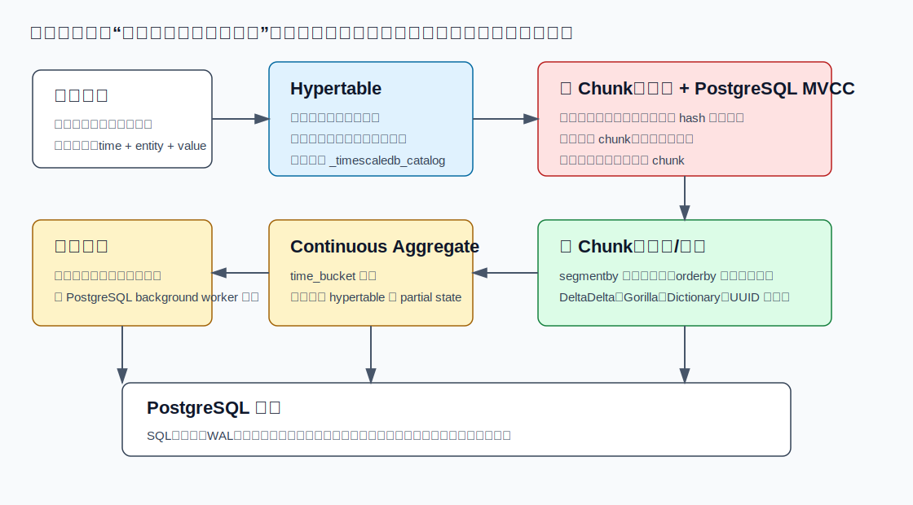
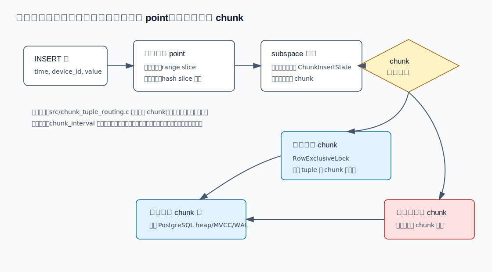
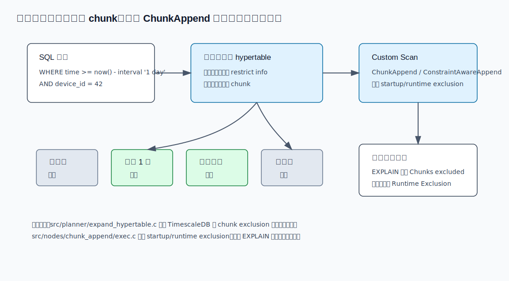
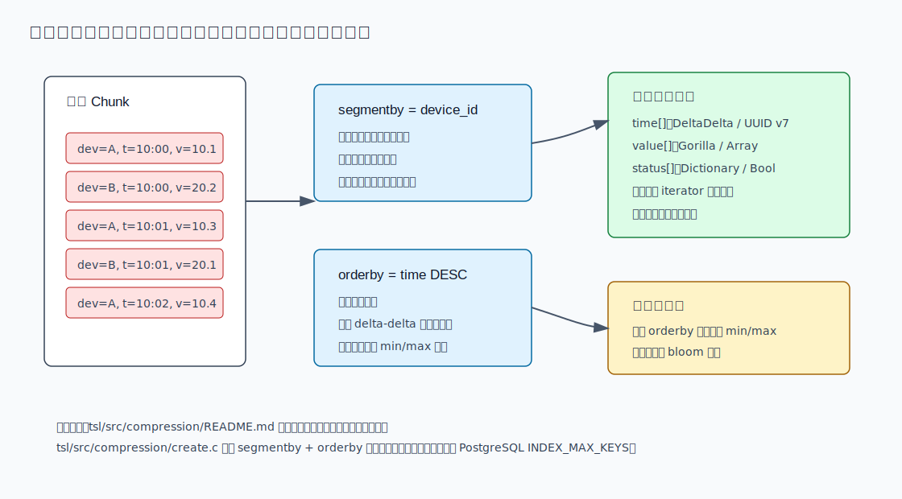
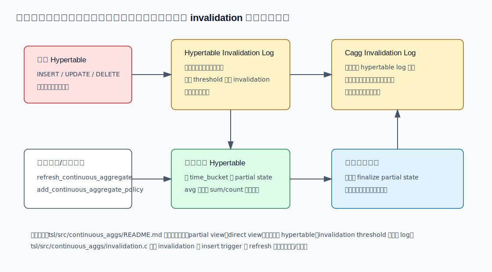
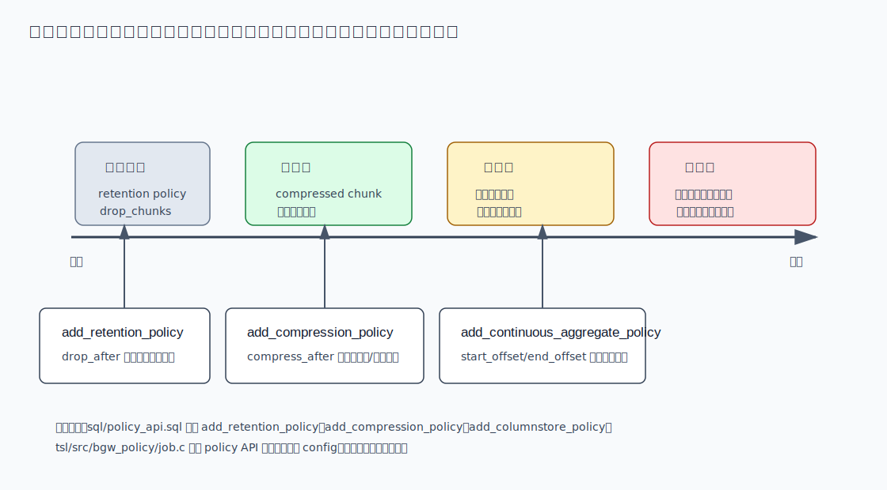

## 数据库筑基课 - 应用实践之 时序

### 作者
digoal

### 日期
2026-05-31

### 标签
PostgreSQL , 应用开发者 , 数据库筑基课 , 时序 , TimescaleDB , Hypertable , Chunk , Columnstore , Continuous Aggregate    

----

## 背景
  


本文属于“应用实践 + 表存储 + 查询执行 + 维护机制”的交叉主题。当前工作区未发现“数据库筑基课”总纲文件，因此本文按用户给定标题独立成篇。

很多系统都会在某一天变成时序系统：IoT 设备每秒上报温度，交易系统持续写 tick，应用服务不断产生日志，用户行为流源源不断进入数据库。它们的共同点不是“有一个时间字段”这么简单，而是：

- 数据按时间持续追加，写入吞吐比单点更新更重要。
- 查询经常带时间窗口，例如最近 5 分钟、昨天、过去 30 天。
- 新数据要实时查，老数据要便宜存，还要能做长期聚合。
- 迟到、补写、修正、删除、保留策略都会改变“历史是否稳定”。

如果只用普通 PostgreSQL 单表承载，初期可以跑，规模上来后会遇到四个问题：表和索引无限膨胀；按时间过滤仍要让优化器面对一张巨表；历史数据压缩、归档、删除都缺少自然边界；报表查询不断重复扫描原始明细。TimescaleDB 的价值，是把这些问题收敛到一个数据库内的时序执行模型：逻辑上仍是一张 SQL 表，物理上按时间切成 chunk，查询时裁剪 chunk，历史 chunk 可转为压缩列存，常用聚合可用 continuous aggregate 增量维护，生命周期交给后台策略。



图 1 说明：TimescaleDB 不是把 PostgreSQL 换掉，而是在 PostgreSQL 扩展层接管时序场景里最重复的工作：时间分区、chunk 路由、chunk 裁剪、列存压缩、连续聚合和后台策略。事务、WAL、权限、SQL、备份恢复这些基础边界仍然来自 PostgreSQL。

## 一、它解决什么问题？

时序数据的问题，本质是“数据生命周期与访问模式高度相关”：越新的数据越需要写入和低延迟查询，越老的数据越适合压缩、聚合和按保留窗口清理。

普通单表做法通常会走到这些瓶颈：

| 问题 | 单表做法的表现 | TimescaleDB 的转化 |
|---|---|---|
| 写入持续增长 | 一张 heap 和多个索引越来越大，维护成本持续上升 | hypertable 把数据按维度落入多个 chunk |
| 时间窗口查询 | 优化器面对整张大表，索引和统计信息压力大 | 按 chunk 约束裁剪，只扫描相关时间范围 |
| 历史存储成本 | 老数据仍占用行存和明细索引成本 | 历史 chunk 可转成压缩/列存 |
| 报表重复聚合 | 每次查询重新扫明细 | continuous aggregate 存 partial 聚合状态并增量刷新 |
| 生命周期自动化 | 压缩、删除、刷新靠外部脚本 | background worker 调度 policy job |

代价也要提前说清楚：TimescaleDB 把很多复杂度从业务代码转移到数据库内部，但没有消灭复杂度。你仍然要选择 chunk interval、segmentby/orderby、刷新窗口、保留窗口、索引和查询写法。选错这些参数，可能出现 chunk 过多、压缩后频繁解压、连续聚合漏掉热数据、保留策略删得过早、或者查询条件写法导致无法裁剪 chunk。

## 二、它是什么？

TimescaleDB 是 PostgreSQL extension。根据本地 `timescaledb/CLAUDE.md`，它的核心抽象包括：

- `Hypertable`：用户面对的逻辑表，按时间维度自动分区；新版本 README 示例也支持 `CREATE TABLE ... WITH (tsdb.hypertable)` 的写法。
- `Chunk`：hypertable 的物理分片，本质是 PostgreSQL relation，保存某个时间范围和可选空间分区范围内的数据。
- `Dimension`：分区维度。时间维度是主线，空间维度可用于设备、租户、位置等二级切分。
- `Continuous Aggregate`：增量刷新的物化聚合，内部用 materialization hypertable 保存 partial aggregate state。
- `Policy Job`：后台调度任务，例如压缩、保留删除、连续聚合刷新。

从源码目录看，这些概念分别落在：

| 机制 | 主要源码/SQL 文件 | 作用 |
|---|---|---|
| hypertable 创建 | `src/hypertable.c`, `sql/ddl_api.sql` | `create_hypertable`、`by_range`、`by_hash` 等 API |
| chunk 路由与管理 | `src/chunk_tuple_routing.c`, `src/chunk.c` | 写入时找/建 chunk，维护 chunk 元数据和约束 |
| 查询计划优化 | `src/planner/expand_hypertable.c`, `src/nodes/chunk_append/*` | 提前展开必要 chunk，执行 startup/runtime exclusion |
| 压缩/列存 | `tsl/src/compression/*`, `tsl/src/nodes/columnar_scan/*` | chunk 压缩、列式扫描、稀疏元数据、解压 |
| 连续聚合 | `tsl/src/continuous_aggs/*` | 创建、刷新、invalidation log、物化表维护 |
| 后台策略 | `sql/policy_api.sql`, `tsl/src/bgw_policy/*` | 压缩、保留、连续聚合刷新等任务调度 |

所以，在应用层可以把 TimescaleDB 理解为：

> Hypertable 负责把时间写入变成可裁剪的物理边界；Columnstore 负责把稳定历史变成便宜的分析形态；Continuous Aggregate 负责把重复聚合变成可增量维护的结果；Policy 负责把这些动作放进数据库后台生命周期。

## 三、核心原理

### 3.1 Hypertable 到 Chunk：逻辑一张表，物理多张表

创建 hypertable 时，TimescaleDB 在 catalog 里记录维度信息。`sql/ddl_api.sql` 里可以看到两类 API：传统 `create_hypertable(relation, time_column_name, ...)`，以及通用维度 API `create_hypertable(relation, dimension, ...)`，配合 `by_range(column_name, partition_interval, ...)` 和 `by_hash(column_name, number_partitions, ...)`。

物理上，每个 chunk 对应一个时间范围。插入行时，执行器会根据行里的时间值和可选空间维度，定位到一个 point，然后找出覆盖该 point 的 chunk。`src/chunk_tuple_routing.c` 的注释说明了一个关键优化：`ChunkTupleRouting` 尽量少做初始化，每个分区的 `ResultRelInfo` 按需构建；常见单行插入必须足够快。代码路径先通过 `ts_hypertable_find_chunk_for_point` 查找 chunk，未命中时再调用 `ts_hypertable_create_chunk_for_point` 创建 chunk。



图 2 说明：写入路径的关键不是“分区表语法”，而是每一行如何被快速路由到目标 chunk。TimescaleDB 用 subspace 缓存复用同批写入里的 chunk 状态，减少重复打开 relation；只有 chunk 不存在时才走创建路径。工程上，chunk interval 太小会制造太多 chunk 和索引，太大又会降低裁剪粒度、增加冷热混放。

### 3.2 查询裁剪：把时间条件变成少扫 chunk

普通 PostgreSQL 分区裁剪已经能解决一部分问题，但 hypertable 可能有非常多 chunk。如果先展开所有 chunk，再检查约束，计划时间也会变成问题。`src/planner/expand_hypertable.c` 的文件头注释直接说明了优化目标：避免 PostgreSQL `expand_inherited_tables` 先展开 hypertable 的所有 chunk，再对每个 chunk 调 `get_relation_info`；TimescaleDB 使用 `HypertableRestrictInfo` 把 chunk exclusion 提前到计划阶段。

执行层还会用 `ChunkAppend` 和 `ConstraintAwareAppend` 继续处理 startup/runtime exclusion。`src/nodes/chunk_append/exec.c` 中的 EXPLAIN 输出包含 `Startup Exclusion`、`Runtime Exclusion`、`Chunks excluded during startup`、`Chunks excluded during runtime` 等信息。这些不是装饰字段，而是判断 SQL 是否真正命中时序裁剪路径的证据。



图 3 说明：好的时序 SQL 应该让优化器看见时间边界。`WHERE time >= now() - interval '1 day'` 这类条件可以映射到 chunk 范围；如果把时间列包在不可推导的函数里，或者只在应用层过滤，chunk 裁剪就可能失效。

### 3.3 历史数据压缩：从行存转成按批列存

时序数据有一个天然优势：相邻行经常相似。例如同一设备的时间戳基本等间隔，温度缓慢变化，状态枚举重复出现。`tsl/src/compression/README.md` 明确说这些压缩算法面向时序场景，很多算法假设相邻行会有相似值。

TimescaleDB 压缩配置里最重要的是两个概念：

- `segmentby`：按哪些列分段，常见选择是设备、租户、传感器、用户等实体键。它会影响过滤和批内相似度。
- `orderby`：批内按哪些列排序，常见是时间倒序或时间加其他过滤列。它会影响 delta-delta、min/max 元数据和范围扫描。

`tsl/src/compression/create.c` 里还可以看到一个现实限制：压缩会为 segmentby 和 orderby 创建隐式索引键，其中 segmentby 每列 1 个键，orderby 每列可能产生 min/max 两个键，组合不能超过 PostgreSQL 的 `INDEX_MAX_KEYS`。这说明 segmentby/orderby 不是越多越好。



图 4 说明：压缩不是简单把文件 gzip 一下。它要先按实体分组、按时间或其他列排序，再把每列用合适算法编码。时间整数适合 DeltaDelta，浮点值可用 Gorilla，低基数字段适合 Dictionary，无法获得更好压缩时退回 Array。查询时可先看 min/max、first/last、bloom 等稀疏元数据，尽量少解压批次。

### 3.4 Continuous Aggregate：增量刷新，而不是整表重算

普通 materialized view 的痛点是刷新成本大：数据越多，重算越贵。连续聚合把聚合按 `time_bucket` 切开，内部 materialization hypertable 保存 partial aggregate state。`tsl/src/continuous_aggs/README.md` 举了 `avg` 的例子：物化表不一定保存最终均值，而是保存 sum/count 这类中间态，查询时再 finalize。

连续聚合的关键是 invalidation。源码 README 和 `tsl/src/continuous_aggs/invalidation.c` 都说明了流转路径：

```text
insert_trigger => hypertable_inval_log => cagg_inval_log => refreshing
```

对原始 hypertable 的 INSERT、UPDATE、DELETE、TRUNCATE、drop_chunks 等修改，会形成需要重刷的时间范围。刷新时，TimescaleDB 把 hypertable invalidation log 切分到具体 continuous aggregate 的 materialization invalidation log，再按刷新窗口处理。为了降低热桶写放大，它还维护 invalidation threshold：threshold 之后的热区域不急着写 invalidation，通常由刷新窗口和实时查询策略覆盖。



图 5 说明：连续聚合适合“明细持续写入、报表按固定时间粒度反复查询”的场景。它的正确性来自 invalidation log 和刷新窗口，而不是简单定时重建整张结果表。刷新窗口要避开最热、最容易迟到的时间段，否则会增加写放大和重刷成本。

### 3.5 后台策略：把生命周期变成数据库内任务

`sql/policy_api.sql` 暴露了几个核心策略：

- `add_retention_policy`：按 `drop_after` 或创建时间窗口删除过期 chunk。文件注释说明保留窗口会对齐 chunk 边界，因此可能保留比窗口更老的一点数据，但不会删除窗口内数据。
- `add_compression_policy` / `add_columnstore_policy`：把达到时间条件的 chunk 转成压缩/列存。
- `add_continuous_aggregate_policy`：按 `start_offset`、`end_offset`、`schedule_interval` 刷新连续聚合。
- `add_reorder_policy`：按指定索引重排 chunk，改善局部性。

这些策略不是外部 crontab 的简单替代。它们在数据库内部读取 hypertable、chunk、continuous aggregate 的 catalog 和 job config，计算窗口，再执行对应动作。比如 `sql/policy_internal.sql` 里的压缩策略会通过 `show_chunks` 找出满足条件的 chunk，再调用 `compress_chunk`。



图 6 说明：一个健康的时序库应该按时间轴设计：热区保留行存和索引能力，温区用连续聚合减少重复扫描，冷区转列存/压缩，过期区按 chunk 边界删除。每个窗口都要和业务的迟到数据、审计保留、查询 SLA 对齐。

## 四、横向对比

| 维度 | TimescaleDB Hypertable | PostgreSQL 原生分区 | 独立时序数据库 | 日志/对象存储 + 离线引擎 |
|---|---|---|---|---|
| 主要目标 | 在 PostgreSQL 内做时序写入、查询、压缩、连续聚合 | 通用分区管理 | 专门服务指标、监控或时序分析 | 低成本存储和批处理 |
| 写入代价 | 路由到 chunk，chunk 创建有元数据和锁成本 | 路由到分区，管理逻辑多由用户负责 | 通常为追加写优化 | 写入便宜，但事务和查询延迟弱 |
| 读取代价 | 时间条件可 chunk pruning，历史可列存扫描 | 可分区裁剪，但时序聚合/压缩要自建 | 时序函数和降采样通常较强 | 交互式查询依赖外部引擎 |
| 空间成本 | 行存 + 压缩列存组合，可按 chunk 生命周期切换 | 主要依赖 PostgreSQL 表/索引/TOAST | 取决于产品存储格式 | 冷数据成本低 |
| 事务/MVCC | 继承 PostgreSQL 事务、SQL、JOIN 能力 | 原生 PostgreSQL | 通常弱于 PostgreSQL 关系能力 | 事务能力弱或不适合 OLTP |
| 运维边界 | 仍需管理 PostgreSQL、extension、policy、chunk 数量 | 需要自行设计分区和维护任务 | 需要引入独立系统 | 数据链路和一致性复杂 |
| 适合场景 | 业务数据和时序数据需要同库 SQL、JOIN、事务和分析 | 分区规则简单、团队愿意自管 | 指标监控、海量遥测、专用查询语言可接受 | 长期归档、离线分析、低频访问 |
| 不适合场景 | 极端高基数指标、无限保留、完全不需要关系能力 | 大量自动生命周期需求 | 强事务关系模型、复杂 JOIN | 近实时事务查询 |

选择 TimescaleDB 的核心理由不是“它比所有时序库都快”，而是它把时序能力放进 PostgreSQL 生态：业务表、维表、权限、备份、SQL、事务、扩展都可以共用。反过来，如果业务只需要 Prometheus 风格指标查询，或者所有历史数据只进对象存储做离线分析，TimescaleDB 不一定是最小系统。

## 五、效果如何？

收益来自四个方向：

1. 查询少扫：时间条件映射到 chunk 约束后，计划期和执行期能排除无关 chunk。效果取决于 chunk interval、SQL 写法和统计信息。
2. 写入稳定：单个 chunk 和索引比全局巨表更小，插入时只接触当前热 chunk。代价是 chunk 创建、catalog 元数据和分区路由。
3. 历史便宜：压缩列存能减少历史数据空间，分析查询也可减少解压和 IO。代价是压缩后 DML、回补、更新可能触发解压或部分 chunk 处理。
4. 聚合少重算：continuous aggregate 只刷新 invalidation 覆盖的桶，而不是每次重扫全量明细。代价是 invalidation log、刷新窗口、partial state 和策略调度复杂度。

不要凭宣传数字设计容量。TimescaleDB README 示例里提到典型时序压缩可达到 90%+，但这依赖数据分布、segmentby/orderby、列类型、乱序程度和查询模式。生产前应该用自己的数据抽样验证：

```sql
SELECT hypertable_size('metrics');
SELECT chunks_detailed_size('metrics');
SELECT * FROM timescaledb_information.chunks
WHERE hypertable_name = 'metrics';
```

如果要验证查询裁剪，优先看 `EXPLAIN (ANALYZE, BUFFERS)` 中是否出现 `Custom Scan (ChunkAppend)`、扫描了多少 chunk、是否有 `Chunks excluded`。如果要验证压缩效果，比较压缩前后 chunk size，并观察查询计划是否走 columnar scan 或是否大量解压。

## 六、实操 DEMO

下面示例基于 TimescaleDB 当前仓库 README 和 `sql/ddl_api.sql` 暴露的 API 组织。本文没有启动本地 PostgreSQL/TimescaleDB 实例，因此 SQL 未执行，执行结果不在本文中编造。

### 6.1 建表与 hypertable

```sql
CREATE EXTENSION IF NOT EXISTS timescaledb;

CREATE TABLE metrics (
    ts          timestamptz      NOT NULL,
    device_id   text             NOT NULL,
    temperature double precision,
    humidity    double precision,
    tags        jsonb,
    PRIMARY KEY (device_id, ts)
);

SELECT create_hypertable(
    'metrics',
    by_range('ts', INTERVAL '1 day'),
    if_not_exists => true
);
```

如果使用 README 中的新建表参数风格，也可以在建表时用 `WITH (tsdb.hypertable)` 创建 hypertable。本文用 `create_hypertable(... by_range(...))`，因为本地 `sql/ddl_api.sql` 明确给出了这个通用 API。

### 6.2 写入样例数据

```sql
INSERT INTO metrics (ts, device_id, temperature, humidity, tags)
SELECT
    now() - (g || ' seconds')::interval,
    'dev-' || (1 + (g % 100)),
    20 + random() * 10,
    40 + random() * 20,
    jsonb_build_object('site', 'hz', 'rack', g % 10)
FROM generate_series(1, 100000) AS g;
```

查看 chunk：

```sql
SELECT show_chunks('metrics');
```

### 6.3 时间窗口查询与验证

```sql
EXPLAIN (ANALYZE, BUFFERS)
SELECT device_id, avg(temperature)
FROM metrics
WHERE ts >= now() - interval '1 hour'
GROUP BY device_id
ORDER BY device_id;
```

验证重点：

- 是否只扫描最近几个 chunk。
- 是否出现 `Custom Scan (ChunkAppend)`。
- 是否显示 startup/runtime chunk exclusion。
- 是否因为表达式写法导致所有 chunk 都被扫描。

### 6.4 压缩/列存

旧接口常见写法：

```sql
ALTER TABLE metrics SET (
    timescaledb.compress,
    timescaledb.compress_segmentby = 'device_id',
    timescaledb.compress_orderby = 'ts DESC'
);

SELECT add_compression_policy('metrics', INTERVAL '7 days');
```

当前仓库 README 同时展示了 `convert_to_columnstore`：

```sql
DO $$
DECLARE
    ch regclass;
BEGIN
    FOR ch IN SELECT show_chunks('metrics', older_than => now() - interval '7 days')
    LOOP
        CALL convert_to_columnstore(ch, recompress := true);
    END LOOP;
END $$;
```

版本注意：TimescaleDB 正在从“compression”术语过渡到“columnstore/hypercore”相关接口。实际生产要以安装版本的 `\df *compress*`、`\df *columnstore*` 和官方 API 文档为准。

### 6.5 连续聚合

```sql
CREATE MATERIALIZED VIEW metrics_hourly
WITH (timescaledb.continuous) AS
SELECT
    time_bucket('1 hour', ts) AS bucket,
    device_id,
    avg(temperature) AS avg_temperature,
    max(temperature) AS max_temperature,
    count(*) AS samples
FROM metrics
GROUP BY bucket, device_id;

SELECT add_continuous_aggregate_policy(
    'metrics_hourly',
    start_offset => INTERVAL '3 days',
    end_offset => INTERVAL '1 hour',
    schedule_interval => INTERVAL '15 minutes'
);
```

这里 `end_offset => INTERVAL '1 hour'` 的含义是：最近 1 小时先不纳入策略刷新窗口，避免和热写入、迟到数据抢资源。是否合理取决于业务乱序窗口。

### 6.6 保留策略

```sql
SELECT add_retention_policy(
    'metrics',
    drop_after => INTERVAL '180 days',
    schedule_interval => INTERVAL '1 day'
);
```

注意：`sql/policy_api.sql` 注释说明保留窗口对齐 chunk 边界，实际保留的数据可能比窗口略老，但不会删除窗口内数据。这是按 chunk 删除带来的边界效应。

## 七、最佳实践

面向数据库架构师：

- 先画数据生命周期，而不是先建表。至少明确热写窗口、允许迟到窗口、连续聚合刷新窗口、压缩窗口、保留窗口。
- chunk interval 以“单 chunk 大小、单窗口查询覆盖 chunk 数、后台策略频率”为共同约束。不要只按自然日、自然月拍脑袋。
- 高基数实体列是否做 hash space dimension 要谨慎。它能摊平写入和 chunk 大小，但会增加 chunk 数量和元数据复杂度。
- 如果业务表需要和时序明细频繁 JOIN，TimescaleDB 的 PostgreSQL 原生 SQL 能力是优势；如果只做指标查询，要和专用时序库比较总成本。

面向 DBA：

- 监控 chunk 数量、chunk 大小、压缩状态、后台 job 成功率、连续聚合 refresh lag。
- 定期用 `EXPLAIN (ANALYZE, BUFFERS)` 检查核心查询是否还在裁剪 chunk。
- 压缩策略的 `compress_after` 要晚于回补/乱序窗口，否则业务补写会把冷 chunk 重新变成写热点。
- retention 策略上线前要做恢复演练。按 chunk 删除很快，但误删也很快。

面向业务开发者：

- 所有核心查询都应显式带时间范围。没有时间范围的“查全部设备最新状态”通常要改成维护最新状态表或 continuous aggregate。
- 不要把时间列包在不可裁剪的表达式里，例如对每行调用函数再过滤；尽量把边界写成列与常量比较。
- 建模时把实体键、时间、度量、标签分清楚。高频过滤列才适合进入索引或 segmentby。
- 连续聚合不是强一致实时视图。需要秒级最新值时，把最近热数据直接查原表，历史区查连续聚合，或者使用实时聚合能力并验证版本行为。

## 八、适合与不适合场景

适合：

- IoT、车辆、能源、工业设备、金融 tick、用户行为、日志事件等持续追加数据。
- 查询经常带时间范围，并且业务数据需要和关系表 JOIN。
- 历史数据读多写少，可按 chunk 压缩和保留。
- 固定粒度报表多，例如分钟、小时、天级聚合。
- 团队已经有 PostgreSQL 运维能力，希望减少新系统引入。

不适合：

- 几乎所有查询都不带时间条件，无法利用 chunk pruning。
- 历史数据频繁更新，压缩后反复解压/重压缩。
- 指标基数极端爆炸，并且查询语言、事务、JOIN 都不重要，专用时序系统可能更简单。
- 保留策略无法按时间边界定义，例如必须按复杂业务状态逐行删除。
- 团队无法接受 PostgreSQL extension 升级、许可边界、TSL 功能差异带来的运维约束。

## 九、常见坑

1. chunk interval 太小：短期看裁剪更细，长期看 chunk 数、catalog、计划时间、后台任务都会变重。
2. chunk interval 太大：热冷数据混在同一个 chunk，压缩和删除都不方便，时间窗口查询也会多扫。
3. 查询没有时间条件：再好的时序分区也救不了“全历史扫描”。
4. 时间条件写法不可裁剪：例如 `date_trunc('day', ts) = current_date` 可能不如 `ts >= ... AND ts < ...`。
5. segmentby 选唯一值：每个 segment 太小，压缩收益差，元数据成本高。
6. orderby 忽略查询模式：只按时间排序不一定最优，若常按设备和时间查，要结合 segmentby 一起设计。
7. 过早压缩：迟到数据和修正写入会撞上冷 chunk，带来解压、部分 chunk 或写入限制问题。
8. 连续聚合刷新窗口覆盖热区：刷新和写入互相干扰，invalidation 放大。
9. retention 没有审计确认：chunk 删除是物理生命周期动作，不是应用层软删除。
10. 忽略版本差异：compression、columnstore、hypercore、直接压缩写入等接口随版本演进，必须以安装版本为准。

## 十、扩展问题

1. 如果一个业务同时有“最新状态查询”和“历史趋势查询”，应该用一张 hypertable 解决，还是维护一张 latest state 表？
2. chunk interval 应该按时间固定，还是按目标 chunk 大小自适应？业务怎么验证哪种更稳？
3. 连续聚合的 `end_offset` 应该等于迟到窗口、刷新频率，还是业务 SLA？三者冲突时怎么取舍？
4. 压缩后的历史数据还要支持补写时，应该延迟压缩、分离修正表，还是接受重压缩成本？
5. 如果查询经常跨租户分析，`tenant_id` 还适合作为 segmentby 或 hash dimension 吗？

## 十一、扩展阅读

- 本地源码：`timescaledb/CLAUDE.md`，项目架构、构建测试、核心目录。
- 本地源码：`timescaledb/sql/ddl_api.sql`，`create_hypertable`、`by_range`、`by_hash`、`show_chunks`、`drop_chunks`。
- 本地源码：`timescaledb/src/chunk_tuple_routing.c`，写入时的 chunk 查找、创建和插入状态缓存。
- 本地源码：`timescaledb/src/planner/expand_hypertable.c`，计划期提前裁剪 chunk 的设计说明。
- 本地源码：`timescaledb/src/nodes/chunk_append/exec.c`，`ChunkAppend` 的 startup/runtime exclusion 和 EXPLAIN 输出。
- 本地源码：`timescaledb/tsl/src/compression/README.md`，DeltaDelta、Gorilla、Dictionary、Array、Bool、UUID 等压缩算法说明。
- 本地源码：`timescaledb/tsl/src/compression/create.c`，压缩设置、稀疏元数据、segmentby/orderby 限制。
- 本地源码：`timescaledb/tsl/src/continuous_aggs/README.md`，continuous aggregate 的对象组成、partial state、invalidation threshold。
- 本地源码：`timescaledb/tsl/src/continuous_aggs/invalidation.c`，invalidation log 的生成、合并、切分与刷新流转。
- 本地源码：`timescaledb/sql/policy_api.sql` 和 `timescaledb/tsl/src/bgw_policy/*`，后台策略 API 与执行逻辑。
- DeepWiki：`timescale/timescaledb`，页面包括 Overview、Hypertables and Chunks、Compression System、Continuous Aggregates、Background Worker and Policy System、Query Planning and Optimization。
- Timescale/TigerData 官方文档入口：<https://docs.tigerdata.com/use-timescale/latest/hypertables/>、<https://docs.tigerdata.com/use-timescale/latest/compression/about-compression/>、<https://docs.tigerdata.com/use-timescale/latest/continuous-aggregates/>。

## 校验说明

- 本文主题分类：场景实践，覆盖表存储、查询执行、压缩维护和连续聚合。
- 主要机制声明来自本地 TimescaleDB 源码、SQL API 文件、仓库 README、DeepWiki 摘要。
- SQL 示例按本地 API 和 README 风格编写，但未在本机执行；未编造执行结果。
- 外部官方文档 URL 已列为扩展阅读；本次环境通过本机代理抓取失败，因此未把网页正文作为直接证据。
- SVG 图均为 standalone 文件，使用相对路径引用，无 JavaScript、`foreignObject`、外部 CSS、远程字体或远程图片。
  
## 附录 

1、克隆代码  
```  
git clone --depth 1 https://github.com/timescale/timescaledb
```  
  
2、启用 codex, 使用 [数据库筑基课 skill](../skills/README.md).  
```
文章标题: 
  数据库筑基课 - 应用实践之 时序
项目源码(本地目录): 
  timescaledb
项目 codebase 文件名: 
  timescaledb/CLAUDE.md 
开源项目相关的 deepwiki repoName: 
  timescale/timescaledb
```

  
  
#### [PostgreSQL 解决方案集合](../201706/20170601_02.md "40cff096e9ed7122c512b35d8561d9c8")
  
  
#### [德哥 / digoal's Github - 公益是一辈子的事.](https://github.com/digoal/blog/blob/master/README.md "22709685feb7cab07d30f30387f0a9ae")
  
  
#### [About 德哥](https://github.com/digoal/blog/blob/master/me/readme.md "a37735981e7704886ffd590565582dd0")
  
  

  
