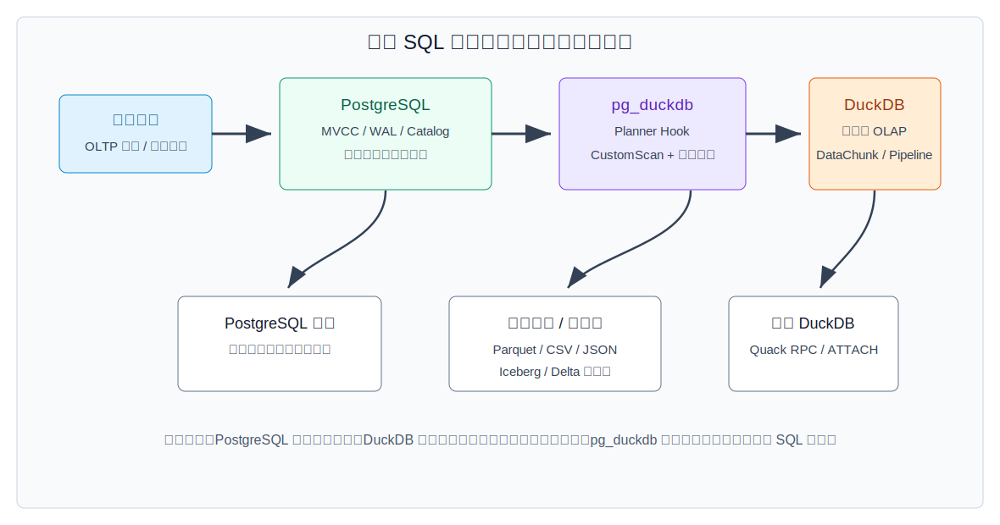
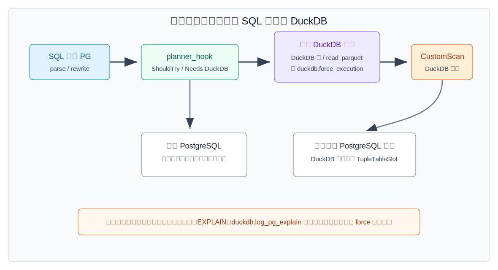
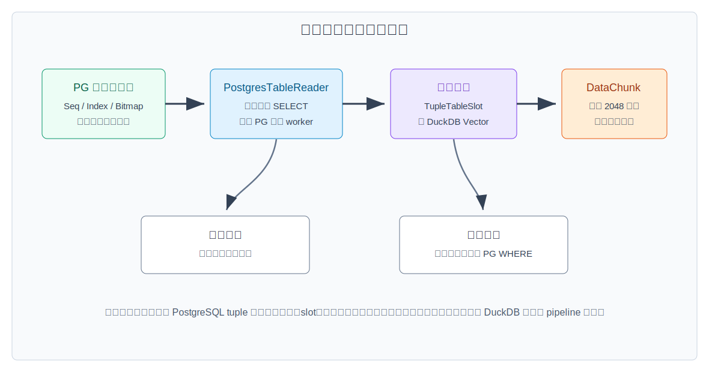
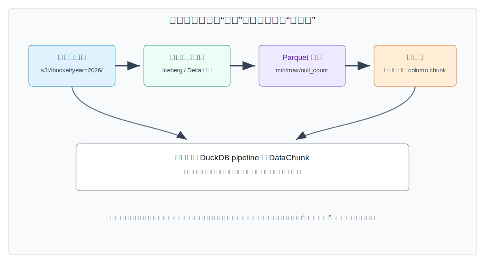
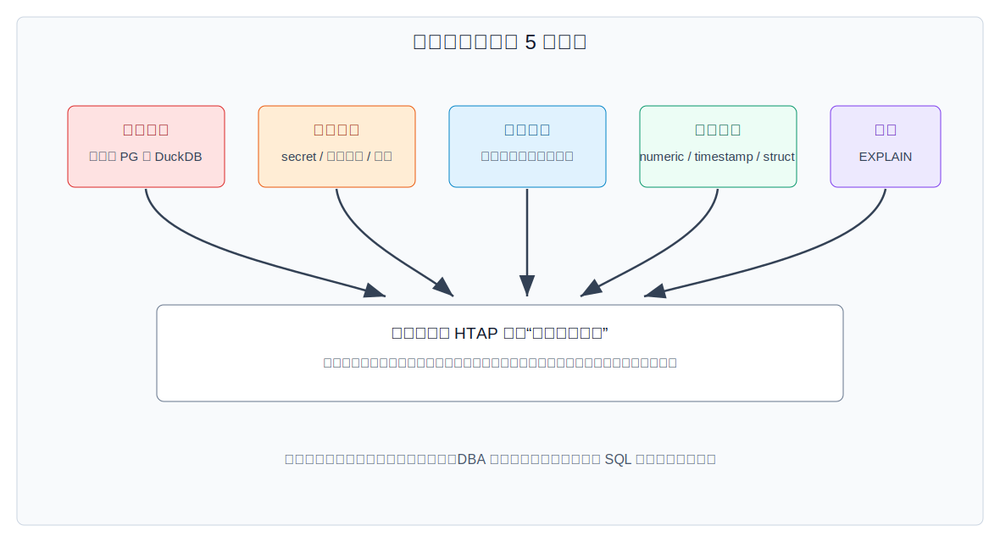

## 数据库筑基课 - 应用实践之 HTAP与数据湖

### 作者
digoal

### 日期
2026-05-31

### 标签
PostgreSQL , 应用开发者 , 数据库筑基课 , HTAP , 数据湖 , pg_duckdb , Parquet , Iceberg , Delta Lake , Quack    

----

## 背景
   


本文属于“应用实践 + 查询执行 + 表存储 + 运维边界”的交叉主题。当前工作区未发现“数据库筑基课”总纲文件，因此本文按用户给定标题独立成篇。

很多团队的真实处境是这样：

- 交易数据在 PostgreSQL 里，写入链路、唯一约束、外键、事务、审计、权限都已经围绕它建设。
- 报表、留存、漏斗、归因、风控回溯越做越重，`GROUP BY`、大宽表扫描、多表 Join 开始挤占在线库资源。
- 历史明细和外部数据已经落到 S3、GCS、R2、Azure Blob 或本地对象存储，格式可能是 Parquet、CSV、JSON，也可能上升到 Iceberg、Delta Lake 这类表格式。
- 业务还希望“不要再搬一份数据、不要再维护一套权限入口、最好还是 SQL 能查”。

HTAP 与数据湖的工程难点不在名词，而在边界：谁负责事务一致性，谁负责分析执行，谁负责冷数据容量，谁负责权限，失败时谁回滚。

`pg_duckdb` 给出了一条很实用的路径：PostgreSQL 仍然做在线事务入口，DuckDB 嵌入到 PostgreSQL 后端进程里做列式向量化分析，外部湖数据通过 DuckDB 的 `read_parquet()`、`read_csv()`、`read_json()`、`iceberg_scan()`、`delta_scan()` 等函数进入同一条查询链路。`duckdb-quack` 进一步探索 DuckDB 到 DuckDB 的远端 RPC 和远端 catalog。

核心判断是：

> HTAP + 数据湖不是把 PostgreSQL 改造成大仓库，而是在 PostgreSQL 的事务边界外，把分析型扫描、列式批处理、开放文件格式和远端计算接进来。



图 1 说明：PostgreSQL 仍然是在线一致性和 SQL 入口，pg_duckdb 通过 planner hook、CustomScan 和类型转换把部分查询交给 DuckDB，DuckDB 再扫描 PostgreSQL 表、对象存储文件或远端 Quack catalog。这个架构的关键不是“谁更快”，而是谁承担哪一种失败和一致性责任。

## 一、它解决什么问题？

传统做法通常有四类：

| 做法 | 优点 | 主要代价 |
|---|---|---|
| 直接在 PostgreSQL 主库跑报表 | 架构最简单，数据最新 | 大扫描、大排序、大 Join 影响 OLTP；行存不适合宽表分析 |
| ETL 到独立数仓 | 资源隔离，适合重分析 | 数据延迟、双写/同步、权限与口径重复建设 |
| FDW 或外部表查询湖数据 | SQL 入口统一 | 远端下推能力、列式扫描能力、复杂格式支持取决于实现 |
| PostgreSQL + DuckDB + 数据湖 | OLTP 留在 PostgreSQL，OLAP 交给 DuckDB，湖文件直接查 | 边界更多：类型、事务、权限、资源、对象存储延迟都要治理 |

`pg_duckdb` 把问题从“要不要再建一个数仓”转化为：

1. 热数据和强一致写入继续放在 PostgreSQL。
2. 分析查询在满足条件时由 DuckDB 执行。
3. 冷数据或外部数据以 Parquet、CSV、JSON、Iceberg、Delta 等格式直接被 DuckDB 扫描。
4. 查询结果仍通过 PostgreSQL 协议返回给应用。

它牺牲的是单一系统的简单性，换来的是更少搬运、更强分析执行能力和更开放的数据湖接入。

## 二、它是什么？

从使用者视角看，`pg_duckdb` 是一个 PostgreSQL 扩展。它的 README 明确说明：该扩展把 DuckDB 的列式向量化分析引擎集成到 PostgreSQL 中，可以对 PostgreSQL 表执行分析查询，也可以读写 S3、GCS、Azure、R2 上的 Parquet、CSV、JSON、Iceberg、Delta Lake 等数据。

从内部机制看，它由几层组成：

| 层次 | 组件 | 职责 |
|---|---|---|
| SQL 入口 | PostgreSQL parser、planner、executor | 保持 PostgreSQL 协议、权限、catalog、事务入口 |
| 接管判断 | `pgduckdb_hooks.cpp`、`pgduckdb_planner.cpp` | 判断查询是否需要 DuckDB，生成 `CustomScan` |
| PostgreSQL 表扫描 | `PostgresScanTableFunction`、`PostgresTableReader` | 把 PostgreSQL 表按快照、投影、过滤读成 DuckDB `DataChunk` |
| 分析执行 | DuckDB binder、optimizer、pipeline executor | 向量化聚合、Join、排序、窗口、外部文件扫描 |
| 湖数据入口 | `read_parquet()`、`read_csv()`、`read_json()`、`iceberg_scan()`、`delta_scan()` | 通过 DuckDB 扩展和文件系统访问开放格式数据 |
| 远端探索 | duckdb-quack | 通过 `quack_serve`、`ATTACH 'quack:...'`、RPC 扫描远端 DuckDB |

要注意两个边界。

第一，`pg_duckdb` 不是 PostgreSQL 的替代执行器。它只在查询包含 DuckDB-only 功能、DuckDB 表，或显式设置 `duckdb.force_execution = true` 且语句被允许时接管。

第二，它也不是分布式事务湖仓。`pg_duckdb/docs/transactions.md` 明确限制：同一个事务里不能同时写 PostgreSQL 表和 DuckDB 表；绕过限制的 `duckdb.unsafe_allow_mixed_transactions` 可能导致不一致，生产环境不应把它当成正常方案。

## 三、核心原理

### 3.1 查询接管：PostgreSQL 计划树里放一个 DuckDB CustomScan

`pg_duckdb/src/pgduckdb.cpp` 的 `_PG_init()` 要求扩展通过 `shared_preload_libraries` 加载，然后初始化 GUC、hooks、custom node、后台 worker 共享内存和事务回调。

`pg_duckdb/src/pgduckdb_hooks.cpp` 里可以看到接管判断：

- `NeedsDuckdbExecution()` 会检查查询中是否包含 DuckDB 表或 DuckDB-only 函数。
- `ShouldTryToUseDuckdbExecution()` 会检查 `duckdb.force_execution`、语句类型、是否有 `FROM` 子句等条件。
- 系统 catalog 表、修改 PostgreSQL 表的语句、函数内部执行等场景会被拦住或受配置限制。

`pg_duckdb/src/pgduckdb_planner.cpp` 的 `DuckdbPlanNode()` 会创建 PostgreSQL `CustomScan`。它先把 PostgreSQL `Query` 反解析成 SQL，交给 DuckDB `Prepare()`，再把 DuckDB 返回的列名、类型映射回 PostgreSQL target list。最终 PostgreSQL 看到的是一个可执行的 custom scan 节点。



图 2 说明：常量查询、系统表查询、非允许语句不应该盲目交给 DuckDB。`duckdb.force_execution` 只是一个路由开关，不是性能保证。真正上线前要能解释“这个 SQL 为什么走 DuckDB，为什么没有走 DuckDB”。

### 3.2 PostgreSQL 表扫描：行存快照进入 DuckDB 列向量

如果 DuckDB 执行的查询需要读取 PostgreSQL 普通表，`pg_duckdb` 会在 DuckDB 侧注册一个表函数：`PostgresScanTableFunction`。本地源码 `pg_duckdb/src/scan/postgres_scan.cpp` 显示它启用了：

- `projection_pushdown = true`
- `filter_pushdown = true`
- `filter_prune = true`
- `cardinality = PostgresScanCardinality`

`PostgresScanGlobalState::ConstructTableScanQuery()` 会根据 DuckDB 传入的列集合和过滤条件，构造内部 PostgreSQL SQL，例如只 SELECT 需要的列，并把可表达的过滤条件放到 `WHERE` 里。

随后 `PostgresTableReader` 会调用 PostgreSQL 的 parser、rewrite、standard planner、executor 初始化内部扫描。源码里允许对 `SeqScan`、`IndexScan`、`IndexOnlyScan`、`BitmapHeapScan`、`Append` 等计划做并行扫描判断，并通过 PostgreSQL parallel worker 读取 tuple。

最后 `PostgresScanFunction()` 把 PostgreSQL tuple 放入 DuckDB `DataChunk`。DuckDB 的常规执行以列向量批处理为核心，项目说明中也明确写到通常以 2048 行一批处理。



图 3 说明：这个路径不是零成本。每行仍然要经过 PostgreSQL 可见性、slot、类型转换、内存上下文管理。收益出现在转换之后：后续聚合、Join、排序、窗口等算子可以进入 DuckDB 的向量化 pipeline。

### 3.3 数据湖扫描：让 DuckDB 少读文件、少读行组、少读列

DuckDB 的价值不只是“向量化算子快”，更重要的是它直接理解分析文件格式。

`pg_duckdb/docs/functions.md` 定义了数据湖函数：

- `read_parquet(path TEXT or TEXT[], ...)`
- `read_csv(path TEXT or TEXT[], ...)`
- `read_json(path TEXT or TEXT[], ...)`
- `iceberg_scan(path TEXT, ...)`
- `iceberg_metadata(path TEXT, ...)`
- `iceberg_snapshots(path TEXT, ...)`
- `delta_scan(path TEXT)`

这些函数返回 `SETOF duckdb.row`。在 PostgreSQL SQL 里访问外部文件列时，通常需要给函数起别名，然后使用 `r['column_name']` 语法，例如 `SELECT r['id'] FROM read_parquet('file.parquet') r`。

DuckDB 的本地源码和 DeepWiki 架构摘要都指向同一个机制：Parquet 扫描会读取文件元数据、schema、row group 和 column chunk；多文件读取支持 glob、多文件绑定和分区信息；优化器可以做列裁剪、过滤下推和统计裁剪。Iceberg、Delta 这类表格式则在文件之上增加 snapshot、manifest、schema evolution、time travel 等元数据层。



图 4 说明：湖查询最怕“全量列、全量文件、全量行组、远端小文件风暴”。好的设计应该让目录分区、表格式元数据、Parquet 行组统计、列投影和谓词共同减少读取。

### 3.4 事务边界：HTAP 里最容易被忽略的是“写”

读分析查询通常容易跑通，写入边界才是生产事故高发点。

PostgreSQL 的强项是 MVCC、WAL、buffer manager、锁、catalog、权限、复制和恢复。DeepWiki 对 PostgreSQL 的架构摘要也强调：MVCC 通过快照减少读写阻塞，WAL 保证持久性和恢复，buffer/storage 管理共享缓冲和磁盘页。

DuckDB 自身也有事务和 WAL，但嵌入在 `pg_duckdb` 里时，它和 PostgreSQL 不是一个原生分布式事务管理器。`pg_duckdb/docs/transactions.md` 的限制很直接：

- 多语句事务支持存在，但不能在同一事务里同时写 PostgreSQL 表和 DuckDB 表。
- DuckDB 表 DDL 和 PostgreSQL 对象 DDL 也不能在同一事务里混用。
- `duckdb.unsafe_allow_mixed_transactions` 只是绕过限制，可能导致 DuckDB 已提交而 PostgreSQL 未提交。

因此实践里要把写路径拆开：

1. 在线交易写 PostgreSQL。
2. 分析结果写 DuckDB/MotherDuck 或对象存储时单独事务提交。
3. 如果要把湖查询结果回写 PostgreSQL，按批次、幂等键、审计表、可重试任务来做，不要假装它是一个跨引擎原子事务。

### 3.5 Quack：远端 DuckDB catalog，不是通用分布式数据库

`duckdb-quack/README.md` 说明 Quack 是一个 DuckDB 扩展，给 DuckDB 加 HTTP(S) RPC 协议。它可以在一个 DuckDB 实例上执行：

```sql
CALL quack_serve('quack:localhost', token = 'super_secret');
```

另一端创建 secret 后：

```sql
CREATE SECRET (TYPE quack, TOKEN 'super_secret');
ATTACH 'quack:localhost' AS remote;
FROM remote.hello;
```

本地 `duckdb-quack/CLAUDE.md` 和 DeepWiki 摘要显示：Quack 有 server、client、HTTP transport、message serialization、remote catalog、remote schema/table、insert pushdown、transaction forwarding；远端表支持 projection 和 filter pushdown。测试目录里也有 `pushdown.test`、`rpc_call_projection.test` 等用例。

但它的 README 明确标注 Quack 仍是 pre-release experimental extension。因此本文把它放在“跨节点 DuckDB 探索”位置，而不是作为核心生产路径建议。对大多数团队，先把 PostgreSQL + pg_duckdb + Parquet/Iceberg/Delta 的单节点或近端链路治理好，比过早引入远端 RPC 更稳。

## 四、横向对比

| 维度 | PostgreSQL 主库报表 | ETL 到数仓 | PostgreSQL FDW/外部表 | PostgreSQL + pg_duckdb + 数据湖 |
|---|---|---|---|---|
| 主要目标 | 就地查询在线数据 | 独立分析平台 | 统一 SQL 访问外部源 | 在线入口 + 嵌入式 OLAP + 开放湖格式 |
| 写入一致性 | 强，单引擎事务 | 取决于同步链路 | 取决于远端源 | PostgreSQL 强；DuckDB/湖写入需拆事务 |
| 分析性能 | 受行存和 OLTP 干扰 | 强 | 取决于下推能力 | 对聚合、宽表、湖文件扫描更友好 |
| 数据新鲜度 | 最新 | 有延迟 | 取决于外部源 | PostgreSQL 热数据最新；湖数据取决于落盘周期 |
| 运维复杂度 | 低 | 高 | 中 | 中到高，边界治理要求高 |
| 权限模型 | PostgreSQL | 数仓另建 | 多系统映射 | PostgreSQL 入口 + DuckDB secret/extension 管控 |
| 适合场景 | 小报表、低频分析 | 企业级重仓、跨域建模 | 少量外部源访问 | 轻中量 HTAP、湖文件分析、低搬运链路 |
| 不适合场景 | 重 OLAP | 极低延迟 OLTP | 复杂湖优化 | 跨引擎强一致写、海量并发数仓 |

这张表的核心原因是存储和执行模型不同。PostgreSQL 的堆表、索引、MVCC、WAL 是为在线事务和复杂 SQL 可靠性设计的；DuckDB 的列式向量化执行、Parquet 扫描、pipeline 是为分析吞吐设计的。`pg_duckdb` 的价值是把它们接起来，不是抹平二者差异。

## 五、效果如何？

不要把 HTAP 的效果简化成“某条 SQL 快了多少”。更稳的评估方式是分层看。

第一层，PostgreSQL 热表分析。适合大批量 SELECT、聚合、Join、排序、窗口，尤其是宽表只取少数列、过滤可下推、结果集较小的查询。代价是 tuple 到 vector 的转换，以及 PostgreSQL 表扫描仍然消耗在线库 IO、buffer、worker 和 CPU。

第二层，湖文件分析。适合历史明细、日志、外部数据、归档数据、离线特征、冷数据回溯。收益来自列裁剪、行组裁剪、压缩格式和对象存储容量。代价是对象存储延迟、小文件、schema 演化、权限 secret、网络失败和格式兼容性。

第三层，混合查询。适合把 PostgreSQL 中的小维表、租户表、配置表、最新状态表与湖中的大事实表 Join。代价是跨边界数据移动：如果 PostgreSQL 侧表很大，或者 Join 条件不能下推，DuckDB 可能要读取大量 PostgreSQL tuple 再分析。

第四层，远端 DuckDB/Quack。适合探索远端 DuckDB catalog 和 RPC 查询。代价是网络、鉴权、远端事务语义、版本兼容和实验特性风险。

本文没有给出性能数字，因为当前环境没有运行 PostgreSQL + pg_duckdb + DuckDB 的基准。生产评估应至少记录：

- `EXPLAIN` 中查询是否走 DuckDB custom scan。
- PostgreSQL 侧扫描行数、是否并行、是否命中索引。
- DuckDB 侧读取文件数、行组数、列数、远端请求数。
- 查询内存、临时目录 spill、线程数。
- OLTP 延迟是否被报表拖慢。

## 六、实操 DEMO

以下 SQL 是最小链路示例，当前环境未启动 PostgreSQL 实例，也未安装并执行 `pg_duckdb`，所以示例未执行，不能把它当成实测输出。

### 6.1 安装与基础设置

```sql
-- 需要在 postgresql.conf 中配置，重启后生效：
-- shared_preload_libraries = 'pg_duckdb'

CREATE EXTENSION pg_duckdb;

-- 只查询 PostgreSQL 普通表时，如需强制走 DuckDB：
SET duckdb.force_execution = true;

-- 调试 PostgreSQL 表扫描计划：
SET duckdb.log_pg_explain = true;
```

资源设置建议从保守值开始：

```sql
ALTER SYSTEM SET duckdb.max_memory = '2048';
ALTER SYSTEM SET duckdb.threads = '4';
ALTER SYSTEM SET duckdb.max_workers_per_postgres_scan = '2';
ALTER SYSTEM SET duckdb.threads_for_postgres_scan = '2';
```

不同版本的 GUC 展示和单位可能有差异，以上写法应以当前安装版本文档和 `SELECT name, setting, unit FROM pg_settings WHERE name LIKE 'duckdb.%' ORDER BY name;` 结果校验。

### 6.2 PostgreSQL 热表分析

```sql
CREATE TABLE orders (
  order_id     bigserial PRIMARY KEY,
  customer_id  bigint NOT NULL,
  product_name text NOT NULL,
  amount       numeric(18,2) NOT NULL,
  order_time   timestamptz NOT NULL DEFAULT now()
);

SET duckdb.force_execution = true;

EXPLAIN
SELECT
  date_trunc('day', order_time) AS order_day,
  count(*) AS order_count,
  sum(amount) AS revenue
FROM orders
WHERE order_time >= now() - interval '30 days'
GROUP BY 1
ORDER BY 1;
```

验证重点不是只看结果，而是确认：

- 查询是否由 DuckDB 接管。
- PostgreSQL 表扫描是否只读必要列。
- `WHERE` 是否下推到 PostgreSQL 内部扫描。
- 对 OLTP 写入延迟是否有影响。

### 6.3 查询 Parquet 数据湖

```sql
SELECT duckdb.create_simple_secret(
  type   := 'S3',
  key_id := 'your_access_key_id',
  secret := 'your_secret_access_key',
  region := 'us-east-1'
);

SELECT
  r['product_id'] AS product_id,
  count(*) AS review_count,
  avg((r['rating'])::double precision) AS avg_rating
FROM read_parquet('s3://example-bucket/reviews/year=2026/month=05/*.parquet') r
WHERE r['rating'] IS NOT NULL
GROUP BY r['product_id']
ORDER BY review_count DESC
LIMIT 20;
```

注意 `read_parquet()` 返回的是 `duckdb.row`。在 pg_duckdb 文档中，访问列需要 `r['column_name']` 语法；如果直接 `SELECT *`，可用于探索 schema，但生产 SQL 应尽量显式投影。

### 6.4 混合 Join：PostgreSQL 维表 + 湖事实表

```sql
SET duckdb.force_execution = true;

SELECT
  c.customer_id,
  c.customer_name,
  sum((o['order_total'])::double precision) AS lake_revenue
FROM customers c
JOIN read_parquet('s3://example-bucket/orders/dt=2026-05-*.parquet') o
  ON c.customer_id = (o['customer_id'])::bigint
WHERE c.status = 'active'
GROUP BY c.customer_id, c.customer_name
ORDER BY lake_revenue DESC
LIMIT 100;
```

这个模式适合“PostgreSQL 小表 + 湖大表”。如果 `customers` 是千万级大表，应该先评估是否需要在 PostgreSQL 侧预过滤、建临时维表、导出小维度，或把维度同步到湖侧。

### 6.5 Iceberg / Delta

```sql
SELECT duckdb.install_extension('iceberg');

SELECT
  r['region'],
  count(*) AS cnt
FROM iceberg_scan('s3://warehouse/sales_iceberg') r
GROUP BY r['region'];

SELECT duckdb.install_extension('delta');

SELECT
  r['event_type'],
  count(*) AS cnt
FROM delta_scan('s3://lakehouse/user_events') r
GROUP BY r['event_type'];
```

安装扩展需要权限。生产环境应由 DBA 预装并控制 `duckdb.autoinstall_known_extensions`、`duckdb.autoload_known_extensions`、`duckdb.allow_community_extensions`、`duckdb.allow_unsigned_extensions`。

### 6.6 Quack 远端 DuckDB

```sql
-- server 端 DuckDB
INSTALL quack;
LOAD quack;
CALL quack_serve('quack:localhost', token = 'super_secret');
CREATE TABLE hello AS FROM VALUES ('world') v(s);

-- client 端 DuckDB
CREATE SECRET (TYPE quack, TOKEN 'super_secret');
ATTACH 'quack:localhost' AS remote;
FROM remote.hello;
```

这段来自 duckdb-quack 的使用模型。由于 Quack 仍标注为 experimental，生产上应先按实验功能管理：隔离环境、固定版本、压测、故障注入、回退方案。

## 七、最佳实践

### 面向数据库架构师

先画数据边界，再选技术。建议把数据分成三层：

| 层 | 推荐位置 | 原因 |
|---|---|---|
| 强一致热数据 | PostgreSQL | 事务、约束、索引、权限、审计成熟 |
| 近实时分析中间层 | PostgreSQL + pg_duckdb 或 DuckDB 表 | 降低搬运，保留 SQL 入口 |
| 历史明细与外部数据 | Parquet/Iceberg/Delta 数据湖 | 低成本容量，适合列式扫描和归档 |

架构设计时不要承诺“一个事务改所有系统”。跨 PostgreSQL、DuckDB、对象存储的写入，要用任务表、幂等键、批次号、状态机、补偿任务来做。

### 面向 DBA

把 `pg_duckdb` 当成会消耗 PostgreSQL 后端资源的分析执行器，而不是免费的旁路。

重点治理：

- `shared_preload_libraries` 变更流程。
- `duckdb.postgres_role`，只给可信角色使用 DuckDB 执行、secret、MotherDuck 表。
- `duckdb.enable_external_access`、`duckdb.disabled_filesystems`、本地文件系统访问权限。
- `duckdb.max_memory`、`duckdb.threads`、`duckdb.temporary_directory`、`duckdb.max_temp_directory_size`。
- 扩展安装策略：预装允许的 `httpfs`、`json`、`iceberg`、`delta`，禁用未知 community/unsigned 扩展。
- 观测：开启必要的 `EXPLAIN`、日志、慢查询、对象存储请求指标。

### 面向业务开发者

SQL 写法要帮助引擎少读：

- 外部文件查询显式列投影，不要生产环境 `SELECT *`。
- 谓词写成可下推、可裁剪的形式，例如分区列、日期范围、简单比较。
- 小维表 Join 大湖表可以；大 PostgreSQL 表 Join 大湖表要先评估数据移动。
- 对 `numeric`、timestamp、JSON、嵌套类型、STRUCT/MAP/UNION 等跨引擎类型做回归测试。
- 不要在同一事务里混写 PostgreSQL 表和 DuckDB 表。



图 5 说明：HTAP 的上线清单要覆盖事务、安全、资源、类型、观测。能跑一条 SQL 只是第一步；可生产化要能解释资源上限、权限边界、失败后果和回滚方案。

## 八、适合与不适合场景

适合：

- PostgreSQL 是主业务库，已有大量维表、账户表、配置表、订单表，需要低搬运做报表。
- 报表主要是 SELECT、聚合、Join、窗口、采样、读取湖文件。
- 历史数据已经以 Parquet 或 Iceberg/Delta 形式沉淀。
- 可以接受分析查询和写入事务边界分离。
- 团队愿意治理对象存储文件大小、分区、schema、secret 和资源配额。

不适合：

- 要求跨 PostgreSQL、DuckDB、对象存储的强原子写入。
- OLTP 主库资源已经紧张，仍打算直接在主库上做大扫描。
- 查询并发非常高，需要完整 MPP 数仓的调度、隔离、队列和弹性。
- 数据湖是大量小文件、无统计、无分区、schema 混乱，且短期无法治理。
- 安全团队不能接受数据库后端进程访问外部网络或对象存储。
- 把 experimental 的 Quack 当成核心生产链路。

## 九、常见坑

1. 以为 `duckdb.force_execution = true` 就一定更快。实际上它只是改变路由；如果 PostgreSQL 侧扫描和类型转换很重，收益可能被边界成本抵消。

2. 把 `read_parquet()` 当普通 PostgreSQL 表函数用。pg_duckdb 文档明确要求使用 `r['column']` 访问外部文件列；复杂类型还可能需要 DuckDB execution context 或 `duckdb.query()`。

3. 在一个事务里既写 PostgreSQL 又写 DuckDB。默认会被限制；绕过限制可能导致不一致。

4. 忽略对象存储小文件。DuckDB 很擅长扫描 Parquet，但对象存储的请求延迟、小文件数量、分区目录质量仍然决定成本。

5. 忽略类型差异。`NUMERIC` 精度、timestamp 范围、JSON/JSONB、collation、嵌套类型都可能影响结果口径。

6. 把 secret 权限下放给普通用户。`pg_duckdb/docs/secrets.md` 明确提醒不要把 `duckdb` FDW 的 `USAGE` 随便授予普通用户，因为 server owner 能为任意用户创建 user mapping。

7. 忽略每连接 DuckDB 实例的资源。`pg_duckdb/docs/settings.md` 说明 DuckDB 内存、线程等资源和 PostgreSQL 连接相关；连接池和并发数会放大资源占用。

8. 只测单条 SQL，不测 OLTP 抖动。HTAP 的目标不是让一条分析 SQL 漂亮，而是让在线写入和分析查询共存。

## 十、扩展问题

1. 一张订单明细表中，哪些列应该继续留在 PostgreSQL，哪些列应该按日落到 Parquet？
2. 如果 PostgreSQL 热表和湖事实表 Join 很慢，瓶颈更可能在 PostgreSQL 表扫描、对象存储读取、Join 构建，还是类型转换？你如何验证？
3. Iceberg/Delta 的 snapshot 能解决数据湖一致性，但能否解决 PostgreSQL 与湖之间的跨系统一致性？
4. 如果对象存储中有 100 万个小 Parquet 文件，DuckDB 的向量化还能弥补请求开销吗？
5. 什么场景应该上独立 MPP 数仓，而不是继续用 pg_duckdb 扩展 PostgreSQL？
6. Quack 的远端 catalog 和传统 FDW 在事务、下推、网络失败语义上有什么不同？

## 十一、扩展阅读

- `postgres/CLAUDE.md`：本地 PostgreSQL 架构摘要，覆盖 parser、optimizer、executor、storage、access、replication 等目录。
- `postgres/src/backend/executor/README`、`postgres/src/backend/storage/buffer/README`、`postgres/src/backend/access/heap/README.HOT`、`postgres/src/backend/access/transam/README`：PostgreSQL 执行、buffer、heap/MVCC、事务相关源码说明。
- DeepWiki `postgres/postgres`：`Overview`、`Query Processing Pipeline`、`Storage Management`、`Buffer Management`、`Write-Ahead Logging (WAL)`。
- `pg_duckdb/README.md`：pg_duckdb 官方 README，说明 DuckDB 嵌入 PostgreSQL、查询 PostgreSQL 表、读取数据湖、MotherDuck 集成。
- `pg_duckdb/docs/functions.md`：`read_parquet`、`read_csv`、`read_json`、`iceberg_scan`、`delta_scan` 等函数说明。
- `pg_duckdb/docs/gotchas_and_syntax.md`：标准 SQL、外部文件列访问、`duckdb.query()`、事务和配置注意事项。
- `pg_duckdb/docs/transactions.md`：混合事务限制与 `duckdb.unsafe_allow_mixed_transactions` 风险。
- `pg_duckdb/docs/settings.md`：`duckdb.force_execution`、资源、安全、扩展、外部访问等 GUC。
- `pg_duckdb/docs/secrets.md`：S3/GCS/R2/Azure secret 管理与安全提醒。
- `pg_duckdb/src/pgduckdb.cpp`、`pg_duckdb/src/pgduckdb_hooks.cpp`、`pg_duckdb/src/pgduckdb_planner.cpp`：扩展初始化、查询接管、CustomScan 生成。
- `pg_duckdb/src/scan/postgres_scan.cpp`、`pg_duckdb/src/scan/postgres_table_reader.cpp`：PostgreSQL 表扫描、投影/过滤下推、DataChunk 填充。
- DeepWiki `duckdb/pg_duckdb`：`Architecture`、`Query Planning and Execution`、`PostgreSQL Table Scanning`、`External Data Sources`、`Configuration`、`Security and Permissions`。
- `duckdb/README.md`、`duckdb/CLAUDE.md`：DuckDB 总体架构、向量化执行、列式存储、扩展系统。
- DeepWiki `duckdb/duckdb`：`Vector and DataChunk`、`Query Execution`、`Parquet Integration`、`Multi-File Reader`、`Extension Architecture`。
- DuckDB 官方文档：Parquet、httpfs、Iceberg、Delta、Secrets、Extensions、Quack overview。
- `duckdb-quack/README.md`、`duckdb-quack/CLAUDE.md`：Quack 远端协议、`quack_serve`、`ATTACH 'quack:...'`、RPC、pushdown 和实验状态。
- DeepWiki `duckdb/duckdb-quack`：`Architecture`、`RPC Protocol`、`Catalog Integration (ATTACH)`、`Data Scanning and Pushdown`、`Transaction Management`。
  
## 附录 

1、克隆代码  
```  
git clone --depth 1 https://github.com/postgres/postgres
git clone --depth 1 https://github.com/duckdb/duckdb
git clone --depth 1 https://github.com/duckdb/pg_duckdb
git clone --depth 1 https://github.com/duckdb/duckdb-quack
```  
  
2、启用 codex, 使用 [数据库筑基课 skill](../skills/README.md).  
```
文章标题: 
  数据库筑基课 - 应用实践之 HTAP与数据湖
项目源码(本地目录): 
  postgres
  pg_duckdb
  duckdb
  duckdb-quack
项目 codebase 文件名: 
  postgres/CLAUDE.md 
  pg_duckdb/CLAUDE.md 
  duckdb/CLAUDE.md 
  duckdb-quack/CLAUDE.md 
开源项目相关的 deepwiki repoName: 
  postgres/postgres
  duckdb/pg_duckdb
  duckdb/duckdb
  duckdb/duckdb-quack
```

  
  
#### [PostgreSQL 解决方案集合](../201706/20170601_02.md "40cff096e9ed7122c512b35d8561d9c8")
  
  
#### [德哥 / digoal's Github - 公益是一辈子的事.](https://github.com/digoal/blog/blob/master/README.md "22709685feb7cab07d30f30387f0a9ae")
  
  
#### [About 德哥](https://github.com/digoal/blog/blob/master/me/readme.md "a37735981e7704886ffd590565582dd0")
  
  

  
