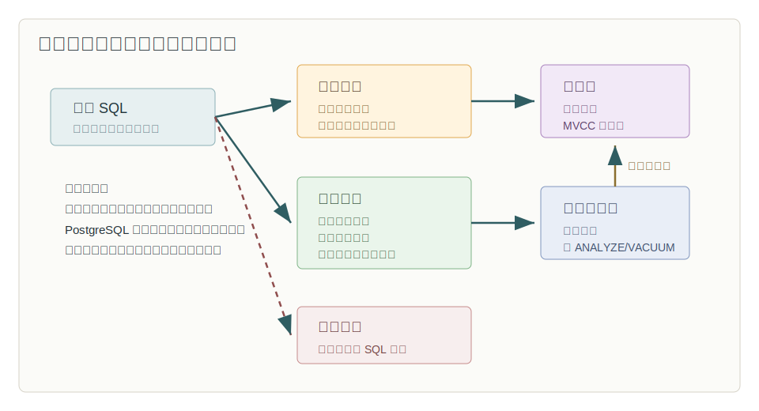
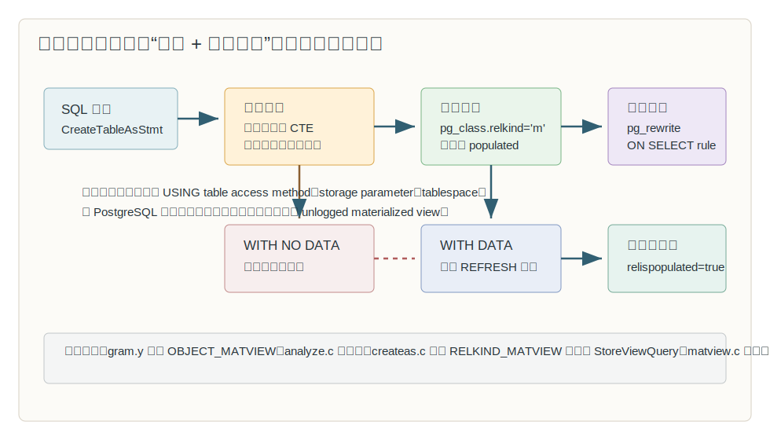
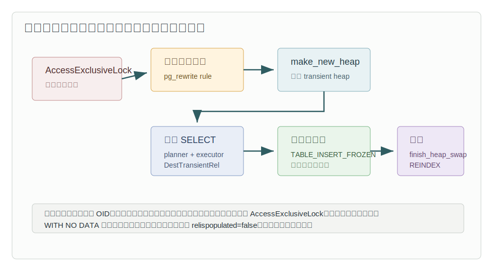
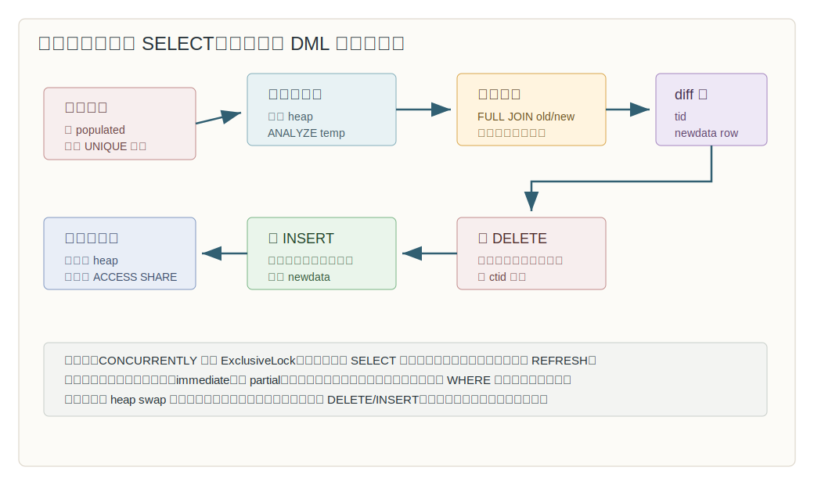
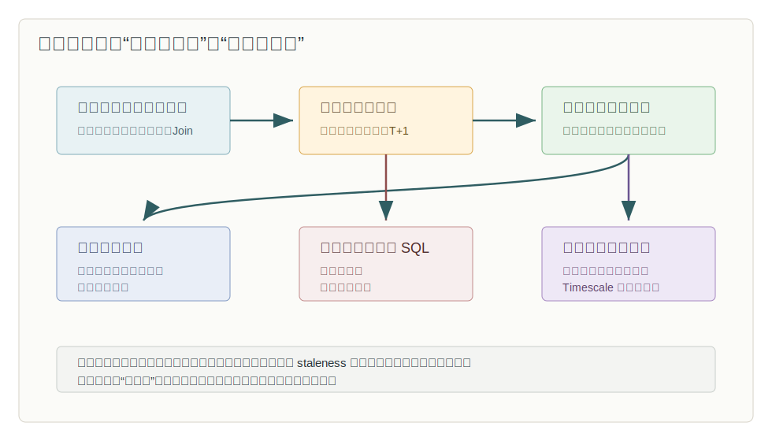

## 数据库筑基课 - 计算前置之 物化视图

### 作者
digoal

### 日期
2026-05-31

### 标签
PostgreSQL , 应用开发者 , 数据库筑基课 , 物化视图 , 计算前置 , 查询加速 , 刷新策略    

----

## 背景

  
本文属于“计算前置 + 执行结果物化 + 场景实践”的基础能力主题。当前工作区未发现“数据库筑基课”总纲文件，因此本文按用户给定标题独立成篇。

很多慢查询不是因为单次执行路径特别离谱，而是因为它在不断重复做同一件事：每天的经营看板反复聚合订单明细，BI 页面反复 join 多张宽表，风控报表反复扫描历史事件，搜索辅助表反复从远端 FDW 拉取数据。明细表仍然要保存，因为它是事实来源；但对读请求来说，每次都从事实来源重新计算，等于把计算成本塞进了在线读路径。

物化视图的核心思路很直接：

> 把“每次查询都要算”的结果提前算好，保存成一个可索引、可分析、可扫描的关系；业务查询读这个结果，刷新任务负责把结果重新生成。

在 PostgreSQL 里，这个机制有明确边界：原生物化视图保存查询定义和查询结果，但不会因为底层表变化而自动增量维护，也不会自动把普通 SQL 改写到物化视图上。它解决的是“重复、昂贵、可延迟”的读路径问题，不是实时一致性问题。

## 一、它解决什么问题？

物化视图解决的是“读时重复计算过重”的问题。它把在线查询里的扫描、过滤、join、聚合、排序、远端访问等成本，移动到刷新窗口里。

典型原问题是：

```sql
SELECT
  date_trunc('day', paid_at) AS day,
  seller_id,
  count(*) AS order_cnt,
  sum(amount) AS amount_sum
FROM orders
WHERE paid_at >= current_date - interval '90 days'
GROUP BY 1, 2;
```

如果这个 SQL 被看板每分钟触发几十次，而明细数据以亿级增长，系统会出现三类压力：

| 压力 | 表现 | 物化视图的转化 |
|---|---|---|
| CPU 重复消耗 | 同一批历史订单被反复聚合 | 刷新时聚合一次，查询时读汇总结果 |
| IO 重复扫描 | 明细表、索引、远端表反复被扫 | 查询命中更小的物化结果集 |
| 延迟不可控 | 明细增长后看板越来越慢 | 把慢操作放到可控刷新窗口 |

代价也必须同时接受：

| 代价 | 工程含义 |
|---|---|
| 新鲜度延迟 | 底层表变化后，物化视图不会自动变新 |
| 刷新成本 | `REFRESH MATERIALIZED VIEW` 仍要执行定义查询 |
| 锁与并发 | 普通刷新会阻塞读；并发刷新要求唯一索引且成本更高 |
| 空间成本 | 结果数据和索引都要占磁盘 |
| 运维责任 | 要监控刷新失败、耗时、膨胀、统计信息和 staleness |

所以物化视图不是“把所有慢 SQL 缓存一下”。正确判断是：这个查询是否重复、昂贵、结果是否允许延迟、刷新是否能被调度和监控。

## 二、它是什么？

PostgreSQL 文档把 `CREATE MATERIALIZED VIEW` 描述为：定义一个查询的物化视图；创建时执行查询并填充结果，除非使用 `WITH NO DATA`；后续可用 `REFRESH MATERIALIZED VIEW` 刷新。

从内部看，PostgreSQL 物化视图有两面：

1. 它像表：在 `pg_class` 里是一个 relation，`relkind = 'm'`，有物理存储，可以建索引，可以 `ANALYZE`，查询时直接读它的持久化结果。
2. 它像视图：创建它的查询定义通过规则系统保存，刷新时用这个定义重新生成数据。



图 1 说明：普通视图保存 SQL 定义，但查询时仍要展开到底层表执行；物化视图保存 SQL 定义和结果数据，查询时直接读结果，刷新时才回到底层表重算。结果缓存通常只缓存一次执行结果，不具备数据库对象、依赖、索引和统计信息这些关系能力。

几个容易混淆的点：

| 对象 | 保存查询定义 | 保存结果 | 可建索引 | 自动随底层表更新 | 典型用途 |
|---|---:|---:|---:|---:|---|
| 普通视图 | 是 | 否 | 否 | 每次查询实时展开 | 封装 SQL、权限边界 |
| 普通表 | 否 | 是 | 是 | 由应用写入 | 明细、汇总、事实表 |
| PostgreSQL 物化视图 | 是 | 是 | 是 | 否 | 可延迟的重复重查询 |
| 手工汇总表 | 通常否 | 是 | 是 | 由 ETL/触发器维护 | 强定制增量汇总 |
| TimescaleDB 连续聚合 | 是 | 是 | 是 | 有扩展维护策略 | 时序增量聚合场景 |

PostgreSQL 原生物化视图更接近“保存了定义查询的表”，而不是透明查询加速器。业务查询要显式访问物化视图，优化器不会自动把对底层表的查询改写成对物化视图的查询。

## 三、核心原理

### 3.1 创建：`CREATE MATERIALIZED VIEW` 复用 CTAS 路径，但额外保存查询定义

语法层面，`src/backend/parser/gram.y` 把 `CREATE MATERIALIZED VIEW ... AS SELECT ...` 构造成 `CreateTableAsStmt`，并把 `objtype` 设为 `OBJECT_MATVIEW`。这说明物化视图和 `CREATE TABLE AS` 在创建结果关系上共享大量路径。

语义分析阶段，`src/backend/parser/analyze.c` 的 `transformCreateTableAsStmt()` 对物化视图做额外限制：

- 禁止 data-modifying CTE，因为刷新或维护时语义不清。
- 禁止依赖临时对象，因为源对象可能在刷新时消失。
- 禁止外部绑定参数，因为系统不保存参数值。
- 禁止 unlogged materialized view，因为崩溃恢复后只剩空数据会造成状态表达问题。

执行阶段，`src/backend/commands/createas.c` 会把目标关系建成 `RELKIND_MATVIEW`，并调用 `StoreViewQuery()` 保存查询定义。源码注释明确说明：物化视图的“view part”会被创建出来；如果 `WITH DATA`，创建阶段也会调用刷新逻辑填充数据。



图 2 说明：物化视图先建立关系定义和规则定义。`WITH NO DATA` 只建立结构和定义，`relispopulated=false`，不能扫描；`WITH DATA` 继续走刷新逻辑生成持久化结果。

### 3.2 查询：像表一样读，不会每次展开定义查询

PostgreSQL 官方规则系统文档强调：物化视图被查询时，数据直接从物化视图返回，像表一样；保存的规则只用于填充物化视图。

这点非常关键。假设有：

```sql
CREATE MATERIALIZED VIEW daily_seller_sales AS
SELECT
  date_trunc('day', paid_at)::date AS day,
  seller_id,
  count(*) AS order_cnt,
  sum(amount) AS amount_sum
FROM orders
WHERE status = 'paid'
GROUP BY 1, 2;

CREATE UNIQUE INDEX daily_seller_sales_uk
  ON daily_seller_sales(day, seller_id);
```

之后：

```sql
SELECT *
FROM daily_seller_sales
WHERE day >= current_date - 7
  AND seller_id = 10001;
```

读的是 `daily_seller_sales` 里的结果，不是把定义查询重新套到 `orders` 上。这个结果关系可以建索引、被 `ANALYZE`，也会有普通关系的扫描、索引扫描、索引只读扫描等执行路径。

### 3.3 populated 状态：不是所有物化视图都可扫描

`pg_class.relispopulated` 表示物化视图是否已经填充。`src/include/utils/rel.h` 里 `RelationIsScannable` 和 `RelationIsPopulated` 都基于这个字段。`src/backend/commands/matview.c` 的 `SetMatViewPopulatedState()` 会更新它，并发送 relcache 失效消息。

这解释了 `WITH NO DATA` 的行为：

```sql
CREATE MATERIALIZED VIEW mv_daily_sales AS
SELECT current_date AS day, 1 AS order_cnt
WITH NO DATA;

SELECT relispopulated
FROM pg_class
WHERE oid = 'mv_daily_sales'::regclass;

-- 此时直接 SELECT * FROM mv_daily_sales 会报错：
-- materialized view "mv_daily_sales" has not been populated

REFRESH MATERIALIZED VIEW mv_daily_sales;
```

这个示例语法来自 PostgreSQL 回归测试风格；本文没有在当前工作区启动数据库实例执行，因此不提供运行输出。

### 3.4 普通刷新：创建新 heap、全量填充、交换物理文件

`REFRESH MATERIALIZED VIEW` 的主入口在 `src/backend/commands/matview.c`：

- `ExecRefreshMatView()` 根据是否 `CONCURRENTLY` 决定锁强度。
- `RefreshMatViewByOid()` 检查对象类型、选项冲突、规则定义、当前事务内活跃使用。
- 从保存的 `SELECT INSTEAD OF` rule 里取出定义查询。
- 创建新的 transient heap。
- 执行定义查询，把结果写入 transient heap。
- 非并发刷新调用 `refresh_by_heap_swap()`，最终通过 `finish_heap_swap()` 替换物理存储并重建索引。



图 3 说明：普通刷新是全量替换。好处是路径相对简单，批量装载后重建索引通常比逐行维护索引更适合大批量刷新；代价是持有 `AccessExclusiveLock`，会阻塞并发读。

锁语义在 `doc/src/sgml/mvcc.sgml` 里也有对应描述：不带 `CONCURRENTLY` 的 `REFRESH MATERIALIZED VIEW` 获得 `AccessExclusiveLock`；这是最强锁级别，会与所有锁模式冲突。

### 3.5 并发刷新：不是“不加锁”，而是用差分合并减少读阻塞

`REFRESH MATERIALIZED VIEW CONCURRENTLY` 的目标是刷新期间不挡普通 `SELECT`。但它不是完全无锁，也不是增量维护底层变化。

官方文档列出几个限制：

- 物化视图必须已经 populated。
- 不能和 `WITH NO DATA` 一起使用。
- 必须有至少一个可用的唯一索引，且索引只使用列名、覆盖全部行；不能是表达式索引，不能带 `WHERE` 条件。
- 同一个物化视图一次只能运行一个刷新。

源码中的 `is_usable_unique_index()` 更具体：索引必须 unique、valid、immediate、非 partial、至少有列，并且索引列必须是普通用户列而不是表达式或系统列。

并发刷新仍然先生成一份新的全量结果，只是后半段不用 heap swap，而是调用 `refresh_by_match_merge()`：

1. 把新结果写入临时表。
2. `ANALYZE` 新结果临时表。
3. 检查新数据里是否存在“所有列都相等且无 NULL 的重复行”。
4. 创建 diff 临时表，字段包括旧行 `ctid` 和新行复合类型。
5. 对旧物化视图和新临时表做 full join，找出只在旧侧或只在新侧的行。
6. 先 `DELETE` 旧侧多余行，再 `INSERT` 新侧新增行。
7. 丢弃临时表。



图 4 说明：并发刷新用“旧结果 vs 新全量结果”的差分来改旧物化视图。唯一索引不是为了让查询更快这么简单，而是为了给新旧行匹配提供足够的行身份保证。没有这个保证，系统无法可靠判断哪些行该删、哪些行该插。

锁语义也要说清楚：并发刷新使用 `ExclusiveLock`。这个锁允许普通 `ACCESS SHARE` 读锁并行，因此 `SELECT` 可以继续；但它仍会排斥其他写类、锁行类和另一个 refresh。

### 3.6 为什么用户不能直接改物化视图？

物化视图的结果应该由定义查询生成。用户直接 `INSERT/UPDATE/DELETE` 会破坏“结果 = 定义查询结果”的不变量。

`src/backend/executor/execMain.c` 对 `RELKIND_MATVIEW` 做了保护：除非处在内部维护上下文 `MatViewIncrementalMaintenanceIsEnabled()`，否则修改物化视图会报错。并发刷新内部需要用 `DELETE` 和 `INSERT` 应用差分，所以 `matview.c` 里有 `OpenMatViewIncrementalMaintenance()` 和 `CloseMatViewIncrementalMaintenance()` 这样的受控入口。

同理，物化视图不支持 `SELECT ... FOR UPDATE/FOR SHARE` 这类行锁操作。它可以被读，但不应该把它当作普通业务写表。

## 四、横向对比

| 维度 | PostgreSQL 物化视图 | 普通视图 | 手工汇总表 | 结果缓存 | 连续聚合/增量物化扩展 |
|---|---|---|---|---|---|
| 主要目标 | 前置重复计算 | 封装查询逻辑 | 定制化持久汇总 | 降低短期重复请求 | 自动或半自动维护时序/增量结果 |
| 查询新鲜度 | 取决于刷新频率 | 实时读底层表 | 取决于维护逻辑 | 取决于 TTL/失效 | 取决于扩展策略 |
| 写入代价 | 底层写不维护 MV，刷新时集中付费 | 无额外写入 | 写入或 ETL 时维护 | 写入无关 | 扩展承担维护逻辑 |
| 读取代价 | 读较小结果集，可索引 | 每次执行底层查询 | 读汇总表，可索引 | 命中时低 | 读物化结果和实时补偿结果 |
| 空间成本 | 保存结果和索引 | 无结果存储 | 保存结果和索引 | 保存缓存副本 | 保存物化状态和元数据 |
| 事务/MVCC | 刷新是事务性操作 | 跟随底层表事务可见性 | 由维护方式决定 | 通常不具备数据库事务语义 | 由扩展实现决定 |
| 运维重点 | 刷新窗口、锁、唯一索引、统计信息 | SQL 复杂度和权限 | 一致性、补偿、幂等 | 失效策略 | 扩展版本、刷新策略 |
| 不适合场景 | 强实时、频繁全量刷新、结果巨大 | 重查询高并发 | 逻辑简单但实时要求高 | 需要关系约束和索引 | 非扩展覆盖的复杂模型 |

这张表背后的核心原因是：PostgreSQL 原生物化视图把维护动作显式交给 `REFRESH`，因此它简单、可理解、事务边界清楚；但也因此不会自动解决增量一致性和实时查询改写。

## 五、效果如何？

物化视图的收益来自四个方向：

1. 结果集变小：明细行变成聚合行，宽 join 变成窄结果。
2. 算子减少：查询路径不再重复执行昂贵聚合、排序、远端扫描。
3. 索引可用：可以给结果列建立 B-tree、GIN、GiST 等索引。
4. 统计独立：可以对物化结果 `ANALYZE`，让优化器按结果分布估算。

但不能承诺固定提升倍数。真正效果取决于：

- 定义查询本身有多贵。
- 物化结果相比底层表缩小多少。
- 刷新频率和每次刷新数据量。
- 查询是否能命中物化视图上的索引。
- 普通刷新是否造成锁等待。
- 并发刷新是否被 diff join、DELETE/INSERT 和索引维护抵消收益。

官方规则系统文档给出过一个 `file_fdw` 远端文件访问的例子：直接扫 foreign table 要做 Foreign Scan；把数据放入物化视图并建索引后，可以走物化视图上的索引路径。这个例子说明了物化视图的机制收益，但具体耗时不能迁移到你的生产环境。

## 六、实操 DEMO

下面是一组最小实验 SQL，用来验证“创建、不可扫描状态、刷新、并发刷新前置条件、索引使用”。当前工作区没有启动 PostgreSQL 实例，以下示例未执行，不提供伪造输出。

```sql
DROP TABLE IF EXISTS orders CASCADE;

CREATE TABLE orders (
  id bigserial PRIMARY KEY,
  seller_id bigint NOT NULL,
  status text NOT NULL,
  paid_at timestamptz NOT NULL,
  amount numeric(12,2) NOT NULL
);

INSERT INTO orders (seller_id, status, paid_at, amount)
SELECT
  (g % 1000) + 1,
  'paid',
  now() - (g % 90) * interval '1 day',
  ((g % 5000) / 10.0)::numeric(12,2)
FROM generate_series(1, 100000) AS g;
```

先创建一个不填充数据的物化视图：

```sql
CREATE MATERIALIZED VIEW daily_seller_sales AS
SELECT
  date_trunc('day', paid_at)::date AS day,
  seller_id,
  count(*) AS order_cnt,
  sum(amount) AS amount_sum
FROM orders
WHERE status = 'paid'
GROUP BY 1, 2
WITH NO DATA;

SELECT relispopulated
FROM pg_class
WHERE oid = 'daily_seller_sales'::regclass;
```

此时它不可扫描。填充并建唯一索引：

```sql
REFRESH MATERIALIZED VIEW daily_seller_sales;

CREATE UNIQUE INDEX daily_seller_sales_uk
  ON daily_seller_sales(day, seller_id);

ANALYZE daily_seller_sales;
```

验证查询是否使用物化结果：

```sql
EXPLAIN (ANALYZE, BUFFERS)
SELECT *
FROM daily_seller_sales
WHERE day >= current_date - 7
  AND seller_id = 42;
```

修改底层表后，物化视图不会自动变化，需要显式刷新：

```sql
INSERT INTO orders (seller_id, status, paid_at, amount)
VALUES (42, 'paid', now(), 99.90);

-- 普通刷新：可能阻塞读
REFRESH MATERIALIZED VIEW daily_seller_sales;

-- 并发刷新：要求物化视图已 populated 且有可用唯一索引
REFRESH MATERIALIZED VIEW CONCURRENTLY daily_seller_sales;
```

运维检查可以从这些角度开始：

```sql
-- 查看物化视图定义和 populated 状态
SELECT schemaname, matviewname, hasindexes, ispopulated, definition
FROM pg_matviews
WHERE matviewname = 'daily_seller_sales';

-- 查看物化视图大小
SELECT
  pg_size_pretty(pg_relation_size('daily_seller_sales')) AS heap_size,
  pg_size_pretty(pg_total_relation_size('daily_seller_sales')) AS total_size;

-- 查看刷新是否被锁等待影响，可在另一个会话观察
SELECT pid, locktype, mode, granted, relation::regclass
FROM pg_locks
WHERE relation = 'daily_seller_sales'::regclass;
```

如果要做生产刷新，建议额外建一张刷新审计表，由调度任务记录开始时间、结束时间、是否成功、错误信息和刷新后最大业务时间戳。PostgreSQL 核心不内置周期调度，常见做法是操作系统 cron、任务平台、应用调度器或 `pg_cron` 扩展。

## 七、最佳实践

面向数据库架构师：

- 先定义新鲜度预算，例如“看板允许延迟 5 分钟”“财务日报 T+1”。没有新鲜度预算，就无法判断刷新频率。
- 优先物化稳定的历史部分，不要把“最近几秒强实时”硬塞进物化视图。
- 把物化视图当成独立读模型设计：列、粒度、索引、权限、刷新策略都要围绕访问模式，而不是简单 `SELECT *`。
- 对强实时聚合、事件驱动增量更新、滑动窗口大规模刷新，评估手工汇总表、流处理、TimescaleDB continuous aggregate 或专用 OLAP 引擎。

面向 DBA：

- 普通刷新适合窗口明确、结果较大、读阻塞可接受的场景；它路径简单，批量加载后重建索引。
- 并发刷新适合读不可中断、变化相对较小、能提供可用唯一索引的场景；它不是免费午餐。
- 为 `REFRESH CONCURRENTLY` 提前设计唯一键。表达式唯一索引、partial unique index 都不能满足 PostgreSQL 的并发刷新条件。
- 刷新后关注 `ANALYZE`。刷新会改变结果分布，统计信息过旧会影响后续查询计划。
- 监控 `pg_relation_size`、`pg_total_relation_size`、刷新耗时、锁等待和失败率。并发刷新通过 DELETE/INSERT 改旧结果，长期运行也要关注膨胀和 VACUUM。

面向业务开发者：

- 查询时显式访问物化视图，不要假设数据库会自动改写到底层物化结果。
- 不要直接写物化视图。要改结果，改底层事实表，然后刷新。
- 不要在定义查询里依赖临时表、会创建临时对象的函数、外部参数或不稳定的 session 环境。
- 不要依赖定义查询里的 `ORDER BY` 保证刷新后物理顺序。官方文档说明，刷新不保证保留原排序。
- 给用户界面展示数据时间，例如“统计截至 2026-05-31 10:00:00”，避免把延迟结果伪装成实时结果。

## 八、适合与不适合场景

适合：

- 读多写少或读压力远高于刷新压力的报表。
- 历史数据聚合，例如日、小时、城市、品类、卖家维度汇总。
- 远端数据、本地文件 FDW、复杂 join 的本地加速副本。
- 结果集显著小于源数据，且能建立有效索引。
- 数据允许分钟级、小时级、日级延迟。

不适合：

- 强实时余额、库存、风控拦截等不能接受旧结果的链路。
- 底层数据高频变化，而每次刷新都必须全量重算巨大结果。
- 结果几乎和源表一样大，读路径没有明显缩小。
- 需要自动增量维护或自动查询改写，但又只使用 PostgreSQL 核心能力。
- 无法承受刷新锁等待，也无法满足并发刷新的唯一索引条件。



图 5 说明：是否使用物化视图，先看查询是否重复且昂贵，再看业务是否允许延迟，最后看刷新能否被调度、加锁、监控和回滚。三者缺一，物化视图就可能把一个查询问题变成一个运维问题。

## 九、常见坑

1. 把物化视图当实时表

底层表变化不会自动刷新物化视图。用户看到的是上一次刷新结果，不是当前事实表结果。必须给刷新频率和数据时间戳建立明确约定。

2. 忘记 `WITH NO DATA` 后不可扫描

`WITH NO DATA` 创建的是未填充状态，`relispopulated=false`。直接查询会报“has not been populated”。这不是权限问题，也不是空表，而是不可扫描状态。

3. 以为 `CONCURRENTLY` 不需要条件

并发刷新必须已经 populated，必须有可用唯一索引，不能和 `WITH NO DATA` 一起使用。唯一索引还必须覆盖全部行且只引用普通列。

4. 用 partial unique index 或表达式 unique index 充当并发刷新条件

源码 `is_usable_unique_index()` 会拒绝 partial index、表达式列、系统列。回归测试里也覆盖了表达式唯一索引和 predicate 唯一索引不能满足并发刷新的情况。

5. 忽略刷新锁

普通刷新拿 `AccessExclusiveLock`，会阻塞读。并发刷新允许普通读，但仍然拿 `ExclusiveLock`，并且同一物化视图不能并行刷新。

6. 刷新后不更新统计信息

如果结果分布变化明显，而统计信息过旧，查询物化视图也可能走差计划。刷新任务后可根据数据量和变化程度安排 `ANALYZE`。

7. 结果排序依赖定义里的 `ORDER BY`

官方 `REFRESH MATERIALIZED VIEW` 文档说明：定义查询里有 `ORDER BY` 时，初始内容可能按此排序，但刷新不保证保留排序。应用查询需要顺序时，必须在查询里写 `ORDER BY`。

8. 把物化视图定义写得过宽

`SELECT *`、包含大量不被查询使用的列、过细粒度汇总，都会扩大物化结果和刷新成本。物化视图应该服务明确读模型。

9. 忽略权限和安全上下文

刷新会切换到物化视图 owner 执行，并限制 `search_path` 到 `pg_catalog, pg_temp`。定义查询里依赖隐式 search_path 或不安全函数，后续刷新可能失败。

10. 忘记备份恢复顺序

`pg_dump` 对物化视图会处理定义、依赖、索引和刷新顺序。复杂的物化视图依赖链会影响恢复耗时和顺序，生产环境要在演练里验证。

## 十、扩展问题

1. 如果你的物化视图每 5 分钟刷新一次，但每次刷新要 8 分钟，应该降低频率、缩小结果、拆分冷热数据，还是改成增量维护？

2. 如果一个查询既需要“历史汇总快”，又需要“最近 1 分钟实时”，能否用“历史物化视图 + 最近明细实时补偿”的 union 模型？

3. 并发刷新要求唯一索引。你的读模型天然有唯一键吗？如果没有，是粒度设计错了，还是这个结果本身就不适合并发刷新？

4. 物化视图和手工汇总表的边界在哪里？什么时候你需要触发器、逻辑复制、流处理或批处理任务，而不是 `REFRESH`？

5. 如果物化视图上再建物化视图，刷新顺序如何编排？如何记录每一层的数据截止时间？

## 十一、扩展阅读

- PostgreSQL 官方文档：`doc/src/sgml/ref/create_materialized_view.sgml`，`CREATE MATERIALIZED VIEW` 语法、`WITH [NO] DATA`、访问方法、存储参数和安全限制。
- PostgreSQL 官方文档：`doc/src/sgml/ref/refresh_materialized_view.sgml`，`REFRESH MATERIALIZED VIEW`、`CONCURRENTLY`、唯一索引要求、锁读行为和排序注意事项。
- PostgreSQL 官方文档：`doc/src/sgml/rules.sgml` 的 `rules-materializedviews` 小节，说明物化视图通过规则系统保存查询定义，但查询时直接读持久化结果。
- PostgreSQL 官方文档：`doc/src/sgml/mvcc.sgml` 的锁模式章节，说明普通刷新和并发刷新对应的锁级别。
- PostgreSQL 源码：`src/backend/parser/gram.y`，`CreateMatViewStmt` 和 `RefreshMatViewStmt` 语法节点。
- PostgreSQL 源码：`src/backend/parser/analyze.c`，`transformCreateTableAsStmt()` 对物化视图定义查询的限制。
- PostgreSQL 源码：`src/backend/commands/createas.c`，物化视图复用 CTAS 路径并调用 `StoreViewQuery()`。
- PostgreSQL 源码：`src/backend/commands/matview.c`，`ExecRefreshMatView()`、`RefreshMatViewByOid()`、`refresh_by_heap_swap()`、`refresh_by_match_merge()` 和 `is_usable_unique_index()`。
- PostgreSQL 源码：`src/backend/catalog/system_views.sql`，`pg_matviews` 系统视图定义。
- PostgreSQL 源码：`src/backend/executor/execMain.c`，禁止用户直接修改物化视图和禁止行锁。
- PostgreSQL 回归测试：`src/test/regress/sql/matview.sql` 和 `src/test/regress/expected/matview.out`，覆盖 populated 状态、并发刷新限制、临时对象限制、重复数据和索引条件等行为。
- DeepWiki：`postgres/postgres` 关于 PostgreSQL materialized view implementation 的仓库解读，用于辅助定位源码路径；关键结论已按上述源码和官方文档核对。
  
## 附录 

1、克隆代码  
```  
git clone --depth 1 https://github.com/postgres/postgres
```  
  
2、启用 codex, 使用 [数据库筑基课 skill](../skills/README.md).  
```
文章标题: 
  数据库筑基课 - 计算前置之 物化视图
项目源码(本地目录): 
  postgres
项目 codebase 文件名: 
  postgres/CLAUDE.md 
开源项目相关的 deepwiki repoName: 
  postgres/postgres
```
  
  
#### [PostgreSQL 解决方案集合](../201706/20170601_02.md "40cff096e9ed7122c512b35d8561d9c8")
  
  
#### [德哥 / digoal's Github - 公益是一辈子的事.](https://github.com/digoal/blog/blob/master/README.md "22709685feb7cab07d30f30387f0a9ae")
  
  
#### [About 德哥](https://github.com/digoal/blog/blob/master/me/readme.md "a37735981e7704886ffd590565582dd0")
  
  

  
