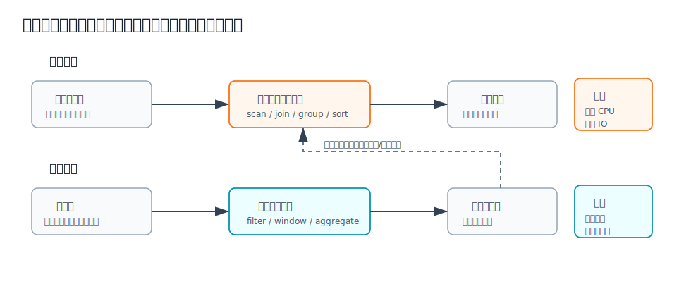
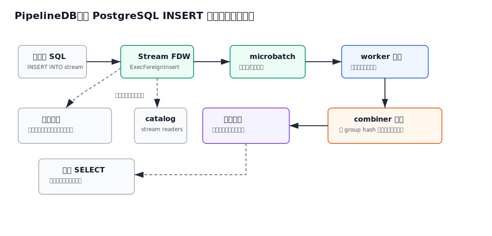
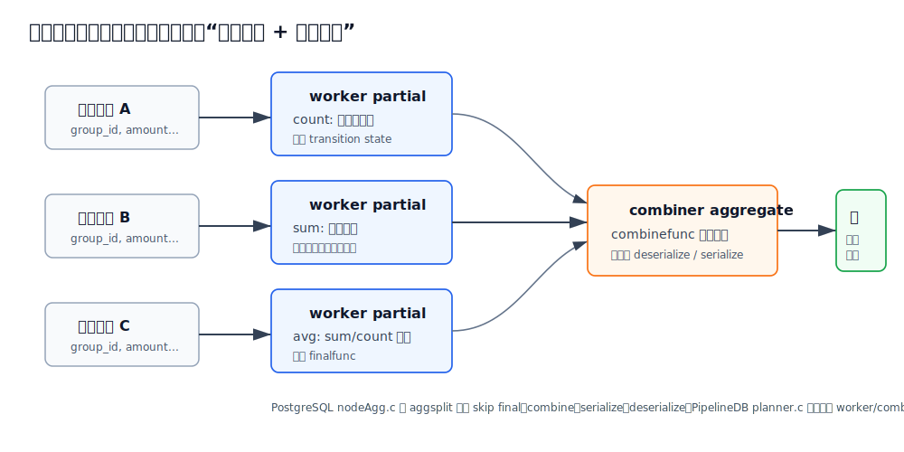
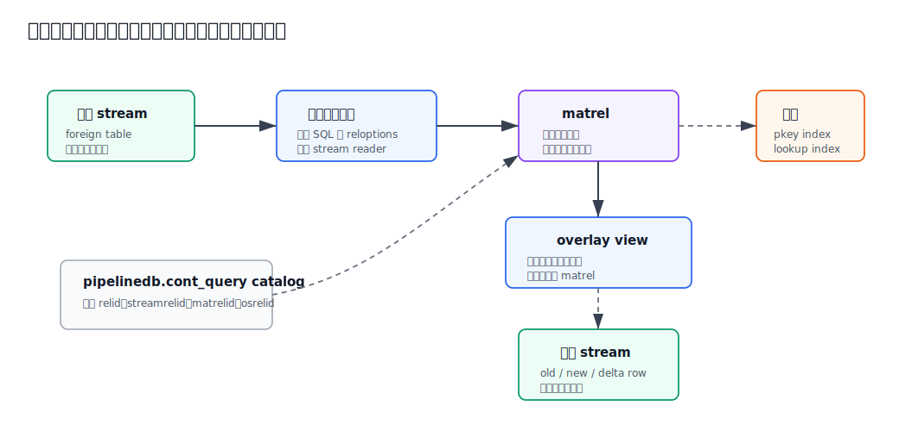
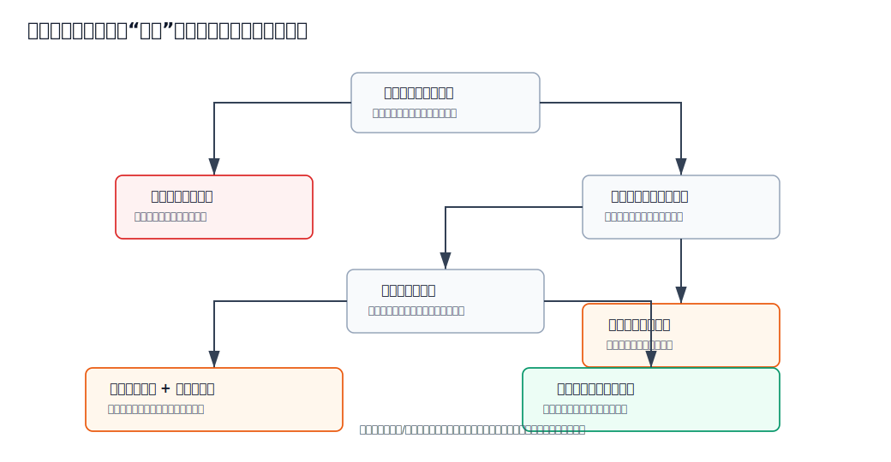

## 数据库筑基课 - 计算前置之 流计算

### 作者
digoal

### 日期
2026-05-31

### 标签
PostgreSQL , 应用开发者 , 数据库筑基课 , 流计算 , 计算前置 , 连续视图 , PipelineDB , 实时聚合    

----

## 背景
  


本文属于“计算前置 + 查询执行 + 场景实践”的基础能力主题。当前工作区未发现“数据库筑基课”总纲文件，因此本文按用户给定标题独立成篇。

很多业务一开始只需要查明细：订单、点击、传感器、风控事件、IoT 上报、日志。等数据量变大，系统真正慢下来的往往不是单条写入，而是这些写入之后被反复聚合：

```sql
SELECT
  date_trunc('minute', ts) AS m,
  device_id,
  count(*) AS event_cnt,
  avg(value) AS avg_value
FROM event_log
WHERE ts >= now() - interval '1 hour'
GROUP BY 1, 2;
```

如果看板每 5 秒刷一次、告警每 10 秒跑一次、API 每秒查很多次，同一批历史事件会被不断扫描、过滤、分组、聚合。明细越多，读路径越重；读路径越重，越想加缓存；缓存越多，又会引入失效、新鲜度和一致性问题。

流计算的核心思路是：

> 不等查询来了再从头算，而是在事件到达时就把可增量维护的结果更新好；查询只读已经维护好的状态。

这和上一篇《[数据库筑基课 - 计算前置之 物化视图](20260531_32.md)》是一组相邻技术。物化视图通常把计算前置到“刷新窗口”；流计算把计算进一步前置到“写入流 / 事件到达时”。代价也更硬：你必须处理顺序、迟到、重放、幂等、后台执行、状态膨胀和失败恢复。

## 一、它解决什么问题？

流计算解决的是“高频读同一类聚合结果”的问题。它把原来由每次 `SELECT` 承担的重复计算，移动到写入路径或后台流处理路径。



图 1 说明：读时计算保留了最简单的数据模型，但每个读请求都可能重新扫描大量明细。流式计算把成本前移，持续维护一个较小的状态表或结果表，让读请求从“大明细 + 大计算”变成“小状态 + 小查询”。

典型场景包括：

| 场景 | 原始做法 | 流计算转化 |
|---|---|---|
| 实时看板 | 每次查订单、日志、点击明细 | 写入时维护分钟级、小时级聚合 |
| 告警指标 | 周期扫描最近窗口 | 事件进入窗口时更新计数、均值、最大值 |
| 排行榜 | 高频 `GROUP BY + ORDER BY` | 持续维护 top-N 或分组分数 |
| 风控特征 | 请求时查最近行为 | 持续维护用户、设备、IP 的窗口特征 |
| IoT 监控 | 反复聚合设备上报 | 按设备和时间桶维护状态 |

它牺牲的东西也很明确：

| 代价 | 工程含义 |
|---|---|
| 写入变重 | 插入事件不再只是落表，还要投递、分组、聚合或等待后台处理 |
| 状态复杂 | 聚合状态要持久化、索引、清理、回滚或重建 |
| 语义复杂 | 需要定义事件时间、处理时间、迟到事件、窗口关闭、重复事件 |
| 排障复杂 | 后台 worker、队列、IPC、批大小、积压、失败恢复都要观测 |
| 可重算能力变弱 | 如果原始事件不保存，出错后只能从外部日志或上游重放 |

所以流计算不是“实时版物化视图”这么简单。更准确地说，它是一种把可交换、可合并、可窗口化的计算从读路径迁移到数据到达路径的系统设计。

## 二、它是什么？

从数据库视角看，流计算由四个层次组成：

1. **事件入口**：数据以 append-only 事件形式进入系统，可以是消息队列、日志、FDW stream、普通表触发器或复制流。
2. **连续查询**：预先注册的 SQL 或算子图，描述从事件流到状态表的转换，例如过滤、投影、分组、窗口、聚合。
3. **状态维护**：把中间状态或最终结果保存起来，例如 `count`、`sum`、HLL、top-k、窗口桶、分组 hash 表。
4. **查询出口**：业务读取已维护状态，而不是每次扫描全部原始事件。

PipelineDB 是一个很适合学习这个模型的 PostgreSQL 生态案例。它的 README 明确描述：PipelineDB 是 PostgreSQL extension，用 continuous SQL queries 持续聚合 time-series data，只把 aggregate output 存在可查询表中，raw time-series data never written to disk。它的本地 `CLAUDE.md` 也把核心概念概括为 Streams、Continuous Views、Combiners、Workers/Scheduler。

一个最小使用形态如下：

```sql
CREATE EXTENSION pipelinedb;

CREATE FOREIGN TABLE test_stream (
  key integer,
  value integer
) SERVER pipelinedb;

CREATE VIEW test_view
WITH (action=materialize) AS
SELECT key, count(*) AS count
FROM test_stream
GROUP BY key;

INSERT INTO test_stream (key, value)
SELECT (random() * 10)::int, (random() * 10)::int
FROM generate_series(1, 100000);

SELECT sum(count) FROM test_view;
```

这个例子来自 PipelineDB README 的 getting started 路径。本文没有在当前工作区启动 PostgreSQL 10/11 + PipelineDB 环境执行，因此不提供实际运行输出。

需要特别说明：PipelineDB README 写明不会有 `1.0.0` 之后的新 release，并且本地说明显示它支持 PostgreSQL 10.x 和 11.x。今天写它，不是建议在新生产系统里直接采用它，而是把它当成“数据库内流计算”机制的清晰样本。

## 三、核心原理

### 3.1 从普通 INSERT 到事件微批

PipelineDB 把 stream 表达成 foreign table。`src/stream_fdw.c` 的 `stream_fdw_handler()` 返回 `FdwRoutine`，既实现 scan 回调，也实现 insert 回调：

- `GetForeignRelSize` / `GetForeignPaths` / `GetForeignPlan`
- `BeginForeignScan` / `IterateForeignScan` / `EndForeignScan`
- `PlanForeignModify` / `BeginForeignModify` / `ExecForeignInsert` / `EndForeignModify`

这符合 PostgreSQL FDW 的扩展接口。PostgreSQL `src/include/foreign/fdwapi.h` 定义了 `GetForeignPlan`、`BeginForeignScan`、`IterateForeignScan` 等回调类型；官方 `fdwhandler.sgml` 也说明 FDW handler 返回一个包含这些 callback 的 `FdwRoutine`。

PipelineDB 的关键变化在写入路径：

1. `BeginStreamModify()` 查找这个 stream 的本地 reader，也就是订阅该 stream 的连续查询。
2. 如果没有 reader，写入没有持续计算目标，可以直接返回。
3. 如果有 reader，创建 `microbatch_t`，并按当前 `stream_insert_level` 决定是否需要 ack。
4. `ExecStreamInsert()` 把 tuple 加入 microbatch；超过 `continuous_query_batch_size` 或 packed size 上限时发送给 worker。
5. `EndStreamModify()` 发送剩余 microbatch，并在同步级别需要时等待 ack。



图 2 说明：客户端仍然使用 SQL `INSERT`，但目标不是普通 heap table，而是 PipelineDB 的 stream FDW。写入被切成 microbatch，worker 执行连续查询，combiner 合并状态并更新物化关系。用户查询连续视图时读的是已维护的聚合结果。

`src/microbatch.c` 解释了为什么要微批：单行处理太贵，批处理可以摊薄 IPC、执行器初始化和聚合开销。源码里 `microbatch_add_tuple()` 同时受条数和 packed size 约束；`microbatch_ack_wait()` 支持异步、收到即确认、提交后确认、flush 等不同等待语义。这也是流计算的第一条工程边界：低延迟不是免费，可靠性级别越高，写入等待越重。

### 3.2 worker：把连续查询计划跑在微批上

PipelineDB 的 worker 是 PostgreSQL background worker。`src/config.c` 在 `_PG_init()` 路径注册 scheduler；`src/scheduler.c` 再用 `RegisterDynamicBackgroundWorker()` 为每个数据库启动 worker、combiner、queue、reaper 等进程。配置项 `pipelinedb.num_workers` 和 `pipelinedb.num_combiners` 控制每个数据库的并行连续查询 worker 和 combiner 数量。

PostgreSQL 官方 background worker 文档强调：扩展可以注册后台进程，它们能访问 shared memory，也可以连接数据库执行事务和查询；但 C 语言后台进程有鲁棒性和安全风险，管理员应谨慎启用。

PipelineDB worker 主循环在 `src/worker.c`：

1. `ContExecutorStartBatch()` 从 IPC 中拉取一批事件。
2. `ContExecutorStartNextQuery()` 遍历这批事件涉及的连续查询。
3. 为当前连续查询创建 executor state 和 snapshot。
4. `init_plan()` 初始化计划，`ExecuteContPlan()` 执行查询计划。
5. `flush_tuples()` 把 worker 输出刷给 combiner 或 transform 输出函数。

这里重要的是：PipelineDB 没有另写一个 SQL 引擎。它把连续查询转成 PostgreSQL plan，再复用 PostgreSQL executor 执行，只是把普通表扫描替换成从 microbatch 读取事件，把输出目标替换成后续 combiner 或 transform。

### 3.3 partial aggregate 与 combine aggregate

流式聚合要高吞吐，不能每来一行都直接更新最终状态表。更常见的结构是：

1. worker 对自己拿到的微批做局部聚合。
2. worker 输出每个 group 的 partial state。
3. combiner 按 group hash 分片，合并 partial state。
4. combiner 再更新最终物化关系。



图 3 说明：worker partial 不是最终结果，而是 PostgreSQL 聚合的 transition state。combiner 使用 combine function 合并多个 transition state。对于内部状态类型，还可能需要 serialize / deserialize 才能跨进程传递。

PostgreSQL 原生聚合执行器已经有这个机制。`src/backend/executor/nodeAgg.c` 的文件头说明 `aggsplit` 可选择 skip final、用 combinefunc 替代 transfunc、对输出 serialize、对输入 deserialize；它还明确说 planner 负责把这些 Agg node 以有意义的方式连接起来。`nodeAgg.c` 后续逻辑在 `DO_AGGSPLIT_COMBINE` 时使用 `aggcombinefn`，没有 combine function 会报错。

官方 parallel aggregation 文档也说明 PostgreSQL 支持两阶段聚合：worker 先产生 `Partial Aggregate`，leader 再 `Finalize Aggregate`；每个 aggregate 必须 parallel safe 并有 combine function，`internal` transition state 还需要 serialization/deserialization function。

PipelineDB 借用了这个能力。`src/planner.c` 的 `make_aggs_partial()` 把 worker 聚合标记为 `AGGSPLIT_INITIAL_SERIAL`；`make_aggs_combinable()` 把 combiner 聚合改成 `AGGSPLITOP_COMBINE | AGGSPLITOP_DESERIALIZE | AGGSPLITOP_SERIALIZE | AGGSPLITOP_SKIPFINAL`，并重写 targetlist 里的 `Aggref`。这就是“数据库内流计算”能保持 SQL 聚合语义的核心原因之一：它不是把 `count/sum/avg` 硬编码成特殊路径，而是让 PostgreSQL 聚合状态模型承担分布式合并语义。

### 3.4 combiner：按 group hash 分片，减少最终状态冲突

`src/combiner_receiver.c` 展示了 worker 到 combiner 的分发逻辑：

- `combiner_receive()` 对输出 slot 计算 group hash。
- 如果有 group key，就按 group hash 分片；没有 group key，就按连续查询名 hash。
- `flush_to_combiner()` 为每个 combiner 构造 `CombinerTuple` microbatch，再发送过去。

这个设计的目标是让同一个 group 尽量落到同一个 combiner，避免多个后台进程同时争抢同一个聚合状态。`src/combiner.c` 里 `get_values()` 的注释进一步说明：incoming groups 的 hash 会被用来和 matrel 中已有 group 连接，lookup index 也围绕这个 hash 建立，以保持较高基数并避免依赖实际 group 选择率。

这带来三个重要取舍：

| 维度 | 好处 | 代价 |
|---|---|---|
| 按 group hash 分片 | 同 group 合并集中，减少写冲突 | 热点 group 会让某个 combiner 变成瓶颈 |
| microbatch 合并 | 摊薄 IPC 和执行开销 | 批越大，端到端延迟越高 |
| lookup index | 快速找到已有 group 状态 | 状态表和索引会膨胀，需要维护 |

### 3.5 连续视图背后是一组对象

很多人把 continuous view 理解成“会自动刷新的 view”。这个说法太粗。PipelineDB 的 `src/pipeline_query.c` 显示，创建连续视图时至少会涉及：

- 输入 stream。
- `pipelinedb.cont_query` catalog 记录。
- 用户可见的 overlay view。
- 真实保存状态的 matrel。
- 保存定义查询的 defrel。
- 输出 stream，包含 old row、new row，非 sliding window 场景还包含 delta row。
- lookup index 和 primary key index。
- worker plan、combiner plan、group lookup plan 的预检查。



图 4 说明：连续视图不是一个孤立对象，而是 stream、catalog、物化关系、overlay view、输出 stream、索引和后台计划的组合。用户看到的是一个可查询的 view 名，系统维护的是一套状态化执行结构。

这解释了为什么连续视图比普通物化视图难运维：普通物化视图主要关心刷新任务、锁和 staleness；连续视图还要关心后台进程是否活着、队列是否积压、状态表是否膨胀、reader metadata 是否同步、DDL 是否和执行互斥。

### 3.6 乱序、窗口和原始数据不落盘

PipelineDB README 的一个强声明是 raw time-series data never written to disk。这个设计让聚合 workload 很省空间：如果你只关心每分钟设备平均值，就不必在数据库里保存每个原始上报事件。

但这是双刃剑：

- 如果业务需要审计、回放、纠错、重新定义指标，数据库里没有原始事件会很痛。
- 如果上游能保留 Kafka/Pulsar/日志文件，数据库内只保留聚合状态就合理。
- 如果没有外部可重放日志，流式状态一旦算错，很难补。

窗口语义也一样。PipelineDB 支持 sliding window continuous view，测试用例里常见 `arrival_timestamp > clock_timestamp() - interval '60 second'` 这样的写法。这里的 `arrival_timestamp` 是处理时间味道更重的字段：`stream_fdw.c` 在投影事件时，如果输出 tuple 缺少 `arrival_timestamp`，会赋当前时间。它适合“到达数据库后的最近 N 秒”语义，但不等同于严格事件时间水位线模型。

## 四、横向对比

| 维度 | 流计算 / 连续视图 | PostgreSQL 物化视图 | 普通读时聚合 | 外部流引擎 + 数据库 |
|---|---|---|---|---|
| 主要目标 | 事件到达时持续维护结果 | 定时或手动刷新结果 | 每次查询实时计算 | 用专用流系统维护状态，数据库服务查询 |
| 新鲜度 | 秒级或亚秒到秒级，取决于批和 ack | 刷新周期决定 | 查询时最新快照 | 取决于流引擎、sink 和一致性配置 |
| 写入代价 | 高，写入触发投递和后台处理 | 低，刷新时集中付费 | 低 | 中到高，上游队列和 sink 也要付费 |
| 读取代价 | 低，读状态表 | 低，读物化结果 | 高，扫明细并聚合 | 低，读服务化结果 |
| 原始数据 | 可不入库，需外部保留重放 | 通常底表保留 | 底表保留 | 队列/湖/明细库通常保留 |
| SQL 亲和性 | 高，但受连续查询限制 | 高 | 最高 | 取决于引擎和 sink |
| 运维复杂度 | 高，后台进程、队列、状态、失败恢复 | 中，刷新和锁 | 低到中，主要调 SQL | 高，跨系统链路 |
| 适合场景 | 高频实时指标、状态小于明细很多 | 可延迟报表、周期汇总 | 临时分析、低频查询 | 大规模事件流、严格重放、多消费者 |
| 不适合场景 | 需要完整审计但没有外部日志 | 秒级实时 | 高频大明细聚合 | 团队无法承担多系统运维 |

这张表的关键不是“哪个更先进”，而是成本位置不同。普通读时聚合把成本放在用户请求上；物化视图把成本放在刷新任务上；流计算把成本放在写入和后台持续执行上；外部流引擎把成本放在专用流平台上。

## 五、效果如何？

流计算的收益来自三个压缩：

1. **读路径压缩**：读请求不扫明细，只扫小得多的状态表。
2. **计算次数压缩**：同一个事件只被连续查询处理一次或少数几次，而不是被每个看板请求反复处理。
3. **状态尺寸压缩**：如果业务只需要聚合结果，状态表大小约等于 group 数量或窗口桶数量，而不是事件数量。

但性能不会凭空变好。主要瓶颈会转移：

| 瓶颈 | 表现 | 验证方式 |
|---|---|---|
| 写入等待 | `INSERT` 延迟上升 | 比较异步、receive ack、commit ack 模式 |
| microbatch 积压 | 指标延迟上升 | 监控 batch 数、queue 内存、worker 消费速率 |
| group 热点 | 单个 combiner CPU 高 | 看 group 基数、hash 分布、top group 占比 |
| 状态表膨胀 | 查询变慢、索引变大 | 观察 matrel 行数、索引大小、vacuum/analyze |
| 聚合不可组合 | 不能拆成 partial/combine | 检查 aggregate 是否有 combine/serial/deserial |
| DDL 与执行冲突 | drop/alter 卡住或失败 | 观察执行锁、后台进程状态和错误日志 |

如果一个流式结果的 group 数接近事件数，例如按 `request_id` 聚合，那它几乎没有状态压缩，甚至比明细表更复杂。流计算适合“很多事件折叠成少量状态”的 workload。

## 六、实操 DEMO

下面示例用于理解语义。当前工作区没有启动 PostgreSQL 10/11 + PipelineDB 实例，未执行这些 SQL。

### 6.1 PipelineDB 风格连续视图

```sql
CREATE EXTENSION pipelinedb;

CREATE FOREIGN TABLE sensor_stream (
  device_id text,
  value numeric,
  ts timestamptz
) SERVER pipelinedb;

CREATE VIEW sensor_minute_stat
WITH (action=materialize) AS
SELECT
  device_id::text,
  date_trunc('minute', arrival_timestamp) AS bucket,
  count(*) AS n,
  avg(value::numeric) AS avg_value,
  max(value::numeric) AS max_value
FROM sensor_stream
GROUP BY 1, 2;

INSERT INTO sensor_stream (device_id, value, ts)
SELECT
  'dev-' || (g % 100),
  random() * 100,
  clock_timestamp()
FROM generate_series(1, 100000) AS g;

SELECT *
FROM sensor_minute_stat
WHERE device_id = 'dev-1'
ORDER BY bucket DESC
LIMIT 5;
```

这个例子体现三个点：

1. `sensor_stream` 是事件入口，不是长期明细表。
2. `sensor_minute_stat` 保存的是连续维护的聚合结果。
3. 查询时读结果表语义，而不是每次重扫 100000 条事件。

### 6.2 只用原生 PostgreSQL 模拟“计算前置”

如果不用 PipelineDB，最保守的做法是保留明细表，再用批处理或调度任务维护汇总表：

```sql
CREATE TABLE sensor_event (
  device_id text NOT NULL,
  value numeric NOT NULL,
  ts timestamptz NOT NULL DEFAULT clock_timestamp()
);

CREATE TABLE sensor_minute_stat (
  device_id text NOT NULL,
  bucket timestamptz NOT NULL,
  n bigint NOT NULL,
  sum_value numeric NOT NULL,
  max_value numeric NOT NULL,
  PRIMARY KEY (device_id, bucket)
);

INSERT INTO sensor_minute_stat AS s
SELECT
  device_id,
  date_trunc('minute', ts) AS bucket,
  count(*) AS n,
  sum(value) AS sum_value,
  max(value) AS max_value
FROM sensor_event
WHERE ts >= now() - interval '5 minutes'
GROUP BY 1, 2
ON CONFLICT (device_id, bucket) DO UPDATE
SET
  n = EXCLUDED.n,
  sum_value = EXCLUDED.sum_value,
  max_value = EXCLUDED.max_value;
```

这不是严格流计算，而是“短周期批处理 + 汇总表”。它的好处是简单、可重算、易排障；坏处是新鲜度和重复扫描窗口受调度周期影响。很多系统先做到这一步就够了，不必一开始就引入数据库内流引擎或外部流平台。

## 七、最佳实践

### 7.1 数据库架构师

先判断计算是否真的可以前置。满足以下条件时才适合流计算：

- 指标被高频读取。
- 聚合结果比明细小很多。
- 聚合函数可以增量维护或状态可合并。
- 业务能接受定义好的新鲜度和迟到处理规则。
- 原始事件有外部日志或业务不需要回放。

架构上尽量把“事实来源”和“服务化状态”分开。数据库内连续视图可以做低延迟服务化状态，但如果事件有审计、训练、重放、纠错价值，原始事件应该进入日志、湖仓或明细库。

### 7.2 DBA

重点监控的不再只是 SQL 慢不慢，还包括后台执行链路：

- worker / combiner / queue / reaper 是否存活。
- microbatch 条数、大小、积压和 ack 等待。
- matrel 行数、索引大小、膨胀、autovacuum、ANALYZE。
- 热点 group 是否导致单个 combiner 饱和。
- DDL、DROP、ALTER 和连续执行是否互相阻塞。
- `max_worker_processes` 是否足够容纳扩展后台进程。

PipelineDB `src/scheduler.c` 明确会计算每个数据库所需 background worker slot，容量不足会报错并提示增加 `max_worker_processes`。这类扩展不是“装一个 SQL 函数”那么轻，它会占用数据库后台进程预算。

### 7.3 业务开发者

建模时不要直接按请求 ID、事件 ID 做连续聚合。要问三个问题：

1. group key 的基数会不会无限增长？
2. 窗口是否会关闭，旧状态是否能清理？
3. 同一个事件重复到达时，结果是否会被重复计数？

业务 SQL 里要把“事件时间”和“到达时间”讲清楚。`arrival_timestamp` 适合表达“进入数据库后的最近 N 秒”；如果业务按设备产生时间计算，就要把 `event_time` 作为显式字段，并设计迟到策略。

## 八、适合与不适合场景

适合：

- 实时看板、告警、监控指标。
- 高频查询的计数、求和、均值、最大最小、近似去重、top-k。
- 明细价值低，或者明细已经在外部日志系统保留。
- group 数和窗口桶数量远小于事件数。
- 业务能接受秒级延迟和明确的迟到语义。

不适合：

- ad hoc 分析，查询形态经常变。
- 每次查询都要求任意维度 drill-down 到原始明细。
- 必须严格按事件时间处理大量迟到、撤回、修正事件，但系统没有水位线和重放机制。
- 聚合状态和事件一样多，例如按唯一请求 ID 聚合。
- 团队没有能力监控后台进程、队列、状态表和失败补偿。



图 5 说明：如果只是低频查询，保留读时计算最简单；如果允许分钟级延迟，物化视图或汇总表通常更稳；如果需要秒级状态但又必须保留完整事件，应优先考虑消息队列加外部流引擎；只有当数据库内状态维护能明显降低系统复杂度时，才值得把流计算放进数据库。

## 九、常见坑

1. **把流计算当缓存**

   缓存通常可以丢，可以失效后重算；流式状态如果没有原始事件重放，丢了就可能丢业务事实。状态表要按数据资产管理，而不是按临时缓存管理。

2. **只看读延迟，不看写放大**

   流计算把读成本搬走了，但会增加写路径、后台执行和状态维护成本。写入高峰时，microbatch、queue、combiner 才是关键。

3. **窗口语义没定义**

   “最近 5 分钟”到底按事件发生时间、进入数据库时间，还是被 worker 处理的时间？迟到 2 分钟的数据算不算？不定义清楚，指标会长期对不上。

4. **group key 基数失控**

   按用户、设备、城市聚合可能合理；按 request_id、trace_id 聚合通常会让状态表接近明细表规模。

5. **自定义聚合不能合并**

   PostgreSQL 的两阶段聚合依赖 combine function。`internal` 状态还要 serial/deserial。没有这些函数，扩展很难把它安全拆成 worker partial 和 combiner combine。

6. **忽略版本和生命周期**

   PipelineDB 是重要案例，但它支持的是 PostgreSQL 10/11，且 README 明确不会有 `1.0.0` 后的新 release。生产选型要看当前维护状态、版本兼容性和社区活跃度。

## 十、扩展问题

1. 一个指标如果可以用物化视图每分钟刷新，为什么还要做流计算？
2. 如果原始事件不落数据库，重算、纠错、审计靠什么完成？
3. `avg()` 的流式状态为什么不能只保存最终平均值？
4. 热点 group 导致单个 combiner 压力过大时，能否拆 key？拆 key 后如何再合并？
5. 事件时间窗口和处理时间窗口在业务解释上有什么差异？
6. 数据库内流计算与 Kafka/Flink/RisingWave/Materialize 这类系统的边界在哪里？

## 十一、扩展阅读

- PipelineDB README：`/Users/digoal/new/pipelinedb/README.md`
- PipelineDB codebase notes：`/Users/digoal/new/pipelinedb/CLAUDE.md`
- PipelineDB stream FDW：`/Users/digoal/new/pipelinedb/src/stream_fdw.c`
- PipelineDB microbatch：`/Users/digoal/new/pipelinedb/src/microbatch.c`
- PipelineDB worker executor：`/Users/digoal/new/pipelinedb/src/worker.c`、`/Users/digoal/new/pipelinedb/src/executor.c`
- PipelineDB combiner：`/Users/digoal/new/pipelinedb/src/combiner.c`、`/Users/digoal/new/pipelinedb/src/combiner_receiver.c`
- PipelineDB continuous query definition：`/Users/digoal/new/pipelinedb/src/pipeline_query.c`
- PipelineDB scheduler/config：`/Users/digoal/new/pipelinedb/src/scheduler.c`、`/Users/digoal/new/pipelinedb/src/config.c`
- PostgreSQL FDW API：`/Users/digoal/new/postgres/src/include/foreign/fdwapi.h`、`/Users/digoal/new/postgres/doc/src/sgml/fdwhandler.sgml`
- PostgreSQL aggregate executor：`/Users/digoal/new/postgres/src/backend/executor/nodeAgg.c`
- PostgreSQL parallel aggregation docs：`/Users/digoal/new/postgres/doc/src/sgml/parallel.sgml`
- PostgreSQL `CREATE AGGREGATE` docs：`/Users/digoal/new/postgres/doc/src/sgml/ref/create_aggregate.sgml`
- PostgreSQL background worker docs：`/Users/digoal/new/postgres/doc/src/sgml/bgworker.sgml`
- DeepWiki：`postgres/postgres` 的 Query Processing Pipeline、Foreign Data Wrappers 页面；`pipelinedb/pipelinedb` 的 System Architecture、Streams、Continuous Views、Operations and Monitoring 页面。
  
## 附录 

1、克隆代码  
```  
git clone --depth 1 https://github.com/postgres/postgres
git clone --depth 1 https://github.com/pipelinedb/pipelinedb
```  
  
2、启用 codex, 使用 [数据库筑基课 skill](../skills/README.md).  
```
文章标题: 
  数据库筑基课 - 计算前置之 流计算
项目源码(本地目录): 
  postgres
  pipelinedb
项目 codebase 文件名: 
  postgres/CLAUDE.md 
  pipelinedb/CLAUDE.md 
开源项目相关的 deepwiki repoName: 
  postgres/postgres
  pipelinedb/pipelinedb
```

  
  
#### [PostgreSQL 解决方案集合](../201706/20170601_02.md "40cff096e9ed7122c512b35d8561d9c8")
  
  
#### [德哥 / digoal's Github - 公益是一辈子的事.](https://github.com/digoal/blog/blob/master/README.md "22709685feb7cab07d30f30387f0a9ae")
  
  
#### [About 德哥](https://github.com/digoal/blog/blob/master/me/readme.md "a37735981e7704886ffd590565582dd0")
  
  

  
