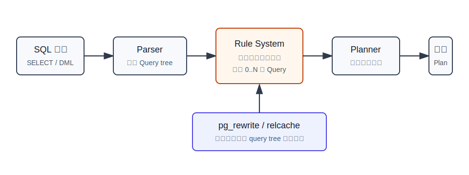
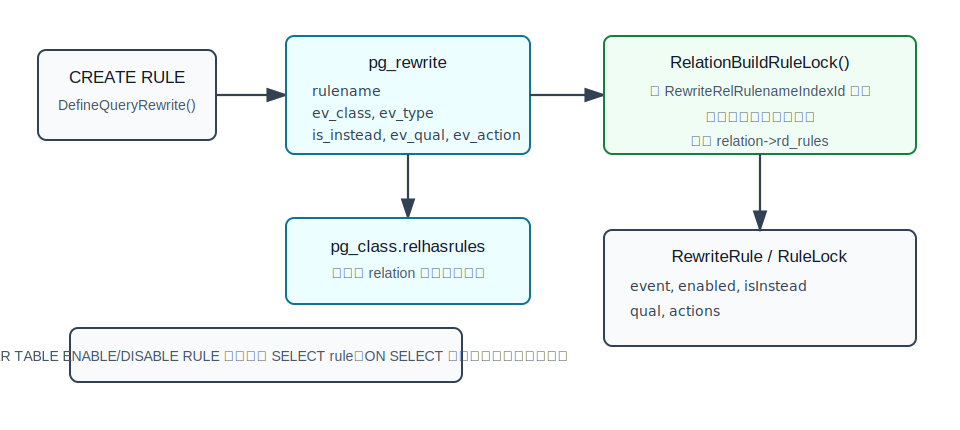
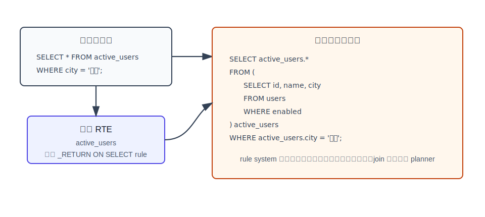
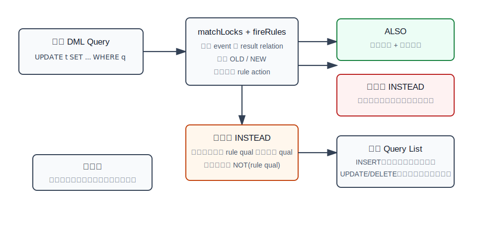

## 数据库筑基课 - 计算前置之 rule

### 作者
digoal

### 日期
2026-05-31

### 标签
PostgreSQL , 应用开发者 , 数据库筑基课 , rule , query rewrite , 视图 , 计算前置 , 优化器    

----

## 背景
  


本文属于“计算前置 + 查询改写 + 执行前变换”的基础能力主题。当前工作区未发现“数据库筑基课”总纲文件，因此本文按用户给定标题独立成篇。

很多数据库能力不是在执行器里“多做一步”，而是在执行前把问题改写成另一个问题。视图是最典型例子：用户写的是 `SELECT * FROM v`，数据库真正优化和执行的可能是 `SELECT * FROM (...) v`，其中子查询来自视图定义。这个动作发生在 planner 之前，所以优化器看到的不是“一个黑盒视图”，而是一棵已经展开的查询树。

PostgreSQL 的 rule system 就是这种机制。它的正式名字更准确：query rewrite rule system。它不是触发器，不是存储过程，也不是逐行回调；它是“把一条 SQL 解析后的查询树，按 catalog 里保存的规则，改写成 0 条、1 条或多条查询树，然后再交给 planner”。

如果把数据库执行链路拆开，rule 的位置非常靠前：



图 1 说明：parser 先把 SQL 文本变成 Query tree；rule system 根据 `pg_rewrite` 中保存的规则改写 Query tree；planner 只面对改写后的查询树。这个位置决定了 rule 的能力和风险：它能让视图定义参与全局优化，也可能让一条 DML 语句被复制、替换或抑制。

## 一、它解决什么问题？

rule 解决的是“执行前把用户语句转化成系统真正要优化的语句”的问题。

它主要服务三类场景：

| 场景 | 原问题 | rule 的转化 |
|---|---|---|
| 普通视图 | 用户希望用稳定名字封装复杂查询 | `ON SELECT DO INSTEAD SELECT` 把视图引用展开成保存的查询 |
| 物化视图定义 | 需要保存填充数据的查询定义 | 与视图一样保存 `_RETURN` rule，刷新时使用 |
| DML 重写 | 对 `INSERT/UPDATE/DELETE` 做语句级替换或追加动作 | 生成额外 Query tree，或用 `INSTEAD` 抑制原查询 |

它的“计算前置”价值在于：把语义变换前移到优化器之前。优化器看到的是改写后的完整关系代数，而不是运行时才临时调用的黑盒过程。PostgreSQL 官方规则系统文档也强调，rule system 位于 parser 和 planner 之间，输入和输出都是 parser 本身能产生的查询树。

但这个能力有代价：

| 代价 | 工程含义 |
|---|---|
| 语义不是逐行触发 | `UPDATE t SET x = random()` 这类 volatile 表达式可能因为规则复制而执行次数超出直觉 |
| 原 SQL 可能变成多条 SQL | 事务、锁、权限、`RETURNING`、命令标签都要按改写后 Query list 理解 |
| DML rule 难读难测 | `OLD/NEW` 会在查询树层面替换，不是触发器里的行变量 |
| 现代替代方案更多 | 自动可更新视图、`INSTEAD OF` trigger、触发器、分区路由通常更直接 |
| 有明确不支持边界 | `MERGE` 不支持目标关系上的非 SELECT rule；部分 `WITH`/多重赋值场景也受限 |

所以 rule 的正确定位不是“通用业务逻辑框架”，而是“PostgreSQL 内核用于查询重写和视图实现的机制；用户 DML rule 要谨慎使用”。

## 二、它是什么？

一句话定义：

> rule 是 PostgreSQL 在 parser 之后、planner 之前执行的查询树改写规则；规则本身存储在 `pg_rewrite` catalog 中，规则动作也以 Query tree 形式保存。

`CREATE RULE` 的核心语法是：

```sql
CREATE [ OR REPLACE ] RULE name AS ON event
    TO table_name [ WHERE condition ]
    DO [ ALSO | INSTEAD ] {
      NOTHING
      | command
      | ( command ; command ... )
    };
```

其中 `event` 可以是 `SELECT`、`INSERT`、`UPDATE`、`DELETE`。但 `ON SELECT` 规则非常特殊：它基本只用于视图，必须是名为 `_RETURN` 的无条件 `INSTEAD SELECT` 规则，并且一个视图只能有一个这样的 SELECT rule。源码里的常量 `ViewSelectRuleName` 也直接定义为 `"_RETURN"`。

内部表示上，rule 有三层：

| 层次 | 关键对象 | 作用 |
|---|---|---|
| SQL 接口 | `CREATE RULE`、`CREATE VIEW` | 用户或系统创建规则 |
| Catalog | `pg_rewrite` | 保存规则名称、目标 relation、事件类型、条件、动作 |
| relcache | `Relation.rd_rules` / `RuleLock` | 查询执行期间快速读取 relation 上的规则 |

`pg_rewrite` 的主要字段来自 [src/include/catalog/pg_rewrite.h](../postgres/src/include/catalog/pg_rewrite.h)：

| 字段 | 含义 |
|---|---|
| `rulename` | 同一 relation 内的规则名 |
| `ev_class` | 规则所属 relation 的 OID |
| `ev_type` | 事件类型，映射到 `SELECT/INSERT/UPDATE/DELETE` |
| `ev_enabled` | 是否启用，以及 origin/replica/always 触发配置 |
| `is_instead` | 是否为 `INSTEAD` rule |
| `ev_qual` | rule 条件，保存为 `pg_node_tree` |
| `ev_action` | rule 动作查询树，保存为 `pg_node_tree` |



图 2 说明：`CREATE RULE` 经 `DefineQueryRewrite()` 和 `InsertRule()` 写入 `pg_rewrite`，同时把 `pg_class.relhasrules` 置为 true 并触发 relcache 失效。后续打开 relation 时，`RelationBuildRuleLock()` 会按 `RewriteRelRulenameIndexId` 扫描规则，通常按规则名顺序载入，所以同一表同一事件的多个规则按名称顺序应用。

## 三、核心原理

### 3.1 入口：`QueryRewrite()` 分三步改写

源码入口在 [src/backend/rewrite/rewriteHandler.c](../postgres/src/backend/rewrite/rewriteHandler.c) 的 `QueryRewrite()`。它的处理顺序可以简化为三步：

1. 对顶层原始查询应用非 SELECT rule，可能得到 0 条、1 条或多条 Query。
2. 对每条结果 Query 应用 `ON SELECT` 规则，也就是展开视图类 RIR rule。
3. 决定哪条 Query 可以设置命令结果标签，例如客户端看到的 `INSERT 0 1`、`UPDATE n`。

这里最重要的结论是：DML rule 和视图 rule 不是同一种行为。

| 类型 | 行为 |
|---|---|
| `ON SELECT` rule | 原地展开 range table 中的视图引用，主要服务视图 |
| `ON INSERT/UPDATE/DELETE` rule | 生成额外 Query tree，可保留、替换或抑制原始 Query |

### 3.2 视图：`_RETURN` rule 把 view RTE 替换成子查询

PostgreSQL 文档说得很直接：视图基本上是一个没有实际存储的空表，加一个 `ON SELECT DO INSTEAD` rule，通常名为 `_RETURN`。`CREATE VIEW` 的实现也印证了这一点：[src/backend/commands/view.c](../postgres/src/backend/commands/view.c) 的注释说明它使用 rules system 保存视图查询，`DefineViewRules()` 调用 `DefineQueryRewrite()` 创建 `_RETURN` rule。

例如：

```sql
CREATE VIEW active_users AS
SELECT id, name, city
FROM users
WHERE enabled;

SELECT *
FROM active_users
WHERE city = '杭州';
```

rewriter 会把 `active_users` 这个 range table entry 展开成保存的 SELECT 子查询，逻辑上接近：

```sql
SELECT active_users.*
FROM (
  SELECT id, name, city
  FROM users
  WHERE enabled
) AS active_users
WHERE active_users.city = '杭州';
```



图 3 说明：rule system 不负责最终优化，它只把视图引用替换成子查询。子查询拉平、谓词下推、join 顺序选择、索引路径选择，都交给 planner。因此 PostgreSQL 的普通视图不是运行时黑盒，很多情况下能被优化器进一步合并。

这也是视图 rule 最有价值的地方：业务用稳定接口表达查询，优化器仍然能看到底层表、join 条件和过滤条件。

### 3.3 非 SELECT rule：不是触发器，而是生成 Query list

`INSERT/UPDATE/DELETE` rule 的行为更复杂。官方文档明确说，这类 rule 不原地修改查询树，而是创建 0 个或多个新的查询树，并且可能丢弃原始查询。

规则组合可以这样理解：

| rule 类型 | 输出 Query tree |
|---|---|
| 无条件 `ALSO` | 规则动作 + 原始查询 |
| 无条件 `INSTEAD` | 规则动作，原始查询不执行 |
| 有条件 `ALSO` | 规则动作追加 rule 条件和原查询条件，再执行原始查询 |
| 有条件 `INSTEAD` | 规则动作追加条件；原查询追加 `NOT(rule 条件)` 作为剩余路径 |



图 4 说明：DML rule 的核心不是“每行触发一次”，而是“把一条语句改写成一组语句”。`OLD` 和 `NEW` 也不是触发器函数里的行变量，而是规则动作查询树里的特殊 range table entry，改写时会替换为原查询 result relation 或 target list 中的表达式。

这会产生两个工程后果：

1. 规则动作可能按语句级批量执行，对大批量操作可能比逐行触发器少很多调用。
2. 原语句中的表达式、CTE、volatile 函数可能因为查询树复制而出现非直觉语义。

官方文档特别提醒：很多 `INSERT/UPDATE/DELETE` rule 能做的事更适合用触发器做，因为触发器语义更简单；rule 在原查询包含 volatile 函数时容易产生意外。

### 3.4 `ALSO`、`INSTEAD` 与执行顺序

`ALSO` 是默认行为，意思是“追加规则动作，原始查询也执行”。`INSTEAD` 意思是“用规则动作替代原始查询”。

还有一个容易忽视的顺序差异：

| 原命令 | 原始查询未被 `INSTEAD` 抑制时的相对顺序 |
|---|---|
| `INSERT` | 原始查询通常先执行，再执行规则动作，方便动作看到插入后的行 |
| `UPDATE` / `DELETE` | 规则动作通常先执行，再执行原始查询，避免目标行先被更新或删除后动作找不到它 |

这不是 SQL 表面语法能看出来的语义，必须按 rewriter 生成的 Query list 理解。

### 3.5 递归与循环检测

rule 动作本身生成的 Query 会再次进入重写流程。因此一个 rule 的动作如果又命中同一个 relation 的同一事件，就可能递归。源码用 `rewrite_event` 记录 relation 和 event，检测到重复后报 “infinite recursion detected”。

这就是为什么下面这种思路危险：

```sql
CREATE RULE r AS ON INSERT TO t
DO ALSO INSERT INTO t VALUES (NEW.*);
```

它不是“复制一行这么简单”，而是 rule 动作再次命中同一条规则。工程上，如果要写入同表，请优先考虑触发器，并明确递归控制。

## 四、横向对比

| 维度 | rule | trigger | 普通视图 | 自动可更新视图 | `INSTEAD OF` trigger |
|---|---|---|---|---|---|
| 主要目标 | 查询树改写 | 执行期回调 | 封装 SELECT | 简单视图 DML 自动映射到底表 | 自定义视图 DML |
| 发生阶段 | parser 后、planner 前 | executor 阶段 | 依赖 `_RETURN` rule 展开 | rewriter 中尝试改写 | executor 阶段 |
| 粒度 | 语句级 Query tree | 行级或语句级 | 查询引用级 | 语句级改写 | 行级视图处理 |
| 优势 | planner 可看到改写后的整体查询 | 语义直观，可抛错，可逐行处理 | 简化 SQL 和权限边界 | 用户无需写规则 | 比 DML rule 更容易表达复杂逻辑 |
| 风险 | 多 Query、volatile 函数、递归、边界多 | 大批量行级触发可能调用多 | 非物化，不缓存结果 | 只适合简单视图 | 逐行处理成本 |
| 推荐程度 | 内核机制常用，用户 DML rule 慎用 | 业务逻辑更常用 | 常用 | 能用则优先 | 复杂视图更新优先 |

原因很明确：rule 的强项是“改写后让 planner 继续全局优化”，尤其适合普通视图；trigger 的强项是“执行期语义清楚”，尤其适合业务校验、审计、复杂更新逻辑。不要因为 rule 更底层就默认它更适合业务开发。

## 五、效果如何？

rule 的收益和代价要按具体用途分开看。

### 5.1 视图展开的收益

视图 rule 让 PostgreSQL 可以把：

```sql
SELECT *
FROM view_a
JOIN view_b ON ...
WHERE ...;
```

转化成包含底层表、join、过滤条件的整体查询树，再交给 planner。官方规则文档中的视图例子展示了嵌套视图会形成多层子查询，但 planner 可进一步把它们拉平，按普通 join 查询优化。

这比“执行视图函数再过滤”好得多，因为优化器仍能做谓词下推、join 重排、索引选择。

### 5.2 DML rule 的潜在收益

对于大批量语句，rule 可能把一次 `DELETE` 追加成另一条集合化 `DELETE`，避免触发器对每行重复调用。官方文档在 rules versus triggers 中也说明，影响很多行的语句可能让 rule 更快，因为它生成的是额外命令，而不是每行触发一次。

但这个收益依赖 planner 能为规则动作生成好计划。如果规则动作变成大而宽、条件很差的 join，rule 也可能更慢。

### 5.3 DML rule 的主要代价

| 代价 | 具体表现 |
|---|---|
| 可读性差 | SQL 表面看不出实际执行了几条 Query |
| 调试成本高 | 需要看 `pg_rules`、`pg_rewrite`、`debug_print_rewritten` 或源码行为 |
| `RETURNING` 限制 | 非 SELECT rule 中 `RETURNING` 只允许在无条件 `INSTEAD` 等受限场景使用 |
| `ON CONFLICT` 限制 | 带 `ON CONFLICT` 的 `INSERT` 不能用于带 INSERT/UPDATE rule 的普通表，自动可更新视图例外 |
| `MERGE` 限制 | 目标 relation 上有非 SELECT rule 时不支持 `MERGE` |
| 复制角色影响 | 非 SELECT rule 可被 ENABLE/DISABLE/REPLICA/ALWAYS 控制，`ON SELECT` rule 为保证视图总会应用 |

## 六、实操 DEMO

以下示例是可运行 SQL，用于观察 rule 的表面行为和 catalog 表示。本文未在本机启动 PostgreSQL 实例执行，因此不提供执行输出。

### 6.1 观察视图背后的 `_RETURN` rule

```sql
DROP TABLE IF EXISTS users CASCADE;

CREATE TABLE users (
  id bigint PRIMARY KEY,
  name text NOT NULL,
  city text NOT NULL,
  enabled boolean NOT NULL DEFAULT true
);

CREATE VIEW active_users AS
SELECT id, name, city
FROM users
WHERE enabled;

SELECT schemaname, tablename, rulename, definition
FROM pg_rules
WHERE tablename = 'active_users';
```

你应该关注的不是输出格式，而是概念：`CREATE VIEW` 会生成一个名为 `_RETURN` 的 SELECT rule。它保存了视图定义查询。

也可以打开改写树日志观察：

```sql
SET client_min_messages = log;
SET debug_print_rewritten = on;

SELECT *
FROM active_users
WHERE city = '杭州';

RESET debug_print_rewritten;
RESET client_min_messages;
```

`debug_print_rewritten` 是 PostgreSQL 文档列出的调试参数，用于打印重写后的查询树。它适合开发和实验环境，不适合在线业务随意开启。

### 6.2 用 DML rule 做语句级审计

下面示例演示 rule 的语句级改写能力。生产中更推荐触发器，因为审计通常需要明确的执行期语义。

```sql
DROP TABLE IF EXISTS account_log;
DROP TABLE IF EXISTS account;

CREATE TABLE account (
  id bigint PRIMARY KEY,
  balance numeric NOT NULL
);

CREATE TABLE account_log (
  id bigint NOT NULL,
  old_balance numeric NOT NULL,
  new_balance numeric NOT NULL,
  changed_at timestamptz NOT NULL DEFAULT now()
);

CREATE RULE account_balance_log AS
ON UPDATE TO account
WHERE NEW.balance <> OLD.balance
DO ALSO
  INSERT INTO account_log (id, old_balance, new_balance)
  VALUES (OLD.id, OLD.balance, NEW.balance);

INSERT INTO account VALUES (1, 100), (2, 200);
UPDATE account SET balance = balance + 10 WHERE id IN (1, 2);

SELECT * FROM account_log ORDER BY id;
```

这个例子看起来像“每行写一条日志”，但内部不是触发器逐行回调，而是 rewriter 生成一条额外的 `INSERT ... SELECT-like` 查询树，并把 `OLD/NEW` 替换为原查询可见的表达式。理解这一点，才能解释复杂 `UPDATE ... FROM`、volatile 函数、CTE 时的行为。

### 6.3 条件 `INSTEAD` 的剩余路径

条件 `INSTEAD` rule 不是简单地“满足条件就替换，不满足就原样”。rewriter 会给原查询追加取反条件，形成“剩余路径”。

```sql
DROP TABLE IF EXISTS inbox CASCADE;
DROP TABLE IF EXISTS inbox_archive;

CREATE TABLE inbox (
  id bigint PRIMARY KEY,
  status text NOT NULL,
  payload text NOT NULL
);

CREATE TABLE inbox_archive (
  id bigint PRIMARY KEY,
  status text NOT NULL,
  payload text NOT NULL
);

CREATE RULE inbox_archive_insert AS
ON INSERT TO inbox
WHERE NEW.status = 'archived'
DO INSTEAD
  INSERT INTO inbox_archive VALUES (NEW.*);

INSERT INTO inbox VALUES (1, 'active', 'a');
INSERT INTO inbox VALUES (2, 'archived', 'b');

SELECT * FROM inbox ORDER BY id;
SELECT * FROM inbox_archive ORDER BY id;
```

这类写法历史上常被拿来做路由，但现代 PostgreSQL 已有声明式分区、触发器、逻辑复制等更清晰的选择。除非你非常清楚重写语义，否则不要把 DML rule 当成通用路由机制。

## 七、最佳实践

### 面向数据库架构师

1. 把 rule 主要视为视图和物化视图背后的基础设施，而不是业务逻辑扩展框架。
2. 设计视图时放心利用普通视图的可优化性；复杂嵌套视图仍要用 `EXPLAIN` 验证 planner 是否能拉平或下推。
3. 对需要更新的视图，优先顺序通常是：自动可更新视图、`INSTEAD OF` trigger、最后才是用户自定义 DML rule。
4. 对批量级联操作，不要只凭“rule 是语句级所以更快”下结论，要看生成动作的实际执行计划。

### 面向 DBA

1. 排查“SQL 明明没有写这个表，为什么改了这个表”时，先查 `pg_rules` 和 `pg_rewrite`。
2. 对视图异常，关注 `_RETURN` rule 是否存在、是否与视图列定义一致、依赖对象是否变更。
3. 对复制环境，确认 `ALTER TABLE ENABLE/DISABLE [REPLICA|ALWAYS] RULE` 和 `session_replication_role` 的组合；注意 `ON SELECT` rule 不受这个禁用语义影响。
4. 线上不要轻易打开 `debug_print_rewritten`，它输出的是内部树结构，日志量和敏感信息风险都要评估。

### 面向业务开发者

1. 需要封装查询：用普通视图。
2. 需要缓存结果：用物化视图或手工汇总表，不要指望普通视图缓存。
3. 需要数据校验、审计、抛错、行级处理：优先用 trigger 或约束。
4. 需要让复杂视图可写：优先用自动可更新视图；不满足时考虑 `INSTEAD OF` trigger。
5. 如果必须写 DML rule，把 SQL 限制在非常小、可解释、可测试的范围内，并给出 `EXPLAIN` 和回归测试。

## 八、适合与不适合场景

适合：

| 场景 | 原因 |
|---|---|
| 普通视图 | PostgreSQL 官方实现路径，planner 可继续优化展开后的查询 |
| 物化视图定义保存 | PostgreSQL 内部使用 rule 保存刷新定义 |
| 少量受控的语句级批量改写 | 能利用集合化 SQL，减少逐行触发器调用 |
| 教学和内核理解 | rule 是理解 parser、rewriter、planner 边界的好入口 |

不适合：

| 场景 | 原因 |
|---|---|
| 业务约束和报错 | rule 可能静默改写或丢弃操作，触发器/约束更清楚 |
| 复杂审计 | 触发器语义更直接，能明确拿到行级 OLD/NEW |
| 依赖 volatile 函数的 DML | 查询树复制可能导致执行次数非直觉 |
| 带复杂 CTE 的 DML 改写 | PostgreSQL 对可能多次求值的场景有限制 |
| `MERGE` 目标表改写 | 当前目标 relation 有非 SELECT rule 时不支持 |
| 新系统分区路由 | 声明式分区更直接、更可维护 |

## 九、常见坑

### 1. 把 rule 当成 trigger

trigger 是执行期回调；rule 是执行前查询树改写。写 DML rule 前，先问自己：我需要的是“把一条语句改写成另一组语句”，还是“对每行变化做处理”？大多数业务场景是后者。

### 2. 忽略多规则按名称顺序触发

同一 relation 同一事件可以有多个 rule。文档说明多个同表同事件规则按字母名称顺序应用；relcache 源码也说明通过 `RewriteRelRulenameIndexId` 扫描，通常会按规则名顺序读取。规则名不是纯注释，它影响行为顺序。

### 3. 条件 `INSTEAD` 不是简单 if-else

条件 `INSTEAD` 会生成规则动作查询，还会给原查询生成“取反条件”的剩余路径。多个条件 `INSTEAD` 叠加后，理解成本很快上升。

### 4. `RETURNING` 不是随便可用

非 SELECT rule 中，`RETURNING` 只能出现在受限场景。源码 `DefineQueryRewrite()` 检查：条件 rule、不带 `INSTEAD` 的 rule、多 action 中多个 `RETURNING` 都会被拒绝。执行改写时，如果原查询有 `RETURNING`，但可替代的无条件 `INSTEAD` rule 没提供合适 `RETURNING`，也会报错。

### 5. `ON CONFLICT` 与 rule 冲突

`CREATE RULE` 文档明确指出，包含 `ON CONFLICT` 的 `INSERT` 不能用于有 `INSERT` 或 `UPDATE` rule 的表。源码 `RewriteQuery()` 也在发现 `onConflict` 与 product queries 或 update rule 组合时抛出不支持错误；自动可更新视图是例外。

### 6. 视图更新的优先级容易误判

视图作为 DML 目标时，PostgreSQL 的优先级大致是：先看用户定义 rule，再看 `INSTEAD OF` trigger，最后尝试自动可更新视图。已有 rule 或 trigger 会覆盖默认自动更新行为。

### 7. 修改底层表列类型可能被视图/rule 阻止

视图和 rule 依赖会嵌入列类型、列号、表达式。`ALTER TABLE` 修改被视图或 rule 使用的列类型时，PostgreSQL 会阻止，避免已有规则查询树失效。这是 schema 演进中常见的依赖问题。

## 十、扩展问题

1. 为什么 PostgreSQL 普通视图通常能被优化器下推条件，而很多外部系统里的“视图函数”不行？
2. DML rule 是语句级改写，statement-level trigger 也是语句级触发，它们在可见数据、执行阶段和语义上有什么差异？
3. 如果一个普通视图可以自动更新，为什么再加一个 `INSTEAD OF` trigger 或 DML rule 会改变默认路径？
4. 为什么物化视图查询时不像普通视图那样展开 `_RETURN` rule，而是直接读物化结果？
5. 如果要设计一个透明查询改写系统，把普通查询自动改写到物化视图上，需要比 PostgreSQL rule system 多解决哪些匹配和代价问题？

## 十一、扩展阅读

主要一手来源：

- [PostgreSQL rules.sgml：The Rule System](../postgres/doc/src/sgml/rules.sgml)
- [PostgreSQL CREATE RULE 文档源码](../postgres/doc/src/sgml/ref/create_rule.sgml)
- [PostgreSQL ALTER TABLE 中 ENABLE/DISABLE RULE 文档源码](../postgres/doc/src/sgml/ref/alter_table.sgml)
- [src/backend/rewrite/rewriteHandler.c](../postgres/src/backend/rewrite/rewriteHandler.c)
- [src/backend/rewrite/rewriteDefine.c](../postgres/src/backend/rewrite/rewriteDefine.c)
- [src/backend/commands/view.c](../postgres/src/backend/commands/view.c)
- [src/backend/utils/cache/relcache.c](../postgres/src/backend/utils/cache/relcache.c)
- [src/include/catalog/pg_rewrite.h](../postgres/src/include/catalog/pg_rewrite.h)
- [src/include/rewrite/rewriteSupport.h](../postgres/src/include/rewrite/rewriteSupport.h)
- [src/include/rewrite/prs2lock.h](../postgres/src/include/rewrite/prs2lock.h)
- [src/test/regress/sql/rules.sql](../postgres/src/test/regress/sql/rules.sql)
- [DeepWiki: postgres/postgres query rewrite rule system](https://deepwiki.com/search/in-postgresql-how-does-the-que_b1cd7d04-d39f-45fa-bc47-ca0ba7dac404)

源码定位提示：

- `QueryRewrite()`：rewriter 主入口。
- `RewriteQuery()`：先处理非 SELECT rule，再递归处理生成的 Query。
- `fireRIRrules()` / `ApplyRetrieveRule()`：展开视图类 `ON SELECT` rule。
- `fireRules()`：处理非 SELECT rule 的 `ALSO`、`INSTEAD`、条件逻辑。
- `DefineQueryRewrite()`：创建 rule 时的合法性检查。
- `RelationBuildRuleLock()`：从 `pg_rewrite` 加载规则到 relcache。
  
## 附录 

1、克隆代码  
```  
git clone --depth 1 https://github.com/postgres/postgres
```  
  
2、启用 codex, 使用 [数据库筑基课 skill](../skills/README.md).  
```
文章标题: 
  数据库筑基课 - 计算前置之 rule
项目源码(本地目录): 
  postgres
项目 codebase 文件名: 
  postgres/CLAUDE.md 
开源项目相关的 deepwiki repoName: 
  postgres/postgres
```
  
  
#### [PostgreSQL 解决方案集合](../201706/20170601_02.md "40cff096e9ed7122c512b35d8561d9c8")
  
  
#### [德哥 / digoal's Github - 公益是一辈子的事.](https://github.com/digoal/blog/blob/master/README.md "22709685feb7cab07d30f30387f0a9ae")
  
  
#### [About 德哥](https://github.com/digoal/blog/blob/master/me/readme.md "a37735981e7704886ffd590565582dd0")
  
  

  
