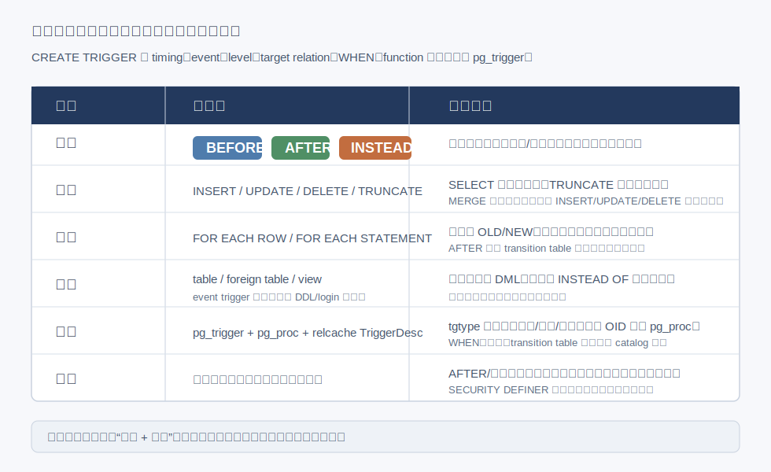
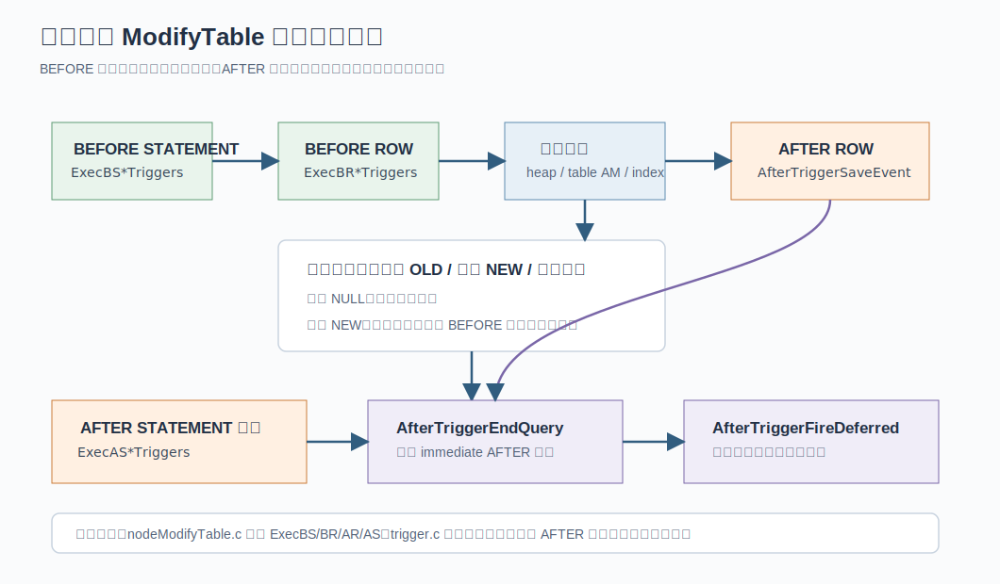
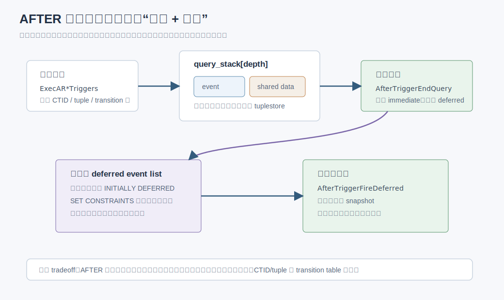
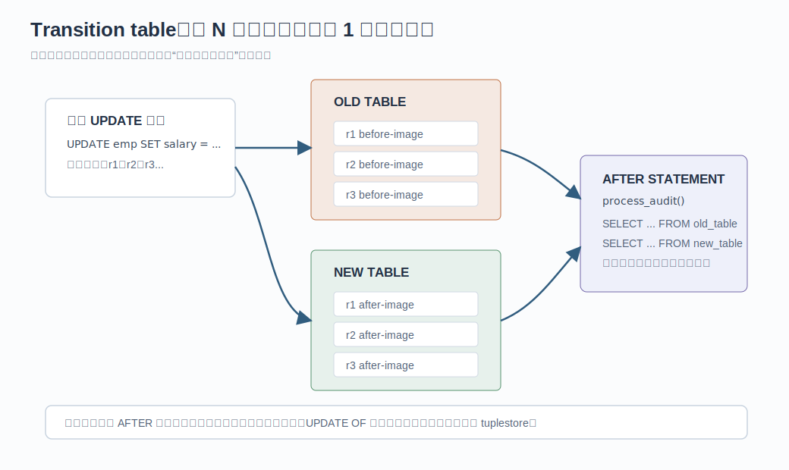
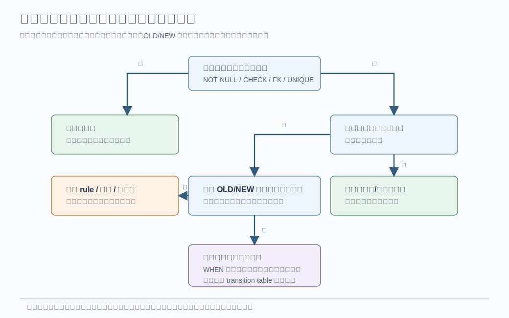

## 数据库筑基课 - 计算前置之 触发器

### 作者
digoal

### 日期
2026-05-31

### 标签
PostgreSQL , 应用开发者 , 数据库筑基课 , trigger , PL/pgSQL , 计算前置 , 写路径 , 审计 , 约束    

----

## 背景
  


本文属于“计算前置 + 执行期回调 + 场景实践”的基础能力主题。当前工作区未发现“数据库筑基课”总纲文件，因此本文按用户给定标题独立成篇。

上一篇《[数据库筑基课 - 计算前置之 rule](20260531_34.md)》讲的是执行前的查询树改写：SQL 还没进入 planner，PostgreSQL 就把 Query tree 改成另一个 Query tree。触发器的位置不同。触发器是在执行器写入数据时介入，它拿到 `OLD`、`NEW`、触发事件、触发粒度和触发表上下文，然后决定是否改写当前行、跳过当前行、写审计表、维护汇总表、检查跨表条件，或接管视图写入。

这就是触发器的价值，也是它的风险：

> 触发器把计算从读路径、应用路径或离线任务，前置到数据库写路径；它让副作用和数据变化进入同一个事务，但也把写入延迟、锁等待、递归和排错复杂度带进了每一次 DML。

PostgreSQL 官方文档把普通触发器定义为：当某类操作发生时，数据库自动执行特定函数。源码层面，这个定义落在几个关键对象上：

| 层次 | 关键对象 | 作用 |
|---|---|---|
| SQL 接口 | `CREATE TRIGGER` | 定义时机、事件、粒度、目标对象、条件和函数 |
| Catalog | `pg_trigger` | 保存 `tgrelid`、`tgfoid`、`tgtype`、`tgenabled`、`tgqual`、transition table 名称等 |
| relcache | `TriggerDesc` | 执行器快速判断某个表是否有某类触发器 |
| 执行器 | `nodeModifyTable.c` | 在 DML 写路径调用 `ExecBS*`、`ExecBR*`、`ExecAR*`、`ExecAS*` |
| 触发器管理 | `trigger.c` | 调用触发函数、保存 AFTER 事件、处理 transition table 和延迟约束 |



图 1 说明：触发器不是一个单一开关，而是“时机、事件、粒度、对象、函数、事务行为”的组合。真正设计触发器前，先把这些维度定清楚，否则很容易把本该属于约束、生成列、rule、物化视图、异步任务或应用逻辑的工作塞进写路径。

## 一、它解决什么问题？

触发器解决的是“数据变化发生时，必须和这次变化同事务执行的计算或副作用”的问题。

典型痛点有五类：

| 场景 | 没有触发器时的问题 | 触发器的转化 |
|---|---|---|
| 审计 | 应用可能漏写日志，多入口写入难统一 | 数据库在 `INSERT/UPDATE/DELETE` 后统一写审计表 |
| 派生字段 | 应用端重复计算，历史数据格式不一致 | `BEFORE` 触发器在写入前修正 `NEW` |
| 跨表一致性 | 普通 `CHECK` 不能访问其他表 | `AFTER` 或约束触发器在同事务内检查并报错 |
| 可写视图 | 复杂视图无法自动更新 | `INSTEAD OF` 触发器把视图写入转成基表写入 |
| 增量汇总 | 看板每次读都重新聚合 | 写入明细时同步维护汇总表或变更表 |

它的“计算前置”价值很直接：

1. **把读时计算前置到写时**：例如维护汇总表、审计表、全文向量、状态表。
2. **把应用端约定前置到数据库内核路径**：所有 SQL 客户端、批处理、FDW 写入、复制应用都走同一规则。
3. **把多步副作用放进同一个事务**：主表写失败，审计/汇总也回滚；触发器报错，主表写入也回滚。
4. **把行上下文暴露给过程语言**：`OLD`、`NEW`、`TG_OP`、`TG_WHEN`、`TG_LEVEL` 让函数能感知变化来源。

但它同时牺牲：

| 代价 | 工程含义 |
|---|---|
| 写入延迟上升 | 每行触发函数、执行 SQL、写额外表，都会增加 DML 时间 |
| 行级放大 | 一条影响 10 万行的 `UPDATE` 可能调用 10 万次行级触发器 |
| 锁和死锁风险 | 触发器里访问其他表，会叠加锁顺序和等待链 |
| 行为隐藏 | 业务 SQL 看不出背后还有写审计、汇总、校验、递归 |
| 递归风险 | 触发函数执行 SQL 可能再次触发同表或相关表触发器 |
| 运维排错变难 | 慢 SQL 的时间可能花在触发函数里，而不是主查询计划里 |

所以触发器适合“必须绑定数据变化、必须同事务、必须在数据库侧统一执行”的工作；不适合成为默认业务编排框架。

## 二、它是什么？

一句话定义：

> PostgreSQL 触发器是绑定在表、外部表或视图上的执行期回调规则；当指定 DML 事件发生时，执行器按触发器定义调用一个返回 `trigger` 的函数，函数通过触发上下文而不是普通参数接收输入。

这里有几个关键点。

### 2.1 函数不是普通函数调用

PL/pgSQL 触发函数必须声明为无参数、返回 `trigger`：

```sql
CREATE FUNCTION f() RETURNS trigger
LANGUAGE plpgsql AS $$
BEGIN
  RETURN NEW;
END;
$$;
```

即使 `CREATE TRIGGER ... EXECUTE FUNCTION f('a', 'b')` 写了参数，触发函数也不是通过普通函数参数接收，而是通过 `TG_ARGV` 接收。PL/pgSQL 文档列出的特殊变量包括：

| 变量 | 含义 |
|---|---|
| `NEW` | 行级 `INSERT/UPDATE` 的新行；语句级和 `DELETE` 中为空 |
| `OLD` | 行级 `UPDATE/DELETE` 的旧行；语句级和 `INSERT` 中为空 |
| `TG_OP` | `INSERT`、`UPDATE`、`DELETE` 或 `TRUNCATE` |
| `TG_WHEN` | `BEFORE`、`AFTER` 或 `INSTEAD OF` |
| `TG_LEVEL` | `ROW` 或 `STATEMENT` |
| `TG_TABLE_SCHEMA` / `TG_TABLE_NAME` | 触发表的 schema 和表名 |
| `TG_NARGS` / `TG_ARGV` | 触发器定义里传入的字符串参数 |

C 语言接口更接近内核真实模型：[src/include/commands/trigger.h](../postgres/src/include/commands/trigger.h) 定义了 `TriggerData`，包括 `tg_event`、`tg_relation`、`tg_trigtuple`、`tg_newtuple`、`tg_trigger`、`tg_oldtable`、`tg_newtable` 和 `tg_updatedcols`。

### 2.2 定义写入 `pg_trigger`

[src/include/catalog/pg_trigger.h](../postgres/src/include/catalog/pg_trigger.h) 显示，触发器定义保存在 `pg_trigger`。核心字段包括：

| 字段 | 作用 |
|---|---|
| `tgrelid` | 触发器绑定的 relation |
| `tgparentid` | 分区父触发器 OID，分区触发器克隆时使用 |
| `tgname` | 触发器名；同一表内唯一 |
| `tgfoid` | 要调用的函数 OID |
| `tgtype` | 位图：时机、事件、粒度 |
| `tgenabled` | 结合 `session_replication_role` 判断是否触发 |
| `tgisinternal` | 是否系统内部生成，例如外键触发器 |
| `tgconstraint` / `tgdeferrable` / `tginitdeferred` | 约束触发器和延迟状态 |
| `tgattr` | `UPDATE OF column` 的列号集合 |
| `tgargs` | 触发器参数，按空字符分隔 |
| `tgqual` | `WHEN` 条件表达式 |
| `tgoldtable` / `tgnewtable` | transition table 名称 |

`tgtype` 不是字符串，而是位组合：`TRIGGER_TYPE_ROW`、`TRIGGER_TYPE_BEFORE`、`TRIGGER_TYPE_INSERT`、`TRIGGER_TYPE_DELETE`、`TRIGGER_TYPE_UPDATE`、`TRIGGER_TYPE_TRUNCATE`、`TRIGGER_TYPE_INSTEAD`。执行器用这些位快速判断一个触发器是否匹配当前事件。

### 2.3 普通触发器和事件触发器不同

普通触发器绑定表、外部表或视图，捕获 DML。事件触发器是数据库级对象，捕获 DDL 或 login 事件，例如 `ddl_command_start`、`ddl_command_end`、`sql_drop`、`table_rewrite`、`login`。本文主线是普通触发器；事件触发器只作为横向对比。

## 三、核心原理

### 3.1 DML 执行链路：BEFORE 即时，AFTER 排队

PostgreSQL 的 DML 执行入口在 `ModifyTable` 执行节点。[src/backend/executor/nodeModifyTable.c](../postgres/src/backend/executor/nodeModifyTable.c) 的调用关系很清楚：

| 阶段 | 典型函数 | 作用 |
|---|---|---|
| 语句开始 | `fireBSTriggers` -> `ExecBS*Triggers` | 触发 `BEFORE STATEMENT` |
| 每行写入前 | `ExecBRInsertTriggers` / `ExecBRUpdateTriggers` / `ExecBRDeleteTriggers` | 调用 `BEFORE ROW`，可能改写或跳过当前行 |
| 视图写入 | `ExecIR*Triggers` | 调用 `INSTEAD OF ROW`，由触发函数接管视图写入 |
| 每行写入后 | `ExecAR*Triggers` | 保存 `AFTER ROW` 事件 |
| 语句结束 | `fireASTriggers` -> `ExecAS*Triggers` | 保存 `AFTER STATEMENT` 事件 |
| executor finish | `AfterTriggerEndQuery` | 触发 immediate AFTER 事件，移动 deferred 事件 |
| 提交前 | `AfterTriggerFireDeferred` | 触发延迟约束触发器 |



图 2 说明：`BEFORE ROW` 在实际写入前同步调用，返回 `NULL` 会跳过当前行，返回修改后的 `NEW` 会改变要写入的行。`AFTER ROW` 和 `AFTER STATEMENT` 不是简单地“马上执行”，而是通过 `AfterTriggerSaveEvent` 保存事件，之后在语句末或事务末触发。

这一点解释了几个工程现象：

1. `BEFORE` 触发器适合改写即将写入的行，因为它直接影响 executor 后续动作。
2. `AFTER` 触发器适合审计、传播和跨表检查，因为它能看到最终写入结果。
3. `AFTER` 触发器有排队成本，大批量 DML 会积累事件、CTID、tuple 或 transition table 数据。
4. 约束触发器只允许 `AFTER ROW`，因为它要检查已经发生的行变化，并可延迟到事务末。

### 3.2 返回值协议：NULL 不是普通空值

触发函数的返回值是控制协议：

| 触发器类型 | 返回 `NULL` | 返回行值 |
|---|---|---|
| `BEFORE ROW INSERT/UPDATE` | 跳过当前行写入 | 使用返回行作为最终写入行 |
| `BEFORE ROW DELETE` | 跳过当前行删除 | 非空即可继续删除，通常返回 `OLD` |
| `AFTER ROW` | 返回值被忽略 | 返回值被忽略 |
| `STATEMENT` | 应返回 `NULL` | `BEFORE STATEMENT` 返回非空会报错 |
| `INSTEAD OF ROW` | 表示没有执行视图底层修改，不计入影响行数 | 表示已执行底层修改，并影响 `RETURNING` |

[src/backend/commands/trigger.c](../postgres/src/backend/commands/trigger.c) 里 `ExecBRInsertTriggers`、`ExecBRUpdateTriggers`、`ExecBRDeleteTriggers` 都按这个协议处理返回值。比如 `ExecBRInsertTriggers` 在触发函数返回 `NULL` 时直接返回 `false`，调用者据此放弃本行插入。

### 3.3 多个触发器按名称排序

PostgreSQL 文档明确说明：同一事件、同一关系上多个触发器按触发器名称的字母顺序触发。对 `BEFORE` 和 `INSTEAD OF` 触发器，前一个触发器返回的行会成为后一个触发器的输入；如果某个触发器返回 `NULL`，本行后续触发器不再执行。

这不是小细节。内置函数 `suppress_redundant_updates_trigger()` 的文档建议把触发器命名成类似 `z_min_update`，让它最后执行，避免它提前跳过更新而覆盖其他触发器的意图。

### 3.4 `WHEN` 条件既是逻辑过滤，也是性能工具

`CREATE TRIGGER` 支持 `WHEN (condition)`。行级触发器的条件可以引用 `OLD` 和 `NEW`，例如：

```sql
CREATE TRIGGER audit_price_change
AFTER UPDATE OF price ON products
FOR EACH ROW
WHEN (OLD.price IS DISTINCT FROM NEW.price)
EXECUTE FUNCTION audit_price_change();
```

这里有两个容易踩坑的点：

1. `UPDATE OF price` 是看 `SET` 列表里是否提到 `price`，不是看值是否真的变化。`UPDATE products SET price = price` 也会触发。
2. `AFTER` 触发器的 `WHEN` 条件在行更新后立即判断；如果不为真，就不需要把这个 AFTER 事件排队。对大批量 DML，这是实际性能优化。

### 3.5 AFTER 队列：为什么约束能延迟到事务末？

[src/backend/commands/trigger.c](../postgres/src/backend/commands/trigger.c) 对 AFTER 触发器有专门的数据结构。源码注释说明：`BEFORE` 触发器即时执行，不需要持久状态；`AFTER` 触发器事件保存在当前事务树里。为了减少内存，事件记录按 chunk 分组，相似事件共享 `AfterTriggerSharedData`。

关键结构包括：

| 结构 | 作用 |
|---|---|
| `AfterTriggersData` | 当前事务的 AFTER 触发器总状态 |
| `AfterTriggersQueryData` | 当前 query level 的事件、transition table、FDW tuplestore |
| `AfterTriggersTransData` | 子事务状态，用于 abort 时恢复 |
| `AfterTriggerEventData` | 每个触发事件，保存状态位、CTID、跨分区信息 |
| `AfterTriggerSharedData` | 相似事件共享的触发器 OID、relation OID、事件类型、role、modified columns |
| `SetConstraintStateData` | `SET CONSTRAINTS` 对约束触发器延迟状态的事务内设置 |



图 3 说明：普通 immediate `AFTER` 触发器会在 `AfterTriggerEndQuery` 中触发；延迟约束触发器会移动到事务级 deferred event list，提交前由 `AfterTriggerFireDeferred` 触发。这个机制让外键、延迟唯一约束和用户定义约束触发器能在事务末统一检查，但也意味着长事务和大批量写入会积累更多待触发事件。

### 3.6 Transition table：从逐行回调到集合处理

默认的行级触发器只能一次看到一行 `OLD`/`NEW`。语句级触发器默认又看不到每一行变化。`REFERENCING OLD TABLE AS ... NEW TABLE AS ...` 解决的是这个夹缝问题：让 `AFTER` 触发器能把本语句影响的行作为只读临时关系来查询。

官方限制也很明确：

| 限制 | 原因 |
|---|---|
| 只允许 `AFTER` 触发器 | 要收集已经发生的 before/after image |
| 不能是约束触发器 | transition table 生命周期只需到语句末 |
| 普通表支持，外部表受限 | 需要可靠收集受影响 tuple |
| `UPDATE` 使用 transition table 时不能指定 `UPDATE OF column` | 避免事件集合语义和列过滤组合复杂化 |
| 一个触发器不能同时指定多个事件并请求 transition relation | 不同事件的 OLD/NEW 集合不同 |



图 4 说明：对批量 `UPDATE`，PostgreSQL 可以把所有旧行放入 `OLD TABLE`，所有新行放入 `NEW TABLE`，再由一个 `AFTER STATEMENT` 触发函数集合化处理。PL/pgSQL 文档也强调，这类审计在大批量修改时可能比逐行触发器明显更快。

### 3.7 可见性规则：触发器里查同一张表时要小心

触发器函数里可以执行 SQL。如果它查询触发表本身，就必须理解可见性：

| 触发器 | 对触发本次变化的可见性 |
|---|---|
| `BEFORE STATEMENT` | 看不到本语句任何变化 |
| `AFTER STATEMENT` | 能看到本语句全部变化 |
| `BEFORE ROW` | 看不到当前行尚未发生的变化，但可能看到同一语句前面已处理行的变化 |
| `AFTER ROW` | 能看到外层语句已经完成的全部变化 |
| `INSTEAD OF ROW` | 能看到同一语句前面 INSTEAD OF 触发器已做的变化 |

最危险的是“同一条语句前面已处理行”的可见性：多行 DML 的行处理顺序通常不应作为业务假设。不要在 `BEFORE ROW` 触发器里写依赖处理顺序的逻辑，例如“当前行排名必须大于上一行”。

### 3.8 分区、`ON CONFLICT`、`MERGE` 会放大语义复杂度

PostgreSQL 触发器在现代 DML 特性下有一些非直觉行为：

| 特性 | 触发器行为 |
|---|---|
| 分区表 | 行级触发器会克隆到现有和未来分区；修改父表时，父表语句级触发器触发，受影响分区的行级触发器触发 |
| 分区键更新导致跨分区移动 | 可表现为原分区 `DELETE` + 新分区 `INSERT`；`AFTER UPDATE` 行级触发器不按普通更新路径触发 |
| `INSERT ... ON CONFLICT DO UPDATE` | 可能同时触发 INSERT 和 UPDATE 相关触发器；语句级 UPDATE 触发器即使没有实际更新行也会触发 |
| `MERGE` | 没有独立 MERGE 触发器；按声明动作和实际行动作触发 INSERT/UPDATE/DELETE 触发器 |
| 外键级联 | 外键动作通过普通 SQL 更新/删除引用表，因此引用表上的触发器也会被触发 |

这些不是边角料。生产里很多“为什么触发器多触发/少触发”的问题，都来自分区移动、upsert、merge 和外键级联。

## 四、横向对比

触发器经常和 rule、约束、生成列、物化视图、应用逻辑混用。正确选择要看“是否需要执行期行上下文”和“是否必须同事务副作用”。

| 维度 | trigger | rule | 约束 | 生成列/表达式索引 | 物化视图/汇总表 | 应用逻辑 |
|---|---|---|---|---|---|---|
| 发生阶段 | 执行期写路径 | parser 后、planner 前 | 执行器/索引/约束检查 | 写入或索引维护 | 刷新或应用维护 | 数据库外 |
| 是否看到 `OLD/NEW` | 行级可见 | Query tree 层面替换 | 不以行变量暴露 | 只由表达式决定 | 通常看不到单次行上下文 | 应用自己维护 |
| 是否可跨表副作用 | 可以，但要谨慎 | 可生成额外 SQL | FK 可跨表，CHECK 不行 | 不适合 | 可通过刷新/ETL | 可以 |
| 是否同事务 | 是 | 是 | 是 | 是 | 刷新时是，底表变化不自动同步 | 取决于应用事务 |
| 优化器可理解程度 | 低，函数黑盒多 | 改写后可继续优化 | 高 | 高 | 查询物化结果可优化 | 数据库不可见 |
| 大批量写入成本 | 可能很高 | 语句级，可能低 | 通常最低 | 写入时计算/索引成本 | 刷新成本集中 | 取决于实现 |
| 适合场景 | 审计、视图写入、同事务副作用、跨表校验 | 视图展开、少量受控 DML 改写 | 声明式一致性 | 派生值、搜索表达式 | 可延迟读加速 | 跨系统流程 |
| 不适合场景 | 复杂业务编排、高频重副作用 | 逐行业务逻辑 | 需要复杂过程 | 非确定性或跨表逻辑 | 实时逐行一致性 | 多入口绕过数据库 |



图 5 说明：如果约束能表达，就优先用约束；如果只是确定性派生值，优先用生成列、表达式索引或明确的写入 SQL；如果需要执行期的 `OLD/NEW`、同事务副作用或视图写入，再考虑触发器。触发器不是不能用，而是要把它当成写路径的一部分来预算成本。

## 五、效果如何？

触发器的效果不能只看“功能能否实现”，要拆成读、写、空间、锁和可维护性。

### 5.1 收益

| 收益 | 解释 |
|---|---|
| 统一入口 | 所有 SQL 写入都触发，不依赖应用是否记得调用某段代码 |
| 同事务一致 | 主变化、审计、汇总、校验在同一个事务成功或失败 |
| 可前置计算 | 读请求不必重复计算某些派生值或汇总 |
| 可接管视图写入 | `INSTEAD OF` 触发器让复杂视图拥有明确写入语义 |
| 可延迟检查 | 约束触发器可以在事务末检查需要跨行、跨表的条件 |

### 5.2 成本

| 成本 | 触发条件 | 典型后果 |
|---|---|---|
| 函数调用成本 | 每行触发器 | 高并发小写入增加延迟；批量写入放大明显 |
| SPI/SQL 成本 | 触发函数内部执行 SQL | 额外 plan、执行、锁和 buffer 访问 |
| WAL/IO 放大 | 触发器写审计表、汇总表 | 主表一行变化变成多表变化 |
| 队列内存 | 大量 `AFTER` 事件、transition table | 长事务内存压力，提交前集中触发 |
| 锁冲突 | 触发器访问热点汇总行或配置表 | 更新阻塞、死锁、吞吐下降 |
| 可观测性成本 | 逻辑隐藏在触发器函数里 | 慢 SQL 排查要展开触发函数和内部 SQL |

内置 `suppress_redundant_updates_trigger()` 是一个很好的 tradeoff 示例。它能避免无实际变化的物理更新，从而减少索引更新和死元组；但它要逐行比较整行数据，因此如果大多数更新确实改变数据，平均会让更新更慢。

## 六、实操 DEMO

下面示例是最小可验证 SQL，用来演示三种常见模式：`BEFORE` 行修正、`AFTER` 行审计、`AFTER STATEMENT` transition table。本文没有在本地启动 PostgreSQL 实例执行这些 SQL，因此不提供执行输出；语法参考 PostgreSQL 当前源码树文档。

### 6.1 BEFORE ROW：规范化写入行

```sql
DROP TABLE IF EXISTS account CASCADE;

CREATE TABLE account (
  id          bigserial PRIMARY KEY,
  email       text NOT NULL,
  balance     numeric(18,2) NOT NULL DEFAULT 0,
  created_at  timestamptz NOT NULL DEFAULT now(),
  updated_at  timestamptz NOT NULL DEFAULT now(),
  CONSTRAINT account_balance_nonnegative CHECK (balance >= 0)
);

CREATE OR REPLACE FUNCTION account_before_write()
RETURNS trigger
LANGUAGE plpgsql AS $$
BEGIN
  NEW.email := lower(trim(NEW.email));
  NEW.updated_at := now();
  RETURN NEW;
END;
$$;

CREATE TRIGGER account_010_before_write
BEFORE INSERT OR UPDATE ON account
FOR EACH ROW
EXECUTE FUNCTION account_before_write();
```

这个触发器适合做轻量、确定、局部的行修正。余额非负仍用 `CHECK`，不要写进触发器，因为声明式约束更清楚，也更容易被数据库推理和工具识别。

### 6.2 AFTER ROW：写审计日志

```sql
CREATE TABLE account_audit (
  audit_id    bigserial PRIMARY KEY,
  op          text NOT NULL,
  account_id  bigint,
  old_balance numeric(18,2),
  new_balance numeric(18,2),
  who         text NOT NULL DEFAULT current_user,
  at          timestamptz NOT NULL DEFAULT now()
);

CREATE OR REPLACE FUNCTION account_audit_row()
RETURNS trigger
LANGUAGE plpgsql AS $$
BEGIN
  IF TG_OP = 'INSERT' THEN
    INSERT INTO account_audit(op, account_id, new_balance)
    VALUES ('I', NEW.id, NEW.balance);
  ELSIF TG_OP = 'UPDATE' THEN
    INSERT INTO account_audit(op, account_id, old_balance, new_balance)
    VALUES ('U', NEW.id, OLD.balance, NEW.balance);
  ELSIF TG_OP = 'DELETE' THEN
    INSERT INTO account_audit(op, account_id, old_balance)
    VALUES ('D', OLD.id, OLD.balance);
  END IF;

  RETURN NULL;
END;
$$;

CREATE TRIGGER account_900_audit_row
AFTER INSERT OR UPDATE OR DELETE ON account
FOR EACH ROW
EXECUTE FUNCTION account_audit_row();
```

`AFTER ROW` 的返回值被忽略，所以习惯返回 `NULL`。这个模式简单直观，但大批量更新会逐行写审计表。如果一条语句常常影响很多行，考虑 transition table。

### 6.3 AFTER STATEMENT + Transition table：批量审计

```sql
DROP TRIGGER IF EXISTS account_900_audit_row ON account;

CREATE OR REPLACE FUNCTION account_audit_update_stmt()
RETURNS trigger
LANGUAGE plpgsql AS $$
BEGIN
  INSERT INTO account_audit(op, account_id, old_balance, new_balance)
  SELECT 'U', n.id, o.balance, n.balance
  FROM old_rows o
  JOIN new_rows n USING (id)
  WHERE o.balance IS DISTINCT FROM n.balance;

  RETURN NULL;
END;
$$;

CREATE TRIGGER account_900_audit_update_stmt
AFTER UPDATE ON account
REFERENCING OLD TABLE AS old_rows NEW TABLE AS new_rows
FOR EACH STATEMENT
EXECUTE FUNCTION account_audit_update_stmt();
```

这个触发器一条 `UPDATE` 只调用一次函数，函数内部用集合 SQL 写审计。它更适合批量变更，但只适用于 `AFTER` 触发器，并且要接受 transition table 的语法限制。

### 6.4 查看触发器定义和开销线索

```sql
SELECT
  tgname,
  tgenabled,
  pg_get_triggerdef(oid, true) AS definition
FROM pg_trigger
WHERE tgrelid = 'account'::regclass
  AND NOT tgisinternal
ORDER BY tgname;
```

如果要观察触发器函数本身，可结合：

```sql
SET track_functions = 'pl';

SELECT funcname, calls, total_time, self_time
FROM pg_stat_user_functions
WHERE funcname LIKE 'account_%'
ORDER BY total_time DESC;
```

注意：`track_functions` 是实例级/会话级观测开关，是否能设置取决于权限和环境。慢 SQL 里触发器内部 SQL 的细节通常还需要 `auto_explain`、日志、函数内打点或专门审计表辅助。

## 七、最佳实践

### 7.1 数据库架构师

1. **先做机制分流**：声明式约束能做的，不用触发器；确定性派生列优先用 generated column、表达式索引或明确 SQL；读时重复计算优先看物化视图或汇总表刷新策略。
2. **定义写路径预算**：每个触发器都要回答“每行执行还是每语句执行、会写几张表、会拿哪些锁、失败后怎么回滚”。
3. **把触发器纳入数据契约**：ER 图和数据字典里要记录触发器副作用，避免业务以为一条 `UPDATE` 只改一张表。
4. **复杂校验优先约束触发器而非普通 AFTER**：如果语义是“约束”，就让它以约束触发器形式存在，明确 deferrable 行为。

### 7.2 DBA

1. **命名体现顺序**：例如 `010_normalize`、`500_validate`、`900_audit`。因为 PostgreSQL 按名称排序触发。
2. **批量操作前评估触发器放大**：`COPY`、大 `UPDATE`、分区维护、数据订正脚本都要先查看 `pg_trigger`。
3. **关注长事务和 deferred 事件**：延迟约束触发器可能把工作堆到提交前；大事务失败时回滚成本也会变高。
4. **复制场景确认 `session_replication_role` 和 `tgenabled`**：触发器可能只在 origin、replica 或 always 触发。不要在逻辑复制/迁移时默认行为一致。
5. **用 `WHEN` 过滤无效触发**：特别是 `AFTER ROW`，不满足条件时不排队，能减少内存和回放成本。

### 7.3 业务开发者

1. **触发函数保持短小幂等**：不要在触发器里写复杂工作流、远程调用或不可控循环。
2. **不要依赖多行处理顺序**：同一语句内行访问顺序不是业务语义。
3. **避免同表无保护递归**：如果触发器里写回同一张表，必须设计终止条件；必要时用 `pg_trigger_depth()` 做保护，但不要把它当主要业务条件。
4. **明确 `RETURN NEW` / `RETURN OLD` / `RETURN NULL`**：返回值是执行协议，不是风格问题。
5. **大批量审计优先 transition table**：能集合处理时，不要逐行循环插入。

## 八、适合与不适合场景

### 适合

| 场景 | 原因 |
|---|---|
| 审计日志 | 多应用、多入口写入时，数据库侧统一捕获变化 |
| 轻量行规范化 | 小范围修改 `NEW`，例如 trim/lower、更新时间戳 |
| 复杂视图写入 | `INSTEAD OF` 触发器明确把视图 DML 转为基表 DML |
| 同事务增量维护 | 维护小型汇总表、变更表、通知表，失败整体回滚 |
| 延迟跨表检查 | 需要事务末统一检查的业务约束 |
| 批量变更审计 | transition table 一次处理一批 `OLD/NEW` |

### 不适合

| 场景 | 原因 |
|---|---|
| 能用 `CHECK/UNIQUE/FK/EXCLUDE` 的约束 | 声明式机制更清楚、更可靠、更容易被工具识别 |
| 高吞吐热点汇总 | 触发器更新同一汇总行可能形成写热点 |
| 调外部服务 | 数据库事务会被外部延迟和失败拖住，回滚语义也不可靠 |
| 复杂业务编排 | 行为隐藏，测试和回放困难 |
| 大批量逐行副作用 | 行级触发器导致函数调用、SQL、WAL 和锁放大 |
| 需要异步最终一致 | 逻辑复制、消息队列、后台任务通常更合适 |
| SELECT 时动态逻辑 | PostgreSQL 没有 SELECT trigger；考虑视图、rule、函数或权限策略 |

## 九、常见坑

### 1. 把 `UPDATE OF column` 当成“值真的变了”

`UPDATE OF a` 只看 `SET` 列表是否提到 `a`。如果业务要过滤真实变化，写：

```sql
WHEN (OLD.a IS DISTINCT FROM NEW.a)
```

### 2. 忘记触发器按名称排序

多个 `BEFORE` 触发器会串行修改 `NEW`。命名不稳定，就等于执行顺序不稳定。需要最后执行的触发器，例如跳过冗余更新的触发器，应使用靠后的名字。

### 3. 在 `BEFORE` 触发器里访问生成列的新值

官方文档说明，stored generated column 在 `BEFORE` 触发器之后、`AFTER` 触发器之前计算；`BEFORE` 触发器不应访问 `NEW` 中尚未计算的新生成列值。对 virtual generated column，触发器中也不能把它当成可用值。

### 4. 触发器递归

触发函数执行 SQL 可能再次触发触发器。PostgreSQL 没有直接限制级联层数，避免无限递归是开发者责任。`pg_trigger_depth()` 可以帮助诊断或做防护，但更好的设计是避免触发器写回同一语义入口，或用明确状态列/条件终止。

### 5. 忽略外键级联会触发引用表触发器

外键的 `ON UPDATE CASCADE`、`ON DELETE SET NULL` 等动作通过普通 SQL 更新/删除引用表，引用表上的触发器也会触发。如果这些触发器阻止或改写级联动作，可能破坏引用完整性。

### 6. 大事务里堆积 AFTER 事件

`AFTER ROW` 和 deferred constraint trigger 可能在长事务内积累大量事件。批量订正、迁移、回填前要评估触发器数量、transition table、审计表写入和提交前触发成本。

### 7. 分区表语义想当然

修改父分区表时，语句级触发器只在显式目标表上触发；行级触发器在受影响分区上触发。跨分区更新可能变成删除加插入，触发路径与普通更新不同。

### 8. 用触发器隐藏权限升级

触发器函数默认以排队触发事件的角色运行；如果函数声明为 `SECURITY DEFINER`，则以函数 owner 运行。这可以用于封装权限，也可能造成越权风险。必须固定 `search_path`，限制函数 owner 权限，并审计函数体。

## 十、扩展问题

1. 同样是“计算前置”，rule 在 planner 前改写查询树，trigger 在 executor 写路径介入。什么时候前者比后者更安全？
2. 一个审计需求应该用 `AFTER ROW`，还是 `AFTER STATEMENT REFERENCING NEW TABLE`？判断标准是行数、日志粒度、过滤条件还是可读性？
3. 如果触发器维护汇总表，如何处理热点行、死锁、回填、重算和订正？
4. 为什么约束触发器必须是 `AFTER ROW`，而 transition table 触发器不能是约束触发器？
5. 在逻辑复制、批量导入、数据迁移场景中，哪些触发器应该关闭，哪些必须保持 `ALWAYS`？
6. 对一个复杂可写视图，`INSTEAD OF trigger`、自动可更新视图和 DML rule 的可维护性差异在哪里？

## 十一、扩展阅读

本节主要依据本地 PostgreSQL 源码和官方文档源码，不依赖二手总结形成关键结论。

1. PostgreSQL 触发器总览：[postgres/doc/src/sgml/trigger.sgml](../postgres/doc/src/sgml/trigger.sgml)
2. `CREATE TRIGGER` 语法与限制：[postgres/doc/src/sgml/ref/create_trigger.sgml](../postgres/doc/src/sgml/ref/create_trigger.sgml)
3. PL/pgSQL 触发函数变量、返回值和 transition table 示例：[postgres/doc/src/sgml/plpgsql.sgml](../postgres/doc/src/sgml/plpgsql.sgml)
4. 内置触发函数 `suppress_redundant_updates_trigger`：[postgres/doc/src/sgml/func/func-trigger.sgml](../postgres/doc/src/sgml/func/func-trigger.sgml)
5. 事件触发器文档：[postgres/doc/src/sgml/event-trigger.sgml](../postgres/doc/src/sgml/event-trigger.sgml)
6. 触发器 C 接口与事件位：[postgres/src/include/commands/trigger.h](../postgres/src/include/commands/trigger.h)
7. `pg_trigger` catalog 定义：[postgres/src/include/catalog/pg_trigger.h](../postgres/src/include/catalog/pg_trigger.h)
8. 触发器创建、执行、AFTER 队列、transition table、约束延迟：[postgres/src/backend/commands/trigger.c](../postgres/src/backend/commands/trigger.c)
9. DML 执行器调用触发器的位置：[postgres/src/backend/executor/nodeModifyTable.c](../postgres/src/backend/executor/nodeModifyTable.c)
10. 回归测试中的触发器行为示例：[postgres/src/test/regress/sql/triggers.sql](../postgres/src/test/regress/sql/triggers.sql)
11. PL/pgSQL 简单触发器测试：[postgres/src/pl/plpgsql/src/sql/plpgsql_trigger.sql](../postgres/src/pl/plpgsql/src/sql/plpgsql_trigger.sql)
12. DeepWiki 辅助入口：`postgres/postgres` 的 Query Execution and Table Commands、Procedural Languages 页面；本次只用于架构交叉检查，关键说法已回到本地源码/文档核验。
  
## 附录 

1、克隆代码  
```  
git clone --depth 1 https://github.com/postgres/postgres
```  
  
2、启用 codex, 使用 [数据库筑基课 skill](../skills/README.md).  
```
文章标题: 
  数据库筑基课 - 计算前置之 触发器
项目源码(本地目录): 
  postgres
项目 codebase 文件名: 
  postgres/CLAUDE.md 
开源项目相关的 deepwiki repoName: 
  postgres/postgres
```

  
  
#### [PostgreSQL 解决方案集合](../201706/20170601_02.md "40cff096e9ed7122c512b35d8561d9c8")
  
  
#### [德哥 / digoal's Github - 公益是一辈子的事.](https://github.com/digoal/blog/blob/master/README.md "22709685feb7cab07d30f30387f0a9ae")
  
  
#### [About 德哥](https://github.com/digoal/blog/blob/master/me/readme.md "a37735981e7704886ffd590565582dd0")
  
  

  
