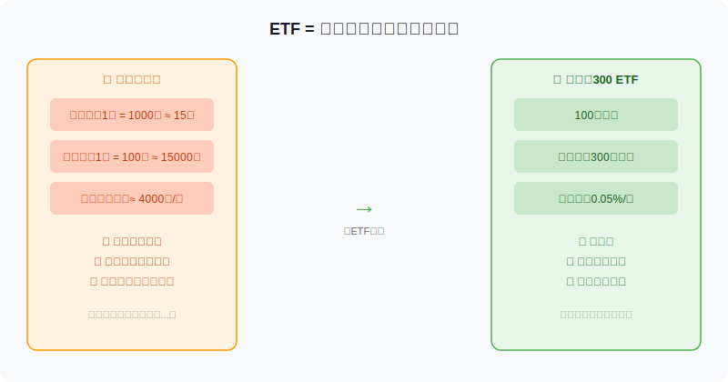
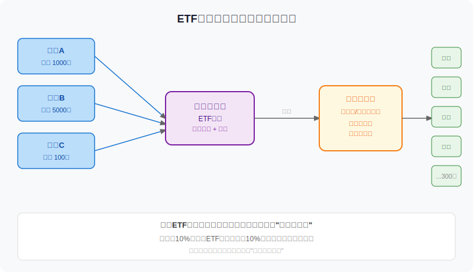
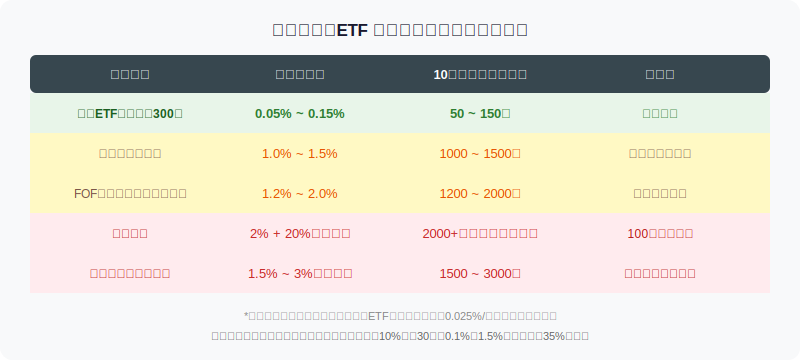

## 散户投资小白金融全品种操盘手册 - 4.1 ETF是什么 —— 用一只基金买一篮子资产
  
### 作者  
digoal  
  
### 日期  
2026-05-31  
  
### 标签  
金融产品 , 金融工具 , 散户 , 投资小白 , 全品操盘手册  
  
----  
  
## 背景 
  
  

## 先问你一个问题

2024年全年，A股主动偏股型基金的平均收益率约为**-8%**，而同期沪深300指数涨了 **14.7%** 。

也就是说，那些替你"精心选股"的专业基金经理，大部分跑输了"什么都不管、只是复制指数"的ETF。

这不是偶然，而是有系统性原因的。

而理解这一切的起点，就是搞清楚一个问题：**ETF到底是什么？**

---

## 一、用一个比喻彻底理解ETF

你去超市买水果，有两种方式：

**方式A（自己挑）**：逐个挑茅台、宁德时代、工商银行……一只只研究、一只只买，资金门槛高、精力消耗大，任何一只踩坑都可能影响全局。

**方式B（买果篮）**：直接买一个"水果礼盒"，里面按比例包含了最常见的200种水果，价格只要100块。这就是ETF。

**ETF（Exchange Traded Fund，交易型开放式指数基金）** 的本质，是把一堆资产按照特定规则打包成一个"篮子"，然后在证券交易所里像买股票一样买卖。

你买入一手ETF，就等于同时持有了篮子里所有资产的等比例份额。



---

## 二、ETF背后的运作机制

很多人会问：我买的是什么？钱去哪了？谁帮我管？

先看下图：



**运作流程分三层：**

**第一层：你（和所有投资者）**

你在交易所买入ETF份额，支付的价格叫做**市场价格**。这个价格每秒都在变动，和股票一样实时波动。

**第二层：基金管理公司**

基金公司（比如华夏基金、易方达）是ETF的"运营商"。他们的工作不是预测市场、不是择时买卖，而是严格按照**指数的成分和比例**，持有对应的股票。

沪深300 ETF就持有300只股票，按指数规定的权重配置。每隔一段时间，指数调仓了，基金公司跟着调。就这样。

**第三层：背后的成分股**

你的每一分钱，最终对应的是那些真实上市公司的股票。ETF只是一个"包装层"，本质上你持有的是一篮子股票。

**关键结论**：ETF净值的涨跌，直接来自背后成分股的整体涨跌。没有神奇之处，也没有"黑箱"。

---

## 三、第一性原理分析：ETF有效的前提是什么

很多人觉得ETF好，但说不清楚为什么好。我们用前提清单拆一下：

```
【前提清单】
支撑"ETF长期有效"成立需要以下前提：

前提A：指数成分股整体代表经济发展 → 【常量】
  → 沪深300包含中国市值最大的300家公司，长期与GDP增长正相关。
    这是一个相对稳定的结构性事实。

前提B：主动基金经理长期无法稳定跑赢指数 → 【常量】
  → 大量学术研究证明（SPIVA报告、Fama-French研究），90%+主动基金
    10年期累计跑输对应指数。费率差是核心原因之一。

前提C：市场没有长期系统性扭曲（如政策强制压指数）→ 【变量】
  → 如果监管长期压制某些行业（如2021年教培行业），包含这些成分的指数
    会长期受损。被推翻时结论变为：需选择规避受限行业的指数。

【情景推演】
正常情景（前提全部成立）：
  → ETF是散户最优性价比工具，长期收益等于市场平均水平。

压力情景（某行业受政策长期压制）：
  → 切换到剔除该行业的宽基，或选择风格更均衡的中证500/全A指数。

极端情景（市场结构失效，如长期熊市20年）：
  → ETF仍优于大多数主动基金，但需要足够长的投资周期和分散地域配置。
```

---

## 四、费率才是最被低估的问题

许多人买ETF只看收益，不看费率。但费率的复利效应远比你想的大。



**一个直观计算（数据来源：Wind 2025年计算模型）**：

假设本金10万元，年化收益率8%，持有30年：

- 年费率 **0.1%**（宽基ETF）：最终约 **96.0万元**
- 年费率 **1.5%**（主动基金）：最终约 **68.4万元**

费率差1.4%，30年后**少了将近28万**——相当于总收益少了约32%。

这就是为什么，很多"年年跑赢指数一点点"的主动基金，算上费率之后，长期回报反而不如ETF。

---

## 五、两个成功与失败案例

### 案例一（成功）：定投沪深300 ETF 10年

2015年6月高点（上证5178点）开始，每月定投沪深300 ETF（代码512010参考）1000元，不择时，坚持10年到2025年6月。

根据Wind数据回测，考虑到2015-2016年大跌、2018年熊市、2022年调整：
- 总投入约12万元
- 2025年底约估值约**16~18万元**（实际区间取决于定投时点，历史不保证未来）

**成功的关键**：不在高点停止定投，越跌越买，最终成本摊低。

### 案例二（失败）：追涨主题ETF

2021年初，新能源ETF单月涨幅超30%，大量投资者涌入。随后2022年行业调整，部分高位进入者持有2年仍未解套。

**失败的关键**：把行业ETF当成短线波段工具，高位重仓进入。行业ETF的逻辑是**轮动**，不是长期持有——这一点我们在第五节会详细讲。

> ⚠️ 历史数据不代表未来，以上案例为辅助学习使用。

---

## 六、ETF类型速览（下节展开）

在开始操作之前，你需要知道ETF其实有很多种类：

| 大类 | 代表品种 | 适合场景 |
|------|---------|---------|
| 宽基ETF | 沪深300、中证500、创业板 | 长期配置核心仓 |
| 行业ETF | 医药、半导体、消费 | 行业轮动、主题配置 |
| 债券ETF | 国债ETF、信用债ETF | 低风险配置、震荡市防守 |
| 黄金ETF | 黄金ETF（518880等） | 避险资产、通胀对冲 |
| 跨境ETF | 纳斯达克100、恒生科技 | 海外资产配置 |
| 商品ETF | 原油ETF、豆粕ETF | 通胀上行期补充 |

本节先打通最核心的逻辑。从第二节起，我们逐类拆解。

---

## 七、实操例子：第一次买ETF怎么操作

**场景假设**：小王，刚开好证券账户，有1万元闲钱，想买沪深300 ETF，不知道从哪里下手。

**第一步：确认账户类型**

沪深300 ETF是场内基金，需要**证券账户**（不是基金账户、不是银行理财账户）。如果还没开，先去券商开户。

**第二步：搜索代码**

沪深300 ETF有多只，主流的有：

- **510300**（华夏沪深300ETF，规模最大之一）
- **512010**（富国沪深300ETF）
- **159919**（嘉实沪深300ETF，深交所上市）

选规模大（>100亿）、流动性好（日成交额>1亿）的即可，差别不大。

**第三步：查看当前溢价/折价状态**

在交易软件里找"ETF溢价率"或直接看净值与市价对比。正常情况下溢价率接近0，偏差超过0.5%时要注意（高溢价买入是亏的，第八节会详讲）。

**第四步：下单**

ETF最小购买单位是**100份（1手）**，价格约3~4元/份时，1手约300~400元。1万元可以买约25~30手。

以市价单或限价单买入。不建议用追涨方式，可以设定目标价下限价单。

**如果操作失误（买贵了、溢价过高）**：
- 立即检查成交价与净值差距
- 若溢价超过1%，可以考虑在净值回归后补仓摊薄成本
- 不建议立刻亏损卖出，ETF本身没有"踩雷"问题，溢价只是买贵了一点

---

## 八、可复用框架

### 【ETF选择三看框架】

**适用场景**：第一次买ETF，不知道选哪只时

**核心逻辑**：排除差的，再在好的里选流动性最好的

**操作步骤**：
1. **看规模**：基金规模 > 20亿，否则流动性和存续风险高
2. **看成交量**：日均成交额 > 5000万，否则买卖容易出现冲击成本
3. **看跟踪误差**：近1年跟踪误差 < 0.5%，越小越忠实复制指数

**举一反三**：这个框架同样适用于选行业ETF、债券ETF、跨境ETF，三个指标通用。

---

### 【本节行动清单】

- [ ] 确认自己已开通**证券账户**（不是基金账户）
- [ ] 搜索"沪深300 ETF"，记下规模最大的3只的代码
- [ ] 查一下这3只的管理费率，对比差异
- [ ] 查一下今日净值和市场价格，算一下溢价率是多少
- [ ] 用1000元以内的金额，尝试买入1手，熟悉操作流程

---

## 一句话总结

> **ETF是散户用最低成本、最高分散度参与市场的工具——你买的不是某个人的判断，而是整个市场的平均。**

---

> ⚠️ **声明**：本文内容为投资教育目的，所有历史数据、策略框架均为辅助学习工具，不构成证券投资建议。市场有风险，投资需谨慎。实际操作请结合自身风险承受能力，必要时咨询专业投顾。
  
  
#### [PostgreSQL 解决方案集合](../201706/20170601_02.md "40cff096e9ed7122c512b35d8561d9c8")
  
  
#### [德哥 / digoal's Github - 公益是一辈子的事.](https://github.com/digoal/blog/blob/master/README.md "22709685feb7cab07d30f30387f0a9ae")
  
  
#### [About 德哥](https://github.com/digoal/blog/blob/master/me/readme.md "a37735981e7704886ffd590565582dd0")
  
  

  
