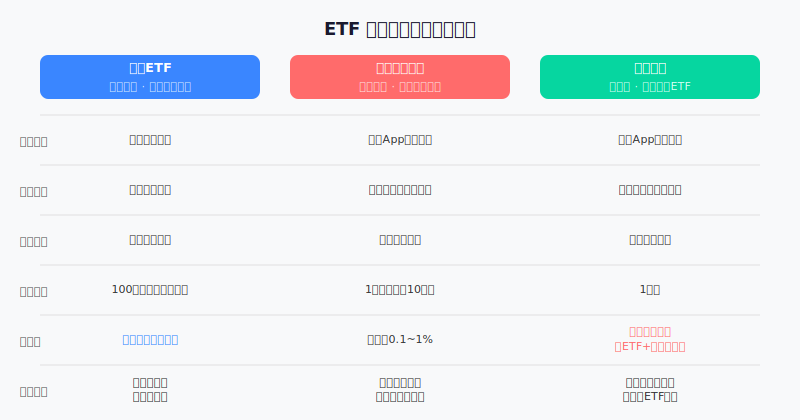
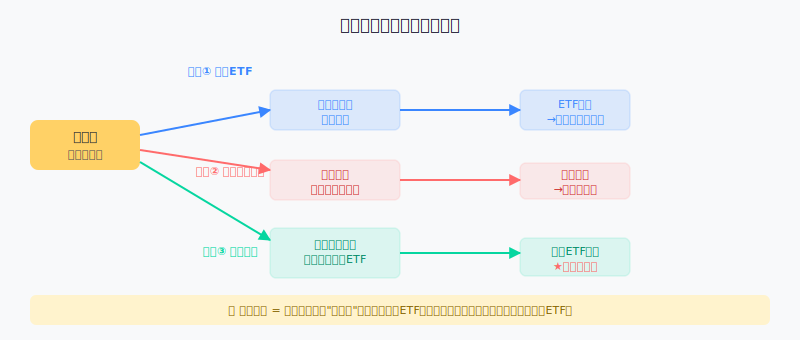
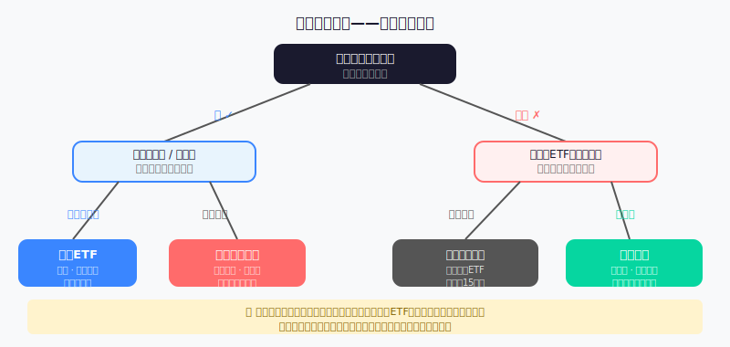

## 散户投资小白金融全品种操盘手册 - 4.2 场内ETF、场外指数基金、联接基金 —— 傻傻分不清楚？一次说透
  
### 作者  
digoal  
  
### 日期  
2026-05-31  
  
### 标签  
金融产品 , 金融工具 , 散户 , 投资小白 , 全品操盘手册  
  
----  
  
## 背景 
  

## 先问你一个问题

你在支付宝买的"沪深300指数基金"，和你在证券账户里买的"300ETF"，追踪的是同一个指数，但这两个东西**不是同一种产品**——它们的买法不同、价格确定方式不同、手续费差了好几倍，极端情况下还可能产生截然不同的结果。

搞不清楚这三个概念，很多散户都踩过同一个坑：明明选对了指数方向，却因为买错了产品，多花了钱，或者在最想买的时候买不进去。

---

## 一、它们都在追同一件事，但路径完全不同

先说结论：场内ETF、场外指数基金、联接基金，这三兄弟追踪的底层资产往往相同（比如都跟沪深300），但**进入的"门"不一样**。

用一个比喻来理解：

> 同样是去北京故宫参观，你可以——  
> ① **提前在官网买票**，直接刷码进门（场内ETF：直接交易）  
> ② **在旅游平台打包购买**，当天凭订单取票（场外指数基金：按净值申购）  
> ③ **委托旅行社代购**，旅行社去官网帮你买，收一点服务费（联接基金：中间多了一层）  
> 
> 故宫是同一个故宫，但进去的方式、等待时间、花的钱，都不一样。

---

## 二、三种产品逐一拆解

### ① 场内ETF（Exchange Traded Fund，交易所交易基金）

**是什么**：在证券交易所上市的基金，你可以像买卖股票一样，在交易时间内随时下单买入或卖出。

**买法**：用你的**证券账户**（就是平时买A股那个账户），输入代码，设价格，点买入。

**价格怎么来的**：实时市场价格。上午10点买和下午2点买，价格可能不同，供需决定价格，但通常与基金净值偏差很小（套利机制会维持这个关系）。

**最低买多少**：以"份"为单位，最少买100份。大多数宽基ETF一份几毛钱到几元，100份成本几十到几百元。

**手续费**：交易佣金，一般在万分之一到万分之三之间（部分券商更低）。另有每年的**管理费**（通常0.15%~0.5%/年）和**托管费**（0.05%~0.1%/年），这些费用是从基金净值里自动扣的，你不会感知到一笔单独扣款。

**优点**：
- 费用全市场最低
- 随时买卖，价格透明
- 可以设置限价单，精确控制成本

**缺点**：
- 必须有证券账户（需要开户，流程约15~30分钟）
- 需要自己盯着价格下单，不适合完全不看盘的懒人
- 最小交易单位是100份，不能精确买"1元"或"100元"

---

### ② 场外指数基金（普通开放式指数基金）

**是什么**：在基金公司直接申购赎回的指数基金，不在证券交易所上市，通过基金App或第三方平台买卖。

**买法**：支付宝基金、天天基金、微信基金等App，搜索基金代码或名称，点申购，输金额，确认。

**价格怎么来的**：当天收盘后计算的**基金净值（NAV）**。下午3点前提交申购 → 当天收盘算出净值 → 按这个净值确认你买了多少份额，通常次日或T+2日确认到账。

**也就是说**：今天早上8点你看到沪深300涨了，想立刻买入？你只能提交申购，但实际成交价格是当天收盘净值——中间市场又涨了还是跌了，你不知道，你也控制不了。

**最低买多少**：多数平台1元起，部分产品10元起。非常适合小额定投。

**手续费**：
- **申购费**：0%~1.5%，取决于平台和基金。很多平台有打折（如天天基金申购费打1折）
- **赎回费**：持有时间越长越低，通常持有7天以上赎回费为0%~0.5%，持有1年以上很多是0
- **年费**（管理费+托管费）：同类产品通常比ETF高一些

**优点**：
- 门槛极低，1元起步，适合小额定投
- 操作简单，在手机App上直接操作
- 可以设置自动定投（每月固定日期自动扣款）

**缺点**：
- 不能实时交易，只能按收盘净值成交
- 申购和赎回都有1~3个工作日的延迟
- 费率通常比ETF高

---

### ③ 联接基金（ETF联接基金）

**是什么**：一种特殊的场外基金，它**本身不直接持有股票**，而是把募集到的钱，拿去买对应的场内ETF。

**通俗解释**：联接基金就是一个"中间人"——你没有证券账户，但你想买某个场内ETF的策略，于是你把钱给联接基金公司，联接基金再帮你去证券市场买那个ETF。

**买法**：和场外指数基金完全一样，在基金App上申购。

**价格**：同样按收盘净值成交。

**费用**：这里是关键——

> 联接基金的费用 = 自身的管理费 + 它持有的ETF的管理费  
> 也就是说，**你实际上交了两层管理费**。

举个真实数据的例子（以2024年为参考）：
- 华夏沪深300ETF（场内）：管理费0.15%/年 + 托管费0.05%/年 = **年费0.2%**
- 华夏沪深300ETF联接A（场外）：管理费0.50%/年 + 托管费0.10%/年 = **年费0.6%**，实际还叠加了底层ETF的部分费用

> 这个差距每年是0.4个百分点。听起来不多？如果你投10万元，20年后，0.4%的费用差异会让你**少赚约8000~10000元**（复利效应下）。

**优点**：
- 场外操作方便，不需要证券账户
- 有些ETF在场内规模很小、流动性差，联接基金反而流动性更好
- 适合只想用手机App、不想开证券账户的人

**缺点**：
- 费用是三兄弟里最高的
- 收益略微跑输对应ETF（双层费用侵蚀）

---

## 三、资金是怎么流动的

关键结论：**联接基金多了一个中间层**。这一层虽然方便了没有证券账户的人，但它是有成本的。

---

## 四、第一性原理分析：为什么ETF费用最低？

**核心观点**：场内ETF的结构是三类产品中最省钱的。

**前提清单**：

支撑"场内ETF费用最低"成立，需要以下前提：

- **前提A：** 你有证券账户且会使用 → 【常量】→ 现在几乎所有券商都支持线上开户，15分钟可以完成，这个门槛几乎不构成障碍
- **前提B：** 你的投资金额能覆盖最低交易单位（100份） → 【常量，低门槛】→ 大多数宽基ETF100份成本在几十到几百元之间
- **前提C：** 你有时间在交易时段下单 → 【变量】→ 如果你完全没时间看盘，上班族可能更偏好定投模式

**情景推演**：

| 情景 | 说明 | 建议 |
|---|---|---|
| 正常情景（前提全部成立） | 使用场内ETF，费用最低，灵活性最强 | 首选场内ETF |
| 压力情景（前提C受限：完全没时间看盘） | 手动下单不现实 | 用场外指数基金开自动定投 |
| 极端情景（前提A受限：没有证券账户且不想开） | 场内ETF无法使用 | 选场外指数基金，费用比联接基金低；如必须用特定ETF策略才用联接基金 |

---

## 五、一个真实对比案例

**案例：同样追踪沪深300，2015~2024年的年化费用差异**

假设三个投资者A、B、C，2015年每人各投入10万元，分别买：
- A：华夏沪深300ETF（场内，年费0.20%）
- B：某沪深300指数基金（场外，年费0.60%）
- C：某沪深300ETF联接基金（场外，年费0.80%）

在指数表现相同的前提下，**仅费用差异**导致的复利损失（9年）：

| 产品 | 年费 | 9年累计费用损耗（10万元本金） |
|---|---|---|
| 场内ETF | 0.20% | 约1,800元 |
| 场外指数基金 | 0.60% | 约5,300元 |
| 联接基金 | 0.80% | 约7,000元 |

> 数据来源：按各基金招募说明书费率测算，2024年数据；历史费率可能有调整，不代表未来费用水平。

C和A的费用差距，9年积累下来相差约5,200元——这还只是费用差，如果本金更大、时间更长，差距会指数级放大。

---

## 六、我该选哪种？——决策树

**一句话总结选择逻辑**：
- 有证券账户 + 偶尔看盘 → **场内ETF**（费用最低）
- 有证券账户 + 只想定投 → **场外指数基金**（定投方便）
- 没有证券账户 → **先开账户**，15分钟搞定，长期省下的费用远大于开户成本
- 特殊情况（某ETF策略只有联接基金且方便你操作） → **联接基金**，但要意识到额外费用

---

## 七、常见误区排雷

**误区1：联接基金和对应ETF完全一样，买哪个都无所谓**  
❌ 错误。费用结构不同，长期下来收益差距显著。在有选择的情况下，同样策略优先选场内ETF或场外指数基金。

**误区2：场外买更安全，场内买有风险**  
❌ 错误。底层资产完全相同，买哪里都是同样的市场风险。"场外"和"场内"只是交易渠道不同，不影响风险等级。

**误区3：场内ETF价格实时变动，容易买贵**  
⚠️ 部分误解。ETF有做市商和套利机制，价格通常与净值偏差极小（一般在0.1%以内）。但如果某ETF流动性太差，盘口价差大，确实要小心——这个问题我们在第4章第10节"规模太小、流动性太差的ETF为什么危险"里会专门讲。

**误区4：场外基金申购费越低越好，打1折申购费最划算**  
⚠️ 只对了一半。申购费只是一次性成本，更要关注每年的管理费。一个申购费0.1%但管理费1%的基金，每年都在悄悄侵蚀你的收益；而一个申购费1%但管理费0.2%的ETF，5年后反而更便宜。**长期投资看年费，短期持有看申购费。**

---

## 八、实操例子

**场景设定**：小明，28岁，刚开了证券账户，打算用2000元/月做沪深300的长期定投，已经决定好了不做短线，目标持有5年以上。

**操作步骤**：

**第一步：** 确认自己有证券账户（已经有了），前往证券App，搜索"510300"（华夏沪深300ETF，仅举例，不构成投资建议）

**第二步：** 查看当前价格，估算100份的成本是否在接受范围内。比如当前价格3.8元/份，100份=380元，远低于2000元的月预算，OK。

**第三步：** 每月固定时间（比如每月5日），在交易时段内（9:30~15:00）下市价单或限价单，买入约5手（500份，约1900元），留100元作灵活资金。

**第四步：** 不要每天盯着涨跌。设置一个提醒，每季度复盘一次。

**如果操作错误（比如买成了联接基金）**：  
- 已经买入的话，不必立刻赎回（赎回要交手续费，赎回后还有再申购成本）
- 下次定投改到场内ETF即可
- 评估金额：如果已经投入不多（几千元），切换带来的手续费损失可能大于未来费用节省，不急着切换；如果金额较大（数万元以上），值得考虑逐步切换

---

## 九、可复用框架

**【三层费用检查法】**

适用场景：比较任何两个基金产品时

核心逻辑：基金成本由三层构成，必须全部算清楚才能比较真实成本

操作步骤：
1. **申购/赎回费**：一次性成本，算到你预期持有年限内摊薄为年化成本
2. **管理费+托管费**：每年固定扣，查招募说明书"费用与税率"章节
3. **隐性成本**：联接基金的底层ETF费用、指数跟踪误差（在基金季报里查"跟踪误差"指标）

举一反三：这个框架同样适用于比较REITs（第八章）、QDII基金（第九章）等任何管理类费用结构复杂的产品。

---

**【买前三问法】**

适用场景：决定通过哪个渠道买某只指数产品时

操作步骤：
1. **我有证券账户吗？** → 有：优先考虑场内ETF
2. **这个指数有场内ETF吗？** → 有：比较ETF和场外基金的年费差异
3. **年费差异是否值得开户/切换？** → 规则：年费差>0.3%，且预计持有超过3年，值得切换到费用更低的渠道

---

## 本节行动清单

- [ ] 如果还没有证券账户，今天花15分钟开一个（任意主流券商均可）
- [ ] 找出你目前持有的所有指数类产品，确认它们是哪种类型（ETF、场外指数基金、联接基金）
- [ ] 查询每只产品的年费率（管理费+托管费），填入你的投资记录表
- [ ] 如果持有联接基金，检查是否存在对应的场外指数基金或场内ETF可以替代，费用更低
- [ ] 决定未来的主要操作渠道：有时间看盘 → 证券App；完全懒人定投 → 基金App

---

## 一句话总结

> 三兄弟追同一个指数，场内ETF费用最低最灵活，场外指数基金适合懒人定投，联接基金是"方便但要额外交服务费"的中间人——大多数人开个证券账户就能绕过这个中间人。

---

> ⚠️ **声明**：本文内容为投资教育目的，所有历史数据、费率信息、策略框架均为辅助学习工具，不构成证券投资建议。文中提及任何产品代码或名称均为举例说明，不代表推荐购买。市场有风险，投资需谨慎。实际操作请结合自身风险承受能力，必要时咨询专业投顾。
  
  
#### [PostgreSQL 解决方案集合](../201706/20170601_02.md "40cff096e9ed7122c512b35d8561d9c8")
  
  
#### [德哥 / digoal's Github - 公益是一辈子的事.](https://github.com/digoal/blog/blob/master/README.md "22709685feb7cab07d30f30387f0a9ae")
  
  
#### [About 德哥](https://github.com/digoal/blog/blob/master/me/readme.md "a37735981e7704886ffd590565582dd0")
  
  

  
