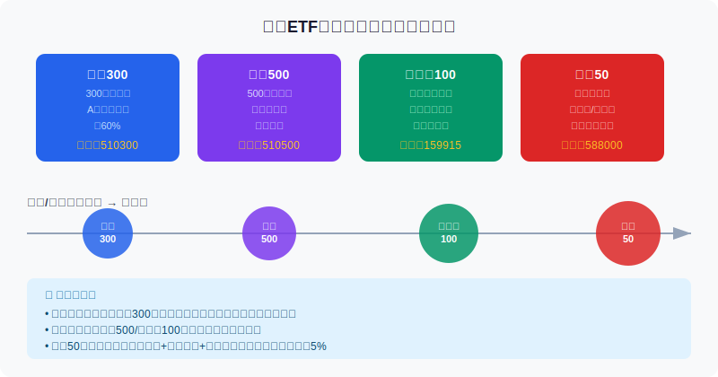
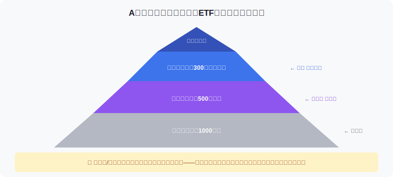
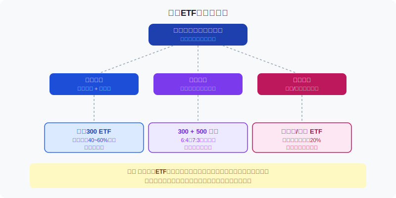

## 散户投资小白金融全品种操盘手册 - 4.3 宽基ETF —— 选哪只，买多少，何时出
  
### 作者  
digoal  
  
### 日期  
2026-05-31  
  
### 标签  
金融产品 , 金融工具 , 散户 , 投资小白 , 全品操盘手册  
  
----  
  
## 背景 
  

## 先问你一个问题

2015年A股牛市，一位朋友拿着50万扎进创业板ETF。牛市里赚了一倍多，最高仓位到了90万。他没走。结果？2015年下半年大跌，创业板指跌幅一度超60%，他的账户最终剩下不到35万——比本金还亏了15万。

同期买沪深300 ETF的另一位朋友？最大回撤约45%，最终保住了本金并有小幅盈利。

同样是买宽基ETF，差距在哪里？**选了什么品种，用了多少仓位，有没有卖出规则。**

这一节，我们认真把这三个问题讲清楚。

---

## 宽基ETF是什么？用一个比喻理解

你不可能同时照看A股5000多只股票，但你想参与整体经济增长带来的收益。

**宽基ETF，就是帮你把市场上最代表性的一批股票打包成一个"篮子"，你买一份，就等于按比例持有了篮子里所有股票。**

"宽基"的"宽"，意思是：覆盖的行业和公司足够广，不集中押注某一个主题。

它不选个股，不预测哪只股票会涨，只是跟随某个指数（沪深300、中证500等）的表现。**收益来自市场整体的长期增长，不来自选股技巧。**

这正是它适合大多数散户的理由：不需要你看财报、分析竞争格局，只需要你对这个经济体的长期前景有信心，并且有足够的耐心。

---

## 四大主流宽基ETF：你到底在买什么？

### 沪深300：A股最核心的"基准"

**覆盖范围**：沪深两市市值最大的300只股票，覆盖A股总市值约60%。

**成分特点**：金融（银行、保险、证券）、消费（白酒、食品）、制造业龙头为主；科技占比相对偏低。可以理解为：买沪深300，你买的是中国最成熟的一批上市公司。

**历史数据**：2005年以来（含基期），沪深300长期年化收益约8~10%（含分红再投资，Wind数据，截至2024年），但波动期间最大回撤曾超过70%（2008年）。

**关键认知**：沪深300的成分股里金融股权重偏高（约30%+），这意味着在利率下行、金融股估值压缩时，沪深300会跑输一些成长型指数；但在市场震荡期，它的抗跌性通常优于创业板。

**代表ETF**：华泰柏瑞沪深300 ETF（510300）、嘉实沪深300 ETF（159919），规模均超千亿，流动性极好。

---

### 中证500：中等弹性，中等风险

**覆盖范围**：把沪深300的300只剔除后，从剩余中再挑500只市值最大的——这就是中证500的范围。可以理解为：A股市值第301到800名。

**成分特点**：比沪深300更偏成长，科技、化工、医药、消费等中等规模公司比重更高；金融股权重明显低于沪深300。

**历史数据**：中证500长期年化收益与沪深300接近，但在牛市中的弹性通常更大，熊市中回撤也更深（Wind数据，历史规律，不代表未来）。

**关键认知**：如果你认为A股价值修复的核心是大盘蓝筹，选沪深300；如果你认为未来增量来自中小成长公司，中证500更接近你的逻辑。两者结合也是常见做法。

**代表ETF**：南方中证500 ETF（510500），规模超500亿，流动性良好。

---

### 创业板100（创业板指）：科技成长的放大器

**覆盖范围**：深交所创业板市值最大的100只股票（创业板指），不是全部创业板股票。

**成分特点**：新能源、半导体、医疗器械、消费电子等新兴科技领域集中度高。在A股各主要指数里，它的科技成长属性最强，弹性最高，波动也最大。

**历史数据**：2010年创立至今，创业板指经历过多次超过50%的深度回撤（2012年、2015~2016年、2021~2022年），但牛市阶段的涨幅也远超沪深300。典型案例：2019~2021年创业板牛市期间，创业板指最大涨幅约250%，远超同期沪深300的130%。

**关键认知**：不是"更好的沪深300"，而是另一种风险收益特征。高弹性的代价是你需要忍受更深的回撤，也需要对科技板块的景气度有自己的判断。

**代表ETF**：易方达创业板 ETF（159915），规模超千亿，是创业板最大ETF之一。

---

### 科创50：高风险边疆，不是小白默认选项

**覆盖范围**：上交所科创板前50只市值股票，2020年9月推出。

**成分特点**：半导体、生物医药、新材料等"硬科技"集中度极高，很多公司处于亏损或微利阶段（科创板允许未盈利公司上市）。

**关键认知**：

1. **估值高**：科创50的市盈率长期高于沪深300，成分股普遍是高研发投入、盈利不稳定的早期科技公司。
2. **波动大**：2021年推出至今，单年最大回撤曾超过40%。
3. **分散度低**：50只股票里头部10只权重可能超过60%，集中度风险高于沪深300。

**建议**：如果你对中国硬科技的长期前景有坚定信念，科创50可以作为**卫星仓**小比例参与；如果你只是觉得"科技热"想追，大概率是在追高，不适合作为核心配置。

**代表ETF**：华夏科创50 ETF（588000），规模超700亿。

---

---

## 第一性原理分析

### 核心命题：宽基ETF长期持有能跑赢通胀和现金存款

这个命题成立，需要以下前提：

**【前提清单】**

- **前提A**：中国经济长期保持正增长 → 【相对稳定变量】→ 历史上中国GDP长期增长，但增速已从高速进入中速阶段；若经济陷入长期停滞（如日本1990s），此前提将大幅弱化
- **前提B**：上市公司整体利润增长能传导到股价 → 【变量】→ 估值扩张/收缩、分红政策变化都会影响；A股历史上有过"经济增长但股市不涨"的阶段（2010~2014）
- **前提C**：你的持有周期足够长（通常建议10年以上） → 【可控变量】→ 由投资者自身决定；持有3~5年在某些时点可能仍处于浮亏状态
- **前提D**：选择的指数不会被长期"边缘化"（成分股代表性维持） → 【相对稳定】→ 沪深300、中证500的编制规则会定期调整成分股，代表性可维持

**【情景推演】**

- **正常情景（前提全部成立）**：沪深300 10年以上持有，历史统计有较高概率获得超越通胀的正回报（历史规律，不代表未来）
- **压力情景（前提B弱化）**：经济增长但资本市场估值持续压缩 → 股价可能长期徘徊 → 应对：降低仓位预期，更注重分红再投资（红利ETF更适合此情景）
- **极端情景（前提A+B同时弱化）**：经济长期低迷 + 市场估值重心下移 → 应对：降低权益资产整体比重，增配债券、黄金、境外资产对冲

---

## 四个指数的关键差异对比

| 维度 | 沪深300 | 中证500 | 创业板100 | 科创50 |
|------|---------|---------|-----------|--------|
| 股票数量 | 300 | 500 | 100 | 50 |
| 规模偏向 | 大盘 | 中盘 | 中小盘 | 中小盘 |
| 行业特征 | 金融+消费 | 成长+消费 | 科技成长 | 硬科技 |
| 历史最大回撤 | ~70%（08年） | ~75%（08年） | ~60%（15~16年） | ~45%（近年） |
| 适合环境 | 防御+稳健增值 | 成长期+弹性 | 科技牛市 | 科技主题集中押注 |
| 小白核心仓 | ✅ 首选 | ✅ 次选搭配 | ⚠️ 小比例卫星仓 | ❌ 不建议超5% |

数据来源：Wind，各指数发布机构官方数据，历史数据供参考，不代表未来表现。

---

## 实操例子：10万元如何搭配宽基ETF

**场景设定**：小张，30岁，上班族，有10万可投资闲钱（生活费已留足6个月备用金），风险偏好中等，希望长期增值，暂时不做频繁操作。

**第一步：确认目标和周期**
小张决定投资周期设定为5~10年，目标是跑赢定期存款，接受中途最大亏损20~30%不慌张。

**第二步：选品种**
- 核心仓60%（6万元）→ 沪深300 ETF（510300）：流动性最好、覆盖最广、适合长持
- 进攻仓30%（3万元）→ 中证500 ETF（510500）：增加中盘成长弹性
- 机动仓10%（1万元）→ 暂时保留，待市场回调时再加仓，或未来根据行情择机配创业板ETF

**第三步：买入方式**
- 不一次性全买，分3个月，每月买入约1/3
- 每月固定日期（比如每月10号）执行，不看涨跌都买
- 若其中某个月市场大跌超10%，可当月加大一次买入（情绪反向操作）

**第四步：明确卖出规则（必须提前写好）**
- 止损线：整体仓位亏损超35%，降仓50%，等市场稳定后再复盘
- 止盈线：沪深300估值（PE）超过18~20x且市场情绪明显过热，分批减仓至50%以内
- 纪律要求：不根据新闻和群里消息临时变卦

**如果操作错误会怎样？**
最常见错误：在市场大跌时恐慌卖出，在市场大涨情绪高涨时追加仓位。这两个操作会系统性地损害长期收益。应对方法：在开始时写好规则，设置日历提醒执行，不让情绪在操作当下介入。

---

---

## 可复用框架

**【框架名称：宽基三问法】**

适用场景：每次想买宽基ETF前，强制回答这三个问题

核心逻辑：大多数人买ETF亏钱，不是因为选错品种，而是没搞清楚自己在买什么、用什么仓位、在哪里出场

操作步骤：

1. **我在买谁的成长？**（确认指数覆盖范围：大盘稳健 or 中盘弹性 or 科技成长）
2. **这个仓位亏损30~50%时我能撑住吗？**（测试自己真实的风险承受能力，不是你"自认为"的承受能力）
3. **我的卖出规则写好了吗？**（止盈价格/条件 + 止损价格/条件，必须在买入前写在纸上）

举一反三：这个框架同样适用于买任何ETF（行业ETF、红利ETF、黄金ETF），以及后面章节讲到的个股操盘

---

**【框架名称：核心卫星配置法】**

适用场景：不知道几只ETF怎么分配仓位

核心逻辑：把资金分为"稳定核心"和"弹性卫星"，分别用于守住收益基础和捕捉市场机会

操作步骤：

1. **核心仓（50~70%）**：沪深300 ETF，长期持有，用定投方式买入，不频繁操作
2. **卫星仓（20~30%）**：中证500或创业板ETF，根据市场环境灵活增减
3. **机动仓（0~20%）**：现金或短债，待市场出现明显调整时择机加仓

举一反三：这个结构可以直接迁移到美股ETF组合（标普500 = 核心，纳斯达克100 = 卫星）

---

## 本节行动清单

- [ ] 打开你的券商APP，查一下沪深300 ETF（510300）当前的PE估值（可在基金详情页或集思录查询），记录下来
- [ ] 想清楚自己能接受最大亏损多少（20%？30%？40%？）——根据这个设定宽基ETF的总仓位上限
- [ ] 写下你的卖出规则：止盈条件是什么？止损触发后怎么做？——不写出来就没有规则
- [ ] 如果资金允许，制定一个分3个月建仓计划：每月买多少，哪天买，遇到大跌怎么处理
- [ ] 把沪深300、中证500各自的成分股前10名看一遍（在指数公司官网或基金详情页可找到）——知道自己在买谁，而不是一个符号

---

## 一句话总结

**宽基ETF的本质，是用最低的复杂度，买下中国经济最具代表性的一批公司的长期增长；它能给你多少，取决于你选对了哪个层级、用了多少仓位，以及你愿意等多久。**

---

> ⚠️ **声明**：本文内容为投资教育目的，所有历史数据、策略框架均为辅助学习工具，不构成证券投资建议。市场有风险，投资需谨慎。实际操作请结合自身风险承受能力，必要时咨询专业投顾。
  
  
#### [PostgreSQL 解决方案集合](../201706/20170601_02.md "40cff096e9ed7122c512b35d8561d9c8")
  
  
#### [德哥 / digoal's Github - 公益是一辈子的事.](https://github.com/digoal/blog/blob/master/README.md "22709685feb7cab07d30f30387f0a9ae")
  
  
#### [About 德哥](https://github.com/digoal/blog/blob/master/me/readme.md "a37735981e7704886ffd590565582dd0")
  
  

  
