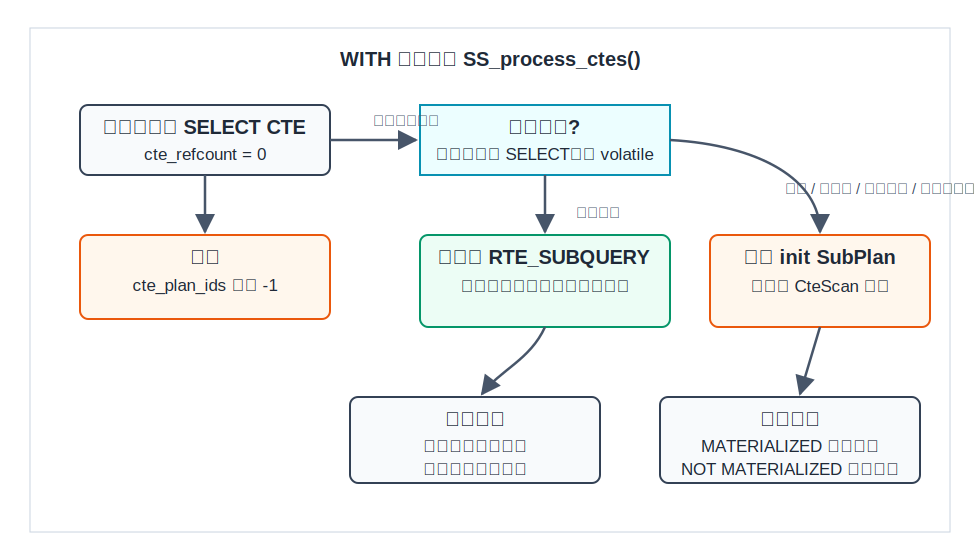
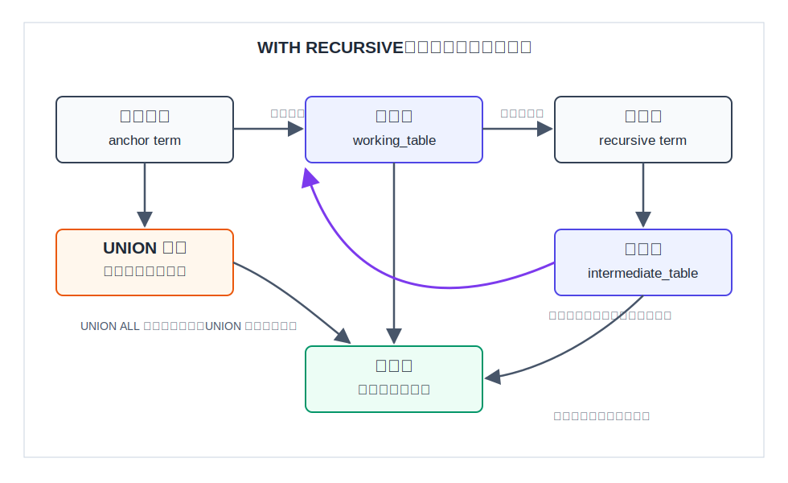
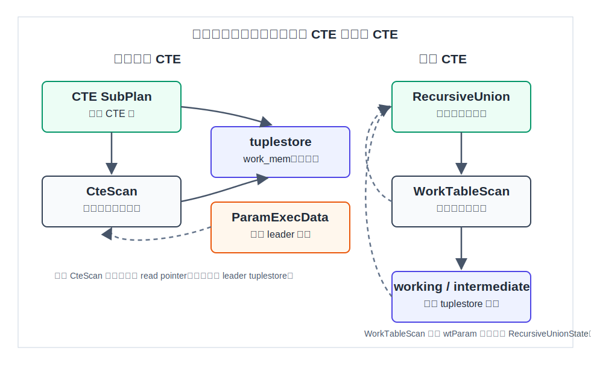
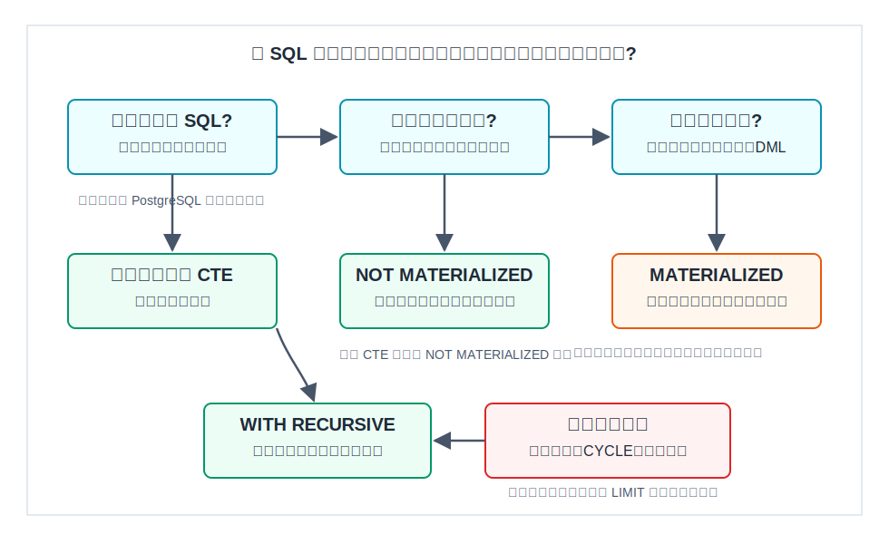

## 数据库筑基课 - 最佳实践之 CTE/递归查询

### 作者
digoal

### 日期
2026-06-01

### 标签
PostgreSQL , 应用开发者 , 数据库筑基课 , CTE , 递归查询 , 优化器 , 执行器    

----

## 背景


本文属于[应用开发者数据库筑基课大纲](../202409/20240914_01.md)里“优化&扫描&计算 -> 最佳实践 -> CTE/递归查询”这一节。

CTE 和递归查询不是“SQL 语法糖”这么简单。它们解决两类很常见的问题：

1. 把复杂 SQL 拆成可读、可验证的步骤。
2. 用 SQL 表达层级、图、依赖链、物料清单、组织架构等递归关系。

但 CTE 也经常被误用。有人把所有子查询都改成 CTE，结果谓词下推没了；有人以为 `WITH RECURSIVE` 是深度优先递归函数，结果没有写终止条件把查询跑成无限循环；也有人以为 `NOT MATERIALIZED` 一定更快，忽略了重复计算的代价。

这一节的目标不是背语法，而是建立判断框架：什么时候应该用 CTE，什么时候应该强制物化，什么时候应该内联，递归查询的执行边界在哪里，以及怎么用 `EXPLAIN` 验证自己的判断。

## 一、它解决什么问题？

CTE 首先解决“表达复杂度”。例如报表 SQL 常常要先聚合、再过滤、再关联、再排序。如果把每一步都嵌在子查询里，开发者很难验证中间结果。`WITH` 可以给每个中间关系命名，让 SQL 像流水线一样可读。

递归 CTE 解决的是普通 SQL 难以表达的问题：当前结果会产生下一轮输入。典型场景包括：

- 从一个部门找出所有下级部门。
- 从一个商品找出所有直接和间接零件。
- 从一个节点沿边遍历图。
- 从任务依赖里找出所有上游或下游任务。
- 从评论、菜单、品类里展开整棵树。

代价也很明确：

- 普通 CTE 可能成为优化围栏，导致外层过滤条件不能进入 CTE 内部。
- 物化 CTE 需要 tuplestore 存中间结果，受 `work_mem` 影响，过大时可能落盘。
- `NOT MATERIALIZED` 允许联合优化，但多次引用时可能重复执行 CTE 内部逻辑。
- 递归 CTE 是迭代执行，不是索引魔法；每轮递归项如果不能高效查下一批行，会把表反复扫描。
- `UNION` 递归要做全局去重，要求去重列可哈希，并维护已见行哈希表；`UNION ALL` 更轻，但必须自己保证终止和去环。

## 二、它是什么？

CTE 是 Common Table Expression，也就是 `WITH` 子句里定义的临时命名查询。PostgreSQL 官方文档把它描述成只在一个查询中存在的临时表式辅助语句。一个 `WITH` 项可以是 `SELECT`，也可以是带 `RETURNING` 的 `INSERT`、`UPDATE`、`DELETE`、`MERGE`。

最小形式：

```sql
WITH recent_orders AS (
    SELECT *
    FROM orders
    WHERE created_at >= current_date - interval '7 days'
)
SELECT customer_id, count(*)
FROM recent_orders
GROUP BY customer_id;
```

递归 CTE 的基本形态必须是：

```sql
WITH RECURSIVE cte_name(columns...) AS (
    non_recursive_term
  UNION [ALL]
    recursive_term_that_references_cte_name
)
SELECT ...
FROM cte_name;
```

关键术语：

| 术语 | 含义 | 工程意义 |
|---|---|---|
| 非递归项 | 第一轮种子数据 | 决定从哪里开始遍历 |
| 递归项 | 基于上一轮结果产生下一轮结果 | 决定如何扩展关系 |
| working table | 当前轮递归输入 | 每轮被 `WorkTableScan` 扫描 |
| intermediate table | 下一轮候选结果 | 一轮结束后变成新的 working table |
| `UNION ALL` | 不做全局去重 | 快，但要自己防循环 |
| `UNION` | 对结果做去重 | 可防一部分循环，但有哈希去重成本 |
| `SEARCH` | 生成排序辅助列 | 影响最终排序列，不保证实际访问顺序 |
| `CYCLE` | 生成环检测辅助列 | 防图遍历回到已访问路径 |

## 三、核心原理

### 3.1 普通 CTE：优化器先判断“内联还是物化”

PostgreSQL 在 `src/backend/optimizer/plan/subselect.c` 的 `SS_process_ctes()` 里处理 `WITH` 列表。它会逐个 CTE 判断：

- 未被引用的 `SELECT` CTE 可以忽略。
- 非递归、无副作用、纯 `SELECT`、不含 volatile 函数，并且满足引用次数条件时，可以内联成 `RTE_SUBQUERY`。
- 不适合内联的 CTE 会单独规划成 init SubPlan，外层通过 `CteScan` 读它的结果。



图 1 说明：普通 CTE 不天然等于“临时表”。PostgreSQL 12 以后，非递归且无副作用的 CTE 在单次引用时默认可能被折叠进父查询；多次引用时默认更倾向物化。`MATERIALIZED` 和 `NOT MATERIALIZED` 是把你的意图显式告诉优化器。

源码里的核心判断可以概括为：

- `CTEMaterializeAlways`，也就是显式 `MATERIALIZED`，不内联。
- 递归 CTE 不内联。
- 非 `SELECT` 或含 DML，不内联。
- 含 volatile 函数，不内联。
- 默认只内联单次引用 CTE。
- 显式 `NOT MATERIALIZED` 对应 `CTEMaterializeNever`，在满足安全条件时即使多次引用也可内联。

如果 CTE 被物化，执行器使用 `CteScanState` 里的共享 tuplestore。多个 `CteScan` 节点可以读同一个 CTE 结果；第一个初始化的节点作为 leader，持有共享的 `cte_table`，其他读者有自己的 read pointer。相关实现位于：

- `src/backend/executor/nodeCtescan.c`
- `src/include/nodes/execnodes.h`
- `src/include/nodes/plannodes.h`

### 3.2 递归 CTE：递归写法，迭代执行

PostgreSQL 文档明确说明：递归查询虽然以递归方式书写，但内部是迭代求值。执行过程是：

1. 执行非递归项，把结果放入结果流和 working table。
2. 当 working table 不为空时，执行递归项，并把当前 working table 作为自引用输入。
3. 本轮产生的新行放入结果流和 intermediate table。
4. 一轮结束后，intermediate table 变成新的 working table。
5. 如果 intermediate table 为空，终止。



图 2 说明：`WITH RECURSIVE` 的本质是“前一批结果驱动下一批结果”。如果递归项不能让 working table 逐轮收敛，就会无限迭代。`UNION` 可以对完整输出行去重，但如果输出里带 `depth`、路径、时间等每轮变化的列，单靠 `UNION` 未必能消除环。

源码里这个模型由 `src/backend/executor/nodeRecursiveunion.c` 的 `ExecRecursiveUnion()` 实现：

- `outerPlan` 是非递归项。
- `innerPlan` 是递归项。
- `working_table` 和 `intermediate_table` 都是 tuplestore。
- `UNION` 不是 `UNION ALL` 时，`numCols > 0`，执行器会用 tuple hash table 过滤已见行。
- 一轮递归项读完后，执行器清空旧 working table，交换 working 和 intermediate，再通过 `chgParam` 通知递归项重新读取新的工作表。

### 3.3 WorkTableScan：递归自引用不是读真实表

递归项里的自引用，例如：

```sql
SELECT d.*
FROM department d
JOIN subdepartment sd ON d.parent_department = sd.id
```

这里的 `subdepartment sd` 在执行时不是扫描一张真实表，而是扫描 `RecursiveUnion` 当前轮的 working table。计划节点是 `WorkTableScan`，实现位于 `src/backend/executor/nodeWorktablescan.c`。



图 3 说明：普通物化 CTE 的共享状态通过 `cteParam` 和 `ParamExecData` 在多个 `CteScan` 间传递；递归 CTE 的工作表通过 `wtParam` 从 `RecursiveUnionState` 暴露给 `WorkTableScan`。这两个 Param 都不是普通业务参数，而是执行器内部的节点通信机制。

### 3.4 SEARCH 和 CYCLE：生成辅助列，不改变底层迭代模型

PostgreSQL 支持 SQL 标准风格的 `SEARCH` 和 `CYCLE` 子句：

```sql
WITH RECURSIVE search_tree(id, parent_id) AS (
    SELECT id, parent_id
    FROM tree
    WHERE id = 1
  UNION ALL
    SELECT t.id, t.parent_id
    FROM tree t
    JOIN search_tree st ON t.parent_id = st.id
) SEARCH DEPTH FIRST BY id SET order_col
SELECT *
FROM search_tree
ORDER BY order_col;
```

`SEARCH` 生成一个可排序的序列列；`CYCLE` 生成环标记列和路径列。文档提醒：搜索顺序列用于最终排序，不等于强制执行器按深度优先或广度优先访问。`src/backend/parser/parse_cte.c` 负责检查 `SEARCH/CYCLE` 列名、扩展性和冲突；`src/include/nodes/parsenodes.h` 里有 `CTESearchClause` 和 `CTECycleClause` 节点定义。

## 四、横向对比

| 维度 | CTE 默认行为 | `MATERIALIZED` | `NOT MATERIALIZED` | 子查询 / 派生表 | 临时表 |
|---|---|---|---|---|---|
| 主要目标 | 可读性，必要时复用 | 强制只算一次或优化围栏 | 允许父查询联合优化 | 局部表达关系 | 跨语句复用中间结果 |
| 优化器空间 | 单次引用可内联，多次引用多倾向物化 | 父查询条件通常不能下推到内部 | 可以像子查询一样被联合优化 | 通常更容易被拉平和下推 | 依赖统计信息、索引、ANALYZE |
| 重复计算 | 默认避免多次引用重复计算 | 避免重复计算 | 多次引用可能重复计算 | 取决于计划重写 | 手工控制 |
| 存储代价 | 物化时使用 tuplestore | 使用 tuplestore，可能落盘 | 通常不单独存中间结果 | 通常不单独存中间结果 | 写临时关系，占临时空间 |
| 副作用控制 | DML CTE 执行一次 | 执行一次语义更明确 | 对非纯 SELECT 会被忽略 | 不适合表达 DML 中间结果 | 副作用由语句边界控制 |
| 适合场景 | 拆复杂 SQL、简单复用 | 昂贵函数、多次引用、计划围栏 | 多次引用但每次只需少量行 | 简单嵌套查询 | 大结果、多步处理、需建索引 |
| 不适合场景 | 盲目替代所有子查询 | 大结果且外层强过滤 | 昂贵表达式被多次重复算 | 多处复用复杂逻辑 | 高频短查询里的过度落地 |

这张表背后的核心是：CTE 的收益来自“命名”和“可控执行次数”，代价来自“可能挡住优化器”。如果你只是为了可读性，并且只引用一次，现代 PostgreSQL 通常能内联；如果你明确要围栏，就写 `MATERIALIZED`；如果你明确要谓词下推和联合优化，就写 `NOT MATERIALIZED`，同时接受重复计算风险。

递归 CTE 和普通 CTE 的比较更简单：

| 维度 | 普通 CTE | 递归 CTE |
|---|---|---|
| 是否自引用 | 否 | 是 |
| 计划核心节点 | `CteScan` 或内联后的子查询 | `RecursiveUnion` + `WorkTableScan` |
| 终止条件 | 查询本身读完 | recursive term 不再产生新行 |
| 去重方式 | 取决于内部 SQL | `UNION` 使用全局哈希去重，`UNION ALL` 不去重 |
| 主要风险 | 优化围栏、重复计算 | 无限循环、每轮扫描放大、路径列膨胀 |

## 五、效果如何？

不要把 CTE 当成“性能优化关键字”。它的效果取决于计划形态。

### 5.1 可能变快的情况

- 单次引用、可内联的 CTE：外层过滤条件可以进入内部，计划接近普通子查询。
- `NOT MATERIALIZED`：多次引用同一个 CTE，但每个引用点都只需要很少的行，联合优化能避免完整物化。
- `MATERIALIZED`：CTE 内部有昂贵函数或复杂聚合，多处引用时只算一次。
- 递归项 join 条件有索引：每轮只按上一轮节点查下一批节点，而不是全表扫描。

### 5.2 可能变慢的情况

- 多次引用默认物化，把一个大表完整复制进 tuplestore 后再过滤。
- `NOT MATERIALIZED` 让昂贵函数在每个引用点重复计算。
- 递归项没有有效索引，每一层都扫描全表。
- 路径数组或 composite row 数组过长，导致每行状态越来越大。
- `UNION` 去重列很多、很宽，哈希表内存压力上升。

这里不写固定性能数字，因为本文没有在当前机器执行基准测试。真正落地时应以 `EXPLAIN (ANALYZE, BUFFERS)` 验证实际行数、循环次数、临时读写和执行时间。

## 六、实操 DEMO

以下 SQL 参考 PostgreSQL 官方文档和 `src/test/regress/sql/with.sql` 的测试模式整理。当前写作环境未启动 PostgreSQL 实例，所以示例标注为未执行；语法按 PostgreSQL 文档和回归测试校验。

### 6.1 验证 CTE 是否物化

单次引用、无副作用 CTE 通常可被内联：

```sql
EXPLAIN (COSTS OFF)
WITH w AS (
    SELECT *
    FROM big_table
)
SELECT *
FROM w
WHERE key = 123;
```

如果希望它成为明确的优化围栏：

```sql
EXPLAIN (COSTS OFF)
WITH w AS MATERIALIZED (
    SELECT *
    FROM big_table
)
SELECT *
FROM w
WHERE key = 123;
```

如果一个 CTE 被多次引用，但每个引用点都有强过滤，可以尝试：

```sql
EXPLAIN (COSTS OFF)
WITH w AS NOT MATERIALIZED (
    SELECT *
    FROM big_table
)
SELECT *
FROM w w1
JOIN w w2 ON w1.key = w2.ref
WHERE w2.key = 123;
```

验证重点：

- 计划里是否出现 `CTE Scan`。
- 过滤条件是否进入底层表扫描。
- 是否有临时文件读写。
- `actual rows` 是否和估算差很多。

### 6.2 树形部门展开

```sql
CREATE TEMP TABLE department (
    id integer PRIMARY KEY,
    parent_department integer REFERENCES department(id),
    name text NOT NULL
);

INSERT INTO department VALUES
    (0, NULL, 'ROOT'),
    (1, 0, 'A'),
    (2, 1, 'B'),
    (3, 2, 'C'),
    (4, 2, 'D'),
    (5, 0, 'E'),
    (6, 4, 'F'),
    (7, 5, 'G');

CREATE INDEX ON department(parent_department);

WITH RECURSIVE subdepartment(level, id, parent_department, name, path) AS (
    SELECT 1, id, parent_department, name, ARRAY[id]
    FROM department
    WHERE name = 'A'
  UNION ALL
    SELECT sd.level + 1, d.id, d.parent_department, d.name, sd.path || d.id
    FROM department d
    JOIN subdepartment sd ON d.parent_department = sd.id
    WHERE NOT d.id = ANY(sd.path)
)
SELECT *
FROM subdepartment
ORDER BY path;
```

这个例子的关键不是 `WITH RECURSIVE` 本身，而是 `department(parent_department)`。递归项每轮都要用上一轮的 `sd.id` 找子节点，没有这个索引，层级越深扫描放大越明显。

### 6.3 使用 CYCLE 防图循环

```sql
CREATE TEMP TABLE graph (
    f integer,
    t integer,
    label text
);

INSERT INTO graph VALUES
    (1, 2, 'arc 1 -> 2'),
    (1, 3, 'arc 1 -> 3'),
    (2, 3, 'arc 2 -> 3'),
    (1, 4, 'arc 1 -> 4'),
    (4, 5, 'arc 4 -> 5'),
    (5, 1, 'arc 5 -> 1');

CREATE INDEX ON graph(f);

WITH RECURSIVE search_graph(f, t, label, depth) AS (
    SELECT f, t, label, 1
    FROM graph
    WHERE f = 1
  UNION ALL
    SELECT g.f, g.t, g.label, sg.depth + 1
    FROM graph g
    JOIN search_graph sg ON g.f = sg.t
) CYCLE f, t SET is_cycle USING path
SELECT *
FROM search_graph
WHERE NOT is_cycle
ORDER BY path;
```

`CYCLE` 会增加环标记列和路径列。它让“是否已经走过这条边或节点”成为结果的一部分，比单纯依赖 `UNION` 更适合带 `depth`、`path` 等变化列的图遍历。



图 4 说明：选择 CTE 时不要从语法出发，而要从目标出发。只是拆 SQL，普通 CTE 或子查询即可；需要下推就考虑 `NOT MATERIALIZED`；需要只算一次或阻止错误计划就考虑 `MATERIALIZED`；需要表达图或树的逐层扩展，才进入 `WITH RECURSIVE`。

## 七、最佳实践

### 面向数据库架构师

1. 为层级和图模型明确写出访问方向。例如组织树通常需要 `parent_id -> child`，依赖图可能需要正反两个方向，各自建索引。
2. 对高频递归查询评估闭包表、路径枚举、`ltree`、物化视图或增量维护表。递归 CTE 适合查询时展开，不一定适合超大规模高频实时遍历。
3. 把最大深度、最大返回行数、是否允许环写成业务约束，而不是让 SQL 临时兜底。
4. 对跨版本迁移要注意 PostgreSQL 12 前后的 CTE 行为差异。旧版本 CTE 更常被当成优化围栏；新版本可能内联。

### 面向 DBA

1. 用 `EXPLAIN (ANALYZE, BUFFERS)` 看递归项实际循环和每轮行数。重点关注 `Recursive Union`、`WorkTable Scan`、底层表扫描方式。
2. 观察临时文件：物化 CTE、排序、哈希去重、长路径数组都可能受 `work_mem` 影响。
3. 遇到递归查询慢，先看递归项 join 条件有没有索引，而不是先调参数。
4. 对可能无限递归的线上 SQL 设置语句超时，例如 `statement_timeout`，并在业务层约束最大深度。
5. 对 `UNION` 递归确认去重列的宽度和基数。宽行去重会增加哈希内存压力。

### 面向业务开发者

1. CTE 名称要表达业务阶段，例如 `candidate_users`、`active_orders`、`next_edges`，不要写 `t1`、`t2`。
2. 如果只是为了可读性，先写默认 CTE；如果计划不好，再用 `MATERIALIZED` 或 `NOT MATERIALIZED` 明确意图。
3. 递归查询必须先写终止条件：深度上限、叶子条件、`CYCLE`、路径数组，至少选一个能解释业务边界的条件。
4. 不要依赖“外层 `LIMIT` 防无限循环”作为生产方案。PostgreSQL 文档提到它可用于测试，但排序或 join 可能迫使上层拉取全部结果。
5. `SEARCH` 解决排序展示，不解决执行访问顺序；需要稳定展示顺序时仍然要在外层 `ORDER BY`。

## 八、适合与不适合场景

适合使用普通 CTE：

- 报表 SQL 需要拆阶段验证。
- 同一中间结果要在一个查询里复用。
- 想把一个复杂表达式强制只算一次。
- 想显式制造优化围栏，避免优化器把某个子查询重排到不可接受的计划。

不适合普通 CTE：

- 只是把每个小子查询机械改成 `WITH`。
- 大结果 CTE 被外层强过滤，却没有使用 `NOT MATERIALIZED` 或其他重写。
- CTE 内部调用昂贵函数，又被 `NOT MATERIALIZED` 后多次引用。

适合使用递归 CTE：

- 树形结构展开：组织、菜单、品类、评论。
- 有向图可达性：依赖、链路、血缘、权限继承。
- 层级汇总：BOM、账号上级链、区域汇总。
- 小到中等规模、边界清楚、可以通过索引逐层扩展的遍历。

不适合递归 CTE：

- 需要复杂图算法，例如最短路径、中心性、社区发现。这类问题通常应使用图数据库、专用扩展或离线计算。
- 递归深度和分支数不可控。
- 每轮扩展都要扫描大表，且无法建立有效索引。
- 需要跨多条 SQL 复用巨大中间结果；这时临时表或物化表更可控。

## 九、常见坑

1. **把 CTE 当成总能优化性能的写法。** CTE 是表达和执行边界工具，不是性能保证。
2. **多次引用大 CTE 导致完整物化。** 如果每个引用只要少量行，试 `NOT MATERIALIZED` 或重写为子查询。
3. **`NOT MATERIALIZED` 重复计算昂贵函数。** 有副作用或 volatile 的情况 PostgreSQL 会忽略该提示；普通昂贵稳定函数仍可能被重复算。
4. **递归项缺索引。** 例如 `JOIN child ON child.parent_id = work.id`，`child(parent_id)` 往往是第一优先级索引。
5. **用 `UNION` 误以为一定能防环。** 只要输出列里有每轮变化的字段，完整行就不重复。
6. **路径数组无限增长。** 深图里 `path || id` 会让行越来越宽，要设置最大深度或改模型。
7. **依赖递归输出自然顺序。** 文档说明实际输出倾向广度优先，但这是实现细节；需要顺序就显式排序。
8. **递归 DML 误解。** PostgreSQL 不支持递归的数据修改语句本身，但可以把递归 `SELECT` 的结果用于外层 DML。
9. **数据修改 CTE 修改同一行。** 官方文档说明多个数据修改 CTE 同时修改同一行时结果未指定，应该避免。
10. **忽略旧版本差异。** PostgreSQL 12 以前的 CTE 更像默认优化围栏；迁移后计划可能变化。

## 十、扩展问题

1. 如果一个 CTE 被引用两次，一次需要 1% 行，另一次需要 80% 行，应该物化还是 `NOT MATERIALIZED`？你会如何用 `EXPLAIN` 验证？
2. 树结构查询的最大深度是业务规则还是技术兜底？应该放在表约束、应用逻辑还是 SQL 里？
3. 对权限继承这种高频读取、低频变更场景，递归 CTE、闭包表、路径枚举、物化视图各自的维护成本是什么？
4. 如果递归项每轮行数呈指数增长，哪个指标最早暴露风险：行数估算、临时文件、CPU、还是锁等待？
5. 当你写 `MATERIALIZED` 时，你到底想保证“只算一次”，还是想阻止优化器重排？这两个目标是否可以用不同 SQL 改写实现？

## 十一、扩展阅读

- PostgreSQL 官方文档：`doc/src/sgml/queries.sgml`，`WITH Queries (Common Table Expressions)`、`Recursive Queries`、`Common Table Expression Materialization`。
- PostgreSQL 官方文档：`doc/src/sgml/ref/select.sgml`，`WITH [ RECURSIVE ]`、`MATERIALIZED`、`NOT MATERIALIZED`、`SEARCH`、`CYCLE` 语法说明。
- PostgreSQL 回归测试：`src/test/regress/sql/with.sql`，覆盖普通 CTE、递归 CTE、`SEARCH`、`CYCLE`、DML CTE 和错误案例。
- PostgreSQL parser 源码：`src/backend/parser/parse_cte.c`，处理 CTE 名称、引用顺序、递归合法性、`SEARCH/CYCLE` 检查。
- PostgreSQL planner 源码：`src/backend/optimizer/plan/subselect.c`，`SS_process_ctes()` 和 `inline_cte()`。
- PostgreSQL executor 源码：`src/backend/executor/nodeCtescan.c`、`nodeRecursiveunion.c`、`nodeWorktablescan.c`。
- PostgreSQL 节点定义：`src/include/nodes/parsenodes.h`、`plannodes.h`、`execnodes.h`。
- DeepWiki 辅助阅读：`postgres/postgres` 关于 query processing、planner、executor 的页面与问答，本文仅将其作为架构索引，关键结论以本地源码和官方文档为准。
  
## 附录 

1、克隆代码  
```  
git clone --depth 1 https://github.com/postgres/postgres
```  
  
2、启用 codex, 使用 [数据库筑基课 skill](../skills/README.md).  
```
文章标题: 
  数据库筑基课 - 最佳实践之 CTE/递归查询
项目源码(本地目录): 
  postgres
项目 codebase 文件名: 
  postgres/CLAUDE.md 
开源项目相关的 deepwiki repoName: 
  postgres/postgres
```
  
  
  
#### [PostgreSQL 解决方案集合](../201706/20170601_02.md "40cff096e9ed7122c512b35d8561d9c8")
  
  
#### [德哥 / digoal's Github - 公益是一辈子的事.](https://github.com/digoal/blog/blob/master/README.md "22709685feb7cab07d30f30387f0a9ae")
  
  
#### [About 德哥](https://github.com/digoal/blog/blob/master/me/readme.md "a37735981e7704886ffd590565582dd0")
  
  

  
