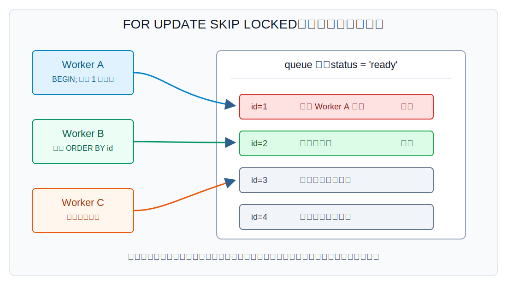
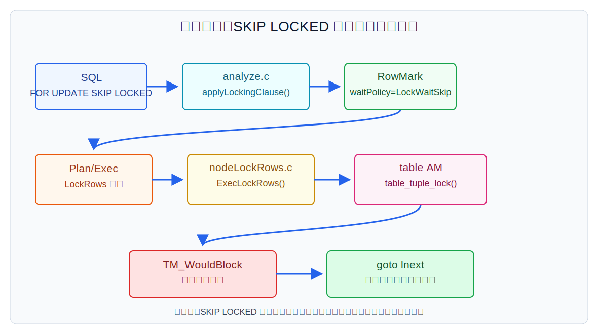
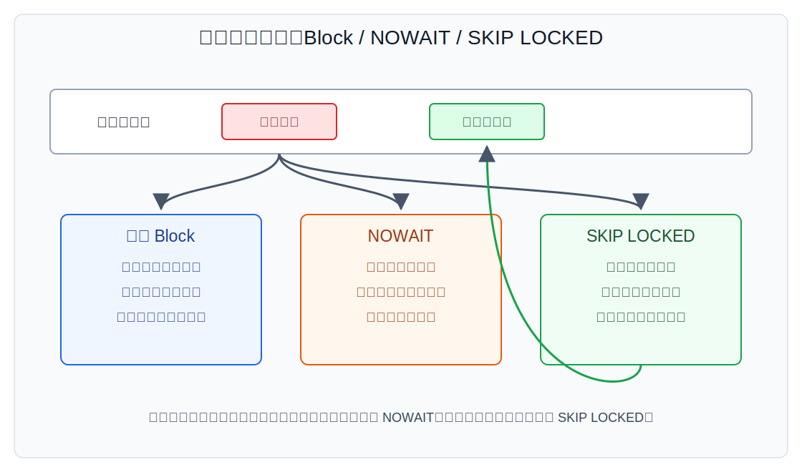
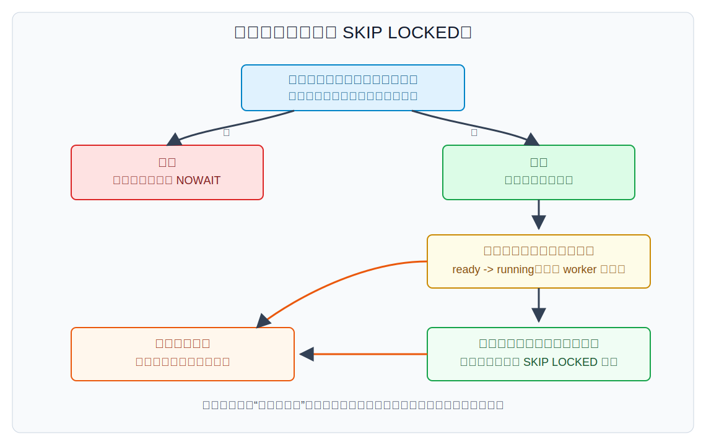

## 数据库筑基课 - 最佳实践之 skip locked row

### 作者
digoal

### 日期
2026-06-01

### 标签
PostgreSQL , 应用开发者 , 数据库筑基课 , 行锁 , MVCC , 队列 , 执行器    

----

## 背景
  


本文属于[应用开发者数据库筑基课大纲](../202409/20240914_01.md)里“并发控制 & 应用开发最佳实践 -> skip locked row”这一类能力。

业务系统里经常有一种表：它既是数据表，也是任务队列。比如短信发送、账单生成、图片转码、风控补偿、订单超时关闭、AI 推理任务。多个 worker 同时从表里取一批 `ready` 任务，谁取到谁处理。

最直接的 SQL 是：

```sql
SELECT *
FROM job_queue
WHERE status = 'ready'
ORDER BY priority DESC, id
LIMIT 100
FOR UPDATE;
```

问题是：如果排在前面的任务已经被另一个事务锁住，后面的 worker 会等在队头。明明队列后面还有很多可处理任务，消费者却被一行锁拖住。

`SKIP LOCKED` 解决的就是这个痛点：遇到暂时拿不到行锁的候选行，不等待，跳过去，继续找后面的可锁行。它把“严格按完整候选集读取”换成“尽量并发领取可用任务”。这是队列系统里很实用的工程折中，但不是通用一致性读工具。

## 一、它解决什么问题？

`SKIP LOCKED` 解决的是多消费者队列里的队头阻塞。

没有 `SKIP LOCKED` 时，多个 worker 按同一个顺序领取任务：

1. Worker A 锁住 `id = 1`，还没提交。
2. Worker B 也从 `id = 1` 开始扫，发现行锁冲突。
3. Worker B 等待 Worker A，而不是继续处理 `id = 2`。
4. 队列后面有任务，也无法被充分消费。

使用 `FOR UPDATE SKIP LOCKED` 后，Worker B 遇到 `id = 1` 拿不到锁，会跳过它，继续尝试 `id = 2`。如果 `id = 2` 可以立即加锁，Worker B 就能继续工作。



图 1 说明：`SKIP LOCKED` 的价值不在于减少单行锁的成本，而在于避免所有消费者卡在同一个热点候选行上。它适合“任务可以晚一点处理，但 worker 不能空转等待”的场景。

代价也很明确：

- 返回结果是有意不完整的。官方文档明确说明，跳过被锁行会提供不一致视图。
- 它只作用于行级锁；查询仍然会按普通方式取得必要的 `ROW SHARE` 表级锁。
- 它不能保证严格公平。长期被其他事务锁住、反复失败或排序靠前的行，可能需要额外扫尾机制。
- 它不是消息队列的全部能力。超时回收、幂等、重试、失败隔离、延迟任务、死信队列仍要自己设计。

## 二、它是什么？

`SKIP LOCKED` 是 PostgreSQL 锁定子句里的等待策略。基本语法来自 `SELECT` 的 locking clause：

```sql
FOR { UPDATE | NO KEY UPDATE | SHARE | KEY SHARE }
    [ OF table_name [, ...] ]
    [ NOWAIT | SKIP LOCKED ]
```

它可以和不同的行锁强度组合：

| 锁定子句 | 典型含义 | 常见用途 |
|---|---|---|
| `FOR UPDATE SKIP LOCKED` | 取得最强的更新型行锁，拿不到就跳过 | 多 worker 领取并修改任务 |
| `FOR NO KEY UPDATE SKIP LOCKED` | 更新非键列时常用的较弱排他锁 | 不改主键/唯一键相关列的任务流转 |
| `FOR SHARE SKIP LOCKED` | 共享锁，和部分共享读兼容 | 多会话共享读取但排斥更新 |
| `FOR KEY SHARE SKIP LOCKED` | 更弱的键共享锁 | 外键相关保护、较少用于任务领取 |

内部表示上，`SKIP LOCKED` 对应 `LockWaitPolicy` 枚举里的 `LockWaitSkip`。相关定义在 `src/include/nodes/lockoptions.h`：

```c
typedef enum LockWaitPolicy
{
    LockWaitBlock,
    LockWaitSkip,
    LockWaitError,
} LockWaitPolicy;
```

这里的顺序也有语义：当同一个关系被多个锁定子句影响时，`NOWAIT` 的优先级高于 `SKIP LOCKED`，`SKIP LOCKED` 高于默认等待。源码注释明确说明这个枚举顺序会被 `applyLockingClause()` 用来处理优先级。

## 三、核心原理

### 3.1 从 SQL 到 RowMark：把等待策略挂到关系上

解析和分析阶段会把 `FOR UPDATE SKIP LOCKED` 转换成查询树里的锁定信息。`src/backend/parser/analyze.c` 的 `transformLockingClause()` 会调用 `applyLockingClause()`，把锁强度和等待策略绑定到相应的 range table entry。

如果锁定子句没有 `OF table_name`，它会影响语句里可锁定的普通表和可下推到子查询的表。文档也提醒：顶层查询的 locking clause 不会自动作用到 `WITH` 查询内部；如果希望 CTE 内部锁行，需要在 CTE 自己的查询里写 locking clause。

执行初始化时，`src/backend/executor/execMain.c` 会基于计划里的 `PlanRowMark` 构造运行期的 `ExecRowMark`，其中包含：

- `markType`：行锁类型，例如 `ROW_MARK_EXCLUSIVE`。
- `strength`：SQL 层锁强度，例如 `LCS_FORUPDATE`。
- `waitPolicy`：等待策略，`SKIP LOCKED` 对应 `LockWaitSkip`。
- `curCtid`：当前锁住的 tuple id，供 `WHERE CURRENT OF` 和 EPQ 使用。



图 2 说明：`SKIP LOCKED` 不是优化器把被锁行提前过滤掉。被锁与否只有执行时才知道，所以真正的分支发生在执行器尝试锁 tuple 的时刻。

### 3.2 LockRows 节点：先从子计划取候选行，再尝试加锁

带 `FOR UPDATE/SHARE` 的查询计划中会出现 `LockRows` 执行节点。`src/backend/executor/nodeLockRows.c` 的 `ExecLockRows()` 是核心路径：

1. 从外层子计划取下一条候选 tuple。
2. 通过 resjunk 列拿到源表 tuple 的 `ctid`。
3. 根据 `markType` 转换成 `LockTupleMode`，例如 `ROW_MARK_EXCLUSIVE` 对应 `LockTupleExclusive`。
4. 调用 `table_tuple_lock()`，把 `erm->waitPolicy` 传进去。
5. 如果返回 `TM_WouldBlock`，说明 `SKIP LOCKED` 模式下不能立即拿到锁，执行器 `goto lnext`，继续取下一条候选行。
6. 如果成功加锁，必要时执行 EvalPlanQual 重新检查，然后返回这一行。

这个流程有两个重要含义：

- `ORDER BY ... LIMIT ... FOR UPDATE SKIP LOCKED` 的 `LIMIT` 是对成功返回的行生效，不是对原始候选行简单截断后再锁。执行器会继续寻找可返回的行，直到满足上层需求或子计划耗尽。
- 跳过发生在锁冲突处，不等于 `WHERE status = 'ready'` 的语义过滤。应用必须接受“符合条件但暂时拿不到锁的行没有出现在本次结果里”。

### 3.3 heap 层：LockWaitSkip 让等待变成条件式尝试

对普通 heap 表，`table_tuple_lock()` 最终走到 `src/backend/access/heap/heapam.c` 的 `heap_lock_tuple()`。

当 tuple 正被其他事务或 MultiXact 影响时，heap 层会检查 `wait_policy`：

- `LockWaitBlock`：等待事务或 MultiXact 结束。
- `LockWaitError`：无法立即拿锁时报错。
- `LockWaitSkip`：使用条件等待函数尝试；如果不能立即成功，返回 `TM_WouldBlock`。

相关路径包括：

- `heap_acquire_tuplock()` 中 `LockWaitSkip` 使用 `ConditionalLockTupleTuplock()`。
- 遇到 MultiXact 时使用 `ConditionalMultiXactIdWait()`。
- 遇到普通事务时使用 `ConditionalXactLockTableWait()`。
- 失败后把结果设为 `TM_WouldBlock`。



图 3 说明：默认等待、`NOWAIT`、`SKIP LOCKED` 不是三种锁强度，而是三种等待策略。锁强度决定“我想拿什么锁”，等待策略决定“拿不到时怎么办”。

### 3.4 MVCC 与 EPQ：跳过的是锁冲突，不是可见性规则

`SKIP LOCKED` 不绕过 MVCC。查询仍然先基于快照、谓词、索引或扫描路径找候选行。只有候选行需要被行锁保护时，才进入“等待、报错、跳过”的分支。

如果候选 tuple 被并发更新过，执行器可能需要 EvalPlanQual 重新取最新版本并重检条件。PostgreSQL 的隔离测试 `skip-locked-4.spec` 专门覆盖了 updated tuple chain 场景：会话先取得快照，再因为 advisory lock 暂停；另一个会话更新同一行；前一个会话继续执行 `FOR UPDATE SKIP LOCKED` 时，会在相关等待路径里跳过第一行，看到第二行。

这也是为什么不能把 `SKIP LOCKED` 理解成“稳定地拿下一批最小 id”。它在并发下的语义是：在当前执行路径中，拿到一批此刻可立即锁住的候选行。

## 四、横向对比

| 维度 | 默认 `FOR UPDATE` | `FOR UPDATE NOWAIT` | `FOR UPDATE SKIP LOCKED` | 应用层乐观更新 |
|---|---|---|---|---|
| 遇到锁冲突 | 等待 | 立即报错 | 跳过当前行 | 更新 0 行后重试 |
| 视图完整性 | 更接近完整候选集 | 不返回业务结果 | 有意不完整 | 取决于查询与更新写法 |
| 吞吐 | 队头阻塞明显时较差 | 依赖重试策略 | 多消费者队列吞吐好 | 高并发下可能重试多 |
| 公平性 | 较好，按等待队列推进 | 应用自己决定 | 可能跳过热点行 | 应用自己决定 |
| 错误处理 | 通常无锁错误 | 必须处理锁错误 | 通常无锁错误 | 必须处理抢占失败 |
| 适合场景 | 强一致业务修改 | 管理操作、快速探测 | 队列、批处理、补偿任务 | 简单抢占、无长事务 |
| 不适合场景 | 高并发任务领取 | 普通 worker 消费 | 金融顺序撮合、严格审计顺序 | 复杂多表领取 |

这里没有绝对优劣。关键取决于业务是否允许“这次先不处理某些行”。

如果是库存扣减、账户转账、订单状态机的关键路径，通常不应该为了吞吐跳过锁冲突行，因为跳过可能改变业务顺序和约束判断。如果是后台任务队列，某个任务晚几秒处理可以接受，那 `SKIP LOCKED` 很合适。

## 五、效果如何？

`SKIP LOCKED` 的主要收益是降低锁等待时间和提升多 worker 并发消费能力。

典型收益：

- 减少队头阻塞。一个慢任务或长事务不会阻塞所有消费者。
- 简化 worker 协调。多个 worker 可以直接竞争数据库行锁，不需要额外分布式锁。
- 保留事务语义。领取任务和状态更新可以放在同一事务里。
- 支持批量领取。`LIMIT 100 FOR UPDATE SKIP LOCKED` 可以一次锁住一批任务。

典型成本：

- 扫描可能放大。如果排序靠前的大量行都被锁住，执行器要跳过更多候选行才能凑够 `LIMIT`。
- 热点行可能饥饿。长期被锁或反复失败的任务需要超时回收和扫尾。
- 索引设计更重要。没有匹配 `status`、优先级、时间的索引时，多 worker 会把队列表扫成热点。
- 长事务会污染模型。worker 拿锁后长时间不提交，会让其他 worker 不断跳过这些任务。

本文不编造性能数字。落地时应使用：

```sql
EXPLAIN (ANALYZE, BUFFERS)
WITH picked AS (
  SELECT id
  FROM job_queue
  WHERE status = 'ready'
  ORDER BY priority DESC, run_at, id
  LIMIT 100
  FOR UPDATE SKIP LOCKED
)
UPDATE job_queue AS j
SET status = 'running',
    locked_by = 'worker-1',
    locked_at = clock_timestamp()
FROM picked
WHERE j.id = picked.id
RETURNING j.id;
```

重点看：

- 是否使用了能按 `status, priority, run_at, id` 缩小候选集的索引。
- `LockRows` 上游扫描了多少行，最终返回多少行。
- buffer 命中、临时 IO、执行时间是否随 worker 数上升而恶化。
- `pg_stat_activity` 里是否还有大量锁等待。

## 六、实操 DEMO

下面是一个最小队列表模型。本文未在当前环境启动 PostgreSQL 实例执行这些 SQL；语法来自 PostgreSQL 官方文档和本地源码测试用例，实际输出请以你的版本和数据为准。

### 6.1 建表与索引

```sql
CREATE TABLE job_queue (
    id          bigserial PRIMARY KEY,
    status      text        NOT NULL CHECK (status IN ('ready', 'running', 'done', 'failed')),
    priority    integer     NOT NULL DEFAULT 0,
    run_at      timestamptz NOT NULL DEFAULT now(),
    payload     jsonb       NOT NULL,
    locked_by   text,
    locked_at   timestamptz,
    retry_count integer     NOT NULL DEFAULT 0,
    created_at  timestamptz NOT NULL DEFAULT now()
);

CREATE INDEX job_queue_ready_idx
ON job_queue (priority DESC, run_at, id)
WHERE status = 'ready';
```

部分索引的目的很直接：让 worker 只在 `ready` 任务里按领取顺序扫描，减少被跳过候选行之前的无关读取。

### 6.2 原子领取一批任务

推荐把“选中可锁行”和“改成 running”放进一个语句：

```sql
WITH picked AS (
    SELECT id
    FROM job_queue
    WHERE status = 'ready'
      AND run_at <= now()
    ORDER BY priority DESC, run_at, id
    LIMIT 100
    FOR UPDATE SKIP LOCKED
)
UPDATE job_queue AS j
SET status = 'running',
    locked_by = $1,
    locked_at = clock_timestamp()
FROM picked
WHERE j.id = picked.id
RETURNING j.id, j.payload;
```

这个写法的关键是：CTE 内部加锁，外层 UPDATE 只更新已经领取到的行。官方 `UPDATE` 文档也给出类似模式，并提醒如果使用 `SKIP LOCKED` 防止多个命令更新同一行，最后可能需要无 `SKIP LOCKED`、无 `LIMIT` 的兜底更新，确保没有匹配行被遗漏。

### 6.3 完成任务

```sql
UPDATE job_queue
SET status = 'done',
    locked_by = NULL,
    locked_at = NULL
WHERE id = $1
  AND status = 'running'
  AND locked_by = $2;
```

加上 `locked_by = $2` 是为了避免 worker 误完成别人的任务。真实系统还应记录任务输出、错误信息和耗时。

### 6.4 超时回收

```sql
UPDATE job_queue
SET status = 'ready',
    locked_by = NULL,
    locked_at = NULL,
    retry_count = retry_count + 1,
    run_at = now() + interval '30 seconds'
WHERE status = 'running'
  AND locked_at < now() - interval '5 minutes'
  AND retry_count < 10;
```

没有超时回收，`SKIP LOCKED` 只能让其他 worker 绕开问题任务，不能让问题任务恢复。

## 七、最佳实践



图 4 说明：是否使用 `SKIP LOCKED`，先看业务是否允许暂时跳过，再看队列状态流转、超时回收、幂等和扫尾是否完整。没有这些配套机制，`SKIP LOCKED` 只会把阻塞问题变成遗漏和重试问题。

### 面向数据库架构师

1. 把 `SKIP LOCKED` 限定在队列、批处理、补偿、后台任务等允许乱序或延迟处理的模型里。
2. 任务表要有明确状态机，例如 `ready -> running -> done/failed`，不要只靠“谁查到了谁处理”。
3. 为领取路径建立部分索引，索引列顺序应匹配 `WHERE status = 'ready'`、`run_at <= now()`、`ORDER BY` 和稳定 tie-breaker。
4. 设计超时回收和最终扫尾。`SKIP LOCKED` 会跳过锁冲突行，不应被当成“本次没有返回就不存在”。
5. 对强顺序业务保持警惕。只要业务语义依赖“必须处理当前最早一条”，就不适合跳过。

### 面向 DBA

1. 监控 `pg_stat_activity` 的 lock wait、长事务、idle in transaction。长事务会让大量任务被持续跳过。
2. 监控队列表膨胀。高频 `ready/running/done` 更新会产生 MVCC 版本，需要合适 autovacuum 策略。
3. 用 `EXPLAIN (ANALYZE, BUFFERS)` 观察 `LockRows` 上游扫描量。如果扫描很多、返回很少，说明被锁行或无效候选太多。
4. 分批处理，控制 `LIMIT`。批太小增加往返，批太大会让单事务持有过多行锁。
5. 对历史任务做归档或分区。队列表长期堆积会让热队列索引和 vacuum 成本上升。

### 面向业务开发者

1. worker 领取后尽快提交，不要在持有数据库行锁期间做长时间外部调用。
2. 需要调用外部系统时，先把任务改成 `running` 并提交，再执行外部调用，最后用幂等条件完成任务。
3. 任务处理必须幂等。worker 崩溃、超时回收、重复领取都可能发生。
4. 每个任务记录 `locked_by`、`locked_at`、`retry_count`、错误信息，便于恢复和排障。
5. 不要用 `SKIP LOCKED` 判断“没有任务”。它只能说明本次没有找到可立即锁住且满足条件的任务。

## 八、适合与不适合场景

适合：

- 多 worker 后台任务队列。
- 批量清理、补偿、过期关闭、异步发送。
- 可以重试、可以幂等、可以延迟处理的任务。
- 候选集较大，跳过少数锁定行后仍有足够任务可处理。
- 希望用数据库事务完成领取和状态流转，而不是引入额外队列组件。

不适合：

- 金融撮合、库存精确扣减、账户余额、审批流等强顺序或强约束路径。
- 不能接受遗漏当前候选行的报表或审计查询。
- 单条任务处理时间很长，且 worker 在同一事务中一直持锁。
- 队列表没有状态机、没有超时回收、没有幂等设计。
- 候选集很小，多个 worker 总是争抢同几行。

## 九、常见坑

### 9.1 以为 `SKIP LOCKED` 不会拿表锁

官方文档说明，`NOWAIT` 和 `SKIP LOCKED` 只作用于行级锁；所需的 `ROW SHARE` 表级锁仍按普通方式取得。如果你需要表级锁也不等待，应先显式使用 `LOCK ... NOWAIT`。

### 9.2 在 CTE 外层写锁，误以为 CTE 内部也会锁

文档明确说明，locking clause 不会自动作用到主查询引用的 `WITH` 查询内部。需要锁 CTE 内部行时，应把 `FOR UPDATE SKIP LOCKED` 写在 CTE 的 `SELECT` 内。

### 9.3 只 SELECT 不 UPDATE 状态

如果 worker 只是：

```sql
SELECT *
FROM job_queue
WHERE status = 'ready'
ORDER BY id
LIMIT 1
FOR UPDATE SKIP LOCKED;
```

然后在事务外处理任务，就会失去行锁保护。正确模式通常是同一事务内把任务状态改成 `running`，提交后再处理。

### 9.4 持锁期间做慢操作

在事务里调用 HTTP、跑大模型、上传对象存储，都会延长行锁持有时间。`SKIP LOCKED` 能减少其他 worker 等待，但不能消除长事务带来的膨胀、跳过和恢复问题。

### 9.5 没有稳定排序

`ORDER BY priority DESC` 如果没有稳定 tie-breaker，多个 worker 在同优先级任务上的扫描顺序可能不稳定。建议加 `run_at, id` 这类稳定列。

### 9.6 没有最终扫尾

因为 `SKIP LOCKED` 会主动跳过冲突行，所以批处理命令跑完不代表所有匹配行都处理完。对“必须最终处理完”的场景，需要无 `SKIP LOCKED` 的扫尾、超时回收或补偿流程。

### 9.7 忽略 MultiXact 和共享锁场景

PostgreSQL 的隔离测试覆盖了 `FOR SHARE SKIP LOCKED` 与 MultiXact 的情况。共享锁不是“没有冲突”，当后续要升级到更强锁时仍可能跳过。

### 9.8 和 `FETCH ... WITH TIES` 混用

PostgreSQL 不允许 `SKIP LOCKED` 和 `WITH TIES` 同时使用。原因很容易理解：`WITH TIES` 要根据排序边界返回所有并列行，而 `SKIP LOCKED` 会有意跳过部分候选行，两者的结果语义冲突。回归测试 `src/test/regress/sql/limit.sql` 和期望输出 `src/test/regress/expected/limit.out` 覆盖了这个错误。

## 十、扩展问题

1. 如果任务处理必须严格按 `created_at` 顺序，`SKIP LOCKED` 破坏了什么业务假设？
2. 如果 worker 拿到任务后崩溃，系统如何判断任务应该重试、失败还是人工介入？
3. `LIMIT 1` 和 `LIMIT 100` 在锁竞争、事务长度、吞吐和失败恢复上各有什么代价？
4. 当 `ready` 任务很多但能成功领取的很少时，应该优化索引、拆分队列、分区，还是降低 worker 并发？
5. 如果要迁移到 Kafka、Redis Stream、RabbitMQ，数据库队列表还应该保留哪些状态用于幂等和审计？

## 十一、扩展阅读

- PostgreSQL 官方文档：`SELECT` 的 locking clause，`FOR UPDATE/SHARE`、`NOWAIT`、`SKIP LOCKED` 语义和限制，`doc/src/sgml/ref/select.sgml`。
- PostgreSQL 官方文档：`UPDATE` 中使用 CTE、`ORDER BY`、`LIMIT`、`SKIP LOCKED` 做批量更新的示例与扫尾提醒，`doc/src/sgml/ref/update.sgml`。
- PostgreSQL 官方文档：MVCC 与 row-level locks，`doc/src/sgml/mvcc.sgml`。
- PostgreSQL 回归测试：`SKIP LOCKED` 与 `FETCH ... WITH TIES` 不兼容，`src/test/regress/sql/limit.sql` 和 `src/test/regress/expected/limit.out`。
- PostgreSQL 源码：锁等待策略定义，`src/include/nodes/lockoptions.h`。
- PostgreSQL 源码：运行期 rowmark 结构，`src/include/nodes/execnodes.h`。
- PostgreSQL 源码：locking clause 分析与下推，`src/backend/parser/analyze.c`。
- PostgreSQL 源码：执行期 rowmark 初始化，`src/backend/executor/execMain.c`。
- PostgreSQL 源码：`LockRows` 执行节点和 `TM_WouldBlock` 跳过逻辑，`src/backend/executor/nodeLockRows.c`。
- PostgreSQL 源码：heap tuple lock、`ConditionalXactLockTableWait()`、`ConditionalMultiXactIdWait()`、`heap_acquire_tuplock()`，`src/backend/access/heap/heapam.c`。
- PostgreSQL 隔离测试：`src/test/isolation/specs/skip-locked.spec`、`skip-locked-2.spec`、`skip-locked-3.spec`、`skip-locked-4.spec`。
- DeepWiki：`postgres/postgres` 关于 `SELECT FOR UPDATE SKIP LOCKED` 实现路径的问答，用于架构索引；关键结论已用本地源码核对。
  
## 附录 

1、克隆代码  
```  
git clone --depth 1 https://github.com/postgres/postgres
```  
  
2、启用 codex, 使用 [数据库筑基课 skill](../skills/README.md).  
```
文章标题: 
  数据库筑基课 - 最佳实践之 skip locked row
项目源码(本地目录): 
  postgres
项目 codebase 文件名: 
  postgres/CLAUDE.md 
开源项目相关的 deepwiki repoName: 
  postgres/postgres
```
  
  
  
#### [PostgreSQL 解决方案集合](../201706/20170601_02.md "40cff096e9ed7122c512b35d8561d9c8")
  
  
#### [德哥 / digoal's Github - 公益是一辈子的事.](https://github.com/digoal/blog/blob/master/README.md "22709685feb7cab07d30f30387f0a9ae")
  
  
#### [About 德哥](https://github.com/digoal/blog/blob/master/me/readme.md "a37735981e7704886ffd590565582dd0")
  
  

  
