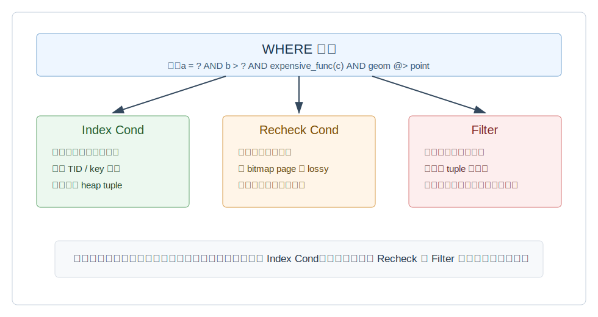
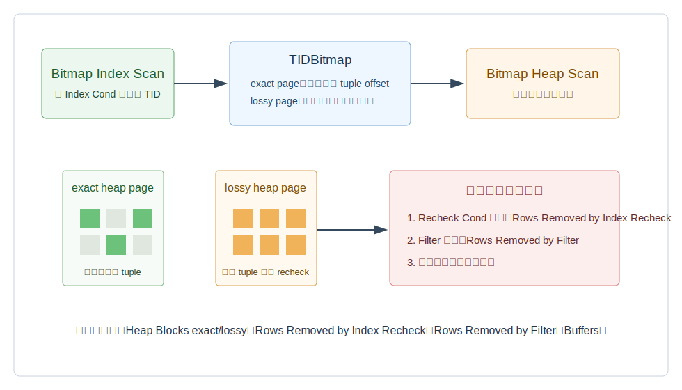
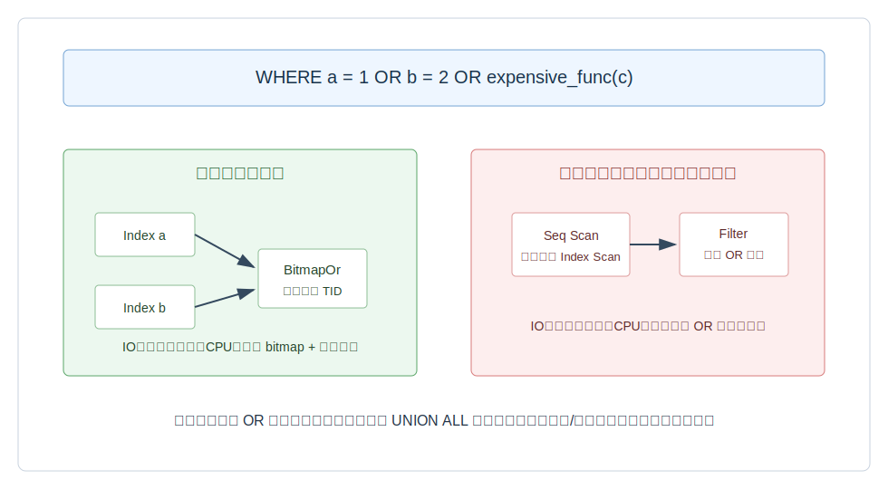
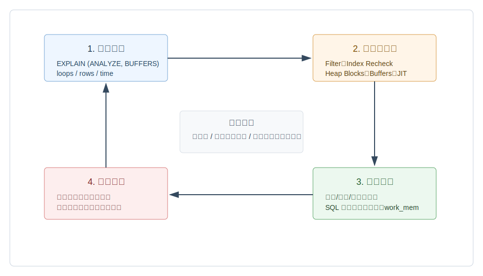

## 数据库筑基课 - 最佳实践之 IO&CPU 放大的优化(后置过滤 / 索引 boundbox / cpu 额外运算 OR recheck)

### 作者
digoal

### 日期
2026-06-01

### 标签
PostgreSQL , 应用开发者 , 数据库筑基课 , 执行计划 , 索引 , Bitmap Scan , Recheck , CPU 放大 , IO 放大    

----

## 背景
  


本文属于[应用开发者数据库筑基课大纲](../202409/20240914_01.md)里“查询优化、索引设计与执行计划诊断”这一类基础能力。

很多慢 SQL 看起来都像“数据库没有用好索引”，但真正的问题经常不是“有没有索引”，而是：

- 条件虽然写在 `WHERE` 里，却只能作为 `Filter` 后置过滤，扫描和回表已经发生。
- 索引只能给出 boundbox、签名、hash 或 bitmap 候选，必须回到 heap tuple 做 `Recheck Cond`。
- `OR`、函数、类型转换、表达式不匹配、低选择性条件让每一行都多做 CPU 判断。
- Bitmap 受内存、索引近似性或访问方法影响，候选集扩大，表现为 `Rows Removed by Index Recheck`、`Heap Blocks: lossy=...` 或大量 buffer 访问。

优化这类问题的关键不是背“建索引”三个字，而是先回答四个问题：

1. 这个条件是在索引里缩小候选集，还是取到 tuple 后才判断？
2. 索引返回的是精确命中，还是可能命中的候选？
3. 每个候选 tuple 还要做多少 CPU 表达式计算？
4. `EXPLAIN (ANALYZE, BUFFERS)` 里有没有证据证明优化真的减少了候选行、读页和重检？

## 一、它解决什么问题？

本文解决的是查询中的 IO 放大和 CPU 放大。

所谓 IO 放大，是业务只要几十行，数据库却读了大量 heap page、index page 或临时块。所谓 CPU 放大，是候选行已经被读出来，但每一行还要执行大量布尔表达式、函数、类型转换、`OR` 分支、索引重检或可见性检查，最后大部分被丢弃。

典型现象：

```sql
EXPLAIN (ANALYZE, BUFFERS)
SELECT *
FROM orders
WHERE tenant_id = 42
  AND status = 'paid'
  AND created_at >= now() - interval '7 days'
  AND (buyer_phone = '13800000000' OR buyer_email = 'a@example.com')
  AND lower(extra->>'channel') = 'wechat';
```

你可能看到几类信号：

```text
Index Cond: (tenant_id = 42)
Filter: ((status = 'paid'::text) AND ... )
Rows Removed by Filter: 980000
Buffers: shared hit=...
```

或者：

```text
Bitmap Heap Scan
  Recheck Cond: (...)
  Rows Removed by Index Recheck: ...
  Heap Blocks: exact=... lossy=...
```

这些输出分别说明：索引只完成了候选定位，剩下的条件还在执行器里逐行判断；或者索引/bitmap 返回了“可能匹配”的候选，需要回表精确确认。

代价也很明确：把条件前移到索引通常会增加写入成本、索引空间、维护成本和计划选择复杂度。优化目标不是“所有条件都进索引”，而是把最能减少候选集、最稳定、最常用的条件前移。

## 二、它是什么？

从 PostgreSQL 执行计划看，一条 `WHERE` 条件大致会被分成三类：

| 计划字段 | 含义 | 主要代价 | 优化方向 |
|---|---|---|---|
| `Index Cond` | 索引访问方法可以直接使用的条件 | index page 访问、候选 TID 数量 | 让高选择性条件匹配索引列、表达式、操作符类和排序 |
| `Recheck Cond` | 候选 tuple 回表后需要重新确认的索引条件 | 回表 IO、重检 CPU、误判候选 | 降低 lossy 比例、换更精确索引、调大 bitmap 可用内存、缩小 boundbox |
| `Filter` | 扫描节点拿到 tuple 后才执行的普通过滤 | 每个候选 tuple 的 CPU 计算；不能减少已发生 IO | 复合索引、部分索引、表达式索引、SQL 改写、预计算列 |



图 1 说明：`WHERE` 不是一个整体开关。优化器会把能被索引访问方法处理的部分放进 `Index Cond`，把可能需要精确确认的部分保留为 `Recheck Cond`，把剩余条件放进执行节点的 `Filter`。真正影响 IO 的是候选集在哪里被缩小；真正影响 CPU 的是有多少 tuple 要执行剩余表达式。

源码里对应的术语是 `indexqual`、`bitmapqualorig`、`qpqual`。

- `src/include/nodes/plannodes.h` 说明 `IndexScan.indexqualorig` 在 lossy indexqual 需要 runtime recheck 时使用。
- `BitmapHeapScan.bitmapqualorig` 保存 bitmap 输入索引条件的原始表达式，因为 bitmap 对页面内具体行可能是 lossy 的。
- `src/backend/optimizer/plan/createplan.c` 在 `create_indexscan_plan()` 和 `create_bitmap_scan_plan()` 里构造 `qpqual`，也就是没有被索引自动处理、需要执行器再判断的条件。

## 三、核心原理

### 3.1 后置过滤：`Filter` 只减少输出，不减少已扫描候选

PostgreSQL 官方 `EXPLAIN` 文档用 `tenk1` 示例说明：顺序扫描里 `Filter` 会对每一行检查条件，只输出通过条件的行。它还明确指出，即使 `WHERE unique1 < 7000` 让输出估算变少，扫描仍要访问全部 10000 行，成本还会因为每行额外检查条件而上升。

这就是后置过滤的本质：

```sql
-- 如果只有 tenant_id 索引，status 和 created_at 可能仍是 Filter
CREATE INDEX idx_orders_tenant ON orders (tenant_id);

EXPLAIN
SELECT *
FROM orders
WHERE tenant_id = 42
  AND status = 'paid'
  AND created_at >= timestamp '2026-05-01';
```

可能出现：

```text
Index Scan using idx_orders_tenant on orders
  Index Cond: (tenant_id = 42)
  Filter: ((status = 'paid'::text) AND (created_at >= '2026-05-01'::timestamp))
```

这并不代表索引没用。它代表索引用 `tenant_id` 找到了候选行，但 `status` 和 `created_at` 没有继续减少索引候选。若某个租户下有 100 万行，最后只要 100 行，后置过滤就是主要放大源。

更合适的索引可能是：

```sql
CREATE INDEX idx_orders_tenant_status_created
ON orders (tenant_id, status, created_at);
```

如果业务只查未归档订单，还可以用部分索引缩小维护范围：

```sql
CREATE INDEX idx_orders_active_paid_recent
ON orders (tenant_id, created_at)
WHERE status = 'paid' AND archived = false;
```

注意边界：复合索引不是把所有 `WHERE` 列堆进去。高频等值列、范围列、排序列、覆盖列和写入成本要一起评估。

### 3.2 索引 boundbox 与 recheck：候选不是结果

某些索引并不保存完整可判定信息，而是保存近似表示。例如：

- GiST 几何索引常用 bounding box。索引能判断“可能相交/包含”，但 exact geometry predicate 还要回表确认。
- Bloom 索引用签名表示多个列，天然可能有 false positive。
- Hash index 只存 hash code，源码注释明确写着 hash index scan 总是 lossy，因为只存 hash code，所以 `xs_recheck = true`。
- Bitmap Heap Scan 在 bitmap 变 lossy page 时，只知道整页可能有匹配 tuple，页内 tuple 都要重检。

执行器路径在 `src/backend/executor/nodeIndexscan.c` 很直接：`index_getnext_slot()` 拿到 tuple 后，如果 `scandesc->xs_recheck` 为真，就用 `indexqualorig` 重新执行条件；失败则 `InstrCountFiltered2()`，继续取下一条。`EXPLAIN` 会把这类计数显示为 `Rows Removed by Index Recheck`。

Bitmap 路径在 `src/backend/executor/nodeBitmapHeapscan.c`：`Bitmap Index Scan` 先生成 `TIDBitmap`，`Bitmap Heap Scan` 再按 heap page 访问。若 `table_scan_bitmap_next_tuple()` 设置 `recheck`，执行器就对 `bitmapqualorig` 做 `ExecQualAndReset()`；失败同样计入 index recheck 过滤。



图 2 说明：Bitmap Scan 的优势是把随机 TID 访问整理成按 heap page 的访问，减少随机 IO；代价是构建 bitmap、合并 bitmap、可能出现 lossy page，并且 `Recheck Cond` 不等于免费。

官方文档里有一个 GiST polygon 示例：强制使用索引后，索引返回一个候选行，但 recheck 后被丢弃，显示 `Rows Removed by Index Recheck: 1`。文档解释原因是 GiST 对 polygon containment 是 lossy 的，实际返回的是 overlap 候选，需要做精确 containment test。

Bloom 扩展文档也展示了更极端的例子：`Bitmap Heap Scan` 上出现 `Rows Removed by Index Recheck: 2300` 和 `Heap Blocks: exact=2256`。这说明索引候选并不等于真实结果，false positive 会转化成 heap 访问和 CPU 重检。

### 3.3 `OR` 与额外 CPU：不是每个分支都能被索引吸收

`OR` 是放大问题的高发点。

可优化的情况：

```sql
WHERE buyer_phone = '13800000000'
   OR buyer_email = 'a@example.com'
```

如果两个字段都有合适索引，优化器可能生成 `BitmapOr`，分别从两个索引拿候选 TID，再做 bitmap union。

不可优化或不划算的情况：

```sql
WHERE buyer_phone = '13800000000'
   OR lower(extra->>'channel') = 'wechat'
   OR expensive_plpgsql_func(payload)
```

如果某个分支没有表达式索引、函数不可 immutable、选择性太差，或者整体成本不如顺序扫描，计划可能变成大范围扫描后逐行执行 `OR`。这时 IO 放大来自“候选太宽”，CPU 放大来自“每行计算多个分支”。



图 3 说明：`OR` 的好计划要求每个分支都有可用路径。PostgreSQL 源码 `src/backend/optimizer/path/indxpath.c` 的 `generate_bitmap_or_paths()` 注释说明：必须能为 OR 的每个 arm 匹配至少一个索引路径，否则不能用这个 OR clause 生成 BitmapOrPath。

常见改写方式：

```sql
-- 写法 A：让优化器尝试 BitmapOr
SELECT *
FROM customer
WHERE buyer_phone = '13800000000'
   OR buyer_email = 'a@example.com';
```

```sql
-- 写法 B：当 OR 分支差异很大时，手工拆成两个可索引查询
SELECT *
FROM customer
WHERE buyer_phone = '13800000000'
UNION
SELECT *
FROM customer
WHERE buyer_email = 'a@example.com';
```

如果能证明两个分支不会重复，用 `UNION ALL` 避免去重成本：

```sql
SELECT *
FROM customer
WHERE buyer_phone = '13800000000'
UNION ALL
SELECT *
FROM customer
WHERE buyer_email = 'a@example.com'
  AND buyer_phone IS DISTINCT FROM '13800000000';
```

这个写法不是永远更快。它用 SQL 复杂度换取更稳定的索引路径，需要用真实数据复测。

### 3.4 成本模型：`qpqual` 不减少取数成本，只增加每 tuple CPU

`src/backend/optimizer/path/costsize.c` 的 `cost_index()` 注释非常关键：`path->indexquals` 只能包含可作为 index restriction 的条件；额外作为 `qpqual` 执行的条件可能减少返回 tuple 数量，但不会减少必须从表里取出的 tuple 数量，所以不降低扫描成本。

这句话可以翻译成工程语言：

> 如果条件没有进入 `Index Cond`，它再精准，也只是“读出来以后少返回”，不是“少读”。

因此优化慢 SQL 时，不要只看最终 `rows=...`。要看：

- `Index Cond` 是否足够窄。
- `Filter` 前的候选行是否太多。
- `Rows Removed by Filter` 是否远大于返回行。
- `Rows Removed by Index Recheck` 是否说明索引 false positive 太多。
- `Heap Blocks exact/lossy` 是否说明 bitmap 内存或候选页范围太宽。
- `Buffers shared read/hit` 是否和业务返回行数不成比例。

## 四、横向对比

| 维度 | 后置过滤 `Filter` | Bitmap/Recheck | 精确复合 B-tree Index Cond | 表达式/部分索引 | SQL 拆分 OR |
|---|---|---|---|---|---|
| 主要目标 | 在扫描节点输出前过滤 | 用候选集合减少随机访问 | 在索引阶段缩小候选 | 让原本不可索引条件前移 | 让每个分支单独走索引 |
| IO 影响 | 通常不能减少已访问 tuple/page | 可能减少随机 IO，但可能回表重检 | 通常最直接减少 heap 访问 | 取决于谓词和表达式匹配 | 取决于分支选择性 |
| CPU 影响 | 每个候选都要算条件 | 候选要算 recheck | 索引比较成本，候选少 | 写入时多算表达式/维护索引 | 多次查询、可能去重 |
| 写入代价 | 无额外索引代价 | 索引已有代价 | 增加索引维护 | 增加表达式计算和索引维护 | 无写入代价 |
| 计划稳定性 | 简单但可能慢 | 受统计、work_mem、选择性影响 | 数据分布稳定时较好 | 依赖查询表达式完全匹配 | SQL 更显式但更复杂 |
| 适合场景 | 小表、低频、候选很少 | 多索引组合、范围候选、空间/全文/Bloom | 高频等值 + 范围查询 | JSON、函数归一化、状态子集 | OR 分支高度异构 |
| 不适合场景 | 大候选集后筛 | false positive 极高、lossy page 多 | 写多读少、低选择性列过多 | 表达式易变、谓词不稳定 | 需要复杂去重且分支重叠大 |

原因很简单：索引条件越早缩小候选，IO 越容易下降；但索引越多、越复杂，写入和维护越贵。Bitmap 和 recheck 是中间态，常常比顺序扫描好，但不是“用了索引就精确命中”。

## 五、效果如何？

优化目标不要写成“使用索引”，而要写成可验证指标：

- `Rows Removed by Filter` 明显下降。
- `Rows Removed by Index Recheck` 明显下降，或者能解释为什么可接受。
- `Heap Blocks: lossy=...` 下降，或保持为 0。
- `Buffers shared read/hit` 与返回行数更匹配。
- `actual rows` 与估算 rows 更接近。
- 查询总时间下降，同时写入延迟、索引膨胀和 autovacuum 压力可接受。

诊断闭环如下：



图 4 说明：一次优化不是看到 `Seq Scan` 就建索引，而是先定位放大源，再选择动作，再用同样数据和参数复测。否则很容易把一个慢查询变成写入系统的长期负担。

## 六、实操 DEMO

下面 SQL 是最小可验证实验模板。本文没有在当前环境启动 PostgreSQL 实例执行这些 SQL；示例语法依据 PostgreSQL 官方文档和本地源码路径整理，实际输出请以你的版本、数据分布和配置为准。

### 6.1 后置过滤放大

```sql
DROP TABLE IF EXISTS demo_orders;
CREATE TABLE demo_orders (
  id bigserial PRIMARY KEY,
  tenant_id int NOT NULL,
  status text NOT NULL,
  created_at timestamp NOT NULL,
  amount numeric(12,2) NOT NULL,
  payload jsonb NOT NULL DEFAULT '{}'
);

INSERT INTO demo_orders (tenant_id, status, created_at, amount, payload)
SELECT
  (g % 100),
  CASE WHEN g % 20 = 0 THEN 'paid' ELSE 'new' END,
  timestamp '2026-01-01' + (g % 120) * interval '1 day',
  (g % 10000)::numeric / 10,
  jsonb_build_object('channel', CASE WHEN g % 50 = 0 THEN 'wechat' ELSE 'web' END)
FROM generate_series(1, 1000000) AS g;

ANALYZE demo_orders;

CREATE INDEX demo_orders_tenant_idx ON demo_orders (tenant_id);

EXPLAIN (ANALYZE, BUFFERS)
SELECT *
FROM demo_orders
WHERE tenant_id = 42
  AND status = 'paid'
  AND created_at >= timestamp '2026-03-01';
```

观察点：

- `status` 和 `created_at` 是否在 `Filter`。
- `Rows Removed by Filter` 是否远大于返回行。
- `Buffers` 是否明显超过业务预期。

改进：

```sql
CREATE INDEX demo_orders_tenant_status_created_idx
ON demo_orders (tenant_id, status, created_at);

EXPLAIN (ANALYZE, BUFFERS)
SELECT *
FROM demo_orders
WHERE tenant_id = 42
  AND status = 'paid'
  AND created_at >= timestamp '2026-03-01';
```

对比 `Index Cond`、候选行、buffer 和执行时间。

### 6.2 表达式过滤前移

如果查询经常写：

```sql
EXPLAIN (ANALYZE, BUFFERS)
SELECT *
FROM demo_orders
WHERE lower(payload->>'channel') = 'wechat';
```

普通列索引不能直接吸收这个表达式。可以考虑表达式索引：

```sql
CREATE INDEX demo_orders_channel_expr_idx
ON demo_orders ((lower(payload->>'channel')));

EXPLAIN (ANALYZE, BUFFERS)
SELECT *
FROM demo_orders
WHERE lower(payload->>'channel') = 'wechat';
```

边界：

- 表达式必须和查询写法匹配。
- 函数应稳定可用于索引表达式；不要把易变逻辑塞进索引。
- JSON 表达式索引会增加写入和更新成本。

### 6.3 OR 拆分验证

```sql
CREATE INDEX demo_orders_amount_idx ON demo_orders (amount);
CREATE INDEX demo_orders_created_idx ON demo_orders (created_at);

EXPLAIN (ANALYZE, BUFFERS)
SELECT *
FROM demo_orders
WHERE amount = 123.4
   OR created_at >= timestamp '2026-04-01';
```

观察是否出现 `BitmapOr`。如果其中一个分支选择性很差，优化器可能认为顺序扫描更便宜。此时可以测试拆分写法：

```sql
EXPLAIN (ANALYZE, BUFFERS)
SELECT *
FROM demo_orders
WHERE amount = 123.4
UNION
SELECT *
FROM demo_orders
WHERE created_at >= timestamp '2026-04-01';
```

如果两个分支互斥，再测试 `UNION ALL`。不要在没有去重语义把握时随意把 `UNION` 改成 `UNION ALL`。

## 七、最佳实践

### 面向数据库架构师

把查询拆成“定位条件、排序条件、过滤条件、投影列、更新列”五类，不要只看 `WHERE`。

推荐做法：

- 对核心路径建立少量高价值复合索引，优先覆盖租户/分区键、状态、时间范围、排序键。
- 对“只查活跃数据”的业务使用部分索引，避免全量索引维护。
- 对 JSON、大小写归一化、日期截断等固定表达式使用表达式索引或生成列。
- 对空间、全文、Bloom、trgm 等近似索引，设计时就接受 recheck，并用误判率评估收益。

验证方式：

```sql
EXPLAIN (ANALYZE, BUFFERS, VERBOSE)
SELECT ...;
```

重点不是有没有 `Index Scan`，而是 `Index Cond` 是否吃到了关键条件，`Filter` 和 `Recheck` 是否小到可接受。

### 面向 DBA

把慢 SQL 的放大信号纳入日常巡检。

推荐做法：

- 开启并分析 `pg_stat_statements`，定位总耗时、平均耗时、shared block 读写高的 SQL。
- 对疑似 bitmap 放大 SQL 重点看 `Heap Blocks: lossy=...`；必要时测试调整 `work_mem`，但不要全局盲目放大。
- 保持 `ANALYZE` 和扩展统计信息及时，减少选择性估算错误。
- 对重检失败率高的 lossy 索引，评估操作符类、签名长度、索引类型或查询模型是否合适。
- 对新增索引同时评估写入 TPS、WAL、autovacuum、索引膨胀和备份恢复成本。

验证方式：

```sql
CREATE STATISTICS demo_orders_stat (dependencies, mcv)
ON tenant_id, status
FROM demo_orders;

ANALYZE demo_orders;
```

扩展统计不能替代索引，但能改善多列相关性估算，减少错误计划。

### 面向业务开发者

SQL 写法要让优化器“看得懂”。

推荐做法：

- 避免在索引列外包函数：`date_trunc('day', created_at) = ...` 通常不如范围条件。
- 避免隐式类型转换导致索引列被转换；参数类型要和列类型一致。
- 对复杂 `OR`，先确认每个分支是否有独立索引路径。
- 对高频表达式查询，和 DBA 约定表达式索引或生成列，不要每次临时写一个新表达式。
- 不要把低选择性条件误认为好索引，例如全表 95% 都是 `status='active'`。

更好的日期写法：

```sql
-- 不推荐：对列做函数，普通 created_at 索引难以直接使用
WHERE date_trunc('day', created_at) = date '2026-05-31'

-- 推荐：范围条件
WHERE created_at >= timestamp '2026-05-31'
  AND created_at <  timestamp '2026-06-01'
```

## 八、适合与不适合场景

适合重点优化的场景：

- 高频 OLTP 查询，返回行少但候选行多。
- 多租户表，一个租户内数据量很大。
- 订单、消息、设备事件等按状态和时间查询的表。
- 空间、全文、相似度、数组、JSONB 等天然可能 recheck 的查询。
- 多个选择性条件通过 `OR` 组合的检索接口。

不适合过度优化的场景：

- 小表或冷门后台查询，顺序扫描更简单。
- 写多读少表，新增索引收益覆盖不了写入成本。
- 条件选择性极低，索引扫描回表成本高于顺序扫描。
- 查询模式经常变化，表达式索引和部分索引难以稳定命中。
- false positive 是索引机制本身决定的场景，只能降低不能消除。

## 九、常见坑

1. 看到 `Index Scan` 就以为没有 IO 放大。

`Index Scan` 也可能只用到一个很宽的 `Index Cond`，后面 `Rows Removed by Filter` 巨大。要看候选行和 buffer。

2. 把 `Recheck Cond` 当成错误。

`Recheck Cond` 是 PostgreSQL 正确性的保障。GiST、GIN、Bloom、Hash、Bitmap lossy page 都可能需要它。问题不是出现 recheck，而是 recheck 候选是否过多。

3. 用 `work_mem` 掩盖索引设计问题。

调大 `work_mem` 可能减少 bitmap lossy page，但如果索引候选本身太宽，只是把问题从 lossy page 变成 exact page，仍然会回表大量 tuple。

4. 表达式索引写了，但 SQL 不匹配。

`lower(email)` 的索引不等于所有大小写相关查询都能用。查询表达式、collation、操作符、类型都可能影响匹配。

5. `OR` 分支里混入不可索引条件。

一个不可索引分支可能让整体退化为扫描后过滤。可以测试拆分查询，但要处理重复行和排序分页语义。

6. 忽略排序和分页。

`WHERE` 过滤后还要 `ORDER BY created_at DESC LIMIT 20`。如果索引顺序不匹配，可能省了过滤 IO，却增加排序或回表成本。

7. 只在测试库小数据上验证。

小表上顺序扫描合理，生产大表上未必；生产分布偏斜也会让估算错误。至少用接近真实的数据量和分布复测。

## 十、扩展问题

1. 为什么一个条件显示在 `Filter`，但计划总成本变化很小？它是否只影响输出行，不影响访问候选？
2. `Rows Removed by Index Recheck` 很高时，是索引类型天然 lossy，还是查询条件太宽？
3. `Heap Blocks: lossy=...` 出现后，调大 `work_mem` 和改索引哪个更有效？
4. 复合索引列顺序应该按“等值、范围、排序、覆盖”考虑，还是按选择性排序？你的 workload 里哪个更重要？
5. 手工把 `OR` 改成 `UNION` 后，去重、排序、分页、锁语义有没有变化？
6. 对 JSONB 查询，是用 GIN、表达式索引、生成列，还是拆表建模？哪一种写入成本最可控？

## 十一、扩展阅读

- PostgreSQL 官方文档：`doc/src/sgml/perform.sgml`，`EXPLAIN` 示例中对 `Filter`、`Bitmap Heap Scan`、`Recheck Cond`、`Rows Removed by Filter`、`Rows Removed by Index Recheck` 的解释。
- PostgreSQL 官方文档：`doc/src/sgml/bloom.sgml`，Bloom 索引签名与 `Rows Removed by Index Recheck` 示例。
- PostgreSQL 官方文档：`doc/src/sgml/textsearch.sgml`，GiST 全文索引 lossy 签名说明。
- PostgreSQL 源码：`src/backend/commands/explain.c`，显示 `Index Cond`、`Recheck Cond`、`Filter`、`Rows Removed by Index Recheck`、`Heap Blocks exact/lossy`。
- PostgreSQL 源码：`src/backend/executor/nodeIndexscan.c`，`xs_recheck` 为真时重检 `indexqualorig`。
- PostgreSQL 源码：`src/backend/executor/nodeBitmapHeapscan.c`，Bitmap Heap Scan 读取 TIDBitmap 并按需执行 `bitmapqualorig` recheck。
- PostgreSQL 源码：`src/backend/optimizer/plan/createplan.c`，构造 `qpqual`、`bitmapqualorig`，决定哪些条件留给执行器。
- PostgreSQL 源码：`src/backend/optimizer/path/indxpath.c`，`match_clause_to_indexcol()` 和 `generate_bitmap_or_paths()` 解释条件匹配索引与 OR 生成 BitmapOr 的限制。
- PostgreSQL 源码：`src/backend/optimizer/path/costsize.c`，`cost_index()` 说明非 index qual 只能减少返回 tuple，不能减少必须 fetch 的 tuple。
- PostgreSQL 源码：`src/backend/access/nbtree/nbtree.c` 与 `src/backend/access/hash/hash.c`，B-tree scan 非 lossy、Hash scan 因只存 hash code 需要 recheck 的实现差异。
- DeepWiki：`postgres/postgres` 的 Query Processing Pipeline、Query Planner and JOIN Optimization、Query Execution and Table Commands 页面，可作为架构导览；关键结论应以源码和官方文档复核。
  
## 附录 

1、克隆代码  
```  
git clone --depth 1 https://github.com/postgres/postgres
```  
  
2、启用 codex, 使用 [数据库筑基课 skill](../skills/README.md).  
```
文章标题: 
  数据库筑基课 - 最佳实践之 IO&CPU 放大的优化(后置过滤 / 索引 boundbox / cpu 额外运算 OR recheck)
项目源码(本地目录): 
  postgres
项目 codebase 文件名: 
  postgres/CLAUDE.md 
开源项目相关的 deepwiki repoName: 
  postgres/postgres
```

  
  
#### [PostgreSQL 解决方案集合](../201706/20170601_02.md "40cff096e9ed7122c512b35d8561d9c8")
  
  
#### [德哥 / digoal's Github - 公益是一辈子的事.](https://github.com/digoal/blog/blob/master/README.md "22709685feb7cab07d30f30387f0a9ae")
  
  
#### [About 德哥](https://github.com/digoal/blog/blob/master/me/readme.md "a37735981e7704886ffd590565582dd0")
  
  

  
