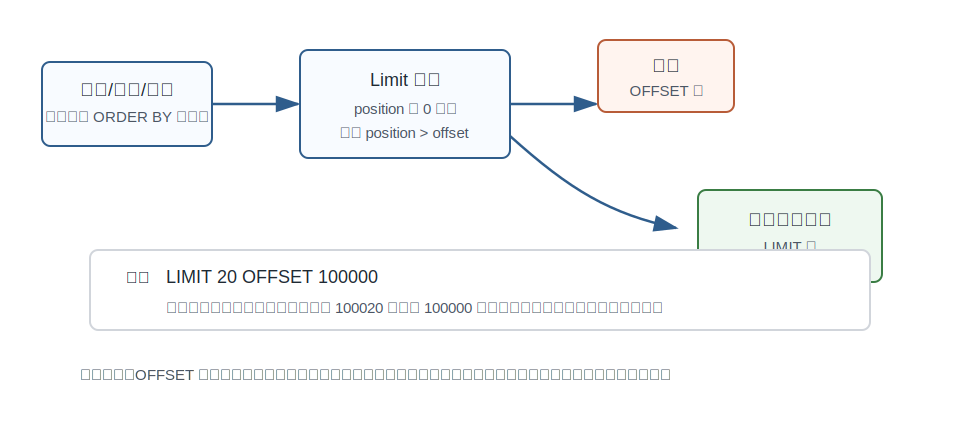
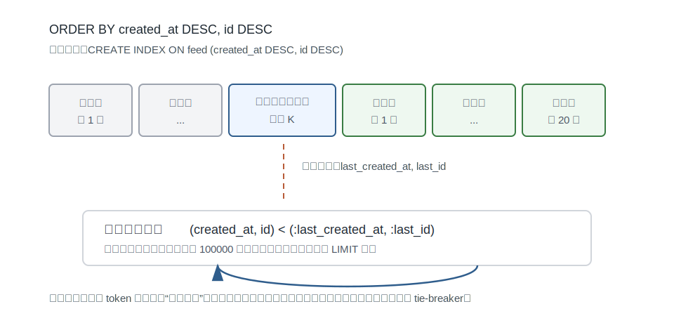
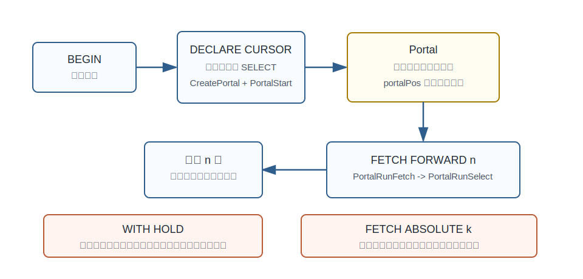
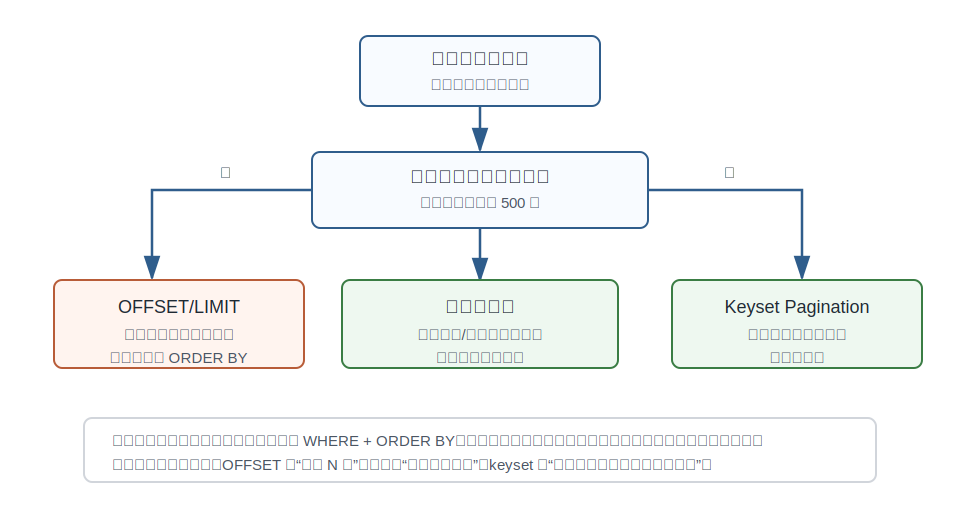

## 数据库筑基课 - 最佳实践之 分页优化(offset/游标/每次递进输入 where 边界)

### 作者
digoal

### 日期
2026-06-01

### 标签
PostgreSQL , 应用开发者 , 数据库筑基课 , 分页 , LIMIT , OFFSET , 游标 , Keyset Pagination , 执行器 , 索引    

----

## 背景
  


本文属于[应用开发者数据库筑基课大纲](../202409/20240914_01.md)里“优化&扫描&计算 -> 最佳实践 -> 分页优化”这一节。

分页是应用开发里最容易被低估的数据库问题之一。第一页很快，第二页也快，等业务数据到了几千万行，用户点到第 5000 页、后台导出全量数据、消息流持续向下翻，数据库突然开始 CPU 飙升、IO 放大、连接堆积。根因通常不是 `LIMIT 20`，而是 `OFFSET 1000000` 背后的“先算出来，再丢掉”。

分页优化的核心不是背语法，而是区分三种完全不同的模型：

1. `LIMIT/OFFSET`：按结果顺序数过前 N 行，再返回后 M 行。
2. 服务端游标：在数据库会话/事务里保存查询执行状态，分批取出。
3. 每次递进输入 `WHERE` 边界，也常叫 keyset pagination 或 seek method：把上一页最后一行的排序键作为下一页谓词，让索引从边界继续向后读。

它们解决的问题不同，代价边界也不同。把深分页都交给 `OFFSET`，相当于要求数据库每次从起点重新数一遍；把 Web 翻页都做成服务端游标，会把应用状态绑在数据库连接和事务上；把所有场景都改成 keyset，又会失去任意跳页能力。

## 一、它解决什么问题？

分页首先解决“结果集太大，客户端不能一次接收”的问题。但工程上真正难的是这四件事：

- **延迟稳定性**：第 1 页 10 毫秒，第 50000 页不能变成 10 秒。
- **排序确定性**：翻页过程中不能重复、漏行、乱序。
- **资源可控性**：不能为了返回 20 行扫描、排序、可见性检查 100 万行。
- **并发一致性**：翻页时有人插入、删除、更新，应用要知道自己接受哪种语义。

传统 `OFFSET` 写法很自然：

```sql
SELECT id, created_at, title
FROM feed
WHERE tenant_id = $1
ORDER BY created_at DESC, id DESC
LIMIT 20 OFFSET 100000;
```

但这里的 `OFFSET 100000` 不是“直接跳到第 100001 行”。PostgreSQL 文档对 `OFFSET` 的定义是跳过指定数量的行之后再开始返回；执行器里的 `Limit` 节点也是从子计划不断拉取 tuple，直到当前位置超过 offset 才开始向上返回。换句话说，被跳过的行通常仍然经历了扫描、排序或索引扫描、MVCC 可见性判断、表达式计算等步骤，只是最后没有发给客户端。

分页优化要把问题从“我要第几页”改写成“下一批数据从哪里开始，数据库能不能用索引定位到那里”。

## 二、它是什么？

### 1. OFFSET 分页

`OFFSET` 分页是位置型分页。应用传入页号和每页大小：

```sql
LIMIT :page_size OFFSET (:page_no - 1) * :page_size
```

它的优点是简单，支持任意跳页，适合小结果集、浅页和后台管理页面。缺点是页码越深，需要数过并丢弃的行越多。

PostgreSQL 官方文档还强调：使用 `LIMIT/OFFSET` 时应该用 `ORDER BY` 约束成唯一顺序，否则不同页可能拿到不可预测的子集。规划器会把 `LIMIT/OFFSET` 纳入计划选择，不同的 limit/offset 值可能得到不同计划；没有稳定排序时，分页结果不具备确定性。

### 2. 服务端游标

服务端游标是状态型分页。应用先声明一个 cursor，再多次 `FETCH`：

```sql
BEGIN;

DECLARE feed_cur NO SCROLL CURSOR FOR
SELECT id, created_at, title
FROM feed
WHERE tenant_id = 42
ORDER BY created_at DESC, id DESC;

FETCH FORWARD 20 FROM feed_cur;
FETCH FORWARD 20 FROM feed_cur;

CLOSE feed_cur;
COMMIT;
```

PostgreSQL 里 SQL cursor 底层对应 portal。`DECLARE CURSOR` 会创建 portal 并启动执行准备，`FETCH` 通过 portal 继续读取，portal 里维护当前位置。游标适合批处理、导出、ETL、驱动端流式读取，不适合普通无状态 Web 翻页，因为它依赖会话和事务生命周期。

`WITH HOLD` 可以让 cursor 跨事务继续使用，但 PostgreSQL 文档明确说明 held cursor 的结果会被复制到临时文件或内存区域。它保留的是结果集，不是免费索引游标。

### 3. 每次递进输入 WHERE 边界

`WHERE` 边界递进是值域型分页。应用不再传页号，而是传上一页最后一行的排序键：

第一页：

```sql
SELECT id, created_at, title
FROM feed
WHERE tenant_id = $1
ORDER BY created_at DESC, id DESC
LIMIT 20;
```

下一页：

```sql
SELECT id, created_at, title
FROM feed
WHERE tenant_id = $1
  AND (created_at, id) < ($2, $3)
ORDER BY created_at DESC, id DESC
LIMIT 20;
```

配套索引：

```sql
CREATE INDEX feed_page_idx
ON feed (tenant_id, created_at DESC, id DESC);
```

这里 `($2, $3)` 是上一页最后一行的 `(created_at, id)`。由于结果按 `created_at DESC, id DESC` 排序，下一页要找排序位置更靠后的行，所以使用 `<`。如果排序方向混合、列可为 NULL、或业务排序表达式复杂，就要把边界条件展开成更明确的布尔表达式，不能机械套 row comparison。

## 三、核心原理

### 1. OFFSET 的执行代价来自“被丢弃的前缀”



图 1 说明：`Limit` 节点位于子计划之上。子计划可以是 `Index Scan`、`Sort`、`Seq Scan`、`Bitmap Heap Scan` 等。执行器为了返回 `LIMIT count OFFSET start`，需要先从子计划拉取并跳过 `start` 行，然后再返回 `count` 行。即使底层有满足排序的 B-tree 索引，深 offset 也通常要沿索引顺序走过大量条目。

源码里这个机制很直观：

- `src/backend/executor/nodeLimit.c`：`ExecLimit` 的注释说明该节点对来自子计划的 tuple stream 做 `LIMIT/OFFSET` filtering；进入窗口前会循环调用 `ExecProcNode(outerPlan)`，直到 `position > offset`。
- `src/backend/optimizer/plan/planner.c`：`preprocess_limit` 会估算 `LIMIT/OFFSET`，并把 `count + offset` 作为需要从下层取出的 tuple 数量估计之一。
- `src/backend/optimizer/util/pathnode.c`：`create_limit_path` 创建 `LimitPath`，并根据 offset/count 调整行数和成本估计。

这解释了为什么 `OFFSET 0 LIMIT 20` 和 `OFFSET 1000000 LIMIT 20` 不是同一个复杂度。

### 2. ORDER BY + LIMIT 可以被索引直接服务，但 OFFSET 仍然要数

PostgreSQL 文档在 “Indexes and ORDER BY” 中明确说明：B-tree 能按排序顺序产生输出；当 `ORDER BY` 和 `LIMIT n` 结合时，如果有匹配索引，就能直接取前 n 行，而显式排序需要处理所有数据才能知道前 n 行。

这句话经常被误读。它说明的是 `ORDER BY ... LIMIT n` 可以很快，不代表 `ORDER BY ... LIMIT n OFFSET k` 在 k 很大时也快。前者从索引开头取 n 行；后者从索引开头取 k+n 行，前 k 行仍然要被跳过。

规划器如何知道索引能不能提供排序？

- `src/backend/optimizer/path/pathkeys.c` 用 pathkeys 表示查询需要的顺序和路径已具备的顺序。
- `src/backend/optimizer/path/indxpath.c` 会为有序索引构造 index pathkeys，并截断出对 `ORDER BY` 有用的前缀；也会考虑反向扫描。
- PostgreSQL 文档说明，B-tree 可以正向或反向扫描，单列索引天然覆盖 `ASC/DESC` 两个方向；多列混合方向如 `ORDER BY x ASC, y DESC` 需要创建对应方向的多列索引。

因此，分页优化的第一条底线是：`WHERE` 过滤条件和 `ORDER BY` 顺序必须能被同一个索引有效承接。

### 3. Keyset 把“数过 N 行”改成“从边界继续”



图 2 说明：上一页最后一行不是页码，而是下一次查询的边界。应用把 `(last_created_at, last_id)` 放进 token 或请求参数，下一页用 `WHERE (created_at, id) < (...)` 把搜索空间收缩到边界之后。只要索引顺序匹配，数据库不需要从第一页重新数到深页位置。

这类分页的复杂度更接近：

```text
定位边界 + 读取 page_size 行
```

而不是：

```text
读取 offset + page_size 行，然后丢弃 offset 行
```

但 keyset 也有代价：

- 不天然支持“跳到第 N 页”。
- URL/token 里要保存排序边界。
- 排序键必须稳定；如果排序字段会被频繁更新，翻页过程中可能重复或漏行。
- 排序键最好唯一；如果 `created_at` 可能重复，就把 `id` 放在最后作为 tie-breaker。
- 多列混合方向、NULL 排序、表达式排序会增加谓词写法和索引设计复杂度。

### 4. Cursor 保存的是执行状态，不是通用翻页 token



图 3 说明：`DECLARE CURSOR` 会在当前会话里创建 portal，`FETCH` 继续从 portal 当前位置向前读。`src/include/utils/portal.h` 里 `portalPos` 记录当前位置；`src/backend/tcop/pquery.c` 中 `PortalRunFetch`/`PortalRunSelect` 负责移动和取数；`src/backend/commands/portalcmds.c` 的 `PerformCursorOpen` 负责打开 cursor 并启动 portal。

这对“一个客户端连续消费大结果集”很有价值，例如：

- 后台导出 CSV，每次取 5000 行写文件。
- ETL 作业从数据库流式读取，避免一次性加载全部结果。
- 驱动使用 server-side cursor 降低客户端内存峰值。

但它不是无状态 API 的理想分页模型：

- 默认 cursor 只能在当前事务内使用。
- 长事务会延迟 vacuum 清理，增加版本膨胀风险。
- 连接池里会话不固定时，下一次请求未必回到同一个 cursor。
- `WITH HOLD` 会物化结果，能跨事务但消耗临时文件或内存。
- `FETCH ABSOLUTE k` 文档说明并不比相对移动更快，底层仍要经过中间行。

## 四、横向对比

| 维度 | OFFSET/LIMIT | 服务端游标 | WHERE 边界递进 |
|---|---|---|---|
| 主要目标 | 页号分页、浅页展示 | 同一查询分批消费 | 深分页、无限滚动、消息流 |
| 状态位置 | 客户端页号 | 数据库会话/事务里的 portal | 客户端 token 保存排序边界 |
| 深分页成本 | 随 offset 线性增长 | 顺序读取稳定，但占用会话/事务 | 接近边界定位 + page_size |
| 任意跳页 | 支持 | 可移动但不是随机定位加速 | 不支持，除非另建定位表/锚点 |
| 排序要求 | 必须唯一稳定，否则页间不确定 | 查询本身仍需稳定排序 | 必须唯一稳定，且索引匹配 |
| 并发写入影响 | 可能重复/漏行，取决于隔离级别和排序 | 同一事务快照较稳定，长事务有代价 | 边界前后变化需业务接受或补偿 |
| 数据库资源 | 深页 CPU/IO 放大 | 持有 portal、快照、可能长事务 | 索引维护成本更高，查询更复杂 |
| 适合场景 | 后台小表、搜索结果前几页、必须页号跳转 | 导出、批处理、驱动流式读取 | feed、订单列表、日志、审计流水 |
| 不适合场景 | 高频深页接口 | 无状态 Web 翻页、跨连接池请求 | 必须跳任意页、排序键不稳定 |

表里的关键区别是：`OFFSET` 按位置，cursor 按执行状态，keyset 按值域边界。不要只看 SQL 都是“分页”，要看数据库下一步能不能避免从头数。

## 五、效果如何？

本文不编造 benchmark 数字，因为分页性能高度依赖数据量、索引、缓存命中率、可见行比例、行宽、排序字段相关性、并发写入和 `work_mem`。但可以给出可验证的趋势：

- `OFFSET` 越大，底层需要访问和丢弃的行越多；即使返回行数固定，执行时间也可能随页码上升。
- `ORDER BY ... LIMIT n` 如果能被 B-tree 索引满足，通常能避免全量排序，尤其适合只取少量行。
- `ORDER BY ... LIMIT n OFFSET k` 有匹配索引时能避免显式排序，但不能避免跳过 k 行。
- keyset pagination 把下一页查询限制在边界之后，深页延迟通常更稳定。
- cursor 对单次长查询的分批消费有帮助，但不会让查询本身变便宜；它主要改变“结果如何交付”和“执行状态如何保存”。

### 怎么验证

用 `EXPLAIN (ANALYZE, BUFFERS)` 比较三类 SQL，重点看：

- `Sort` 是否消失，是否变成 `Index Scan` 或 `Index Only Scan`。
- `Limit` 下层节点的实际扫描行数是否接近 `offset + limit`。
- 深页时 `shared hit/read` 是否随页码增长。
- keyset 查询是否使用复合索引，并且实际行数接近 page size。
- 如果看到 `Rows Removed by Filter` 很大，说明边界条件或索引列顺序可能没设计好。

## 六、实操 DEMO

下面示例是可执行 SQL 模板，但我没有在本机启动 PostgreSQL 实例执行，因此不提供虚构的 `EXPLAIN` 输出。读者可以在自己的环境中执行并观察计划差异。

### 1. 建表和索引

```sql
CREATE TABLE feed (
    tenant_id  bigint NOT NULL,
    id         bigint GENERATED ALWAYS AS IDENTITY PRIMARY KEY,
    created_at timestamptz NOT NULL DEFAULT now(),
    title      text NOT NULL,
    body       text
);

CREATE INDEX feed_page_idx
ON feed (tenant_id, created_at DESC, id DESC);
```

### 2. OFFSET 深分页

```sql
EXPLAIN (ANALYZE, BUFFERS)
SELECT id, created_at, title
FROM feed
WHERE tenant_id = 42
ORDER BY created_at DESC, id DESC
LIMIT 20 OFFSET 100000;
```

观察点：

- 是否使用 `feed_page_idx`。
- `Limit` 下层实际产出或扫描的行数是否接近 `100020`。
- buffer 访问是否随 offset 增大。

### 3. Keyset 下一页

第一页：

```sql
SELECT id, created_at, title
FROM feed
WHERE tenant_id = 42
ORDER BY created_at DESC, id DESC
LIMIT 20;
```

假设上一页最后一行是：

```text
created_at = '2026-05-31 10:00:00+08'
id         = 987654321
```

下一页：

```sql
EXPLAIN (ANALYZE, BUFFERS)
SELECT id, created_at, title
FROM feed
WHERE tenant_id = 42
  AND (created_at, id) < ('2026-05-31 10:00:00+08'::timestamptz, 987654321)
ORDER BY created_at DESC, id DESC
LIMIT 20;
```

观察点：

- 是否仍使用 `feed_page_idx`。
- 实际扫描行数是否接近 20。
- 没有显式 `Sort` 更理想。

### 4. 混合方向排序不要硬套 row comparison

如果业务排序是：

```sql
ORDER BY score DESC, created_at ASC, id ASC
```

推荐索引：

```sql
CREATE INDEX feed_score_page_idx
ON feed (tenant_id, score DESC, created_at ASC, id ASC);
```

下一页边界要按排序语义展开：

```sql
WHERE tenant_id = $1
  AND (
        score < $2
     OR (score = $2 AND created_at > $3)
     OR (score = $2 AND created_at = $3 AND id > $4)
  )
ORDER BY score DESC, created_at ASC, id ASC
LIMIT 20;
```

原因是 `score DESC` 的“下一页”是更小的 score，而 `created_at ASC` 的“下一页”是更大的 created_at。混合方向时，用一个简单的 `(score, created_at, id) > (...)` 或 `< (...)` 很容易写错。

## 七、最佳实践



图 4 说明：分页方案选择先问是否需要任意跳页。如果必须跳页，`OFFSET` 往往难以完全避免，但应限制最大页深或使用锚点表、搜索引擎、预计算排名等办法。若是连续向后翻，keyset 是深分页首选。若是一个任务持续消费大结果集，服务端游标更合适。

### 面向数据库架构师

1. 把分页模型写进接口契约：页号分页、连续翻页、导出流式读取不要混用同一套 API。
2. 对高频列表默认设计 keyset token，token 至少包含完整排序键、过滤条件版本、方向、页大小。
3. 排序键必须唯一。常见写法是业务时间字段加主键：`ORDER BY created_at DESC, id DESC`。
4. 索引列顺序要按 `等值过滤列 + 排序列 + 唯一 tie-breaker` 设计。例如 `(tenant_id, created_at DESC, id DESC)`。
5. 如果必须按复杂相关性、全文搜索分数、个性化分数排序，先确认排序结果是否可重现；必要时把一次搜索结果落到临时结果表或缓存中，再分页。

### 面向 DBA

1. 为核心分页 SQL 建立 `EXPLAIN (ANALYZE, BUFFERS)` 基线，至少覆盖第一页、中间页、最大允许页。
2. 监控慢 SQL 中 `OFFSET` 参数，深 offset 接口应进入治理列表。
3. 对导出任务优先使用 cursor 或批量边界扫描，控制每批大小，避免一次性返回巨量结果。
4. 对长事务 cursor 做超时和连接池隔离，避免拖住 vacuum。
5. 使用 `pg_stat_statements` 找出平均耗时不高但总耗时很高的分页 SQL，这类 SQL 往往是高频浅页或深页混合导致。

### 面向业务开发者

1. 不要在用户看不到的地方提供无限制页号跳转。很多产品只需要“下一页/上一页”。
2. 列表查询必须写完整 `ORDER BY`，不要依赖数据库自然顺序。
3. 如果排序字段可重复，必须加主键或唯一列作为最后排序键。
4. 下一页请求不要传 `page=5000`，传 opaque token。token 内部可以是 `(last_created_at,last_id)`，也可以签名防篡改。
5. 更新排序字段会改变分页位置。对 feed、订单、工单这类列表，尽量选择不可变的创建时间、序列号或日志 ID 作为分页主轴。

## 八、适合与不适合场景

### OFFSET/LIMIT 适合

- 表很小，或过滤后结果集很小。
- 后台管理页面只允许查看前几十页。
- 用户明确需要跳页，且深页访问低频。
- 报表结果已经物化，分页只是在小结果上切片。

### OFFSET/LIMIT 不适合

- 高频接口允许任意深页。
- feed、消息、评论、日志、订单流水等持续增长列表。
- 查询还需要复杂排序、宽行回表、权限过滤或远程 FDW 扫描。
- 并发写入频繁且业务要求页间无重复、无漏行。

### 服务端游标适合

- 单个后台任务连续消费同一结果集。
- 导出、迁移、ETL、数据校验。
- 驱动端希望分批取结果，降低客户端内存占用。

### 服务端游标不适合

- HTTP 无状态分页。
- 连接池会在请求间切换连接的应用。
- 用户可能隔很久才点下一页。
- 不愿承担长事务、快照、临时文件或 portal 生命周期管理成本。

### WHERE 边界递进适合

- 无限滚动、时间线、消息流。
- 按主键、时间、递增序列、LSN、日志 ID 翻页。
- 大表深分页需要稳定低延迟。
- 只需要上一页/下一页，不要求直接跳到任意页。

### WHERE 边界递进不适合

- 必须随机跳页。
- 排序来自高频变化字段，例如实时热度分。
- 排序表达式无法稳定重放。
- 列中有复杂 NULL 排序且应用没有统一边界语义。

## 九、常见坑

1. **没有唯一 ORDER BY。** `ORDER BY created_at DESC` 在同一秒大量写入时不唯一，翻页可能重复或漏行。改成 `ORDER BY created_at DESC, id DESC`。

2. **索引只建了过滤列，没建排序列。** `WHERE tenant_id = ? ORDER BY created_at DESC, id DESC` 只建 `(tenant_id)`，仍可能需要排序。应考虑 `(tenant_id, created_at DESC, id DESC)`。

3. **把 cursor 当成 Web 分页 token。** cursor 依赖数据库会话和事务，不适合用户隔几分钟再点下一页的请求模型。

4. **`WITH HOLD` 以为不占资源。** held cursor 会把结果复制到临时文件或内存区域，适合明确的导出流程，不适合泛用在线接口。

5. **混合排序方向写错边界。** `DESC, ASC` 混合时要展开条件，不要机械使用 row comparison。

6. **NULL 排序没定义。** `NULLS FIRST/LAST` 会影响边界谓词。生产接口最好让排序列 `NOT NULL`，或把 NULL 归一化成明确值。

7. **分页 token 暴露内部细节且可篡改。** token 应包含完整边界和过滤条件摘要，并做签名或服务端校验，避免用户改 token 扫描越权数据。

8. **并发变更语义没说清楚。** Read Committed 下每次请求可能看到不同快照。keyset 能减少“从头数”的代价，但不会自动提供跨请求一致快照。

9. **宽行回表拖慢分页。** 列表页只取必要列；需要详情时再按 id 查询。若条件允许，可用覆盖索引配合 `Index Only Scan`，但要注意 visibility map 和更新频率。

10. **无限制导出。** 导出不是把 `LIMIT 100000000` 发给数据库。应按 cursor 或 keyset 分批，设置超时、批大小、进度记录和失败续跑边界。

## 十、扩展问题

1. 如果产品经理要求“跳到第 10000 页”，能否改成交互上的“按时间/ID 定位到某附近位置”？
2. 搜索结果按相关性排序时，如何让用户第二次翻页看到和第一次相同的排序集合？
3. 如果需要上一页，keyset token 应保存当前页第一行还是最后一行？排序方向如何反转？
4. Read Committed 和 Repeatable Read 下，分页过程遇到新增/删除行的表现分别是什么？
5. 分区表上做 keyset pagination 时，索引、分区键和排序键如何组合，才能避免跨大量分区合并排序？

## 十一、扩展阅读

- PostgreSQL 文档：`SELECT` 的 `LIMIT/OFFSET/FETCH` 语义，`postgres/doc/src/sgml/ref/select.sgml`。
- PostgreSQL 文档：`LIMIT` 和 `OFFSET` 查询章节，`postgres/doc/src/sgml/queries.sgml`。
- PostgreSQL 文档：`Indexes and ORDER BY`，`postgres/doc/src/sgml/indices.sgml`。
- PostgreSQL 文档：`DECLARE` cursor 与 `FETCH`，`postgres/doc/src/sgml/ref/declare.sgml`、`postgres/doc/src/sgml/ref/fetch.sgml`。
- PostgreSQL 源码：`src/backend/executor/nodeLimit.c`，`Limit` 执行节点如何跳过 offset 并返回窗口内 tuple。
- PostgreSQL 源码：`src/backend/optimizer/plan/planner.c`，`preprocess_limit`、`limit_needed`、最终路径添加 `LimitPath`。
- PostgreSQL 源码：`src/backend/optimizer/util/pathnode.c`，`create_limit_path` 和 `adjust_limit_rows_costs`。
- PostgreSQL 源码：`src/backend/optimizer/path/pathkeys.c`、`src/backend/optimizer/path/indxpath.c`，查询排序需求与索引顺序匹配。
- PostgreSQL 源码：`src/backend/commands/portalcmds.c`、`src/backend/tcop/pquery.c`、`src/include/utils/portal.h`，cursor/portal 生命周期和 fetch 执行。
- DeepWiki：`postgres/postgres` 的 Query Processing Pipeline 与 Client/External Interfaces 相关页面。
  
## 附录 

1、克隆代码  
```  
git clone --depth 1 https://github.com/postgres/postgres
```  
  
2、启用 codex, 使用 [数据库筑基课 skill](../skills/README.md).  
```
文章标题: 
  数据库筑基课 - 最佳实践之 分页优化(offset/游标/每次递进输入 where 边界)
项目源码(本地目录): 
  postgres
项目 codebase 文件名: 
  postgres/CLAUDE.md 
开源项目相关的 deepwiki repoName: 
  postgres/postgres
```

  
  
#### [PostgreSQL 解决方案集合](../201706/20170601_02.md "40cff096e9ed7122c512b35d8561d9c8")
  
  
#### [德哥 / digoal's Github - 公益是一辈子的事.](https://github.com/digoal/blog/blob/master/README.md "22709685feb7cab07d30f30387f0a9ae")
  
  
#### [About 德哥](https://github.com/digoal/blog/blob/master/me/readme.md "a37735981e7704886ffd590565582dd0")
  
  

  
