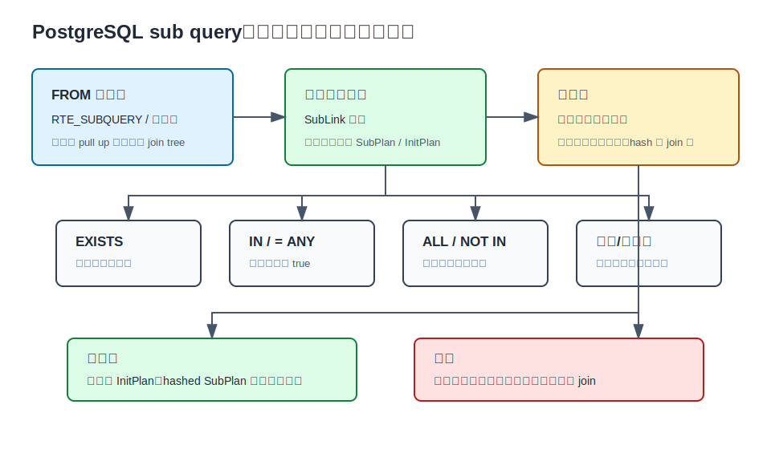
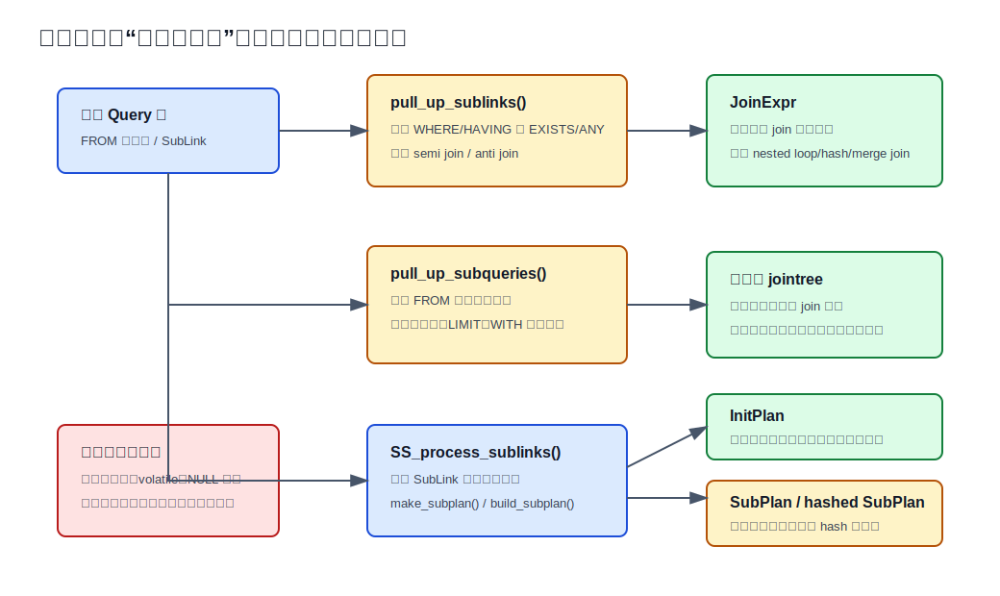
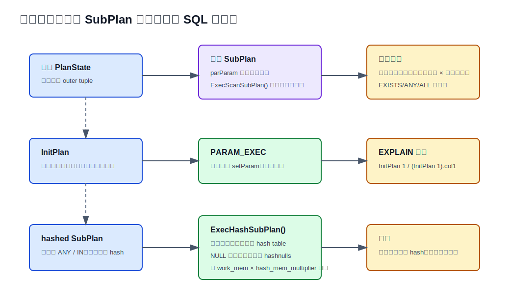
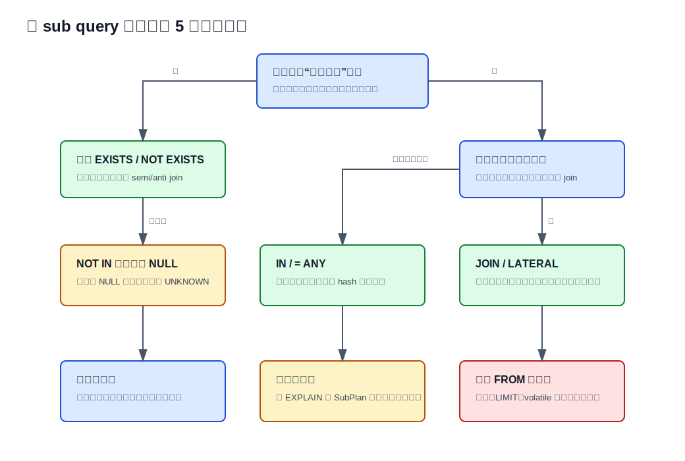

## 数据库筑基课 - 最佳实践之 sub query

### 作者
digoal

### 日期
2026-06-01

### 标签
PostgreSQL , 应用开发者 , 数据库筑基课 , Sub Query , SubLink , SubPlan , InitPlan , Semi Join , Anti Join , 优化器 , 执行器    

----

## 背景
  


本文属于[应用开发者数据库筑基课大纲](../202409/20240914_01.md)里“优化&扫描&计算 -> 最佳实践 -> sub query”这一节。

子查询是应用 SQL 里最常见、也最容易误判性能的写法之一。很多人把问题简化成“`EXISTS` 一定比 `IN` 快”“子查询一定比 JOIN 慢”“CTE 一定会物化”。这些经验在真实系统里经常失效，因为 PostgreSQL 执行的并不是你肉眼看到的括号，而是优化器改写后的计划树。

同样一段业务逻辑，可能出现四种完全不同的执行形态：

1. 子查询被拉平，进入普通 join 搜索空间。
2. `EXISTS` / `ANY` 被改写成 semi join 或 anti join。
3. 非相关标量子查询变成 `InitPlan`，整个查询执行中只算一次。
4. 相关子查询保留为 `SubPlan`，外层每行都可能重新触发一次子计划。

这一节的目标不是背语法，而是建立判断框架：什么时候应该写 `EXISTS`，什么时候应该写 `JOIN`，什么时候 `IN` 可以放心用，为什么 `NOT IN` 经常踩 NULL 坑，如何从 `EXPLAIN` 看出子查询到底被拉平、hash、一次执行，还是逐行重扫。

## 一、它解决什么问题？

子查询解决的是“把一个关系的计算结果嵌入另一个查询”的表达问题。工程上常见四类需求：

- **存在性判断**：订单是否有明细、用户是否有未读消息、商品是否命中规则。
- **成员测试**：某个值是否在另一组值里，例如 `customer_id IN (...)`。
- **单值派生**：把一个聚合结果、配置值、最新状态作为外层查询条件。
- **局部关系命名**：在 `FROM` 里先投影、过滤、聚合，再被外层查询使用。

传统做法会在 `JOIN`、`EXISTS`、`IN`、标量子查询、`FROM` 子查询之间凭经验选择。问题是这些写法的语义并不完全等价：

- `JOIN` 会保留匹配行的乘法效应；右表一行变三行，外层结果也可能变三行。
- `EXISTS` 只关心有没有匹配行；右表匹配 1 行和 100 行，对外层输出行数通常一样。
- `IN` / `ANY` 有 SQL 三值逻辑；右侧出现 NULL 时，结果可能是 UNKNOWN。
- 标量子查询要求最多一行；超过一行会运行时报错。
- `FROM` 子查询可能被拉平，也可能因为聚合、排序、`LIMIT`、`WITH`、volatile 函数等成为独立边界。

所以 sub query 最佳实践的核心不是“哪种写法最快”，而是三件事：

1. 先写出正确语义。
2. 再确认优化器能否把它改写成更便宜的执行模型。
3. 最后用 `EXPLAIN` 验证实际计划是否符合预期。

## 二、它是什么？

在 PostgreSQL 里，业务开发者说的 sub query 至少包含两大类。

### 1. FROM 子查询

`FROM` 子查询也叫派生表，解析后通常是 range table entry 里的 `RTE_SUBQUERY`：

```sql
SELECT c.customer_id, s.total_amount
FROM customers c
JOIN (
    SELECT customer_id, sum(amount) AS total_amount
    FROM orders
    GROUP BY customer_id
) s ON s.customer_id = c.customer_id
WHERE c.status = 'active';
```

这类子查询在逻辑上像一张临时关系。优化器会检查它能否被拉平到父查询。简单投影和过滤通常有机会被拉平；聚合、窗口函数、排序、`DISTINCT`、`LIMIT`、`WITH`、`FOR UPDATE` 等会阻止普通拉平，因为这些结构改变了行数、顺序、锁语义或执行边界。

### 2. 表达式子查询

表达式里的子查询在 PostgreSQL parse tree 中用 `SubLink` 表示。`src/include/nodes/primnodes.h` 对 `SubLinkType` 的分类包括：

| 类型 | 典型 SQL | 语义重点 |
|---|---|---|
| `EXISTS_SUBLINK` | `EXISTS (SELECT ...)` | 子查询是否返回至少一行 |
| `ANY_SUBLINK` | `x = ANY (SELECT ...)`，`x IN (SELECT ...)` | 任一比较为 true |
| `ALL_SUBLINK` | `x < ALL (SELECT ...)`，`x NOT IN (SELECT ...)` | 所有比较为 true |
| `ROWCOMPARE_SUBLINK` | `(a,b) < (SELECT x,y ...)` | 行比较，子查询最多一行 |
| `EXPR_SUBLINK` | `x = (SELECT max(...) ...)` | 单列单行标量结果 |
| `MULTIEXPR_SUBLINK` | `UPDATE ... SET (a,b) = (SELECT ...)` | 多列赋值 |
| `ARRAY_SUBLINK` | `ARRAY(SELECT ...)` | 把多行单列收集成数组 |

`SubLink` 不是可执行节点。源码注释明确说明：规划阶段必须把它替换成 `SubPlan`，或者在可行时转成 join、`InitPlan`、hash 表探测等形态。



图 1 说明：讨论 sub query 性能前，先分清它是 `FROM` 子查询还是表达式子查询，再分清是否相关。非相关子查询有机会只执行一次或 hash；相关子查询如果不能被拉成 join，常见代价就是外层行数乘以内层访问代价。

## 三、核心原理

### 3.1 规划阶段：先尝试把子查询变成普通关系问题

PostgreSQL 的 planner 不是拿到括号就直接执行。相关源码入口主要在：

- `src/backend/optimizer/prep/prepjointree.c`
- `src/backend/optimizer/plan/subselect.c`
- `src/include/nodes/primnodes.h`

`prepjointree.c` 文件头部列出了预处理顺序：先处理 relation RTE，再 `pull_up_sublinks`，再 `pull_up_subqueries`，之后才进入表达式预处理、外连接化简等阶段。这个顺序很重要，因为越早把子查询转成 join tree，后续优化器可选择的 join 顺序和路径就越多。



图 2 说明：优化器有三条主要路径。顶层 `EXISTS` / `ANY` 条件可能被转成 semi join 或 anti join；简单 `FROM` 子查询可能被拉平；剩下不能安全改写的表达式子查询才进入 `SS_process_sublinks()`，由 `make_subplan()` / `build_subplan()` 变成 `SubPlan` 或 `InitPlan`。

### 3.2 EXISTS / ANY：能转 join 时，通常进入 semi/anti join

`pull_up_sublinks()` 会递归扫描顶层 qual。源码注释写得很清楚：顶层 `ANY` 和 `EXISTS` 条件在合适条件下可以被拉起，形成 semi join 或 anti-semijoin。

典型 `EXISTS`：

```sql
SELECT c.customer_id
FROM customers c
WHERE EXISTS (
    SELECT 1
    FROM orders o
    WHERE o.customer_id = c.customer_id
      AND o.status = 'paid'
);
```

从业务语义看，它问的是“这个客户是否至少有一笔已支付订单”。如果被转成 semi join，执行器不需要把右表所有匹配行都返回给外层，只要确认存在即可。右表有 1 行匹配和 100 行匹配，对外层客户行不会产生重复输出。

`convert_EXISTS_sublink_to_join()` 的限制也很实际：

- 子查询带 `WITH` 时不拉平，因为 `WITH` 的执行次数语义可能改变。
- `EXISTS` 子查询需要能被 `simplify_EXISTS_query()` 简化，目标列不能留下必须求值的内容。
- 子查询除 WHERE 条件外的部分不能引用父查询变量。
- WHERE 条件必须包含父查询变量，否则它不是 join 条件。
- volatile 函数会阻止转换，避免改变求值次数和副作用。

`ANY` / `IN` 的转换由 `convert_ANY_sublink_to_join()` 处理。它会检查父查询变量引用、外连接位置、volatile 函数等。`NOT IN` 更谨慎：源码注释指出，按 SQL 标准 `NOT IN` 通常不等价于 anti join；只有能证明两边都不会产生 NULL，并且操作符不会对非 NULL 输入返回 NULL 时，才可以安全转换。

### 3.3 FROM 子查询：简单时拉平，复杂时保留边界

`pull_up_subqueries()` 会尝试拉平 `FROM` 子查询。`is_simple_subquery()` 里列出的阻止条件非常值得应用开发者记住：

- set operations，除简单 `UNION ALL` 外不走普通拉平路径。
- 聚合、窗口函数、集合返回函数。
- `GROUP BY`、`HAVING`、`DISTINCT`。
- `ORDER BY`、`LIMIT/OFFSET`。
- `FOR UPDATE/SHARE`。
- `WITH`。
- security barrier view。
- target list 里有 volatile 函数。

这解释了一个常见现象：看似只是给 SQL 套了一层子查询，计划却变差了。原因不是“子查询天然慢”，而是你在子查询内部放了会阻止拉平的结构，优化器不能再把外层谓词和内层扫描自由重排。

简单可拉平的写法：

```sql
SELECT *
FROM (
    SELECT order_id, customer_id, amount
    FROM orders
    WHERE created_at >= current_date - interval '30 days'
) o
WHERE o.amount > 100;
```

可能阻止拉平的写法：

```sql
SELECT *
FROM (
    SELECT order_id, customer_id, amount
    FROM orders
    WHERE created_at >= current_date - interval '30 days'
    ORDER BY amount DESC
    LIMIT 1000
) o
WHERE o.amount > 100;
```

第二个例子里的 `ORDER BY ... LIMIT` 改变了“先取前 1000 行，再过滤”的语义，不能随便和外层过滤条件交换。

### 3.4 SubLink 到 SubPlan / InitPlan：能一次算就不要逐行算

如果子查询没有被拉平，`SS_process_sublinks()` 会把表达式里的 `SubLink` 展开成 `SubPlan` 或 `InitPlan`。`build_subplan()` 的核心判断是 `parParam`：子计划是否需要外层变量作为参数。

非相关标量子查询：

```sql
SELECT order_id, amount
FROM orders
WHERE amount > (SELECT avg(amount) FROM orders);
```

这里的平均值不依赖外层当前行，有机会成为 `InitPlan`。`InitPlan` 的结果通过 `PARAM_EXEC` 参数交给外层计划复用。`EXPLAIN` 里通常能看到 `InitPlan 1` 之类的标记。

相关标量子查询：

```sql
SELECT c.customer_id,
       (
           SELECT max(o.created_at)
           FROM orders o
           WHERE o.customer_id = c.customer_id
       ) AS last_order_at
FROM customers c;
```

这个子查询依赖外层 `c.customer_id`。如果不能被改写成更合适的 join/aggregate 计划，它就可能以普通 `SubPlan` 形态执行，外层每个客户行都把参数传入子计划再扫描一次。数据量小、内层有高选择性索引时可以接受；外层几十万行、内层无索引时就是典型慢查询。

### 3.5 hashed SubPlan：IN 不是一定慢，关键看能否 hash

对非相关 `IN` / `= ANY` 子查询，PostgreSQL 可以使用 hashed SubPlan：

```sql
SELECT *
FROM orders o
WHERE o.customer_id IN (
    SELECT customer_id
    FROM vip_customers
);
```

如果子查询输出估算能放进 hash 内存，且比较操作符 hashable 且 strict，规划器可以把右侧结果先装入内存 hash table，外层每行做 hash probe。相关判断在 `subplan_is_hashable()`、`testexpr_is_hashable()`、`hash_ok_operator()` 中完成。

内存边界来自 `work_mem` 和 `hash_mem_multiplier`。PostgreSQL 配置文档明确提到，hash joins、hash aggregation、memoize 节点以及基于 hash 的 `IN` 子查询处理都会使用这类 hash 内存预算。子查询结果太大时，规划器可能放弃 hashed SubPlan，改用 materialize 或逐次扫描策略。

### 3.6 执行阶段：三种 SubPlan 路径的代价完全不同

`src/backend/executor/nodeSubplan.c` 开头的注释把执行路径分成两类：

- `initplans`：每个查询只需一次求值，要求不使用父计划层的直接相关变量。
- regular subplans：每次需要结果时重新求值。



图 3 说明：普通 `SubPlan` 通过 `parParam` 接收外层变量，`ExecScanSubPlan()` 会标记参数变化并 `ExecReScan()` 子计划；`InitPlan` 把结果写入 `setParam`，外层复用；hashed SubPlan 由 `ExecHashSubPlan()` 把子查询结果装入 hash table，外层按行探测。它们在 SQL 上都像“子查询”，但代价模型完全不同。

`ExecScanSubPlan()` 还体现了 SQL 语义：

- `EXISTS` 拿到第一行即可返回 true。
- `ANY` 按 OR 语义合并，遇到 true 可以短路。
- `ALL` 按 AND 语义合并，遇到 false 可以短路。
- `EXPR_SUBLINK`、`MULTIEXPR_SUBLINK`、`ROWCOMPARE_SUBLINK` 如果返回多行，会抛出 “more than one row returned by a subquery used as an expression”。
- `ARRAY_SUBLINK` 可以接收多行，空结果返回零元素数组。

`ExecHashSubPlan()` 则额外处理 NULL。为了区分 false 和 unknown，它可能维护普通 hash table 和包含 NULL 的 `hashnulls` 表；当左侧或右侧有 NULL 时，需要按 SQL 三值逻辑判断是否返回 UNKNOWN。这就是 `NOT IN` 和 NULL 经常让人意外的底层原因之一。

## 四、横向对比

| 维度 | `EXISTS` / `NOT EXISTS` | `IN` / `= ANY` | `NOT IN` / `<> ALL` | 标量子查询 | `FROM` 子查询 | `JOIN` |
|---|---|---|---|---|---|---|
| 主要目标 | 存在性/反存在性判断 | 成员测试 | 反成员测试 | 单值派生 | 局部关系表达 | 合并两边列和行 |
| 输出行数语义 | 不放大外层行数 | 不放大外层行数 | 不放大外层行数 | 外层每行一个值 | 取决于子查询结果 | 可能因多匹配放大 |
| 优化机会 | semi/anti join、短路 | semi join、hashed SubPlan | NULL 安全时才可能 anti join | 非相关可 InitPlan | 简单时 pull up | 普通 join 搜索 |
| NULL 风险 | 较小 | 有 UNKNOWN，但通常比 `NOT IN` 易控 | 最大，右侧 NULL 可让结果 UNKNOWN | 空结果为 NULL，多行报错 | 取决于内部表达式 | 取决于连接谓词 |
| 相关子查询代价 | 可高，可被拉平时低 | 可高，非相关可 hash | 可高且语义复杂 | 常见逐行重扫 | `LATERAL` 可能逐行 | 由 join 算法决定 |
| 适合场景 | “是否有匹配行” | 小/中等集合成员判断、非相关右侧 | 两边列都 NOT NULL 且语义明确 | 配置值、聚合单值 | 复杂逻辑分层、聚合边界 | 需要右表列或多行关系 |
| 不适合场景 | 需要返回右表列 | 右侧结果巨大且不能 hash/索引 | 右侧可能含 NULL | 无法保证一行 | 盲目包一层导致不能下推 | 只做存在性导致重复行 |

表里的核心区别是：`EXISTS` 和 semi join 保留“存在性”语义；`JOIN` 保留“匹配行”语义；`IN` 是成员测试；标量子查询是“必须最多一个值”。先把语义写对，再讨论优化器能不能把它们转换成接近的物理计划。

## 五、效果如何？

本文不编造性能数字，因为 sub query 的效果依赖数据分布、统计信息、索引、外层行数、内层选择性、NULL 比例、`work_mem`、并发缓存状态和 PostgreSQL 版本。可以确定的是以下趋势：

- 被拉平成 semi join / anti join 的 `EXISTS` / `NOT EXISTS`，通常能进入普通 join 优化空间，计划选择更丰富。
- 非相关标量子查询如果成为 `InitPlan`，外层行数再大也不需要重复计算该子查询。
- 非相关 `IN` 如果成为 hashed SubPlan，代价接近“右侧建 hash 一次 + 外层逐行 probe”。
- 相关 `SubPlan` 如果不能拉平，代价可能接近“外层行数 × 内层访问代价”。
- `NOT IN` 的性能和正确性都容易被 NULL 影响；即使性能看似可接受，也要先确认语义。
- `FROM` 子查询不是天然优化围栏，但一旦含聚合、排序、`LIMIT`、`DISTINCT` 等结构，外层谓词未必能自由下推。

`EXPLAIN` 里可以用这些信号判断：

| 计划信号 | 说明 | 常见含义 |
|---|---|---|
| `Hash Semi Join` / `Nested Loop Semi Join` | `EXISTS` / `IN` 被转成半连接 | 优化器已经把存在性判断纳入 join |
| `Hash Anti Join` / `Nested Loop Anti Join` | `NOT EXISTS` 或 NULL 安全的反匹配被转成反连接 | 通常比逐行反查更可控 |
| `InitPlan N` | 子查询作为初始化计划 | 非相关或可一次求值 |
| `SubPlan N` | 子查询保留为子计划 | 重点看是否在外层循环里反复执行 |
| `hashed SubPlan N` | 子查询结果被 hash | 常见于非相关 `IN` |
| `Subquery Scan` | `FROM` 子查询未完全拉平 | 检查是否因聚合、LIMIT、DISTINCT 等形成边界 |

## 六、实操 DEMO

下面 SQL 可在 PostgreSQL 中执行。本文没有在当前会话启动数据库实例，因此不展示伪造的执行结果；你应该用 `EXPLAIN (ANALYZE, BUFFERS)` 在自己的数据规模上验证。

### 6.1 准备数据

```sql
DROP TABLE IF EXISTS orders;
DROP TABLE IF EXISTS customers;
DROP TABLE IF EXISTS vip_customers;

CREATE TABLE customers (
    customer_id bigint PRIMARY KEY,
    status text NOT NULL
);

CREATE TABLE orders (
    order_id bigint GENERATED ALWAYS AS IDENTITY PRIMARY KEY,
    customer_id bigint NOT NULL REFERENCES customers(customer_id),
    amount numeric(12,2) NOT NULL,
    status text NOT NULL,
    created_at timestamptz NOT NULL DEFAULT now()
);

CREATE TABLE vip_customers (
    customer_id bigint PRIMARY KEY
);

INSERT INTO customers(customer_id, status)
SELECT g, CASE WHEN g % 10 = 0 THEN 'inactive' ELSE 'active' END
FROM generate_series(1, 100000) AS g;

INSERT INTO orders(customer_id, amount, status, created_at)
SELECT (random() * 99999 + 1)::bigint,
       (random() * 1000)::numeric(12,2),
       CASE WHEN random() < 0.8 THEN 'paid' ELSE 'cancelled' END,
       now() - (random() * interval '365 days')
FROM generate_series(1, 1000000);

INSERT INTO vip_customers(customer_id)
SELECT customer_id
FROM customers
WHERE customer_id % 100 = 0;

CREATE INDEX orders_customer_status_idx
ON orders(customer_id, status);

CREATE INDEX orders_customer_created_idx
ON orders(customer_id, created_at DESC);

ANALYZE customers;
ANALYZE orders;
ANALYZE vip_customers;
```

### 6.2 EXISTS：观察 semi join 或 SubPlan

```sql
EXPLAIN (ANALYZE, BUFFERS)
SELECT c.customer_id
FROM customers c
WHERE c.status = 'active'
  AND EXISTS (
      SELECT 1
      FROM orders o
      WHERE o.customer_id = c.customer_id
        AND o.status = 'paid'
  );
```

验证点：

- 如果看到 `Semi Join`，说明 `EXISTS` 被拉成半连接。
- 如果看到 `SubPlan`，检查子查询是否含 volatile、外连接位置限制、复杂表达式，或统计信息是否导致另一种计划。
- 内层索引 `orders_customer_status_idx` 是否被使用，取决于成本估算和数据分布。

### 6.3 IN：观察 hashed SubPlan 或 semi join

```sql
EXPLAIN (ANALYZE, BUFFERS)
SELECT o.order_id, o.customer_id, o.amount
FROM orders o
WHERE o.customer_id IN (
    SELECT v.customer_id
    FROM vip_customers v
);
```

验证点：

- 小的非相关右侧集合可能出现 `hashed SubPlan`，也可能被转成 semi join。
- 如果右侧集合变大，关注 hash 内存、临时文件、计划是否从 hash 改为其他路径。
- 右侧列应尽量唯一或至少可去重；重复值不会改变 `IN` 的布尔语义，却可能增加构建成本。

### 6.4 NOT IN：先证明 NULL，再考虑性能

不推荐直接把可空列写进 `NOT IN`：

```sql
SELECT c.customer_id
FROM customers c
WHERE c.customer_id NOT IN (
    SELECT nullable_customer_id
    FROM some_table
);
```

更稳妥的写法通常是 `NOT EXISTS`：

```sql
EXPLAIN (ANALYZE, BUFFERS)
SELECT c.customer_id
FROM customers c
WHERE NOT EXISTS (
    SELECT 1
    FROM orders o
    WHERE o.customer_id = c.customer_id
      AND o.status = 'cancelled'
);
```

如果业务上确实要用 `NOT IN`，至少让右侧过滤掉 NULL，并保证左侧也不是 NULL：

```sql
SELECT c.customer_id
FROM customers c
WHERE c.customer_id IS NOT NULL
  AND c.customer_id NOT IN (
      SELECT o.customer_id
      FROM orders o
      WHERE o.customer_id IS NOT NULL
  );
```

但在 PostgreSQL 里，`NOT EXISTS` 往往更容易表达反连接语义，也更容易被人读懂。

### 6.5 相关标量子查询：必要时改写为预聚合 JOIN

相关标量子查询：

```sql
EXPLAIN (ANALYZE, BUFFERS)
SELECT c.customer_id,
       (
           SELECT max(o.created_at)
           FROM orders o
           WHERE o.customer_id = c.customer_id
       ) AS last_order_at
FROM customers c
WHERE c.status = 'active';
```

如果 `EXPLAIN` 显示外层大量行触发 `SubPlan`，可以考虑预聚合后 JOIN：

```sql
EXPLAIN (ANALYZE, BUFFERS)
SELECT c.customer_id, s.last_order_at
FROM customers c
LEFT JOIN (
    SELECT customer_id, max(created_at) AS last_order_at
    FROM orders
    GROUP BY customer_id
) s ON s.customer_id = c.customer_id
WHERE c.status = 'active';
```

两者并非永远谁快。若外层只筛出几十个客户，且 `orders(customer_id, created_at DESC)` 很有效，相关子查询可能很好；若外层有几十万客户，预聚合或 join 计划通常更可控。判断依据是 `EXPLAIN (ANALYZE, BUFFERS)` 里的实际循环次数、实际行数和 buffer 访问。

## 七、最佳实践



图 4 说明：最佳实践从语义选择开始。只判断存在性就优先 `EXISTS` / `NOT EXISTS`；需要右表列就写 `JOIN`；成员测试可以用 `IN` / `ANY`，但要观察是否 hash 或 semi join；反成员测试要先处理 NULL；标量子查询必须证明最多一行。

### 7.1 面向数据库架构师

- 把“存在性”和“连接取列”分成不同查询模板。不要为了少写 SQL 把所有存在性判断都写成 `JOIN DISTINCT`。
- 为相关子查询准备能按外层参数快速定位的索引。例如 `WHERE o.customer_id = c.customer_id AND o.status = 'paid'` 对应 `(customer_id, status)`。
- 对高频 `IN` 右侧集合，控制集合规模和唯一性。必要时用临时表/中间表加主键，而不是把巨大列表塞进 SQL。
- 对多租户系统，索引前缀通常应包含 tenant key，避免每个子查询都跨租户扫描。
- 对需要反匹配的业务模型，尽量把参与比较的键定义为 `NOT NULL`，让 anti join 改写和人工推理都更安全。

### 7.2 面向 DBA

- 慢 SQL 诊断时，先看计划里有没有 `SubPlan`、`InitPlan`、`hashed SubPlan`、`Subquery Scan`、`Semi Join`、`Anti Join`。
- 对普通 `SubPlan`，重点看外层节点 `Actual Loops` 和子计划扫描成本。循环次数高时，哪怕单次子计划很快，总成本也会放大。
- 保持统计信息新鲜。子查询是否 hash、是否选择 nested loop、是否物化，都依赖行数和宽度估算。
- 关注 `work_mem` 和 `hash_mem_multiplier`。它们会影响 hash join、hash aggregate、memoize，以及 hash-based `IN` subquery 处理的可行性。
- 不要只看总耗时。`BUFFERS`、临时文件读写、loops、rows removed by filter，能告诉你是 IO 放大、CPU 比较放大，还是重复执行放大。

### 7.3 面向业务开发者

- 写 `EXISTS` 时，select list 用 `SELECT 1` 或 `SELECT *` 都可以；PostgreSQL 在不影响行数时会优化掉输出列求值。不要在 `EXISTS` 的 select list 里放有副作用或集合返回函数。
- 写标量子查询时，用唯一约束、聚合或 `LIMIT 1 ORDER BY ...` 明确“最多一个值”的业务规则。否则线上遇到多行会直接报错。
- 避免 `NOT IN` 处理可空列。优先 `NOT EXISTS`，或者显式过滤两边 NULL 后再写。
- 不要为了“看起来模块化”给所有查询套一层 `FROM (SELECT ...)`。如果子查询里有 `LIMIT`、`DISTINCT`、聚合、排序，先确认你确实需要这个边界。
- 对每个核心 SQL 保存一份 `EXPLAIN (ANALYZE, BUFFERS)` 样本，数据规模变化后重新验证，不要长期依赖早期经验。

## 八、适合与不适合场景

### 适合使用 EXISTS / NOT EXISTS

- 权限、规则、状态、明细存在性判断。
- 右表可能多行匹配，但外层只需要一行。
- 反匹配场景，尤其是右侧可能存在 NULL 时，用 `NOT EXISTS` 更稳。

不适合：

- 需要返回右表列。
- 需要按右表匹配行数放大结果。
- 子查询里有必须求值的复杂输出表达式。

### 适合使用 IN / ANY

- 非相关成员测试，右侧集合规模可控。
- 右侧列可 hash、可索引，且 NULL 语义已明确。
- 多列 row comparison 成员测试，例如 `(tenant_id, user_id) IN (...)`，但要注意索引和 NULL。

不适合：

- 右侧巨大且无索引、不能 hash、重复值很多。
- 反匹配且右侧可能有 NULL。
- 需要右侧额外列。

### 适合使用标量子查询

- 全局配置值、单行维表值、聚合单值。
- 非相关子查询可作为 `InitPlan` 复用。
- 外层行数很小，内层有强索引定位能力。

不适合：

- 无法保证最多一行。
- 外层行数大、内层又没有匹配索引。
- 子查询包含 volatile 函数且你依赖每行重新求值或只求值一次的细节。

### 适合使用 FROM 子查询

- 明确需要聚合、排序、去重、`LIMIT` 形成语义边界。
- 需要让 SQL 可读性更好，并且知道它能否被拉平。
- 复杂报表里把阶段性结果命名。

不适合：

- 只是为了“包起来好看”，却挡住谓词下推。
- 子查询输出宽、行数大，外层再过滤少量行。
- 误以为派生表一定会先物化或一定不会物化。

## 九、常见坑

### 坑 1：把 EXISTS 改成 JOIN 后结果变多

```sql
-- 存在性语义
SELECT c.customer_id
FROM customers c
WHERE EXISTS (
    SELECT 1 FROM orders o WHERE o.customer_id = c.customer_id
);

-- 连接语义，客户有多笔订单会返回多行
SELECT c.customer_id
FROM customers c
JOIN orders o ON o.customer_id = c.customer_id;
```

如果一定要 JOIN 后去重，至少明确写出：

```sql
SELECT DISTINCT c.customer_id
FROM customers c
JOIN orders o ON o.customer_id = c.customer_id;
```

但这已经引入了去重成本，而且语义不如 `EXISTS` 直接。

### 坑 2：`NOT IN` 遇到 NULL

`x NOT IN (1, 2, NULL)` 不是“x 不等于 1 且不等于 2”。它等价于 `x <> 1 AND x <> 2 AND x <> NULL`，最后一个比较是 UNKNOWN。WHERE 只保留 true，不保留 unknown，所以结果经常和直觉不同。

反匹配优先写：

```sql
WHERE NOT EXISTS (
    SELECT 1
    FROM rhs
    WHERE rhs.key = lhs.key
)
```

### 坑 3：标量子查询没有唯一性保证

```sql
SELECT *
FROM orders
WHERE customer_id = (
    SELECT customer_id
    FROM vip_customers
);
```

只要 `vip_customers` 返回超过一行，运行时就会报错。应该用 `IN` 表达多值成员测试，或用唯一键/聚合表达单值语义。

### 坑 4：相关子查询缺索引

```sql
SELECT c.customer_id
FROM customers c
WHERE EXISTS (
    SELECT 1
    FROM orders o
    WHERE o.customer_id = c.customer_id
      AND o.status = 'paid'
);
```

如果不能转 semi join，或者优化器选择 nested loop，那么内层至少需要 `(customer_id, status)` 或等价索引。否则就是外层每行驱动内层扫描。

### 坑 5：在 EXISTS 里写副作用函数

PostgreSQL 文档提醒，`EXISTS` 子查询通常只执行到能判断是否有行为止，不保证完整执行。因此不要在子查询里依赖序列函数、写入函数或其他副作用。

### 坑 6：把 `LIMIT 1` 当成任意“修复多行”的办法

```sql
SELECT (
    SELECT status
    FROM orders
    WHERE customer_id = c.customer_id
    LIMIT 1
)
FROM customers c;
```

没有 `ORDER BY` 的 `LIMIT 1` 只是在未定义顺序中拿一行。若业务需要“最新订单状态”，应该写：

```sql
SELECT (
    SELECT status
    FROM orders
    WHERE customer_id = c.customer_id
    ORDER BY created_at DESC, order_id DESC
    LIMIT 1
)
FROM customers c;
```

并配套索引：

```sql
CREATE INDEX orders_customer_latest_idx
ON orders(customer_id, created_at DESC, order_id DESC);
```

## 十、扩展问题

1. 为什么 `EXISTS` 里 `SELECT 1` 和 `SELECT *` 在多数场景等价？哪些场景不等价？
2. `NOT EXISTS` 和 `LEFT JOIN ... WHERE rhs.id IS NULL` 是否总是等价？外连接谓词放在 `ON` 和 `WHERE` 时有什么差别？
3. 相关子查询在什么数据分布下比预聚合 JOIN 更快？
4. `IN` 右侧集合从 100 行变成 1000 万行时，你希望计划发生什么变化？
5. 为什么 `FROM` 子查询里的 `LIMIT` 会阻止很多谓词下推？
6. 如果业务需要“每个客户最新一笔订单”，你会用相关子查询、`DISTINCT ON`、窗口函数，还是 `LATERAL`？各自的索引条件是什么？

## 十一、扩展阅读

- PostgreSQL 官方文档：`doc/src/sgml/func/func-subquery.sgml`，说明 `EXISTS`、`IN`、`NOT IN`、`ANY/SOME`、`ALL`、单行比较的 SQL 语义和 NULL 规则。
- PostgreSQL 官方文档：`doc/src/sgml/perform.sgml`，包含 `SubPlan`、hashed SubPlan、`InitPlan` 的 `EXPLAIN` 示例，以及 `from_collapse_limit` 对子查询拉平和规划时间的影响。
- PostgreSQL 官方文档：`doc/src/sgml/config.sgml`，说明 `work_mem`、`hash_mem_multiplier` 和 hash-based `IN` subquery 处理的内存边界。
- PostgreSQL 源码：`src/include/nodes/primnodes.h`，定义 `SubLink`、`SubPlan`、`AlternativeSubPlan`。
- PostgreSQL 源码：`src/backend/optimizer/prep/prepjointree.c`，实现 `pull_up_sublinks()`、`pull_up_subqueries()`、`is_simple_subquery()`。
- PostgreSQL 源码：`src/backend/optimizer/plan/subselect.c`，实现 `make_subplan()`、`build_subplan()`、`convert_ANY_sublink_to_join()`、`convert_EXISTS_sublink_to_join()`、hashed SubPlan 判断。
- PostgreSQL 源码：`src/backend/executor/nodeSubplan.c`，实现 `ExecSubPlan()`、`ExecScanSubPlan()`、`ExecHashSubPlan()` 和 NULL 处理。
- PostgreSQL 源码：`src/backend/optimizer/path/costsize.c`，`cost_subplan()` 说明 hashed SubPlan、`EXISTS`、`ANY/ALL` 的成本估算方式。
- DeepWiki：`postgres/postgres` 的 Query Processing Pipeline、Query Planner and JOIN Optimization 页面，用作源码阅读的架构索引；本文关键结论已回到本地源码和官方文档核对。
  
## 附录 

1、克隆代码  
```  
git clone --depth 1 https://github.com/postgres/postgres
```  
  
2、启用 codex, 使用 [数据库筑基课 skill](../skills/README.md).  
```
文章标题: 
  数据库筑基课 - 最佳实践之 sub query
项目源码(本地目录): 
  postgres
项目 codebase 文件名: 
  postgres/CLAUDE.md 
开源项目相关的 deepwiki repoName: 
  postgres/postgres
```

  
  
#### [PostgreSQL 解决方案集合](../201706/20170601_02.md "40cff096e9ed7122c512b35d8561d9c8")
  
  
#### [德哥 / digoal's Github - 公益是一辈子的事.](https://github.com/digoal/blog/blob/master/README.md "22709685feb7cab07d30f30387f0a9ae")
  
  
#### [About 德哥](https://github.com/digoal/blog/blob/master/me/readme.md "a37735981e7704886ffd590565582dd0")
  
  

  
