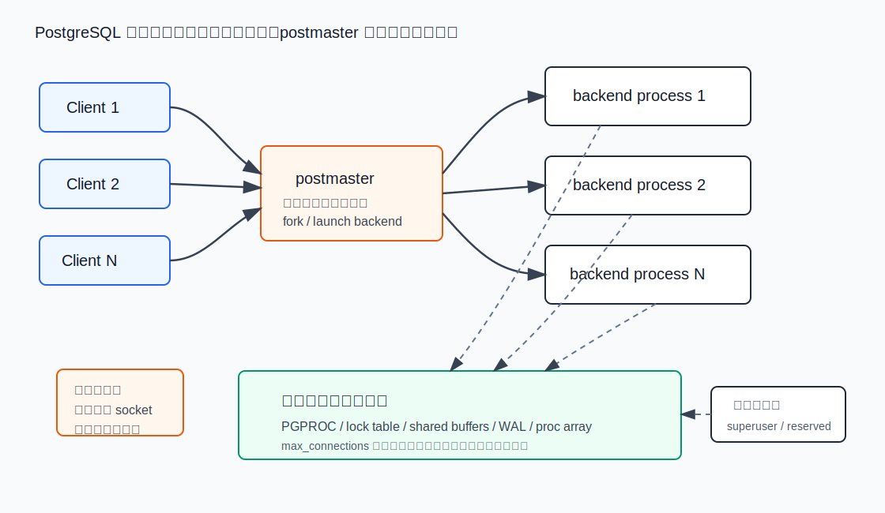
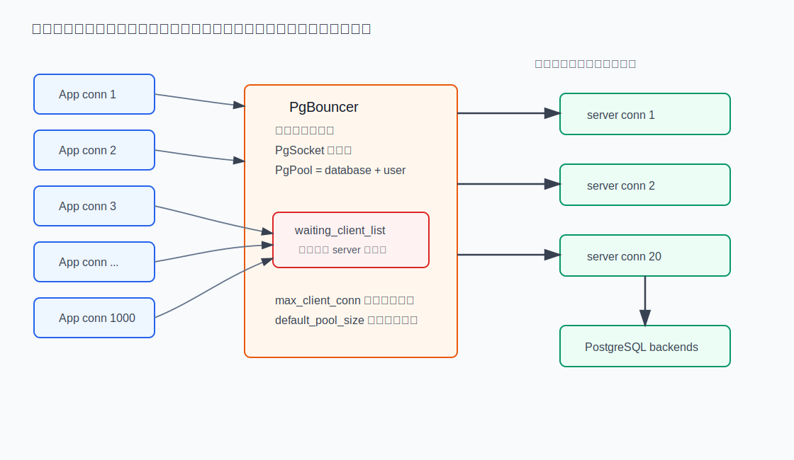
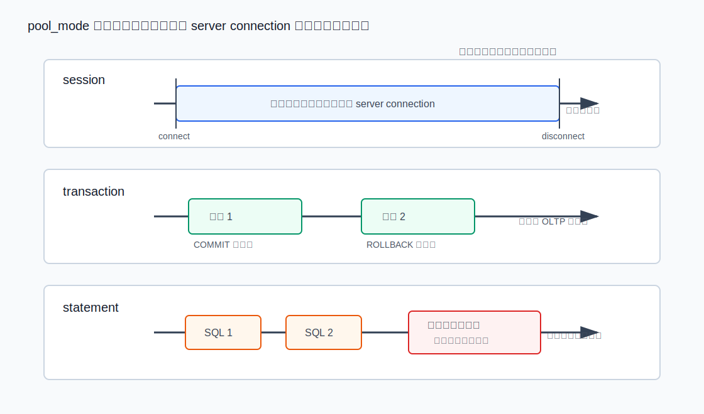
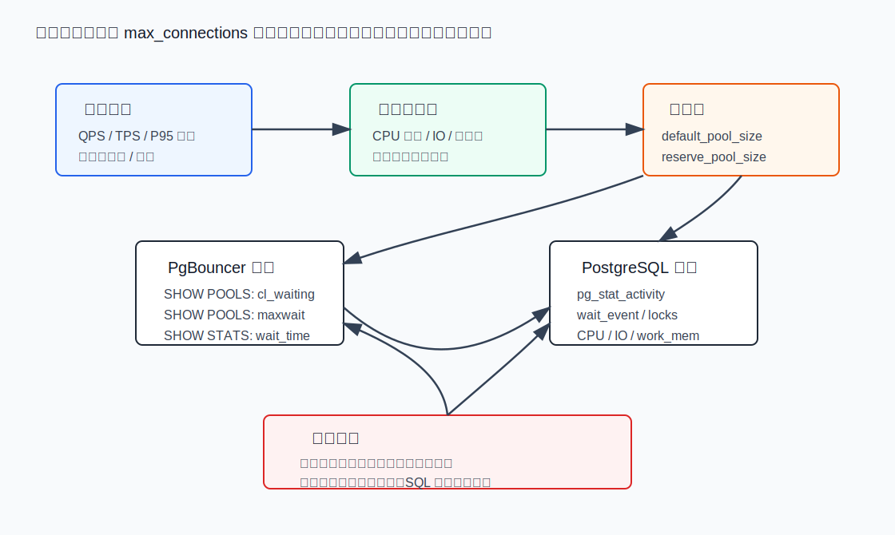

## 数据库筑基课 - 最佳实践之 进程模型与高并发和连接池

### 作者
digoal

### 日期
2026-06-01

### 标签
PostgreSQL , 应用开发者 , 数据库筑基课 , 进程模型 , 高并发 , 连接池 , PgBouncer , max_connections    

----

## 背景


本文属于[应用开发者数据库筑基课大纲](../202409/20240914_01.md)里“数据库架构、连接管理与高并发最佳实践”这一类基础能力。

很多系统第一次遇到数据库高并发问题时，直觉动作是把 `max_connections` 调大：100 不够调 500，500 不够调 2000。这个动作看起来是在“提高并发”，实际经常是在把数据库从“执行 SQL 的系统”推向“管理大量空闲连接、进程、内存上下文、锁表槽位和文件描述符的系统”。

PostgreSQL 的默认服务模型不是一个线程池处理所有客户端，而是 `postmaster` 接受连接后派生后端进程，一个客户端连接通常对应一个 backend process。这个模型带来很好的故障隔离和实现清晰度，但也决定了连接本身不是免费的。PgBouncer 这类连接池的价值，就是把“应用侧连接数”和“数据库侧实际后端数”拆开：应用可以有很多短连接或等待中的请求，数据库只维持少量稳定 server connections。

这一节的目标不是背 PgBouncer 参数，而是建立判断框架：

1. PostgreSQL 为什么不适合用无限连接数承接高并发？
2. 连接池到底池化了什么，牺牲了什么语义？
3. `session`、`transaction`、`statement` 三种 pool mode 应该怎么选？
4. 如何用 `SHOW POOLS`、`SHOW STATS`、`pg_stat_activity` 判断池太小、数据库太忙，还是 SQL 太慢？

## 一、它解决什么问题？

连接池解决的不是“让数据库同时执行更多 SQL”，而是“把大量客户端等待集中到更便宜的位置，并把数据库实际并发控制在稳定区间”。

典型问题有四类。

- **短连接风暴**：Serverless、PHP-FPM、Java 微服务扩容、批处理任务同时启动，瞬间制造大量 TCP 连接、认证、TLS、后端进程创建和销毁。
- **空闲连接占坑**：应用线程池开得很大，每个线程长期持有一个数据库连接，但真正执行 SQL 的时间很短。
- **数据库并发过载**：连接数升高后，CPU 上下文切换、锁等待、buffer 争用、内存峰值、临时文件和 IO 队列一起放大，吞吐反而下降。
- **运维通道被挤满**：所有普通连接占满后，DBA 无法连上去诊断或终止问题会话，所以 PostgreSQL 还需要 `superuser_reserved_connections` 和 `reserved_connections` 这类保留槽位。

传统做法是调大 `max_connections`。它只在“连接上限太低但数据库仍有余量”时有效。如果数据库已经处于 CPU、IO、锁、内存或事务冲突瓶颈，继续放大连接数只会把排队从应用层搬到数据库内部，而且排队成本更高。

更稳的做法是：

1. PostgreSQL 端设置一个能被机器稳定承受的 `max_connections`，并保留管理连接槽。
2. PgBouncer 端用 `max_client_conn` 接住应用侧并发，用 `default_pool_size` / `pool_size` 控制数据库侧实际连接数。
3. 应用侧设置合理超时、重试和事务边界，避免长事务占住池里的 server connection。

代价也很明确：池化越激进，session 语义越弱。临时表、会话级 GUC、LISTEN/NOTIFY、游标、SQL 级 prepared statement、长事务、复制连接等能力，都可能要求更保守的模式。

## 二、它是什么？

### 1. PostgreSQL 进程模型

PostgreSQL 源码 `src/backend/postmaster/postmaster.c` 文件头直接说明：frontend 连接到 Postmaster，postmaster fork 一个新的 backend process 处理该连接。文件注释还解释了为什么子进程负责认证：这样 SSL、PAM 等非多线程库阻塞时，不会阻塞其他客户端。



图 1 说明：`postmaster` 是监听、派生、监督者；真正执行 SQL 的是各个 backend process。backend 共享 buffer、lock table、WAL、PGPROC 等全局资源。`max_connections` 不是一个简单计数器，PostgreSQL 官方文档明确说明，部分资源会基于它分配，提高该值会增加包括 shared memory 在内的资源分配。

PostgreSQL 还有连接保护机制：

- `max_connections`：数据库允许的最大并发连接数，通常默认 100，只能在服务启动时设置。
- `reserved_connections`：保留给拥有 `pg_use_reserved_connections` 预定义角色权限的连接槽。
- `superuser_reserved_connections`：保留给超级用户的最终应急连接槽，默认 3。

源码 `postmaster.c` 启动时会检查 `superuser_reserved_connections + reserved_connections < max_connections`，否则拒绝启动。`pmchild.c` 还显示，postmaster 为正在认证中的 backend 留出额外 child slot，但真正的 `MaxConnections` 限制在 backend 加入 `PGPROC` 时执行。这解释了一个工程现象：连接风暴期间，连接创建和认证本身也会消耗资源，即使最终有些连接失败。

### 2. PgBouncer 连接池模型

PgBouncer 是 PostgreSQL 协议层连接池。它不是 SQL 执行器，也不优化 SQL。它做三件事：

- 维护大量客户端 socket。
- 按 database + user 维护 server connection pool。
- 在安全边界上把客户端请求绑定到某个 PostgreSQL server connection，执行完后释放或继续占用。

PgBouncer 的 `CLAUDE.md` 和源码结构说明它是单进程、单线程、基于 libevent 的事件驱动程序。核心对象是：

- `PgSocket`：客户端或服务端连接对象，有 `CL_ACTIVE`、`CL_WAITING`、`SV_ACTIVE`、`SV_IDLE` 等状态。
- `PgPool`：一个 database + user 对应一个池，内部维护 active/waiting client list 和 active/idle/used/tested/login server list。
- `PgDatabase` / `PgGlobalUser`：保存库级、用户级池参数。



图 2 说明：`max_client_conn` 控制 PgBouncer 能接住多少客户端连接，`default_pool_size` 或库/用户级 `pool_size` 控制每个 user/database pair 后面最多开多少 PostgreSQL server connection。客户端多出来时进入 `waiting_client_list`，数据库不一定增加 backend process。

这就是连接池的本质：把昂贵的数据库进程并发，变成相对便宜的池内排队。

## 三、核心原理

### 1. 连接数不是吞吐量

数据库吞吐量大致受几个瓶颈限制：

- CPU 核数和单条 SQL 的 CPU 消耗。
- buffer 命中率、随机 IO、WAL 写入和 fsync。
- 锁等待、行级冲突、事务快照和 autovacuum 压力。
- 每个 backend 的内存上限，例如 `work_mem`、排序、hash、临时文件。

连接数只决定“有多少会话可以同时在数据库里存在”，不等于“有多少 SQL 可以同时高效执行”。如果 32 核机器上让 2000 个 backend 同时争抢 CPU 和锁，常见结果不是 2000 倍吞吐，而是上下文切换、等待和尾延迟暴涨。

PostgreSQL 官方运行时文档也给出方向：在一些内存问题场景下，可能不是应该继续调大内存，而是减少数据库连接数，并使用外部连接池软件。

### 2. pool mode 决定复用边界

PgBouncer 的 `pool_mode` 定义了 server connection 何时可以被其他客户端复用：

| 模式 | 释放边界 | 兼容性 | 复用率 | 适合场景 | 主要风险 |
|---|---|---|---|---|---|
| `session` | 客户端断开后释放 | 最好 | 最低 | 会话状态多、临时表、LISTEN、复制、长会话 | 空闲连接仍占 server connection |
| `transaction` | 事务结束后释放 | 中等 | 高 | OLTP 短事务、Web API、读写请求明确提交 | 会话级状态不能跨事务假设稳定 |
| `statement` | 单条语句结束后释放 | 最弱 | 最高 | 极简单查询、无显式多语句事务 | 多语句事务不允许，兼容性限制最大 |



图 3 说明：从 `session` 到 `statement`，server connection 释放越来越早，复用率越来越高，但客户端能依赖的 PostgreSQL session 状态越来越少。PgBouncer 源码 `server.c` 还强制 replication connection 使用 session pooling，因为复制连接需要稳定会话。

`transaction` 是多数 OLTP 系统的首选，但前提是应用守规矩：

- 每次请求明确 `BEGIN` / `COMMIT` 或使用 autocommit。
- 不依赖跨事务的 `SET`、临时表、游标和 session advisory lock。
- 不使用 SQL 级 `PREPARE` / `EXECUTE` 作为跨事务状态。PgBouncer 的 `max_prepared_statements` 支持的是协议级 named prepared statements，并且通过内部名称改写和服务端补 prepare 实现；文档明确说明 SQL 级 `PREPARE`、`EXECUTE`、`DEALLOCATE` 会直接转发。

### 3. server_reset_query 不是万能清洁工

PgBouncer 默认 `server_reset_query = DISCARD ALL`，用于 session pooling 中 server connection 释放后清理会话状态。官方配置文档说明，transaction pooling 默认不执行 `server_reset_query`，因为在这种模式下客户端本来就不应依赖 session-based features。

这点非常关键：不要把 `transaction` 模式理解成“PgBouncer 会帮我清理一切 session 状态”。正确理解是：应用不应该制造跨事务 session 状态。`server_reset_query_always` 可以让 reset query 在所有模式运行，但文档也提醒，这更多是为错误用法兜底，会把不确定故障变成确定丢失会话状态。

### 4. 排队位置决定故障形态

没有连接池时，排队通常发生在 PostgreSQL 内部：

- 新连接等待进程、认证或连接槽。
- SQL 在 backend 内部等待 CPU、锁、IO、buffer pin。
- 运维连接可能被挤掉，只能依赖保留槽。

有 PgBouncer 后，排队可以提前到池：

- `cl_waiting` 增加表示客户端已经发请求，但还没有拿到 server connection。
- `maxwait` 增加表示最老的等待请求正在变老。
- `total_wait_time` / 平均等待指标可以衡量池内等待成本。

这不是把问题消灭，而是让问题更可控、更可观测。好的池化方案会让数据库维持在可稳定执行的并发区间，而不是让所有请求直接压到后端进程上。



图 4 说明：容量规划应该从业务 QPS、事务耗时和数据库稳定执行能力开始，再反推池大小。看到等待后，要同时看 PgBouncer 和 PostgreSQL：如果池等待升高但数据库 CPU/IO/锁都不忙，可能是池偏小；如果池等待升高且数据库已经满载，继续加池只会把数据库打爆。

## 四、横向对比

| 维度 | 直接连 PostgreSQL | 应用内连接池 | PgBouncer session pooling | PgBouncer transaction pooling |
|---|---|---|---|---|
| 主要目标 | 简单、语义完整 | 减少应用进程内建连成本 | 在代理层复用连接但保留会话语义 | 最大化短事务复用 |
| 数据库后端数 | 接近客户端连接数 | 接近应用池总和 | 接近活跃客户端会话数 | 接近正在执行事务数 |
| 会话状态兼容 | 完整 | 完整 | 基本完整 | 弱，不能跨事务依赖 |
| 扩容风险 | 应用实例越多连接越多 | 每个实例都有池，容易总量失控 | 代理统一控量 | 控量能力最强 |
| 适合场景 | 管理任务、低并发服务 | 单体应用、中小规模服务 | 需要 session 特性的应用 | Web/API 短事务高并发 |
| 不适合场景 | 高并发短连接 | 大量实例且缺少全局连接预算 | 空闲会话很多的场景 | 长事务、临时表、LISTEN、会话 GUC |

应用内连接池并不是错，但它只解决“同一应用进程内复用连接”。当服务实例数扩到几十上百个，每个实例池大小 20，总连接数仍然可能轻松超过数据库承受范围。PgBouncer 的优势是把连接预算集中到数据库前面，尤其适合多语言、多实例、多短连接入口。

## 五、效果如何？

连接池的效果应该从两面看。

收益：

- 降低 PostgreSQL 后端进程数量，减少进程调度、PGPROC、锁表、内存上下文和文件描述符压力。
- 降低连接建立、认证、TLS、参数协商等重复成本。
- 用 `pool_size` 把数据库并发控制在稳定区间，避免瞬时流量直接打满 `max_connections`。
- 用 `SHOW POOLS` 的 `cl_waiting`、`maxwait` 把“数据库前排队”显性化。

代价：

- 池化越激进，session 语义越弱。
- PgBouncer 是单进程事件循环，极高流量下也可能成为 CPU 瓶颈；PgBouncer 文档在 prepared statement 部分也提到，解析和改写会增加 CPU，用多实例和 `so_reuseport` 可以利用多核。
- 多一层代理就多一层配置、认证、证书、故障切换和监控对象。
- 池大小过小会增加等待，过大会让 PostgreSQL 回到过载状态。

所以不要问“PgBouncer 能把连接数开到多少”，要问“数据库能稳定同时处理多少事务，然后允许多少客户端在外面等”。

## 六、实操 DEMO

以下示例没有在本机启动 PostgreSQL/PgBouncer 执行压测，属于可复制的最小配置和观测模板。真实环境请先在测试库压测，再应用到生产。

### 1. PostgreSQL 端保守设置连接上限

```conf
# postgresql.conf
max_connections = 120
reserved_connections = 5
superuser_reserved_connections = 3
```

含义：

- 普通业务连接不要吃满全部槽位。
- 拥有 `pg_use_reserved_connections` 权限的运维角色有一层保留槽。
- 超级用户保留最终应急槽。

授予运维角色使用 reserved slot：

```sql
GRANT pg_use_reserved_connections TO dba_oncall;
```

### 2. PgBouncer 端限制数据库实际连接数

```ini
[databases]
appdb = host=127.0.0.1 port=5432 dbname=appdb pool_size=40 reserve_pool_size=10

[pgbouncer]
listen_addr = 0.0.0.0
listen_port = 6432
auth_type = scram-sha-256
auth_file = /etc/pgbouncer/userlist.txt

pool_mode = transaction
max_client_conn = 5000
default_pool_size = 40
reserve_pool_size = 10
reserve_pool_timeout = 3
server_reset_query = DISCARD ALL
max_prepared_statements = 200
listen_backlog = 1024
```

解释：

- `max_client_conn = 5000` 表示 PgBouncer 可接住大量客户端连接，但不是让 PostgreSQL 开 5000 个 backend。
- `pool_size = 40` 表示 `appdb + user` 这个池后面正常最多 40 条 server connection。
- `reserve_pool_size = 10` 是短时拥塞的缓冲，不应作为常态容量。
- `pool_mode = transaction` 要求应用不依赖跨事务 session 状态。

### 3. 观测 PgBouncer 排队

```sql
SHOW POOLS;
SHOW STATS;
SHOW CLIENTS;
SHOW SERVERS;
```

重点看：

| 指标 | 来自 | 含义 | 判断 |
|---|---|---|---|
| `cl_waiting` | `SHOW POOLS` | 等待 server connection 的客户端数 | 持续大于 0 表示池或数据库处理不过来 |
| `maxwait` / `maxwait_us` | `SHOW POOLS` | 最老等待请求的等待时间 | 持续升高说明排队恶化 |
| `sv_active` | `SHOW POOLS` | 正在绑定客户端的 server connection | 接近 pool_size 说明池被打满 |
| `sv_idle` | `SHOW POOLS` | 可立即复用的 server connection | 长期很多说明池可能偏大 |
| `total_wait_time` | `SHOW STATS` | 客户端等待 server 的累计时间 | 用于趋势和变更前后对比 |

### 4. 同时看 PostgreSQL

```sql
SELECT state, wait_event_type, wait_event, count(*)
FROM pg_stat_activity
WHERE datname = 'appdb'
GROUP BY state, wait_event_type, wait_event
ORDER BY count(*) DESC;
```

```sql
SELECT pid, usename, application_name, state, wait_event_type, wait_event,
       now() - xact_start AS xact_age,
       now() - query_start AS query_age,
       left(query, 120) AS query_sample
FROM pg_stat_activity
WHERE datname = 'appdb'
ORDER BY xact_age DESC NULLS LAST, query_age DESC NULLS LAST
LIMIT 20;
```

判断逻辑：

- `cl_waiting` 高，PostgreSQL CPU/IO/锁不忙：可小幅增加 `pool_size`，或检查 PgBouncer 是否单核瓶颈。
- `cl_waiting` 高，PostgreSQL 已经 CPU 满、锁等待多、IO 饱和：不要加池，先优化 SQL、索引、事务长度或扩容。
- `idle in transaction` 多：优先修应用事务边界，连接池救不了长事务占坑。
- `sv_idle` 长期很多且数据库连接数偏高：可以下调 `pool_size`。

## 七、最佳实践

### 面向数据库架构师

- 先给每个数据库集群定义“可稳定执行并发数”，而不是从应用连接数反推 `max_connections`。
- 多应用共享一个 PostgreSQL 集群时，要做全局连接预算：每个业务、每个用户、每个库的 pool size 加总不能超过数据库承受能力和 PostgreSQL `max_connections`。
- 优先把 OLTP 短事务系统改造成 PgBouncer `transaction` 模式兼容：显式事务边界、禁用跨事务 session 状态、把初始化语句放到连接建立或每事务逻辑里。
- 把管理连接和复制连接从普通业务池里隔离。复制连接在 PgBouncer 源码中会强制使用 session pooling，不应混入普通 transaction pool 语义。

验证方式：压测时同时采集 PgBouncer `SHOW POOLS/SHOW STATS`、PostgreSQL `pg_stat_activity`、CPU、IO、锁等待、P95/P99 延迟。只看 QPS 没意义，要看尾延迟和等待位置。

### 面向 DBA

- 不要把 `max_connections` 当作容量旋钮。调大前先估算 shared memory、每 backend 内存、文件描述符和进程数限制。
- 设置并演练 `reserved_connections`、`superuser_reserved_connections`、`pg_use_reserved_connections`，保证事故时能连进去。
- 给 PgBouncer 单独监控：`cl_waiting`、`maxwait`、`sv_active`、`sv_idle`、`total_wait_time`、登录失败、server connect time。
- 变更 `pool_size` 要小步走。每次调大都要确认 PostgreSQL 端 CPU、锁、IO、内存没有进入更差区间。
- 针对长事务、`idle in transaction`、慢 SQL 设置超时，例如 PostgreSQL `idle_in_transaction_session_timeout`、`statement_timeout`，以及 PgBouncer 侧合理的 query/client/server timeout。

验证方式：制造连接占满演练，确认普通业务连接被拒时，DBA 仍能通过保留槽登录并执行诊断。

### 面向业务开发者

- 使用 transaction pooling 时，默认不要依赖 session 状态。每个请求要么 autocommit，要么明确 `BEGIN` 到 `COMMIT/ROLLBACK`，并保证异常路径释放事务。
- 不要在事务里做外部 RPC、用户交互、文件上传、长时间计算。事务越长，占住 server connection 越久。
- 避免连接泄漏和无限重试。连接池排队已经说明系统在背压，无限制重试会制造更大风暴。
- 如果必须使用临时表、LISTEN/NOTIFY、session advisory lock、SQL 级 prepared statement、长游标，主动标记该业务需要 direct connection 或 session pooling。
- 应用内连接池仍要限制大小。即使接了 PgBouncer，应用池开太大也会增加 PgBouncer 客户端连接、内存和排队压力。

验证方式：在测试环境把 PgBouncer 切到 transaction mode，跑核心业务回归，重点检查事务外 `SET`、临时表、prepared statement、游标和连接初始化逻辑。

## 八、适合与不适合场景

适合：

- Web/API 型 OLTP，单次请求 SQL 数量有限，事务短，提交明确。
- Serverless、PHP-FPM、批处理、微服务横向扩容导致连接数波动大。
- 多应用共享数据库，需要统一控制数据库连接预算。
- 读多写少或轻量写入系统，SQL 执行时间短，空闲连接比例高。

不适合或要谨慎：

- 大量长事务、批量导入、长游标、长时间 `COPY`，因为每个任务会长时间占住 server connection。
- 强依赖 session 状态的应用，例如临时表跨事务复用、会话级 `SET search_path` 后长期假设有效。
- 使用 LISTEN/NOTIFY 的常驻监听连接。
- 逻辑复制、物理复制、备份、管理任务，通常需要直连或 session pooling。
- SQL 级 prepared statement 被业务当作会话状态复用的系统。

## 九、常见坑

1. **把 `max_client_conn` 理解成数据库连接数**

`max_client_conn` 是 PgBouncer 接受的客户端连接上限，不是 PostgreSQL 后端连接上限。数据库后端主要由 `pool_size`、database/user 数量和 reserve pool 决定。

2. **每个用户每个库一个池，实际连接数被乘法放大**

PgBouncer 文档给出的文件描述符估算公式包含 `max_client_conn + pool_size * total databases * total users`。如果每个应用用户都独立登录，连接预算会被 user/database 组合放大。

3. **transaction pooling 下继续依赖 session 状态**

表现为偶发找不到临时表、GUC 丢失、prepared statement 不存在、游标失效。根因不是 PgBouncer 随机坏，而是 server connection 每个事务后可能换人。

4. **长事务把池耗尽**

短事务系统里，一个 60 秒事务占住 server connection 的破坏力很大。看 `pg_stat_activity.xact_start` 和 PgBouncer `sv_active`，不要只看连接总数。

5. **看到等待就加 pool_size**

如果 PostgreSQL 已经 CPU 满或锁等待严重，加 `pool_size` 会让更多事务同时进数据库，通常会让 P99 更差。先判断等待瓶颈在哪。

6. **忽略 PgBouncer 自身 CPU**

PgBouncer 单进程事件循环很轻，但不是无限。TLS、prepared statement 改写、大结果集转发、极高包量都可能让它吃满单核。需要多实例、`so_reuseport`、分库分流或减少代理层工作。

7. **没有保留直连应急入口**

连接池配置错、认证错、池耗尽时，必须有 DBA 能直连 PostgreSQL 的路径，并且有保留连接槽。否则事故处理会被连接池一起挡在外面。

## 十、扩展问题

1. 为什么 PostgreSQL 选择多进程模型，而不是单进程多线程模型？它在故障隔离、锁、内存上下文和扩展安全上有什么收益与代价？
2. 如果一个服务有 1000 个客户端连接、平均 SQL 执行 10ms、P95 事务 80ms，应该如何估算初始 `pool_size`？
3. PgBouncer transaction pooling 与 JDBC/HikariCP 这类应用内连接池是替代关系，还是应该分层配合？
4. 如果 `cl_waiting` 持续增长，但 PostgreSQL `pg_stat_activity` 里大部分 backend 都在 lock wait，应该调池、杀事务、建索引，还是改业务事务顺序？
5. 为什么 `server_reset_query = DISCARD ALL` 不能作为 transaction pooling 下滥用 session 状态的长期解决方案？

## 十一、扩展阅读

主要源码与文档：

- PostgreSQL `postmaster` 进程模型：[`../postgres/src/backend/postmaster/postmaster.c`](../postgres/src/backend/postmaster/postmaster.c)
- PostgreSQL postmaster child slot：[`../postgres/src/backend/postmaster/pmchild.c`](../postgres/src/backend/postmaster/pmchild.c)
- PostgreSQL 连接参数官方文档：[`../postgres/doc/src/sgml/config.sgml`](../postgres/doc/src/sgml/config.sgml)
- PostgreSQL 运行时资源与连接池建议：[`../postgres/doc/src/sgml/runtime.sgml`](../postgres/doc/src/sgml/runtime.sgml)
- PostgreSQL `pg_use_reserved_connections`：[`../postgres/doc/src/sgml/user-manag.sgml`](../postgres/doc/src/sgml/user-manag.sgml)
- PgBouncer 配置文档：[`../pgbouncer/doc/config.md`](../pgbouncer/doc/config.md)
- PgBouncer 使用与观测命令：[`../pgbouncer/doc/usage.md`](../pgbouncer/doc/usage.md)
- PgBouncer pool mode 与 pool size 源码：[`../pgbouncer/src/server.c`](../pgbouncer/src/server.c)
- PgBouncer server release/reset 源码：[`../pgbouncer/src/objects.c`](../pgbouncer/src/objects.c)
- PgBouncer admin `SHOW POOLS` 源码：[`../pgbouncer/src/admin.c`](../pgbouncer/src/admin.c)
- PgBouncer `PgPool`/`PgSocket` 状态结构：[`../pgbouncer/include/bouncer.h`](../pgbouncer/include/bouncer.h)

DeepWiki 辅助阅读：

- PostgreSQL 架构与进程/事务管理：<https://deepwiki.com/postgres/postgres>
- PgBouncer 架构：<https://deepwiki.com/pgbouncer/pgbouncer>

本文关键结论均以 PostgreSQL / PgBouncer 本地源码和项目文档为主，DeepWiki 用于快速梳理架构线索；涉及行为边界时，以源码和官方文档为准。
  
## 附录 

1、克隆代码  
```  
git clone --depth 1 https://github.com/postgres/postgres
git clone --depth 1 https://github.com/pgbouncer/pgbouncer
```  
  
2、启用 codex, 使用 [数据库筑基课 skill](../skills/README.md).  
```
文章标题: 
  数据库筑基课 - 最佳实践之 进程模型与高并发和连接池
项目源码(本地目录): 
  postgres
  pgbouncer
项目 codebase 文件名: 
  postgres/CLAUDE.md 
  pgbouncer/CLAUDE.md 
开源项目相关的 deepwiki repoName: 
  postgres/postgres
  pgbouncer/pgbouncer
```

  
  
#### [PostgreSQL 解决方案集合](../201706/20170601_02.md "40cff096e9ed7122c512b35d8561d9c8")
  
  
#### [德哥 / digoal's Github - 公益是一辈子的事.](https://github.com/digoal/blog/blob/master/README.md "22709685feb7cab07d30f30387f0a9ae")
  
  
#### [About 德哥](https://github.com/digoal/blog/blob/master/me/readme.md "a37735981e7704886ffd590565582dd0")
  
  

  
