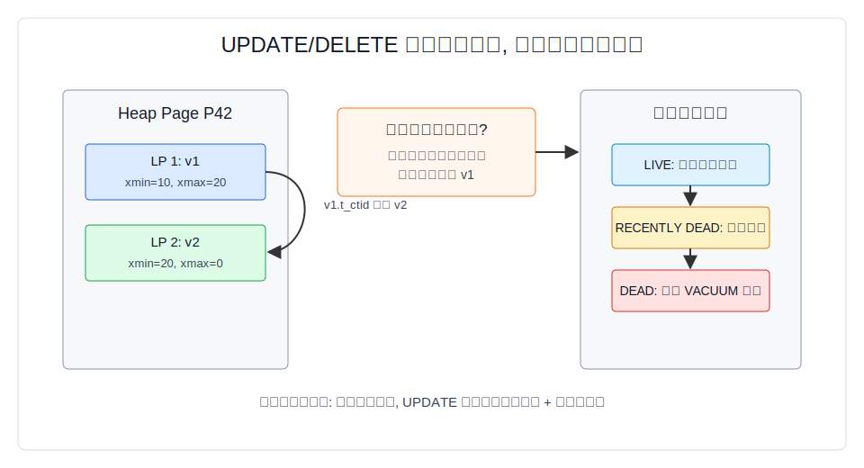
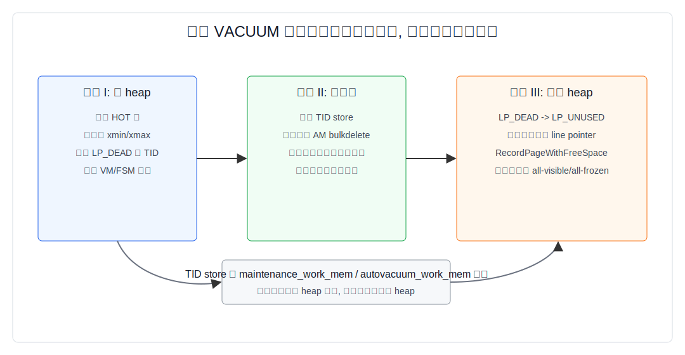
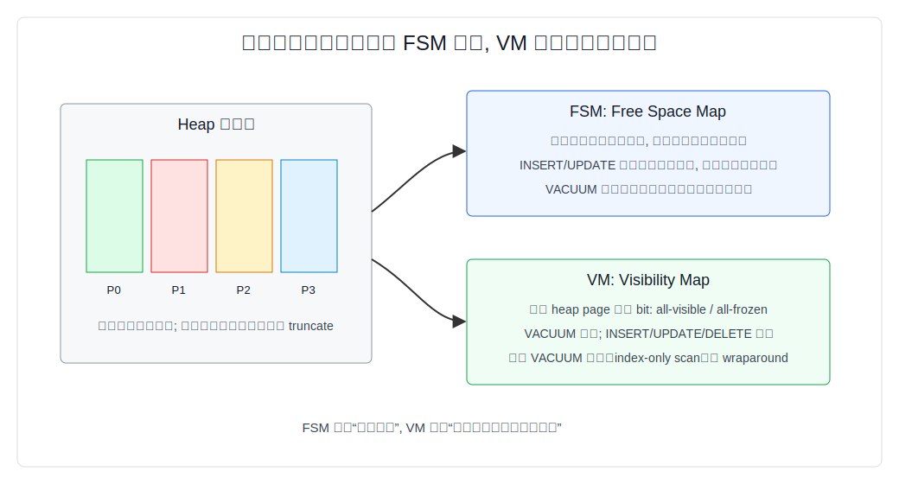
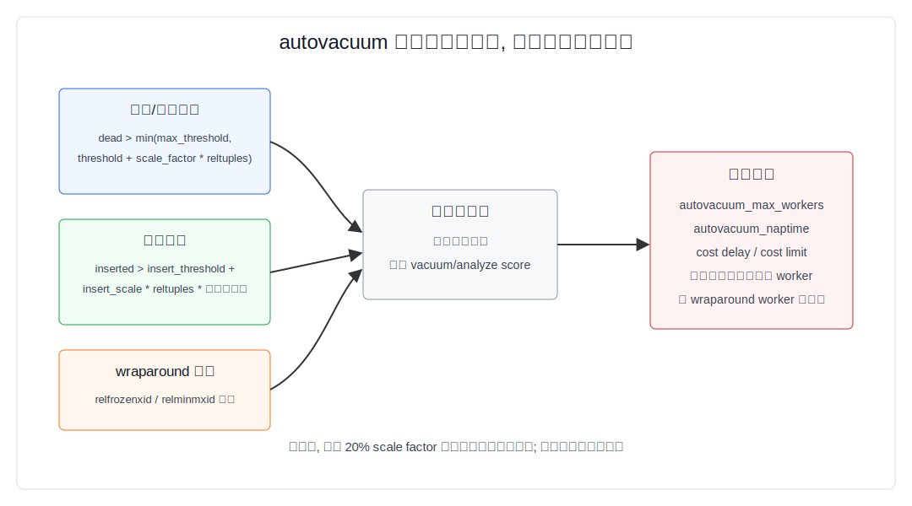
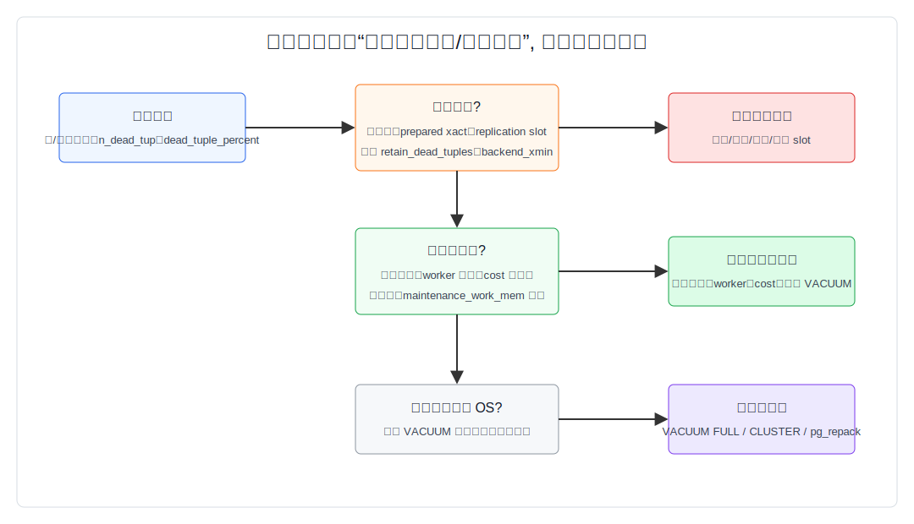

## 数据库筑基课 - 最佳实践之 垃圾回收与膨胀的根源

### 作者
digoal

### 日期
2026-06-01

### 标签
PostgreSQL , 应用开发者 , 数据库筑基课 , MVCC , VACUUM , autovacuum , 表膨胀 , FSM , VM    

----

## 背景
  


本文属于[应用开发者数据库筑基课大纲](../202409/20240914_01.md)里“表存储、MVCC、垃圾回收与维护机制”这一类基础能力。

很多线上 PostgreSQL 问题看起来是“磁盘满了”“索引变慢了”“表明明删了很多数据为什么文件不变小”“autovacuum 怎么又在跑”，根源通常不是单一参数，而是没有理解 PostgreSQL 的基本交换：

PostgreSQL 用 MVCC 换取读写并发。代价是 `UPDATE` 和 `DELETE` 不会立刻把旧版本从文件里抹掉。旧版本先留在 heap page 里，等确认没有任何事务还可能看见它，再由 `VACUUM` 把它变成可复用空间。这个过程跑得太晚、跑不完、被长事务挡住，空间就会膨胀。

本文讨论的是标准 heap 表的垃圾回收与膨胀根因。索引膨胀、TOAST 表、分区表、逻辑复制保留死元组也会涉及，但重点仍然是 `heap + MVCC + VACUUM + autovacuum` 这条主线。

## 一、它解决什么问题？

垃圾回收解决三个工程问题：

1. 把旧行版本占用的空间重新交给后续写入复用。
2. 清掉指向死元组的索引项，避免索引扫描访问无效 TID。
3. 冻结足够老的事务 ID，避免 transaction ID 或 multixact ID wraparound。

如果垃圾回收跟不上，症状会很具体：

- `pg_stat_all_tables.n_dead_tup` 持续升高，`last_autovacuum` 很久不变。
- 表文件和索引文件越来越大，业务数据量却没有同比增长。
- `VACUUM VERBOSE` 或 autovacuum 日志显示有大量 dead tuples，但无法移除，通常是被长事务、prepared transaction、复制槽或逻辑复制保留。
- `EXPLAIN (ANALYZE, BUFFERS)` 里同样的业务 SQL 扫描更多 block，缓存命中下降，延迟抖动。
- anti-wraparound autovacuum 频繁出现，甚至接近拒绝分配新 XID 的危险区。

它牺牲的是维护成本：更多后台 IO、WAL、buffer 污染、索引清理 CPU，以及需要 DBA 为不同表设置不同 autovacuum 策略。

## 二、它是什么？

在 PostgreSQL heap 表里，垃圾不是“已删除的业务行”这么简单，而是“某个行版本对所有当前和未来可能相关的事务都不再可见”。

关键术语：

| 术语 | 含义 | 为什么重要 |
|---|---|---|
| tuple / row version | heap page 里的一个物理行版本 | `UPDATE` 通常产生新版本，旧版本仍占空间 |
| `xmin` | 创建该版本的事务 ID | 判断版本从什么时候开始可见 |
| `xmax` | 删除、更新或锁定该版本的事务/MultiXact 信息 | 判断版本是否结束可见 |
| `t_ctid` | tuple 自身位置或更新链后继位置 | UPDATE 后旧版本指向新版本 |
| dead tuple | 对任何事务都不再需要的旧版本 | VACUUM 可以回收 |
| recently dead tuple | 当前事务看不到，但仍可能被老事务看到的版本 | VACUUM 还不能回收 |
| LP_DEAD / LP_UNUSED | heap line pointer 状态 | 清索引前不能过早复用 line pointer |
| FSM | Free Space Map | 记录哪些 page 有多少可复用空间 |
| VM | Visibility Map | 记录哪些 heap page all-visible / all-frozen |

所以“垃圾回收”不是 `rm` 文件，而是维护一组状态转换：旧版本从 live 变成 recently dead，再变成 dead，再被 VACUUM 变成页内可复用空间。只有表尾连续空页满足条件时，标准 `VACUUM` 才可能把文件截短；否则空间留在表文件内部，供后续写入复用。

## 三、核心原理

### 3.1 UPDATE/DELETE 为什么制造垃圾？

PostgreSQL 官方维护文档明确说明：`UPDATE` 或 `DELETE` 不会立即删除旧行版本，因为 MVCC 需要让并发事务继续看到它们应该看到的版本。源码层面，`src/backend/access/heap/heapam.c` 的 `heap_update()` 会准备新 tuple，把新版本写入页面或新页面，然后在旧版本上设置 `xmax`，并把旧版本的 `t_ctid` 指向新版本；如果满足 HOT 条件，还会把旧版本标记为 HOT-updated、新版本标记为 heap-only。



图 1 说明：业务层一次 `UPDATE`，物理层常常是“旧版本结束可见 + 新版本开始可见”。旧版本何时可以被清理，不取决于这条 SQL 是否提交这么简单，还取决于系统里是否有更老的快照、事务、复制槽或逻辑复制保留需求。

这也是膨胀的第一根因：写入路径是追加新版本而不是覆盖旧版本。只要更新频率高于回收频率，或者回收被阻塞，page 内部就会累积不可立即复用的旧版本。

### 3.2 标准 VACUUM 的三阶段

PostgreSQL 的并发标准 VACUUM 主要实现在 `src/backend/access/heap/vacuumlazy.c`。文件开头注释把 heap vacuum 分为三个主要阶段：

1. 扫描 heap page，剪枝和冻结 tuple，把需要从索引里删除的 dead tuple TID 存入 TID store。
2. 扫描索引，删除这些 TID 对应的 dead index entries。
3. 回到 heap page，把对应 LP_DEAD line pointer 标记为 LP_UNUSED，让页内空间可以复用。



图 2 说明：VACUUM 不能在发现死元组时马上把 heap line pointer 变成可复用，因为索引里可能还有指向这个 TID 的条目。必须先批量清理索引，再回 heap 释放 line pointer。这解释了为什么索引多、死元组多、`maintenance_work_mem` 或 `autovacuum_work_mem` 太小，VACUUM 成本会明显上升。

`vacuumlazy.c` 还有几个关键工程细节：

- TID store 受内存上限约束。满了以后会暂停 heap 扫描，先清理一轮索引和 heap，再继续。
- 普通 VACUUM 可以跳过 VM 中 all-visible 的页面；aggressive vacuum 为了推进冻结边界，需要扫描更多页面。
- 如果 relfrozenxid 或 relminmxid 接近危险区，failsafe 可能跳过部分索引维护，把目标优先级切到防 wraparound。
- 完成后会更新 `pg_class` 和累计统计信息，并尝试截断表尾空页。

### 3.3 FSM 与 VM 的分工

FSM 和 VM 是理解“回收”和“膨胀”的两个核心辅助结构。

FSM 记录每个 page 近似有多少 free space。`src/backend/storage/freespace/README` 说明，FSM 的目的就是快速找到足够容纳新 tuple 的 page；它不记录精确字节，而是用每 heap page 一个字节的近似值，并在页内和页间组织成树，根节点能快速判断“有没有足够大的空闲页”。VACUUM 在扫描 heap 时调用 `RecordPageWithFreeSpace()`，并周期性调用 `FreeSpaceMapVacuumRange()` 把底层空闲信息传播到上层 FSM。

VM 记录每个 heap page 两个 bit：all-visible 和 all-frozen。`src/backend/access/heap/visibilitymap.c` 的注释强调它是保守结构：bit 设上时必须为真，bit 没设不代表条件一定为假。VACUUM 设置 VM bit；任何会让页面不再全局可见的数据修改都会清除对应 bit。



图 3 说明：FSM 解决“新版本写到哪里”，VM 解决“哪些页面可以少看”。标准 VACUUM 清出的空间通常先进入 FSM，后续 `INSERT` 或非 HOT `UPDATE` 可以复用这些页内空间。文件大小不降，不代表回收没有效果；要看 free space、dead tuple、后续写入是否复用。

### 3.4 autovacuum 如何决定何时清理？

autovacuum 不是“每天夜里扫一遍”。官方文档描述了 launcher 和 worker：launcher 周期性在数据库之间分配 worker，每个 worker 检查数据库里的表，按统计信息决定是否执行 `VACUUM` 或 `ANALYZE`。

对更新/删除造成的死元组，核心触发公式是：

```text
vacuum threshold =
  min(autovacuum_vacuum_max_threshold,
      autovacuum_vacuum_threshold
      + autovacuum_vacuum_scale_factor * pg_class.reltuples)
```

对只插入或几乎只插入的表，还有 insert vacuum 触发：

```text
vacuum insert threshold =
  autovacuum_vacuum_insert_threshold
  + autovacuum_vacuum_insert_scale_factor
    * pg_class.reltuples
    * (1 - pg_class.relallfrozen / pg_class.relpages)
```

如果表的 `relfrozenxid` 或 `relminmxid` 太老，即使 autovacuum 被关闭，系统也会为防 wraparound 启动 autovacuum。



图 4 说明：默认参数对小表通常够用，对超大热表经常太晚。例如默认 `autovacuum_vacuum_scale_factor = 0.2`，一张估算 10 亿行的表可能要累积到约 2 亿 dead tuples 才触发普通 vacuum，除非被 `autovacuum_vacuum_max_threshold` 截住，或按表设置更小阈值。热表要按业务写入速率和可接受膨胀窗口设置表级 storage parameters。

### 3.5 为什么 VACUUM 后文件还是大？

标准 `VACUUM` 的常态目标是 steady-state space reuse，不是最小化文件大小。官方文档明确区分：

- 标准 `VACUUM` 删除表和索引里的 dead row versions，并把空间标记为未来可复用。
- 它通常不会把空间归还给操作系统，除非表尾有一个或多个完全空 page，且能容易获得需要的锁来截断。
- `VACUUM FULL` 会重写整张表，把文件压缩到更小，但需要 `ACCESS EXCLUSIVE` 锁，还需要额外磁盘空间保存新副本直到完成。

所以一次大删除后看到表文件不缩小，是预期行为。真正的问题是：后续写入是否能复用这些空间？如果业务以后不会再写入同等规模数据，才需要考虑 `VACUUM FULL`、`CLUSTER`、分区 drop/detach、在线重写工具等方案。

## 四、横向对比

| 维度 | 标准 VACUUM | autovacuum | VACUUM FULL | CLUSTER / 表重写 | 分区丢弃 |
|---|---|---|---|---|---|
| 主要目标 | 回收死元组并复用空间 | 自动执行 VACUUM/ANALYZE | 物理压缩表文件 | 按新物理布局重写 | 快速释放整段数据 |
| 并发影响 | 通常不阻塞 DML，限制 DDL | 通常不阻塞 DML，锁冲突可中断普通 worker | `ACCESS EXCLUSIVE`，强阻塞 | 通常强锁或高维护成本 | 对单个分区操作，影响可控 |
| 是否归还 OS 空间 | 只在表尾空页可截断时 | 同标准 VACUUM，且不会执行 VACUUM FULL | 是 | 是 | 是，释放整个分区文件 |
| 资源成本 | IO、WAL、CPU、索引清理 | 后台 IO + 调度资源 | 重写全表 + 重建索引 + 额外空间 | 重写全表 + 重建索引 | 依赖分区设计 |
| 适合场景 | 日常维护、热表稳态 | 绝大多数常规表 | 大量删除后不再回涨，维护窗口允许 | 需要物理重排或重建 | 时间序列、租户、冷热数据 |
| 不适合场景 | 需要立刻缩文件 | autovacuum 参数明显跟不上 | 7x24 热表无维护窗口 | 无法承受重写成本 | 没有分区边界的数据 |

这里的关键判断是“业务未来还会不会把空间吃回来”。如果会，标准 VACUUM 让空间可复用就是正确目标；如果不会，才讨论物理收缩。

## 五、效果如何？

垃圾回收做得好，效果不是“每次都让表变小”，而是：

- dead tuple 数量在可控范围内波动，而不是持续上升。
- 表大小进入稳态，新增写入能复用历史空洞。
- VM all-visible 比例提高，index-only scan 的 heap fetch 下降。
- relfrozenxid、relminmxid 年龄远离 wraparound 风险。
- autovacuum 日志里单次耗时、扫描页数、跳过页数、清理索引次数可解释。

典型代价：

- 过于激进的 autovacuum 会和业务争 IO，特别是在缓存和存储带宽紧张时。
- 过于保守的 autovacuum 会让 dead tuple 和索引垃圾累积，最终用更大的一次性维护成本偿还。
- 索引越多，清理 dead index entry 的成本越高；非 HOT update 比 HOT update 更容易制造索引垃圾。
- 长事务让 VACUUM 看到“不能删”的 recently dead tuple，即使反复跑也清不掉。

## 六、实操 DEMO

下面 SQL 是最小验证路径。本文没有在当前环境启动 PostgreSQL 实例执行这些 SQL；语法依据 PostgreSQL 文档和源码，实际输出以你的版本、扩展安装情况和数据为准。

### 6.1 制造并观察死元组

```sql
CREATE TABLE vacuum_demo (
  id bigint GENERATED ALWAYS AS IDENTITY PRIMARY KEY,
  k int NOT NULL,
  payload text NOT NULL
);

INSERT INTO vacuum_demo(k, payload)
SELECT g, repeat('x', 200)
FROM generate_series(1, 100000) AS g;

ANALYZE vacuum_demo;

UPDATE vacuum_demo
SET payload = repeat('y', 200)
WHERE id <= 50000;

DELETE FROM vacuum_demo
WHERE id > 90000;

SELECT relname, n_live_tup, n_dead_tup, vacuum_count, autovacuum_count,
       last_vacuum, last_autovacuum
FROM pg_stat_all_tables
WHERE relname = 'vacuum_demo';
```

### 6.2 执行 VACUUM 并验证统计变化

```sql
VACUUM (VERBOSE, ANALYZE) vacuum_demo;

SELECT relname, n_live_tup, n_dead_tup, vacuum_count, autovacuum_count,
       last_vacuum, last_autovacuum
FROM pg_stat_all_tables
WHERE relname = 'vacuum_demo';
```

如果安装了 `pgstattuple`，可以做更物理的验证：

```sql
CREATE EXTENSION IF NOT EXISTS pgstattuple;

SELECT *
FROM pgstattuple('vacuum_demo'::regclass);
```

`pgstattuple` 会扫描关系并返回 tuple、dead tuple、free space 等统计。它适合确认膨胀，但不适合高频扫大表。

### 6.3 查看 VM 与 FSM

```sql
CREATE EXTENSION IF NOT EXISTS pg_visibility;
CREATE EXTENSION IF NOT EXISTS pg_freespacemap;

SELECT *
FROM pg_visibility_map_summary('vacuum_demo'::regclass);

SELECT blkno, avail
FROM pg_freespace('vacuum_demo'::regclass)
ORDER BY avail DESC
LIMIT 20;
```

VM 看到的是“哪些 heap page 已知 all-visible / all-frozen”；FSM 看到的是“哪些 block 记录了可复用空间”。二者结合，比只看 `pg_relation_size()` 更接近真实状态。

### 6.4 找出阻止清理的长事务和复制槽

```sql
SELECT pid, usename, state, xact_start, backend_xmin,
       now() - xact_start AS xact_age,
       left(query, 120) AS query
FROM pg_stat_activity
WHERE xact_start IS NOT NULL
ORDER BY xact_start NULLS LAST;

SELECT gid, prepared, owner, database,
       age(transaction) AS xid_age
FROM pg_prepared_xacts
ORDER BY prepared;

SELECT slot_name, slot_type, active,
       age(xmin) AS xmin_age,
       age(catalog_xmin) AS catalog_xmin_age
FROM pg_replication_slots
WHERE xmin IS NOT NULL OR catalog_xmin IS NOT NULL;
```

如果这里存在很老的 `backend_xmin`、prepared transaction、复制槽 `xmin/catalog_xmin`，VACUUM 可能无法把许多旧版本判定为可删除。

### 6.5 给热表设置更合理的 autovacuum 参数

```sql
ALTER TABLE vacuum_demo SET (
  autovacuum_vacuum_scale_factor = 0.02,
  autovacuum_vacuum_threshold = 5000,
  autovacuum_analyze_scale_factor = 0.01,
  autovacuum_analyze_threshold = 5000,
  autovacuum_vacuum_cost_limit = 2000,
  autovacuum_vacuum_cost_delay = '2ms'
);
```

这些不是通用推荐值，只是展示写法。实际应按表大小、每分钟更新/删除量、允许 dead tuple 积累窗口、IO 余量和业务峰谷来计算。

## 七、最佳实践

### 面向数据库架构师

1. 把“会大量删除的生命周期数据”设计成分区。能 `DROP PARTITION` 或 `DETACH PARTITION` 的，不要依赖逐行 `DELETE + VACUUM` 释放空间。
2. 对高频更新表，减少不必要索引，避免频繁更新索引列。索引列被更新会破坏 HOT 机会，并制造更多索引垃圾。
3. 把大字段和频繁更新的小状态拆开。宽行更新更容易触发 TOAST 和页面空间不足，增加膨胀。
4. 为队列、状态机、计数类热表单独设计 autovacuum storage parameters，不要只依赖全局默认值。
5. 为可预期的大批量删除预留维护策略：分批删除、手工 VACUUM、重写窗口、磁盘临时空间和回滚方案。

### 面向 DBA

1. 打开 `log_autovacuum_min_duration`，至少在排查期记录 autovacuum 行为。只看“有没有 autovacuum”不够，要看跑了多久、清了多少、为什么没清。
2. 监控 `pg_stat_all_tables.n_dead_tup`、`last_autovacuum`、`autovacuum_count`、`vacuum_count`，并按表大小归一化。
3. 监控 `age(relfrozenxid)` 和 `age(relminmxid)`。防 wraparound 比回收空间优先级更高。
4. 对大热表降低 scale factor，必要时提高 worker 数、cost limit 或手工在低峰期补充 VACUUM。
5. 排查膨胀时先找阻塞者：长事务、idle in transaction、prepared transaction、复制槽、逻辑复制保留，再考虑重写表。
6. 不要把 `VACUUM FULL` 当日常维护。它是表重写操作，需要锁、时间和额外空间。

### 面向业务开发者

1. 不要长时间打开事务，尤其不要 `BEGIN` 后等待用户输入、远程 API、批处理循环或人工审批。
2. 设置合理的 `idle_in_transaction_session_timeout`，让忘记提交的连接尽早失败。
3. 批量删除时分批提交，给 VACUUM 和复制消费留出机会。
4. 避免反复更新大字段或索引列。能只更新状态列，就不要更新整行。
5. 对“软删除”表要有归档和物理清理策略。只加 `deleted_at` 不会减少表扫描成本。

## 八、适合与不适合场景

适合标准 VACUUM 稳态治理的场景：

- 高频更新但数据规模稳定的 OLTP 表。
- 后续写入会复用历史空洞的业务表。
- 需要保持在线读写，不允许长时间强锁。
- 只需要控制膨胀比例，不要求立刻归还 OS 空间。

适合表重写或分区释放的场景：

- 一次性删除了大部分历史数据，未来不会再长回来。
- 表尾以外有大量内部空洞，标准 VACUUM 无法缩小文件。
- 大量非 HOT update 已造成明显索引膨胀，需要重建索引或重写表。
- 有明确维护窗口和额外磁盘空间。

不适合只靠 autovacuum 的场景：

- 短时间删除/更新量远超 autovacuum 能力。
- 长事务常驻，VACUUM 无法推进清理边界。
- 复制槽长期不消费，保留大量旧版本或 WAL。
- 默认 scale factor 对超大表过大，触发点远晚于业务可接受窗口。

## 九、常见坑

### 坑 1：把文件大小不下降误判为 VACUUM 失败

标准 VACUUM 的常态结果是“页内空间可复用”，不是“文件立刻变小”。应结合 `pgstattuple`、`pg_freespace` 和后续写入是否复用来判断。

### 坑 2：只调 autovacuum，全然不管长事务

只要有很老的事务快照或复制槽保留边界，VACUUM 看到的很多旧版本仍是 recently dead，不能删。此时加 worker 或提高 cost limit 只会更频繁地做无效扫描。

### 坑 3：大表使用默认 20% scale factor

默认值对大热表可能触发太晚。按表设置 `autovacuum_vacuum_scale_factor` 和 threshold，比盲目提高全局 autovacuum 频率更可控。

### 坑 4：索引越多越安全

每个非 HOT update 都可能维护更多索引项，VACUUM 也要清理更多 dead index entries。索引设计要服务查询，不要把低价值索引留在高更新表上。

### 坑 5：用大事务做批量删除

一个超大事务会制造大量旧版本，同时在提交前让其他事务和 VACUUM 难以推进。更好的方式通常是分批删除、分批提交，并观察复制延迟和 VACUUM 进展。

### 坑 6：把防 wraparound autovacuum 当普通后台任务杀掉

anti-wraparound 是数据安全维护。频繁取消它，最终会进入数据库拒绝分配新 XID 的风险区。应优先解除阻塞者并让它完成。



图 5 说明：膨胀治理的顺序是先确认能不能清、再确认是否来得及清、最后才决定是否重写。直接上 `VACUUM FULL` 可能暂时缩小文件，但如果根因仍在，表会很快再次膨胀。

## 十、扩展问题

1. 为什么 PostgreSQL 的 index-only scan 仍然需要 VM，而不是只看索引？
2. HOT update 为什么能降低索引膨胀？它需要哪些前提？
3. 如果一张 10 亿行表每小时更新 1000 万行，默认 autovacuum 阈值是否合理？应该如何按表计算触发窗口？
4. 为什么长事务即使没有锁住目标表，也可能阻止 VACUUM 清理目标表的旧版本？
5. 一次删除 80% 历史数据后，应该选择标准 VACUUM、VACUUM FULL、CLUSTER、pg_repack 还是分区 drop？决策条件是什么？
6. DuckDB、MySQL InnoDB、LSM 系统的 compaction / purge / vacuum 和 PostgreSQL VACUUM 的共同点与差异是什么？

## 十一、扩展阅读

- PostgreSQL 官方文档：`doc/src/sgml/maintenance.sgml`，Routine Vacuuming、Recovering Disk Space、Preventing Transaction ID Wraparound Failures、The Autovacuum Daemon。
- PostgreSQL 官方文档：`doc/src/sgml/storage.sgml`，Free Space Map、Visibility Map、Database Page Layout。
- PostgreSQL 官方文档：`doc/src/sgml/config.sgml`，autovacuum 参数、cost-based vacuum delay、freeze 参数、`idle_in_transaction_session_timeout`。
- PostgreSQL 官方文档：`doc/src/sgml/monitoring.sgml`，`pg_stat_all_tables`、`pg_stat_progress_vacuum`。
- PostgreSQL contrib 文档：`doc/src/sgml/pgstattuple.sgml`、`pgvisibility.sgml`、`pgfreespacemap.sgml`。
- PostgreSQL 源码：`src/backend/access/heap/heapam.c`，`heap_update()`、`heap_delete()`、HOT update、VM bit 清理。
- PostgreSQL 源码：`src/backend/access/heap/vacuumlazy.c`，标准 VACUUM 三阶段、TID store、FSM/VM 更新、failsafe。
- PostgreSQL 源码：`src/backend/access/heap/visibilitymap.c`，VM 两个 bit、保守语义、WAL/锁要求。
- PostgreSQL 源码：`src/backend/storage/freespace/README` 与 `src/backend/storage/freespace/freespace.c`，FSM 树结构、搜索和更新。
- PostgreSQL 源码：`src/backend/postmaster/autovacuum.c`，autovacuum worker 调度和 `relation_needs_vacanalyze` 判断路径。
- DeepWiki：`postgres/postgres` 关于 MVCC、VACUUM、FSM、VM、autovacuum 的架构说明，用作导航；关键结论已回查官方文档和源码。
  
## 附录 

1、克隆代码  
```  
git clone --depth 1 https://github.com/postgres/postgres
```  
  
2、启用 codex, 使用 [数据库筑基课 skill](../skills/README.md).  
```
文章标题: 
  数据库筑基课 - 最佳实践之 垃圾回收与膨胀的根源
项目源码(本地目录): 
  postgres
项目 codebase 文件名: 
  postgres/CLAUDE.md 
开源项目相关的 deepwiki repoName: 
  postgres/postgres
```

  
  
#### [PostgreSQL 解决方案集合](../201706/20170601_02.md "40cff096e9ed7122c512b35d8561d9c8")
  
  
#### [德哥 / digoal's Github - 公益是一辈子的事.](https://github.com/digoal/blog/blob/master/README.md "22709685feb7cab07d30f30387f0a9ae")
  
  
#### [About 德哥](https://github.com/digoal/blog/blob/master/me/readme.md "a37735981e7704886ffd590565582dd0")
  
  

  
