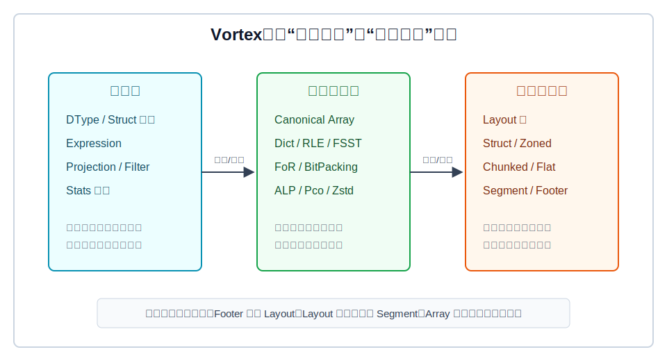
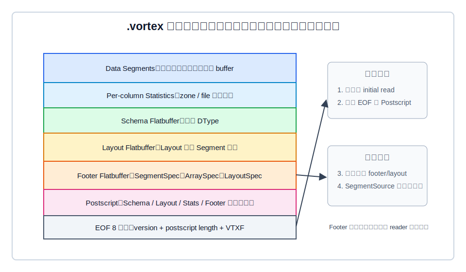
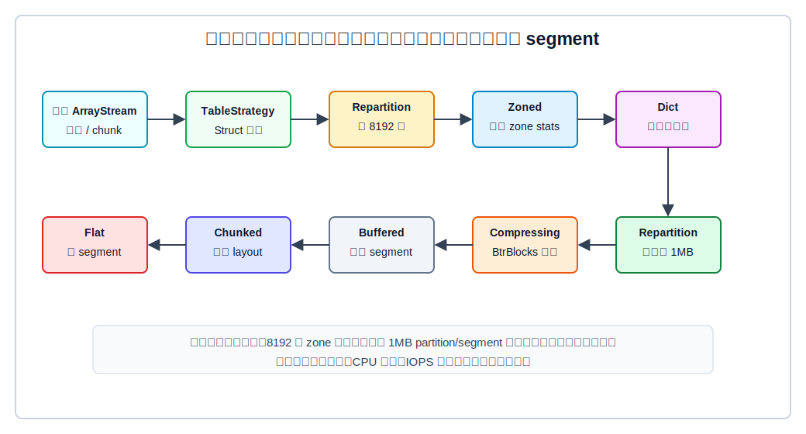
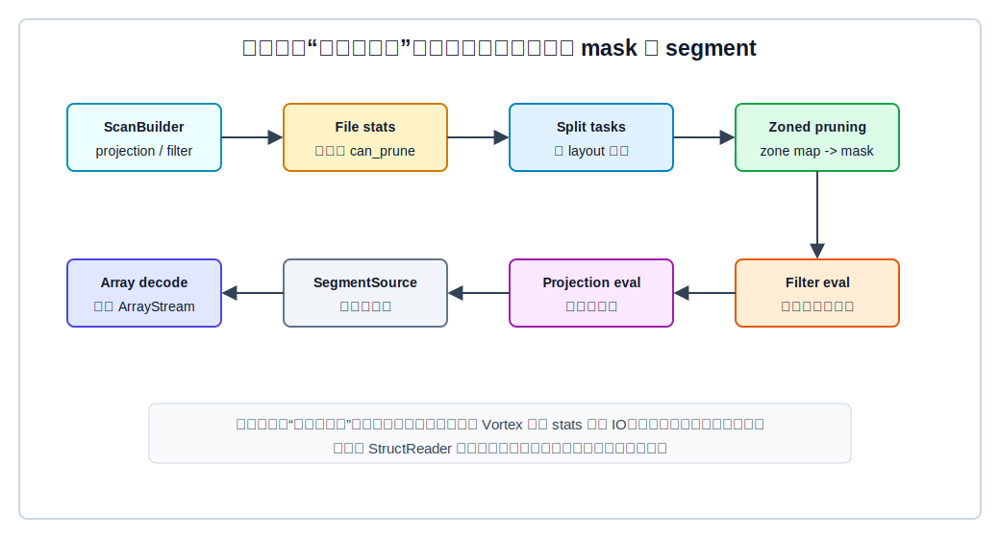

## 数据库筑基课 - 数据存储结构之 vortex

### 作者
digoal

### 日期
2026-06-01

### 标签
PostgreSQL , 应用开发者 , 数据库筑基课 , 列式存储 , 文件格式 , 编码压缩 , 向量化执行 , 对象存储    

----

## 背景


本文属于[应用开发者数据库筑基课大纲](../202409/20240914_01.md)里“表存储、列式文件、编码压缩、扫描执行与 IO/CPU 放大”这一类基础能力。

传统数据库讲“存储结构”，常从 heap page、row、block、index leaf 讲起。这适合解释 OLTP，但解释不了现代分析系统的另一个痛点：数据越来越多地放在对象存储或冷存储里，查询往往只扫少数列、少数 row group、少数统计上可能命中的区域。此时真正的成本不是“能不能读到一行”，而是：

- 能不能用一次较小的 footer 读取理解整个文件？
- 能不能只读需要的列，而不是整行？
- 能不能在解码前靠统计信息跳过不可能命中的数据块？
- 能不能在压缩比、CPU 解码、SIMD/向量化友好度、随机访问粒度之间做工程折中？

Vortex 就是在这个问题背景下出现的列式文件格式和数组处理工具。它的 README 把自己定位为“next-generation columnar file format and toolkit”，并强调逻辑类型与物理布局分离、可扩展编码、Arrow 兼容、统计信息和对象存储访问性能。本文不把 Vortex 简化成“又一个压缩算法”，而是把它当成一个完整的数据存储结构来看：`DType -> Array encoding -> Layout tree -> Segment -> Footer -> Scan`。

## 一、它解决什么问题？

Vortex 解决的核心问题是：分析型数据文件既要压得小，又要读得快，还要能在对象存储上做细粒度随机访问。

如果只追求压缩比，可以把整列用 Zstd 压成一个大块；但点查、过滤、投影会变差，因为读一小段数据也可能要搬很大的压缩块。如果只追求随机访问，可以把块切得很碎；但 footer、segment 数量、对象存储 IOPS、压缩率都会恶化。如果只追求 CPU 解码快，可能会牺牲压缩率；如果只追求复杂编码，可能会让扫描路径出现太多分支和不可预测控制流。

Vortex 的做法是把问题拆成三层：

1. 逻辑层：`DType`、字段、表达式、统计语义，回答“数据是什么”。
2. 物理编码层：Dictionary、RLE、FoR、BitPacking、FSST、ALP、Pco、Zstd 等，回答“这些值怎样存更合适”。
3. 文件布局层：`Layout` 树、`Segment`、`Footer`、`Postscript`，回答“查询时应该读哪些字节段”。



图 1 说明：Vortex 的关键不是某一个编码，而是把语义、编码和文件定位拆开。这样做的直接收益是：扫描器可以先根据 footer/layout/stats 判断读取边界，再让对应的 array encoding 解码或执行表达式。

代价也很明确：系统复杂度更高；写入端需要构造 layout 树和统计信息；读端需要正确注册 array/layout encoding；如果文件被切得太细，segment 和对象存储请求会成为新的瓶颈。

## 二、它是什么？

从数据库存储结构角度看，Vortex 是一种“递归 layout 描述的列式文件结构”。

更具体地说：

- `Array` 是内存中的逻辑数组接口，可以有不同物理编码。
- `DType` 描述逻辑类型，不直接绑定物理存法。
- `Layout` 描述文件内数据如何组织，例如 flat、struct、chunked、zoned、dict。
- `Segment` 是文件中一段连续字节，有 offset、length、alignment。
- `Footer` 位于文件尾部，记录 root layout、segment map、statistics、array/layout encoding context。
- `ScanBuilder` 接收 projection/filter/row range/selection，把读取拆成 split task，并通过 layout reader 执行剪枝、过滤和投影。

本地源码中几个关键入口：

- [vortex/README.md](../vortex/README.md)：项目定位、特性、研究来源、文件格式稳定性说明。
- [vortex/vortex-file/src/lib.rs](../vortex/vortex-file/src/lib.rs)：文件格式说明，包含 data、statistics、schema、layout、postscript、EOF。
- [vortex/vortex-file/src/footer/mod.rs](../vortex/vortex-file/src/footer/mod.rs)：`Footer` 保存 root layout、segment map、statistics、array read context。
- [vortex/vortex-layout/src/layout.rs](../vortex/vortex-layout/src/layout.rs)：`Layout` trait，定义 row count、dtype、children、metadata、segment ids、reader 创建。
- [vortex/vortex-btrblocks/src/lib.rs](../vortex/vortex-btrblocks/src/lib.rs)：BtrBlocks-inspired adaptive compression 框架。
- [vortex/vortex-scan/src/lib.rs](../vortex/vortex-scan/src/lib.rs)：扫描抽象，支持 projection、filter、limit、partition。

Vortex 不是数据库内核里的 MVCC heap，也不是 Parquet 的简单替代品。它更像一个可嵌入的数据文件和数组执行层：上层可以接 DataFusion、DuckDB、Spark、Pandas、Polars；下层可以面向文件系统、对象存储或内存 buffer。

## 三、核心原理

### 3.1 文件尾部自描述：先读尾部，再按需读数据

Vortex 文件的源码注释给出了文件格式顺序：data 先写，随后是 per-column statistics、schema flatbuffer、layout flatbuffer、postscript flatbuffer，最后是 8 字节 EOF。EOF 里包含版本、postscript 长度和 `VTXF` magic bytes。

打开文件时，`VortexOpenOptions::read_footer` 会先读文件尾部的一段 initial read。它解析 EOF 和 postscript；如果 layout/footer/schema 不在 initial read 里，再按 postscript 记录的 offset 追加读取。读出 footer 后，系统就知道每个 segment 的 offset、length 和 alignment，后续扫描不需要从头解析全文件。



图 2 说明：Vortex 的 footer 像“文件内导航图”。它不搬运真实数据，而是告诉 reader：有哪些 segment、layout 树怎样引用它们、需要哪些 array/layout encoding 才能解释这些字节。

这类尾部自描述结构特别适合对象存储：先做一次 range read 拿到尾部，再根据 projection/filter 触发后续 range read。缺点是 footer 过大、segment 太多、统计信息太重时，打开成本和元数据管理成本会上升。

### 3.2 Layout 树：把列、块、统计和编码组合起来

`Layout` trait 要求每个 layout 暴露：

- `row_count()`：这一层表示多少行。
- `dtype()`：这一层的逻辑类型。
- `nchildren()` / `child()` / `child_type()`：子 layout 和子节点语义。
- `segment_ids()`：这一层引用哪些 segment。
- `new_reader()`：如何生成读取器。

源码注释中提到几种典型 layout：

| Layout | 作用 | 读路径意义 |
|---|---|---|
| FlatLayout | 一个连续序列化数组，引用一个 segment | 叶子节点，真正触发字节读取和 array decode |
| StructLayout | struct 每个字段一个 child | 宽表投影时只访问必要字段 |
| ChunkedLayout | 按行块组织多个 child | 支持 row range、split、并行扫描 |
| ZonedLayout | 数据 child + stats child | 用 zone map 做谓词剪枝 |
| DictLayout | codes child + values child | 低基数列可短路径过滤或投影 |

Vortex 的文件结构不是固定死的“row group -> column chunk -> page”。源码注释说 layout 是 adaptive 的，writer 可以为了 locality 或 parallelism 构造复杂 layout。这一点和 Parquet 风格不同：Parquet 的层次更固定，Vortex 更像把 layout 作为可扩展的物理计划树。

### 3.3 默认写入策略：先为剪枝塑形，再压缩

`WriteStrategyBuilder::build()` 里能看到默认写入管线。按源码注释顺序，它大致做这些事：

1. `TableStrategy`：从表/struct 开始，把字段拆开。
2. `RepartitionStrategy`：按 `row_block_size` 切块，默认是 8192 行。
3. `ZonedStrategy`：为每个 row block 计算统计信息，形成 zone map。
4. `DictStrategy`：对合适字段应用字典布局或回退。
5. 再次 `RepartitionStrategy`：按约 1MB 目标组织 chunk/segment 粒度。
6. `CompressingStrategy`：使用 BtrBlocks-style compressor 压缩每个 chunk。
7. `BufferedStrategy`：让相近 chunk 的 segment id 和物理位置更接近。
8. `ChunkedLayoutStrategy` 和 `FlatLayoutStrategy`：最终写成 chunked/flat layout 和 segment。



图 3 说明：Vortex 写入端有两个重要粒度。8192 行附近的 zone 粒度服务于统计剪枝；约 1MB 的块粒度服务于对象存储随机读、并发读和压缩效率。这个设计不是“越小越好”，而是在 IO 请求数、压缩比、CPU 解码和并行度之间折中。

注意一个容易忽略的细节：默认数据 compressor 会排除 `IntDictScheme`，因为 `DictStrategy` 已经可能先做字典布局；如果压缩阶段再对 codes 做整数字典，可能重复编码。这说明 Vortex 的压缩不是孤立决策，而要和 layout 策略配合。

### 3.4 BtrBlocks-inspired compression：采样估计 + 级联编码

Vortex 的 `vortex-btrblocks` crate 明确说它是 BtrBlocks-inspired adaptive compression framework。它的核心不是固定使用某个算法，而是：

- 先把输入 array canonicalize/compact。
- 根据 canonical 类型找出匹配的 compression schemes。
- 合并各 scheme 需要的统计信息，避免重复扫描。
- 对不能便宜估计的 scheme，用约 1% sample 做压缩率估计。
- 选择预计压缩效果最好的 scheme。
- 允许 scheme 对子数组继续调用 compressor，形成级联编码，源码里 `MAX_CASCADE` 为 3。

默认 scheme 包括 bool constant、integer constant、FoR、ZigZag、BitPacking、Sparse、integer dictionary、RunEnd、Sequence、RLE、float ALP/ALPRD/dict/RLE、string dict/FSST/constant、binary dict/constant、decimal、temporal 等。启用特性后还可以加入 Zstd、Pco、TurboQuant。

和 BtrBlocks 论文的关系可以这样理解：BtrBlocks 强调面向内存优先列式系统的自适应压缩选择，而 Vortex 把这个思想落进可扩展 array encoding 体系中。本文没有复现实验数值，因此不引用论文中的性能数字，只引用其机制启发：按数据分布选择编码，而不是给每列套一个固定压缩器。

### 3.5 扫描路径：剪枝、过滤、投影分层执行

Vortex 的 scan 不是“读完整数组再过滤”。`ScanBuilder` 支持 `with_filter`、`with_projection`、row range、selection、split strategy、并发度。真正执行单个 split 时，`split_exec` 的源码注释说明了顺序：

1. 先把全局 row range 和 split row range 相交。
2. 如果有 filter，先做 expression-based pruning。
3. 对未剪掉的行执行真实 filter。
4. 把最终 mask 交给 reader 做 filtered projection。
5. 输出 ArrayStream。

`ZonedReader` 会根据 zone stats 构造 pruning mask；`FlatReader` 在需要时请求 segment、decode array，然后执行 filter/projection；`StructReader` 会把表达式按字段 partition，宽表投影时可以避免无关列读取。



图 4 说明：统计剪枝只能证明“这个 zone 不可能命中”，不能替代真实过滤。因此 Vortex 的正确路径是：先用 stats 降低 IO，再对剩余行执行完整表达式，最后按 projection 输出需要的数据。

这个设计和向量化执行论文中的 CPU 约束是一致的：高性能扫描不仅要减少 IO，还要减少不可预测分支、减少无效 SIMD lane、保持流水线和 cache 友好。Vortex 通过 columnar array、mask、chunk/split、encoding-specific compute，把这类问题放在 scan/layout/array 三层共同处理。

## 四、横向对比

| 维度 | Vortex | Parquet | Arrow IPC / Feather | 行存 heap page |
|---|---|---|---|---|
| 主要目标 | 对象存储友好的列式文件、可扩展 encoding/layout、快速扫描 | 通用列式分析文件、生态成熟 | 内存格式/交换格式，偏快速序列化 | OLTP 行级读写、事务更新 |
| 逻辑/物理分离 | 强，`DType`、Array encoding、Layout 分层 | 有 schema、encoding、page，但结构更固定 | 强调 Arrow 内存布局 | 通常 schema 与 page/tuple 紧耦合 |
| 列投影 | StructLayout 可按字段懒读 | column chunk 级投影成熟 | 可按列读取，但不是重点 | 读整行更自然 |
| 谓词剪枝 | file stats + zoned stats + pruning expression | row group/page stats、字典等 | 依赖外部索引或扫描 | 主要靠索引，不靠文件内 zone map |
| 压缩策略 | BtrBlocks-inspired adaptive/cascading schemes | 每列/页 encoding + compression codec | 通常较轻，交换效率优先 | 页内压缩不是核心路径 |
| 随机访问粒度 | segment/layout 可调，默认约 1MB 目标 | row group/page 粒度 | record batch 粒度 | page/tuple 粒度 |
| 写入复杂度 | 较高，要构造 layout、stats、segment map | 中等，生态工具成熟 | 较低 | 高，涉及 WAL/MVCC/索引 |
| 适合场景 | 云上分析、宽表、只读/追加式数据、嵌入式执行引擎 | 数据湖、BI、跨系统交换 | 内存交换、临时落盘 | 高并发事务、频繁更新 |
| 不适合场景 | 高频单行更新、强事务、多版本清理 | 超低延迟点查、频繁小更新 | 长期压缩存储、复杂剪枝 | 大宽表扫描、列投影分析 |

这张表的重点不是说 Vortex “全面替代”谁。Vortex 更像是在 Parquet 与 Arrow 之间增加一个更可编程的物理层：它保留 Arrow 兼容和 array 计算思路，又把文件 layout、segment、stats、encoding 作为可扩展对象暴露出来。代价是生态成熟度、工具数量、长期运维经验还不能简单等同于 Parquet。

## 五、效果如何？

项目 README 声称 Vortex 相比现代 Apache Parquet 可以实现更快随机访问、更快 scan、更快 write，并保持相近压缩比。但这些数字依赖版本、benchmark、硬件、对象存储、数据分布和查询形态，不能直接迁移到你的业务。

从机制上看，Vortex 的收益来源主要有五类：

1. IO 减少：footer/postscript 让 reader 先理解文件，再按需读 segment。
2. 列裁剪：StructLayout 让表达式按字段拆开，宽表查询少读无关列。
3. 行块剪枝：ZonedLayout 的 stats child 能产生 zone mask，跳过不可能命中的 zone。
4. 压缩适配：BtrBlocks-inspired compressor 根据数据分布选 scheme，并允许级联。
5. 执行友好：scan 用 mask、split、projection/filter 分层执行，降低无效解码和无效计算。

对应代价也有五类：

1. 写入 CPU 增加：采样、统计、repartition、压缩选择都要成本。
2. footer 和 stats 空间增加：尤其是列多、zone 多、统计项多时。
3. 小文件/小数据不划算：打开和布局管理开销可能超过收益。
4. 复杂编码有解码成本：压缩比和 CPU 时间要共同评估。
5. 生态依赖注册：读取端必须认识文件中使用的 array/layout encoding。

判断效果时，不要只看压缩比。应该同时看：

- 文件大小：原始 Arrow/Parquet/Vortex 对比。
- 打开成本：首次 tail read、footer parse、额外 metadata read。
- IO 请求数：对象存储 range request 数量和大小。
- 实际读取字节：过滤/投影后触发的 segment 字节。
- CPU 时间：decode、filter、projection、mask 构造。
- 端到端延迟：包含网络、调度、并发、下游计算。

## 六、实操 DEMO

下面是 Vortex 源码自带示例的最小路径，来自 [vortex/vortex/src/lib.rs](../vortex/vortex/src/lib.rs)。本文未在当前环境执行这些命令，因为任务目标是写文章，不是修改或验证 Vortex 工程构建；示例语法来自本地源码。

### 6.1 内存中压缩一个数组

```rust
use vortex::array::IntoArray;
use vortex::array::VortexSessionExecute;
use vortex::array::arrays::PrimitiveArray;
use vortex::array::validity::Validity;
use vortex::compressor::BtrBlocksCompressor;
use vortex::session::VortexSession;
use vortex_buffer::buffer;

let array = PrimitiveArray::new(buffer![42u64; 100_000], Validity::NonNullable);

let session = VortexSession::default();
let compressed = BtrBlocksCompressor::default().compress(
    &array.clone().into_array(),
    &mut session.create_execution_ctx(),
)?;

println!(
    "BtrBlocks size: {} / {}",
    compressed.nbytes(),
    array.into_array().nbytes()
);
```

这个例子验证的是：Vortex 可以在文件层之外，直接把 ArrayRef 交给 BtrBlocks-style compressor，让它选择更合适的编码。

### 6.2 写入 `.vortex` 文件并带过滤读取

```rust
use std::path::PathBuf;

use vortex::VortexSessionDefault;
use vortex::array::IntoArray;
use vortex::array::arrays::PrimitiveArray;
use vortex::array::stream::ArrayStreamExt;
use vortex::array::validity::Validity;
use vortex::expr::{gt, lit, root};
use vortex::file::{OpenOptionsSessionExt, WriteOptionsSessionExt};
use vortex::session::VortexSession;
use vortex_buffer::buffer;

let session = VortexSession::default();
let array = PrimitiveArray::new(buffer![0u64, 1, 2, 3, 4], Validity::NonNullable);
let path = PathBuf::from("example.vortex");

session
    .write_options()
    .write(
        &mut tokio::fs::File::create(&path).await?,
        array.into_array().to_array_stream(),
    )
    .await?;

let array = session
    .open_options()
    .open_path(path.clone())
    .await?
    .scan()?
    .with_filter(gt(root(), lit(2u64)))
    .into_array_stream()?
    .read_all()
    .await?;

assert_eq!(array.len(), 2);
```

这个例子验证的是：写入时走默认 layout/compression strategy；读取时通过 `scan().with_filter(...)` 走扫描路径。注意，`assert_eq!(array.len(), 2)` 是源码示例的断言，不是本文现场执行输出。

### 6.3 建议实验

如果你要在自己的环境验证 Vortex，建议不要只跑一个全表扫描。至少准备四类查询：

```text
1. 宽表只读 3/200 列：验证列投影和 segment 读取字节。
2. 高选择性过滤：验证 file stats / zone stats 剪枝效果。
3. 低基数字符串列：验证 dict / FSST / Zstd 等编码选择。
4. 顺序整数和时间戳：验证 FoR / Delta / BitPacking / Sequence 等编码选择。
```

同时记录 Vortex、Parquet、Arrow IPC 的文件大小、首次打开时间、range request 次数、读取字节数、CPU decode/filter 时间、端到端延迟。没有这些维度，单独报告“压缩比 x 倍”没有工程意义。

## 七、最佳实践

面向数据库架构师：

- 把 Vortex 放在分析型、只读或追加式数据路径里评估，不要把它当 OLTP heap 的替代物。
- 如果数据在 S3/OSS/COS 等对象存储上，重点评估 segment 粒度、footer 大小、range request 数量和并发读取。
- 如果上层引擎是 DataFusion、DuckDB、Spark，需要确认过滤、投影、limit、partition 能否真正下推到 Vortex scan。

面向 DBA / 平台工程师：

- 监控不应只看文件大小，还要看打开耗时、footer 读取字节、segment cache 命中、scan 实际读取字节、decode CPU。
- 对高基数、强随机字符串列，不要假设字典编码一定有效；看实际 encoding id、文件大小和 CPU。
- 对大量小文件，先治理文件数量和合并策略。再好的 footer 结构也救不了对象存储小请求风暴。

面向业务开发者：

- 查询尽量显式投影需要的列，不要 `SELECT *` 之后在应用层丢弃字段。
- 过滤条件尽量写成存储层可理解的简单谓词，例如列与常量比较、范围过滤、可拆 conjunct。
- 数据建模时把常用于过滤的字段保留为独立列，不要全部塞进 JSON/string blob；否则 zone stats 和列投影都帮不上忙。

## 八、适合与不适合场景

适合：

- 宽表分析，只访问少数列。
- 追加式事实表、日志、指标、事件流落盘。
- 数据放在对象存储，需要 range read 和并发 scan。
- 查询有明显过滤条件，zone/file stats 能排除大量块。
- 数据分布多样，需要按列自动选择 encoding。
- 嵌入式查询引擎、湖仓加速层、DataFusion/DuckDB 这类执行器集成。

不适合：

- 高频单行 insert/update/delete 的 OLTP 主存储。
- 强事务、MVCC、行锁、二级索引维护密集场景。
- 文件极小、一次查询几乎总读全量，footer/layout/stats 开销占比过高。
- 谓词总是复杂 UDF、正则或不可下推表达式，统计剪枝价值有限。
- 读取端无法控制 encoding 注册和版本兼容。
- 对生态成熟度要求高、必须使用所有现有 Parquet 工具链的场景。

## 九、常见坑

1. 把压缩比当唯一指标。

压缩比高不代表查询快。复杂编码可能增加 CPU，块太大可能增加无效 IO，块太小可能增加请求数。

2. 忽略 footer 和 stats 成本。

列很多、zone 很多、统计项很多时，metadata 也会成为成本。Vortex 的优势来自“metadata 换 IO”，但这个交换不是免费的。

3. 以为 zone pruning 等于 filter。

zone pruning 只能跳过不可能命中的 zone。可能命中的 zone 仍要执行真实过滤，否则结果不正确。

4. 对象存储上把 segment 切得太碎。

细粒度有利于少读数据，但对象存储请求有固定开销。默认策略约 1MB 目标就是在随机访问和 IOPS 之间折中。

5. 忽略数据排序。

如果常用过滤列的数据分布很散，zone stats 很难剪枝。按时间、租户、地区、状态等常用谓词组织数据，通常比换一个文件格式更有效。

6. 忽略 encoding 兼容。

Vortex 支持可扩展 encoding。写入端用了某些 feature-gated 或实验编码，读取端必须有对应注册和版本能力。

7. 拿 README 性能数字直接做容量规划。

项目 README 的性能数字是方向性信息。真实系统要用自己的数据、查询、硬件、对象存储和并发模型复测。

## 十、扩展问题

1. 如果你的查询 90% 都是按时间范围过滤，Vortex 的 zone size 应该更大还是更小？为什么？

2. 如果一列字符串是高基数 URL，字典、FSST、Zstd 哪类思路更可能有效？如何验证？

3. 如果对象存储每次 range request 固定延迟很高，segment 粒度应该如何调整？

4. 为什么统计剪枝只能做“不可能命中”的判断，而不能直接返回“命中行”？

5. Vortex 把 layout 做成可扩展树，而不是固定 Parquet 式层次，这对生态兼容和性能调优分别带来什么收益和成本？

6. BtrBlocks-style 采样估计如果遇到强倾斜数据，会出现什么误判？应该如何用 benchmark 和 telemetry 发现？

## 十一、扩展阅读

- Vortex README：[../vortex/README.md](../vortex/README.md)
- Vortex 本地工程说明：[../vortex/CLAUDE.md](../vortex/CLAUDE.md)
- Vortex 文件格式源码说明：[../vortex/vortex-file/src/lib.rs](../vortex/vortex-file/src/lib.rs)
- Vortex footer 实现：[../vortex/vortex-file/src/footer/mod.rs](../vortex/vortex-file/src/footer/mod.rs)
- Vortex 默认写入策略：[../vortex/vortex-file/src/strategy.rs](../vortex/vortex-file/src/strategy.rs)
- Vortex layout trait：[../vortex/vortex-layout/src/layout.rs](../vortex/vortex-layout/src/layout.rs)
- Vortex flat reader：[../vortex/vortex-layout/src/layouts/flat/reader.rs](../vortex/vortex-layout/src/layouts/flat/reader.rs)
- Vortex zoned reader/pruning：[../vortex/vortex-layout/src/layouts/zoned/reader.rs](../vortex/vortex-layout/src/layouts/zoned/reader.rs)、[../vortex/vortex-layout/src/layouts/zoned/pruning.rs](../vortex/vortex-layout/src/layouts/zoned/pruning.rs)
- Vortex scan task：[../vortex/vortex-layout/src/scan/tasks.rs](../vortex/vortex-layout/src/scan/tasks.rs)
- Vortex BtrBlocks-inspired compressor：[../vortex/vortex-btrblocks/src/lib.rs](../vortex/vortex-btrblocks/src/lib.rs)
- BtrBlocks: Efficient Columnar Compression for Memory-First Database Systems：[PDF](https://www.cs.cit.tum.de/fileadmin/w00cfj/dis/papers/btrblocks.pdf)
- Make the most out of your SIMD investments: counter control flow divergence in compiled query pipelines：[Springer](https://link.springer.com/article/10.1007/s00778-019-00547-y)
- MonetDB/X100: Hyper-Pipelining Query Execution：[CIDR 2005 PDF](https://www.cidrdb.org/cidr2005/papers/P19.pdf)
- DeepWiki: `vortex-data/vortex`，用于理解 Vortex 存储架构、文件 IO、layout、encoding 和 scan 关系；关键说法已回到本地源码核对。
  
## 附录 
1、询问 gemini
```
https://github.com/vortex-data/vortex 相关的论文
```

2、克隆代码  
```  
git clone --depth 1 https://github.com/vortex-data/vortex
```  
  
3、启用 codex, 使用 [数据库筑基课 skill](../skills/README.md).  
```
文章标题: 
  数据库筑基课 - 数据存储结构之 vortex
项目源码(本地目录): 
  vortex
项目 codebase 文件名: 
  vortex/CLAUDE.md 
相关论文: 
  BtrBlocks: Efficient Columnar Compression for Memory-First Database Systems
  Balancing Vectorization, Branch Prediction, and Pipelining
开源项目相关的 deepwiki repoName: 
  vortex-data/vortex
```

  
  
#### [PostgreSQL 解决方案集合](../201706/20170601_02.md "40cff096e9ed7122c512b35d8561d9c8")
  
  
#### [德哥 / digoal's Github - 公益是一辈子的事.](https://github.com/digoal/blog/blob/master/README.md "22709685feb7cab07d30f30387f0a9ae")
  
  
#### [About 德哥](https://github.com/digoal/blog/blob/master/me/readme.md "a37735981e7704886ffd590565582dd0")
  
  

  
