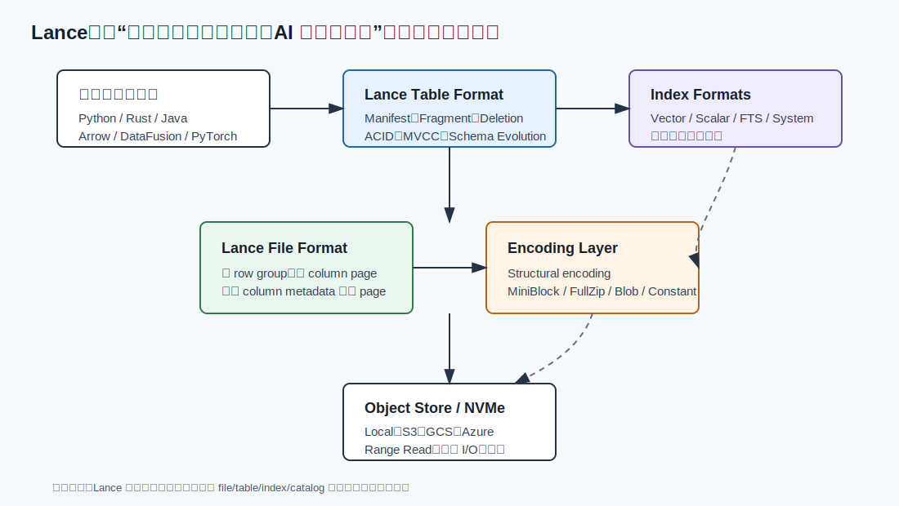
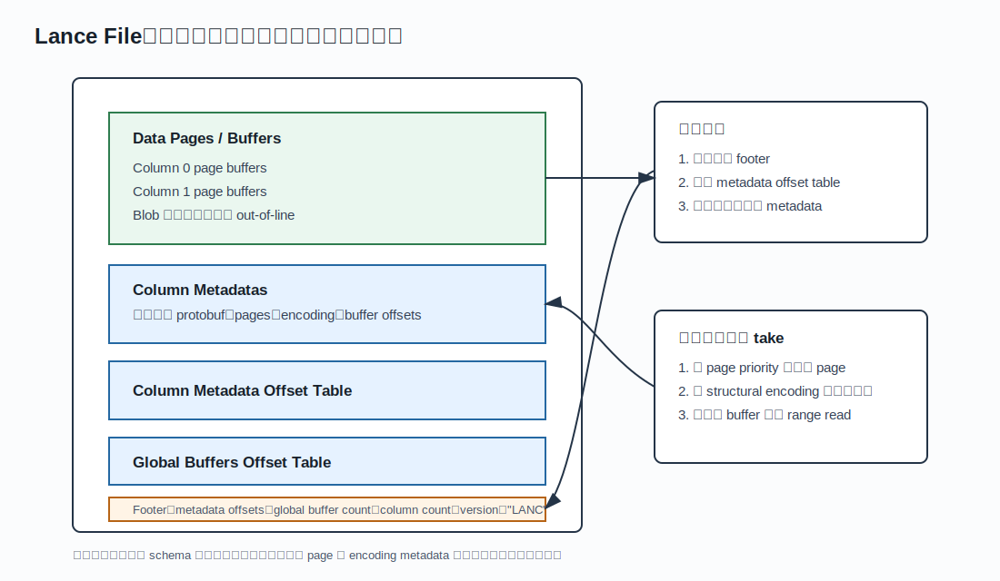
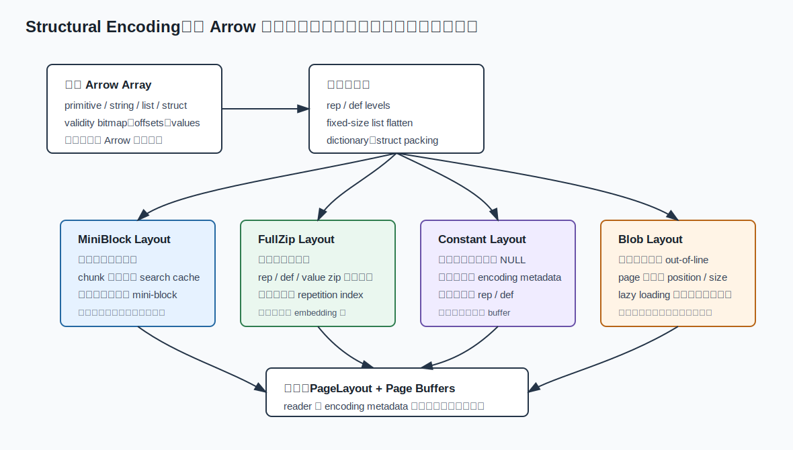
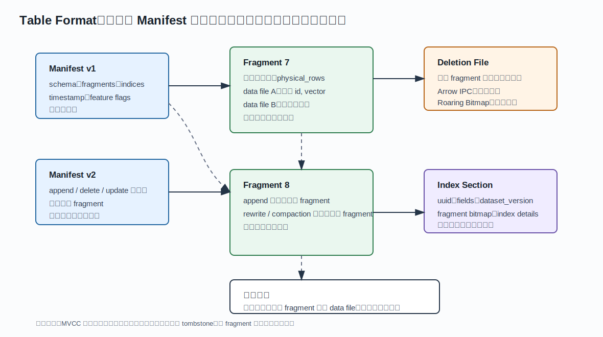
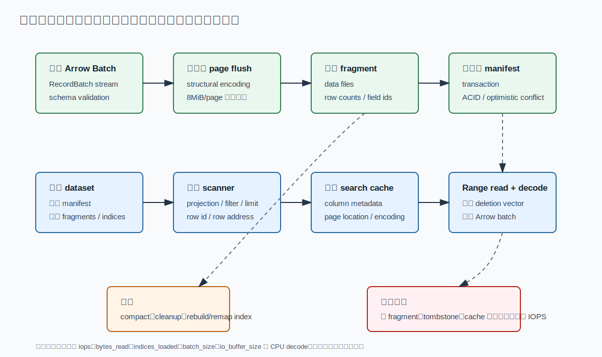

## 数据库筑基课 - 数据存储结构之 lance

### 作者
digoal

### 日期
2026-06-01

### 标签
PostgreSQL , 应用开发者 , 数据库筑基课 , 列式存储 , 文件格式 , 随机访问 , 向量检索 , 多模态数据    

----

## 背景
  


本文属于[应用开发者数据库筑基课大纲](../202409/20240914_01.md)里“表存储、列式文件、编码压缩、索引结构、扫描执行与对象存储”这一类基础能力。

传统列式文件最擅长的是大批量扫描：少读列、顺序读、压缩好、CPU 吞吐高。但 AI 和多模态工作负载把问题变复杂了：

- 向量检索先通过 ANN 找到少量 row id，随后要随机回表取文本、图片路径、embedding、metadata。
- 训练或评估可能按样本随机读取，而不是从头到尾顺序扫。
- 数据会持续追加 embedding、caption、特征列、质量分、模型版本等派生列。
- 对象存储便宜，但 range request、并发、缓存、元数据打开成本会变成主要瓶颈。
- 图片、音频、视频、长文本这类 blob 不应该在每次 metadata 扫描时被搬出来。

Lance 正是在这个背景下出现的存储格式。它不是“Parquet 加一个向量索引”，而是一套可组合的存储栈：文件层解决随机访问友好的列式 page 和 structural encoding；表层解决 manifest、fragment、deletion、schema evolution、ACID/MVCC；索引层把 vector、scalar、full-text、system index 作为一等对象纳入表版本生命周期。



图 1 说明：Lance 的关键设计是分层。file format 不背负事务和索引语义；table format 不绑定某一种搜索结构；index format 也不必塞进每个数据文件。这个拆分来自 LanceDB composability 论文强调的思路：存储层应该像 Arrow 在内存层那样可复用，而不是把格式、表、索引、数据库前端紧耦合在一起。

## 一、它解决什么问题？

Lance 解决的核心问题是：在同一份数据上同时支持列式扫描、随机回表、向量/全文/标量搜索、多模态 blob、持续追加和轻量数据演进。

用一个 RAG 或多模态训练数据集举例。表里可能有：

- `id`：业务主键。
- `text`：文档片段。
- `embedding`：固定长度向量。
- `image`：图片或图片 blob 引用。
- `source`、`lang`、`created_at`：过滤字段。
- `rerank_score`、`model_version`：后续补充的特征列。

如果只用行存，扫描和压缩会差。如果只用传统列式文件，ANN 命中后的随机回表、嵌套/list/struct 定位、大 blob lazy loading、频繁增加特征列都会比较别扭。如果把所有能力都塞进一个数据库内核，又会牺牲数据湖和嵌入式生态的可组合性。

Lance 的做法是把问题拆开：

1. 文件层：每列由较大的 disk page 组成，不使用 Parquet 风格 row group；文件尾部记录 column metadata、page offset、encoding。
2. 编码层：用 structural encoding 表达 list、struct、validity、offset 等结构信息，让 reader 能按 row range 或 row index 定位必要字节。
3. 表层：用 immutable manifest 描述一个版本的 schema、fragments、indices、deletion files。
4. 数据演进：fragment 可以有多个 data file，每个 data file 只覆盖部分列；新增列可以追加列文件，而不是重写整表。
5. 索引层：vector、scalar、full-text、zone map、fragment reuse 等索引作为独立格式和表版本协调。

代价也直接：格式和实现复杂度高于简单 Parquet 文件；写入端要处理 fragment、manifest、事务、索引覆盖范围；更新删除会积累 deletion vector 和小文件；随机访问性能高度依赖 page/mini-block/search cache/object-store 并发配置。

## 二、它是什么？

从数据库存储结构角度看，Lance 是“面向随机访问的 Arrow 原生列式文件 + 支持 MVCC 的表格式 + 一等索引生命周期”的组合。

几个核心术语：

| 术语 | 含义 | 代码或规范入口 |
|---|---|---|
| Lance file | 存放列数据的底层文件容器，关注 page、buffer、column metadata、footer | [lance/protos/file2.proto](../lance/protos/file2.proto)，[lance/rust/lance-file/src/reader.rs](../lance/rust/lance-file/src/reader.rs)，[lance/rust/lance-file/src/writer.rs](../lance/rust/lance-file/src/writer.rs) |
| Structural encoding | 把 Arrow 的 validity、offset、list、struct 等结构编码进可随机定位的 page layout | [lance/protos/encodings_v2_1.proto](../lance/protos/encodings_v2_1.proto)，[lance/docs/src/format/file/encoding.md](../lance/docs/src/format/file/encoding.md) |
| Manifest | 一个表版本的不可变快照，记录 schema、fragments、indices、version、timestamp、feature flags | [lance/protos/table.proto](../lance/protos/table.proto)，[lance/rust/lance-table/src/format/manifest.rs](../lance/rust/lance-table/src/format/manifest.rs) |
| Fragment | 表的水平行分片，包含一个或多个 data file，以及可选 deletion file | [lance/docs/src/format/table/index.md](../lance/docs/src/format/table/index.md)，[lance/rust/lance-table/src/format/fragment.rs](../lance/rust/lance-table/src/format/fragment.rs) |
| Data file | fragment 内的列数据文件，可只覆盖部分字段 | [lance/protos/table.proto](../lance/protos/table.proto) |
| Deletion file | 删除向量，不原地改写 data file；稀疏删除用 Arrow IPC，密集删除用 Roaring Bitmap | [lance/docs/src/format/table/index.md](../lance/docs/src/format/table/index.md) |
| Search cache | reader 初始化时加载 page location、encoding、索引信息，用于随机访问定位 | [lance/docs/src/format/file/encoding.md](../lance/docs/src/format/file/encoding.md) |

Lance 不是完整 OLTP 数据库内核。它没有把锁管理、SQL 优化器、WAL、buffer pool、secondary index 全部放进一个单体系统。它更像一个可嵌入的数据湖存储层：上层可以是 LanceDB、DataFusion、Python dataset API、训练框架或自定义检索服务；下层可以是本地盘、NVMe cache、S3/GCS/Azure 对象存储。

## 三、核心原理

### 3.1 文件层：没有 row group，只有 column pages

Lance file format 的规范明确说，文件层是一个最小列式容器：每个文件有若干 column，每个 column 有若干 page；不同 column 可以有不同 page 数量；page 内部有 buffer offsets、buffer sizes、length、encoding、priority。文件格式本身没有 schema 和类型系统，类型解释交给 encoding 和更上层表格式。



图 2 说明：Lance 把数据 buffer 写在前面，把 column metadata、metadata offset table、global buffer offset table 和固定 footer 放在尾部。reader 打开文件时先从尾部读 footer，再按需加载目标列的 metadata，最后根据 page priority 和 encoding 定位需要的 range。

这里和 Parquet 的核心差异是：Lance 不使用 row group 作为列 chunk 的共同切分边界。row group 的好处是模型简单、生态成熟；坏处是宽表和云存储场景下，row group 太小会产生小 page 和请求放大，row group 太大又会增加 writer 内存和扫描切分刚性。Lance 的判断是：split 读任务不应该被物理 row group 绑死；只要 page 能支持部分读取，就可以按任意 row boundary 做任务划分。

源码和规范里还有几个重要细节：

- page 建议足够大，规范里给出“至少 8MB 或更大”的方向，目的是让每次 I/O 请求值得发起。
- writer 里 `FileWriterOptions::data_cache_bytes` 默认思路是按列缓存出较大 page；`max_page_bytes` 是 hint，不总能严格遵守。
- page buffer 常按 64 字节对齐，利于 SIMD 或 direct I/O 场景。
- column metadata 是每列独立 protobuf，所以投影少数列时不必总是加载全部列元数据。
- global buffers 可放辅助元数据，但 file format 不把 table-level stats 或索引强塞进基础文件层。

### 3.2 结构编码：随机访问的关键不是“压缩值”，而是“定位结构”

论文《Lance: Efficient Random Access in Columnar Storage through Adaptive Structural Encodings》的核心观点是：列式格式的随机访问瓶颈不只在值压缩，还在结构信息怎么编码。Arrow 的 list/struct/null 由 validity bitmap、offsets、child arrays 表达；这对内存计算很好，但落到磁盘随机读时，可能需要多次 I/O 才能定位一行嵌套值。

Lance 2.1 的 encoding 规范把编码拆成两类：

- structural encodings：负责 list、struct、validity、offset 等结构，通常使用 repetition/definition levels。
- compressive encodings：负责实际值的压缩，例如 bit packing、dictionary、FSST、Zstd 等。

这样做的工程意义是：I/O 调度复杂度被结构层吸收，压缩库不必理解所有嵌套类型和随机访问语义。



图 3 说明：Lance 不是给所有列套同一种 page layout。小值走 MiniBlock，较大值走 FullZip，整页同值走 Constant，大 blob 走 Blob。选择不同 layout 的根本原因是：不同值宽度下，随机访问放大、search cache 内存、扫描吞吐和请求次数的最优点不一样。

几个 layout 的取舍：

| Layout | 适合数据 | 随机访问方式 | 主要代价 |
|---|---|---|---|
| MiniBlock | 整数、浮点、布尔、小字符串等较小值 | page 内再切 mini-block，初始化时把小型 lookup 放入 search cache | 读一个值至少读一个 mini-block；metadata/cache 有开销 |
| FullZip | 向量 embedding、较大定宽/变宽值 | rep/def/value zip 到同一数据流；变宽或重复结构常需 repetition index | 某些随机读需要先读 index 再读 data；压缩算法需透明 |
| Constant | 整页同一标量或全 NULL | 值可内联在 encoding metadata；必要时仍保留 rep/def | 只适合高度重复或全空 page |
| Blob | 大图片、音频、视频、长二进制 | page 保存 position/size，真实 blob out-of-line lazy loading | 点读大对象可能就是一次独立 I/O；不适合小值滥用 |

这就是“adaptive structural encodings”的含义：不是自适应选择一个压缩 codec，而是按数据宽度和结构选择磁盘布局。论文摘要里提到，Lance 通过基于数据宽度在两类结构编码之间切换，目标是在随机访问上更好，同时不牺牲扫描性能和 RAM 利用率。这里的“更好”不能脱离论文实验条件，尤其是 NVMe-backed storage、缓存和数据类型。

### 3.3 表层：Manifest + Fragment + DataFile 组成版本化快照

Lance table format 把一个 dataset 组织成多个不可变版本。每个版本由 manifest 描述；manifest 包含 schema、fragment 列表、index section、timestamp、feature flags、writer version、transaction 信息等。

fragment 是水平分片：一个 fragment 覆盖一批行。每个 fragment 可以有多个 data file，每个 data file 覆盖部分字段。这是 Lance 支持 AI 特征工程的关键：后加列、回填 embedding、更新派生特征时，可以给现有 fragment 追加一个列文件，而不是把所有列全部重写。



图 4 说明：manifest 是版本快照；fragment 是行分片；data file 是列集合；deletion file 是 tombstone。append 会新增 fragment；delete 会给 fragment 挂 deletion file；add column/backfill 可以追加 data file；commit 发布新 manifest。旧版本不被原地改写，因此支持 time travel 和 MVCC。

这个模型带来三个重要收益：

1. 追加写简单：新数据写成新 fragment，新 manifest 指向它。
2. 数据演进便宜：新增列不必重写整表，可以按 fragment 追加列文件。
3. 索引协调清晰：index metadata 记录 index uuid、字段、构建时 dataset version、覆盖 fragment bitmap、index details。

代价也同样明显：

1. 频繁小批写会产生很多小 fragment，扫描调度和元数据开销上升。
2. delete/update 不原地改写，会积累 deletion vectors；读路径必须过滤 tombstone。
3. compaction 会重写 fragment，可能改变 row address，索引需要 remap 或借助 Fragment Reuse Index。
4. 多 writer 并发提交依赖乐观冲突检测；冲突重试会重复已经做过的写入或索引工作。

### 3.4 删除、更新与 compaction：快写入背后的清理账

Lance 删除行时不是把 data file 里的行物理删除，而是在 fragment 上记录 deletion file。规范里说明 deletion file 有两种格式：

- `.arrow`：存储 deleted row offsets 的 flat Int32Array，适合稀疏删除。
- `.bin`：Roaring Bitmap，适合密集删除。

这让 delete 很快，也避免立即让依赖旧 row address 的索引失效。但 DBA 必须意识到：tombstone 只是把成本推迟到读路径和维护路径。

update 通常可理解为 delete + insert 或局部 rewrite。merge insert 这类操作会匹配已有数据并插入/更新结果，适合批量 upsert，但会改变行位置和顺序。compaction 则把碎片、删除、过小文件整理掉。Lance performance guide 提到，compaction 是昂贵写操作，因为它会重写 data files，并且默认需要 remap indices；Fragment Reuse Index 可以把 index remap 推迟到 index load 时做，降低 compaction 与 index building 的冲突。

这和传统数据库里的 VACUUM/compaction 逻辑类似：前台写入通过 append/tombstone 变快，后台维护负责把版本、碎片、删除向量和索引映射整理回健康状态。

### 3.5 读路径：manifest 定版本，search cache 定 page，encoding 定字节

读 Lance 数据通常分三层定位：

1. 表层定位：打开 dataset，读取对应版本 manifest，确定 schema、fragment、deletion、index。
2. 文件层定位：对需要的 data file 读取 footer/column metadata，建立或复用 search cache。
3. 编码层定位：根据 row range、take indices、page priority、PageLayout、mini-block/repetition index 计算要读的字节范围。



图 5 说明：Lance 的读写优化目标不是“永远顺序读全文件”，而是先用元数据和索引把范围缩小，再对必要 page/buffer 发起 range read，最后 decode 成 Arrow batch。对于 ANN 检索，典型路径是：vector index 找候选 row address，Lance file 随机回表取少数列，deletion vector 过滤已删除行。

性能观测时，不能只看文件大小。更应该看：

- `iops`：一次查询发了多少对象存储或本地 I/O 请求。
- `bytes_read`：实际搬了多少字节。
- `indices_loaded`、`parts_loaded`：是否频繁加载索引分区。
- metadata cache/search cache 命中率：随机读是否反复初始化。
- `batch_size` 和 `io_buffer_size`：扫描内存和并发是否合适。
- CPU decode 时间：压缩比高不等于端到端快。

## 四、横向对比

| 维度 | Lance | Parquet | Iceberg / Delta / Hudi | Arrow IPC / Feather | 行存数据库 heap |
|---|---|---|---|---|---|
| 主要目标 | AI/多模态数据的列式扫描 + 随机回表 + 表版本 + 索引 | 通用分析型列式文件 | 表格式、事务、快照、数据湖管理 | 内存交换和快速序列化 | OLTP 行级读写和事务 |
| 文件切分 | column pages，无 Parquet 式 row group | row group -> column chunk -> page | 通常管理 Parquet/ORC/Avro 等文件 | record batch/file stream | page/block + tuple |
| 随机访问 | structural encoding 和 search cache 是核心路径 | 可以优化，但默认配置常偏扫描 | 依赖底层文件格式和引擎 | 可按 batch/列读，不是核心目标 | 行定位天然强 |
| 列投影 | data file 可覆盖部分列；column metadata 可按需读 | 成熟稳定 | 由底层文件决定 | 支持列选择 | 行存投影不经济 |
| 数据演进 | fragment 可追加列文件，适合特征回填 | schema evolution 依赖表层或重写策略 | 强项，表级 schema/partition/version 管理成熟 | 弱 | DDL/MVCC 成熟但重写成本视实现 |
| 删除更新 | deletion file + 新版本；需要 compaction | 文件级重写或表格式删除文件 | delete files / log / MOR/COW 等 | 弱 | 原地或 MVCC 更新成熟 |
| 索引 | vector/scalar/full-text/system index 是表对象 | 通常靠外部引擎或统计信息 | 表格式可记录元数据，具体索引依实现 | 外部处理 | B-tree/GiST/GIN 等成熟 |
| 多模态 blob | Blob layout 和 lazy loading 是重点 | 可存 binary，但随机/lazy 不是核心设计 | 取决于底层格式 | 可存，但非长期湖格式重点 | TOAST/LOB 等，事务强但湖生态弱 |
| 生态成熟度 | 成长中，AI/RAG 场景强 | 非常成熟 | 非常成熟 | 成熟 | 非常成熟 |
| 不适合 | 高频小事务、复杂强一致 OLTP、无维护预算的小批乱写 | 大量随机点取、多模态回表 | 需要极细粒度随机回表的单文件内布局 | 长期压缩湖存储 | 大宽表扫描、低成本对象存储湖 |

公平地说，Lance 不应该被理解成“替代 Parquet/Iceberg/PostgreSQL”。它更像填补一个空档：当你的数据湖开始承载向量检索、多模态样本、训练随机采样和特征迭代时，传统“只为顺序扫描优化”的列式文件会暴露随机访问短板；而完整数据库又可能太重、太绑定内核。Lance 把 file/table/index 拆开，试图在这两个极端之间给出一个可组合存储层。

## 五、效果如何？

Lance 项目 README 宣称对随机访问、向量搜索、多模态数据、feature engineering 有明显优势，并提到随机访问可比 Parquet/Iceberg 快很多。论文《Lance: Efficient Random Access in Columnar Storage through Adaptive Structural Encodings》更谨慎地讨论了前提：在 NVMe-backed storage 和特定实验设置下，列式格式的随机访问性能高度受 structural encoding 影响；Parquet 正确调参也能大幅改善随机访问，但会带来扫描性能和 RAM 方面的权衡；Lance 的 adaptive structural encoding 目标是在随机访问、扫描和内存之间取得更稳的平衡。

从机制上看，Lance 的收益来源主要有六类：

1. 随机回表少读字节：通过 page metadata、search cache、mini-block/fullzip 定位 row range 或 take indices。
2. 宽表投影少读列：column metadata、data file 字段覆盖、fragment 内多文件设计降低无关列读取。
3. 多模态 lazy loading：blob out-of-line，扫描 metadata 时不搬大对象。
4. 数据演进少重写：新增特征列、embedding 版本、质量分可按 fragment 追加列文件。
5. 索引和数据版本一致：index metadata 记录 dataset_version 和 fragment_bitmap，便于判断覆盖范围。
6. 对象存储友好：异步 I/O、range read、并行线程池、AIMD throttle、metadata/index cache 都围绕云存储现实成本设计。

对应的代价：

1. 写路径更复杂：batch、page、fragment、manifest、transaction、index coverage 都要正确维护。
2. 元数据变重要：manifest、column metadata、search cache、index metadata 打开成本不可忽略。
3. 小批写会伤害布局：fragment 太多、data file 太小、deletion vector 太多会拖慢扫描。
4. 更新删除不是免费：tombstone 推迟了物理清理，最终仍要 compact 和 remap/reuse index。
5. 生态仍在成长：和 Parquet/Iceberg 这种事实标准相比，跨引擎工具链和长期运维经验少一些。

所以评估 Lance 不要问“它是不是一定比 Parquet 快”。更好的问题是：

- 我的 workload 是顺序扫为主，还是 ANN 后随机回表为主？
- embedding、图片、文本、metadata 是否经常一起存取？
- 是否经常追加新特征列，而不想重写旧列？
- 是否需要把 vector/scalar/full-text index 和数据版本一起管理？
- 是否有后台维护窗口处理 compaction、cleanup、index rebuild？

如果答案偏向随机回表、多模态、特征演进、检索后取样本，那么 Lance 的设计更容易发挥价值。

## 六、实操 DEMO

下面示例来自 Lance 官方 Python API 风格和本地文档/测试路径。当前任务是写文章，没有在本环境安装并执行 `pylance`，因此示例标记为“未执行”。它们用于说明验证路径，不提供伪造执行输出。

### 6.1 写入、追加、版本查看

```python
from pathlib import Path

import lance
import pyarrow as pa

base = Path("/tmp/lance_demo.lance")

table = pa.table({
    "id": [1, 2, 3],
    "text": ["pg vector", "lance format", "duckdb scan"],
    "embedding": [
        [0.1, 0.2, 0.3, 0.4],
        [0.2, 0.1, 0.0, 0.5],
        [0.9, 0.1, 0.2, 0.2],
    ],
})

ds = lance.write_dataset(table, base, mode="overwrite")

more = pa.table({
    "id": [4],
    "text": ["new feature row"],
    "embedding": [[0.3, 0.3, 0.3, 0.3]],
})

ds = lance.write_dataset(more, base, mode="append")
versions = lance.dataset(base).versions()
```

验证点：append 不应该改写旧版本的数据文件，而是创建新版本 manifest，并让新 fragment 加入当前快照。

### 6.2 投影、过滤与随机 take

```python
import lance

ds = lance.dataset("/tmp/lance_demo.lance")

# 只读取少数列，验证列投影路径
projected = ds.to_table(columns=["id", "text"], filter="id >= 2")

# 模拟 ANN 或采样之后的随机回表
sample = ds.take([0, 3], columns=["id", "text"])

# 查看执行计划或分析信息，定位 projection/filter 是否进入 scanner
plan = ds.scanner(columns=["id"], filter="id >= 2").explain_plan(verbose=True)
```

验证点：真正要看的不是 Python API 返回了什么，而是 scanner plan、执行统计、对象存储 I/O 和读取字节是否符合预期。

### 6.3 删除、compaction 与清理

```python
from datetime import timedelta

import lance

ds = lance.dataset("/tmp/lance_demo.lance")

# 删除通常先形成 deletion file，而不是原地改写 data file
ds.delete("id = 2")

# 小 fragment 或删除向量积累后，需要维护
ds = lance.dataset("/tmp/lance_demo.lance")
ds.optimize.compact_files()

# 根据保留策略清理旧版本。生产环境要先确认 time travel 和回滚需求。
ds.cleanup_old_versions(older_than=timedelta(days=7))
```

验证点：删除后当前版本不返回被删行；旧版本是否还能访问取决于版本保留；compaction 是否触发索引 remap 或 FRI，要结合索引和配置观察。

### 6.4 建索引后的典型检索路径

```python
import lance

ds = lance.dataset("/tmp/lance_demo.lance")

# 具体 index_type、metric、参数随版本和 API 变化，生产代码应以当前官方文档为准。
ds.create_index("embedding", index_type="IVF_PQ", metric="cosine")

query = [0.1, 0.2, 0.3, 0.4]
result = (
    ds.scanner(nearest={"column": "embedding", "q": query, "k": 10})
      .project(["id", "text"])
      .to_table()
)
```

验证点：向量索引只解决“候选在哪里”，Lance file 的随机访问负责“把候选行的目标列取回来”。如果回表列很多、blob 很大、cache 冷、对象存储延迟高，端到端仍可能慢。

## 七、最佳实践

### 面向数据库架构师

把 Lance 放在“AI 数据湖/检索存储层”的位置，而不是硬套成 OLTP 主库。适合把 embedding、文本、多模态 blob、样本 metadata、离线特征、检索索引放在一起管理；不适合替代订单、账户、库存这类强事务频繁更新主表。

设计表时先按 workload 划分：

- 检索后回表：把常回表字段和 embedding 建模清楚，避免每次带出大 blob。
- 训练采样：关注 random take、batch_size、并发和本地 NVMe cache。
- 特征迭代：预留新增列和回填流程，用 fragment 追加列文件降低重写成本。
- 数据保留：明确旧版本保留周期、cleanup 策略和回滚窗口。

### 面向 DBA / 数据平台工程师

重点监控四类健康指标：

- fragment 数量和大小：小 fragment 多说明写入批次太碎或 compaction 不足。
- deletion vector 比例：删除多但不 compact 会增加读路径过滤成本。
- index 覆盖范围：index metadata 的 fragment bitmap 是否覆盖当前版本主要数据。
- I/O 与缓存：metadata cache、index cache、search cache 是否频繁冷启动。

Lance performance guide 里提到两个线程池：I/O 线程池负责读写对象存储，compute 线程池负责 decode/filter/compute。云对象存储默认并发较保守，必要时调 `LANCE_IO_THREADS`、`io_buffer_size`、`batch_size`，但要同时看内存上限。盲目加并发可能把问题从吞吐不足变成对象存储 throttle 或内存压力。

### 面向业务开发者

不要把 Lance 当成“随便 append 小 JSON”的目录。更稳的做法是：

- 批量写入，避免每条数据一个 fragment。
- 查询时显式投影列，不要默认把 blob、长文本、embedding 全取出。
- 对过滤字段建立合适的 scalar index 或让上层查询能利用统计/索引。
- 对向量检索结果只回表需要的字段，图片/音频等大对象延迟加载。
- 更新一批行时优先 merge insert，而不是循环逐行 update。

## 八、适合与不适合场景

适合：

- RAG、语义搜索、推荐召回、图文检索等“向量搜索 + 回表取 metadata”的场景。
- embedding、文本、图片、音频、视频、结构化属性混合存储的数据集。
- 训练/评估随机采样频繁，顺序扫描不是唯一访问方式的数据湖。
- 特征工程迭代快，需要追加列、回填列、保留版本的数据集。
- 希望 storage format、table format、index、catalog/frontend 可组合演进的系统。

不适合：

- 高频单行事务、强一致更新、复杂约束、行级锁竞争明显的 OLTP。
- 数据量很小、一次性读写、没有随机访问或索引需求的简单任务。
- 只做稳定 BI 顺序扫描，且已有 Parquet/Iceberg 生态完全满足需求的场景。
- 没有 compaction、cleanup、index 维护预算的持续小批写系统。
- 需要所有工具都已像 Parquet 一样成熟、跨引擎支持无差别的保守环境。

## 九、常见坑

1. 把 README 性能数字直接搬到生产预期。随机访问优势依赖数据宽度、page/layout、缓存、NVMe/对象存储延迟、查询形态，必须用自己的 workload 测。

2. 每次写很小 batch。结果是 fragment/data file 太碎，manifest 和调度成本上升。应尽量批量写入，并定期 compact。

3. 删除很多但不 compact。deletion vector 会让读路径持续过滤 tombstone；长期看需要物理整理。

4. 回表时不做列投影。ANN 命中 100 行，如果把 embedding、大 blob、长文本全部取出，随机访问优势会被无效字节吃掉。

5. 只建向量索引，不处理标量过滤。实际检索常有 `tenant_id`、`lang`、`time`、`doc_type` 等过滤条件；需要考虑 scalar index、prefilter/postfilter 和索引覆盖范围。

6. 忽略版本清理。MVCC 和 time travel 不是免费存储；旧 manifest、旧 fragment、旧 index 文件都要有保留策略。

7. 把 row address 当成永久业务 id。compaction/rewrite 可能改变物理地址；业务身份应使用稳定主键或 stable row id 语义。

8. 在对象存储上盲目提高并发。并发不足会慢，并发过高会触发 throttle 或放大内存。要结合 `iops`、`bytes_read`、429/503、内存和端到端延迟调。

## 十、扩展问题

1. 如果你的 workload 只有全表扫描，Lance 的无 row group 设计相比 Parquet 能带来什么收益？又会失去哪些生态优势？

2. MiniBlock 和 FullZip 的分界本质上是在优化什么？如果向量维度从 128 增加到 4096，随机访问路径会发生什么变化？

3. Fragment 既是并行 I/O 单位，也是版本化 mutation 单位。fragment 太大和太小分别会带来什么问题？

4. deletion file 类似数据库里的 tombstone。什么时候应该保留 tombstone，什么时候应该 compact 成新 data file？

5. 如果一个向量索引只覆盖旧版本 fragment，新追加 fragment 如何参与查询？系统应该选择 brute force、增量索引，还是后台 rebuild？

6. Lance 的 composability 思路能否迁移到 PostgreSQL 外部表、DuckDB 扩展或自研湖仓引擎？边界在哪里？

## 十一、扩展阅读

- Lance 项目源码：[lance-format/lance](https://github.com/lance-format/lance)
- 本地项目说明：[lance/CLAUDE.md](../lance/CLAUDE.md)
- Lance file format specification：[https://lance.org/format/file/](https://lance.org/format/file/)
- Lance encoding strategy specification：[https://lance.org/format/file/encoding/](https://lance.org/format/file/encoding/)
- Lance table format specification：[https://lance.org/format/table/](https://lance.org/format/table/)
- Lance performance guide：[lance/docs/src/guide/performance.md](../lance/docs/src/guide/performance.md)
- 论文：Weston Pace 等，Lance: Efficient Random Access in Columnar Storage through Adaptive Structural Encodings，arXiv:2504.15247，2025：[https://arxiv.org/abs/2504.15247](https://arxiv.org/abs/2504.15247)
- 论文：Weston Pace 等，LanceDB - Embracing Composability in the Storage Layer，VLDB 2025 Workshop：[https://www.vldb.org/2025/Workshops/VLDB-Workshops-2025/CDMS/CDMS25_15.pdf](https://www.vldb.org/2025/Workshops/VLDB-Workshops-2025/CDMS/CDMS25_15.pdf)
- DeepWiki 架构问答：lance-format/lance，主题包括 fragments、data files、pages、structural encodings、manifest/versioning、deletions、indices、read/write paths。
  
## 附录 
1、询问 gemini
```
https://github.com/lance-format/lance 相关的论文
```

2、克隆代码  
```  
git clone --depth 1 https://github.com/lance-format/lance
```  
  
3、启用 codex, 使用 [数据库筑基课 skill](../skills/README.md).  
```
文章标题: 
  数据库筑基课 - 数据存储结构之 lance
项目源码(本地目录): 
  lance
项目 codebase 文件名: 
  lance/CLAUDE.md 
相关论文: 
  Lance: Efficient Random Access in Columnar Storage through Adaptive Structural Encodings
  LanceDB - Embracing Composability in the Storage Layer
开源项目相关的 deepwiki repoName: 
  lance-format/lance
```

   
  
#### [PostgreSQL 解决方案集合](../201706/20170601_02.md "40cff096e9ed7122c512b35d8561d9c8")
  
  
#### [德哥 / digoal's Github - 公益是一辈子的事.](https://github.com/digoal/blog/blob/master/README.md "22709685feb7cab07d30f30387f0a9ae")
  
  
#### [About 德哥](https://github.com/digoal/blog/blob/master/me/readme.md "a37735981e7704886ffd590565582dd0")
  
  

  
