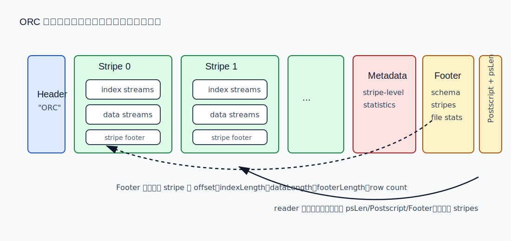
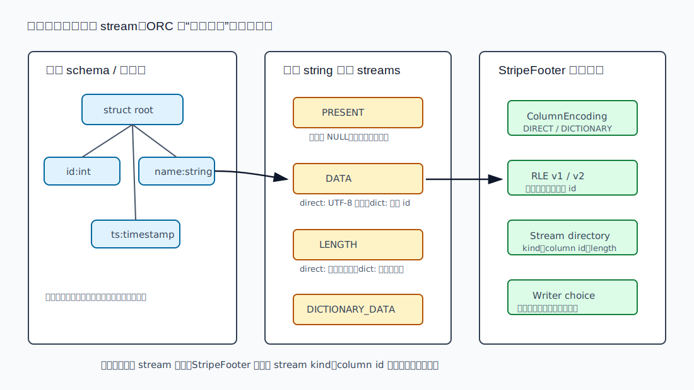
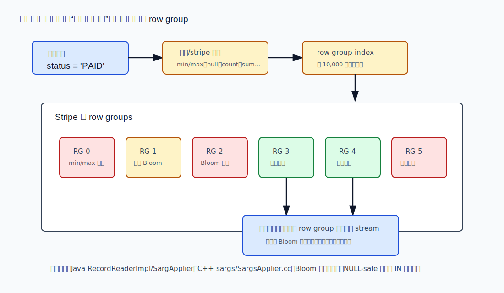
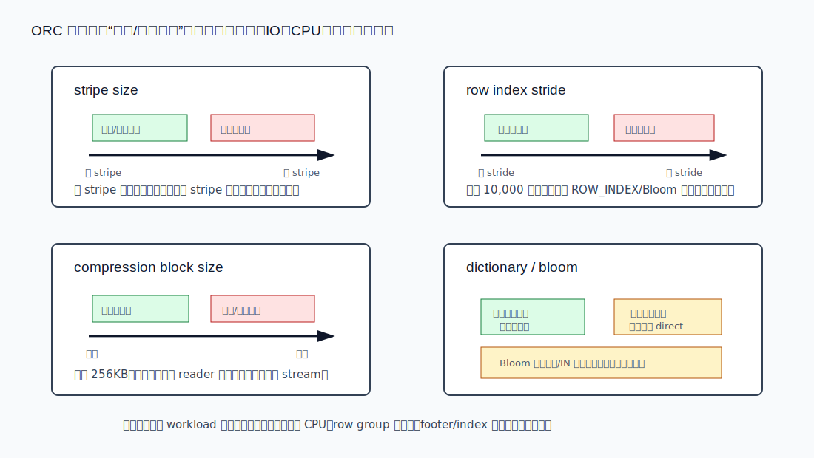

## 数据库筑基课 - 数据存储结构之 orc

### 作者
digoal

### 日期
2026-06-01

### 标签
PostgreSQL , 应用开发者 , 数据库筑基课 , 列式存储 , ORC , 数据湖 , 编码压缩 , 谓词下推    

----

## 背景


本文属于[应用开发者数据库筑基课大纲](../202409/20240914_01.md)里“表存储、列式文件、编码压缩、扫描执行与 IO/CPU 放大”这一类基础能力。

在 OLTP 数据库里，我们常从 heap page、tuple、WAL、B-tree 叶子页开始理解存储结构。这套模型适合解释单行插入、更新、事务可见性和点查。但分析型系统面对的问题不同：一张宽表可能有几百列，查询只读其中 5 列；一个分区可能有几十 GB，查询只关心某个状态、某个时间段、某个租户；数据可能在 HDFS 或对象存储上，随机小读和无效解压都会变成成本。

ORC（Optimized Row Columnar）就是在这个背景下出现的列式文件格式。Apache ORC README 把它定义为面向 Hadoop workload 的 self-describing、type-aware columnar file format：它为大规模流式读取优化，同时内建快速定位所需行的能力。本地 ORC 规范和源码进一步说明了它的核心结构：文件尾部保存 Footer/Postscript，Body 划分为多个 stripe，每个 stripe 内按列拆成多个 stream，写入端生成 row group index、统计信息和可选 Bloom filter，读取端用这些信息做 projection 和 predicate pushdown。

这篇文章不把 ORC 简化成“压缩格式”。从数据库存储结构看，ORC 的本质是：

- 用行分组保持并行扫描和跳过粒度。
- 在每个分组内部按列存储，避免读无关列。
- 用类型感知编码减少字节数和解码成本。
- 用尾部元数据让 reader 先理解文件，再按需读取数据。
- 用 min/max/null 统计和 Bloom filter 把过滤条件提前到 IO 之前。

相关论文给了这个方向的理论背景。`Weaving Relations for Cache Performance` 提出的 PAX 思想说明：在一个行集合内部按属性聚集值，可以改善 cache 利用，而不必退化成完全分裂的 DSM。`An Empirical Evaluation of Columnar Storage Formats` 和 `A Deep Dive into Common Open Formats for Analytical DBMSs` 则提醒我们：开放列式格式的性能不只取决于压缩比，还取决于元数据、编码、解码路径、过滤下推、硬件和 workload。

## 一、它解决什么问题？

ORC 解决的核心问题是：在分析型查询里，让“读取成本”尽量接近“查询真正需要的数据量”。

传统行存文件的问题很直接。假设一张订单表有 80 列，查询只做：

```sql
SELECT sum(amount)
FROM orders
WHERE status = 'PAID'
  AND order_date >= DATE '2026-01-01';
```

行存布局会把同一行的所有列放在一起。即使只需要 `amount`、`status`、`order_date`，也容易把大量无关列从磁盘搬到内存，再污染 CPU cache。索引可以帮助 OLTP 点查，但在大批量分析里，逐行回表、指针跳转和随机 IO 往往不如顺序扫描列式数据。

纯列存也不是银弹。如果把每列独立成巨大的连续文件，读取少数行会很麻烦；如果切得太碎，元数据、文件句柄、对象存储请求数又会上升。ORC 的折中是“行分组 + 组内列式”：

1. 文件分成多个 stripe。stripe 是相对大的独立读取单元，常用于并行任务划分。
2. stripe 内按列拆成多个 stream。只读必要列，就只读这些列的 stream。
3. stripe 内再按 row group 建索引。默认每 10,000 行一项，用统计信息和可选 Bloom filter 跳过不可能命中的 row group。
4. 文件尾部保存全局导航信息。reader 从尾部开始解析，知道 schema、stripe offset、统计信息和压缩参数后，再决定读哪些字节。

代价也在这里：写入端要缓冲 stripe、维护统计、选择编码、写索引；读取端要解析 footer、加载 index、判断 predicate；小文件、小数据量、频繁单行更新不一定受益。



图 1 说明：ORC 的数据区在前，导航信息在尾部。读取时通常先读文件末尾的 `psLen`、`Postscript` 和 `Footer`，再根据 Footer 记录的 stripe 位置、schema、统计信息和压缩参数定位数据。这种结构适合追加写完后一次封口的分析文件，不适合原地频繁更新。

## 二、它是什么？

从数据库存储结构角度看，ORC 是一种自描述、类型感知、按 stripe 组织的列式文件格式。

几个关键术语：

| 术语 | 含义 | 工程意义 |
|---|---|---|
| Header | 文件开头的 `"ORC"` magic | 让工具快速识别文件类型 |
| Body | 真实数据和 stripe 内索引 | 查询读取的主要字节区域 |
| Tail | Metadata、Footer、Postscript、psLen | 文件级导航、schema、stripe 信息、压缩参数 |
| Stripe | ORC 的大块独立数据单元 | 并行扫描、跳过、任务切分的主要粒度 |
| Stream | stripe 内某列某类数据的字节流 | 例如 PRESENT、DATA、LENGTH、ROW_INDEX、BLOOM_FILTER_UTF8 |
| StripeFooter | stripe 内 stream 目录和 column encoding | reader 不能假设 stream 顺序，必须看它 |
| Row group index | 每个 primitive 列的 `ROW_INDEX` stream | 默认每 10,000 行保存位置和统计信息 |
| Bloom filter index | 可选的 Bloom filter stream | 辅助等值、IN 等谓词剪枝，有误判率和空间成本 |
| ColumnEncoding | DIRECT、DICTIONARY、DIRECT_V2、DICTIONARY_V2 | 决定列值如何解释和解码 |

本地 ORC 项目有两个独立实现：

- Java：`java/core/src/java/org/apache/orc` 是公开 API，`org.apache.orc.impl` 和 `impl/writer` 里有 `ReaderImpl`、`RecordReaderImpl`、`WriterImpl`、各类 `TreeWriter`、RLE、Dictionary、BloomFilter、Statistics 等实现。
- C++：`c++/include/orc` 是公开头文件，`c++/src/Reader.cc`、`Writer.cc`、`ColumnReader.cc`、`ColumnWriter.cc`、`sargs/SargsApplier.cc`、`BloomFilter.cc` 等实现读写、编码、谓词下推和统计。

两套实现不能共享代码，但必须读写同一个磁盘格式。这一点对理解 ORC 很重要：ORC 首先是 on-disk format，不是某个 Java 类库的内部格式。

## 三、核心原理

### 3.1 尾部自描述：先读导航，再读数据

ORC 规范把文件分成 Header、Body、Tail。Tail 包含 Metadata、Footer、Postscript 和最后 1 字节 `psLen`。`Postscript` 记录 Footer length、Metadata length、compression kind、compression block size、writer version 和 magic 等信息；`Footer` 记录 header/body 长度、stripe 列表、schema、行数、文件级列统计、row index stride、writer、加密信息等。

为什么 Tail 放在文件尾部？规范给出的原因和 HDFS 写入模型有关：文件写完后不适合回头修改开头的数据。因此 ORC 先顺序写数据，最后写全局索引和元数据。读取时则反过来，从文件末尾开始解析。规范描述的典型流程是：reader 读取最后一段字节，希望其中包含 Footer 和 Postscript；最后一个字节给出 Postscript 长度；解析 Postscript 后，就知道 Footer 的压缩后长度，从而解压并解析 Footer。

这个设计的工程收益是：打开文件时不需要从头扫描所有 stripe；reader 可以先知道有哪些 stripe、每个 stripe 在哪里、schema 是什么、压缩方式是什么、哪些统计信息可用。代价是 Tail 变成读取入口，一旦 footer 很大或对象存储 tail read 延迟高，打开成本会增加。

### 3.2 Stripe：行分组 + 组内列式

ORC 的 Body 由一系列 stripe 组成。规范说 stripe 是自包含的，读取一个 stripe 只需要它自己的字节加上文件 Footer/Postscript；行不会跨 stripe。每个 stripe 内有三部分：

1. index streams
2. data streams
3. stripe footer

index streams 放在 stripe 开头，data streams 放在后面，stripe footer 放在末尾。注意一个容易出错的点：stream 在文件中的具体顺序不是固定的。不同列、不同 stream kind 可以有不同顺序；真正的目录是 StripeFooter 里的 `streams` 字段，它记录 stream kind、column id、length。

这也是 ORC 与简单“每列一个文件”的差异。ORC 不是把整列从头到尾独立存放，而是在 stripe 这个行范围内做列式布局。这样既能按列读取，又能按行范围跳过和并行处理。

### 3.3 类型树、stream 和编码：ORC 为什么叫 type-aware

ORC 文件包含完整类型信息，不依赖 Hive Metastore 才能解释内容。逻辑上，ORC 文件是一串同类型对象；Hive 通常用 struct 作为根对象，字段对应顶层列，但 ORC 不强制根必须是 struct。struct、list、map、union 等复合类型会展开为类型树，子元素由子列保存。

每个列在 stripe 内会拆成若干 stream。例如：

- int：可有 PRESENT 和 DATA。PRESENT 表示是否非空；DATA 保存非空整数值。
- string：direct encoding 下有 PRESENT、DATA、LENGTH；dictionary encoding 下还会有 DICTIONARY_DATA，DATA 保存字典 id。
- timestamp：有 PRESENT、DATA、SECONDARY；DATA 保存秒，SECONDARY 保存纳秒相关编码。
- list/map：复合结构本身保存 PRESENT 和 LENGTH，真实元素在子列里。



图 2 说明：ORC 的“类型感知”体现在两层。第一层是 schema/type tree 让 reader 知道逻辑类型和子列关系；第二层是 StripeFooter 的 ColumnEncoding 和 stream directory 让 reader 知道同一列在当前 stripe 里采用 direct、dictionary、RLE v1/v2 等哪种物理编码。

Java 写入路径里，`TreeWriterBase` 是各类型 writer 的父类。它维护 PRESENT stream、row index、stripe/file statistics 和 Bloom filter。`StringBaseTreeWriter` 会根据字典 distinct ratio、字典大小阈值、row index stride 后的早期检查等决定是否继续使用 dictionary encoding；`TreeWriterBase.createIntegerWriter` 根据写入格式选择 RLE v1 或 RLE v2。C++ 侧的 `ColumnWriter.cc`、`RleEncoderV2.cc`、`Dictionary.cc` 等承担类似职责。

从机制上看，ORC 的压缩分两层：

1. 轻量类型编码：dictionary、bit packing、delta、RLE、varint 等，利用列值分布和类型语义减少字节。
2. 通用压缩 codec：ZLIB、Snappy、LZO、LZ4、ZSTD 等。规范说除 Postscript 外，其他部分都可以按 compression chunk 独立压缩；默认压缩块大小在配置中是 256KB。

### 3.4 Row group index：把跳过能力做到 stripe 内部

只按 stripe 跳过还不够。一个 stripe 可能很大，如果查询条件只命中少量行，读完整 stripe 仍然浪费。ORC 因此在 stripe 内提供 row group index。

规范定义：row group index 由每个 primitive 列的 `ROW_INDEX` stream 组成，每个 row group 一个 `RowIndexEntry`；row group 由 writer 控制，默认 10,000 行。每个 entry 保存两类信息：

- positions：能定位到该 row group 在各 stream 中的开始位置。
- statistics：该 row group 的列统计，例如 count、hasNull、min/max、sum 等，具体取决于类型。

Java `TreeWriterBase.createRowIndexEntry()` 会把当前 index statistics 写入 row index entry，清理统计，再记录下一段的位置；写 stripe 时将 `ROW_INDEX` stream 写出。C++ `ColumnWriter` 也有 `createRowIndexEntry()`、`writeIndex()`、`recordPosition()` 等对应概念。

读取时，C++ `RowReaderImpl::loadStripeIndex()` 会为选中列读取 `ROW_INDEX` 和 `BLOOM_FILTER_UTF8` stream，并在需要时解压解析；`seekToRowGroup()` 根据 row group entry 里的 positions seek 到对应位置。Java `RecordReaderImpl` 则用 `SargApplier`、column statistics 和 Bloom filter 评估 predicate。

### 3.5 Predicate pushdown：统计先剪枝，真实过滤不能省

ORC 的谓词下推不是把 SQL 条件“神奇地推到文件里执行”。它的本质是三值逻辑下的安全剪枝：如果统计信息能证明某个 file/stripe/row group 不可能满足条件，就跳过；如果不能证明，就必须读取并执行真实过滤。

典型路径：

1. 文件级统计：如果整个文件都不可能命中，可跳过文件。
2. stripe 级统计：Metadata 中的 stripe statistics 支持跳过 stripe。
3. row group 统计：ROW_INDEX 中每个 row group 的统计支持 stripe 内跳过。
4. Bloom filter：对配置了 Bloom filter 的列，等值、NULL-safe 等值、IN 等谓词可以进一步判断“不可能存在”。
5. 解码与真实过滤：保留下来的 row group 仍然要读取、解码和执行条件。



图 3 说明：统计信息和 Bloom filter 的目标是减少 IO 和解码，不是替代 SQL 过滤。Bloom filter 有误判率，只能把“不存在”判得可靠，不能把“存在”当成最终结果。Java 源码里 `shouldEvaluateBloomFilter` 也限制了 Bloom filter 的适用谓词类型。

### 3.6 压缩块与随机读：为什么不是整条 stream 一压到底

ORC 的通用压缩按 chunk 独立处理，而不是把一条 stream 整体压成一个不可切分的大块。规范解释了原因：ORC 需要能跳过压缩字节而不解压整个 stream。每个压缩 chunk 有 header，reader 可以根据位置跳到对应 chunk，再解压必要部分。

这带来一个典型权衡：

- 压缩块越大，压缩比通常更好，但解压内存、无效解压和延迟可能上升。
- 压缩块越小，随机读取更灵活，但 header/元数据比例更高，压缩率可能下降。

Spark 配置文档和 Java `OrcConf` 都显示默认 `orc.compress.size` 是 262,144 字节，默认 `orc.compress` 当前为 ZSTD。注意默认值会随项目版本和引擎集成变化，工程上应以实际运行版本的配置为准。

### 3.7 ACID、更新和表格式：不要把文件格式和事务层混在一起

ORC 文件本身是列式文件格式，不是完整事务系统。它可以携带 schema、统计、加密、用户 metadata，也能支持读写兼容和 schema evolution；但 ACID 语义通常由 Hive、Spark、Iceberg、Delta、Hudi 或数据库内核的表管理层实现。

换句话说，ORC 擅长表达“一个封口后的列式数据文件如何被高效扫描”。它不负责类似 PostgreSQL heap 的 tuple version chain、WAL redo、vacuum、行级锁、二级索引维护。把 ORC 放进事务表时，更新、删除、快照隔离、compaction、manifest、分区演进等问题要看上层表格式和执行引擎。

## 四、横向对比

| 维度 | ORC | Parquet | Arrow IPC / Feather | 行存 heap page |
|---|---|---|---|---|
| 主要目标 | Hadoop/数据湖分析场景的类型感知列式文件 | 通用数据湖列式文件，跨生态非常广 | 内存交换、快速序列化、进程间传输 | OLTP 行级读写和事务 |
| 基本组织 | file -> stripe -> stream -> row group index | file -> row group -> column chunk -> page | schema + record batch / buffers | relation -> page -> tuple |
| 文件自描述 | schema、stripe、统计、编码在文件内 | schema、row group、page metadata 在文件内 | schema 和 buffer layout 在文件内 | 通常依赖系统目录 |
| 列投影 | 读必要列 stream | 读必要 column chunk/page | 按列 buffer 读取 | 读整行更自然 |
| 谓词剪枝 | file/stripe/row group stats + 可选 Bloom | row group/page stats、dictionary 等 | 通常依赖上层或全量扫描 | 主要依赖 B-tree/BRIN 等索引 |
| 编码压缩 | 类型编码 + 通用压缩，RLE/dict 等 | page encoding + compression codec | 偏内存布局，压缩不是核心 | 页压缩不是主要分析路径 |
| 点查能力 | row index 可定位到 row group，非 OLTP 点查索引 | page/row group 粒度，非 OLTP 点查索引 | 适合内存访问，不是长期索引文件 | B-tree + tuple id 点查成熟 |
| 写入方式 | 适合批量写、追加、封口 | 适合批量写、追加、封口 | 适合批量交换和中间结果 | 适合小事务频繁更新 |
| 事务/MVCC | 文件格式自身不提供完整事务 | 文件格式自身不提供完整事务 | 不提供数据库事务 | 数据库内核提供 |
| 不适合场景 | 高频单行更新、低延迟 OLTP、很多小文件 | 高频单行更新、极低延迟点查 | 长期压缩存储和复杂剪枝 | 宽表大扫描、只读少数列 |

这张表的重点不是判定谁“更高级”。ORC 和 Parquet 都属于开放列式分析文件，适合做数据湖和批量分析的物理层；Arrow 更偏内存交换；行存 heap page 更偏事务处理。选型时不要问“哪个格式最快”，而要问 workload 的读取列数、过滤选择性、排序/聚簇程度、文件大小、压缩目标、对象存储延迟、引擎支持度分别是什么。

`A Deep Dive into Common Open Formats for Analytical DBMSs` 的价值也在这里：它不是只比较压缩比，而是把开放格式放进 analytical DBMS 的扫描、过滤、编码、元数据和硬件路径里看。格式设计的细节会决定数据库能否把传统列存内核里的优化下推到开放文件上。

## 五、效果如何？

ORC 的收益来自多个机制叠加，不能只看一个指标。

### 5.1 可能的收益

1. 少读列：投影查询只读取必要列的 stream。
2. 少读行组：min/max/null 统计和 Bloom filter 可以跳过不可能命中的 row group。
3. 少搬字节：dictionary、RLE、bit packing、delta、通用压缩减少存储和网络 IO。
4. 顺序吞吐高：stripe 是大块独立单元，适合并行扫描和批处理。
5. 自描述：schema、encoding、statistics 在文件中，跨系统交换更容易。

### 5.2 明确的代价

1. 写入端更重：要缓冲 stripe、维护多个 stream、统计信息和索引。
2. 小文件不划算：footer、postscript、stripe footer、index stream 的固定成本占比会上升。
3. 更新不友好：ORC 是封口后的列式文件，不适合原地单行更新。
4. 低选择性过滤收益有限：如果大多数 row group 都可能命中，统计剪枝帮不上忙。
5. 高基数字符串字典收益有限：Java writer 会根据 distinct ratio 和字典大小阈值回退 direct encoding。
6. Bloom filter 有空间成本和误判率：适合等值/IN 过滤，不适合所有谓词。
7. 复杂类型和 schema evolution 需要谨慎：读写引擎、字段 id、类型提升和兼容性都要验证。



图 4 说明：stripe size、row index stride、compression block size、dictionary、Bloom filter 都是成本旋钮。调参不能只追求“更大 stripe”或“更小 stride”，而要用实际查询验证读取字节、解压 CPU、row group 命中率、index/footer 占比和端到端延迟。

`An Empirical Evaluation of Columnar Storage Formats` 还提醒了一个现代硬件问题：格式内部编码和解码路径会影响 CPU/GPU 友好度。也就是说，文件更小不一定查询更快；压缩率、解码分支、向量化、内存带宽、predicate 下推粒度要一起看。

## 六、实操 DEMO

下面给出一个最小可验证思路。本文没有在当前环境执行 Spark/Hive/ORC 工具命令，因此不提供伪造输出；示例语法来自本地 ORC Spark 配置文档和 ORC 常见使用方式，落地时请以你的 Spark/Hive 版本为准。

### 6.1 创建 ORC 表并设置关键写入参数

```sql
CREATE TABLE orders_orc (
  order_id BIGINT,
  user_id BIGINT,
  status STRING,
  order_date DATE,
  amount DECIMAL(18,2)
)
USING ORC
OPTIONS (
  orc.compress 'ZSTD',
  orc.compress.size '262144',
  orc.stripe.size '67108864',
  orc.row.index.stride '10000',
  orc.create.index 'true',
  orc.bloom.filter.columns 'order_id,status',
  orc.bloom.filter.fpp '0.01'
);
```

验证点：

- `orc.stripe.size` 控制写 stripe 的内存目标，不是 SQL 层的分区大小。
- `orc.row.index.stride` 默认 10,000 行，影响 row group index 粒度。
- `orc.bloom.filter.columns` 不要盲目给所有列打开，优先等值过滤频繁、选择性较高的列。
- `orc.compress.size` 是压缩块大小，影响跳读和解压粒度。

### 6.2 用 explain 看是否发生 ORC 下推

```sql
EXPLAIN
SELECT sum(amount)
FROM orders_orc
WHERE status = 'PAID'
  AND order_date >= DATE '2026-01-01';
```

应该关注的不是某一行固定输出，而是这些信号：

- 是否启用 ORC reader。
- 是否启用 vectorized ORC reader。
- filter 是否下推到 file scan。
- 读取列是否只包含 `status`、`order_date`、`amount`。
- 扫描文件数、读取字节数、任务耗时是否随数据排序和文件大小改善。

### 6.3 用 orc-tools 或引擎元数据检查文件

本地 ORC 项目的 tools 里有 metadata 相关实现，例如 C++ `tools/src/FileMetadata.cc` 会输出 stripe count、compression、compression block、file footer length、postscript length、stripe offset/index/data/footer length、column encoding、stream kind 等信息。实际工程中可以用 ORC 工具或 Spark/Hive 的文件检查工具确认：

- stripe 数量是否合理。
- stripe 里 index/data/footer 的大小比例。
- 字符串列是否使用 dictionary。
- Bloom filter stream 是否存在。
- 文件级、stripe 级、row group 级统计是否可用。

## 七、最佳实践

### 面向数据库架构师

1. 用 workload 决定文件布局，而不是只按日期分区。ORC 的 row group 剪枝依赖数据局部性；如果 `status`、`tenant_id`、`order_date` 完全随机分布，min/max 和 Bloom 的收益会被稀释。
2. 把 ORC 放在表格式之下看。Iceberg/Delta/Hudi 负责 snapshot、manifest、delete、compaction、schema evolution；ORC 负责单个数据文件的列式扫描。不要期待 ORC 单独解决事务表生命周期。
3. 规划小文件治理。过多小 ORC 文件会放大 footer read、文件 listing、任务调度和对象存储请求成本。
4. 区分点查和分析查。ORC 的 row index 是 row group 粒度，不是 B-tree 二级索引；低延迟点查应考虑服务层索引、数据库索引或专用 KV/OLTP 系统。

### 面向 DBA / 数据平台工程师

1. 监控文件大小、stripe 数量、stripe size 分布和小文件数量。文件过小会让 ORC 的列式优势被元数据成本吃掉。
2. 观察 row group 剪枝率。只看压缩比不够，要看 selected row group count、读取字节、解压 CPU 和 scan time。
3. 谨慎打开 Bloom filter。优先给高频等值过滤列打开；对低选择性列、范围查询列、很少过滤的列，Bloom filter 可能只是增加写入和空间成本。
4. 统一写入参数。Spark 文档强调用 table properties 让所有 client 以一致选项写 ORC，避免同一张表里文件行为混乱。
5. 关注版本兼容。ORC v0/v1 是已发布格式，v2 文档是 evolving draft；读写兼容性要按实际引擎版本验证。

### 面向业务开发者

1. 查询时只选必要列，避免 `SELECT *`。列式文件的第一收益来自投影裁剪。
2. 过滤条件尽量写在扫描侧能识别的列上。复杂 UDF、隐式类型转换、函数包裹列值，可能让 predicate pushdown 失效。
3. 让常用过滤列具备局部性。按日期分区后，再按租户、状态或时间排序/聚簇，常常比单纯打开 Bloom filter 更有效。
4. 不要用 ORC 文件当在线事务表。频繁单行 upsert、低延迟强一致读取，应使用数据库表或由表格式提供 delete/merge/compaction 能力。

## 八、适合与不适合场景

适合：

- 数据湖、离线数仓、湖仓表的数据文件。
- 宽表上只读少数列的分析查询。
- 扫描量大、过滤条件可下推、数据有一定排序或聚簇的 workload。
- 批量写入、追加写入、周期性 compaction。
- HDFS 或对象存储上的大文件顺序读取。

不适合：

- 高频单行插入、更新、删除。
- 毫秒级 OLTP 点查。
- 每次都 `SELECT *` 且读取大部分行的大宽表查询，此时列裁剪收益有限。
- 极小数据集或大量小文件，元数据和调度成本可能超过收益。
- 过滤条件主要是不可下推 UDF、复杂表达式或高随机分布列。
- 需要文件格式本身提供完整事务、锁和 MVCC 的系统。

## 九、常见坑

1. 把 stripe 当成数据库 page。stripe 是大块分析读取单元，不是 8KB heap page；不要用 OLTP page 的直觉理解它。
2. 以为 Bloom filter 能加速所有查询。Bloom 主要帮助等值/IN 之类判断“不存在”的场景，对范围查询和低选择性列收益有限。
3. 忽略排序和聚簇。ORC 统计剪枝依赖 row group 内值域。如果数据乱序，min/max 可能覆盖很宽，无法跳过。
4. `row.index.stride` 调得过小。剪枝更细，但 ROW_INDEX 和 Bloom 元数据膨胀，写入 CPU 和读取 index 成本也上升。
5. stripe 太小。并行看似更细，但 footer、stripe footer、任务调度和对象存储请求会放大。
6. stripe 太大。顺序读和压缩更稳，但低选择性查询可能多读，单任务延迟和内存压力上升。
7. 只比较文件大小。更小的文件可能需要更多 CPU 解码；应同时看读取字节、解压耗时、过滤耗时和端到端延迟。
8. 混用不同 writer 参数。不同引擎、不同版本、不同默认值写出的 ORC 文件，stripe、压缩、Bloom、dictionary 行为可能不同。
9. 把 ORC 的 schema 自描述等同于无限 schema evolution。类型提升、字段改名、复杂类型变化仍要看引擎和表格式规则。
10. 忽略时间类型语义。ORC 文档区分 timestamp 和 timestamp with local time zone；跨时区业务要明确语义。

## 十、扩展问题

1. 如果你的查询 90% 都是按 `tenant_id` 和 `event_time` 过滤，应该优先调 `row.index.stride`、打开 Bloom filter，还是改变写入排序？为什么？
2. ORC row group index 和 PostgreSQL BRIN 都用范围统计做跳过，它们的相同点和边界分别是什么？
3. 为什么 ORC 的 stream 顺序不能被 reader 预设？这对文件格式演进有什么好处？
4. 如果一个字符串列 distinct ratio 很高，dictionary encoding 为什么可能变差？
5. 在对象存储上，stripe size、compression block size、小文件数量分别怎样影响 range read 和任务调度？
6. ORC 文件格式自描述和 Iceberg/Delta/Hudi 表元数据自描述分别解决什么问题？
7. PAX 的“页内按属性聚集”思想和 ORC 的“stripe 内按列聚集”有什么继承关系，又有什么差异？

## 十一、扩展阅读

本地源码与官方文档：

- [Apache ORC README](../orc/README.md)
- [ORC 项目架构说明 CLAUDE.md](../orc/CLAUDE.md)
- [ORC Specification index](../orc/site/specification/index.md)
- [ORC Specification v1](../orc/site/specification/ORCv1.md)
- [ORC Specification v2 evolving draft](../orc/site/specification/ORCv2.md)
- [ORC Spark Configuration](../orc/site/_docs/spark-config.md)
- [ORC Types](../orc/site/_docs/types.md)
- [Java OrcConf](../orc/java/core/src/java/org/apache/orc/OrcConf.java)
- [Java TreeWriterBase](../orc/java/core/src/java/org/apache/orc/impl/writer/TreeWriterBase.java)
- [Java StringBaseTreeWriter](../orc/java/core/src/java/org/apache/orc/impl/writer/StringBaseTreeWriter.java)
- [Java RecordReaderImpl](../orc/java/core/src/java/org/apache/orc/impl/RecordReaderImpl.java)
- [C++ Reader.cc](../orc/c++/src/Reader.cc)
- [C++ SargsApplier.cc](../orc/c++/src/sargs/SargsApplier.cc)
- [C++ ColumnWriter.hh](../orc/c++/src/ColumnWriter.hh)
- DeepWiki: [apache/orc](https://deepwiki.com/apache/orc)

相关论文：

- Anastassia Ailamaki, David J. DeWitt, Mark D. Hill, Marios Skounakis, [Weaving Relations for Cache Performance](https://www.vldb.org/conf/2001/P169.pdf), VLDB 2001.
- [An Empirical Evaluation of Columnar Storage Formats](https://arxiv.org/abs/2304.05028), arXiv 2304.05028.
- [A Deep Dive into Common Open Formats for Analytical DBMSs](https://www.microsoft.com/en-us/research/wp-content/uploads/2024/02/p3044-liu.pdf), Microsoft Research / PVLDB.

本文未复现实验性能数字，因此所有效果判断都按机制解释和工程验证路径给出。真正落地时，应在自己的数据、引擎版本、存储介质和查询集合上重新测量。
  
## 附录 
1、询问 gemini
```
https://github.com/apache/orc 相关的论文
```

2、克隆代码  
```  
git clone --depth 1 https://github.com/apache/orc
```  
  
3、启用 codex, 使用 [数据库筑基课 skill](../skills/README.md).  
```
文章标题: 
  数据库筑基课 - 数据存储结构之 orc
项目源码(本地目录): 
  orc
项目 codebase 文件名: 
  orc/CLAUDE.md 
相关论文: 
  Weaving Relations for Cache Performance
  A Deep Dive into Common Open Formats for Analytical DBMSs
  An Empirical Evaluation of Columnar Storage Formats
开源项目相关的 deepwiki repoName: 
  apache/orc
```

   
  
#### [PostgreSQL 解决方案集合](../201706/20170601_02.md "40cff096e9ed7122c512b35d8561d9c8")
  
  
#### [德哥 / digoal's Github - 公益是一辈子的事.](https://github.com/digoal/blog/blob/master/README.md "22709685feb7cab07d30f30387f0a9ae")
  
  
#### [About 德哥](https://github.com/digoal/blog/blob/master/me/readme.md "a37735981e7704886ffd590565582dd0")
  
  

  
