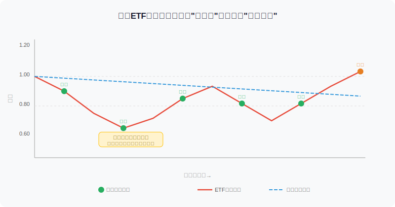
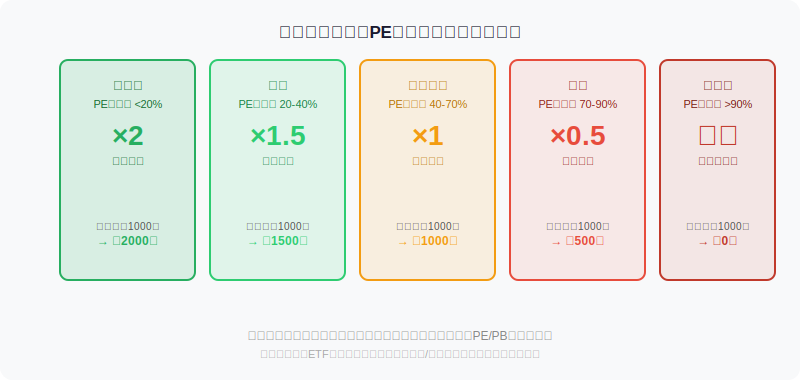
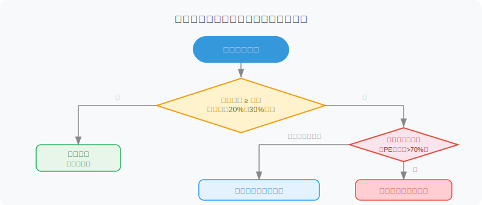

## 散户投资小白金融全品种操盘手册 - 4.4 宽基ETF定投策略 —— 不猜顶底，用时间换胜率
  
### 作者  
digoal  
  
### 日期  
2026-06-01  
  
### 标签  
金融产品 , 金融工具 , 散户 , 投资小白 , 全品操盘手册  
  
----  
  
## 背景 
  

## 先问你一个问题

2022年全年，沪深300指数下跌了21.6%。如果你年初一把梭哈，到年底账面亏损超过两成。但如果你每个月固定买入，同样的一年，你的平均持仓成本比年初买入者**低约12%**——这不是玄学，这是数学。

定投的本质，不是买得便宜，而是**把买入行为分散在时间轴上，自动摊低平均成本**。它解决的不是"我能不能选对时机"，而是"我怎么避免选错时机毁掉整个计划"。

---

## 一、定投是什么：用比喻解释

想象一家超市每周打折，但你不知道哪周折扣最大。如果你每周固定花100元买同一种商品：

- 商品贵的时候，100元买得少
- 商品便宜的时候，100元买得多

几个月下来，你的**平均购买价格，会自然低于这段时间的平均价格**。

ETF定投的逻辑一模一样——你每个月固定投入同等金额，便宜的时候自动买更多份额，贵的时候自动买少，平均成本就这样被拉低了。这在金融上叫做 **"美元成本平均法"（Dollar Cost Averaging，DCA）** 。

---

## 二、核心概念拆解

### 什么叫"宽基ETF"？

宽基（Broad-based）ETF，就是追踪某个**覆盖面很广的市场指数**的ETF，不押注某个行业，而是买"一篮子股票的平均"。

常见的A股宽基ETF包括：

| 指数 | 代表性ETF | 覆盖范围 |
|------|----------|--------|
| 沪深300 | 510300、159919 | A股前300大蓝筹 |
| 中证500 | 510500、159922 | 中等规模500家 |
| 中证1000 | 159845 | 小盘1000家 |
| 创业板指 | 159915、159952 | 创业板100家 |
| 科创50 | 588000 | 科创板50家 |
| 全A（中证全指） | 多只 | 几乎全部A股 |

对于刚入门的小白，**沪深300是最适合的宽基定投标的**——规模大、流动性好、数据完整、历史足够长。

### 定投和"攒钱炒股"有什么不同？

攒钱炒股：积累资金→ 找好时机→一次性买入→等待赚钱

宽基定投：按月买入→不管涨跌→持续积累→达到目标后止盈

两者最大的区别是：**攒钱炒股需要你"猜对"，定投不需要**。大多数人输就输在高估了自己择时的能力。

---

## 三、第一性原理分析

**核心观点：对中国经济长期走势有合理信心的投资者，坚持宽基ETF定投，长期实现正收益的概率高于主动择时。**

**前提清单：**

- **前提A：中国经济长期增长（常量）**
  经济增长 → 企业盈利增加 → 股价中枢上移。这是过去30年的历史，也是大多数经济学家的中期判断。即便有波折，方向未变。
  
- **前提B：A股市场不出现系统性崩溃（准常量）**
  监管体系、制度建设、国际资本参与都在增强市场韧性。极端风险存在，但对所有资产都存在，不是定投特有的弱点。

- **前提C：投资者能持续执行计划，不在市场暴跌时中途放弃（变量）**
  这是最重要的变量。大量定投失败的案例，不是策略失效，而是人在-30%的时候割肉离场了。
  
- **前提D：投资者持有时间足够长（变量）**
  历史数据：沪深300指数，持有5年以上出现亏损的概率约15%，持有10年以上约5%（Wind数据，基于2005-2024年滚动回测）。**时间是风险的稀释剂。**

**情景推演：**

| 情景 | 前提状态 | 预期结果 | 应对方式 |
|------|---------|--------|--------|
| 正常情景 | A+B+C+D均成立 | 长期盈利，年化6-10% | 坚持执行 |
| 压力情景 | C变量失效（市场-40%时恐慌卖出） | 锁定亏损，前期定投意义归零 | 提前设好心理止损上限，设计"最多忍受亏损幅度" |
| 极端情景 | A+D均失效（经济停滞+持有期太短） | 收益不达预期 | 不用短钱做长期定投，定投资金≥5年不用 |

---

## 四、三种定投方式的选择

### 方法1：等额定投（入门首选）

每月固定投入同一金额（如每月1000元），不管涨跌。

**优点：操作简单，不需要判断**  
**缺点：高估的时候买入效率低**

适合：刚入门、资金稳定、时间紧张的投资者。

---

### 方法2：估值定投（进阶推荐）

根据当前PE百分位（市盈率处于历史百分之多少的位置）来决定当月买多少：

**PE百分位查询平台**：中证指数官网、且慢App、理杏仁、天天基金

> **小白注意**：PE百分位是对比历史，不是绝对判断。比如沪深300的PE百分位&lt;20%，意思是当前估值比历史上80%的时间都便宜，不代表未来一定涨，但赔率更好。

**操作步骤：**
1. 每月固定一天（如1号或发工资后2天内）检查目标指数的PE百分位
2. 按照上图表格决定当月投入金额
3. 执行，不随意偏离计划

---

### 方法3：价格止损定投（进阶避坑）

这是在等额定投基础上加一条规则：**如果某只ETF出现结构性问题（如长期成交量暴跌、跟踪误差持续偏大、流动性恶化），立即暂停，切换到同类ETF。**

这是防范"买对指数，选错工具"的保险。

---

## 五、定投止盈：最容易被忽视的那半步

很多人只知道"坚持定投"，不知道"什么时候该收手"。**没有止盈计划的定投，跟没有闸的自行车一样危险。**

**常见止盈方式对比：**

| 方式 | 逻辑 | 优点 | 缺点 |
|------|------|------|------|
| 目标收益止盈 | 达到预设收益率（如20%）后分批卖出 | 简单可执行 | 牛市中可能走早 |
| 估值止盈 | PE百分位&gt;80%后逐步减仓 | 更有根据 | 需要持续跟踪估值 |
| 时间止盈 | 持有满X年后，资金有需求就卖出 | 配合人生规划 | 不考虑市场状态 |
| 组合止盈 | 达到目标收益率 + 估值偏高 = 开始卖出 | 最稳健 | 判断稍微复杂 |

**推荐：目标收益率（如+25%）+ 估值偏高（PE百分位&gt;75%）双条件触发，开始分3个月分批止盈。**

---

## 六、实操例子

**场景：**小王，30岁，工资8000元/月，每月可投资金1500元，目标是5年积累教育基金，选择沪深300ETF（510300）进行定投。

**第一步：确认资金属性**
1500元是5年内不动用的闲钱，生活备用金（约6个月支出）已经单独留出。✓

**第二步：开设账户**
在证券App（华泰、东方、中信等均可）开通A股账户，完成投资者适当性测评。购买场内ETF需要沪市证券账户，510300在沪市，默认开户即可。

**第三步：设定定投计划（等额为例）**
- 每月5号（发工资后）手动或用基金App（天天基金、蛋卷基金等支持自动定投）投入1000元
- 剩余500元放入货币基金（应急备用）

**第四步：估值检查（每月做一次）**
登录"且慢"或"理杏仁"，查看沪深300当前PE百分位：
- 百分位&lt;40%：本月投入1500元（加量）
- 百分位40-70%：本月投入1000元（正常）
- 百分位&gt;70%：本月投入500元（减量）

**第五步：设置止盈提醒**
在手机日历设置每季度提醒，检查是否达到以下任意条件：
- 总收益率超过25%，且当前PE百分位&gt;75% → 开始分3个月减仓50%
- 距离用钱时间不足1年 → 全部转入货币基金

**如果操作错误（高PE时买多了）怎么办？**
不要追悔，不要立刻全部卖出。检查是否还在正常波动范围内，调整下个月的投入比例即可。单次偏差对长期结果影响有限，保持纪律比每次最优更重要。

---

## 七、历史数据支撑

**数据一：沪深300指数定投滚动回测（2005-2024年，Wind数据）**
- 持续定投满3年，亏损概率：约22%
- 持续定投满5年，亏损概率：约13%
- 持续定投满10年，亏损概率：约4%

> 说明：历史数据不代表未来，但揭示了一个规律：**时间是风险的稀释剂**。持有越长，结果越稳定。

**数据二：择时 vs 定投（2015-2024，以沪深300为基准）**
根据2024年华泰证券研报对个人投资者行为的统计分析，散户择时操作的实际年化收益中位数约为-2%至+3%，而同期沪深300指数定投年化收益约为5.8%。大多数"主动操作"跑输了简单定投。

**失败案例：**
2021年初，许多投资者在沪深300 PE百分位超过85%时仍然大额加仓（追高），随后2022年指数下跌超20%，追高入场者亏损显著大于全程定投者。这说明：**忽视估值、只靠坚持定投是不够的**——什么时候投多少，一样重要。

---

## 八、可复用框架

**【攒份额框架】（定投核心逻辑）**

适用场景：有稳定收入、明确长期目标、不需要短期动用的资金

核心逻辑：市场短期无法预测，长期方向可以判断；与其猜顶底，不如持续积累份额

操作步骤：
1. 确认定投资金"5年内不用"
2. 选好宽基标的（沪深300首选，创业板/科创配比不超过总定投的30%）
3. 每月固定日期执行，参考估值百分位调整金额（20%-200%区间）
4. 设置双条件止盈提醒，达到则分批减仓

举一反三：这个框架还可以用在黄金ETF（第七章）、债券ETF（第三章）、QDII宽基（第九章）的定期买入策略上。

---

**【定投三不原则】**

适用场景：每一次市场剧烈波动时的自我提醒

核心逻辑：大多数定投失败不是策略失效，而是人的情绪干扰了纪律

三不：
1. **不停（跌的时候不停止定投）** — 跌得越多，买得越多，才是定投的红利
2. **不抄（不用定投资金外的钱去"抄底"）** — 加大赌注会破坏风控结构
3. **不看（不要每天盯着账户浮亏）** — 定投的时间颗粒度是月/年，每日盯盘只会增加焦虑

---

## 本节行动清单

- [ ] 确认你准备定投的资金是否满足"5年内不用"这一前提
- [ ] 选定1~2只宽基ETF（沪深300优先），查清规模、流动性、跟踪误差
- [ ] 找到一个能查询PE百分位的工具（推荐：且慢、理杏仁），了解当前估值位置
- [ ] 设定每月定投日期，建立"本月投多少"的估值对应规则（或从等额开始）
- [ ] 在日历里设置季度止盈提醒，写下你的止盈条件（目标收益率 + 估值条件）

---

## 一句话总结

宽基ETF定投的价值，不在于它保证你赚多少，而在于它**让你不做蠢事的概率变高了**——不追高、不猜底、不因短期波动乱了节奏，而这恰恰是大多数散户输钱的根本原因。

---

> ⚠️ **声明**：本文内容为投资教育目的，所有历史数据、策略框架均为辅助学习工具，不构成证券投资建议。市场有风险，投资需谨慎。实际操作请结合自身风险承受能力，必要时咨询专业投顾。
  
  
#### [PostgreSQL 解决方案集合](../201706/20170601_02.md "40cff096e9ed7122c512b35d8561d9c8")
  
  
#### [德哥 / digoal's Github - 公益是一辈子的事.](https://github.com/digoal/blog/blob/master/README.md "22709685feb7cab07d30f30387f0a9ae")
  
  
#### [About 德哥](https://github.com/digoal/blog/blob/master/me/readme.md "a37735981e7704886ffd590565582dd0")
  
  

  
