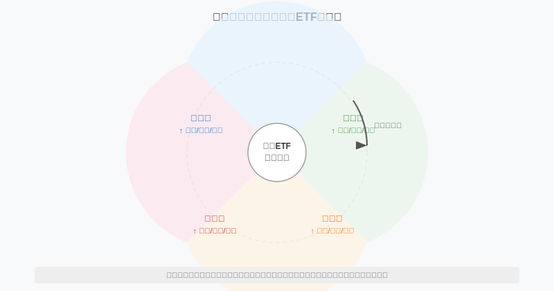
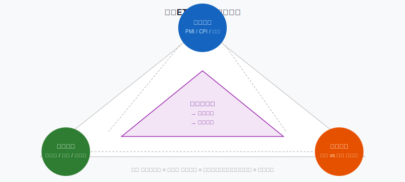
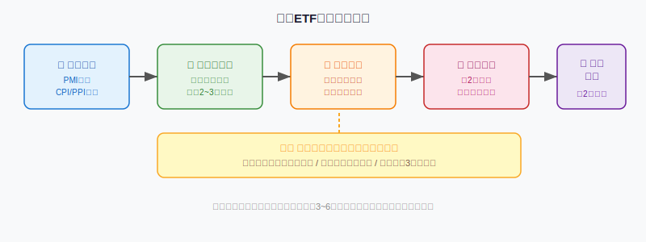

## 散户投资小白金融全品种操盘手册 - 4.5 行业ETF轮动策略
  
### 作者  
digoal  
  
### 日期  
2026-06-01  
  
### 标签  
金融产品 , 金融工具 , 散户 , 投资小白 , 全品操盘手册  
  
----  
  
## 背景 
  

## 先问你一个问题

2020年初，白酒ETF涨了100%；  
2021年底，煤炭ETF涨了80%；  
2022年到2023年，ChatGPT爆火前夕，AI相关ETF半年翻番。

这些不同时间、不同行业的暴涨，**背后有没有规律可循？**

答案是：有的。这个规律叫做**经济周期驱动的行业轮动**。

但这里要先给你打一针预防针：轮动策略听起来很诱人，实际上**坑很多**。今天这节课，我们不只教你轮动的方法，更要帮你看清这条路上最常见的陷阱。

---

## 什么是行业ETF轮动？

### 核心概念

行业ETF轮动，简单说就是：**在经济周期的不同阶段，主动把钱从当前占优的行业，换到下一个即将占优的行业。**

举个比方：就像大学食堂，每天哪个窗口排队最长，往往是有规律的。周一可能红烧肉窗口最火，周五可能是炸鸡。如果你摸清了规律，每次去食堂都能少排队、多吃到好东西。

行业轮动也是类似的逻辑：**不同宏观环境下，不同行业的"营业额"（盈利能力）会系统性地变化。**

---

## 经济周期四阶段与行业偏好

这是行业轮动的地基，必须先搞清楚。

经济周期通常被分为四个阶段，每个阶段的核心特征与受益行业如下：

### 一、复苏期

**宏观特征**：经济增速从低谷回升，但通胀还不高，流动性宽松（降息、放水），市场情绪从恐惧转向期待。

**典型受益行业**：
- **金融（银行/券商ETF）**：利率回升预期+信贷扩张，银行盈利改善
- **消费（食品饮料/白酒ETF）**：居民收入预期改善，消费意愿回升
- **科技（半导体/AI ETF）**：风险偏好回升，高成长赛道估值扩张

**历史案例**：2019年初A股反弹，2020年4月后美股复苏，金融和科技类行业ETF均大幅领跑宽基。

---

### 二、扩张期

**宏观特征**：经济处于高增长阶段，企业盈利改善，就业旺盛，但通胀开始走高，央行可能开始酝酿加息。

**典型受益行业**：
- **能源（石油/煤炭ETF）**：需求旺盛推动大宗商品价格上涨
- **材料（有色金属/钢铁ETF）**：工业活动增加，原材料消耗加速
- **工业（机械/工程机械ETF）**：基建和制造业景气度高

**历史案例**：2021年中国经济扩张期，煤炭、有色、钢铁类ETF大幅跑赢；2022年上半年美国通胀预期下，能源ETF（XLE）全年涨幅超65%（数据来源：Bloomberg，2022年全年）。

---

### 三、滞涨期

**宏观特征**：经济增速开始放缓，但通胀依然高企，央行加息收水，市场情绪由乐观转为焦虑，波动增大。

**典型受益行业**：
- **黄金/贵金属ETF**：实际利率下行预期+避险需求
- **能源（原油ETF）**：供给侧约束仍然存在
- **医疗（医疗ETF）**：防御属性强，盈利稳定不受经济波动大影响

**注意**：这是最难把握的阶段，因为股票普遍难做，轮动频率容易加快但往往摘不准。

---

### 四、衰退期

**宏观特征**：经济明显下行，企业盈利收缩，失业率上升，央行从加息转向降息预期。

**典型受益行业**：
- **医疗/医药ETF**：需求刚性，不受经济周期影响
- **公用事业ETF**（电力/水务）：稳定分红+防御属性
- **国债/债券ETF**：降息预期驱动债券价格上涨

**历史案例**：2008年、2020年初衰退期，美股中消费必需品（XLP）、医疗（XLV）的跌幅显著小于大盘，债券ETF（TLT）在衰退初期大涨（数据来源：Wind，2008年金融危机各行业对比数据）。

---

## 第一性原理分析：轮动策略凭什么成立？

行业轮动策略的核心假设是：**不同行业的盈利周期受宏观因素驱动，且具有一定的可预见性。**

要这个结论成立，需要以下前提：

**前提清单**

| 前提 | 类型 | 说明 |
|------|------|------|
| 前提A：不同行业对经济周期的敏感度存在系统性差异 | **常量** | 金融受利率影响、能源受商品价格影响，这种结构性差异不会消失 |
| 前提B：宏观数据（PMI、CPI、利率）具有一定的领先性 | **相对稳定** | 领先性在大多数周期中存在，但时差会有变化（有时提前1个月，有时提前半年）|
| 前提C：市场定价不完全有效，行业超额收益窗口存在 | **变量** | 在行业ETF数量增多、机构参与度提高后，超额收益窗口可能缩窄 |
| 前提D：投资者能够相对准确地判断当前周期阶段 | **变量** | 实际上大多数时候周期阶段模糊，很难精确判断在哪个象限 |

**情景推演**

- **正常情景（前提全部成立）**：通过宏观数据判断周期，提前布局受益行业ETF，获得相对宽基的超额收益。
- **压力情景（前提C弱化）**：市场反应更快，超额收益窗口更短，需要降低对轮动收益的预期，更多依赖趋势确认而非预判。
- **极端情景（前提D失效）**：政策突然转向（如疫情、战争、重大政策变化），周期判断失效，此时轮动反而带来额外损失。**应对方法：始终保留20~30%的宽基ETF作为压舱石，不把所有仓位押在单一行业。**

---

## 三信号模型：什么时候换仓才有依据？

很多人的轮动是凭感觉的："最近好像消费板块要起来了？"——这是最危险的操作方式。

**可靠的换仓信号需要三个维度同时指向同一方向：**

### 信号1：宏观信号

判断依据：
- **PMI**（采购经理人指数）：大于50代表经济扩张，小于50收缩；连续两个月方向变化更可信
- **CPI/PPI走势**：通胀走向影响行业盈利预期
- **货币政策方向**：降息/加息周期对各行业影响差异很大

数据来源：国家统计局（每月初发布）、中国人民银行官网

### 信号2：资金信号

判断依据：
- **行业ETF成交额变化**：成交额持续放大，代表资金关注度提升
- **北向资金流向**：北向资金对行业的持续净买入是重要佐证
- **机构调研数量**：某行业机构调研骤增，往往是景气改善的先行信号

数据来源：Wind/东方财富，沪深交易所官网每日公告

### 信号3：相对强度信号

判断依据：
- **行业ETF vs 沪深300**：连续3~4周跑赢宽基，趋势已在形成中
- **行业内龙头股表现**：行业ETF的核心个股是否已开始率先启动
- **估值分位数**：当前行业估值处于历史百分之多少分位（越低代表越有安全边际）

---

## 操作流程：五步换仓法

---

## 实操例子：一次完整的行业ETF轮动操作

### 场景设定

- 账户资金：30万元
- 当前持仓：沪深300ETF（20万），现金（10万）
- 时间：某年第四季度，宏观环境为复苏初期

### 第一步：宏观信号确认

连续三个月PMI从47.5→48.8→50.2，从萎缩区间回升至荣枯线上方。CPI维持低位（1.2%），通胀不是压力。货币政策处于降息周期（前6个月已降息两次）。

**判断**：复苏期信号确认，流动性宽松且经济见底回升。

### 第二步：选择候选行业

根据复苏期特征，圈定三个候选行业：
1. 银行ETF（515020）：利差改善+信贷扩张
2. 白酒ETF（512690）：消费回暖+机构低配
3. 科技ETF（588000）：风险偏好修复+低估值

### 第三步：验证信号

- 银行ETF成交额：近4周从日均2亿升至日均8亿，**资金信号强**
- 北向资金：连续3周净买入金融板块，**资金信号强**
- 银行ETF相对沪深300：近一个月超额收益+5%，**相对强度信号出现**
- 估值分位数：银行ETF PB处于历史10%分位附近，**安全边际高**

白酒ETF成交无明显变化，科技ETF相对强度尚未确认。

**结论**：银行ETF三信号最强，优先布局。

### 第四步：执行换仓

- 从沪深300ETF减仓5万（分两天卖出，每天2.5万）
- 将减出的5万元分两次买入银行ETF（本周买3万，下周确认趋势后买2万）
- 剩余10万现金保持不动，作为后续机会储备

**操作后仓位**：沪深300ETF（15万）+银行ETF（5万）+现金（10万）

### 第五步：持续复盘

设定检查节点：每两周观察一次银行ETF相对宽基的超额收益。

**如果出现以下情况，立刻重新评估：**
- 连续两周银行ETF跑输沪深300超过3%
- PMI重新跌破50，宏观信号反转
- 北向资金连续3周净卖出金融板块

**纠偏操作**：若确认失效，将银行ETF减回至与沪深300相同比例或全部切回宽基，不死扛。

---

## 常见错误：轮动策略最容易踩的坑

**坑1：把轮动变成了频繁炒作**

轮动的正常周期是**季度到半年级别**，不是每周换仓。如果你每周都在切换行业ETF，每次摩擦成本（买卖价差+交易费）累积下来，收益很难跑赢拿着宽基不动。

数据佐证：富达投资2021年研究报告显示，频繁切换行业的投资者年度交易成本比低频投资者高出约2%~3%，而年度超额收益往往不足以覆盖该成本。

**坑2：用行业ETF替代宽基ETF作为核心仓位**

行业ETF波动远大于宽基ETF。以科技ETF为例，2021年至2022年间最大回撤超过50%（数据来源：Wind）。如果用科技ETF代替沪深300作为核心配置，精神和资金都会很难受。

正确做法：**行业ETF只作为卫星仓，核心仓始终是宽基ETF。**

**坑3：追涨已经轮动完成的热点行业**

当某个行业ETF上了财经新闻封面、散户群里人人都在讨论，往往意味着轮动已经接近尾声，早期的聪明钱已经布局完毕。追进去的往往是最后一批接盘的。

**坑4：忽视估值**

就算周期方向判断对了，如果行业估值已经处于历史高位（如PE分位超过90%），上涨空间也会大幅压缩，甚至面临均值回归的风险。

---

## 可复用框架

### 【三信号同向法则】

**适用场景**：判断是否该执行行业ETF换仓

**核心逻辑**：宏观信号决定方向，资金信号确认市场认同，相对强度信号验证已有胜势。三者方向一致时换仓，胜率最高。

**操作步骤**：
1. 每月初查宏观数据（PMI/CPI/利率），确认周期阶段
2. 每两周观察目标行业ETF成交额变化和北向流向
3. 每周计算目标行业ETF相对沪深300的超额收益
4. 三信号同向→分两批买入；两信号同向→小仓位试探；一个信号→继续观察

**举一反三**：这个框架也适用于判断单只股票是否可以建仓（基本面+资金面+技术面三维验证）

---

### 【宽基压舱石原则】

**适用场景**：行业ETF仓位管理

**核心逻辑**：无论多看好哪个行业，核心仓位始终保留宽基ETF。行业ETF只在宽基基础上"叠加"，而非替代。

**操作步骤**：
1. 确定总权益仓位（如总资产30万的60%=18万）
2. 其中宽基ETF占权益仓至少50%（即9万以上始终持有宽基）
3. 剩余权益仓（9万）才是行业ETF的活动空间
4. 行业ETF分散到2~3个行业，单一行业不超过总权益仓的20%

**举一反三**：这个框架同样适用于美股配置——标普500ETF作为核心，行业/主题ETF作为卫星。

---

## 本节行动清单

1. **今天起**：关注国家统计局每月发布的PMI数据，在手机日历里设置提醒（通常在每月1号左右发布）
2. **本周内**：在自己的券商APP里找到几个主要行业ETF的实时估值，记录当前各行业PE/PB分位数
3. **建立表格**：按"行业-PMI方向-成交变化-相对强度"四列，每两周更新一次，作为自己的轮动观察台
4. **设置纪律**：在账户里始终保留至少一半权益仓在宽基ETF，行业ETF超配不超过总权益的40%
5. **定期复盘**：每季度回顾一次，你的行业判断哪里对、哪里错，找出规律而不是找借口

---

## 一句话总结

行业ETF轮动的本质是**用宏观周期的知识，在系统性的胜率变化中做出更好的仓位分配**——但它不是让你频繁炒作，而是让你在大周期转换时，有依据地做出调整；核心仓位的宽基ETF，始终是你在市场里站稳脚跟的压舱石。

---

> ⚠️ **声明**：本文内容为投资教育目的，所有历史数据、策略框架均为辅助学习工具，不构成证券投资建议。市场有风险，投资需谨慎。实际操作请结合自身风险承受能力，必要时咨询专业投顾。
  
  
#### [PostgreSQL 解决方案集合](../201706/20170601_02.md "40cff096e9ed7122c512b35d8561d9c8")
  
  
#### [德哥 / digoal's Github - 公益是一辈子的事.](https://github.com/digoal/blog/blob/master/README.md "22709685feb7cab07d30f30387f0a9ae")
  
  
#### [About 德哥](https://github.com/digoal/blog/blob/master/me/readme.md "a37735981e7704886ffd590565582dd0")
  
  

  
