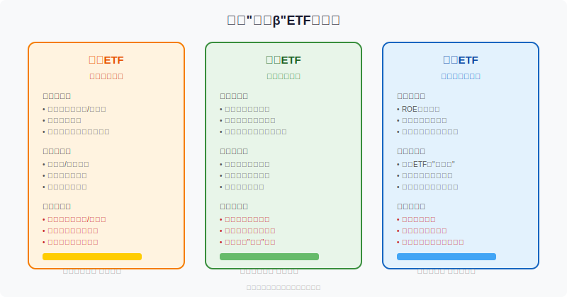
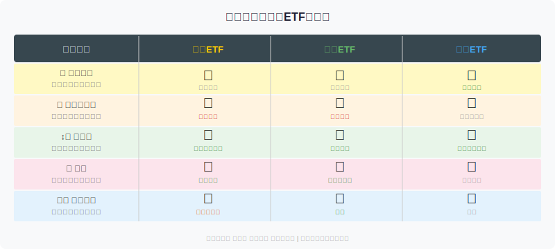
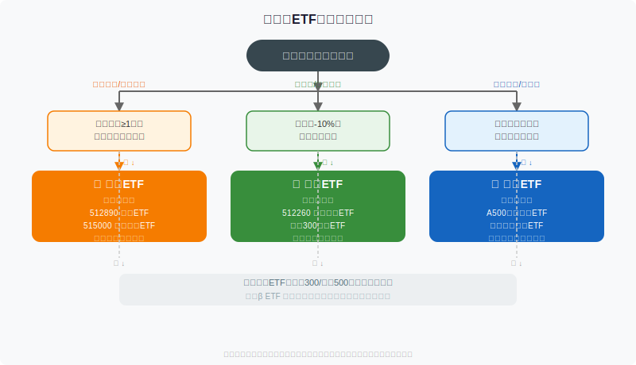

## 散户投资小白金融全品种操盘手册 - 4.6 红利ETF、低波ETF、质量ETF —— 聪明β的三把刀
  
### 作者  
digoal  
  
### 日期  
2026-06-01  
  
### 标签  
金融产品 , 金融工具 , 散户 , 投资小白 , 全品操盘手册  
  
----  
  
## 背景 
  

## 一个让人意外的数据

2015年牛市高峰到2024年底，沪深300指数累计涨幅接近于零。但如果同期持有中证红利全收益指数，累计收益超过80%。

同样是A股，差距从哪来？答案是：**选股逻辑不同**。

普通宽基ETF买的是市值加权，大就多买。而红利ETF、低波ETF、质量ETF这三类，叫做"**聪明β（Smart Beta）**"——它们在普通宽基的基础上，加了一套筛选逻辑，试图系统性地提高胜率。

这节课，我们把这三把刀拆开来看，搞清楚它们各自锋在哪、钝在哪，什么时候用哪把。

---

## 先搞清楚"聪明β"是什么意思

β（Beta）是金融里说的"市场风险"，买沪深300ETF，你的收益就是β，跟大盘涨跌挂钩。

**聪明β的意思是：用一套规则，从市场里系统性地挑出某类股票，期望在不主动选股的前提下，比市场整体表现更好。**

规则可以是：只买股息率高的（红利逻辑）、只买价格波动小的（低波逻辑）、只买基本面好的（质量逻辑）。

这不是主动基金经理在拍脑袋，而是用量化规则定期筛选、定期调仓，费用低、透明、可预期。

适合懒人，但要懂原理——不然遇到某个逻辑失效的年份，你不知道是哪里出了问题。

---

## 红利ETF：用分红买确定性

### 核心逻辑

红利ETF选的是**股息率高、分红持续稳定**的股票。

股息率 = 每股分红 / 股价。一只股票今年分红2元，股价20元，股息率就是10%。

听起来很美？问题是：**高股息率有时候是因为股价跌了，不是因为公司慷慨**。所以好的红利指数会加两个过滤器：分红连续性（连续多少年没断过红）和分红可持续性（用财务指标判断公司能不能继续分）。

目前A股主流红利指数，前十大持仓往往集中在**银行、煤炭、电力、交通运输**。这些行业的特征是：行业成熟、增长慢、但现金流稳定，适合持续派息。

### 第一性原理分析

**支撑"红利ETF长期有效"成立的前提：**

- 前提A：高股息公司持续产生稳定现金流 → **基本常量** → 成熟行业护城河短期不消失
- 前提B：分红再投入形成复利效应 → **常量** → 数学规律，只要分红存在就有效
- 前提C：市场对高股息资产估值不会长期压缩 → **变量** → 若市场长期偏好成长、利率长期上行，高股息资产估值可能被压

| 情景 | 结论 |
|------|------|
| 正常情景（前提全部成立）| 红利ETF在震荡/熊市跑赢，并通过分红再投入积累复利 |
| 压力情景（利率大幅上行）| 高股息吸引力下降，资金流向存款/债券，红利ETF估值承压 |
| 极端情景（主要持仓行业遭受政策冲击）| 集中持仓银行/能源，政策风险可能导致系统性下跌 |

### 为什么震荡市/熊市表现好

原因很直接：**分红是真实现金流，股价不涨也有收益**。

2022年A股熊市，沪深300下跌21%，中证红利全收益指数只跌了约1%（Wind数据）。差距的来源正是分红抵消了部分价格下跌。

### 红利ETF的真实短板

1. **行业过于集中**。银行+能源+公用事业占比往往超过60%，你买的其实不是"全市场"，而是"传统行业宽基"。

2. **牛市跑不过成长**。2019-2021年牛市，创业板翻倍，红利指数只涨了三四成。这不是策略失败，是逻辑使然——成长期市场不爱高股息。

3. **分红不代表未来**。银行的分红来自利润，但净息差收窄的压力始终存在。煤炭分红很慷慨，但价格周期一转，分红可能缩水。

---

## 低波ETF：让你睡得着的工具

### 核心逻辑

低波ETF选的是**过去一段时间（通常12个月）价格波动率最小的股票**。

波动率低意味着价格变化小，意味着极端行情下回撤可控，意味着不容易在慌乱中做出错误决策。

持仓特征：公用事业、食品饮料、日常消费品这类"无聊行业"——需求稳定、收入可预期，股价不会大起大落。

### 第一性原理分析

**支撑"低波股票长期有超额"的前提：**

- 前提A：低波动股票被市场系统性低估（因为机构追逐高波动弹性）→ **可能存在，但正在被套利削弱**
- 前提B：散户买低波主要为了控制情绪，不是为了超额收益 → **心理价值确实存在**
- 前提C：低波股票不会在牛市中跑输过多 → **变量，牛市时跑输可能很显著**

| 情景 | 结论 |
|------|------|
| 正常情景 | 下跌保护好，横盘略超额，牛市中跑输成长 |
| 牛市末期持有 | 跑输剧烈，可能让人不耐烦频繁切换 |
| 极端熊市 | 是表现最好的权益类资产之一 |

### 低波ETF真正的价值

研究层面，学术界发现"**低波动异象**"——理论上高风险=高回报，但实证中低波动股票长期收益不差（有时更好）。原因可能是机构投资者为了追求相对排名，主动超配高β股票，导致低波动股被系统性低估。

**但对于散户，最实际的价值是：不容易在暴跌时卖出。**

2018年A股下跌25%，持有低波ETF的投资者账户跌幅只有约15%（Wind数据），这10%的差异在行为上意味着：更少恐慌，更少割肉，最终结果更好。

### 低波ETF的主要陷阱

1. **历史低波≠未来低波**。过去12个月波动率低，不代表未来也低。一旦低波因子拥挤，反而可能在特定行情中集中崩跌。

2. **牛市踏空风险**。2020年A股大涨，科技股翻倍，低波ETF涨幅不足15%。持有者会感受到巨大心理压力。

3. **规则不同差异大**。各家低波指数定义不一：有的看12个月波动率，有的看半年；有的做行业中性，有的不做。选之前要看清楚编制规则。

---

## 质量ETF：给宽基安装"过滤器"

### 核心逻辑

质量ETF选的是**ROE高、盈利稳定、财务健康的公司**。

ROE（Return on Equity，净资产收益率）= 净利润 / 净资产。简单说，就是"用股东的钱，每年能赚多少回来"。

一家ROE连续10年稳定在15%以上、负债率低、现金流充裕的公司，就是质量因子看重的标的。A股中，典型的质量因子重仓股往往出现在消费白马、医药龙头、部分科技巨头。

### 第一性原理分析

**支撑"质量因子有效"的前提：**

- 前提A：高ROE公司具有真实的护城河，可以维持 → **相对常量，但需要持续验证**
- 前提B：市场长期愿意给质量公司估值溢价 → **历史上成立，但存在周期性失效**
- 前提C：质量筛选规则能有效排除财务造假 → **变量，财务造假仍是A股顽疾**

| 情景 | 结论 |
|------|------|
| 正常情景 | 各市场环境中都有一定超额，长期相对稳定 |
| 价值风格盛行 | 质量溢价被压缩，但质量公司本身还是盈利 |
| 财务造假暴雷 | 若指数没有快速剔除，会直接拖累净值 |

### 质量ETF的独特优势

它是三类聪明β中，**对市场环境依赖最弱的一种**。

红利ETF怕利率上行，低波ETF怕牛市，质量ETF没有这样的天敌——因为长期来看，高质量公司就是应该值更多钱，这个逻辑没有特定的"失效期"。

这也是为什么质量ETF更适合作为**宽基ETF的升级替代**，而不是在特定市场环境下的临时配置。

### 质量ETF的主要风险

1. **定义不统一**。"质量"本身是个模糊概念。不同指数商的筛选维度不同：有的偏ROE，有的加上低杠杆，有的还加成长因子。两只都叫"质量ETF"，持仓可能差异显著。

2. **估值往往偏贵**。好公司人人爱，PE溢价是常态。高价买入优质资产，若估值回调，短期仍可能亏损。

3. **短期"超额"不稳定**。质量因子年度超额差异很大，某些年份跑输宽基很正常。

---

## 三把刀的对比总览

---

## 市场周期与三类ETF适配

---

## 实操例子：小张的20万怎么配

**场景设定：**
- 小张，30岁，20万可投资资金，风险偏好中等偏低
- 市场环境：2024年底，A股震荡，利率处于历史低位，整体不确定性高
- 目标：长期配置，不频繁操作，3年以上持有

**具体操作（分步）：**

**第一步：确认基础仓位（50%，10万）**
- 先配置沪深300 ETF（510300或类似）作为核心宽基仓位
- 依据：利率低位环境，宽基先占一半，给聪明β预留空间

**第二步：配置红利ETF（25%，5万）**
- 选择中证红利或红利低波ETF
- 依据：利率下行周期，高股息资产受益；震荡市提供现金流缓冲
- 注意：需接受行业集中在金融/能源，若这两个行业有重大风险暴露要减配

**第三步：配置质量ETF（25%，5万）**
- 选择中证质量成长或A500质量增强ETF
- 依据：替代部分宽基，长期优化收益，无明显市场周期依赖
- 注意：核实指数编制规则，选规模≥50亿、日均成交额≥1亿的产品

**第四步：设好再平衡规则**
- 每年12月检查：若红利仓位超过30%，卖出多余部分买入质量ETF；反之同理
- 偏离5%以上才操作，不要频繁调整

**如果操作出错：**
- 错误：市场涨了换成低波ETF想"保住收益"——这是追涨杀跌的变体，因为低波在牛市里会大幅跑输，换入时机可能恰好是高点
- 纠偏：遵守原始配置规则，策略价值来自纪律而非择时

---

## 选哪只ETF？决策流程

---

## 可复用框架

### 【聪明β三步选择法】

**适用场景：** 想在宽基ETF之外加入因子增强，但不想主动选股

**核心逻辑：** 明确自己在优化哪个维度（收益、回撤、质量），再选对应工具

**操作步骤：**
1. 先问：我最在意的是分红收益、回撤控制，还是长期超额？
2. 对照：红利→收益型；低波→防守型；质量→超额型
3. 验证：该ETF规模≥50亿？日均成交额≥1亿？持仓前十集中度是否接受？
4. 配置：三类加总不超过宽基仓位的50%，剩余仍以宽基为核心

**举一反三：** 这个框架同样适用于选美股因子ETF（高股息、低波、质量因子在美股同样成立，对应SPD、SPLV、QUAL等）

---

### 【因子周期检验法】

**适用场景：** 持有某类聪明β ETF期间，判断是否需要调仓

**核心逻辑：** 聪明β的失效是正常的，但可区分"周期性失效"和"逻辑崩溃"

**操作步骤：**
1. 若某类ETF连续12个月明显跑输宽基，开始检验
2. 问：是市场风格偏离（正常），还是持仓基本面发生结构性变化（需应对）？
3. 若是风格偏离 → 继续持有，等待均值回归
4. 若是基本面恶化（如红利ETF主要持仓行业盈利持续下滑）→ 减配

**举一反三：** 同样适用于主题ETF、行业ETF的持仓决策检验

---

## 本节行动清单

1. **查一下你现有的ETF持仓**：是宽基、红利、低波还是质量？理解自己在持有什么逻辑
2. **看清楚持仓行业分布**：若手上有红利ETF，确认银行+能源+公用事业合计占比，超过70%时需意识到行业集中风险
3. **评估自己的市场环境判断**：当前处于震荡/熊市，可适当增配红利+低波；牛市前期，质量ETF更有弹性
4. **选具体产品时查三个数字**：规模（≥50亿）、日均成交额（≥1亿）、近1年跟踪误差（越小越好）
5. **设好再平衡时间点**：选一个固定日期（比如每年1月1日），检查是否偏离目标配比超过5%

---

## 一句话总结

红利ETF买的是确定性，低波ETF买的是稳定性，质量ETF买的是可持续性——三把刀各有用处，但任何一把都不是万能的，组合持有才能互补缺口。

---

> ⚠️ **声明**：本文内容为投资教育目的，所有历史数据、策略框架均为辅助学习工具，不构成证券投资建议。市场有风险，投资需谨慎。实际操作请结合自身风险承受能力，必要时咨询专业投顾。ETF产品代码仅为示例，投资前请核实最新产品信息。
  
  
#### [PostgreSQL 解决方案集合](../201706/20170601_02.md "40cff096e9ed7122c512b35d8561d9c8")
  
  
#### [德哥 / digoal's Github - 公益是一辈子的事.](https://github.com/digoal/blog/blob/master/README.md "22709685feb7cab07d30f30387f0a9ae")
  
  
#### [About 德哥](https://github.com/digoal/blog/blob/master/me/readme.md "a37735981e7704886ffd590565582dd0")
  
  

  
