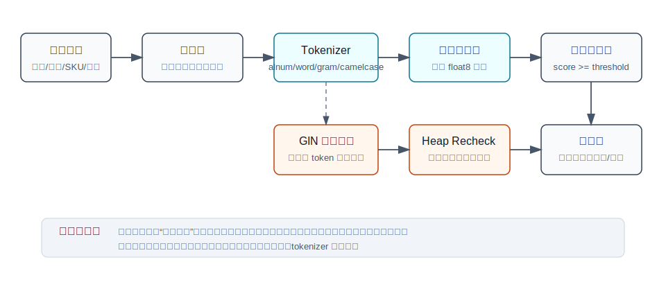
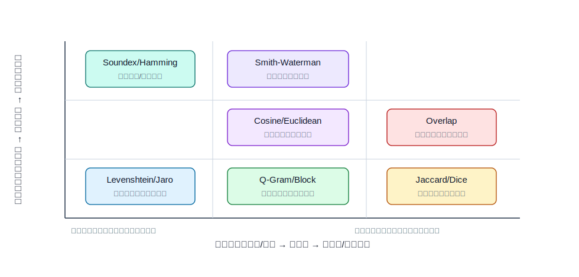
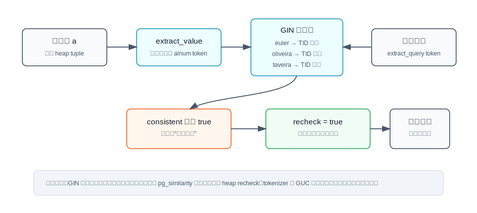
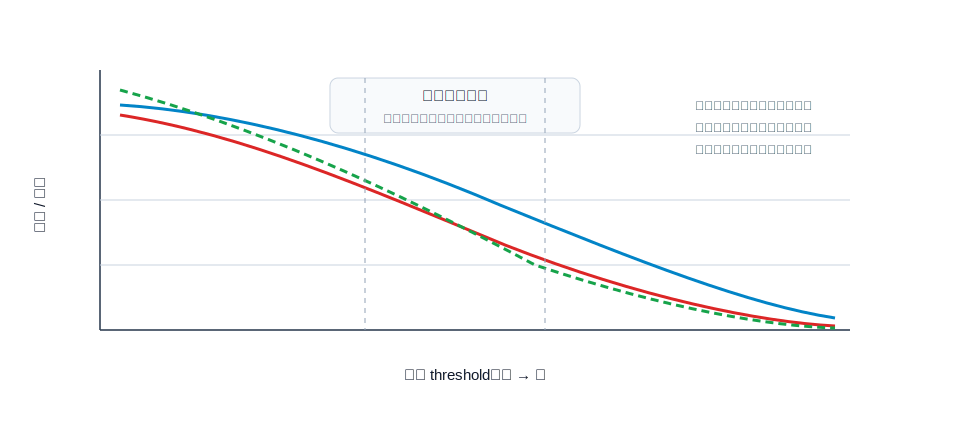

## 数据库筑基课 - 最佳实践之 相似搜索

### 作者
digoal

### 日期
2026-06-01

### 标签
PostgreSQL , 应用开发者 , 数据库筑基课 , 相似搜索 , 字符串相似度 , GIN , Recheck , pg_similarity    

----

## 背景


本文属于[应用开发者数据库筑基课大纲](../202409/20240914_01.md)里“类型、操作符、索引、执行计划与应用建模”这一类基础能力。

业务里经常有“看起来像”的查询：

- 客户姓名录入错一个字母，要还能找到。
- 商品标题、地址、机构名有缩写、标点、顺序差异，要能去重。
- 用户输入很短，库里文本很长，要找包含同一组关键词的候选。
- 从脏数据里做主数据归并，宁愿多给候选，也不能漏掉高价值疑似重复项。

这类问题不能只靠 `=`、`LIKE '%xxx%'` 或全文检索解决。`=` 太硬，`LIKE` 对错别字无能为力，全文检索更偏“词项存在和排序”，不是“两个字符串相似到什么程度”。相似搜索的本质是：先定义“相似”的数学口径，再把它落到 SQL 函数、布尔操作符、阈值、候选集过滤、重检和业务排序上。

本文以 `pg_similarity` 为例。它是一个 PostgreSQL C 扩展，提供多种字符串相似度函数、阈值操作符、会话级 GUC 参数，并为部分 token 类操作符提供 GIN 操作符类。源码与 README 显示，它覆盖 Levenshtein、Jaro、Jaro-Winkler、Cosine、Dice、Euclidean、Hamming、Jaccard、Block/L1、Matching、Monge-Elkan、Needleman-Wunsch、Overlap、Q-Gram、Smith-Waterman、Smith-Waterman-Gotoh、Soundex 等算法。

## 一、它解决什么问题？

相似搜索解决的是“数据不完全一致，但业务上可能指向同一个对象”的检索问题。

传统写法的问题在于：

```sql
-- 精确匹配：召回低
SELECT * FROM customer WHERE name = 'Euler Taveira de Oliveira';

-- 模糊包含：只能处理连续子串，不能解释编辑错误、词序变化、缩写
SELECT * FROM customer WHERE name ILIKE '%Euler%Oliveira%';
```

真正的相似搜索要回答四个问题：

1. **相似的定义是什么？** 是编辑距离小、共享 token 多、向量夹角近、发音近，还是局部片段相似？
2. **阈值是多少？** `0.7` 不是自然规律，只是默认值；它必须由业务样本校准。
3. **候选集怎么收缩？** 如果每行都跑动态规划或 token 集合计算，表大以后会变成 CPU 扫描。
4. **结果怎么验证？** 查询快不等于准，命中多不等于召回好；需要人工标注样本和 `EXPLAIN` 证据。

代价也很明确：相似搜索牺牲了精确匹配的确定性，换来更高召回；使用索引又通常牺牲写入和维护成本，换来更小的候选集。

## 二、它是什么？

`pg_similarity` 把“相似搜索”拆成三层。

| 层次 | 在 pg_similarity 中的形态 | 工程含义 |
|---|---|---|
| 打分函数 | `lev(text,text)`、`qgram(text,text)`、`cosine(text,text)` 等，返回 `float8` | 给两段文本算相似度分数；分数越高越相似 |
| 阈值操作符 | `~==`、`~~~`、`~##` 等，返回 `bool` | 在 `WHERE` 里写成布尔条件，由对应阈值 GUC 决定是否命中 |
| 参数 | `pg_similarity.<algo>_threshold`、`<algo>_tokenizer`、`<algo>_is_normalized` | 控制阈值、分词方式、函数结果是否归一化 |

README 把参数分为三类：`tokenizer`、`threshold`、`normalized`。源码 `similarity.c` 在 `_PG_init()` 中注册这些自定义 GUC，`similarity.h` 定义默认大小写忽略、最大字符串长度 `PGS_MAX_STR_LEN = 1024`、tokenizer 枚举和算法常量。



图 1 说明：相似搜索不是一个孤立函数。工程链路至少包括输入规范化、分词、相似度计算、阈值判断、候选集控制、必要时 heap recheck，最后才是业务排序和限量。

## 三、核心原理

### 3.1 相似度函数：把“距离”统一成“分数越高越相似”

`pg_similarity` 的使用体验是：函数返回 `float8`，操作符返回 `bool`。这比直接暴露“距离越小越相似”更适合 SQL 过滤。

以 Levenshtein 为例，论文 *Binary Codes Capable of Correcting Deletions, Insertions and Reversals* 背后的核心思想是编辑错误模型：插入、删除、替换会把一个字符串变成另一个字符串。`pg_similarity/levenshtein.c` 用动态规划求最小编辑代价，并在归一化模式下返回：

```text
similarity = 1.0 - edit_distance / max(length(a), length(b))
```

所以 `lev('Euler', 'Euller')` 这类短字符串错拼可以得到较高相似度。源码还做了两个工程约束：

- 输入超过 `PGS_MAX_STR_LEN` 会报错，默认最大 1024 字节。
- `PGS_IGNORE_CASE` 默认开启，字符会被转小写后比较。

这两个约束都很重要：相似度计算不是无成本函数，长文本或多字节文本必须先做建模拆分。

### 3.2 Tokenizer：决定“两个文本被比较成什么对象”

集合/向量类算法先把文本变成 token，再比较 token 集合或频次。`tokenizer.c` 提供四种分词方式：

| tokenizer | 规则 | 适合场景 | 风险 |
|---|---|---|---|
| `alnum` | 非字母数字作为分隔符，默认值 | 英文名、编码、地址、商品标题 | 中文连续文本可能被当作整体，需预处理 |
| `word` | 空白字符分隔 | 已经完成分词的文本 | 标点、下划线不一定切开 |
| `gram` | 固定长度滑窗 n-gram，默认支持 full n-gram padding | 短文本错漏、局部片段 | token 数变多，索引和 CPU 成本上升 |
| `camelcase` | 按大小写边界切分 | 代码标识符、驼峰字段名 | 依赖大小写形态 |

`qgram.c` 的实现很直接：临时把 `block` 算法的 tokenizer 切到 `PGS_UNIT_GRAM`，复用 `block()` 的 L1 距离计算。这说明很多相似搜索算法的差异，不只在公式，也在“输入被拆成什么 token”。

### 3.3 算法族：字段类型决定算法，不要反过来



图 2 说明：短字段错拼、长文本词项重排、局部片段匹配、发音近似不是同一个问题。先看数据怎样变脏，再选算法。

常见选择可以这样理解：

| 业务字段 | 主要变形 | 优先算法 | 原因 |
|---|---|---|---|
| 人名、短编码 | 插入、删除、替换、字符换位附近的错拼 | Levenshtein、Jaro、Jaro-Winkler | 字符级编辑更敏感 |
| 商品标题、地址 | 标点差异、词项重排、部分词相同 | Jaccard、Dice、Cosine、Overlap | token 集合或向量更稳 |
| 短文本错漏 | 连续片段相同但局部有错 | Q-Gram、Block/L1 | n-gram 对小编辑有较好召回 |
| 英文姓名发音 | 拼写不同但读音近 | Soundex | 用语音编码先降维 |
| 生物序列/局部序列 | 局部片段相似 | Smith-Waterman、Needleman-Wunsch | 序列比对模型更适合 |

信息检索中的向量空间思想和 *Mathematical Model for Information Retrieval* 这类早期检索模型给了一个重要启发：文档或文本可以先被映射成特征空间，再用相似度判断相关性。但在数据库里，这个思想落地时必须考虑访问路径：向量/集合空间的相似，不等于 B-tree 能直接定位。

### 3.4 操作符：把分数判断放进 WHERE

`pg_similarity--1.0.sql` 为每个函数创建一个 `_op` 包装函数和 SQL 操作符。例如：

```sql
CREATE FUNCTION lev (text, text) RETURNS float8
AS 'MODULE_PATHNAME','lev'
LANGUAGE C IMMUTABLE STRICT;

CREATE FUNCTION lev_op (text, text) RETURNS bool
AS 'MODULE_PATHNAME', 'lev_op'
LANGUAGE C STABLE STRICT;

CREATE OPERATOR ~== (
    LEFTARG = text,
    RIGHTARG = text,
    PROCEDURE = lev_op,
    COMMUTATOR = '~==',
    RESTRICT = contsel,
    JOIN = contjoinsel
);
```

源码里的 `_op` 模式是：保存当前 `*_is_normalized`，临时强制归一化为 `true`，调用打分函数，再和 `*_threshold` 比较。原因是阈值天然要求 `[0,1]` 口径，否则不同算法和不同字符串长度下不可比较。

### 3.5 GIN：只能缩小候选集，不能替代真实相似度判断

PostgreSQL GIN 是倒排索引：把复合值拆成 key，再用 key 找 posting list。官方文档说明，GIN 存储的是 key，不是原始 item；`consistent` 可以返回“可能匹配，并要求 recheck”。

`pg_similarity` 的 GIN 支持在 `similarity_gin.c` 里，SQL 中声明了 `gin_similarity_ops`。它只打开了 token 类操作符：

- 支持：`~++`、`~##`、`~-~`、`~!!`、`~??`、`~^^`、`~**`、`~~~`
- 未打开：Jaro、Jaro-Winkler、Levenshtein、Monge-Elkan、Needleman-Wunsch、Smith-Waterman、Soundex 等

原因也能从源码看出来：GIN 路径依赖 token 提取，而 Levenshtein/Jaro 这类字符编辑或全局字符串算法不能简单用 token 倒排项精确证明命中。



图 3 说明：`pg_similarity` 的 GIN 索引适合先找“可能共享 token 的行”。`gin_token_consistent()` 设置 `*recheck = true` 并返回 true，表示 heap tuple 仍要重新执行原始相似度操作符。这个索引减少的是候选集，不是省掉最终打分。

还有一个容易踩的点：`similarity_gin.c` 顶部用编译期开关选择 tokenizer，本地源码默认 `#define PGS_BY_ALNUM 1`。文件内 TODO 明确写着希望按 GUC 建索引并保存 tokenizer 元信息，但当前实现没有做到。因此，如果会话里把某个算法 tokenizer 改成 `gram` 或 `word`，而索引仍按 `alnum` 提取 key，计划选择和召回边界就要用测试验证，不能想当然。

## 四、横向对比

| 维度 | `pg_similarity` | PostgreSQL `fuzzystrmatch` | `pg_trgm` | 全文检索 |
|---|---|---|---|---|
| 主要目标 | 多算法相似度函数和阈值操作符 | 字符串距离、Soundex、Metaphone 等函数 | trigram 相似、LIKE/ILIKE 加速 | 词项检索、排名、语言处理 |
| 算法覆盖 | 很广，适合教学和多场景试验 | 较聚焦，PostgreSQL contrib 官方模块 | 聚焦 trigram，工程成熟度高 | 关注文档检索而非两串相似 |
| 索引支持 | 部分 token 类操作符支持 GIN，且需要 recheck | 不是通用相似搜索索引方案 | GIN/GiST 支持成熟 | GIN/GiST tsquery 支持成熟 |
| 参数 | 每算法 threshold/tokenizer/normalized GUC | 函数参数为主 | `pg_trgm.similarity_threshold` 等 | dictionary、parser、ranking 配置 |
| 适合 | 理解算法差异、主数据去重、候选生成、小中规模相似过滤 | 需要官方 contrib 的距离或发音函数 | 生产级模糊文本匹配优先候选 | 搜索文档、关键词召回、排名 |
| 不适合 | 超大规模向量语义检索、复杂中文分词、不经校准直接上线 | 多算法横向比较 | 发音、编辑距离精确解释 | 字符错拼和短字符串编辑相似 |

如果生产系统只需要英文/通用文本模糊匹配，`pg_trgm` 往往更直接；如果需要比较多种经典相似度算法、做主数据质量实验，`pg_similarity` 更像一个算法工具箱。不要为了“算法多”而忽略访问路径，真正上线时最重要的是候选集大小、误召回成本、漏召回成本和维护成本。

## 五、效果如何？

收益来自三点：

1. **召回变高**：能找到精确匹配找不到的错拼、缩写、顺序差异。
2. **表达更清楚**：`a ~== b`、`a ~~~ b` 把“超过阈值才算相似”放进 SQL 谓词。
3. **部分场景可索引**：token 类算法可用 GIN 先收缩候选。

代价也来自三点：

1. **CPU 成本高**：编辑距离和序列比对类算法通常比 `=`、B-tree 范围扫描贵得多。
2. **阈值需要训练**：默认 `0.7` 只能作为起点，不能替代业务验证。
3. **索引不是精确命中**：GIN 候选仍需 recheck；候选过大时仍会慢。



图 4 说明：阈值降低通常会提高召回，但误匹配和候选集成本也会上升；阈值升高会减少噪声，但可能漏掉真实相似项。最佳阈值不来自文档默认值，而来自业务标注样本。

## 六、实操 DEMO

以下 SQL 按 `pg_similarity` README 和本地扩展定义整理，本文没有在当前环境实际执行，因为本机没有确认已安装该扩展到目标 PostgreSQL 实例。输出请以你环境中的执行结果为准。

### 1. 安装与加载

```bash
cd pg_similarity
make
make install
```

```sql
CREATE EXTENSION pg_similarity;
```

### 2. 准备样本

```sql
CREATE TABLE customer_name (
    id bigserial PRIMARY KEY,
    name text NOT NULL
);

INSERT INTO customer_name(name) VALUES
('Euler Taveira de Oliveira'),
('EULER TAVEIRA DE OLIVEIRA'),
('Euler T. de Oliveira'),
('Oliveira, Euler T.'),
('Euler Oliveira'),
('Euller'),
('Sr. Oliveira');
```

### 3. 比较函数分数

```sql
SELECT name,
       lev(name, 'Euler Taveira de Oliveira')      AS lev_score,
       qgram(name, 'Euler Taveira de Oliveira')    AS qgram_score,
       cosine(name, 'Euler Taveira de Oliveira')   AS cosine_score
FROM customer_name
ORDER BY lev_score DESC;
```

这个查询用于观察算法口径差异，不要直接拿某一个分数当业务真理。短字符串错拼可能 Levenshtein 更好，词项重排可能 Cosine/Jaccard 更稳。

### 4. 用阈值操作符过滤

```sql
SHOW pg_similarity.levenshtein_threshold;
SET pg_similarity.levenshtein_threshold TO 0.7;

SELECT id, name, lev(name, 'Euller') AS score
FROM customer_name
WHERE name ~== 'Euller'
ORDER BY score DESC;
```

`~==` 调用的是 `lev_op`，返回布尔值。操作符内部会用归一化分数和 `pg_similarity.levenshtein_threshold` 比较。

### 5. 为 token 类算法建立 GIN 候选索引

```sql
CREATE INDEX customer_name_similarity_gin
ON customer_name
USING gin (name gin_similarity_ops);

EXPLAIN (ANALYZE, BUFFERS)
SELECT id, name, qgram(name, 'Euler Oliveira') AS score
FROM customer_name
WHERE name ~~~ 'Euler Oliveira'
ORDER BY score DESC;
```

验证重点不是“有没有 Index Scan”四个字，而是：

- 是否使用 `Bitmap Index Scan` / `Bitmap Heap Scan`。
- heap recheck 后实际保留多少行。
- `Buffers` 是否比无索引扫描下降。
- 阈值降低后候选行是否快速膨胀。

### 6. 用标注样本校准阈值

```sql
CREATE TABLE name_pair_label (
    left_name text NOT NULL,
    right_name text NOT NULL,
    is_same boolean NOT NULL
);

-- 人工标注一批正负样本后，观察不同阈值的效果
SELECT threshold,
       count(*) FILTER (WHERE score >= threshold AND is_same)      AS true_positive,
       count(*) FILTER (WHERE score >= threshold AND NOT is_same)  AS false_positive,
       count(*) FILTER (WHERE score < threshold AND is_same)       AS false_negative
FROM (
    SELECT left_name,
           right_name,
           is_same,
           qgram(left_name, right_name) AS score
    FROM name_pair_label
) s
CROSS JOIN (VALUES (0.5), (0.6), (0.7), (0.8), (0.9)) AS t(threshold)
GROUP BY threshold
ORDER BY threshold;
```

这一步比“调到看起来差不多”可靠。主数据归并通常更怕漏召回，审核系统通常更怕误匹配，两个场景的最佳阈值可能完全不同。

## 七、最佳实践

### 面向数据库架构师

1. **先定义业务损失函数**：漏召回和误匹配哪个更贵？去重、风控、搜索联想、客服查找的答案不同。
2. **把规范化前置**：大小写、全半角、空格、标点、公司后缀、地址行政区划、SKU 规则应尽量在入库或生成列里处理。
3. **两阶段检索**：第一阶段用 GIN、前缀、分区、租户、类别、时间等条件缩小候选；第二阶段用相似度函数精排。
4. **中文文本不要裸用默认 tokenizer**：`alnum` 基于 C locale 字母数字概念，中文连续文本要先分词、切 n-gram 或生成检索字段。
5. **给人工审核留证据**：返回分数、命中算法、阈值、关键 token，方便解释为什么两个对象被认为相似。

### 面向 DBA

1. **用 `EXPLAIN (ANALYZE, BUFFERS)` 验证候选集**：关注扫描行数、heap blocks、recheck 后剩余行，不要只看是否用了索引。
2. **监控 GIN 写入代价**：GIN 是倒排索引，一个文本可拆出多个 key；写入、更新、pending list、vacuum 都会影响延迟。
3. **阈值变更要走发布流程**：`pg_similarity.<algo>_threshold` 是会话级/用户可设置参数，应用连接池里要明确初始化。
4. **注意 tokenizer 与索引构建口径**：当前源码 GIN tokenizer 是编译期开关，默认 `alnum`，不等于每个算法的运行时 GUC。
5. **把长文本拆字段**：超过扩展限制会报错；即使不报错，长文本全表相似计算也容易造成 CPU 放大。

### 面向业务开发者

1. **不要混用算法分数**：`0.8` 的 Levenshtein 和 `0.8` 的 Jaccard 不是同一件事。
2. **先做候选过滤再打分排序**：至少加租户、类别、状态、区域等硬条件，避免对全表逐行计算。
3. **把阈值写进实验而不是写死在感觉里**：用标注样本算误匹配和漏召回。
4. **结果页不要只按相似度排序**：可以叠加业务热度、更新时间、来源可信度、人工确认状态。
5. **为“不确定”设计流程**：相似搜索天然会产生灰区，很多场景需要候选审核而不是自动合并。

## 八、适合与不适合场景

适合：

- 主数据去重、客户/供应商/机构名归并。
- 英文名、短编码、SKU、标题、地址等脏数据候选生成。
- 小中规模表上的交互式模糊查找。
- 需要比较多种经典相似度算法的教学、验证和规则实验。

不适合：

- 需要语义理解的自然语言搜索；这更接近 embedding + 向量索引 + rerank。
- 超大规模、高并发、低延迟的开放文本搜索；应优先评估 `pg_trgm`、全文检索或专用搜索引擎。
- 无法容忍误匹配的自动写操作，例如自动合并客户、自动改归属。
- 未经预处理的多字节长文本直接相似计算。
- 期望 GIN 索引直接给出精确相似命中的场景；当前实现需要 recheck。

## 九、常见坑

1. **把默认阈值当标准**  
   `0.7` 只是默认配置。不同字段、不同语言、不同算法需要不同阈值。

2. **把函数分数当可跨算法比较的概率**  
   相似度分数不是“同一对象概率”。它只是某个算法口径下的归一化结果。

3. **忘记连接池初始化 GUC**  
   如果应用依赖特定 threshold/tokenizer，连接复用时必须显式 `SET` 或使用稳定的数据库/角色级配置。

4. **索引 tokenizer 与查询 tokenizer 不一致**  
   源码默认 GIN 按 `alnum` 提取 token，而算法 GUC 可能被改成 `gram`、`word` 或 `camelcase`。这种差异必须用回归样本验证。

5. **对全表逐行跑编辑距离**  
   Levenshtein 这类动态规划算法适合短字符串和小候选集，不适合无边界扫大表。

6. **中文、拼音、别名混在一个字段里直接算**  
   应拆出规范名、别名、拼音、简称、行政区划、门牌号等检索字段，再分别打分融合。

7. **只看命中数，不看人工标签**  
   命中多可能只是阈值太低。没有标注样本，就无法知道召回和误匹配边界。

## 十、扩展问题

1. 如果你的业务更怕漏召回，阈值应该怎样调？需要什么人工审核机制兜底？
2. 同一字段上，Levenshtein、Q-Gram、Jaccard 的正负样本分布是否明显不同？
3. 是否可以用生成列保存规范化文本或 token 化文本，减少查询时重复计算？
4. GIN 候选过大时，能否先用租户、类别、地区、首字母、长度范围缩小搜索空间？
5. 如果用户输入是中文短语，应选中文分词、字 n-gram，还是拼音/首字母辅助字段？
6. 相似搜索结果是否需要解释给运营或审核人员？需要暴露哪些证据？

## 十一、扩展阅读

- `pg_similarity` GitHub 仓库与 README：<https://github.com/eulerto/pg_similarity>
- 本地源码：`pg_similarity/CLAUDE.md`、`pg_similarity/README.md`、`pg_similarity/pg_similarity--1.0.sql`、`pg_similarity/similarity.c`、`pg_similarity/similarity.h`、`pg_similarity/tokenizer.c`、`pg_similarity/similarity_gin.c`
- PostgreSQL 官方文档：GIN Indexes，<https://www.postgresql.org/docs/current/gin.html>
- PostgreSQL 官方文档：`fuzzystrmatch`，<https://www.postgresql.org/docs/current/fuzzystrmatch.html>
- V. I. Levenshtein, *Binary Codes Capable of Correcting Deletions, Insertions and Reversals*, 1966
- M. E. Maron and J. L. Kuhns, *A Mathematical Model for Information Retrieval*, 1960
- 备注：用户提供的 DeepWiki repoName 为 `eulerto/pg_similarity`。本次通过 DeepWiki CLI 查询时返回“Repository not found / needs indexing”，因此 DeepWiki 未作为事实来源；架构结论均回落到本地源码、README 和 PostgreSQL 官方文档验证。
  
## 附录 
1、询问 gemini
```
https://github.com/eulerto/pg_similarity 相关的论文
```

2、克隆代码  
```  
git clone --depth 1 https://github.com/eulerto/pg_similarity
```  
  
3、启用 codex, 使用 [数据库筑基课 skill](../skills/README.md).  
```
文章标题: 
  数据库筑基课 - 最佳实践之 相似搜索
项目源码(本地目录): 
  pg_similarity
项目 codebase 文件名: 
  pg_similarity/CLAUDE.md 
相关论文: 
  Binary Codes Capable of Correcting Deletions, Insertions and Reversals
  Mathematical Model for Information Retrieval
开源项目相关的 deepwiki repoName: 
  eulerto/pg_similarity
```

  
  
#### [PostgreSQL 解决方案集合](../201706/20170601_02.md "40cff096e9ed7122c512b35d8561d9c8")
  
  
#### [德哥 / digoal's Github - 公益是一辈子的事.](https://github.com/digoal/blog/blob/master/README.md "22709685feb7cab07d30f30387f0a9ae")
  
  
#### [About 德哥](https://github.com/digoal/blog/blob/master/me/readme.md "a37735981e7704886ffd590565582dd0")
  
  

  
