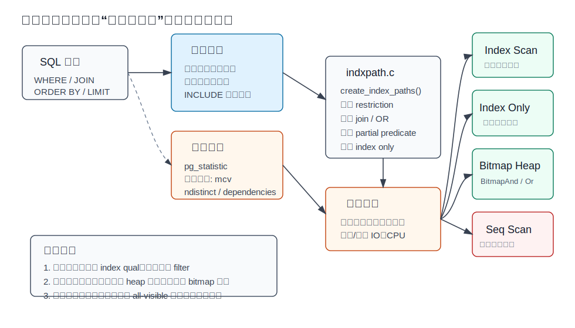
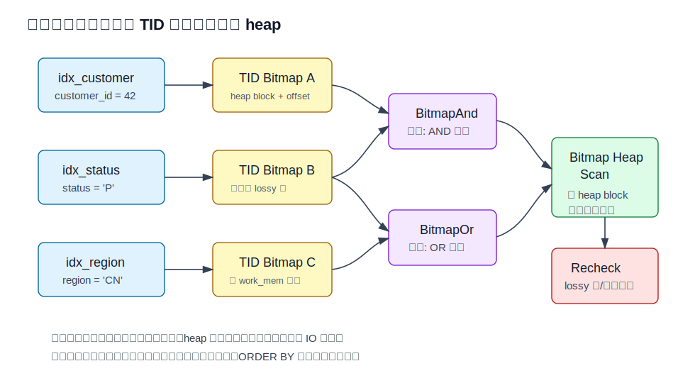
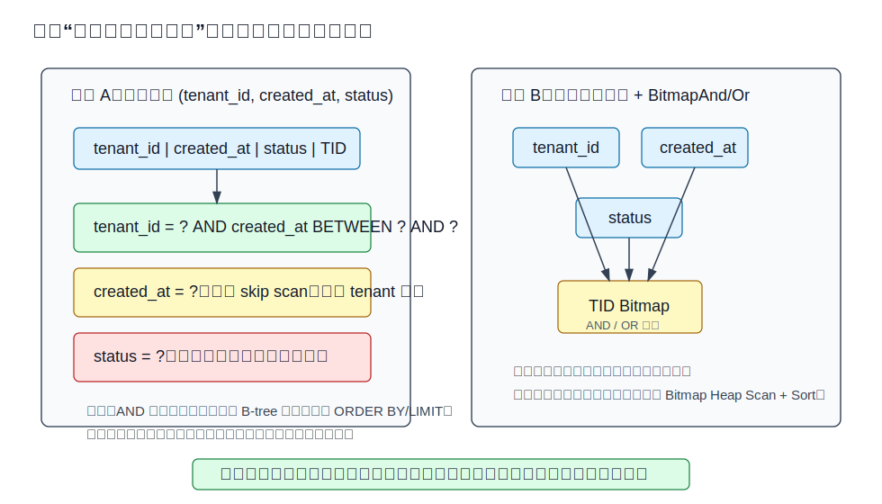
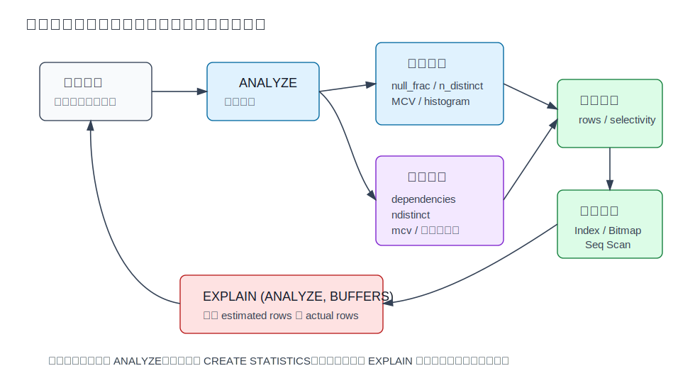
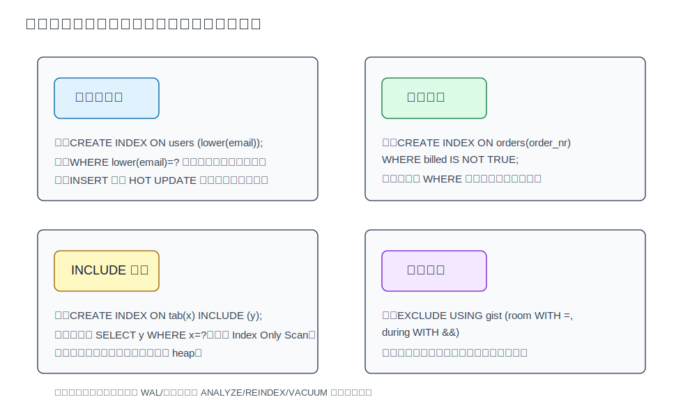

## 数据库筑基课 - 最佳实践之 索引(多索引的选择及bitmapAnd/bitmapOr、多列组合索引、索引统计信息、express index、partial index、include index、exclusive constraint index)

### 作者
digoal

### 日期
2026-06-01

### 标签
PostgreSQL , 应用开发者 , 数据库筑基课 , 索引 , 优化器 , Bitmap Scan , 统计信息    

----

## 背景


本文属于[应用开发者数据库筑基课大纲](../202409/20240914_01.md)里“索引、执行计划、统计信息与应用建模”这一类基础能力。

很多慢 SQL 的根因不是“没有索引”，而是“索引和查询族不匹配”：

- 表上有 `idx_a`、`idx_b`、`idx_a_b`，但查询到底该靠哪个？
- `WHERE a = ? AND b = ?` 用多列索引好，还是两个单列索引通过 `BitmapAnd` 合并好？
- `WHERE lower(email) = ?` 为什么普通 `email` 索引用不上？
- `WHERE billed IS NOT TRUE` 只查少量热数据，是否该做部分索引？
- 为了 `SELECT y FROM t WHERE x = ?` 加 `INCLUDE (y)`，为什么有时仍然有 heap fetch？
- 防止会议室时间段重叠，为什么不是普通唯一索引，而是排他约束索引？

索引设计的第一原则是：**索引不是字段的附属物，而是访问路径的物化。** 访问路径由查询谓词、排序、返回列、数据分布、MVCC 可见性、写入频率共同决定。

## 一、它解决什么问题？

索引选择解决的是“如何用尽量小的读放大换取可接受的写放大”的问题。

没有索引时，数据库只能扫描更多 heap page；索引太多时，每次 `INSERT`、`UPDATE`、`DELETE` 都要维护更多结构，WAL、锁竞争、autovacuum、缓存污染也会上升。更麻烦的是，多个看似合理的索引会让优化器产生更多候选路径，但不一定产生更好的计划。

典型问题可以拆成四类：

| 问题 | 错误做法 | 更好的目标 |
|---|---|---|
| 多条件过滤 | 给每个字段都建索引 | 按查询族选择组合索引、单列索引或 bitmap 组合 |
| 表达式过滤 | 只给原始列建索引 | 对稳定且高频的表达式建表达式索引，或只建表达式统计 |
| 热子集查询 | 全表大索引覆盖所有值 | 用 partial index 只索引高价值子集 |
| 覆盖查询 | 把所有返回列都放进 key | 用 INCLUDE 存 payload，争取 index only scan |
| 互斥约束 | 用触发器手写查重 | 用 exclusion constraint 让索引参与并发一致性检查 |

代价也要提前说清楚：索引越贴近查询，越可能变窄、变快；但也越依赖 workload 稳定、统计信息准确、SQL 写法一致。

## 二、它是什么？

在 PostgreSQL 里，索引至少有三层含义。

1. **物理结构**：B-tree、GiST、GIN、BRIN、SP-GiST、Hash 等访问方法，决定怎样组织 key、怎样搜索、是否支持排序、是否支持 index only scan。
2. **优化器路径**：`Index Scan`、`Index Only Scan`、`Bitmap Index Scan + Bitmap Heap Scan`、`BitmapAnd`、`BitmapOr` 等计划节点，决定 SQL 是否以及如何使用索引。
3. **约束载体**：主键、唯一约束、排他约束会自动创建或依赖索引，用索引保证数据规则。

本文聚焦 B-tree 和通用优化器选择，因为它们覆盖最多 OLTP 和 SaaS 业务场景。GiST/GIN/BRIN 等索引访问方法有各自的数据类型和操作符类边界，但“查询条件是否能变成 index qual、行数估算是否准确、维护代价是否值得”这几个问题是共通的。



图 1 说明：优化器不是看到索引就用。`src/backend/optimizer/path/indxpath.c` 的 `create_index_paths()` 会为一个 relation 检查候选索引，匹配 restriction clause、join clause、OR clause、排序路径、partial predicate 和 index only 条件，再把候选路径交给成本模型比较。统计信息偏差会直接影响这个决策。

## 三、核心原理

### 3.1 普通 Index Scan：适合少量行、可利用顺序的查询

普通索引扫描先在索引中定位匹配 key，再按 TID 回表访问 heap。它的优势是：

- 对选择性高的条件很快，例如主键、唯一键、小范围时间窗口。
- B-tree 可以输出有序结果，常能服务 `ORDER BY ... LIMIT`。
- 不需要构造 bitmap，启动成本低。

它的短板也很直接：如果命中行很多，TID 指向的 heap page 可能分散，随机访问成本会很高。官方文档强调 PostgreSQL 的索引是 secondary index，索引和 heap 分离；普通 index scan 常要同时读索引和 heap。

### 3.2 多索引组合：BitmapAnd / BitmapOr 不是“免费叠 buff”

PostgreSQL 可以把多个索引的结果先转成 TID bitmap，再做 AND/OR 合并：

- `WHERE x = 5 AND y = 6` 可以分别扫描 `idx_x`、`idx_y`，再 `BitmapAnd`。
- `WHERE x = 42 OR x = 47 OR x = 53` 可以多次使用同一个索引，再 `BitmapOr`。
- 合并完成后进入 `Bitmap Heap Scan`，按 heap block 的物理顺序访问表。



图 2 说明：bitmap scan 的收益是把分散 TID 先聚合，减少随机 heap 访问；代价是要扫描多个索引、构造位图、丢失原索引顺序。查询有 `ORDER BY` 时，bitmap 结果通常还需要额外排序。

源码里，`choose_bitmap_and()` 明确没有枚举所有索引子集，因为复杂度会变成 `O(2^N)`。它先去掉使用相同 WHERE 条件集合但更贵的路径，再按成本排序，尝试 `O(N^2)` 级别的组合；如果加入一个新 bitmap path 不能降低总成本，就拒绝它。这解释了一个常见现象：**有多个可用索引，不代表计划里会全部使用。**

执行器层面，`nodeBitmapAnd.c` 的 `MultiExecBitmapAnd()` 会逐个执行子计划并用 `tbm_intersect()` 求交集；如果中途 bitmap 已空，可以提前停止。`nodeBitmapOr.c` 则用 `tbm_union()` 求并集，并对 BitmapIndexScan 子节点做了直接写入当前 bitmap 的优化。

### 3.3 多列组合索引：左前缀、skip scan 与列顺序

多列索引不是把多个单列索引简单粘起来。以 B-tree `(a, b, c)` 为例：

- 前导列上的等值条件最关键，例如 `a = ?`。
- 第一个没有等值条件的列，如果有范围条件，可以限制扫描区间，例如 `a = ? AND b >= ?`。
- 更右侧列的条件可以在索引中检查，减少回表，但不一定减少要扫描的索引范围。
- 新版本 PostgreSQL 文档还强调 skip scan：如果缺失前导列等值条件，但前导列 distinct 值很少，优化器可能内部生成动态等值搜索，重复定位到后续列条件能命中的小范围。



图 3 说明：如果查询族高度固定，例如 `tenant_id = ? AND created_at BETWEEN ? AND ? ORDER BY created_at LIMIT ?`，组合索引通常比 bitmap 组合更好，因为它既过滤又保序。如果查询组合很分散，例如有时只查 `tenant_id`，有时只查 `status`，有时两者组合，少量单列索引加 bitmap 组合可能更灵活。

不同访问方法的多列规则也不一样：

| 索引方法 | 多列索引特点 | 设计重点 |
|---|---|---|
| B-tree | 最依赖左侧列；可服务排序；可能 skip scan | 等值列、范围列、排序列顺序 |
| GiST | 任意子集可用，但第一列通常决定扫描范围 | 把区分度高、能缩小搜索空间的列放前面 |
| GIN | 查询任意列效果相对均衡 | 关注 token 数量、posting list、recheck 成本 |
| BRIN | 任意列效果相对均衡 | 关注物理相关性和 `pages_per_range` |

### 3.4 统计信息：索引路径选择的地基

索引是否被选中，核心输入之一是行数估算。行数估算来自：

- `pg_class` 的 `relpages`、`reltuples`。
- `pg_statistic` / `pg_stats` 的 null 比例、distinct 估计、most common values、histogram、correlation。
- `CREATE STATISTICS` 产生的扩展统计：`dependencies`、`ndistinct`、`mcv`，以及表达式统计。



图 4 说明：索引设计必须和统计信息闭环。`ANALYZE` 采样过旧或统计目标过低，会让优化器低估或高估返回行数；多列相关性强时，如果没有扩展统计，优化器可能把两个条件当成独立条件相乘，导致严重误判。

官方 `planstats.sgml` 给了一个很典型的例子：表 `t(a,b)` 中 `a` 和 `b` 完全相关，单列条件 `a=1` 估算准确，但 `a=1 AND b=1` 会因为独立性假设被估成实际值的百分之一；创建 `CREATE STATISTICS stts (dependencies) ON a, b FROM t;` 并 `ANALYZE` 后，估算恢复准确。

需要注意两个边界：

- `CREATE STATISTICS` 不等于创建索引，它只改善估算，不提供访问结构。
- PostgreSQL 文档说明扩展统计目前不用于表连接 selectivity 估算；它主要改善单表多条件、分组 distinct、表达式统计等场景。

### 3.5 表达式索引：把“计算后的值”物化进索引

普通索引 `CREATE INDEX ON users(email)` 不能直接服务：

```sql
SELECT * FROM users WHERE lower(email) = 'a@example.com';
```

因为查询条件作用在 `lower(email)` 上，不是原始 `email`。表达式索引的做法是：

```sql
CREATE INDEX users_lower_email_idx ON users (lower(email));
```

这样优化器可以把条件看成“索引列 = 常量”。官方文档同时提醒：表达式索引在搜索时不用重新计算表达式，但在插入和非 HOT 更新时必须维护表达式值。因此它适合“读多、表达式稳定、高频命中”的场景。

如果你只是希望优化器知道表达式的分布，但不需要通过它定位行，可以考虑表达式统计：

```sql
CREATE STATISTICS users_lower_email_stats ON lower(email) FROM users;
ANALYZE users;
```

这不会加速定位，但能改善行数估算，并避免索引维护开销。

### 3.6 部分索引：只索引你真正会查的子集

部分索引只包含满足谓词的行：

```sql
CREATE INDEX orders_unbilled_order_nr_idx
ON orders (order_nr)
WHERE billed IS NOT TRUE;
```

它适合热子集很小、查询条件稳定的场景，例如“未结算订单”“有效状态用户”“最近未处理任务”。收益是索引更小、缓存命中更好、写入时不是每行都要维护该索引。

边界比很多人想象得严格。PostgreSQL 只有在查询 `WHERE` 能推出索引谓词时才会考虑 partial index。官方文档明确说 PostgreSQL 没有通用定理证明器；除了简单不等式推理，通常要求谓词写法和查询条件能被规划期识别。参数化 SQL 也容易踩坑：

```sql
-- 可识别
SELECT * FROM orders
WHERE billed IS NOT TRUE AND order_nr < 10000;

-- 不能使用这个 partial index，因为没有证明 billed IS NOT TRUE
SELECT * FROM orders
WHERE order_nr = 3501;
```

不要用大量互斥 partial index 替代表分区。例如：

```sql
CREATE INDEX mytable_cat_1 ON mytable (data) WHERE category = 1;
CREATE INDEX mytable_cat_2 ON mytable (data) WHERE category = 2;
...
```

官方文档把这列为反例：优化器不理解这些 partial index 之间互斥关系，会逐个测试适用性；很多时候一个 `(category, data)` 组合索引或真正的分区表更合适。

### 3.7 INCLUDE 索引：覆盖返回列，但不改变搜索 key

`INCLUDE` 列是 payload，不参与 B-tree 搜索顺序，也不参与唯一性判断：

```sql
CREATE INDEX tab_x_inc_y_idx ON tab (x) INCLUDE (y);

CREATE UNIQUE INDEX tab_x_unique_inc_y_idx ON tab (x) INCLUDE (y);
-- 唯一性只约束 x，不约束 (x, y)
```

它的目标是让查询需要的列都能从索引返回：

```sql
SELECT y FROM tab WHERE x = 'key';
```

但 index only scan 还有一个 MVCC 条件：可见性信息不在索引项里，而在 heap tuple 里。PostgreSQL 通过 visibility map 记录 heap page 是否 all-visible；如果对应 heap page 的 all-visible bit 没置位，仍然要访问 heap 验证可见性。因此，`INCLUDE` 索引最适合更新少、autovacuum 能及时推进可见性图、读多写少的表。

还有一个很现实的边界：索引 tuple 变宽后，B-tree 层级、缓存占用、写入 WAL 都会上升。官方 B-tree 文档还指出，带 `INCLUDE` 的 B-tree 索引不能使用 deduplication。不要把它当成“把 SELECT 列都塞进去”的万能技巧。

### 3.8 排他约束索引：用索引表达“不允许同时为真”

唯一索引只能表达“相等值不能重复”。排他约束表达的是：任意两行在指定列或表达式上用指定操作符比较时，不能所有比较都为 `TRUE`。

典型例子是会议室预约不能时间重叠：

```sql
CREATE EXTENSION IF NOT EXISTS btree_gist;

CREATE TABLE room_booking (
    room_id int NOT NULL,
    during  tstzrange NOT NULL,
    EXCLUDE USING gist (
        room_id WITH =,
        during WITH &&
    )
);
```

`room_id WITH =` 表示同一个房间，`during WITH &&` 表示时间范围重叠。排他约束会自动创建对应索引。官方 `CREATE TABLE` 文档说明，如果所有操作符都是等值，排他约束等价于唯一约束，但普通唯一约束更快；排他约束的价值在于表达范围重叠、几何相交、相邻冲突等更一般的互斥关系。

边界：

- 操作符必须是 commutative，并且要和索引访问方法的 operator class 关联。
- 访问方法必须支持 `amgettuple`；官方文档说明 GIN 不能用于 exclusion constraint，实践中常用 GiST 或 SP-GiST。
- 排他约束也可以带 `WHERE` 谓词，内部形成 partial index。



图 5 说明：这四类索引解决的是不同问题。表达式索引解决“按计算值定位”，部分索引解决“只索引子集”，INCLUDE 解决“覆盖返回列”，排他约束索引解决“并发下的数据互斥规则”。把它们混在一起设计，很容易得到又宽又难维护的索引。

## 四、横向对比

| 维度 | 多列组合索引 | 多个单列索引 + Bitmap | 表达式索引 | 部分索引 | INCLUDE 索引 | 排他约束索引 |
|---|---|---|---|---|---|---|
| 主要目标 | 固定查询族的过滤、排序、LIMIT | 分散查询组合的灵活过滤 | 按计算后的值定位 | 只覆盖热子集或稀有子集 | 覆盖返回列，争取少回表 | 表达复杂互斥规则 |
| 读取代价 | 高频匹配时低 | 要构造 bitmap，命中多时常优于随机回表 | 搜索快，表达式已物化 | 索引小，命中子集快 | heap fetch 少时收益大 | 插入/更新时检查冲突 |
| 写入代价 | 维护宽 key | 维护多个索引 | 计算表达式并维护索引 | 只对子集维护 | 索引 tuple 更宽 | 约束检查更复杂 |
| 排序能力 | B-tree 可保序 | bitmap 会丢失索引顺序 | 取决于表达式和访问方法 | 取决于 key | key 列可保序，INCLUDE 不参与排序 | 通常不是为排序设计 |
| 统计依赖 | 强，尤其列相关和 distinct | 强，决定是否值得 AND/OR | 表达式分布影响估算 | 谓词选择性很关键 | all-visible 比例很关键 | 依赖 operator class 和冲突分布 |
| 适合场景 | 租户+时间、状态+时间、ORDER BY/LIMIT | 任意字段组合筛选、临时报表 | lower(email)、date_trunc(ts) | 未处理任务、有效数据、稀有状态 | 读多写少、窄 payload | 会议室时间、范围重叠、空间相交 |
| 不适合场景 | 查询组合很分散、列太多 | 强排序分页、极低延迟点查 | 写入频繁且表达式昂贵 | 谓词不稳定、SQL 写法不一致 | 高频更新、大字段 payload | 纯等值唯一约束 |

这张表的重点不是背结论，而是看代价从哪里来：组合索引用空间换固定路径；bitmap 用额外 CPU/内存换灵活组合；表达式索引用写时计算换读时定位；partial index 用 workload 假设换更小结构；INCLUDE 用更宽索引换少回表；排他约束索引用更强索引检查换并发正确性。

## 五、效果如何？

效果应该用三类指标验证。

第一类是执行计划：

```sql
EXPLAIN (ANALYZE, BUFFERS)
SELECT *
FROM orders
WHERE customer_id = 42
  AND status = 'pending';
```

重点看：

- `Index Cond`：真正进入索引定位的条件。
- `Filter`：索引之后才过滤的条件，可能表示索引列顺序或表达式不匹配。
- `Recheck Cond`：bitmap heap scan 或 lossy index 需要重检的条件。
- `Heap Blocks: exact/lossy`：bitmap 是否因内存限制或索引特性变 lossy。
- `Heap Fetches`：index only scan 是否真的少回表。
- `rows` 估算和 `actual rows`：统计信息是否支撑当前计划。
- `Buffers`：是否真的减少了 heap 读。

第二类是写入代价：

```sql
EXPLAIN (ANALYZE, BUFFERS)
UPDATE orders
SET status = 'done'
WHERE order_id = 10001;
```

索引越多，更新涉及的索引维护越多。PostgreSQL 的 `EXPLAIN` 不会把所有索引维护成本完整体现在子扫描节点里，所以还要结合 `pg_stat_user_indexes`、`pg_stat_all_tables`、WAL、延迟分位数观察。

第三类是维护状态：

```sql
SELECT
  schemaname, relname, indexrelname,
  idx_scan, idx_tup_read, idx_tup_fetch
FROM pg_stat_user_indexes
WHERE relname = 'orders'
ORDER BY idx_scan DESC;
```

长期 `idx_scan = 0` 的索引不一定能删，但必须解释它存在的理由：约束、极低频高价值查询、应急查询、或历史遗留。

## 六、实操 DEMO

下面 SQL 是可执行示例，用于观察多索引组合、多列索引、partial index、expression index、INCLUDE index 和 exclusion constraint。本文没有在本机启动 PostgreSQL 实例执行，因此不提供伪造输出；请在测试库执行并以实际 `EXPLAIN` 为准。

### 6.1 准备数据

```sql
DROP TABLE IF EXISTS orders_demo;

CREATE TABLE orders_demo (
    id          bigserial PRIMARY KEY,
    tenant_id   int NOT NULL,
    customer_id int NOT NULL,
    status      text NOT NULL,
    billed      boolean NOT NULL DEFAULT false,
    email       text NOT NULL,
    amount      numeric(12,2) NOT NULL,
    created_at  timestamptz NOT NULL DEFAULT now()
);

INSERT INTO orders_demo
    (tenant_id, customer_id, status, billed, email, amount, created_at)
SELECT
    (g % 50) + 1,
    (g % 20000) + 1,
    CASE WHEN g % 20 = 0 THEN 'pending'
         WHEN g % 20 = 1 THEN 'failed'
         ELSE 'done'
    END,
    (g % 20) NOT IN (0, 1),
    'User' || (g % 20000) || '@Example.com',
    (random() * 1000)::numeric(12,2),
    now() - (g || ' minutes')::interval
FROM generate_series(1, 1000000) AS g;

ANALYZE orders_demo;
```

### 6.2 多个单列索引与 BitmapAnd

```sql
CREATE INDEX orders_demo_customer_idx ON orders_demo (customer_id);
CREATE INDEX orders_demo_status_idx ON orders_demo (status);
ANALYZE orders_demo;

EXPLAIN (ANALYZE, BUFFERS)
SELECT *
FROM orders_demo
WHERE customer_id = 42
  AND status = 'pending';
```

如果两个条件各自有选择性，可能看到 `BitmapAnd`。如果其中一个条件已经足够精准，优化器也可能只用一个索引再 filter，这是合理的成本选择。

### 6.3 多列索引服务固定查询族

```sql
CREATE INDEX orders_demo_tenant_created_idx
ON orders_demo (tenant_id, created_at DESC);

EXPLAIN (ANALYZE, BUFFERS)
SELECT id, amount, created_at
FROM orders_demo
WHERE tenant_id = 10
ORDER BY created_at DESC
LIMIT 20;
```

这个查询族适合组合索引，因为它同时需要过滤、排序和 `LIMIT`。bitmap scan 会丢失索引顺序，而 B-tree index scan 可以直接按索引顺序返回前 20 行。

### 6.4 表达式索引

```sql
CREATE INDEX orders_demo_lower_email_idx
ON orders_demo (lower(email));

EXPLAIN (ANALYZE, BUFFERS)
SELECT *
FROM orders_demo
WHERE lower(email) = 'user42@example.com';
```

注意 SQL 表达式要和索引表达式可匹配。业务上更推荐在写入时规范化 email，并用规范化列建唯一约束；表达式索引适合兼容历史数据或无法改 schema 的场景。

### 6.5 部分索引

```sql
CREATE INDEX orders_demo_unbilled_customer_idx
ON orders_demo (customer_id)
WHERE billed IS NOT TRUE;

EXPLAIN (ANALYZE, BUFFERS)
SELECT *
FROM orders_demo
WHERE billed IS NOT TRUE
  AND customer_id = 42;
```

如果查询去掉 `billed IS NOT TRUE`，这个 partial index 通常不能使用，因为优化器无法证明 `customer_id = 42` 只会命中未结算订单。

### 6.6 INCLUDE 索引与 index only scan

```sql
CREATE INDEX orders_demo_customer_inc_amount_idx
ON orders_demo (customer_id) INCLUDE (amount, created_at);

VACUUM (ANALYZE) orders_demo;

EXPLAIN (ANALYZE, BUFFERS)
SELECT amount, created_at
FROM orders_demo
WHERE customer_id = 42;
```

如果计划是 `Index Only Scan`，继续看 `Heap Fetches`。刚大量更新过的表，即使索引覆盖了所有列，也可能因为 visibility map 未置位而回表。

### 6.7 扩展统计改善多列估算

```sql
CREATE STATISTICS orders_demo_tenant_status_stats (dependencies, mcv)
ON tenant_id, status
FROM orders_demo;

ANALYZE orders_demo;

EXPLAIN (ANALYZE, BUFFERS)
SELECT *
FROM orders_demo
WHERE tenant_id = 10
  AND status = 'pending';
```

扩展统计不会直接生成新的访问路径，但能让行数估算更接近真实值，从而影响 index scan、bitmap scan、seq scan 的选择。

### 6.8 排他约束索引

```sql
CREATE EXTENSION IF NOT EXISTS btree_gist;

DROP TABLE IF EXISTS room_booking_demo;

CREATE TABLE room_booking_demo (
    room_id int NOT NULL,
    during  tstzrange NOT NULL,
    EXCLUDE USING gist (
        room_id WITH =,
        during WITH &&
    )
);

INSERT INTO room_booking_demo VALUES
(1, tstzrange('2026-06-01 10:00+08', '2026-06-01 11:00+08'));

-- 这条应被排他约束拒绝，因为同一 room_id 的时间范围重叠
INSERT INTO room_booking_demo VALUES
(1, tstzrange('2026-06-01 10:30+08', '2026-06-01 11:30+08'));
```

这类规则不要用“插入前先 SELECT 查冲突”的应用逻辑替代。并发下，应用侧查重很容易出现竞态；排他约束把规则交给数据库索引和锁机制处理。

## 七、最佳实践

### 面向数据库架构师

1. 先收集查询族，再设计索引。把 SQL 按 `WHERE`、`JOIN`、`ORDER BY`、`GROUP BY`、`LIMIT` 和返回列分类，而不是按字段热度孤立建索引。
2. 多租户系统常见顺序是 `(tenant_id, business_key)` 或 `(tenant_id, created_at DESC)`，但不要机械套用；如果查询跨租户汇总很多，租户前缀会变成负担。
3. 对状态枚举列要谨慎建单列索引。低基数列单独过滤常不划算，但和租户、时间、部分索引组合后可能很有价值。
4. 约束优先用数据库原生表达：唯一约束、partial unique index、exclusion constraint 比应用侧查重更可靠。
5. 写入高峰表控制索引数量。每多一个索引，都是写入路径、WAL、checkpoint、vacuum 的长期成本。

### 面向 DBA

1. 用 `EXPLAIN (ANALYZE, BUFFERS)` 验证索引收益，不只看是否出现 `Index Scan`。
2. 重点排查估算偏差：`rows` 和 `actual rows` 差几个数量级时，先考虑 `ANALYZE`、统计目标、扩展统计，而不是先加索引。
3. 监控 `pg_stat_user_indexes`：低使用索引、重复索引、宽 INCLUDE 索引、未命中 partial index 都要定期审计。
4. 对 index only scan，关注 `Heap Fetches` 和 autovacuum 是否能及时设置 visibility map。
5. 对 partial index，定期验证谓词选择性是否仍然成立。业务状态分布变了，partial index 可能从收益变成负担。

### 面向业务开发者

1. SQL 写法要稳定。partial index 和 expression index 都要求查询条件能被优化器识别；随意改写表达式、隐式类型转换、函数包裹列都可能破坏索引匹配。
2. 不要在索引列上做无谓函数计算。例如 `WHERE date_trunc('day', created_at) = ?` 常不如写成范围条件，除非你明确创建表达式索引。
3. 分页要利用索引顺序。深分页 `OFFSET` 很大时，即使有索引也会读很多行；优先考虑 seek pagination。
4. 不要要求“每个筛选字段都建索引”。筛选组合很多时，应该和 DBA 一起看最常见、最贵、最有业务价值的查询族。
5. 对唯一性和互斥规则，优先写成数据库约束，让错误在数据库层稳定暴露。

## 八、适合与不适合场景

### 适合

- 高频点查、小范围范围查、`ORDER BY ... LIMIT`。
- 查询族稳定，列顺序可预测。
- 热子集小且谓词稳定，例如未处理订单、有效任务。
- 读多写少，适合用 INCLUDE 或表达式索引换取读性能。
- 需要数据库层保证唯一或互斥规则。
- 多列强相关，适合用扩展统计改善估算。

### 不适合

- 小表。官方 `EXPLAIN` 文档提醒，一页或很小的表经常顺序扫描更便宜。
- 大比例返回行。索引定位后大量回表，可能比顺序扫描更慢。
- 写入极高且查询收益不明确的表。
- 谓词随业务频繁变化的 partial index。
- 把很多大字段塞进 INCLUDE，只为偶发查询“覆盖”。
- 用 partial index 伪装分区。
- 用 exclusion constraint 表达纯等值唯一性；普通 unique constraint 更快。

## 九、常见坑

1. **只看有没有索引，不看 `Index Cond`。** 条件出现在 `Filter` 里，说明它没有真正参与索引定位。
2. **以为 bitmap 会保留索引顺序。** bitmap heap scan 按 heap 物理块访问，原索引顺序会丢失。
3. **多列索引列顺序拍脑袋。** B-tree 的前导列、范围列、排序列顺序直接决定扫描范围。
4. **给低基数字段建孤立索引。** `status`、`gender`、`deleted` 这类字段单独建索引常常收益差，但可用于 partial 或组合索引。
5. **partial index 谓词和 SQL 写法不一致。** `billed IS NOT TRUE`、`billed = false`、`coalesce(billed,false)=false` 不一定等价到优化器可识别。
6. **INCLUDE 列过宽。** payload 列虽然不参与搜索，但会占索引空间，影响缓存和写入。
7. **误判 index only scan。** 计划名字是 `Index Only Scan`，但 `Heap Fetches` 很高时，实际收益有限。
8. **忘记扩展统计。** 多列相关性强时，单列统计会让优化器误以为条件独立。
9. **重复建约束索引。** 主键和唯一约束已自动创建索引，手工再建相同索引只是增加写入成本。
10. **应用侧查重替代排他约束。** 并发插入下，先查再写不是可靠互斥。

## 十、扩展问题

1. 对一个典型 SaaS 订单表，`tenant_id` 应该放在所有组合索引第一列吗？什么场景下不应该？
2. `WHERE a = ? AND b BETWEEN ? AND ? ORDER BY c LIMIT 20` 应该如何设计 B-tree 索引？如果 `b` 是范围列，`c` 的排序还能被完整利用吗？
3. `idx_a`、`idx_b`、`idx_a_b` 三个索引同时存在时，如何判断哪个可以删除？
4. 对一个频繁更新的表，为什么 INCLUDE 索引可能让 index only scan 的预期落空？
5. partial index 的谓词变成业务配置项后，还适合继续使用吗？
6. 扩展统计改善估算后，为什么可能让优化器从 index scan 改选 seq scan？这一定是坏事吗？

## 十一、扩展阅读

- PostgreSQL 官方文档：`doc/src/sgml/indices.sgml`，Multicolumn Indexes、Combining Multiple Indexes、Indexes on Expressions、Partial Indexes、Index-Only Scans and Covering Indexes。
- PostgreSQL 官方文档：`doc/src/sgml/planstats.sgml`，Planner Statistics 与 Multivariate Statistics Examples。
- PostgreSQL 官方文档：`doc/src/sgml/ref/create_statistics.sgml`，`CREATE STATISTICS` 的 `dependencies`、`ndistinct`、`mcv`、表达式统计。
- PostgreSQL 官方文档：`doc/src/sgml/ddl.sgml` 与 `doc/src/sgml/ref/create_table.sgml`，Exclusion Constraints。
- PostgreSQL 源码：`src/backend/optimizer/path/indxpath.c`，`create_index_paths()`、`choose_bitmap_and()`、`check_index_only()`、`check_index_predicates()`。
- PostgreSQL 源码：`src/backend/executor/nodeBitmapAnd.c`、`src/backend/executor/nodeBitmapOr.c`，bitmap 交集和并集执行逻辑。
- PostgreSQL 源码：`src/backend/executor/execIndexing.c`，唯一约束和排他约束检查。
- PostgreSQL 源码：`src/backend/commands/indexcmds.c`，索引创建、排他约束访问方法检查和 operator class 关联。
- DeepWiki：`postgres/postgres`，Query Processing Pipeline、System Catalogs and Built-in Functions 相关页面。
  
## 附录 
1、克隆代码  
```  
git clone --depth 1 https://github.com/postgres/postgres
```  
  
2、启用 codex, 使用 [数据库筑基课 skill](../skills/README.md).  
```
文章标题: 
  数据库筑基课 - 最佳实践之 索引(多索引的选择及bitmapAnd/bitmapOr、多列组合索引、索引统计信息、express index、partial index、include index、exclusive constraint index)
项目源码(本地目录): 
  postgres
项目 codebase 文件名: 
  postgres/CLAUDE.md 
开源项目相关的 deepwiki repoName: 
  postgres/postgres
```
  
  
#### [PostgreSQL 解决方案集合](../201706/20170601_02.md "40cff096e9ed7122c512b35d8561d9c8")
  
  
#### [德哥 / digoal's Github - 公益是一辈子的事.](https://github.com/digoal/blog/blob/master/README.md "22709685feb7cab07d30f30387f0a9ae")
  
  
#### [About 德哥](https://github.com/digoal/blog/blob/master/me/readme.md "a37735981e7704886ffd590565582dd0")
  
  

  
