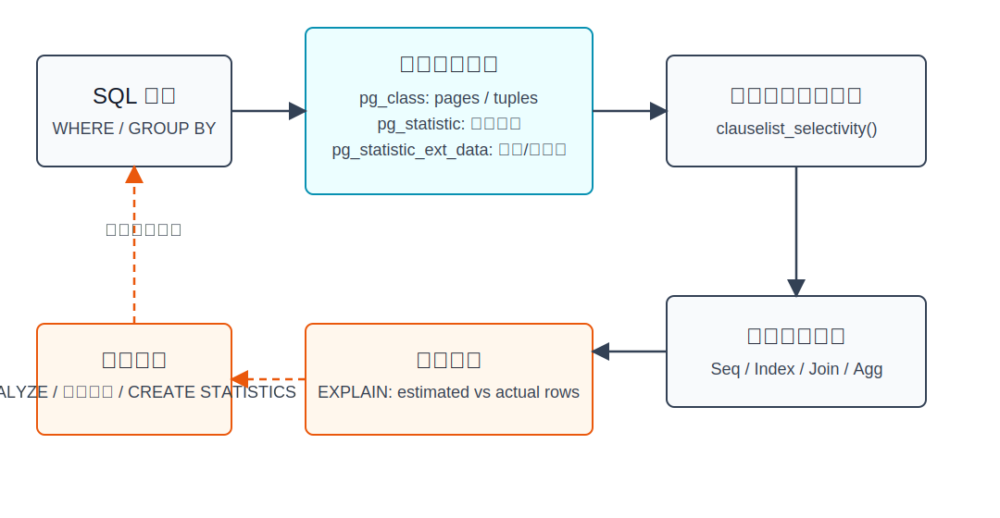
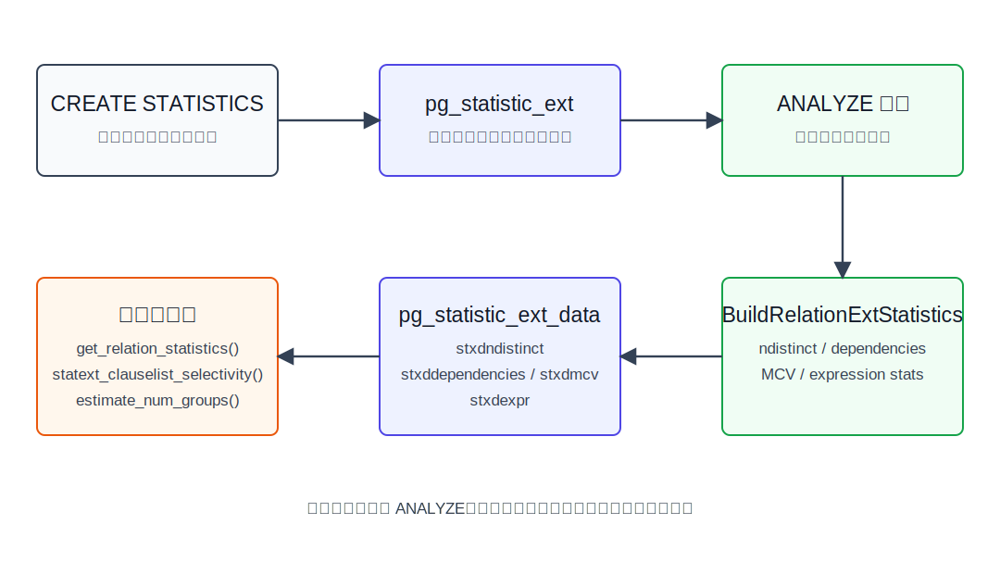
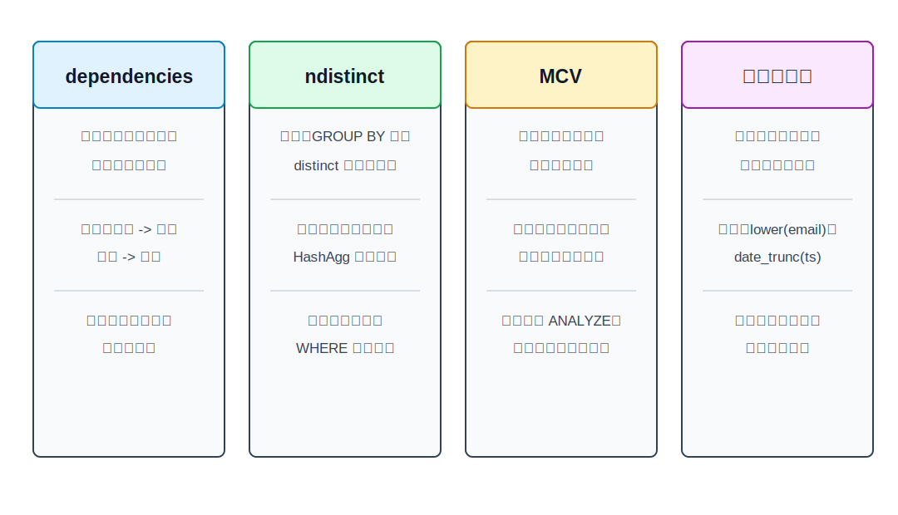
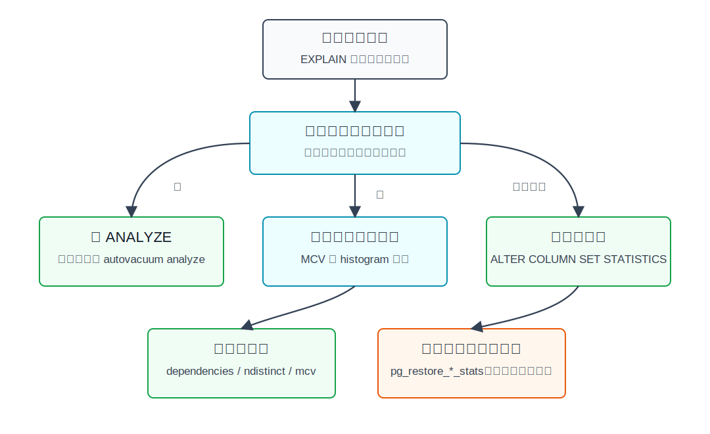

## 数据库筑基课 - 最佳实践之 自定义统计信息

### 作者
digoal

### 日期
2026-06-01

### 标签
PostgreSQL , 应用开发者 , 数据库筑基课 , 优化器 , 统计信息 , CREATE STATISTICS    

----

## 背景


本文属于[应用开发者数据库筑基课大纲](../202409/20240914_01.md)里“索引、执行计划、统计信息与应用建模”这一类基础能力。

很多慢 SQL 的根因不是执行器慢，而是优化器在一开始就“看错了世界”：

- `WHERE tenant_id = ? AND status = ?` 实际返回几十万行，优化器估成几十行，选了嵌套循环。
- `GROUP BY province, city` 实际只有几百组，优化器估成几万组，错误放大内存和排序成本。
- `WHERE lower(email) = ?` 没有表达式统计，优化器只能用默认选择率猜。
- 数据刚恢复完、批量导入完，还没来得及 `ANALYZE`，计划临时抖动。

自定义统计信息解决的是这个问题：**让优化器用更接近业务真实分布的数据做估算，而不是把列之间、表达式结果、热门组合都当成独立且均匀。**

这里的“自定义统计信息”包含四层：

1. 调整普通列统计目标，例如 `ALTER TABLE ... ALTER COLUMN ... SET STATISTICS`。
2. 使用 `CREATE STATISTICS` 创建扩展统计对象，包括 `dependencies`、`ndistinct`、`mcv` 和表达式统计。
3. 用 `pg_stats`、`pg_stats_ext`、`pg_mcv_list_items()` 检查统计内容。
4. 在恢复或特殊运维窗口，用 `pg_restore_relation_stats`、`pg_restore_attribute_stats`、`pg_restore_extended_stats` 临时恢复统计信息。注意：本地 PostgreSQL 源码和文档明确提示，这类手工修改会被 autovacuum、手工 `VACUUM` 或 `ANALYZE` 覆盖，应视为临时手段。

## 一、它解决什么问题？

优化器选择计划时，先要回答三个问题：

- 一个过滤条件会留下多少行？
- 多个过滤条件组合后会留下多少行？
- 聚合、连接、排序、中间结果会有多大？

普通统计信息主要按单列收集，包括 null 比例、平均宽度、distinct 估计、MCV、histogram、correlation 等。问题在于业务数据经常不是单列独立的。

例如订单表中 `tenant_id`、`country`、`currency`、`status` 常常互相关联。优化器如果把 `tenant_id = 1` 和 `currency = 'CNY'` 当成独立条件相乘，就可能严重低估或高估返回行数。行数估错后，后面的索引扫描、Bitmap Scan、Hash Join、Nested Loop、HashAggregate、Sort 都会被连带影响。



图 1 说明：统计信息不是“数据库后台杂务”，而是计划选择的输入。`EXPLAIN (ANALYZE)` 看到 estimated rows 和 actual rows 差距很大时，不要第一反应就加索引；先判断是不是统计信息表达不了真实分布。

代价也要讲清楚：更细的统计信息会增加 `ANALYZE` 成本、系统目录存储、规划期计算成本；手工恢复统计值还能引入人为错误。因此它是优化器“认知层”的校准工具，不是替代索引、分区和 SQL 改写的万能药。

## 二、它是什么？

PostgreSQL 的统计信息可以分成三类。

| 类型 | 存储位置 | 主要来源 | 解决的问题 |
|---|---|---|---|
| 表级统计 | `pg_class` | `VACUUM` / `ANALYZE` | 表页数、行数、all-visible/all-frozen 页估算 |
| 单列统计 | `pg_statistic`，通过 `pg_stats` 查看 | `ANALYZE` | 单列选择率、宽度、MCV、直方图、相关性 |
| 扩展统计 | 定义在 `pg_statistic_ext`，数据在 `pg_statistic_ext_data`，通过 `pg_stats_ext` / `pg_stats_ext_exprs` 查看 | `CREATE STATISTICS` + `ANALYZE` | 多列相关性、多列 distinct、热门组合、表达式分布 |

`CREATE STATISTICS` 创建的是统计对象定义，不创建访问路径。它不会像索引一样帮助数据库定位数据页；它只帮助优化器估算“可能返回多少行、多少组”。官方 `CREATE STATISTICS` 文档也明确区分了表达式统计和表达式索引：表达式统计能获得类似表达式索引的分布信息收益，但没有索引维护开销，也没有索引访问能力。

扩展统计支持的类型包括：

- `dependencies`：函数依赖统计，解决多列等值条件被独立性假设误判的问题。
- `ndistinct`：多列 distinct 组合数统计，主要改善多列 `GROUP BY`、去重、聚合规模估算。
- `mcv`：多列 most-common values，记录常见值组合及频率，能处理等值、不等值、NULL、部分 OR/NOT 条件。
- 表达式统计：对 `lower(email)`、`date_trunc('day', ts)`、虚拟生成列等表达式收集单变量统计。



图 2 说明：`CREATE STATISTICS` 只写入 `pg_statistic_ext` 定义；真正的统计值由后续 `ANALYZE` 计算并写入 `pg_statistic_ext_data`。所以创建统计对象后必须执行 `ANALYZE`，否则优化器没有可用数据。

## 三、核心原理

### 3.1 普通统计信息：单列世界观

普通列统计由 `ANALYZE` 采样得到。优化器用这些信息估算单个谓词，例如：

```sql
WHERE status = 'paid'
WHERE created_at >= now() - interval '7 days'
WHERE amount BETWEEN 100 AND 200
```

单列统计足够解决很多问题，但它默认难以知道两列之间的业务关系。PostgreSQL 文档的多变量统计例子非常典型：表 `t(a,b)` 中 `a` 和 `b` 完全相关，单独估算 `a = 1` 很准确；但 `a = 1 AND b = 1` 会因为独立性假设被估成实际值的百分之一。创建 `CREATE STATISTICS stts (dependencies) ON a, b FROM t;` 并 `ANALYZE` 后，估算恢复到实际量级。

### 3.2 扩展统计构建：复用 ANALYZE 样本

源码 `src/backend/statistics/extended_stats.c` 的 `BuildRelationExtStatistics()` 写得很直接：它从 `pg_statistic_ext` 找出当前表的统计对象，复用普通统计采样得到的 rows，然后按对象启用的类型分别调用：

- `statext_ndistinct_build()`，构建多列 distinct 组合估算。
- `statext_dependencies_build()`，构建软函数依赖。
- `statext_mcv_build()`，构建多列 MCV 列表。
- `compute_expr_stats()`，构建表达式统计。

最后通过 `statext_store()` 写入 `pg_statistic_ext_data`。这解释了三个实践细节：

- 扩展统计不是实时维护的，数据变化后需要 `ANALYZE` 刷新。
- 统计目标越高，采样和 MCV 细节越多，但 `ANALYZE` 和规划成本也会上升。
- `stxstattarget = 0` 时不会重建该统计对象，行为类似普通列统计目标为 0。

### 3.3 优化器使用：先尽量用扩展统计，再估剩余条件

源码 `src/backend/optimizer/path/clausesel.c` 的 `clauselist_selectivity_ext()` 会先判断一组条件是否只引用一个普通 relation，并且这个 relation 是否有已构建的扩展统计。满足条件时，它调用 `statext_clauselist_selectivity()` 尽量估算能被扩展统计覆盖的子句，并标记已估算的条件；剩余条件再按普通方式估算。

`src/backend/optimizer/util/plancat.c` 的 `get_relation_statistics_worker()` 会从 `pg_statistic_ext_data` 判断哪些 kind 已经构建，并将 `ndistinct`、`dependencies`、`mcv`、`expressions` 分别加入 relation 的统计信息列表。

边界也很关键：官方 `CREATE STATISTICS` 文档说明，扩展统计目前不用于表连接 selectivity 估算。也就是说：

```sql
-- 更可能受益：单表多条件
SELECT * FROM orders
WHERE tenant_id = 10 AND currency = 'CNY' AND status = 'paid';

-- 当前边界：join 条件的选择率估算通常不能直接靠扩展统计修正
SELECT *
FROM orders o
JOIN tenants t ON o.tenant_id = t.id
WHERE t.region = 'cn';
```

### 3.4 dependencies：便宜，但只表达全局软依赖

`src/backend/statistics/README.dependencies` 说明，PostgreSQL 实现的是“软”函数依赖，每个依赖有一个 0 到 1 的有效度。构建时会枚举可能的依赖，例如 `a => b`，把样本按 `a,b` 排序，检查相同 `a` 组内 `b` 是否唯一，再用支持该依赖的行占比作为依赖强度。

它的估算公式可以理解为：

```text
P(a=?, b=?) = P(a=?) * (d + (1-d) * P(b=?))
```

`d` 越接近 1，说明 `a` 越能决定 `b`，第二个条件就越不该被简单独立相乘。

适合场景：

- `zip_code => city` 这类强业务依赖。
- `tenant_id => region/currency` 这类租户属性依赖。
- 多个等值条件经常一起出现，并且值组合通常一致。

不适合场景：

- 条件经常构造出与依赖冲突的组合，例如 `zip_code = '100000' AND city = 'Shanghai'`。
- 需要区分具体热门组合。`dependencies` 只表达全局依赖，不记录“哪组值特别热”。
- 大量范围条件、不等值条件。此时通常要考虑 `mcv` 或普通 histogram。

### 3.5 ndistinct：服务多列分组和去重

`src/backend/statistics/mvdistinct.c` 的注释说明，多变量 ndistinct 统计会为用户指定列的组合存储 distinct 估算。例如统计对象覆盖 `(a,b,c)`，它会估算 `(a,b)`、`(a,c)`、`(b,c)`、`(a,b,c)` 等组合，单列 distinct 已经由普通统计提供。

它主要影响：

```sql
SELECT tenant_id, status, count(*)
FROM orders
GROUP BY tenant_id, status;
```

如果没有多列 distinct 统计，优化器可能把 distinct 数乘得过大或过小，进而影响 HashAggregate、GroupAggregate、Sort、并行聚合和内存估算。它不直接告诉优化器某个具体值组合是否热门，因此不能替代 `mcv`。

### 3.6 MCV：更准，也更贵

多列 MCV 是最直观也最重的一类扩展统计。`src/backend/statistics/README.mcv` 说明，它记录多列最常见值组合、频率和 base frequency。`base_frequency` 表示如果按单列独立估算，这个组合会有多常见；实际 `frequency` 和 `base_frequency` 差距越大，说明独立性假设越不可靠。

可以通过 `pg_mcv_list_items()` 检查 MCV 内容：

```sql
SELECT m.*
FROM pg_statistic_ext s
JOIN pg_statistic_ext_data d ON d.stxoid = s.oid,
     pg_mcv_list_items(d.stxdmcv) AS m
WHERE s.stxname = 'orders_tenant_status_mcv';
```

适合场景：

- 状态、品类、地域、渠道等低基数字段组合。
- 热门组合非常明显，例如少数租户占据大部分订单。
- 需要识别“不可能组合”或极低频组合。

代价：

- `ANALYZE` 要计算组合频率。
- `pg_statistic_ext_data` 要存储更多数据。
- 规划期要匹配 MCV 项并合计频率。

### 3.7 表达式统计：只改善估算，不提供访问路径

表达式统计适合这种问题：

```sql
SELECT *
FROM users
WHERE lower(email) = 'a@example.com';
```

如果只是需要优化器知道 `lower(email)` 的分布，可以：

```sql
CREATE STATISTICS users_lower_email_stats
ON lower(email)
FROM users;

ANALYZE users;
```

如果还需要快速定位行，则需要表达式索引：

```sql
CREATE INDEX users_lower_email_idx
ON users (lower(email));
```

两者不是替代关系。表达式统计没有索引维护成本，但也不能减少数据访问；表达式索引能提供访问路径，但会增加写入维护、WAL 和存储成本。



图 3 说明：选统计类型不要贪多。`dependencies` 便宜但表达力有限；`ndistinct` 主要服务分组数；`mcv` 对热门组合更准但更重；表达式统计适合“优化器需要知道表达式分布，但不一定需要索引”的场景。

### 3.8 手工恢复统计：运维工具，不是日常调参工具

本地 PostgreSQL 源码包含统计信息直接导入能力：

- `src/backend/statistics/relation_stats.c`：`pg_restore_relation_stats()` / `pg_clear_relation_stats()`，修改 `pg_class` 中的表级统计。
- `src/backend/statistics/attribute_stats.c`：`pg_restore_attribute_stats()` / `pg_clear_attribute_stats()`，修改 `pg_statistic` 中的列级统计。
- `src/backend/statistics/extended_stats_funcs.c`：`pg_restore_extended_stats()` / `pg_clear_extended_stats()`，修改扩展统计数据。

官方管理函数文档给出的用途很窄：恢复后、尚未运行 `ANALYZE` 前，先导入统计信息，让优化器能选择较好计划。文档同时给出警告：这些修改很可能被 autovacuum、手工 `VACUUM` 或 `ANALYZE` 覆盖，应视为临时修改。

所以最佳实践是：

- 迁移或恢复窗口：可以把统计信息作为“预热计划稳定性”的工具。
- 日常线上优化：优先 `ANALYZE`、调统计目标、建扩展统计对象。
- 不要用手工恢复统计值长期掩盖数据分布变化。

## 四、横向对比

| 维度 | 自定义统计信息 | 建索引 | 改 SQL / 改模型 | 分区 |
|---|---|---|---|---|
| 主要目标 | 改善优化器估算 | 提供访问路径 | 改变查询语义表达或数据形态 | 缩小扫描范围和维护边界 |
| 直接减少 IO | 否 | 是 | 视情况 | 是 |
| 写入代价 | 主要在 ANALYZE | 每次写入维护索引 | 视改法 | 分区路由和维护成本 |
| 规划期影响 | 可能增加估算计算 | 增加候选路径 | 可能简化或复杂化 | 增加分区剪枝与路径 |
| 适合问题 | 行数估算偏差 | 选择性高、排序、覆盖 | SQL 不可 sargable、模型错位 | 时间/租户/冷热边界清晰 |
| 不适合问题 | 缺少访问结构 | 数据分布误判但无定位需求 | 只是统计过旧 | 分区键不稳定或跨分区查询多 |

这张表的核心是：统计信息解决“看得准”，索引解决“走得快”。如果优化器估算错，可能导致已有索引用错；如果没有合适访问路径，统计再准也只能告诉优化器“全表扫是最不坏的选择”。

## 五、效果如何？

自定义统计信息的效果主要体现在计划稳定性，而不是单条算子速度。

可观察收益：

- `EXPLAIN (ANALYZE)` 中 estimated rows 与 actual rows 的倍数差距收敛。
- 错误的 Nested Loop 变成 Hash Join 或 Merge Join。
- 多列 `GROUP BY` 的 HashAggregate 行数估算更接近实际，内存压力更可控。
- Bitmap Scan、Index Scan、Seq Scan 的选择更符合真实返回行数。
- 表达式条件不再只能依赖默认选择率。

必须接受的代价：

- 统计目标提高后，`ANALYZE` 更慢，采样和统计构建更重。
- 多列 MCV 会占用更多目录空间，规划时也要做更多匹配。
- 统计信息仍然来自样本，不是精确全量真值。
- 数据分布变化越快，统计过期风险越高。
- 扩展统计当前不直接解决 join selectivity 估算。

## 六、实操 DEMO

下面示例基于 PostgreSQL 官方文档和源码机制整理，SQL 语法可执行；本文未在当前工作区启动 PostgreSQL 实例执行，所以不伪造 `EXPLAIN ANALYZE` 输出。

### 6.1 dependencies：修正多列等值条件低估

```sql
DROP TABLE IF EXISTS stat_demo_dep;

CREATE TABLE stat_demo_dep (
    a int,
    b int
);

INSERT INTO stat_demo_dep
SELECT i % 100, i % 100
FROM generate_series(1, 100000) AS s(i);

ANALYZE stat_demo_dep;

EXPLAIN (ANALYZE, TIMING OFF, BUFFERS OFF)
SELECT *
FROM stat_demo_dep
WHERE a = 1 AND b = 1;

CREATE STATISTICS stat_demo_dep_ab_dep (dependencies)
ON a, b
FROM stat_demo_dep;

ANALYZE stat_demo_dep;

EXPLAIN (ANALYZE, TIMING OFF, BUFFERS OFF)
SELECT *
FROM stat_demo_dep
WHERE a = 1 AND b = 1;
```

验证点：第二次计划的 estimated rows 应更接近 actual rows。它不一定改变访问方法，因为这个表没有索引；它改善的是估算。

### 6.2 ndistinct：修正多列 GROUP BY 组数

```sql
DROP STATISTICS IF EXISTS stat_demo_dep_ab_dep;

CREATE STATISTICS stat_demo_dep_ab_nd (ndistinct)
ON a, b
FROM stat_demo_dep;

ANALYZE stat_demo_dep;

EXPLAIN (ANALYZE, TIMING OFF, BUFFERS OFF)
SELECT a, b, count(*)
FROM stat_demo_dep
GROUP BY a, b;
```

验证点：`HashAggregate` 或 `GroupAggregate` 的 estimated rows 更接近实际分组数。

### 6.3 MCV：检查热门组合

```sql
DROP TABLE IF EXISTS stat_demo_mcv;

CREATE TABLE stat_demo_mcv (
    tenant_id int,
    status text,
    channel text
);

INSERT INTO stat_demo_mcv
SELECT
    CASE WHEN i <= 70000 THEN 1 ELSE 2 + (i % 100) END,
    CASE WHEN i <= 70000 THEN 'paid' ELSE 'pending' END,
    CASE WHEN i % 10 = 0 THEN 'offline' ELSE 'online' END
FROM generate_series(1, 100000) AS s(i);

CREATE STATISTICS stat_demo_mcv_tenant_status (mcv)
ON tenant_id, status
FROM stat_demo_mcv;

ANALYZE stat_demo_mcv;

SELECT m.index, m.values, m.nulls, m.frequency, m.base_frequency
FROM pg_statistic_ext s
JOIN pg_statistic_ext_data d ON d.stxoid = s.oid,
     pg_mcv_list_items(d.stxdmcv) AS m
WHERE s.stxname = 'stat_demo_mcv_tenant_status'
ORDER BY m.frequency DESC
LIMIT 10;
```

验证点：如果 `(tenant_id=1,status='paid')` 是明显热门组合，`frequency` 会显著高于按单列独立估出来的 `base_frequency`。

### 6.4 表达式统计：低成本改善表达式条件估算

```sql
DROP TABLE IF EXISTS stat_demo_expr;

CREATE TABLE stat_demo_expr (
    id bigserial PRIMARY KEY,
    email text
);

INSERT INTO stat_demo_expr(email)
SELECT CASE
         WHEN i <= 50000 THEN 'HOT_' || i || '@EXAMPLE.COM'
         ELSE 'user_' || i || '@example.com'
       END
FROM generate_series(1, 100000) AS s(i);

CREATE STATISTICS stat_demo_expr_lower_email
ON lower(email)
FROM stat_demo_expr;

ANALYZE stat_demo_expr;

EXPLAIN (ANALYZE, TIMING OFF, BUFFERS OFF)
SELECT *
FROM stat_demo_expr
WHERE lower(email) = 'hot_1@example.com';
```

验证点：表达式统计只改善估算。若需要快速定位，应另建表达式索引。

## 七、最佳实践



图 4 说明：遇到计划异常时，先判断统计是否过旧；再判断是单列样本粒度不足，还是多列/表达式关系无法表达；只有在恢复、迁移等特殊窗口才考虑手工恢复统计值。

### 面向数据库架构师

把统计信息设计纳入数据模型设计，而不是等慢 SQL 出现后补救。

- 对强相关业务字段建模时，记录“哪些字段常被一起过滤、一起分组”。例如租户、地域、币种、状态、渠道。
- 对固定查询族优先考虑索引；对估算偏差但不需要访问路径的问题，优先考虑扩展统计。
- 对低基数热门组合优先试 `mcv`；对强等值依赖优先试 `dependencies`；对多列聚合优先试 `ndistinct`。
- 对表达式条件，先区分“只需要估算”还是“需要定位”。前者用表达式统计，后者用表达式索引。

### 面向 DBA

把统计信息当作可观测、可回滚、可验证的运维对象。

- 用 `EXPLAIN (ANALYZE, BUFFERS)` 对比 estimated rows 和 actual rows，定位统计偏差来源。
- 用 `pg_stats`、`pg_stats_ext`、`pg_stats_ext_exprs` 检查统计对象是否按预期构建。
- 创建统计对象后立刻 `ANALYZE` 对应表。
- 对大表谨慎提高 `default_statistics_target`，优先对关键列或关键统计对象局部提高。
- 迁移恢复场景可以评估 `pg_restore_*_stats`，但要明确这是临时手段，并规划后续 `ANALYZE`。

### 面向业务开发者

让 SQL 写法稳定，才能让统计信息稳定发挥作用。

- 高频查询条件要保持字段和表达式写法一致，例如统一用 `lower(email)`，不要一处 `lower(email)`、一处 `email ILIKE`、一处正则。
- 不要把可过滤字段藏在 JSON 文本或复杂函数里，除非准备好表达式统计或表达式索引。
- 多租户系统里，`tenant_id` 通常应出现在查询条件和统计设计里。
- 用 `EXPLAIN` 看计划时，不只看用了哪个索引，还要看每个节点 estimated rows 与 actual rows 的偏差。

## 八、适合与不适合场景

适合：

- 单表多条件过滤，列之间强相关。
- 多列 `GROUP BY`、`DISTINCT`、去重估算偏差明显。
- 状态、品类、租户、地域等低基数或偏斜组合。
- 表达式条件高频出现，但不一定需要表达式索引。
- 恢复、迁移、导入后需要临时维持较稳定计划，直到正式 `ANALYZE` 完成。

不适合：

- 问题本质是缺少访问路径，例如大表上高选择性条件没有索引。
- 问题本质是 SQL 不可优化，例如函数包住字段且又需要快速定位，却只建统计不建索引。
- join selectivity 误判，希望扩展统计直接修正跨表连接估算。
- 数据分布每分钟剧烈变化，统计刷新跟不上。
- 试图用手工恢复统计值长期固定计划。

## 九、常见坑

1. 创建统计对象后忘记 `ANALYZE`。

   `CREATE STATISTICS` 只创建定义。没有 `ANALYZE`，`pg_statistic_ext_data` 没有可用统计值。

2. 把扩展统计当索引用。

   扩展统计不减少 heap page 或 index page 访问。它只改变估算，最终是否快还取决于是否有合适路径。

3. 对所有列组合都建统计对象。

   统计对象越多，`ANALYZE` 越重，目录数据越多，规划期匹配越复杂。只给高频、稳定、能解释估算偏差的查询族建。

4. 误用 `dependencies`。

   它适合等值条件和全局软依赖。如果业务经常查询互相矛盾的组合，`dependencies` 可能过度乐观；用 `mcv` 更合适。

5. 只调大 `default_statistics_target`。

   全局调大会影响所有表和列。更稳妥的做法是先对关键列或关键统计对象局部调高。

6. 忽略分区和继承统计。

   `pg_statistic_ext_data` 里 `stxdinherit` 区分是否包含子表/分区数据。分区表上要确认查询走的是父表统计、分区统计，还是两者都需要。

7. 长期依赖 `pg_restore_*_stats`。

   官方文档已经说明这些修改会被自动或手工维护覆盖。它适合恢复窗口，不适合当作永久调参手段。

## 十、扩展问题

1. 如果一个查询同时需要 `tenant_id = ?` 快速定位和 `tenant_id,status` 准确估算，应该建索引、扩展统计，还是两者都要？怎么用 `EXPLAIN` 验证？
2. 多列 MCV 的 `frequency` 和 `base_frequency` 差距很大，说明业务数据有什么特征？这会影响哪些计划节点？
3. 表达式统计和表达式索引的边界是什么？什么情况下表达式统计足够，什么情况下必须建表达式索引？
4. 分区表上父表统计和子分区统计不一致时，优化器估算可能怎样偏？应该从哪个视角验证？
5. 如果 join 估算错，但扩展统计当前不直接服务 join selectivity，应该改 SQL、加约束、建索引，还是调整数据模型？

## 十一、扩展阅读

- PostgreSQL 官方文档：`CREATE STATISTICS`，`postgres/doc/src/sgml/ref/create_statistics.sgml`。
- PostgreSQL 官方文档：Planner Statistics 与 Multivariate Statistics Examples，`postgres/doc/src/sgml/planstats.sgml`。
- PostgreSQL 官方文档：`pg_statistic_ext` 与 `pg_statistic_ext_data` 系统目录，`postgres/doc/src/sgml/catalogs.sgml`。
- PostgreSQL 官方文档：`pg_mcv_list_items()`，`postgres/doc/src/sgml/func/func-statistics.sgml`。
- PostgreSQL 官方文档：统计信息操作函数 `pg_restore_relation_stats`、`pg_restore_attribute_stats`、`pg_restore_extended_stats`，`postgres/doc/src/sgml/func/func-admin.sgml`。
- PostgreSQL 源码：扩展统计构建，`postgres/src/backend/statistics/extended_stats.c`。
- PostgreSQL 源码：函数依赖、MCV、ndistinct 实现，`postgres/src/backend/statistics/dependencies.c`、`mcv.c`、`mvdistinct.c`。
- PostgreSQL 源码说明：`postgres/src/backend/statistics/README`、`README.dependencies`、`README.mcv`。
- PostgreSQL 源码：优化器选择率入口，`postgres/src/backend/optimizer/path/clausesel.c`。
- PostgreSQL 源码：优化器读取扩展统计，`postgres/src/backend/optimizer/util/plancat.c`。
- PostgreSQL DeepWiki：`postgres/postgres` 关于 extended statistics 架构的说明，用于辅助理解，关键结论已按本地源码和官方文档核对。
  
## 附录 
1、克隆代码  
```  
git clone --depth 1 https://github.com/postgres/postgres
```  
  
2、启用 codex, 使用 [数据库筑基课 skill](../skills/README.md).  
```
文章标题: 
  数据库筑基课 - 最佳实践之 自定义统计信息
项目源码(本地目录): 
  postgres
项目 codebase 文件名: 
  postgres/CLAUDE.md 
开源项目相关的 deepwiki repoName: 
  postgres/postgres
```


  
  
#### [PostgreSQL 解决方案集合](../201706/20170601_02.md "40cff096e9ed7122c512b35d8561d9c8")
  
  
#### [德哥 / digoal's Github - 公益是一辈子的事.](https://github.com/digoal/blog/blob/master/README.md "22709685feb7cab07d30f30387f0a9ae")
  
  
#### [About 德哥](https://github.com/digoal/blog/blob/master/me/readme.md "a37735981e7704886ffd590565582dd0")
  
  

  
