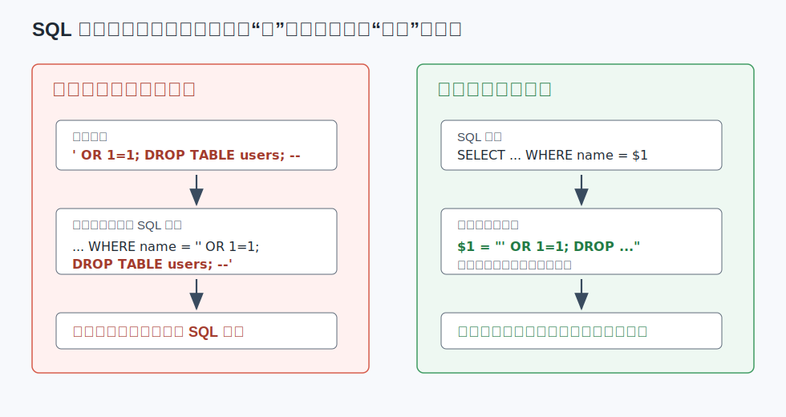
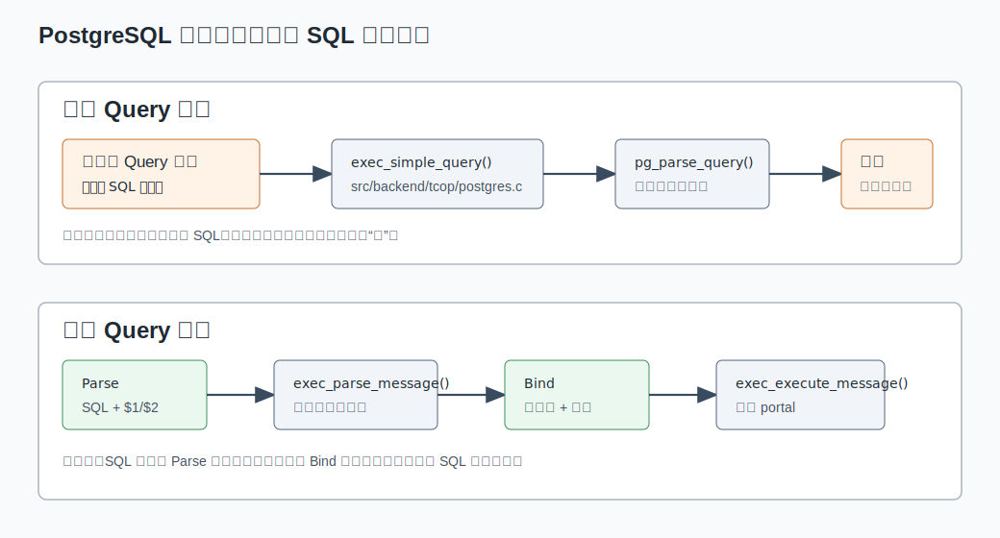
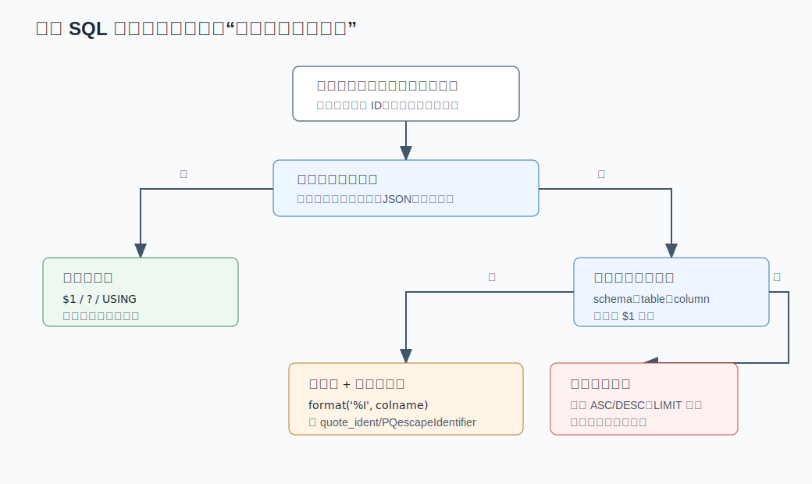
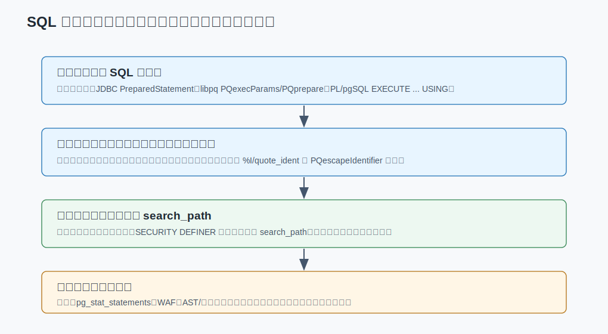

## 数据库筑基课 - 安全之 SQL注入

### 作者
digoal

### 日期
2026-06-01

### 标签
PostgreSQL , 应用开发者 , 数据库筑基课 , 安全 , SQL注入 , 参数化查询 , 动态SQL    

----

## 背景
  


本文属于[应用开发者数据库筑基课大纲](../202409/20240914_01.md)里“SQL、安全、权限、应用开发规范”这一类基础能力。

SQL 注入是最典型的“应用层写法错误，数据库层被迫执行”的安全问题。它不是 PostgreSQL、MySQL、Oracle 某一个数据库的特殊漏洞，而是把**数据值**和**SQL 语法**混在同一个字符串里之后产生的边界失守。

例如登录接口原本只想执行：

```sql
SELECT id, role FROM app_user WHERE name = '<用户输入>' AND password_hash = '<摘要>';
```

如果应用把用户输入直接拼进去，攻击者输入的就不再只是“名字”，而可能变成新的谓词、注释、子查询、第二条语句，甚至 DDL。Halfond、Viegas、Orso 的经典论文 *A Classification of SQL Injection Attacks and Countermeasures* 把常见攻击整理为 tautology、illegal/logically incorrect queries、union query、piggy-backed queries、stored procedure、inference、alternate encodings 等类别；这些名字背后其实都是同一个根因：**攻击者让数据库解析器把外部输入当成 SQL 结构来解析。**

本文从 PostgreSQL 源码和协议出发，回答五个工程问题：

- SQL 注入到底发生在 PostgreSQL 处理链路的哪一层？
- 为什么参数化查询能防注入，而手写转义只能算兜底？
- 动态表名、列名、排序字段不能参数化时怎么处理？
- `SECURITY DEFINER`、`search_path`、最小权限如何降低注入后的破坏面？
- AST、CodeBERT、LoRA 等检测方法应该放在什么位置？

## 一、它解决什么问题？

SQL 注入解决的不是“让用户输入里不能有引号”，而是让系统始终分清三类东西：

| 输入类别 | 例子 | 正确处理方式 | 错误处理方式 |
|---|---|---|---|
| 数据值 | 用户名、订单号、时间范围、JSON 值 | 参数绑定：`$1`、`?`、`USING` | 拼接到 SQL 字符串 |
| 标识符 | 表名、列名、schema 名 | 白名单 + `%I`、`quote_ident`、`PQescapeIdentifier` | 直接拼接 |
| 受限语法片段 | `ASC/DESC`、固定报表模板、分区名后缀 | 枚举映射，不接受自由文本 | 把用户输入当 SQL 片段 |

如果只靠“转义单引号”，只能处理一部分字符串字面量问题，处理不了标识符、排序方向、第二条语句、`search_path` 劫持、动态 SQL、权限扩大等场景。真正的目标是：**让用户输入在整个生命周期里都保持为值，而不是变成语法。**



图 1 说明：拼接 SQL 时，应用最终发给数据库的是一整段 SQL 文本，解析器无法知道哪段来自程序、哪段来自用户。参数化时，SQL 模板和参数值分通道进入数据库，解析器只解析模板，参数值由类型输入函数处理，不参与 SQL 语法切分。

## 二、它是什么？

SQL 注入可以定义为：应用把不可信输入混入 SQL 命令文本，使攻击者改变数据库最终解析和执行的语法结构。

在 PostgreSQL 里，这个定义可以落到几个具体边界上：

1. **协议边界**：简单 Query 协议把一整段 SQL 字符串发给后端；扩展 Query 协议把 `Parse`、`Bind`、`Execute` 拆开。
2. **解析边界**：`pg_parse_query()` 只认识 SQL 文本，不认识“这段文本是谁拼的”。
3. **参数边界**：`$1`、`$2` 是 SQL 结构里的参数占位符，真实值在绑定阶段进入。
4. **动态 SQL 边界**：PL/pgSQL 的 `EXECUTE` 会执行一段运行时生成的命令字符串，因此仍要区分值、标识符和语法片段。
5. **权限边界**：注入成功后能造成多大破坏，取决于连接角色权限、函数安全属性、`search_path`、RLS、schema 权限等。

所以，SQL 注入防护不是一个函数调用，而是一套边界设计。

## 三、核心原理

### 3.1 PostgreSQL 解析链路：数据库只负责解析收到的 SQL

PostgreSQL 后端在 `src/backend/tcop/postgres.c` 中处理客户端协议消息。简单 Query 协议的关键入口是 `exec_simple_query()`：

- `debug_query_string = query_string`，后端把整段字符串作为当前查询。
- 调用 `pg_parse_query(query_string)` 进行基础解析。
- 如果 `parsetree_list` 中有多条语句，简单协议会按历史语义在一个隐式事务块里逐条处理，除非遇到显式事务控制语句。

这解释了为什么经典的 piggy-backed queries 有风险：如果应用允许攻击者把 `; DROP TABLE ...` 拼进简单 Query 文本，数据库看到的就是多条语句，而不是“一个危险字符串”。

扩展 Query 协议的入口不同：

- `exec_parse_message()` 处理 `Parse` 消息，解析 SQL 模板，源码中明确检查 prepared statement 只能包含一条用户语句。
- `exec_bind_message()` 处理 `Bind` 消息，把参数值绑定到 prepared statement 生成 portal。
- `exec_execute_message()` 处理 `Execute` 消息，执行 portal。

官方协议文档也把扩展协议描述为 `Parse -> Bind -> Execute` 的流程，并说明 `Parse` 消息里的 query string 不能包含多条 SQL 命令。



图 2 说明：简单协议和扩展协议都要解析 SQL，但扩展协议把“SQL 结构”和“参数值”拆成不同消息。`libpq` 的 `PQexecParams()`、`PQprepare()`、`PQexecPrepared()` 正是围绕这条路径封装的。

### 3.2 参数化为什么有效

以 libpq 为例，`src/interfaces/libpq/fe-exec.c` 的 `PQsendQueryGuts()` 会构造扩展协议消息：

1. 如果有 SQL 命令文本，先构造 `Parse` 消息，发送 statement name、command、参数类型。
2. 再构造 `Bind` 消息，发送 portal name、statement name、参数格式、参数值长度、参数值内容。
3. 然后构造 `Describe Portal`、`Execute`、`Sync`。

这里的关键不是“自动帮你加引号”，而是**参数值根本不是 SQL 文本的一部分**。例如：

```c
const char *paramValues[1] = { user_input };

PGresult *res = PQexecParams(
    conn,
    "SELECT id, role FROM app_user WHERE name = $1",
    1,
    NULL,
    paramValues,
    NULL,
    NULL,
    0
);
```

即使 `user_input` 是：

```text
' OR 1=1; DROP TABLE app_user; --
```

它也只是 `$1` 的值。数据库不会把它重新拆成 SQL 谓词、分号和注释。

官方 libpq 文档还强调 `PQexecParams()` 相比 `PQexec()` 的一个主要优势是参数值可以与命令字符串分离，从而避免繁琐且容易出错的引用和转义；同时 `PQexecParams()` 一次只允许一个 SQL 命令，这也缩小了 piggy-backed queries 的攻击面。

### 3.3 为什么转义不是首选

PostgreSQL 提供了转义函数：

- `PQescapeLiteral()`：把字符串转成 SQL 字符串字面量。
- `PQescapeIdentifier()`：把字符串转成 SQL 标识符。
- PL/pgSQL 里的 `quote_literal()`、`quote_nullable()`、`quote_ident()`。
- `format()` 的 `%L`、`%I`，其中 `%I` 等价于标识符引用，`%L` 等价于可空字面量引用。

这些函数是必要工具，但不是参数绑定的替代品。原因有三点：

1. **值能参数化时就不该转成文本**。转文本再让数据库解析，会增加类型转换、空值处理、编码和拼接错误。
2. **不同输入类别需要不同处理**。值用 `%L`，标识符用 `%I`，语法片段只能白名单；用错类别就会留下洞。
3. **转义无法表达权限边界**。即使语法安全，连接角色权限过大，注入后仍可能读写过多对象。

所以实践顺序应该是：**值用参数，标识符用白名单加引用，语法片段用枚举映射，最后才考虑字面量转义。**

### 3.4 PL/pgSQL 动态 SQL 的正确边界

PL/pgSQL 文档给出的 `EXECUTE` 语法是：

```sql
EXECUTE command-string [ INTO [STRICT] target ] [ USING expression [, ...] ];
```

安全写法如下：

```sql
CREATE OR REPLACE FUNCTION app.find_user_by_column(colname text, keyvalue text)
RETURNS SETOF app_user
LANGUAGE plpgsql
AS $$
BEGIN
  IF colname NOT IN ('name', 'email', 'phone') THEN
    RAISE EXCEPTION 'unsupported search column: %', colname;
  END IF;

  RETURN QUERY EXECUTE
    format('SELECT * FROM app_user WHERE %I = $1', colname)
    USING keyvalue;
END;
$$;
```

这里 `colname` 是标识符，不能写成 `$1`；所以先做白名单，再用 `%I` 放入 SQL 结构。`keyvalue` 是数据值，应该通过 `USING` 绑定。

错误写法如下：

```sql
CREATE OR REPLACE FUNCTION app.bad_find_user(colname text, keyvalue text)
RETURNS SETOF app_user
LANGUAGE plpgsql
AS $$
BEGIN
  RETURN QUERY EXECUTE
    'SELECT * FROM app_user WHERE ' || colname || ' = ''' || keyvalue || '''';
END;
$$;
```

这个函数同时犯了两个错误：标识符无白名单，值被拼进 SQL 文本。攻击者只要控制 `colname` 或 `keyvalue`，就可能改变语法结构。



图 3 说明：动态 SQL 的第一步不是“怎么转义”，而是分类。输入如果是值，走参数绑定；如果是标识符，走白名单和标识符引用；如果是语法片段，只接受有限枚举，不接受用户自由文本。

### 3.5 权限边界：注入不应等于失守

参数化能显著降低注入发生概率，但数据库仍要假设应用有缺陷。安全设计必须让“某个接口被注入”不等于“整个库被接管”。

关键做法包括：

- 应用连接角色只授予需要的 `SELECT/INSERT/UPDATE/DELETE`，不要用 owner、superuser、迁移账号连接业务流量。
- 不同服务、不同租户管理面、报表面、写入面使用不同数据库角色。
- 对敏感表使用视图、RLS、存储过程封装写路径，避免直接暴露底表权限。
- `SECURITY DEFINER` 函数必须固定安全的 `search_path`，例如 `SET search_path = admin, pg_temp`。
- 不要让不可信用户在会被高权限函数搜索到的 schema 中创建对象。

PostgreSQL 文档在 schema 章节中明确指出，把某个 schema 加入 `search_path` 等价于信任该 schema 中有 `CREATE` 权限的用户。`CREATE FUNCTION` 文档也专门要求安全书写 `SECURITY DEFINER` 函数，并把受信 schema 放在前面、`pg_temp` 放在后面。



图 4 说明：参数化是第一防线，但不是唯一防线。权限、`search_path`、函数安全属性决定注入后的破坏半径；日志、AST 和机器学习检测用于发现异常，不能替代预防。

## 四、横向对比

| 维度 | 参数化查询 | 字符串转义 | AST/规则检测 | CodeBERT/LoRA 检测 |
|---|---|---|---|---|
| 主要目标 | 防止值变成 SQL 语法 | 在必须拼接文本时降低语法逃逸 | 识别异常 SQL 结构 | 用模型识别疑似注入文本 |
| 所在位置 | 应用数据库访问层、驱动、PL/pgSQL | 应用层或数据库函数 | WAF、网关、审计、测试工具 | WAF、审计、代码扫描、辅助检测 |
| 对数据值 | 最适合 | 可用但不首选 | 只能检测，不能修复 | 只能检测，不能修复 |
| 对标识符 | 不能直接绑定 | 可用 `%I`/`quote_ident` | 可检测异常结构 | 依赖训练数据与泛化能力 |
| 对未知攻击 | 结构上预防一大类问题 | 容易遗漏类别 | 取决于解析器和规则覆盖 | 取决于样本、标签、漂移和阈值 |
| 误报/漏报 | 不属于检测机制 | 不属于检测机制 | 可能误报复杂合法 SQL | 可能误报或漏报 |
| 工程定位 | 默认选择 | 辅助工具 | 补充防线 | 补充防线 |

这张表的核心结论是：**预防和检测不是同一类东西。** 参数化改变 SQL 构造方式，让注入难以发生；AST、CodeBERT、LoRA 等方法是在观察 SQL 或文本后判断“像不像攻击”。检测可以帮助发现遗留系统、第三方插件、异常流量和绕过尝试，但不能让危险拼接自动变安全。

## 五、效果如何？

参数化查询的效果主要体现在安全性和工程稳定性上：

- **安全性**：用户输入不进入 SQL 语法边界，能防住 tautology、union query、piggy-backed queries 等大量拼接型攻击。
- **类型稳定性**：参数由数据库按目标类型处理，避免应用手写日期、数组、JSON、bytea 字面量。
- **计划复用机会**：prepared statement 可以复用解析和计划缓存，但 PostgreSQL 会在 generic plan 和 custom plan 之间权衡，不应把安全机制误解为性能银弹。
- **日志可读性**：数据库可以把 query text 和参数值分开处理，配合日志策略更容易做审计。

代价也要明确：

- 参数只能替代数据值，不能替代表名、列名、操作符、排序方向等 SQL 结构。
- 某些驱动或 ORM 的“预编译”可能只是客户端模拟，必须确认它最终是否使用服务器端参数绑定或等价安全机制。
- 动态 SQL 如果必须拼接结构片段，仍需要白名单和标识符引用。
- 检测模型可能有误报和漏报，不能作为唯一控制点。

## 六、实操 DEMO

以下示例用于说明安全边界。本文没有连接本地 PostgreSQL 实例执行这些 SQL，因此不提供伪造输出。

### 6.1 建表

```sql
CREATE SCHEMA IF NOT EXISTS app;

CREATE TABLE app.app_user (
  id bigserial PRIMARY KEY,
  name text NOT NULL UNIQUE,
  email text NOT NULL UNIQUE,
  phone text,
  password_hash text NOT NULL,
  role text NOT NULL DEFAULT 'user'
);
```

### 6.2 应用侧：libpq 参数化查询

```c
const char *paramValues[2] = { name, password_hash };

PGresult *res = PQexecParams(
    conn,
    "SELECT id, role FROM app.app_user WHERE name = $1 AND password_hash = $2",
    2,
    NULL,
    paramValues,
    NULL,
    NULL,
    0
);
```

验证点：

- SQL 文本里只有 `$1`、`$2`，没有把 `name` 拼进去。
- `paramValues` 单独传入。
- 不需要调用 `PQescapeLiteral()`。

### 6.3 数据库侧：PL/pgSQL 动态查询

```sql
CREATE OR REPLACE FUNCTION app.search_user(sort_col text, sort_dir text, keyword text)
RETURNS TABLE(id bigint, name text, email text)
LANGUAGE plpgsql
SECURITY INVOKER
AS $$
DECLARE
  safe_dir text;
BEGIN
  IF sort_col NOT IN ('id', 'name', 'email') THEN
    RAISE EXCEPTION 'unsupported sort column: %', sort_col;
  END IF;

  safe_dir := CASE upper(sort_dir)
    WHEN 'ASC' THEN 'ASC'
    WHEN 'DESC' THEN 'DESC'
    ELSE NULL
  END;

  IF safe_dir IS NULL THEN
    RAISE EXCEPTION 'unsupported sort direction: %', sort_dir;
  END IF;

  RETURN QUERY EXECUTE
    format(
      'SELECT id, name, email
         FROM app.app_user
        WHERE name ILIKE $1 OR email ILIKE $1
        ORDER BY %I %s
        LIMIT 50',
      sort_col,
      safe_dir
    )
    USING '%' || keyword || '%';
END;
$$;
```

验证点：

- `keyword` 是值，用 `USING`。
- `sort_col` 是标识符，用白名单 + `%I`。
- `sort_dir` 是语法片段，只允许 `ASC` 或 `DESC` 两个枚举。
- 函数不使用 `SECURITY DEFINER`，避免不必要的权限扩大。

### 6.4 高权限函数：固定 search_path

如果确实需要 `SECURITY DEFINER`，至少固定 `search_path`：

```sql
CREATE OR REPLACE FUNCTION admin.reset_user_password(p_user_id bigint, p_hash text)
RETURNS void
LANGUAGE plpgsql
SECURITY DEFINER
SET search_path = admin, pg_temp
AS $$
BEGIN
  UPDATE admin.app_user
     SET password_hash = p_hash
   WHERE id = p_user_id;
END;
$$;

REVOKE ALL ON FUNCTION admin.reset_user_password(bigint, text) FROM PUBLIC;
GRANT EXECUTE ON FUNCTION admin.reset_user_password(bigint, text) TO app_password_operator;
```

验证点：

- 函数体里对象尽量 schema-qualified。
- `search_path` 只包含可信 schema 和 `pg_temp`。
- 先收回 `PUBLIC` 默认执行权，再授予明确角色。

## 七、最佳实践

### 面向数据库架构师

1. 把“所有业务 SQL 必须参数化”写进架构规范和代码评审清单。
2. 按服务拆分数据库角色，迁移账号、只读账号、写入账号、管理账号分离。
3. 对高风险数据使用视图、RLS 或封装函数暴露有限接口，不把底表 owner 权限交给应用。
4. 制定动态 SQL 规范：值只能走参数，标识符必须白名单，语法片段必须枚举。
5. 把 `SECURITY DEFINER` 函数纳入专项审计，检查 `search_path`、对象限定、默认执行权限。

### 面向 DBA

1. 定期检查业务连接角色是否拥有 `CREATE`、`ALTER`、`DROP`、跨 schema 读写等过大权限。
2. 检查可写 schema 是否出现在高权限会话或高权限函数的 `search_path` 中。
3. 通过 `pg_stat_statements`、日志、审计插件观察异常 query 形态，例如大量 `OR 1=1`、异常注释、非常规 UNION、频繁语法错误。
4. 对第三方扩展、管理后台、报表平台重点检查动态 SQL 和 `SECURITY DEFINER`。
5. 对生产库关闭或限制应用账号执行危险管理函数、文件访问函数、外部程序能力。

### 面向业务开发者

1. 不要自己拼值。无论是 Java、Go、Python、Node.js、C，都使用驱动提供的参数绑定接口。
2. 不要把 ORM 的字符串插值当参数化。确认生成 SQL 里是否仍把用户输入拼成文本。
3. 遇到动态列名、排序字段、报表维度，先做白名单映射，再引用标识符。
4. `LIKE`、`ILIKE`、JSON、数组也可以参数化，不需要手写字面量。
5. 单元测试要加入攻击样例，但测试样例不是防线；防线是构造 SQL 的方式。

## 八、适合与不适合场景

### 适合重点投入的场景

- 登录、注册、找回密码、后台管理、订单查询等直接接收外部输入的 OLTP 接口。
- 多租户 SaaS 的租户隔离条件、报表筛选条件、动态排序。
- BI、低代码、规则引擎、工作流系统中允许用户配置字段和条件的模块。
- PL/pgSQL、PL/Python、PL/Perl 中存在运行时拼接 SQL 的函数。
- 使用 `SECURITY DEFINER` 的权限封装函数。

### 不适合误用的场景

- 把参数化当成 SQL 权限控制。参数化防注入，权限仍要独立设计。
- 把 WAF 或模型检测当成修复。检测只能发现可疑流量，不能改变危险代码结构。
- 允许用户输入任意 SQL 再试图“过滤危险关键字”。SQL 语法复杂，关键字黑名单长期不可维护。
- 用字符串转义替代标识符白名单。`quote_ident()` 能引用标识符，但不能判断业务上是否允许访问这个列。

## 九、常见坑

1. **只转义单引号**：攻击不只靠单引号，标识符、注释、分号、编码、函数调用都可能成为入口。
2. **动态 ORDER BY 直接拼接**：`ORDER BY ` 后面是语法结构，必须枚举字段和方向。
3. **IN 列表手写拼接**：应使用数组参数，例如 `WHERE id = ANY($1::bigint[])`，或驱动支持的数组绑定。
4. **LIKE 模式手写拼接**：可以把模式作为参数：`WHERE name ILIKE $1`，参数值为 `'%foo%'`。
5. **SECURITY DEFINER 忘记 search_path**：攻击者可能通过可写 schema 放置同名对象影响解析。
6. **应用账号权限过大**：一旦注入成功，从读一张表扩大成删库、建函数、读敏感 schema。
7. **以为 prepared statement 一定更快**：安全收益确定，性能收益取决于计划选择、参数分布和执行次数。
8. **检测模型没有生产反馈闭环**：AST/CodeBERT/LoRA 检测如果没有误报处置、样本更新和灰度阈值，只会变成噪音。

## 十、扩展问题

1. 如果业务允许用户自定义筛选条件，如何设计一个小型 DSL，让它编译成参数化 SQL，而不是让用户直接写 SQL？
2. 多租户系统里，租户 ID 应该只作为 SQL 参数，还是还要叠加 RLS？为什么？
3. `SECURITY DEFINER` 函数中哪些对象必须 schema-qualified？哪些场景仅设置 `search_path` 仍不够？
4. 在审计日志里，应该记录原始参数值、脱敏参数值，还是只记录 query fingerprint？如何平衡排障和隐私？
5. 如果使用机器学习检测 SQL 注入，训练集、线上漂移、误报处置、绕过样本应该如何管理？

## 十一、扩展阅读

### PostgreSQL 官方文档与源码

- PostgreSQL Documentation: [libpq - Command Execution Functions](https://www.postgresql.org/docs/current/libpq-exec.html)，对应本地 `postgres/doc/src/sgml/libpq.sgml`。
- PostgreSQL Documentation: [Frontend/Backend Protocol - Message Flow](https://www.postgresql.org/docs/current/protocol-flow.html)，对应本地 `postgres/doc/src/sgml/protocol.sgml`。
- PostgreSQL Documentation: [PL/pgSQL Statements - Executing Dynamic Commands](https://www.postgresql.org/docs/current/plpgsql-statements.html)，对应本地 `postgres/doc/src/sgml/plpgsql.sgml`。
- PostgreSQL Documentation: [CREATE FUNCTION - Writing SECURITY DEFINER Functions Safely](https://www.postgresql.org/docs/current/sql-createfunction.html)，对应本地 `postgres/doc/src/sgml/ref/create_function.sgml`。
- PostgreSQL Documentation: [Schemas and search_path](https://www.postgresql.org/docs/current/ddl-schemas.html)，对应本地 `postgres/doc/src/sgml/ddl.sgml`。
- PostgreSQL 源码：`postgres/src/backend/tcop/postgres.c`，重点函数 `exec_simple_query()`、`exec_parse_message()`、`exec_bind_message()`、`exec_execute_message()`、`pg_parse_query()`。
- PostgreSQL 源码：`postgres/src/interfaces/libpq/fe-exec.c`，重点函数 `PQexecParams()`、`PQprepare()`、`PQexecPrepared()`、`PQsendQueryGuts()`、`PQescapeLiteral()`、`PQescapeIdentifier()`。
- DeepWiki: `postgres/postgres`，用于确认 PostgreSQL 协议处理和 libpq 参数化路径的源码导航。

### 论文与检测方向

- William G. J. Halfond, Jeremy Viegas, Alessandro Orso, *A Classification of SQL Injection Attacks and Countermeasures*, ISSSE 2006. 本文采用其攻击分类作为威胁建模框架。
- *Abstract Syntax Tree-Based Detection of SQL Injection Attacks*. AST 类方法适合把 SQL 结构化后检测异常形态，适合作为网关、测试或审计补充。
- *SQL Injection Detection Using Fine-Tuned CodeBERT*. CodeBERT 类方法适合把 SQL 或代码片段作为模型输入做分类，但需要关注数据集偏差和误报。
- *LoRA based Fine Tuning of CodeBERT for SQL Injection Detection*. LoRA 微调降低模型适配成本，适合检测侧迭代，不改变应用必须参数化的基本原则。

## 小结

SQL 注入的第一性原理很简单：不要让不可信输入改变 SQL 语法结构。

在 PostgreSQL 里，最可靠的路径是：应用层使用参数化查询，PL/pgSQL 动态 SQL 使用 `EXECUTE ... USING`，标识符使用白名单和 `%I`/`quote_ident`，语法片段使用枚举映射；同时用最小权限、固定 `search_path`、审计和检测控制注入后的破坏半径。

AST、CodeBERT、LoRA 等检测技术值得研究，但它们是报警器，不是门锁。门锁仍然是参数化、权限边界和动态 SQL 规范。
  
## 附录 
1、问 gemini
```
SQL注入 相关的论文
```

2、克隆代码  
```  
git clone --depth 1 https://github.com/postgres/postgres
```  
  
3、启用 codex, 使用 [数据库筑基课 skill](../skills/README.md).  
```
文章标题: 
  数据库筑基课 - 安全之 SQL注入
项目源码(本地目录): 
  postgres
项目 codebase 文件名: 
  postgres/CLAUDE.md 
相关论文:
  A Classification of SQL Injection Attacks and Countermeasures
  Abstract Syntax Tree-Based Detection of SQL Injection Attacks
  SQL Injection Detection Using Fine-Tuned CodeBERT
  LoRA based Fine Tuning of CodeBERT for SQL Injection Detection
开源项目相关的 deepwiki repoName: 
  postgres/postgres
```

  
  
#### [PostgreSQL 解决方案集合](../201706/20170601_02.md "40cff096e9ed7122c512b35d8561d9c8")
  
  
#### [德哥 / digoal's Github - 公益是一辈子的事.](https://github.com/digoal/blog/blob/master/README.md "22709685feb7cab07d30f30387f0a9ae")
  
  
#### [About 德哥](https://github.com/digoal/blog/blob/master/me/readme.md "a37735981e7704886ffd590565582dd0")
  
  

  
