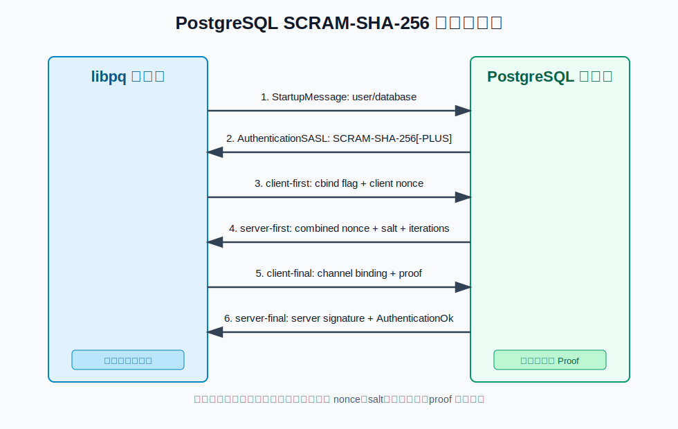
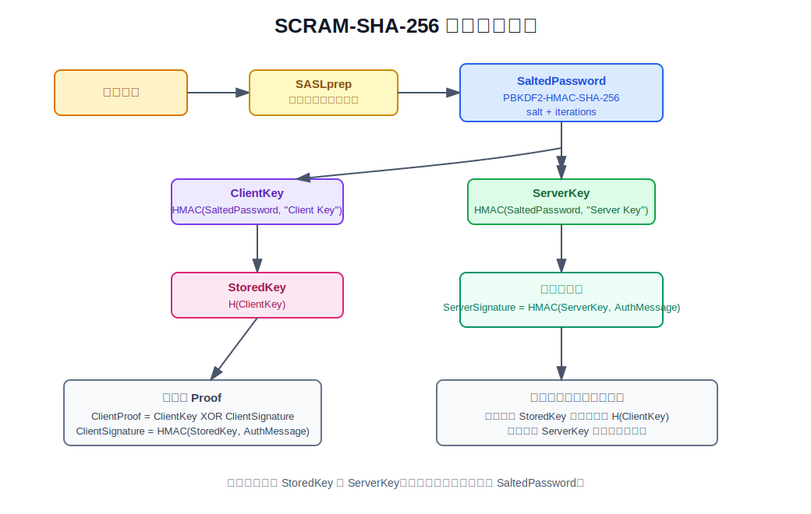
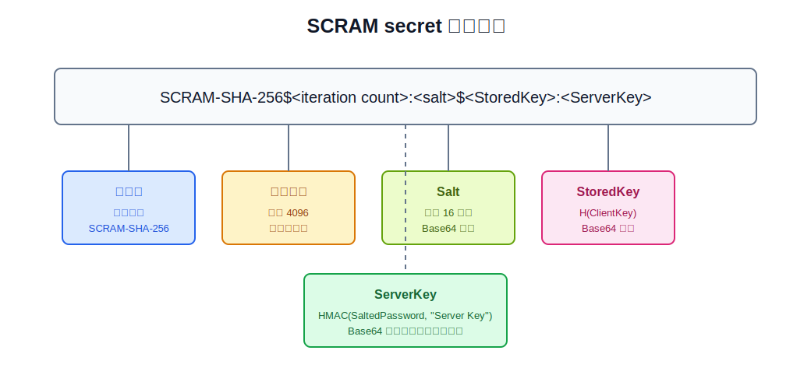
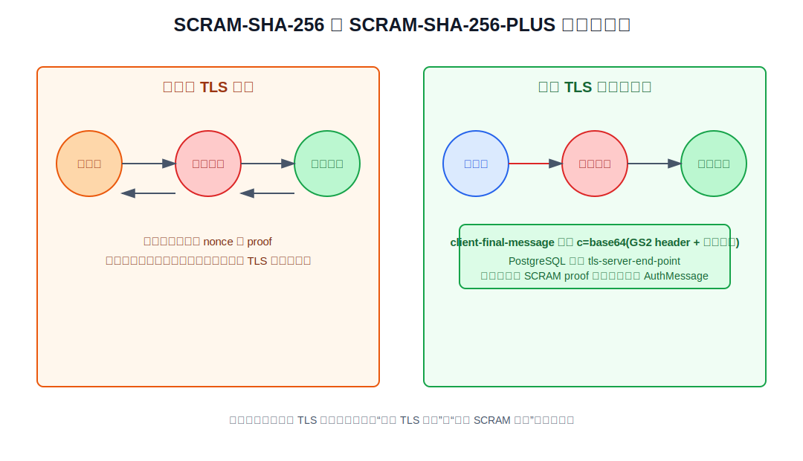
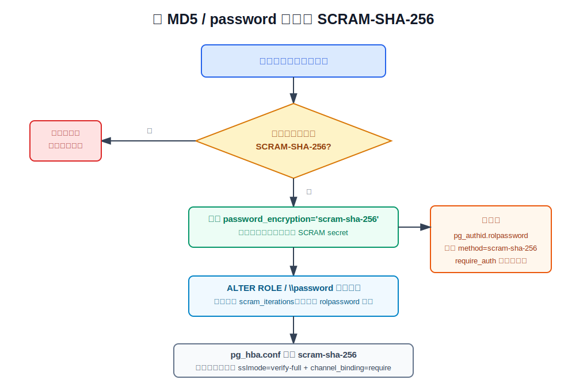

## 数据库筑基课 - 安全之 scram-sha-256

### 作者
digoal

### 日期
2026-06-01

### 标签
PostgreSQL , 应用开发者 , 数据库筑基课 , 安全 , 认证 , SCRAM-SHA-256 , SASL , channel binding    

----

## 背景
  


本文属于[应用开发者数据库筑基课大纲](../202409/20240914_01.md)里“SQL、安全、权限、应用开发规范”这一类基础能力。

数据库账号认证看起来只是“输一个密码”。但在真实生产里，它同时面对四类风险：

1. 网络上有人嗅探密码。
2. 攻击者重放以前抓到的认证报文。
3. 服务端密码库泄露后，攻击者拿到摘要直接冒充用户。
4. 客户端连到了假的服务端，中间人把认证过程转发给真服务端。

明文 `password` 认证把第一类风险直接暴露出来。传统 `md5` 认证能避免明文密码上网，也能做一次简单挑战响应，但 PostgreSQL 文档已经明确指出 MD5 机制较弱，并且本地 PostgreSQL 源码分支的文档把 MD5 加密口令标为 deprecated。`scram-sha-256` 的目标不是“把密码再哈希一次”，而是把认证问题拆成：服务端如何保存不可直接冒充用户的认证信息、客户端如何证明自己知道密码、服务端如何证明自己也持有对应 secret、网络报文如何避免重放、TLS 通道如何绑定到认证结果。

本文基于 PostgreSQL 本地源码、官方文档、DeepWiki 和三个 RFC：

- RFC 5802: Salted Challenge Response Authentication Mechanism (SCRAM) SASL Mechanisms
- RFC 7677: SCRAM-SHA-256 Authentication Mechanism for SASL
- RFC 5803: Lightweight Directory Access Protocol (LDAP) Schema for Storing SCRAM Secrets

## 一、它解决什么问题？

`scram-sha-256` 解决的是“口令认证的最小可信边界”问题。

普通应用连接数据库，最终通常还是一个用户名和密码。如果数据库只做：

```text
客户端 -> 服务端: password
服务端: hash(password) 与保存值比较
```

那么 TLS 配错、代理误配、日志泄露、服务端密码库泄露，都可能把“知道密码”降级成“拿到某个固定字符串就能登录”。SCRAM 把这个过程改造成挑战响应：

- 服务端不保存明文密码，也不保存能直接作为客户端 proof 使用的 `ClientKey`。
- 客户端每次认证都要混入客户端 nonce、服务端 nonce、salt 和迭代次数。
- 服务端用 `StoredKey` 验证客户端 proof，用 `ServerKey` 生成服务端签名。
- 客户端收到服务端签名后，也能确认对端确实持有该用户的认证 secret。
- 如果使用 `SCRAM-SHA-256-PLUS`，认证还会把 TLS 服务端证书信息纳入 proof，降低中间人转发风险。

代价也很明确：

- 它仍然是密码体系，弱密码仍然能被离线猜测。
- 迭代次数越高，抗猜测能力越强，但建密和认证计算成本越高。
- 老客户端可能不支持 SCRAM，需要迁移窗口。
- `SCRAM-SHA-256-PLUS` 依赖 SSL/TLS 和客户端 `channel_binding` 配置，不能靠服务端单方面完成。

## 二、它是什么？

SCRAM 是 Salted Challenge Response Authentication Mechanism，RFC 5802 定义了一族基于 SASL/GS2 的挑战响应机制。RFC 7677 把其中的哈希算法具体化为 SHA-256，因此 PostgreSQL 支持的机制名是：

- `SCRAM-SHA-256`：普通 SCRAM-SHA-256。
- `SCRAM-SHA-256-PLUS`：带 channel binding 的 SCRAM-SHA-256。

在 PostgreSQL 里，它落到三个层面：

1. **存储层**：`pg_authid.rolpassword` 保存 `SCRAM-SHA-256$<iteration count>:<salt>$<StoredKey>:<ServerKey>`，其中 salt、StoredKey、ServerKey 都是 Base64。
2. **协议层**：客户端和服务端通过 SASL 消息交换 `client-first-message`、`server-first-message`、`client-final-message`、`server-final-message`。
3. **配置层**：`password_encryption` 决定新口令如何生成 secret，`scram_iterations` 决定新 secret 的迭代次数，`pg_hba.conf` 的认证方法决定连接时是否使用 `scram-sha-256`。

源码上可以分成几块：

| 位置 | 作用 |
|---|---|
| `src/common/scram-common.c` | 前后端共享的 PBKDF2/HMAC/SHA-256、ClientKey、StoredKey、ServerKey、secret 构造逻辑 |
| `src/include/common/scram-common.h` | 机制名、key 长度、nonce 长度、salt 长度、默认迭代次数等常量 |
| `src/backend/libpq/auth-scram.c` | 服务端 SCRAM 状态机、secret 解析、客户端 proof 验证、服务端签名生成、mock authentication |
| `src/interfaces/libpq/fe-auth-scram.c` | libpq 客户端 SCRAM 状态机、nonce 生成、proof 计算、服务端签名验证、channel binding 数据构造 |
| `src/backend/libpq/auth.c` | 在 `md5` 与 `scram-sha-256` 认证路径之间选择 |
| `doc/src/sgml/protocol.sgml` | PostgreSQL 协议中的 SCRAM-SHA-256 认证消息流程 |
| `doc/src/sgml/client-auth.sgml` | `pg_hba.conf` 认证方法说明与 MD5 迁移说明 |
| `src/test/authentication/t/001_password.pl` | SCRAM 登录、迭代次数、`require_auth`、MD5 兼容路径等测试 |
| `src/test/authentication/t/002_saslprep.pl` | SASLprep 相关测试 |

## 三、核心原理

### 3.1 消息流：密码不上网，proof 上网

PostgreSQL 文档把 SCRAM 认证放在 SASL 认证流程中。服务端先发 `AuthenticationSASL`，客户端选择机制并发 `SASLInitialResponse`，随后完成 challenge-response 交换。



图 1 说明：网络上没有明文密码。服务端发 salt、迭代次数和服务端 nonce；客户端发 proof；服务端发 server signature。客户端和服务端都把三段核心消息拼成 `AuthMessage`，后续 proof 和 signature 都绑定这份消息上下文。

典型逻辑如下：

1. 客户端生成随机 `client_nonce`。
2. 服务端把 `client_nonce + server_nonce`、用户 secret 里的 salt、迭代次数发给客户端。
3. 客户端用密码、salt、迭代次数推导出密钥，再根据 `AuthMessage` 生成 `ClientProof`。
4. 服务端用保存的 `StoredKey` 验证 `ClientProof`。
5. 服务端用保存的 `ServerKey` 生成 `ServerSignature`。
6. 客户端验证 `ServerSignature`，确认服务端也持有对应 secret。

`src/backend/libpq/auth-scram.c` 的服务端状态只有三段：`SCRAM_AUTH_INIT`、`SCRAM_AUTH_SALT_SENT`、`SCRAM_AUTH_FINISHED`。`src/interfaces/libpq/fe-auth-scram.c` 的客户端状态对应为 `FE_SCRAM_INIT`、`FE_SCRAM_NONCE_SENT`、`FE_SCRAM_PROOF_SENT`、`FE_SCRAM_FINISHED`。状态机很小，安全性来自消息绑定和密钥推导，而不是复杂分支。

### 3.2 密钥派生：StoredKey 和 ServerKey 分工

RFC 5802 的核心公式可以写成：

```text
SaltedPassword  := Hi(Normalize(password), salt, i)
ClientKey       := HMAC(SaltedPassword, "Client Key")
StoredKey       := H(ClientKey)
AuthMessage     := client-first-message-bare + "," +
                   server-first-message + "," +
                   client-final-message-without-proof
ClientSignature := HMAC(StoredKey, AuthMessage)
ClientProof     := ClientKey XOR ClientSignature
ServerKey       := HMAC(SaltedPassword, "Server Key")
ServerSignature := HMAC(ServerKey, AuthMessage)
```

PostgreSQL 在 `src/common/scram-common.c` 中实现这些函数：

- `scram_SaltedPassword()`：实现 PBKDF2 风格的 `Hi()`，内部反复计算 HMAC 并 XOR。
- `scram_ClientKey()`：用 `"Client Key"` 派生客户端 key。
- `scram_ServerKey()`：用 `"Server Key"` 派生服务端 key。
- `scram_H()`：对 `ClientKey` 做 SHA-256 得到 `StoredKey`。
- `scram_build_secret()`：组装持久化 secret。



图 2 说明：服务端保存的是 `StoredKey` 和 `ServerKey`。验证客户端时，服务端先用 `StoredKey` 算出 `ClientSignature`，再通过 `ClientProof XOR ClientSignature` 恢复候选 `ClientKey`，最后比较 `H(ClientKey)` 是否等于保存的 `StoredKey`。服务端不需要保存明文密码或 `SaltedPassword`。

这里有一个关键点：泄露 `StoredKey` 不等于能直接生成客户端 proof，因为 proof 需要 `ClientKey`，而服务端只保存 `H(ClientKey)`。但是泄露 `StoredKey`、`ServerKey`、salt、迭代次数后，攻击者仍然可以离线猜密码。因此 SCRAM 降低的是“摘要直接可重放”的风险，不是消灭弱密码风险。

### 3.3 存储格式：secret 是协议的一部分

PostgreSQL 文档和 `parse_scram_secret()` 都使用同一格式：

```text
SCRAM-SHA-256$<iteration count>:<salt>$<StoredKey>:<ServerKey>
```



图 3 说明：`iteration count` 决定 PBKDF2 计算成本；salt 用于抵抗预计算字典；`StoredKey` 用于服务端验证客户端 proof；`ServerKey` 用于服务端生成签名，让客户端能验证服务端。salt、StoredKey、ServerKey 都以 Base64 存储。

本地源码里的关键常量在 `src/include/common/scram-common.h`：

```c
#define SCRAM_SHA_256_NAME "SCRAM-SHA-256"
#define SCRAM_SHA_256_PLUS_NAME "SCRAM-SHA-256-PLUS"
#define SCRAM_SHA_256_KEY_LEN PG_SHA256_DIGEST_LENGTH
#define SCRAM_RAW_NONCE_LEN 18
#define SCRAM_DEFAULT_SALT_LEN 16
#define SCRAM_SHA_256_DEFAULT_ITERATIONS 4096
```

`scram_iterations` 只影响新 secret 的生成。已经存在的 `rolpassword` 字符串里写着自己的迭代次数，后续认证按 secret 里的值执行。换句话说，调高 `scram_iterations` 后，如果不轮换用户密码，旧 secret 不会自动变强。

### 3.4 PostgreSQL 的实现差异：用户名、SASLprep 与 mock authentication

PostgreSQL 的实现和 RFC 有几处工程化差异，源码注释写得很清楚：

1. **SCRAM 消息里的用户名被忽略**。PostgreSQL 使用 startup packet 里的用户名。原因是 PostgreSQL 支持多种字符编码，而 SCRAM 要求用户名用 UTF-8 表示。
2. **密码尽量做 SASLprep，但失败时不拒绝**。如果密码不是合法 UTF-8，或者包含 SASLprep 禁止字符，PostgreSQL 使用原始字节继续计算。这是为了兼容 PostgreSQL 的多编码环境。
3. **用户不存在或 secret 无效时也走一遍假的认证流程**。服务端会生成看起来合理的 mock salt 和迭代次数，把状态标记为 `doomed`，最后统一失败。这样攻击者不能轻易通过响应时序或报错判断某个用户是否存在。
4. **错误日志避免直接打印不可信非 ASCII 字符**。认证前客户端还不可信，源码中有 `sanitize_char()` 和 `sanitize_str()` 处理日志细节。

这些不是算法本身的“锦上添花”，而是数据库认证代码必须处理的边界：不能泄露用户枚举信号，不能让未认证客户端污染日志，不能因为编码差异让已有用户无法登录。

### 3.5 Channel binding：把认证绑定到 TLS 服务端身份

普通 SCRAM 可以防止密码被嗅探和 replay，但 PostgreSQL 文档指出：如果没有 channel binding，中间人仍可能把客户端和真服务端之间的 SCRAM 消息转发起来。客户端证明了自己知道密码，但没有把这次证明绑定到它实际看到的 TLS 服务端身份。

PostgreSQL 支持 `SCRAM-SHA-256-PLUS`，channel binding 类型固定为 `tls-server-end-point`。libpq 的 `channel_binding` 参数有三个常用取值：

- `prefer`：如果可用就使用 channel binding。PostgreSQL 编译带 SSL 支持时默认如此。
- `require`：必须使用 channel binding，否则连接失败。
- `disable`：禁用 channel binding。



图 4 说明：`SCRAM-SHA-256-PLUS` 会把 GS2 header 和服务端证书哈希放进 `client-final-message` 的 `c=` 字段。这部分参与 `AuthMessage`，也就参与 `ClientProof` 和 `ServerSignature`。中间人即使能转发 SCRAM 报文，也很难让客户端看到的 TLS 服务端身份与真服务端的证书私钥证明一致。

工程上要注意：channel binding 不是 TLS 证书校验的替代品。高安全连接应同时使用：

```text
sslmode=verify-full channel_binding=require
```

`sslmode=verify-full` 校验证书链和主机名，`channel_binding=require` 再把这条 TLS 通道纳入 SCRAM proof。

## 四、横向对比

| 维度 | `scram-sha-256` | `md5` | `password` | 客户端证书 |
|---|---|---|---|---|
| 主要目标 | 密码挑战响应、抗嗅探、抗重放、服务端保存 salted secret | 旧式挑战响应 | 明文密码认证 | 基于证书身份认证 |
| 网络上传明文密码 | 不传 | 不传 | 会传，必须依赖 SSL | 不传密码 |
| 服务端保存形式 | salt + iterations + StoredKey + ServerKey | `md5` + MD5(password + user) | 取决于用户口令存储方式 | 不依赖数据库口令 |
| 抵抗 stolen verifier 直接冒充 | 较好，不能直接拿 StoredKey 当 proof | 弱，文档明确说 hash 被偷后保护不足 | 不适用 | 取决于私钥保护 |
| Mutual authentication | 有 server signature | 无同等级机制 | 无 | TLS 层验证服务端/客户端 |
| 中间人防护 | `SCRAM-SHA-256-PLUS` 支持 channel binding | 无 | 依赖 TLS | 依赖 TLS 和证书策略 |
| 兼容性 | 老客户端可能不支持 | 老系统兼容好，但 deprecated | 简单但风险高 | 运维复杂度高 |
| 运维重点 | 轮换旧密码、设置 `pg_hba.conf`、TLS、`channel_binding` | 迁出 | 只在受保护本地环境谨慎使用 | PKI、证书生命周期、吊销 |

这张表的核心结论是：`scram-sha-256` 是 PostgreSQL 当前密码认证的默认方向，但它不是所有认证问题的终点。机器到机器、高安全内网、监管系统可以考虑证书、GSSAPI、SSPI、OAuth 等机制；但只要系统还在使用数据库密码，SCRAM 就应该是优先选项。

## 五、效果如何？

SCRAM-SHA-256 的收益主要体现在安全边界，而不是查询性能。

**收益：**

- **防密码嗅探**：网络上不传明文密码。
- **防简单重放**：每次认证有 nonce，proof 绑定本次消息。
- **服务端 secret 更稳健**：保存的是 salt、迭代次数、StoredKey、ServerKey，而不是明文或可直接重放的客户端 proof。
- **支持服务端认证**：客户端验证 `ServerSignature`，确认对端持有对应 secret。
- **支持 channel binding**：`SCRAM-SHA-256-PLUS` 能把 TLS 服务端身份纳入认证。
- **迁移兼容**：PostgreSQL 中 `pg_hba.conf` 写 `md5` 时，如果用户 secret 是 SCRAM，实际会走 SCRAM 认证，便于平滑迁移。

**代价：**

- **认证 CPU 成本增加**：PBKDF2/HMAC 的迭代次数越高，认证越慢。默认 4096 是 RFC 7677 要求的下限级别，不是永久最优值。
- **弱密码仍然危险**：攻击者拿到 `rolpassword` 后可以离线猜测。迭代次数只是提高单次猜测成本。
- **连接池更重要**：大量短连接会放大认证成本。业务侧应使用连接池，而不是用 SCRAM 承担高频短连接浪费。
- **旧客户端迁移成本**：需要确认驱动和 libpq 版本支持 SCRAM。
- **channel binding 需要端到端配置**：服务端支持 SSL 不代表客户端一定要求 channel binding。

如果用一句话概括：SCRAM 把数据库密码认证从“传一个可验证的固定秘密”升级为“用一次性上下文证明自己知道秘密”，但密码质量、TLS、连接池和迁移治理仍然要做。

## 六、实操 DEMO

以下示例用于说明操作路径。本文没有启动本地 PostgreSQL 实例执行这些 SQL，因此不提供伪造输出。

### 6.1 新建用户时生成 SCRAM secret

```sql
SHOW password_encryption;
SHOW scram_iterations;

SET password_encryption = 'scram-sha-256';
SET scram_iterations = 4096;

CREATE ROLE app_user LOGIN PASSWORD 'change-me-to-a-strong-password';
```

验证 secret 形态：

```sql
SELECT rolname,
       regexp_replace(rolpassword, '(^SCRAM-SHA-256\\$[0-9]+:).+$', '\\1...')
FROM pg_authid
WHERE rolname = 'app_user';
```

预期前缀形态是：

```text
SCRAM-SHA-256$4096:...
```

不要在生产里把完整 `rolpassword` 打到日志、工单或聊天工具里。它不是明文密码，但属于可用于离线猜测的敏感认证材料。

### 6.2 配置 pg_hba.conf 使用 SCRAM

示例：

```text
# TYPE  DATABASE  USER      ADDRESS          METHOD
hostssl appdb     app_user  10.10.0.0/16     scram-sha-256
```

然后 reload：

```sql
SELECT pg_reload_conf();
```

`hostssl` 表示只接受 SSL 连接。是否验证证书、是否要求 channel binding，还要看客户端连接串。

### 6.3 客户端要求 SCRAM 与 channel binding

libpq 连接串示例：

```text
postgresql://app_user@db.example.com/appdb?sslmode=verify-full&channel_binding=require&require_auth=scram-sha-256
```

含义：

- `sslmode=verify-full`：验证服务端证书链和主机名。
- `channel_binding=require`：必须使用 SCRAM channel binding。
- `require_auth=scram-sha-256`：客户端要求服务端完成 SCRAM-SHA-256 认证。

如果服务端、客户端库、TLS 或 `pg_hba.conf` 不满足要求，连接应失败。这比“悄悄降级到较弱认证”更适合高安全场景。

### 6.4 迁移旧 MD5 用户

迁移的关键不是只改 `password_encryption`，而是**让用户密码重新写入**：

```sql
ALTER SYSTEM SET password_encryption = 'scram-sha-256';
SELECT pg_reload_conf();

ALTER ROLE app_user PASSWORD 'new-strong-password';
```

检查仍使用 MD5 的用户：

```sql
SELECT rolname
FROM pg_authid
WHERE rolcanlogin
  AND rolpassword LIKE 'md5%';
```

再逐步把 `pg_hba.conf` 中对应规则改为：

```text
hostssl all all 10.10.0.0/16 scram-sha-256
```



图 5 说明：先确认客户端兼容，再改新密码生成算法，然后轮换口令，最后收紧 `pg_hba.conf` 和客户端 `channel_binding`。只改配置、不轮换旧密码，旧 `rolpassword` 不会自动变成 SCRAM secret。

## 七、最佳实践

### 7.1 给数据库架构师

1. **把 SCRAM 当成密码认证基线**：新系统默认 `password_encryption='scram-sha-256'`，`pg_hba.conf` 使用 `scram-sha-256`，不要新增 MD5 口令。
2. **认证和传输一起设计**：远程连接使用 TLS；跨不可信网络或高权限账号使用 `sslmode=verify-full` 和 `channel_binding=require`。
3. **降低短连接认证放大**：业务使用连接池。SCRAM 迭代是安全成本，短连接风暴会把安全成本变成可用性风险。
4. **为不同主体拆账号**：应用账号、迁移账号、只读报表账号、运维账号分开。认证机制不能弥补授权过大。
5. **给密码轮换留流程**：调高 `scram_iterations`、切换认证方式、下线 MD5，都要通过密码重写才能真正落到 secret。

### 7.2 给 DBA

1. **盘点口令类型**：

   ```sql
   SELECT CASE
            WHEN rolpassword LIKE 'SCRAM-SHA-256$%' THEN 'scram'
            WHEN rolpassword LIKE 'md5%' THEN 'md5'
            WHEN rolpassword IS NULL THEN 'null'
            ELSE 'other'
          END AS password_type,
          count(*)
   FROM pg_authid
   WHERE rolcanlogin
   GROUP BY 1
   ORDER BY 1;
   ```

2. **验证认证方法**：结合连接日志中的 authenticated method、`pg_hba_file_rules`、客户端 `require_auth` 做验证，不要只看配置文件。
3. **慎调 `scram_iterations`**：提高迭代次数前，先压测登录高峰、连接池重连、故障恢复时的大量重连场景。
4. **保护 `pg_authid` 和备份**：SCRAM secret 泄露后不能直接登录，但足以离线猜测密码。备份、逻辑导出、权限审计都要把它当敏感数据。
5. **关注 MD5 弃用**：本地源码文档已提示 MD5 加密口令 deprecated。迁移计划不要等到升级窗口才临时处理。

### 7.3 给业务开发者

1. **不要自己实现 SCRAM**：使用驱动提供的认证能力，升级老驱动。认证协议细节多，自己拼 proof 很容易错。
2. **连接串显式表达安全要求**：核心系统写上 `sslmode=verify-full`、`channel_binding=require`、`require_auth=scram-sha-256`，避免默认值随环境变化。
3. **不要在日志里打印连接串密码**：SCRAM 保护的是协议过程，不保护应用日志。
4. **使用连接池**：减少认证次数，也减少密码在应用侧频繁处理的机会。
5. **弱密码仍然要治理**：复杂度策略、密码管理器、轮换流程、泄露检测，仍然是必要控制。

## 八、适合与不适合场景

**适合：**

- 普通应用到 PostgreSQL 的账号密码连接。
- 需要替代 MD5 的存量系统。
- 不能全面引入证书、Kerberos、OAuth，但希望显著提高密码认证安全性的系统。
- 使用连接池的业务系统。
- 需要通过 libpq `require_auth` 和 `channel_binding` 明确认证下限的系统。

**不适合单独依赖：**

- 无法保证密码强度的公网暴露服务。SCRAM 不能阻止弱密码被爆破或离线猜测。
- 极高频短连接、没有连接池的服务。认证 CPU 成本会被放大。
- 需要强设备身份、人员身份、证书生命周期管理的场景。可以考虑客户端证书、GSSAPI、SSPI、OAuth 等机制。
- TLS 证书校验长期不规范的环境。`SCRAM-SHA-256-PLUS` 依赖正确的 TLS 身份基础。
- 已经泄露 `pg_authid` 且无法强制轮换密码的系统。此时应先轮换口令和排查入侵范围。

## 九、常见坑

1. **以为改了 `password_encryption` 就完成迁移**
   错。它只影响新设置的密码。旧 MD5 secret 需要 `ALTER ROLE ... PASSWORD` 或用户重新改密。

2. **以为 `pg_hba.conf` 写 `md5` 就一定走 MD5**
   PostgreSQL 为了兼容迁移，如果 HBA 方法是 `md5` 但用户 secret 是 SCRAM，会选择 SCRAM 认证。这对迁移有帮助，但也要求 DBA 用日志和测试确认真实认证方法。

3. **以为 SCRAM 可以替代 TLS**
   错。SCRAM 防明文密码上网，但 TLS 还负责机密性、完整性和服务端身份校验。高安全场景还要 `SCRAM-SHA-256-PLUS` 的 channel binding。

4. **以为 channel binding 默认总是生效**
   错。它需要 SSL 支持、服务端提供 `SCRAM-SHA-256-PLUS`、客户端支持并选择该机制。高安全客户端应使用 `channel_binding=require`。

5. **把 `rolpassword` 当普通哈希随意导出**
   错。它不能直接登录，但可以用于离线猜测。备份、审计、迁移脚本要按敏感数据处理。

6. **盲目调高 `scram_iterations`**
   迭代次数是安全与认证延迟的交换。调高前先压测登录峰值、连接池冷启动和故障恢复重连。

7. **忽略客户端兼容性**
   老驱动可能不支持 SCRAM。迁移前先列出服务、驱动、libpq 版本和连接串参数。

8. **用弱密码指望算法兜底**
   SCRAM 增加猜测成本，但不会把弱密码变成强密码。

## 十、扩展问题

1. 如果攻击者只拿到网络抓包，没有拿到 `pg_authid.rolpassword`，SCRAM 阻止了哪些攻击？
2. 如果攻击者拿到 `pg_authid.rolpassword`，SCRAM 还能保护什么，不能保护什么？
3. 为什么 PostgreSQL 保存 `StoredKey` 而不是直接保存 `ClientKey`？
4. `scram_iterations` 从 4096 提高到更大值时，认证延迟和离线猜测成本分别如何变化？
5. `sslmode=require`、`sslmode=verify-ca`、`sslmode=verify-full` 与 `channel_binding=require` 之间是什么关系？
6. 为什么 PostgreSQL 在用户不存在时仍然走 mock SCRAM authentication？
7. 如果一个系统使用连接池，SCRAM 的 CPU 成本主要出现在什么时候？
8. 对 DBA 来说，迁移 MD5 账号的最小可回滚步骤应该怎么设计？

## 十一、扩展阅读

- [RFC 5802: Salted Challenge Response Authentication Mechanism (SCRAM) SASL and GSS-API Mechanisms](https://www.rfc-editor.org/rfc/rfc5802)
- [RFC 7677: SCRAM-SHA-256 and SCRAM-SHA-256-PLUS Simple Authentication and Security Layer (SASL) Mechanisms](https://www.rfc-editor.org/rfc/rfc7677)
- [RFC 5803: LDAP Schema for Storing SCRAM Secrets](https://www.rfc-editor.org/rfc/rfc5803)
- PostgreSQL 本地源码：`postgres/src/common/scram-common.c`
- PostgreSQL 本地源码：`postgres/src/include/common/scram-common.h`
- PostgreSQL 本地源码：`postgres/src/backend/libpq/auth-scram.c`
- PostgreSQL 本地源码：`postgres/src/interfaces/libpq/fe-auth-scram.c`
- PostgreSQL 本地源码：`postgres/src/backend/libpq/auth.c`
- PostgreSQL 本地文档：`postgres/doc/src/sgml/protocol.sgml`
- PostgreSQL 本地文档：`postgres/doc/src/sgml/client-auth.sgml`
- PostgreSQL 本地文档：`postgres/doc/src/sgml/catalogs.sgml`
- PostgreSQL 本地测试：`postgres/src/test/authentication/t/001_password.pl`
- PostgreSQL 本地测试：`postgres/src/test/authentication/t/002_saslprep.pl`
- DeepWiki: `postgres/postgres`，用于辅助梳理 PostgreSQL SCRAM 实现的文件分布和消息流；关键结论已回到本地源码和官方文档核验。
  
## 附录 
1、问 gemini
```
PostgreSQL scram-sha-256 相关的论文
```

2、克隆代码  
```  
git clone --depth 1 https://github.com/postgres/postgres
```  
  
3、启用 codex, 使用 [数据库筑基课 skill](../skills/README.md).  
```
文章标题: 
  数据库筑基课 - 安全之 scram-sha-256
项目源码(本地目录): 
  postgres
项目 codebase 文件名: 
  postgres/CLAUDE.md 
相关论文:
  RFC 5802: Salted Challenge Response Authentication Mechanism (SCRAM) SASL Mechanisms
  RFC 7677: SCRAM-SHA-256 Authentication Mechanism for SASL
  RFC 5803: Lightweight Directory Access Protocol (LDAP) Schema for Storing SCRAM Secrets
开源项目相关的 deepwiki repoName: 
  postgres/postgres
```
  
  
#### [PostgreSQL 解决方案集合](../201706/20170601_02.md "40cff096e9ed7122c512b35d8561d9c8")
  
  
#### [德哥 / digoal's Github - 公益是一辈子的事.](https://github.com/digoal/blog/blob/master/README.md "22709685feb7cab07d30f30387f0a9ae")
  
  
#### [About 德哥](https://github.com/digoal/blog/blob/master/me/readme.md "a37735981e7704886ffd590565582dd0")
  
  

  
