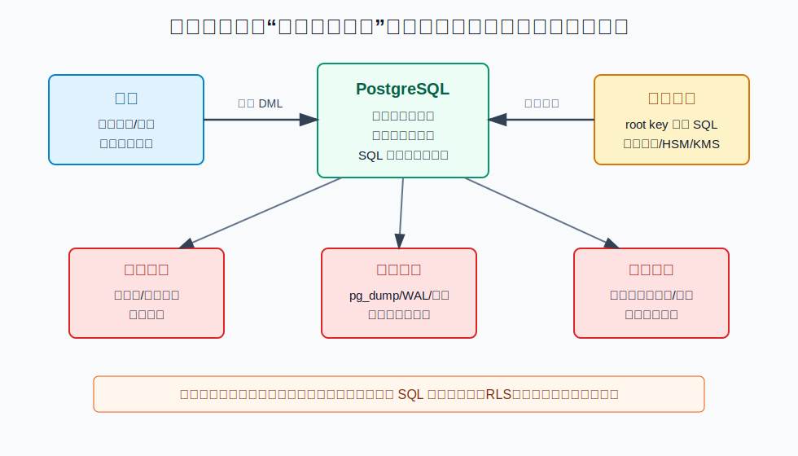
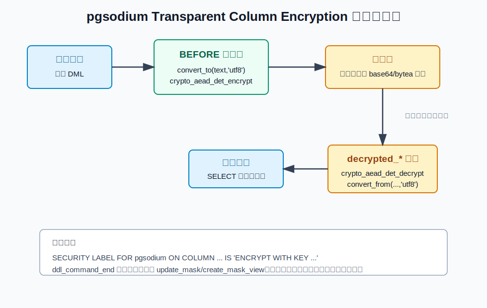
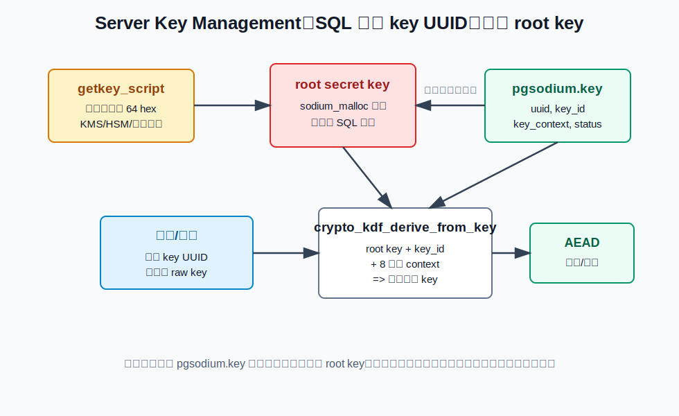
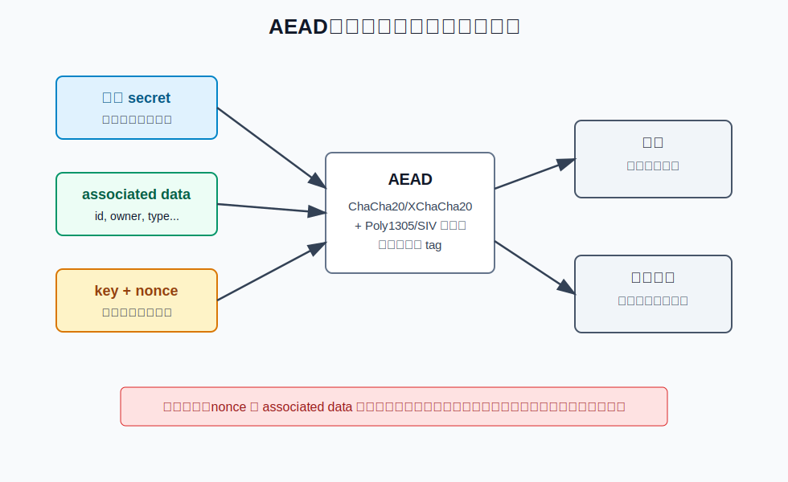
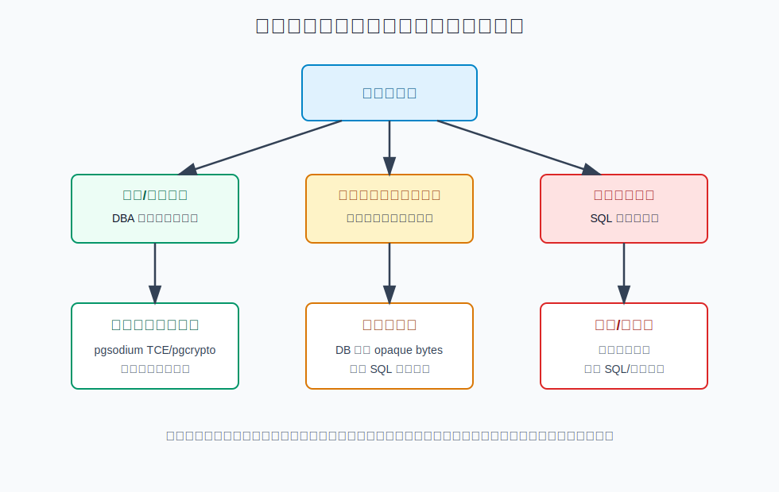

## 数据库筑基课 - 安全之 字段加密

### 作者
digoal

### 日期
2026-06-01

### 标签
PostgreSQL , 应用开发者 , 数据库筑基课 , 安全 , 字段加密 , pgsodium , AEAD , 密钥管理    

----

## 背景
  


本文属于[应用开发者数据库筑基课大纲](../202409/20240914_01.md)里“SQL、安全、权限、应用开发规范”这一类基础能力。

字段加密经常被误解成一句话：“把敏感列加密，数据库里就安全了。”真实情况要严格得多。字段加密只能回答一个更窄的问题：**当表文件、备份、WAL、逻辑导出或只读副本落到不该拿到它的人手里时，敏感字段是否仍然是明文？**

它不能自动解决这些问题：

- 已经拥有解密视图权限的数据库账号读取明文。
- 应用服务被入侵后通过正常 SQL 批量读取明文。
- 超级用户、操作系统用户、core dump、swap、调试器、恶意扩展访问数据库进程内存。
- 业务仍然要求对加密字段做范围查询、模糊查询、排序、唯一性校验。
- 日志、审计、异常堆栈、应用缓存把明文又写到别处。

所以字段加密不是“安全开关”，而是一种威胁模型选择：牺牲一部分查询能力、运维便利性和性能，换取离线数据副本泄露后的损失收敛。

本文主要基于 PostgreSQL 本地源码和文档、pgsodium 本地源码和 README、DeepWiki 对 `postgres/postgres` 与 `michelp/pgsodium` 的架构说明，以及四篇经典密码学论文：

- *The ChaCha20 block cipher to replace RC4*
- *Poly1305: A high-speed message authentication code*
- *Curve25519: new Diffie-Hellman speed records*
- *Argon2: The memory-hard function for password hashing and other applications*

## 一、它解决什么问题？

字段加密解决的是“数据副本失控之后，敏感字段是否仍可直接读取”的问题。

普通数据库安全模型默认依赖几道边界：

1. 操作系统和磁盘权限保护数据目录。
2. PostgreSQL 权限、RLS、视图和函数保护 SQL 访问。
3. 备份系统、对象存储、归档、灾备链路保护数据副本。
4. 运维流程控制谁能拿到 dump、快照和日志。

这些边界一旦有一层失守，明文敏感列就会出现在副本里。例如身份证号、手机号、银行卡 token、API secret、OAuth refresh token、个人健康信息、合同隐私字段、客户自带密钥材料等。

字段加密把风险拆成两个问题：

- 拿到表数据的人，是否也能拿到密钥？
- 能拿到密钥或调用解密路径的人，是否真的需要这种权限？



图 1 说明：字段加密重点降低表文件、备份、WAL、dump 等离线副本的价值。它不是权限系统的替代品。如果某个角色能访问解密视图或解密函数，数据库仍会把明文交给它。

代价也很明确：

- 密文通常不可直接做范围查询、模糊查询、排序和普通索引。
- 等值查询也只有在确定性加密、盲索引或额外摘要列等特定设计下才可能做。
- 更新、复制、备份恢复、密钥轮换、权限审计都会复杂化。
- 加密列上的错误建模可能泄露重复值、频率、长度、访问模式。

## 二、它是什么？

字段加密是把某些列的逻辑明文值转成物理密文值存储，并在受控路径上解密读取的机制。

从数据库工程角度，它至少有四个层次：

| 层次 | 关注点 | 典型实现 |
|---|---|---|
| 密码学算法 | 保密性、完整性、nonce、认证标签 | AEAD，如 ChaCha20-Poly1305、XChaCha20-Poly1305、SIV 类确定性 AEAD |
| 密钥管理 | root key、数据密钥、派生、轮换、吊销 | KMS/HSM、libsodium KDF、key id、key context |
| 数据库集成 | 写入加密、读取解密、DDL 感知、权限 | 触发器、视图、SECURITY LABEL、event trigger |
| 业务建模 | 查询能力、索引、租户隔离、审计 | 明文影子列、盲索引、按租户 key、RLS、最小权限 |

本文用 pgsodium 作为 PostgreSQL 字段加密的具体样本。pgsodium 是一个基于 libsodium 的 PostgreSQL 扩展。它既暴露 libsodium 的底层 SQL 函数，也提供两个高阶能力：

1. **Server Key Management**：通过 `shared_preload_libraries` 在 PostgreSQL 启动时执行 `pgsodium.getkey_script`，把 32 字节 root key 读入进程内存。README 明确说明 root secret key 不能通过 SQL 访问。源码入口在 `pgsodium/src/pgsodium.c` 的 `_PG_init()`。
2. **Transparent Column Encryption，TCE**：通过 `SECURITY LABEL FOR pgsodium ON COLUMN ... IS 'ENCRYPT WITH KEY ...'` 标记列，事件触发器生成 `BEFORE INSERT/UPDATE` 加密触发器和 `decrypted_*` 解密视图。

PostgreSQL 本身只提供机制，不替 pgsodium 解释标签含义。`SECURITY LABEL` 文档说明 label provider 是 C 模块通过 `register_label_provider` 注册的，PostgreSQL 负责存储 label，label 的合法性和含义由 provider 决定。

## 三、核心原理

### 3.1 写入路径：明文进 SQL，密文落表

pgsodium TCE 的核心模式是：明文经过受控 SQL 路径进入数据库，触发器在写入前把明文替换成密文；读取时应用不直接读业务表，而是读自动生成的解密视图。pgsodium 的测试覆盖了向 `decrypted_*` 视图插入和更新的路径；如果团队选择直接写业务表，也必须确认应用角色没有不必要的表读取权限。



图 2 说明：`SECURITY LABEL` 本身只是元数据。真正改变读写行为的是 pgsodium 后续生成的触发器函数、触发器和视图。业务表里存密文；视图里调用解密函数把密文转回明文列。

本地 pgsodium 源码中的关键路径：

| 文件 | 作用 |
|---|---|
| `pgsodium/src/pgsodium.c` | `_PG_init()` 调用 `sodium_init()`，注册 `pgsodium` label provider，预加载 root key，定义 `pgsodium.enable_event_trigger` 与 `pgsodium.getkey_script` |
| `pgsodium/src/pgsodium.h` | `pgsodium_secret_key`、`pgsodium_derive_helper()`、零化内存分配辅助函数 |
| `pgsodium/src/aead.c` | `crypto_aead_det_encrypt/decrypt` 及按 `key_id/context` 派生密钥的变体 |
| `pgsodium/src/crypto_aead_det_xchacha20.c` | 确定性 AEAD 的本地实现，包含 S2V 风格认证值和 XChaCha20 流加密 |
| `pgsodium/extension/pgsodium--3.1.8--3.1.9.sql` | 当前较新的 TCE 生成逻辑：`create_mask_view`、`trg_mask_update`、`encrypted_column`、`seclabel` |
| `pgsodium/sql/tce.sql` | TCE 使用示例：单列 key、按行 key、nonce、associated data、解密视图 |

`pgsodium.encrypted_column()` 对 `text` 列的生成逻辑大致是：

```sql
new.secret =
  CASE WHEN new.secret IS NULL THEN NULL ELSE
    CASE WHEN key_uuid IS NULL THEN NULL ELSE
      encode(
        pgsodium.crypto_aead_det_encrypt(
          convert_to(new.secret, 'utf8'),
          convert_to((associated_data)::text, 'utf8'),
          key_uuid::uuid,
          nonce
        ),
        'base64'
      )
    END
  END;
```

这带来几个工程事实：

- 触发器看到的是明文，明文会在数据库进程内出现。
- `text` 类型会经过 `convert_to(..., 'utf8')` 转为 `bytea` 再加密。
- 加密后的 `text` 列保存 base64 密文；`bytea` 列保存二进制密文。
- 本地 `pgsodium.encrypted_column()` 明确拒绝空字符串和空 `bytea`：空值会报错，`NULL` 会保持 `NULL`。
- 生成的触发器是 `BEFORE INSERT OR UPDATE OF "<列名>"`，所以更新该列会重新加密。

### 3.2 读取路径：视图是权限边界，不是魔法

pgsodium 生成的解密视图会保留原密文列，同时新增 `decrypted_<column>` 明文列。旧版本把视图放到 `pgsodium_masks` schema；较新 SQL 里可以通过表级 label 指定视图名，并支持 PostgreSQL 15 之后的 `security_invoker=true`。

例如：

```sql
SECURITY LABEL FOR pgsodium ON TABLE private.customer_secret
  IS 'DECRYPT WITH VIEW private.decrypted_customer_secret';
```

再对列加密：

```sql
SECURITY LABEL FOR pgsodium ON COLUMN private.customer_secret.secret_value
  IS 'ENCRYPT WITH KEY COLUMN key_id ASSOCIATED (tenant_id, secret_name) NONCE nonce';
```

生成视图后，应用应该只被授予解密视图所需的最小权限，不应该直接拥有业务表的宽权限。视图不是额外的安全证明；它只是把“谁能读明文”的问题从“谁能读表”转成“谁能读视图并执行解密函数”。

### 3.3 密钥路径：root key 不进 SQL，SQL 只传 UUID

pgsodium 的 Server Key Management 试图避免把 raw key 存在表里或 SQL 文本里。启动时 `_PG_init()` 读取 `pgsodium.getkey_script` 的输出，要求输出去掉换行后长度为 64 个十六进制字符，即 32 字节 root key。然后用 `sodium_malloc()` 分配内存，用 `hex_decode()` 写入 `pgsodium_secret_key`，并把临时字符串 `sodium_memzero()`。



图 3 说明：业务 SQL 通常只拿 key UUID。UUID 在 `pgsodium.valid_key` 里查到 `key_id` 和 `key_context`，再由 C 层使用 root key 派生出实际数据加密 key。离线拿到业务表和 `pgsodium.key` 元数据，不等于拿到 root key。

本地源码里的派生函数在 `pgsodium/src/pgsodium.h`：

```c
crypto_kdf_derive_from_key(
    PGSODIUM_UCHARDATA(result),
    subkey_size,
    subkey_id,
    (const char *) VARDATA_ANY(context),
    PGSODIUM_UCHARDATA(pgsodium_secret_key));
```

这里的 `context` 必须是 8 字节，`subkey_id` 是 64 位整数。README 也强调：同一个 key id 在不同 context 下会得到不同 key；如果攻击者只有数据库镜像，没有 root server secret key，就不能派生实际 key。

但边界要说清楚：

- 这不防拥有数据库进程内存读取能力的人。
- 这不防可以调用解密函数且能读取密文的人。
- 这不防应用账号被盗后走正常查询路径读明文。
- root key 的获取脚本、KMS/HSM 权限、启动日志、core dump、swap、备份恢复流程都变成安全边界。

### 3.4 AEAD：不要只加密，还要认证

字段加密不应该只追求“看不懂”。如果攻击者能篡改密文、nonce 或上下文字段，系统必须能发现。AEAD，Authenticated Encryption with Associated Data，正是同时提供保密性和完整性认证的接口。



图 4 说明：明文 secret 被加密；associated data 不加密，但参与认证标签计算。读取时如果密文、nonce 或 associated data 被篡改，认证校验失败，解密函数应报错而不是返回伪造明文。

这就是为什么 pgsodium TCE label 支持：

```sql
ASSOCIATED (tenant_id, secret_name)
NONCE nonce
```

例如把 `tenant_id` 和 `secret_name` 纳入 associated data 后，攻击者不能简单地把 A 租户某行密文搬到 B 租户某行来伪造“同一个 secret”。密文能否被复制成功，取决于 associated data、nonce、key 是否一致。

本地 pgsodium 的确定性 AEAD 代码使用 `crypto_aead_det_xchacha20_encrypt()`。其实现先通过 keyed generic hash 派生认证子 key 和加密子 key，用 S2V 风格流程把 associated data、nonce、明文绑定进认证值，再用 XChaCha20 加密。解密时会重新计算认证值并用 `sodium_memcmp()` 比较；不匹配就清零输出并返回失败。

相关论文的角色可以这样理解：

| 论文/算法 | 对字段加密的意义 |
|---|---|
| ChaCha20 | 高速流密码，用随机/扩展 nonce 和 key 生成密钥流，适合软件实现 |
| Poly1305 | 高速消息认证码，用于检测密文或上下文是否被篡改 |
| Curve25519 | 公钥密钥交换基础，适合客户端间或服务间协商共享密钥；不是 TCE 主路径，但 pgsodium 的 box/kx API 会用到同类思想 |
| Argon2 | 密码派生与口令哈希；适合从人类密码派生 key 或验证密码，不应和服务器随机 root key 派生混为一谈 |

### 3.5 PostgreSQL 承载机制：SECURITY LABEL 与 event trigger

PostgreSQL 文档说明：`SECURITY LABEL` 可以给表、列、角色、函数、schema 等对象打 label；每个 provider 对同一个对象最多一个 label；provider 必须由 C 代码通过 `register_label_provider` 注册。用户必须拥有对象才能设置 label。

pgsodium 在 `_PG_init()` 中调用：

```c
register_label_provider("pgsodium", pgsodium_object_relabel);
```

`pgsodium_object_relabel()` 只做语法级校验：

- 表 label 必须以 `DECRYPT WITH VIEW` 开头。
- 列 label 必须以 `ENCRYPT WITH` 开头。
- 角色 label 必须以 `ACCESS` 开头。
- 其他对象类型不支持。

真正生成触发器和视图的是 PostgreSQL event trigger。PostgreSQL 文档说明，`ddl_command_end` 在 DDL 执行之后、事务提交之前触发，此时系统目录已经能看到变更；可以通过 `pg_event_trigger_ddl_commands()` 查看本次 DDL。pgsodium 的 `pgsodium.trg_mask_update()` 会在相关 DDL 后调用 `pgsodium.update_mask()`。

这也解释了一个运维现象：如果禁用 `pgsodium.enable_event_trigger`，label 仍可能存在，但触发器和视图不会自动更新，需要手工调用 `pgsodium.update_masks()` 或相关函数重新生成。

## 四、横向对比

| 维度 | pgsodium TCE | pgcrypto 手写函数 | 应用侧加密 | 磁盘/卷加密 |
|---|---|---|---|---|
| 主要目标 | 数据库内自动列加密，降低离线副本泄露风险 | 提供 SQL 加密函数，策略由应用/SQL 自己写 | 数据库永远只看到密文 | 防设备丢失、裸盘读取 |
| 写入代价 | 触发器加密，写入 CPU 增加，更新列会重新加密 | 每条 SQL 显式调用函数 | 应用 CPU 增加，DB 写密文 | 低，对 SQL 透明 |
| 读取代价 | 视图解密，读明文时 CPU 增加 | 显式解密 | 应用解密 | 低，对 SQL 透明 |
| 查询能力 | 明文查询受限，需额外建模 | 取决于写法 | 最弱，DB 通常无法理解密文 | 不影响 SQL |
| 密钥边界 | root key 在 DB 进程内，不经 SQL 暴露 | 容易把 key 放入 SQL、日志或表 | key 可完全离开 DB | key 在存储层 |
| 事务/MVCC | 密文随行版本进入 MVCC、WAL、备份 | 同左 | 同左，但 DB 只见密文 | 数据库层仍是明文页 |
| 适合场景 | PostgreSQL 内需要受控明文视图、降低 dump/备份风险 | 简单加密函数、一次性工具、低自动化需求 | DBA/数据库进程也不能可信 | 防物理盘和云盘快照误取 |
| 不适合场景 | 需要在密文字段上大量范围/模糊查询 | 权限治理复杂或开发容易漏调用 | 需要复杂 SQL 分析密文字段 | 需要防 pg_dump、SQL 读取、备份明文 |

原因很简单：加密发生在哪一层，哪一层就能看到明文。磁盘加密发生在存储层，数据库缓冲区和 SQL 结果仍是明文。pgsodium TCE 发生在数据库层，数据库进程能看到明文，但备份表数据更难直接读。应用侧加密发生在应用层，数据库查询能力损失最大，但密钥边界最干净。



图 5 说明：不要先选工具再倒推需求。先问主要防谁，再问是否接受查询能力下降，再问团队是否有密钥轮换、权限审计、备份恢复和事故演练能力。

## 五、效果如何？

字段加密的收益要按攻击面拆开看。

**对离线副本泄露有效。** 如果攻击者只拿到业务表、WAL、磁盘快照或 dump，而没有 root key、KMS 权限、数据库解密权限，敏感列不是明文。

**对误发备份、低权限分析库、冷备归档有效。** 可以把部分敏感字段变成密文，降低数据外发后的直接合规风险。

**对数据库在线读权限无效。** 只要账号能走解密视图或解密函数读明文，加密不是阻止它读取，而是把读取行为变成可授权、可审计的路径。

**对查询能力有明显损耗。** 加密后的字段通常不能直接使用普通 B-tree 范围索引、LIKE、全文检索、统计直方图、排序比较。确定性加密可暴露重复值；随机 nonce 可隐藏重复值但更不利于等值匹配。

**对性能有 CPU 与空间成本。** pgsodium 的 AEAD 密文会带认证开销。源码里 `crypto_aead_det_encrypt()` 的输出长度是明文长度加 `crypto_aead_det_xchacha20_ABYTES`；README 的示例说明签名会附加到值上。具体吞吐和延迟必须在目标机器、目标字段长度、目标并发下压测，不能照搬数字。

**对运维有流程成本。** root key 获取脚本、启动失败处理、灾备恢复、密钥轮换、迁移期间事件触发器开关、视图权限复制、审计报表，都要进入 SOP。

## 六、实操 DEMO

下面 SQL 根据 pgsodium README、`sql/tce.sql` 和本地 extension SQL 整理，当前环境没有运行一个已安装并 `shared_preload_libraries=pgsodium` 的 PostgreSQL 实例，因此示例未执行，不包含伪造输出。

### 6.1 启用扩展和 root key

`postgresql.conf` 示例：

```conf
shared_preload_libraries = 'pgsodium'
pgsodium.getkey_script = '/secure/path/pgsodium_getkey'
```

`pgsodium.getkey_script` 必须可由 PostgreSQL 进程执行，并输出 64 个十六进制字符。修改 `shared_preload_libraries` 和 `pgsodium.getkey_script` 后需要重启 PostgreSQL。

数据库内创建扩展：

```sql
CREATE EXTENSION IF NOT EXISTS pgsodium;
```

### 6.2 单列固定 key：最小可用版本

```sql
CREATE SCHEMA IF NOT EXISTS private;

CREATE TABLE private.user_secret (
  id bigserial PRIMARY KEY,
  user_id bigint NOT NULL,
  secret_value text
);

SELECT 'ENCRYPT WITH KEY ID ' || (pgsodium.create_key()).id AS label \gset

SECURITY LABEL FOR pgsodium ON COLUMN private.user_secret.secret_value
  IS :'label';

INSERT INTO private.user_secret(user_id, secret_value)
VALUES (1, 'oauth-refresh-token-demo');

-- 业务表中 secret_value 应为密文。
SELECT id, user_id, secret_value
FROM private.user_secret;

-- 自动生成的解密视图名取决于 pgsodium 版本和表级 label。
-- 常见默认形式是 decrypted_user_secret 或 pgsodium_masks 下的同名视图。
SELECT id, user_id, decrypted_secret_value
FROM private.decrypted_user_secret;
```

这种模型简单，但整列共享一个 key。key 轮换通常意味着重写整张表；拥有该 key 解密路径的人可以解开整列。生产中更常见的权限模型是让应用写入/更新解密视图，由视图背后的表触发器完成加密，减少应用直接接触密文表的机会。

### 6.3 每行 key + nonce + associated data

```sql
CREATE TABLE private.customer_secret (
  id bigserial PRIMARY KEY,
  tenant_id bigint NOT NULL,
  secret_name text NOT NULL,
  secret_value text,
  key_id uuid NOT NULL DEFAULT (pgsodium.create_key()).id,
  nonce bytea NOT NULL DEFAULT pgsodium.crypto_aead_det_noncegen()
);

SECURITY LABEL FOR pgsodium ON TABLE private.customer_secret
  IS 'DECRYPT WITH VIEW private.decrypted_customer_secret';

SECURITY LABEL FOR pgsodium ON COLUMN private.customer_secret.secret_value
  IS 'ENCRYPT WITH KEY COLUMN key_id ASSOCIATED (tenant_id, secret_name) NONCE nonce';

INSERT INTO private.customer_secret(tenant_id, secret_name, secret_value)
VALUES
  (10, 'stripe_token', 'tok_live_demo_1'),
  (20, 'stripe_token', 'tok_live_demo_2');

SELECT id, tenant_id, secret_name, secret_value, key_id
FROM private.customer_secret;

SELECT id, tenant_id, secret_name, decrypted_secret_value
FROM private.decrypted_customer_secret;
```

这个版本更接近生产建模：

- 每行 key id 方便按租户、按客户、按密钥生命周期隔离。
- nonce 降低相同明文产生相同密文的可观察性。
- `tenant_id`、`secret_name` 进入 associated data，防止密文被搬到不同上下文后仍可解密。

### 6.4 权限收口

示例方向如下，具体角色名按业务调整：

```sql
CREATE ROLE app_secret_reader LOGIN;

REVOKE ALL ON private.customer_secret FROM PUBLIC;
REVOKE ALL ON private.decrypted_customer_secret FROM PUBLIC;

GRANT USAGE ON SCHEMA private TO app_secret_reader;
GRANT SELECT, INSERT, UPDATE ON private.decrypted_customer_secret TO app_secret_reader;
GRANT USAGE ON SEQUENCE private.customer_secret_id_seq TO app_secret_reader;

-- pgsodium 的 key UUID API 权限通常通过 pgsodium_keyiduser 管理。
GRANT pgsodium_keyiduser TO app_secret_reader;
```

实际生产里通常还要配合 RLS，把“能读解密视图”继续收窄到“只能读自己租户或自己负责的数据”。

### 6.5 迁移时手工刷新

pgsodium README 说明可以关闭自动生成：

```sql
SET pgsodium.enable_event_trigger = 'off';
```

迁移结束后需要重新生成视图和触发器：

```sql
SET pgsodium.enable_event_trigger = 'on';
SELECT pgsodium.update_masks();
```

注意：这类操作应在测试环境先演练。事件触发器失败会导致包含它的 DDL 事务失败；PostgreSQL event trigger 文档明确说明，`ddl_command_end` trigger 报错会回滚该 DDL。

## 七、最佳实践

### 7.1 面向数据库架构师

先写威胁模型，再选方案。

- 如果主要防裸盘和云盘快照误取，优先考虑磁盘/卷加密，字段加密可能过重。
- 如果主要防备份、dump、只读副本泄露，可以考虑数据库侧字段加密。
- 如果 DBA、数据库超级用户、数据库进程所在主机都不能接触明文，应该把加密放到应用侧或客户端侧，数据库只存 opaque bytes。
- 不要把所有 PII 都无差别加密。先分级：认证 secret、token、证件号、联系方式、健康/金融信息、合同敏感条款，不同字段的查询需求不同。

建模时优先把敏感字段拆成“展示值”和“检索值”：

- 展示值用 AEAD 加密。
- 检索值如果确实需要等值查询，可使用单独的 HMAC/盲索引列，并接受频率泄露与碰撞/轮换管理成本。
- 范围查询、模糊查询、排序不要假装透明支持；要重新设计业务流程。

### 7.2 面向 DBA

把密钥、权限和备份恢复当成一套系统管理。

- `pgsodium.getkey_script` 的权限、审计、依赖服务、超时和失败告警要进入启动 SOP。
- root key 不应写入普通配置管理、镜像、容器环境变量、日志。
- 限制 `pgsodium_keymaker`，普通应用尽量只拿 `pgsodium_keyiduser` 或更窄权限。
- 对解密视图做单独审计：谁能读、读了多少、是否跨租户。
- 演练密钥轮换：新增 key、双写/重加密、验证、撤销旧 key、备份恢复。
- 对 `pg_dump`、逻辑复制、CDC、审计日志、慢 SQL 日志确认是否出现明文。
- 禁止把解密视图随意接入 BI、离线数仓、测试环境。

本地 pgsodium SQL 里有一个需要核查的源码观察：`pgsodium.valid_key` 在 `extension/pgsodium--2.0.2--3.0.0.sql` 中写的是：

```sql
status IN ('valid', 'default')
AND CASE WHEN expires IS NULL THEN true ELSE expires < now() END
```

README 描述是过滤有效且未过期 key。从语义看，`expires < now()` 更像“已过期”。这可能是当前本地版本或历史升级脚本的实现差异。生产使用前应以实际安装版本的 `\d+ pgsodium.valid_key` 和测试结果为准，不要只按 README 假设过期逻辑。

### 7.3 面向业务开发者

把加密字段当成特殊字段，不要当成普通字符串。

- 写入前确认字段是否允许空字符串。pgsodium 当前生成逻辑拒绝空字符串和空 `bytea`，但允许 `NULL`。
- 不要对密文列做业务排序、LIKE、正则、范围查询。
- 不要把解密后的值写入应用日志、错误信息、链路追踪 tag、消息队列、缓存。
- 使用 `ASSOCIATED` 绑定租户、记录 id、字段名等上下文，避免密文跨行搬移。
- UPSERT 要特别小心。pgsodium README 指出 `INSERT ... ON CONFLICT DO UPDATE` 里 `EXCLUDED` 值可能已经被触发器加密，直接更新容易形成二次加密或错误语义。应封装存储过程或明确从解密视图取旧明文后重新写入。
- 读写路径要固定：写业务表，读解密视图。不要在不同代码路径里混用表和视图。

## 八、适合与不适合场景

适合：

- SaaS 多租户系统中，每个租户有少量 secret、token、凭据、敏感配置。
- 用户个人隐私字段主要用于展示，不参与复杂 SQL 查询。
- 备份、灾备、只读副本、测试数据流转存在较高泄露风险。
- 合规要求明确要求敏感字段在数据库静态副本中不可读。
- 团队有能力管理 KMS/HSM、key rotation、权限审计和恢复演练。

不适合：

- 加密字段需要高频范围查询、模糊搜索、排序、聚合统计。
- 主要威胁是应用账号被盗或业务接口越权，字段加密不会阻止正常解密查询。
- 主要威胁是超级用户或主机 root，数据库侧 TCE 不能提供强隔离。
- 团队没有密钥备份与恢复演练能力。丢 key 等于丢数据。
- 希望“对应用完全透明且不改变任何 SQL 语义”。透明是有边界的，尤其在查询和 UPSERT 上。

## 九、常见坑

1. **把加密当脱敏。** 加密是可逆保护；脱敏是降低展示敏感度。给客服页面展示手机号后四位，不应该靠解密全量手机号再在前端截断。
2. **把 key 放进 SQL。** 手写 `pgcrypto` 或 raw pgsodium API 时，key 很容易进入 SQL 文本、日志、`pg_stat_activity`、慢查询采集。
3. **直接给应用 base table 宽权限。** 如果应用可以读密文表、执行解密函数、读 key 元数据，就要重新评估它是否已经绕过视图边界。
4. **忘记 associated data。** 只加密字段值，不绑定租户/id/字段名，可能允许密文搬移攻击。
5. **nonce 复用或没有模型。** 随机 nonce 需要保证同一 key 下不重复；确定性加密不需要 nonce，但会泄露重复明文。
6. **密钥轮换只写在文档里。** 没有演练过的轮换方案不能算方案。
7. **把测试库当安全区。** 生产密文如果连同 root key 或可解密路径复制到测试环境，就等于扩大了明文边界。
8. **忽略 NULL、空字符串、编码。** pgsodium TCE 对 `text` 使用 UTF-8 转换，并拒绝空字符串。业务字段约束要提前对齐。
9. **忽略事件触发器的 DDL 影响。** pgsodium 依赖 `ddl_command_end` 生成对象，迁移工具、权限、schema 重命名、列改名都要测试。
10. **误以为加密字段还能自动建普通索引。** 密文索引只能服务密文比较，不能服务明文语义；额外检索列要单独设计。

## 十、扩展问题

1. 如果一个字段既要支持精确查询，又要隐藏明文，应该用确定性加密、HMAC 盲索引，还是应用侧搜索服务？各自泄露什么信息？
2. 如果每个租户一个 key，租户迁移、禁用、恢复、删除时，key 生命周期如何设计？
3. 如果 root key 丢失，哪些数据不可恢复？你的备份恢复流程是否同时验证了 key 恢复？
4. 如果 DBA 需要临时排障访问明文，授权、审批、审计和自动撤销如何实现？
5. 如果字段加密后统计信息失真，优化器会如何选择计划？是否需要影子列或业务侧预过滤？
6. 如果使用逻辑复制或 CDC，下游看到的是密文还是明文？解密发生在哪里？

## 十一、扩展阅读

- PostgreSQL 本地文档：`postgres/doc/src/sgml/ref/security_label.sgml`，`SECURITY LABEL` 与 label provider 机制。
- PostgreSQL 本地文档：`postgres/doc/src/sgml/event-trigger.sgml`，`ddl_command_end` 事件触发器行为。
- PostgreSQL 本地源码：`postgres/src/include/catalog/objectaccess.h`，object access hooks 设计边界。
- PostgreSQL 本地文档：`postgres/doc/src/sgml/pgcrypto.sgml`，`pgcrypto` 加密函数与口令哈希函数。
- pgsodium 本地 README：`pgsodium/README.md`，Server Key Management、Key Management API、TCE、UPSERT、security invoker views。
- pgsodium 本地源码：`pgsodium/src/pgsodium.c`，`_PG_init()`、label provider、root key 加载。
- pgsodium 本地源码：`pgsodium/src/pgsodium.h`，`pgsodium_derive_helper()` 与零化内存辅助函数。
- pgsodium 本地源码：`pgsodium/src/aead.c`，AEAD SQL 函数与 key-id 派生版本。
- pgsodium 本地源码：`pgsodium/src/crypto_aead_det_xchacha20.c`，确定性 AEAD 实现。
- pgsodium 本地 SQL：`pgsodium/sql/tce.sql`，TCE 示例。
- pgsodium 本地 SQL：`pgsodium/extension/pgsodium--3.1.8--3.1.9.sql`，较新的触发器和视图生成逻辑。
- DeepWiki：`michelp/pgsodium`，pgsodium Server Key Management 与 TCE 架构说明。
- DeepWiki：`postgres/postgres`，PostgreSQL `SECURITY LABEL`、event trigger、扩展承载机制说明。
- Daniel J. Bernstein：*The ChaCha20 block cipher to replace RC4*。
- Daniel J. Bernstein：*Poly1305: A high-speed message authentication code*。
- Daniel J. Bernstein：*Curve25519: new Diffie-Hellman speed records*。
- Alex Biryukov, Daniel Dinu, Dmitry Khovratovich：*Argon2: The memory-hard function for password hashing and other applications*。
  
## 附录 
1、问 gemini
```
https://github.com/michelp/pgsodium 相关的论文
```

2、克隆代码  
```  
git clone --depth 1 https://github.com/postgres/postgres
git clone --depth 1 https://github.com/michelp/pgsodium
```  
  
3、启用 codex, 使用 [数据库筑基课 skill](../skills/README.md).  
```
文章标题: 
  数据库筑基课 - 安全之 字段加密
项目源码(本地目录): 
  postgres
  pgsodium
项目 codebase 文件名: 
  postgres/CLAUDE.md 
  pgsodium/CLAUDE.md 
相关论文:
  The ChaCha20 block cipher to replace RC4
  Poly1305: a high-speed message authentication code
  Curve25519: new Diffie-Hellman speed records
  Argon2: the memory-hard function for password hashing and other applications
开源项目相关的 deepwiki repoName: 
  postgres/postgres
  michelp/pgsodium
```


  
  
#### [PostgreSQL 解决方案集合](../201706/20170601_02.md "40cff096e9ed7122c512b35d8561d9c8")
  
  
#### [德哥 / digoal's Github - 公益是一辈子的事.](https://github.com/digoal/blog/blob/master/README.md "22709685feb7cab07d30f30387f0a9ae")
  
  
#### [About 德哥](https://github.com/digoal/blog/blob/master/me/readme.md "a37735981e7704886ffd590565582dd0")
  
  

  
