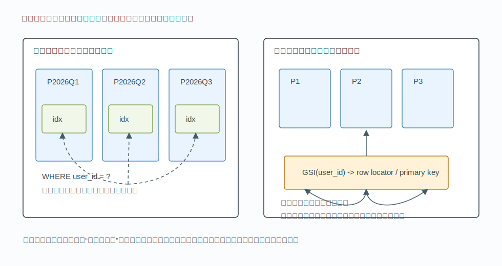
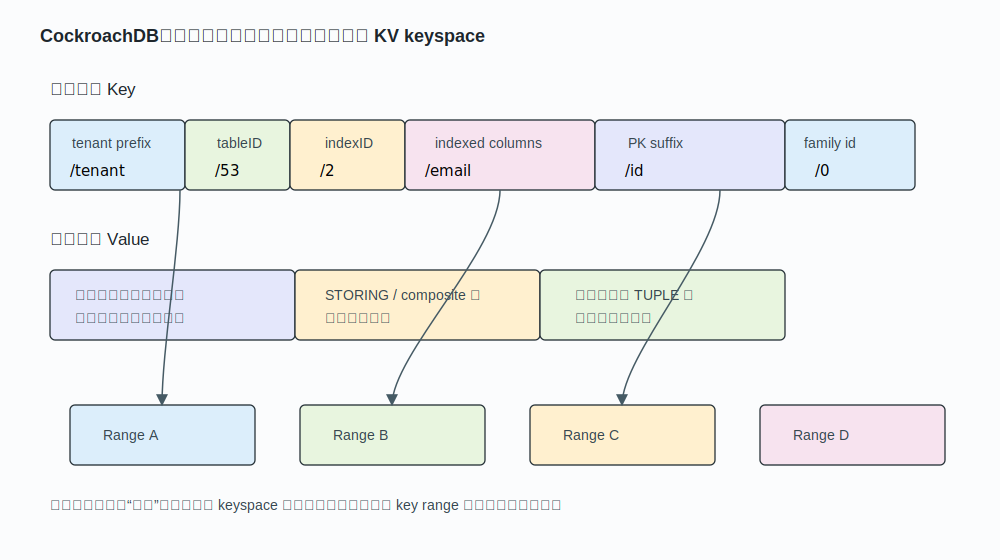
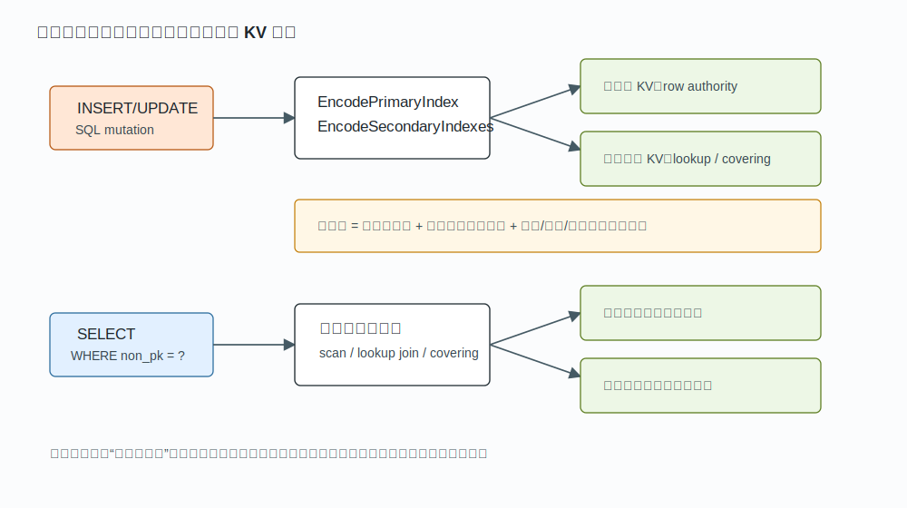
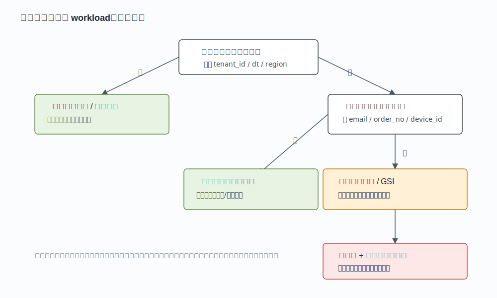

## 数据库筑基课 - 最佳实践之 分区表全局索引/分布式数据库全局二级索引

### 作者
digoal

### 日期
2026-06-01

### 标签
PostgreSQL , cockroachdb , 应用开发者 , 数据库筑基课 , 索引结构 , 分区表 , 分布式数据库 , 全局二级索引    

----

## 背景
  
  

本节属于“索引结构 + 场景实践”。当前工作区没有检索到数据库筑基课大纲文件，因此本文不强行添加不存在的大纲链接。

很多系统一开始分区，是为了解决一个很朴素的问题：表太大，按时间、租户、地域拆开以后，清理老数据、冷热分层、分区裁剪都更可控。但分区之后，另一个问题马上出现：如果订单表按 `created_at` 分区，而业务又经常按 `order_no`、`user_id`、`phone` 查一条记录，数据库到底应该查哪一个分区？

本地索引的答案是：每个分区各建一棵索引，查询不带分区键时可能要探测多个分区。全局索引的答案是：维护一套跨分区的索引键空间，用非分区键直接定位行。分布式数据库的全局二级索引也是同一类问题，只是“分区”变成了分布式 KV keyspace 中可切分、可复制、可迁移的 range。

本文把两个概念放在一起讲：

1. **分区表全局索引**：典型问题是单库分区表中，本地索引无法直接跨分区保证唯一性或点查效率。
2. **分布式数据库全局二级索引**：典型问题是表数据分散在多个节点，二级索引仍然需要提供整表范围的查找、唯一性和事务一致性。

这两者不是同一个实现，但背后的取舍相同：**把读路径的多分区扫描，换成写路径、事务路径和维护路径的全局成本。**

## 一、它解决什么问题？

先看一个常见模型：

```sql
CREATE TABLE orders (
  tenant_id  bigint NOT NULL,
  order_no   text   NOT NULL,
  user_id    bigint NOT NULL,
  created_at timestamptz NOT NULL,
  amount     numeric NOT NULL,
  PRIMARY KEY (tenant_id, created_at, order_no)
) PARTITION BY RANGE (created_at);
```

如果查询总是这样：

```sql
SELECT *
FROM orders
WHERE created_at >= TIMESTAMP '2026-06-01'
  AND created_at <  TIMESTAMP '2026-07-01'
  AND tenant_id = 1001;
```

分区键在谓词里，分区裁剪有效，本地索引很好。

但如果高频查询是：

```sql
SELECT *
FROM orders
WHERE order_no = 'O202606010001';
```

问题就变了。`order_no` 不告诉数据库数据在哪个时间分区。没有全局结构时，数据库要么查所有可能分区的本地索引，要么要求应用先知道分区键，要么维护一张额外的路由表。

全局索引解决的是三类问题：

1. **跨分区点查**：按非分区键查一条或少量记录，不想扫多个分区。
2. **跨分区唯一性**：例如 `order_no`、`email`、`id_card_no` 必须整表唯一，而不是每个分区内唯一。
3. **访问路径与生命周期解耦**：表按时间做生命周期管理，但查询按用户、设备、订单号、地理编码等维度访问。

代价也很直接：

1. 每次写入不只写表分区，还要写全局索引。
2. 分区 `DROP`、`DETACH`、`TRUNCATE`、迁移时，全局索引也要处理对应条目。
3. 唯一性检查可能跨分区、跨节点，延迟和冲突窗口都扩大。
4. 全局索引自身可能成为热点，尤其是单调递增键、低基数键和集中写入键。



图 1 说明：本地索引把索引维护限定在单个分区内，适合带分区键的查询和分区维护；全局索引把非分区键集中到一套跨分区键空间里，适合跨分区点查，但写入和维护要同步更多全局状态。

## 二、它是什么？

**分区表全局索引**，是指索引的逻辑覆盖范围跨越多个表分区，索引条目可以指向不同分区中的行。它和本地索引的关键区别不是 B-tree 形态，而是索引分区是否与表分区一一对应。

**分布式数据库全局二级索引**，是指二级索引对逻辑表全表可见，查询可以通过二级索引键定位主键或行位置；物理上，索引数据会像普通表数据一样分布在多个节点、多个 range、多个副本中。

几个术语要分清：

| 术语 | 含义 | 关键边界 |
|---|---|---|
| 本地索引 | 每个表分区维护自己的索引 | 管理简单，跨分区唯一性弱 |
| 全局非分区索引 | 一棵逻辑索引覆盖所有表分区 | 点查强，分区维护成本高 |
| 全局分区索引 | 索引自己也分区，但分区规则可独立于表 | 缓解热点，但仍是跨表分区结构 |
| 分布式 GSI | 二级索引作为全局 KV 范围分布存储 | 不依赖单机根节点，依赖分布式事务和 range 调度 |
| 覆盖索引 | 查询所需列都在二级索引里 | 减少回表，但增加索引体积和写放大 |

Oracle 文档把本地索引描述为与表分区等分区，表分区维护时局部性更好；全局分区索引的分区键和分区数量可以独立于表分区，索引条目可能引用多个底层表分区。PostgreSQL 当前分区表上的父级索引是“虚拟”的，实际数据在各个子分区索引里；其唯一/主键约束要求包含所有分区键，因为单个子分区索引无法直接保证跨分区唯一性。MySQL 分区表也要求每个唯一键包含分区表达式中的全部列。这些限制本质上都来自同一个事实：**如果没有跨分区索引或跨分区唯一性机制，局部索引只能证明局部唯一。**

## 三、核心原理

### 3.1 本地索引为什么不能自然保证全局唯一？

假设表按月份分区，每个分区都有 `UNIQUE(order_no)` 本地索引。数据库只能在当前分区的索引里看到 `order_no = 'A001'` 是否存在。另一个月份分区里是否已经有 `A001`，这棵本地索引并不知道。

所以很多数据库要求：

```sql
UNIQUE(partition_key, business_key)
```

这不是语法洁癖，而是数学条件：只要唯一键包含分区键，两个相同的唯一键值一定会路由到同一个分区，同一个本地索引就能完成唯一性证明。反过来，如果唯一键不包含分区键，重复值可能散落在不同分区，本地索引无法证明全局唯一。

### 3.2 全局索引如何定位行？

全局索引条目通常长这样：

```text
global_index_key = indexed_columns
global_index_value = row_locator
```

`row_locator` 可以是物理行地址，也可以是主键，也可以是包含分区键的逻辑定位信息。查询流程是：

1. 按 `indexed_columns` 搜全局索引。
2. 从索引值拿到主键或行定位符。
3. 如果索引不覆盖查询列，再回表读取完整行。

如果索引包含查询所需列，也就是覆盖索引，就可以少一次回表。但覆盖列越多，索引越大，写入、更新、压缩、备份、复制的成本也越高。

### 3.3 CockroachDB：全局二级索引不是单点索引，而是全局 KV keyspace

CockroachDB 的源码和技术说明给了一个很好的分布式参照。CockroachDB 把权威表数据称为 primary index，SQL 二级索引是 secondary index；所有索引都有 table 内唯一的 index ID。技术说明 `docs/tech-notes/encoding.md` 明确写到，二级索引键包含 table ID、index ID、索引列、必要时的隐式主键列、列族 ID 等字段；主要编码函数是 `EncodeSecondaryIndex`。

源码入口在：

```text
../cockroach/pkg/sql/rowenc/index_encoding.go
```

关键路径是：

1. `EncodeSecondaryIndex` 先用 `MakeIndexKeyPrefix(codec, tableID, indexID)` 生成索引前缀。
2. `encodeSecondaryIndexWithKeyPrefix` 编码索引列。
3. 对非唯一索引，或唯一索引中索引列含 `NULL` 的情况，把 `KeySuffixColumnIDs` 编码进 key，使每个 KV key 唯一。
4. `EncodeSecondaryIndexes` 对一行需要维护的多个二级索引循环编码，并对索引 key/value 的内存占用做统计。

简化后可以理解为：

```text
/tenant/tableID/indexID/indexed_columns/[primary_key_suffix]/familyID -> stored columns or primary key data
```

`pkg/keys/sql.go` 中的 `TablePrefix` 和 `IndexPrefix` 也能看到这个分层：先 tenant prefix，再 table prefix，再 index prefix。也就是说，二级索引不是每个节点私有的一棵小树，而是 CockroachDB 全局有序 KV 空间中的一段 key range。



图 2 说明：CockroachDB 的“全局”来自逻辑 keyspace，而不是来自某个中心化索引节点。索引 key 先由 tenant/table/index 前缀定位到某个索引，再由索引列和主键后缀保证排序与唯一性；底层 KV 会按 key range 切分和复制。

### 3.4 写路径：索引越多，写放大越大

在任何数据库里，二级索引都不是免费读优化。一次写入至少要维护：

1. 主数据或主索引条目。
2. 每个受影响的二级索引条目。
3. 唯一索引的冲突检测。
4. MVCC/事务元数据。
5. 分布式数据库中的复制、共识、锁或冲突检测。

CockroachDB 的指标名也直接暴露了这个事实：`sql.statements.index_rows_written.count` 统计 SQL 语句修改的 primary 和 secondary index rows，`sql.statements.index_bytes_written.count` 统计对应字节数。这说明从系统观测角度，索引写入是独立成本项。



图 3 说明：全局二级索引改善的是读路径，尤其是按非主键、非分区键查找的路径；代价落在写路径，每次插入、更新、删除都要同步维护更多 KV 条目或索引页。

### 3.5 多地域与隐式分区：全局不等于所有访问都跨区域

CockroachDB 的 `REGIONAL BY ROW` 很适合解释“全局索引 + 局部访问”的折中。官方文档说明，`REGIONAL BY ROW` 表中的每行有一个隐藏的 `crdb_region` 列；该设置会用 `crdb_region` 作为分区键前缀，自动按 region 分区表和所有索引。源码 `pkg/sql/regions/doc.go` 也说明，`REGIONAL BY ROW` 的 placement 由每个 region 对应的 partition/subzone 处理。

这意味着它不是简单地把所有二级索引集中到某个全球中心，而是把 region 信息放到键空间前缀，使同一区域的数据和索引条目更容易被放在对应区域的 range 上。与此同时，CockroachDB 还有 `sql.defaults.locality_optimized_partitioned_index_scan.enabled` 设置，优化器可以先搜索 gateway region 的本地节点，必要时再搜索远端区域。

但这类机制也有维护边界。`pkg/sql/region_util.go` 中可以看到，当数据库正在 `ADD REGION` 或 `DROP REGION` 时，`REGIONAL BY ROW` 表上的索引创建/删除会被阻止；反过来，索引变更进行中也会阻塞 region 变更。这不是偶然限制，而是为了避免 region 分区、zone config、索引 descriptor 之间出现不一致。

## 四、横向对比

| 维度 | 本地索引 | 分区表全局索引 | 分布式全局二级索引 |
|---|---|---|---|
| 主要目标 | 分区内访问和维护 | 跨分区点查、唯一性 | 整表逻辑索引，物理分布存储 |
| 写入代价 | 低，通常只碰目标分区索引 | 中到高，要维护跨分区结构 | 高，叠加分布式事务和复制成本 |
| 读取代价 | 带分区键很低；不带分区键可能多分区探测 | 非分区键点查低 | 非主键点查低，但可能跨 range/跨 region |
| 空间成本 | 每个分区一份索引 | 全表一份或独立分区的一组索引 | 全局 KV 范围的一组索引数据和副本 |
| 唯一性 | 通常只能自然保证分区内唯一 | 可保证跨分区唯一 | 可保证逻辑表范围唯一，依赖事务协议 |
| 分区维护 | 简单，DROP/DETACH 局部影响 | 复杂，可能需要维护或标记全局索引条目 | schema/range/region 变更要协调 |
| 热点风险 | 局限在分区 | 全局键可能集中 | 可通过 hash/shard/range split 缓解但不能消灭 |
| 适合场景 | 时间分区、冷热分层、查询带分区键 | 订单号、用户号、设备号跨分区点查 | 分布式 SQL、跨节点二级索引、全球业务 |
| 不适合场景 | 高频不带分区键查询 | 高频写入且频繁分区维护 | 写多读少、低基数热点键、跨地域强一致写 |

表里的关键不是“谁更高级”，而是访问模式不同。本地索引是把数据管理局部化，全局索引是把访问路径全局化。你不能同时免费得到两者。

Oracle 提供了本地索引、全局非分区索引、全局分区索引等丰富形态，因此更适合需要跨分区唯一性和复杂分区维护策略的大型单库。PostgreSQL 分区表父索引是虚拟结构，实际索引在分区上；它通过“唯一键必须包含全部分区键”的规则避免跨分区唯一性问题。MySQL 对分区表唯一键也有类似要求。CockroachDB 则把二级索引天然放进全局 KV keyspace，再通过 range split、replication、leaseholder、zone/span config 管理物理分布。

## 五、效果如何？

不要用“全局索引一定快”这种话来判断。它只对特定查询变快。

收益主要体现在：

1. **跨分区点查从 N 次探测变成一次索引查找**。如果一个表有 365 个日分区，按 `order_no` 查询没有全局索引时可能需要探测很多分区；全局索引可以直接定位。
2. **跨分区唯一性可被数据库约束承载**。否则只能依赖应用路由表、外部锁、消息幂等表或包含分区键的唯一约束。
3. **业务访问维度和数据生命周期维度可以解耦**。表按时间清理，查询按用户或订单号定位。

代价主要体现在：

1. **写放大**：每增加一个二级索引，就增加一条或多条索引写入。覆盖列、列族、多值索引、倒排索引还会进一步放大。
2. **事务延迟**：唯一性检查和索引写入可能访问不同 page、partition、range、region。
3. **维护复杂度**：分区级 DDL 不再只影响分区本身，全局索引可能需要同步维护、异步清理或标记不可用。
4. **优化器复杂度**：统计信息、分区裁剪、索引选择、回表成本、远端访问成本都要一起估算。
5. **运维风险**：全局索引损坏、延迟回填、schema change 中断，会影响更大的数据范围。

## 六、实操 DEMO

下面给出两个最小化实验模板。本文没有在本机执行数据库实例，因此不提供虚构执行结果；读者可以在自己的环境中执行并观察计划。

### 6.1 PostgreSQL 分区表唯一键边界

PostgreSQL 分区表唯一约束必须包含所有分区键。下面第一个约束会失败，第二个约束符合规则。

```sql
CREATE TABLE orders_pg (
  tenant_id  bigint NOT NULL,
  order_no   text   NOT NULL,
  created_at date   NOT NULL,
  amount     numeric NOT NULL
) PARTITION BY RANGE (created_at);

CREATE TABLE orders_pg_202606
  PARTITION OF orders_pg
  FOR VALUES FROM ('2026-06-01') TO ('2026-07-01');

-- 预期失败：唯一键不包含分区键 created_at。
ALTER TABLE orders_pg ADD CONSTRAINT orders_pg_order_no_uk UNIQUE (order_no);

-- 预期成功：唯一键包含分区键。
ALTER TABLE orders_pg ADD CONSTRAINT orders_pg_order_no_dt_uk UNIQUE (created_at, order_no);
```

验证方式：

```sql
EXPLAIN (COSTS OFF)
SELECT *
FROM orders_pg
WHERE order_no = 'O202606010001';
```

观察重点不是某个固定输出，而是执行计划是否能裁剪分区。如果谓词没有 `created_at`，就不要期待分区裁剪自动发生。

### 6.2 CockroachDB REGIONAL BY ROW 与二级索引

CockroachDB 的多地域 DDL 可按如下方式验证。具体语法会随版本变化，执行前以当前官方文档为准。

```sql
CREATE DATABASE app PRIMARY REGION "us-east1";
ALTER DATABASE app ADD REGION "us-west1";
USE app;

CREATE TABLE users (
  id       UUID PRIMARY KEY DEFAULT gen_random_uuid(),
  email    STRING NOT NULL,
  name     STRING NOT NULL,
  updated  TIMESTAMPTZ NOT NULL DEFAULT now(),
  UNIQUE INDEX users_email_uk (email)
) LOCALITY REGIONAL BY ROW;
```

验证重点：

```sql
SHOW CREATE TABLE users;

EXPLAIN
SELECT id, name
FROM users
WHERE email = 'a@example.com'
LIMIT 1;
```

你要观察三件事：

1. 表是否出现 `crdb_region` 相关定义。
2. 二级索引是否随 `REGIONAL BY ROW` 表按 region 自动处理。
3. 查询是否可能利用 locality optimized search，先查本地 region，再在必要时查远端。

## 七、最佳实践

### 面向数据库架构师

1. **先定义访问主轴，再定义分区主轴**。如果 90% 查询按 `tenant_id`，却按 `created_at` 分区，后续必然需要额外访问路径。
2. **跨分区唯一性要前置设计**。能接受 `(partition_key, business_key)` 唯一，就不要追求全局唯一；必须全局唯一时，要把写延迟和维护成本写进架构约束。
3. **区分路由表和全局索引**。极高写入场景下，应用维护一张小型路由表有时比数据库全局索引更可控，但它会把一致性责任转移给应用。
4. **分布式数据库里关注 locality**。全局索引不代表每次都跨全球；合理的 region 前缀、hash shard、tenant 前缀可以减少热点和远程访问。

### 面向 DBA

1. **监控索引写入量**。在 CockroachDB 中关注 index rows/bytes written 这类指标；在单机数据库中关注索引膨胀、页分裂、redo/WAL、回填进度。
2. **分区维护前先评估全局索引影响**。`DROP PARTITION`、`DETACH PARTITION`、历史归档、冷热迁移都可能不再是纯局部操作。
3. **避免低基数全局索引热点**。例如 `status`、`region`、`type` 这类列单独建全局索引，可能读选择性差、写热点强。
4. **对新索引使用灰度和回填窗口**。大表全局索引创建不是普通 DDL，它会扫描历史数据、写入大量索引条目，并影响备份和复制。

### 面向业务开发者

1. **查询尽量带上分区键或租户键**。这是最便宜的优化。
2. **不要把全局索引用作补救所有坏查询的万能方案**。如果 API 可以自然携带 `tenant_id`、`created_at`、`region`，应该让它们进入查询条件。
3. **覆盖索引只覆盖高频读路径**。不要为了“以后可能用到”把大量列塞进 `STORING` 或 include columns。
4. **唯一性需求说清楚范围**。是全局唯一、租户内唯一、自然日内唯一，还是 region 内唯一？范围不同，索引设计完全不同。



图 4 说明：是否使用全局索引，第一判断不是数据库是否支持，而是业务查询是否能稳定带分区键。如果访问可以局部化，本地索引通常更稳；如果必须跨分区点查或跨分区唯一，再考虑全局索引或分布式 GSI。

## 八、适合与不适合场景

适合使用全局索引或分布式 GSI 的场景：

1. 订单号、流水号、设备 ID、手机号、邮箱等非分区键高频点查。
2. 业务要求跨所有分区唯一，且不能接受应用层最终一致去重。
3. 表按时间或地域管理生命周期，但查询按用户、订单、设备维度访问。
4. 分布式 SQL 中需要标准 SQL 二级索引体验，且读多写少或写放大可接受。
5. 多地域表中，数据有明确 home region，可通过 region 前缀减少远程访问。

不适合的场景：

1. 高频写入、低选择性索引、读收益不明确。
2. 分区频繁创建、删除、交换、归档，且无法接受全局索引维护窗口。
3. 查询可以稳定带分区键，却为了“保险”再建全局索引。
4. 强一致跨地域写入延迟极敏感，同时又要求多个全局唯一索引。
5. 索引键单调递增且没有 hash/shard/分散写入策略，容易形成热点。

## 九、常见坑

1. **把“分区表上创建索引”误认为“全局索引”**。在 PostgreSQL 里，父表索引是虚拟结构，实际索引在各分区上；这和 Oracle 的全局索引不是一回事。
2. **唯一键缺少分区键**。PostgreSQL 和 MySQL 都明确限制分区表唯一键必须包含分区键，背后原因是局部索引无法证明跨分区唯一。
3. **全局索引列选择性太差**。低基数列常常扫描大量索引条目，还增加写入成本。
4. **忽略回表成本**。二级索引只定位主键，不覆盖查询列时仍要回表；在分布式系统中，回表可能跨 range 或跨 region。
5. **分区维护时低估锁和回填影响**。分区 DDL、索引 backfill、schema change、region 变更可能互相阻塞。
6. **把全局索引当作数据路由表**。全局索引能加速查找，但不替代业务的幂等、重试、唯一性错误处理和数据归属建模。
7. **忽略 NULL 语义**。唯一索引中 `NULL` 的语义会影响编码和唯一性判断；CockroachDB 编码中对包含 `NULL` 的唯一索引会追加额外 key 以保证 KV key 唯一。

## 十、扩展问题

1. 如果业务说 `email` 必须唯一，是全球唯一、租户内唯一，还是未注销用户内唯一？
2. 如果查询不带分区键，是 API 设计问题，还是业务天然不知道分区键？
3. 全局索引回表是否会跨 region？能不能用覆盖索引或 region 前缀降低远程访问？
4. 历史分区删除时，全局索引条目是同步删除、异步清理，还是标记不可用？
5. 低基数列是否应该改成组合索引，例如 `(status, created_at)` 或 `(tenant_id, status, created_at)`？
6. 如果全局唯一性只服务写入去重，是否可以用独立幂等表替代宽表全局索引？

## 十一、扩展阅读

本地源码与文档：

1. CockroachDB 项目说明：[../cockroach/CLAUDE.md](../cockroach/CLAUDE.md)
2. CockroachDB 二级索引编码说明：[../cockroach/docs/tech-notes/encoding.md](../cockroach/docs/tech-notes/encoding.md)
3. CockroachDB 二级索引编码源码：[../cockroach/pkg/sql/rowenc/index_encoding.go](../cockroach/pkg/sql/rowenc/index_encoding.go)
4. CockroachDB SQL key prefix 源码：[../cockroach/pkg/keys/sql.go](../cockroach/pkg/keys/sql.go)
5. CockroachDB 多地域 zone config 说明：[../cockroach/pkg/sql/regions/doc.go](../cockroach/pkg/sql/regions/doc.go)
6. CockroachDB region/index 变更保护逻辑：[../cockroach/pkg/sql/region_util.go](../cockroach/pkg/sql/region_util.go)
7. CockroachDB 隐式分区唯一约束校验：[../cockroach/pkg/sql/check.go](../cockroach/pkg/sql/check.go)

官方文档与外部资料：

1. PostgreSQL 18 文档：Table Partitioning，说明分区表、分区索引、唯一约束限制。<https://www.postgresql.org/docs/current/ddl-partitioning.html>
2. MySQL 8.4 文档：Partitioning Keys, Primary Keys, and Unique Keys，说明唯一键必须包含分区表达式列。<https://dev.mysql.com/doc/refman/8.4/en/partitioning-limitations-partitioning-keys-unique-keys.html>
3. Oracle Database 23 VLDB and Partitioning Guide：Partitioning Concepts / Index Partitioning，说明 local/global partitioned indexes。<https://docs.oracle.com/en/database/oracle/oracle-database/23/vldbg/partition-concepts.html>
4. CockroachDB 文档：Table Localities，说明 `REGIONAL BY ROW`、`crdb_region`、索引自动按 region 分区和 locality optimized search。<https://www.cockroachlabs.com/docs/stable/table-localities.html>
5. DeepWiki：`cockroachdb/cockroach` 仓库架构问答，用于定位 CockroachDB 索引编码、range 与多地域相关源码入口。<https://deepwiki.com/cockroachdb/cockroach>
  
## 附录 
1、问 gemini
```
支持分区表全局索引/分布式数据库全局二级索引的开源数据库
```

2、克隆代码  
```  
git clone --depth 1 https://github.com/cockroachdb/cockroach
```  
  
3、启用 codex, 使用 [数据库筑基课 skill](../skills/README.md).  
```
文章标题: 
  数据库筑基课 - 最佳实践之 分区表全局索引/分布式数据库全局二级索引
项目源码(本地目录): 
  cockroach
项目 codebase 文件名: 
  cockroach/CLAUDE.md 
开源项目相关的 deepwiki repoName: 
  cockroachdb/cockroach
```
  
  
#### [PostgreSQL 解决方案集合](../201706/20170601_02.md "40cff096e9ed7122c512b35d8561d9c8")
  
  
#### [德哥 / digoal's Github - 公益是一辈子的事.](https://github.com/digoal/blog/blob/master/README.md "22709685feb7cab07d30f30387f0a9ae")
  
  
#### [About 德哥](https://github.com/digoal/blog/blob/master/me/readme.md "a37735981e7704886ffd590565582dd0")
  
  

  
