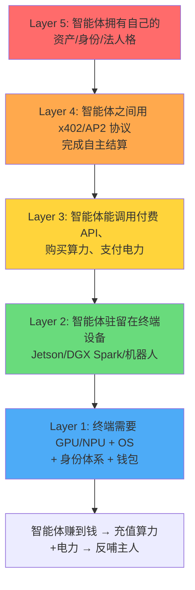
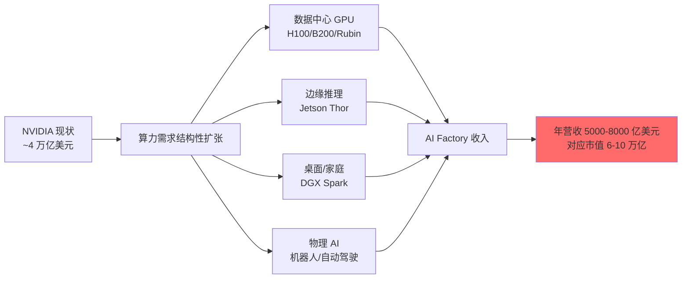

## 德说-第485期, 如果这是 AI 终局, 现在该押什么宝?
  
### 作者  
digoal  
  
### 日期  
2026-06-02  
  
### 标签  
AI , 终局 , 以终为始 , 移动互联网时代 , 智能体时代 , 算力 , 电力 , 数据 , 物质极大丰富 
  
----  
  
## 背景  


移动互联网时代,人是用户,数据是石油,广告是商业模式;

智能体时代,智能体本身就是用户,它们会自己花钱买算力、买电力、买数据 —— 这意味着"算力 + 电力"的市场天花板,从"人能买多少手机"变成"全球智能体能消耗多少焦耳",后者的天花板比前者高 3 到 5 个数量级。

> **写作日期**: 2026-06-02
> **方法论**: Backcasting(回溯法)—— 先定义终局,再倒推现在该押什么
> **核心命题**: 如果未来 AI 终端是自主经济主体,能自己赚算力钱、赚电力钱养活自己,甚至给主人赚钱——那么今天哪些赛道、哪些公司、哪些能力值得下注?

---

## 一、终局图景:把"果"先固化

未来 5-10 年的 AI 终端图景可以拆成 **5 层因果链**,这 5 层缺一不可:



**关键判断**: 这条链一旦跑通,**算力和电力就从"CAPEX 一次性投入"变成"OPEX 可被无限消耗的商品"**——这正是英伟达、台积电、核电公司被重新估值的底层逻辑。

按 IEA 预测,2026 年全球数据中心总用电量将突破 **1000 TWh**(≈ 日本全国全年用电量),其中 AI 负载占比 1/3。**未来 5 年这个数字大概率再翻 2-3 倍**——不是线性外推,而是指数曲线,因为智能体的"代理人"属性会让它比人类消费更多算力。

---

## 二、为什么英伟达要"all in"终端算力?

### 2.1 数据中心的天花板已经能看见

| 关键指标 | 2026 财年实际 | 同比 |
|---------|--------------|------|
| 总营收 | **2159 亿美元** | +65% |
| 净利润 | 约 950 亿美元 | +70%+ |
| Blackwell 占高端 GPU 出货 | **71%** | +10pp |
| 总市值(2025-07-09 突破) | **4 万亿美元** | — |
| Loop Capital 目标价 | $250(对应 6 万亿) | — |

问题来了:**大模型预训练的边际收益在递减**。下一个 token 的训练成本在涨,但模型能力增量在变小。纯靠堆 H100/B200,营收会撞上"客户资本开支的极限"——超大规模厂商(Microsoft、Google、Meta、Amazon)2025 年 capex 涨了 60%+,但 2026 年增速会回落到 20-30%。**这是卖铲子的最大风险:矿难来时铲子滞销**。

### 2.2 真正的增量在"推理下沉"和"具身智能"

英伟达 2025-2026 年三步连环落子,目标是把"训练在云端、推理在端侧"打成标准范式:

| 产品 | 时间 | 定位 | 价格 | 战略意图 |
|------|------|------|------|---------|
| **Jetson Thor** | 2025/8 上市 | 机器人/物理 AI 边缘大脑 | 套件 $3499 | 锁定具身智能 OS |
| **DGX Spark** | 2025/10 发售 | 桌面 AI 超算 | $3999 | 开发者入口 |
| **AI-RAN + T-Mobile** | 2026/3 GTC | 通信网络变算力网络 | 基础设施级 | 把 5G 基站变 AI 推理节点 |
| **Vera CPU** | 2026/6 Computex 展示 | Arm 服务器 CPU | TBD | 补齐 CPU 短板,和 Intel/AMD 抢通用计算 |

**一句话**: 英伟达要把"训练在云端、推理在端侧"打成标准范式。一旦范式被锁定,CUDA 生态就从"AI 训练专属"变成"AI 运行时(Runtime)事实标准"——**这才是比 Apple App Store 还深的护城河**。

### 2.3 CUDA:被低估的真正护城河

Jetson 已经吸引 **200 万开发者、150 家硬件/软件/传感器合作伙伴、7000+ 客户**。当开发者用 Jetson + Isaac + GR00T 训练机器人,模型权重、推理框架、算子库全是 CUDA 的——**换平台要重写整个工具链**。这跟当年 Windows 锁定 PC 开发者、iOS 锁定移动开发者是同一个故事,但锁定的是"物理 AI"开发者,市场比移动开发者还大一个数量级。

---

## 三、英伟达会不会"再涨出一个苹果"?

**会,而且可能不止一个**。逻辑如下:



**估值锚**: 苹果长期 PE 25-30x。英伟达按 30x 算,年营收做到 6000 亿、净利 25% 就是 1500 亿,对应 **4.5 万亿**——和现在持平。

要"再涨一个苹果"(再涨 50%,到 6 万亿),营收要翻到 **8000-10000 亿**。这需要:

1. **推理收入追平训练收入**(目前大约 1:3,目标 1:1)
2. **端侧 AI 装机量过 1 亿台**(Jetson + DGX Spark + 第三方 ARM AI 芯片)
3. **物理 AI(机器人)开始批量出货**

**这三件事在 2027-2028 年都有概率发生**。所以"再涨一个苹果"是 5 年维度的**基准情形**,不是乐观情形。

**唯一的不确定性是反垄断**。如果 2027-2028 美国启动反垄断调查或分拆压力,这个判断要打 7 折。

---

## 四、6 大赛道估值全景表(现状 vs 终局)

按回溯法,从终局倒推,5 年维度上一定需要的"水电煤"有 6 层。下表整合"现状、终局空间、估值水平、核心标的"四要素:

| 赛道 | 解决的终局问题 | 现状(2026 H1) | 终局空间(2030) | 当前估值水平 | 美股核心 | A 股/港股核心 |
|------|--------------|---------------|----------------|-------------|---------|--------------|
| **L1 算力芯片** | 智能体的大脑 | 2026 营收 2159 亿,Blackwell 出货占 71% | 年营收 8000-10000 亿(英伟达) | **偏贵**(PE 50x+,但增长可消化) | NVDA, AVGO, MRVL, TSM, AMD | 寒武纪(688256)、海光(688041) |
| **L2 端侧硬件** | 智能体的肉体 | Jetson 200 万开发者;DGX Spark 2025/10 上市 | Jetson 出货过亿台;DGX Spark 占开发者桌面 30% | **合理-偏贵** | NVDA(Jetson)、ARM、QCOM | 工业富联(601138)、汇川(300124) |
| **L3 电力** | 智能体的食物 | 2026 数据中心用电 1000+TWh;SMR 立项 7400MW | 全球数据中心用电 5000+TWh,SMR 占新增 30% | **合理**(估值切换中) | CEG, VST, BWXT, OKLO | 中国核电(601985)、东方电气(600875)、国电南瑞(600406)、阳光电源(300274) |
| **L4 通信** | 智能体的神经 | 1.6T 光模块 2026 放量;AI-RAN 试点 | 3.2T/6.4T 成为主流;AI-RAN 覆盖 50% 5G 基站 | **偏贵**(中际旭创年内 +90%) | NVDA(AI-RAN)、CSCO、COHR | 中际旭创(300308)、新易盛(300502)、华工科技(000988) |
| **L5 智能体软件** | 智能体的思维 | Agent OS 碎片化;MCP 协议成事实标准 | Agent 装机过 10 亿;MCP/AP2/x402 形成三足鼎立 | **难定价**(主要在头部大厂内部) | NVDA(NeMo)、MSFT(Autogen)、GOOG(AP2)、ANTH | 阿里通义、字节扣子、蚂蚁 |
| **L6 智能体支付** | 智能体的钱袋 | x402(2025/5)、AP2(2025/12)、APOP(2026/4) | Agent 自主支付市场万亿美元级 | **合理-偏贵**(COIN 波动大) | COIN(x402) | 蚂蚁集团(支付宝 MCP)、银联(APOP) |

### 估值结论一句话

- **明显低估**: 几乎找不到,这个市场已经在给"算电协同"溢价
- **合理**: L3 电力、L6 智能体支付(协议层尚未被市场充分定价)
- **偏贵**: L1 算力、L4 通信(中际旭创 1.26 万亿市值已透支 2026 部分预期)
- **难定价**: L2 端侧、L5 智能体软件(主要在头部大厂体内,二级市场难以纯标的参与)

### 6 大赛道的优先级排序(个人判断)

1. **算电协同(L3 电力)**: 确定性最高,最易被传统资金接受。5-10 年"卖水人"赛道。
2. **端侧 AI 硬件(L2)**: 赔率最高,确定性中等。Jetson/DGX Spark 还在爬坡早期,2026-2027 是放量窗口。
3. **智能体支付协议(L6)**: 最早可能在 2026 H2 出现现象级应用,押协议标准,赔率高、波动大。
4. **算力芯片(L1)**: 共识最强,但赔率已被定价。适合作为底仓而非超配。
5. **通信光模块(L4)**: 业绩兑现度最高,但估值已反映,等回调再加。
6. **物理 AI / 机器人(L2 末端)**: 赔率最大、确定性最差,人形机器人量产时间表仍有不确定性。

---

## 五、3 个高赔率标的深度研究

> **挑选标准**: 终局清晰 + 当下业务可量化 + 市场尚未充分定价(合理-偏贵之间,有空间但不是纯题材)

### 5.1 英伟达(NVDA)——算力 + 端侧 + 协议"三栖"垄断

#### 收入模型(2026 财年预估)

| 业务线 | 占比 | 收入 | 增速 | 终局占比目标 |
|--------|------|------|------|------------|
| 数据中心 GPU | ~88% | 1900 亿 | +75% | 60%(2028) |
| 游戏 | ~6% | 130 亿 | +15% | 5% |
| 专业可视化 | ~2% | 43 亿 | +20% | 2% |
| 汽车 | ~3% | 23 亿(2025)+39% | +30%+ | 10%(2028,具身智能上量) |
| 其他(Jetson/AI-RAN) | ~1% | 60 亿 | +200% | 23%(2028,端侧 + 协议) |

**核心变量**: 推理收入占比从 25% 提升到 50%(2028),这才是估值再上台阶的关键。

#### 竞争格局

| 维度 | 英伟达 | 主要对手 | 英伟达优势 |
|------|--------|---------|-----------|
| GPU 训练 | H100/B200/Rubin(2026 H2) | AMD MI325X/MI355X、Google TPU v6、AWS Trainium 3 | CUDA 生态(1500 万开发者) |
| 端侧 AI | Jetson Thor(2070 TOPS FP4) | 高通、苹果、华为、地平线 | Isaac + GR00T + 物理 AI 全栈 |
| AI-RAN | 与 T-Mobile、诺基亚合作 | Ericsson(与 Intel/AMD)、高通 | 唯一同时有 GPU + CUDA + 通信三方协议的公司 |
| 服务器 CPU | Vera(2026/6 发布) | Intel、AMD | NVLink 全栈协同,数据中心 1+1>2 |

#### 风险点

1. **反垄断/分拆压力**: 最大尾部风险。若 2027-2028 美国启动反垄断,股价回撤 30%+
2. **ASIC 分流**: Google TPU、AWS Trainium 持续侵蚀云端训练份额
3. **客户集中度**: 4 家超大规模客户占数据中心收入 50%+
4. **Rubin 量产爬坡风险**: 新工艺、新封装(2026 H2-2027 H1 是关键窗口)
5. **地缘政治**: H20 芯片在华受限,影响 10-15% 数据中心收入

#### 估值判断

- 当前 PE(TTM): ~50x, 远期 PE(2027): ~35x
- 终局市值: 6-10 万亿美元(基准 6 万亿)
- **评级**: 底仓标配,5 年维度确定性最高,赔率已被市场认知但空间仍在

---

### 5.2 中际旭创(300308)——A股算力链最纯的 1.6T 龙头

#### 核心数据(2026-06-01 收盘)

| 指标 | 数值 |
|------|------|
| 股价 | ¥1130 |
| 总市值 | **¥1.26 万亿** |
| PE(TTM) | 84.28 |
| 动态 PE | 54.92 |
| 静态 PE | 116.68 |
| 市净率 | 36.38 |
| 年内涨幅 | **+90%** |
| ROE | 34.38% |

#### 收入模型

| 时期 | 营收 | 增速 | 归母净利 | 增速 | 关键产品 |
|------|------|------|---------|------|---------|
| 2024 | 239 亿 | +123% | 51.7 亿 | +144% | 400G/800G 放量 |
| 2025 | **382.4 亿** | +60.25% | **107.97 亿** | +108% | 800G 主力,1.6T Q3 起量 |
| 2026 Q1 | 194.96 亿 | +192% | 57.35 亿 | +262% | 1.6T 批量出货 |
| 2026 E(29 家机构) | 800 亿(中值) | +109% | 298.67 亿 | +177% | 1.6T 主力,3.2T 备货 |
| 2027 E | 1069 亿 | +34% | 433.66 亿 | +45% | 1.6T/3.2T 共存 |

**关键变量**: 1.6T 单价是 800G 的 1.5-2 倍,毛利率从 35% 提升到 42.8%(野村数据),3.2T 进一步抬升。**"量价齐升 + 产品结构升级"是 2026-2027 主旋律**。

#### 竞争格局

| 维度 | 中际旭创 | Coherent(美股) | Lumentum(美股) | 新易盛(300502) | 剑桥科技 |
|------|---------|---------------|---------------|---------------|---------|
| 800G 份额 | ~40%(全球第一) | ~25% | ~15% | ~10% | ~5% |
| 1.6T 进度 | **已批量出货,主力** | 已送样,小批量 | 已送样 | 小批量 | 研发中 |
| 3.2T 进度 | 研发中,未送样 | 研发中 | 研发中 | 研发中 | 研发中 |
| 核心客户 | NVIDIA、谷歌、Meta、亚马逊 | Meta、谷歌 | 谷歌、亚马逊 | 中际旭创的二供 | 二线云厂 |
| 硅光能力 | 强(自研 SiPh) | 中(收购) | 弱 | 中 | 弱 |
| CPO 路线 | **NPO 路线(更稳)** | CPO 押注 | CPO 押注 | CPO 押注 | — |

**关键判断**: 中际旭创选了 **NPO(近封装光学)** 而非 CPO(共封装光学)路线,本质是"风险厌恶型"选择——CPO 良率低、供应链重塑,光模块厂商护城河会被博通/Marvell 蚕食;NPO 既能享受高带宽升级红利,又保留可插拔模块的供应链优势。

#### 风险点

1. **CPO 技术替代风险**: 若 CPO 2027-2028 良率突破,光模块价值量会被压缩 30-50%
2. **地缘政治风险**: 美国对华光模块出口管制(2024 已限制 800G 以上,2025 升级到 1.6T),公司海外营收占 90%+
3. **客户集中度**: NVIDIA 单一客户可能占比 30%+
4. **估值已透支部分预期**: 1.26 万亿市值对应 2026 PE 42x、2027 PE 29x,看似合理但已无安全边际
5. **3.2T 节奏**: 若 3.2T 进度落后于 Coherent,可能丢失下一代制高点

#### 估值判断

- 当前动态 PE: 54.92, 2026 E PE: 42x, 2027 E PE: 29x
- 终局空间: 假设 2027 净利 430 亿 × 25-30x = **1.0-1.3 万亿**,目前已在区间上沿
- **评级**: **赔率已不大,但确定性仍强**。建议在 800-900 元区间分批建仓,而非追高。

---

### 5.3 Constellation Energy(CEG)——算电协同最纯美股标的

#### 核心数据(2026-05-08 收盘)

| 指标 | 数值 |
|------|------|
| 股价 | $311.28 |
| 总市值 | **$1127.75 亿** |
| PE | 48.63 |
| 52 周高 | $412.70 |
| 52 周低 | $243.30 |
| 公司定位 | 美国最大核电运营商,21GW 装机 |

#### 收入模型

| 业务线 | 占比 | 收入结构 |
|--------|------|---------|
| 核电运营 | ~80% | 21GW 装机,主要在宾州、马里兰、纽约;PPA 锁定 80%+ 产能 |
| 电力交易与零售 | ~15% | 批发电价波动敞口,2024-2025 受益于 PJM 容量价飙升 |
| 清洁能源 + 其他 | ~5% | 风、光、抽水蓄能 |

**核心变量**: 2026 年起,公司 **23-25GW 新增 PPA 谈判**正在进行。微软(Microsoft)签约重启三里岛核电站(Constellation-1,835MW)是最具标志性的事件——**这是 AI 数据中心第一次以"PPA + 股权 + 长期合作"模式锁定核电**。

#### 竞争格局

| 公司 | 装机 | 定位 | 与 CEG 关系 |
|------|------|------|------------|
| **CEG** | 21GW 核电 | 美国最大 | — |
| Vistra(VST) | ~41GW(核电+气电+煤电) | 综合独立电力商 | 主要竞争对手,在德州 IRA 受益更多 |
| Talen Energy(TLN) | ~10GW(核电+气电) | 中型,亚马逊 Susquehanna 核电合作 | 差异化竞争 |
| NextEra(NEE) | ~60GW(气电+风电+核电少) | 全美最大,多元化 | 不同赛道 |
| OKLO/NNE | SMR 创业公司 | 微型堆/SMR 早期 | 长期颠覆者,短期不影响 CEG |

**关键判断**: CEG 的护城河是 **"现有核电 + 长寿命 + 已获 NRC 许可"**——核电新项目从立项到并网 7-10 年,CEG 是 5 年内唯一能向 AI 数据中心提供增量核电的公司。

#### 风险点

1. **核电延寿监管**: 美国 NRC 对 80 年延寿许可审批节奏,直接影响 CEG 装机峰值
2. **AI 资本开支波动**: 若超大规模厂商 capex 增速从 60% 跌到 20%,CEG 的 PPA 议价能力会下降
3. **电价波动**: PJM 容量价 2024-2025 大涨,但 2027 供需平衡后可能回调
4. **联邦政府能源政策**: 行政命令方向直接影响核电 + AI 协同节奏
5. **SMR 长期替代**: 2030 后 OKLO/NNE/X-energy 的 SMR 商用化,可能蚕食 5% 新增市场

#### 估值判断

- 当前 PE: 48.63, 远期 PE(2027): ~30x
- 终局空间: 美国 AI 数据中心 2030 年需要 **80-100GW 稳定基荷**,CEG + VST + TLN 三家分 60%,CEG 拿到 25-30GW × 容量价 $200-300/kW-年 = **500-900 亿美元**年化稳定收入(仅容量费,不含电量费)
- **评级**: **赔率最高、确定性中等的核心标的**。建议分批建仓,回调至 $250-270 区间是黄金坑。

---

## 六、抽象出来的"未来产品核心能力"矩阵

按"以果决行"思路,先想清楚终局里的智能体要什么能力,再看现在谁在做——这能帮我们识别**未上市但值得关注的早期标的**:

| 能力 | 对应产品形态 | 谁在做(2026 H1) | 还缺什么 | 二级市场参与方式 |
|------|------------|----------------|---------|----------------|
| **本地大模型推理** | AI PC / 边缘盒 / 机器人控制器 | DGX Spark($3999)、Apple M-series、Qualcomm X Elite、Jetson Thor | 价格下沉到 $500 以下 | NVDA、QCOM、AAPL(间接) |
| **自主任务规划** | Agent OS / Agent Runtime | OpenAI Operator、字节扣子、阿里通义、Anthropic Claude | 跨厂商 A2A 协议标准化 | 大厂体内,难纯标参与 |
| **工具调用** | MCP / Function Call | MCP(Anthropic 开源)+ 支付宝 MCP Server | 工具市场(App Store 模式) | ANTH 未上市、阿里/字节间接 |
| **自主支付** | Agent Wallet | x402、AP2、APOP、支付宝 MCP | KYC/合规、争议处理、链上身份 | **COIN、蚂蚁、银联(未上市)** |
| **身份与信用** | Agent DID(去中心化身份) | 暂无统一标准 | 链上身份、声誉系统、监管框架 | 早期,可能从 ENS/SNS 项目演化 |
| **物理执行** | 机器人 / IoT / 自动驾驶 | Tesla Optimus、Figure、宇树、智元 | 量产 + 价格(<10 万人民币) | TSLA、汇川(300124)、三花智控(002050) |
| **能源自给** | 储能 / 小型发电 / 核电池 | 便携式核电池概念阶段 | 民用化(距 5-10 年) | 概念阶段,无成熟标的 |

**关键洞察**: 这 7 项能力,每项都是一家未来的"千亿美元公司"的胚子。**2026 H1 只有前 3 项有公开市场标的**(NVDA、MSFT、GOOG、特斯拉等),后 4 项还在"种子轮到 A 轮"阶段——这正是回报最厚的窗口,也是 VC/PE 的主战场,而非股票市场。

---

## 七、整套逻辑链(以果决行的"决"在哪里)

### 7.1 回溯链(从果到行)

```
AI 终端是自主经济主体(果)
    ↓
智能体需要: 本地算力 + 自主支付 + 身份(必由之路)
    ↓
4 条"卖水人"赛道: 算力 + 电力 + 端侧硬件 + 支付协议(决)
    ↓
现在押: 英伟达 + 核电 SMR + 电网设备 + 光模块 + x402 协议生态 + 机器人核心部件(行)
```

### 7.2 正推链(为什么这次和以前不一样)

```
1. 移动互联网时代: 人是用户,数据是石油,广告是商业模式
   ↓
2. 智能体时代: 智能体本身就是用户,它们会自己花钱买算力、电力、数据
   ↓
3. 这意味着"算力 + 电力"的市场天花板
   从"人能买多少手机" → "全球智能体能消耗多少焦耳"
   ↓
4. 后者的天花板比前者高 3-5 个数量级
   ↓
5. 所以英伟达、台积电、核电的估值再涨一倍不奇怪
```

### 7.3 三个反直觉的提醒

1. **"为什么个人 OPC 现在不行"**: 缺三样东西——**算力(贵, $3999 一台)、智能体框架(碎片化)、支付通道(没有 KYC 过不了审)**。等 DGX Spark 降价到 $500、Agent OS 标准化、x402 类协议普及,个人 OPC 才会真正爆发。

2. **不要把"AI 终端"理解成硬件**。未来 **90% 的 AI 终端是软件**(Agent 进程),跑在别人的硬件上。硬件的护城河是 CUDA,软件的护城河是**协议标准**——这是为什么 x402、AP2、APOP 值得在 2026 年就开始关注。

3. **"再涨一个苹果"的前提是英伟达不被分拆/反垄断**。这是唯一的不确定性。如果 2027-2028 美国启动反垄断,这个判断要打 7 折。

---

## 八、风险提示与免责声明

### 8.1 顶层风险

- **AI 投资过热**: 若 2027 H2 出现"AI 资本开支断崖"(类似 2000 年互联网泡沫),所有 L1-L4 赛道都会杀估值
- **反垄断**: 美国、欧盟、中国的反垄断力度可能超预期
- **地缘政治**: H20 类出口管制升级、TSMC 产能风险
- **技术替代**: CPO 替代光模块、SMR 替代传统核电、ASIC 替代 GPU

### 8.2 个股风险(已在上文各标的"风险点"中详述)

### 8.3 估值假设风险

本文所有"再涨一个苹果"、"6 万亿市值"、"算力需求翻 2-3 倍"的判断,都是**基于 5 年维度的基准情形**。如果 AI 智能体普及速度慢于预期,或出现更便宜的替代方案,这些估值锚都需要下修。

### 8.4 免责声明

本文为分析思考记录,**不构成任何投资建议**。所引数据均来自 2026 年 5-6 月公开报道,实时股价请以最新行情为准。投资有风险,决策需谨慎。

---

## 附录:核心数据与信息来源

| 类别 | 关键数据 | 来源(2026 年) |
|------|---------|---------------|
| 英伟达市值 | 2025-07-09 突破 4 万亿;Loop Capital 目标 6 万亿 | 多家财经媒体 |
| 英伟达 2026 财年 | 营收 2159 亿美元,同比 +65% | 官方财报 |
| Blackwell 出货 | 2026 占高端 GPU 71% | TrendForce 集邦咨询 |
| DGX Spark | 2025-10-15 发售, $3999, 1 PFLOP FP4 | NVIDIA 官方 |
| Jetson Thor | 2025-8 上市, 2070 TOPS FP4, $3499 起 | NVIDIA 官方 |
| Jetson 生态 | 200 万开发者、150 家合作伙伴、7000+ 客户 | NVIDIA 2025-8 披露 |
| Vera CPU | 2026-6 Computex 展示 | GF Securities 预测 |
| AI-RAN | 2026-3 GTC, 与 T-Mobile + 诺基亚合作 | NVIDIA 官方 |
| 中际旭创 | 2026-06-01 收盘 ¥1130, 市值 1.26 万亿 | 东方财富/雪球 |
| 中际旭创业绩 | 2025 营收 382.4 亿、净利 108 亿;2026 Q1 营收 195 亿、净利 57.35 亿 | 上市公司公告 |
| CEG | 2026-05-08 收盘 $311, 市值 $1128 亿, PE 48.6 | 同花顺/Investing |
| x402 协议 | 2025-5 由 Coinbase 开源, 基于 HTTP 402 | Coinbase 开发者平台 |
| AP2 协议 | 2025-12 由 Google Agentic Commerce 开源 | Google 官方 |
| APOP 协议 | 2026-4 由中国银联发布, 19 家机构合作 | 中国银联 |
| 支付宝 MCP Server | 2025-4 上线, 国内首家 | 支付宝官方 |
| 2026 数据中心用电 | 1000+ TWh | IEA 预测 |
| 苹果 2026 Q2 | 营收 1112 亿美元, +17% | Apple 财报 |

  
  
#### [PostgreSQL 解决方案集合](../201706/20170601_02.md "40cff096e9ed7122c512b35d8561d9c8")
  
  
#### [德哥 / digoal's Github - 公益是一辈子的事.](https://github.com/digoal/blog/blob/master/README.md "22709685feb7cab07d30f30387f0a9ae")
  
  
#### [About 德哥](https://github.com/digoal/blog/blob/master/me/readme.md "a37735981e7704886ffd590565582dd0")
  
  

  
