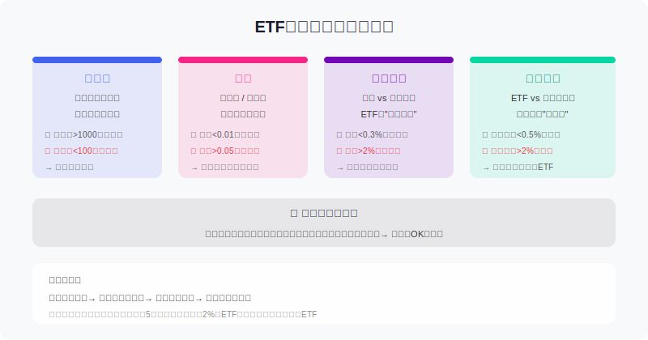
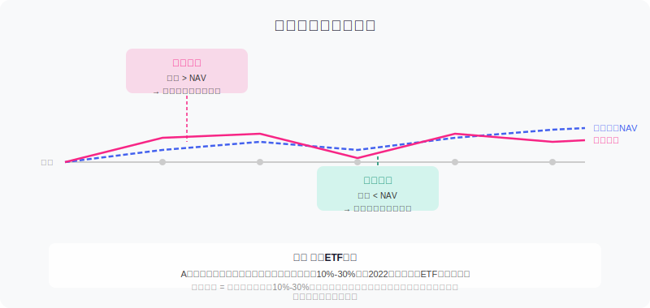
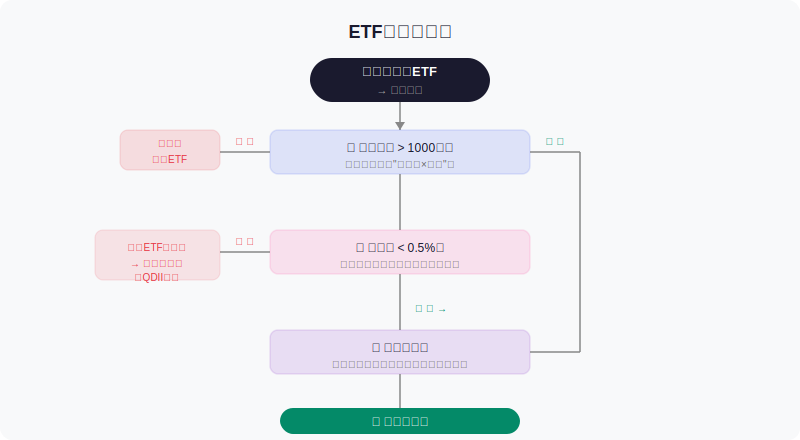

## 散户投资小白金融全品种操盘手册 - 4.8 ETF买卖规则 —— 成交量、盘口、折溢价、跟踪误差
  
### 作者  
digoal  
  
### 日期  
2026-06-02  
  
### 标签  
金融产品 , 金融工具 , 散户 , 投资小白 , 全品操盘手册  
  
----  
  
## 背景 
  

## 先问你一个问题

你买过一只ETF，下单之后发现：**买的价格比基金净值贵了5%**。

这不是手续费，是你主动多付出去的钱——因为你看错了一个数字。

ETF比买股票多了几个"隐形陷阱"，不懂规则的人，往往在这几个数字上吃过亏还不知道为什么。这节课，我们一次讲清楚。

---

## 核心概念：ETF买卖的四大关键指标

买一只股票，你通常只关心价格。但买ETF，你需要同时关注四个数字：

| 指标 | 看什么 | 合格标准 |
|------|--------|----------|
| 成交量 | 这只ETF今天真正有多少人在买卖 | 日成交额 > 1000万 |
| 盘口价差 | 买一价和卖一价相差多少 | 差值 < 0.01元 |
| 折溢价率 | 市场价和基金净值（NAV）相差多少 | 溢价 < 0.5% |
| 跟踪误差 | ETF实际收益和指数相差多少 | 年化 < 0.5% |

---

## 第一关：成交量——流动性的体温计

**成交量**告诉你这只ETF"好不好卖"。一只成交量极低的ETF，问题不是"没人喜欢"，而是：

- 你想卖的时候，**可能没人接盘**
- 买卖价差会变大，**实际成本更高**
- 市场遇到异常波动，**可能被迫以很差的价格成交**

### 【第一性原理分析】

支撑"成交量代表流动性"成立需要以下前提：

- **前提A**：ETF可以在二级市场像股票一样自由买卖 → 【常量】→ 这是ETF的制度安排，不会改变
- **前提B**：有足够多的投资者愿意在合理价格参与交易 → 【变量】→ 规模小、冷门行业ETF可能缺乏做市商支持
- **前提C**：市场正常运行，没有停牌或极端流动性危机 → 【变量】→ 如果被推翻，流动性可能突然消失

**正常情景**：成交量充足，买卖价差小，价格合理，正常交易。

**压力情景**（前提B被推翻）：ETF冷门，无人接盘，被迫以低价卖出，或长时间卖不掉。应对：提前选规模大的ETF，日成交额 > 1000万是基本门槛。

**极端情景**（前提B+C同时破坏）：市场流动性危机，如2020年3月美股熔断期间，部分ETF一度以远低于净值的价格成交。应对：不要在市场恐慌时用市价单急卖，必要时等流动性恢复。

### 实操要点

- 打开行情软件，找到ETF的"成交额"或"成交量×当前价格"
- **日成交额 > 1000万**：安全，正常交易
- **日成交额 100万~1000万**：流动性偏弱，价差可能偏大，谨慎
- **日成交额 < 100万**：危险，除非你只是长期持有不打算卖

> **数据参考**：截至2025年末，沪深300ETF（510300）日均成交额超过50亿，科创50ETF（588000）日均超10亿，而部分冷门主题ETF日成交额不足100万，流动性差距悬殊（来源：上交所官方交易数据2025年报）。

---

## 第二关：盘口价差——你的"进门费"

**盘口**就是你在交易软件里看到的"买一"和"卖一"：

- **买一价**：市场上当前有人愿意出的最高买价
- **卖一价**：市场上当前有人愿意卖的最低卖价

两者之间的差，就是**买卖价差**。

### 为什么价差很重要？

假设你想买入一只ETF：
- 卖一价：1.052元（你能立刻买到的价格）
- 买一价：1.050元（如果你挂买单等待成交的价格）
- 差值：0.002元，约0.19%

**如果你用市价单立刻买入，再立刻卖出，你就损失了这0.19%。**

这不算多？一只冷门ETF，价差可能达到0.5%~1%，每次交易都在悄悄割你的肉。

### 两种下单方式对比

| 下单方式 | 特点 | 适合场景 |
|----------|------|----------|
| **市价单** | 立刻成交，但价格由市场决定 | 流动性极好的ETF、紧急止损 |
| **限价单** | 你指定价格，不到价格不成交 | 绝大多数情况，推荐使用 |

**小白默认选限价单**。设置买一价或在买一价和卖一价之间挂单，保护自己不被价差吃掉。

> **特别提醒**：开盘前5分钟（9:15~9:25 A股集合竞价阶段）价格波动较大，不建议在这个时段用市价单操作。

---

## 第三关：折溢价率——最容易被忽视的陷阱

这是很多人从来没想过的一个问题：

**ETF的市场价格，和它实际持有的资产价值，可以是不一样的。**

### 基本概念

- **NAV（基金净值）**：ETF实际持有的一篮子资产，按当前价格计算的总价值，除以份数
- **市场价格**：你在证券交易所买卖ETF的实际成交价格
- **折溢价率** = （市场价格 - NAV）/ NAV × 100%

溢价（正数）：你花比资产实际价值更贵的钱买  
折价（负数）：你花比资产实际价值更便宜的钱买

### 为什么会出现折溢价？

正常情况下，有机构可以做"申购赎回"套利，让价格向净值靠拢。但以下情况会导致价格长期偏离：

1. **跨境ETF**：当A股市场开盘，而对应的美股/港股未开盘，无法实时申购赎回，溢价可能飙升
2. **小规模冷门ETF**：缺乏做市商，套利机制失灵
3. **市场极度情绪化**：散户疯狂追买，溢价短期放大

### 历史案例（有成功有失败）

**失败案例**：2022年，A股纳斯达克100ETF（513300）因限额购买，溢价一度超过15%。追高买入的投资者，即使纳指后来上涨，也需要先弥补15%的溢价损失才能真正盈利。（来源：Wind基金数据，2022年3月）

**教训**：溢价率超过2%的跨境ETF，**不要追买**。可以改用场外QDII基金（虽然买卖按当天净值，有延迟，但没有溢价风险）。

**相对划算的机会**：当ETF出现折价，意味着你以低于净值的价格买入了一篮子资产。但要注意：折价本身有时反映了特殊情况（比如停牌股票拖累），不能盲目当"捡便宜"。

> 历史数据规律仍有参考价值：折溢价的均值回归特征在A股ETF市场长期存在，但具体时机无法预测，历史不代表未来。

---

## 第四关：跟踪误差——你以为买了指数，其实没有

你买沪深300ETF，是因为想跟踪沪深300指数的表现。但ETF和指数之间，总会有偏差，这就叫**跟踪误差**。

### 误差从哪里来？

- **管理费率**：ETF每年收取0.1%~0.5%的管理费，这直接压低了收益
- **申购赎回的摩擦成本**：机构申购赎回时会产生交易成本
- **指数成分股调整**：指数调整成分时，ETF要同步操作，有时机不对齐的成本
- **现金管理**：ETF需要保留少量现金应对赎回，这部分不参与指数投资

### 如何判断跟踪误差是否合理？

| 年化跟踪误差 | 评价 |
|-------------|------|
| < 0.3% | 优秀 |
| 0.3% ~ 0.5% | 良好 |
| 0.5% ~ 1% | 可接受 |
| > 1% | 较差，需要关注原因 |
| > 2% | 危险信号，严重偏离指数 |

> **数据来源**：根据天天基金网、晨星2024年度ETF评估报告，主流宽基ETF年化跟踪误差普遍低于0.3%，部分冷门ETF超过1%。

### 如何查跟踪误差？

打开天天基金网或基金公司官网，找到"跟踪误差"或"跟踪偏离度"数据。买之前，比较同类ETF（比如都跟踪沪深300的ETF有多只），选跟踪误差更低、规模更大的那只。

---

## 实操例子：完整的ETF下单流程

**场景**：小张，账户10万元，打算买入5万元沪深300ETF。

**第一步：选择候选ETF**

查询"沪深300ETF"，发现有510300、510310、512010等多只。先比较：
- 规模：510300（华泰柏瑞）规模超1000亿，远大于其他
- 日成交额：510300约50亿，510310约30亿，512010约5亿

→ 优选510300，规模和流动性最好

**第二步：下单前检查**

当天上午10点，小张打开行情：
- 成交额：已成交80亿（远超1000万门槛）✓
- 盘口：买一4.010元，卖一4.011元，差0.001元 ✓
- 折溢价率：官网显示0.02% ✓
- 跟踪误差：年化0.18%（晨星数据）✓

→ 四项检查通过，可以下单

**第三步：用限价单买入**

挂限价单：价格4.011元（卖一价），数量12000份（约5万元）。

如果5分钟内没全部成交，小张可以把价格调到4.012元再试，而不是改成市价单。

**如果操作错误：**
- 用了市价单 → 可能以4.020元成交（当日价差较大时），多花了几十元
- 忽视溢价 → 如果遇到跨境ETF高溢价，可能多花数千元
- 买了成交量极小的ETF → 后来想卖时挂单两天没成交，只能接受更低价格

---

## 下单决策树

---

## 可复用框架

### 【ETF下单四检法】

**适用场景**：每次买卖ETF之前

**核心逻辑**：ETF的买卖成本不只是手续费，还隐藏在成交量、价差、折溢价三个维度里

**操作步骤**：
1. **量**：查日成交额，> 1000万才考虑
2. **盘**：看买一卖一价差，用限价单挂单
3. **价**：查折溢价率，溢价 > 1% 要谨慎，跨境ETF溢价 > 2% 坚决不追
4. **差**：选同类ETF中跟踪误差最低、规模最大的那只

**举一反三**：这个框架还可以用在债券ETF、黄金ETF、REITs、跨境QDII上，原理相同，只是各自的合理溢价区间略有差异。

---

### 【限价单优先原则】

**适用场景**：日常交易，非极端情况

**核心逻辑**：市价单让市场决定你的成本，限价单让你控制成本

**操作步骤**：
1. 看当前卖一价（想买）或买一价（想卖）
2. 挂接近这个价格的限价单（±0.01元）
3. 等待成交，5~10分钟未成交可小幅调价
4. 避开开盘前15分钟（9:15~9:30）用市价单

**举一反三**：这个原则同样适用于买卖可转债和流动性较弱的个股

---

## 本节行动清单

1. **选一只你感兴趣的ETF**，打开天天基金网或证券软件，查找它的"日成交额"和"年化跟踪误差"
2. **找到同类ETF对比表**，看哪只规模最大、费率最低、跟踪误差最小
3. **打开行情页面**，观察买一价和卖一价，计算一下价差（差值÷买一价）
4. **如果是跨境ETF**，记得额外查折溢价率，找基金公司官网或晨星等平台
5. **下次买入前**，按"量→盘→价→差"四步检查，不跳步骤

---

## 一句话总结

买ETF不难，但买对价格需要多看四个数字：**成交量看能不能顺畅交易，盘口价差看你的实际买卖成本，折溢价率看你买贵没有，跟踪误差看ETF是不是真的在跟踪指数**——四项都过关，再下手。

---

> ⚠️ **声明**：本文内容为投资教育目的，所有历史数据、策略框架均为辅助学习工具，不构成证券投资建议。市场有风险，投资需谨慎。实际操作请结合自身风险承受能力，必要时咨询专业投顾。
  
  
#### [PostgreSQL 解决方案集合](../201706/20170601_02.md "40cff096e9ed7122c512b35d8561d9c8")
  
  
#### [德哥 / digoal's Github - 公益是一辈子的事.](https://github.com/digoal/blog/blob/master/README.md "22709685feb7cab07d30f30387f0a9ae")
  
  
#### [About 德哥](https://github.com/digoal/blog/blob/master/me/readme.md "a37735981e7704886ffd590565582dd0")
  
  

  
