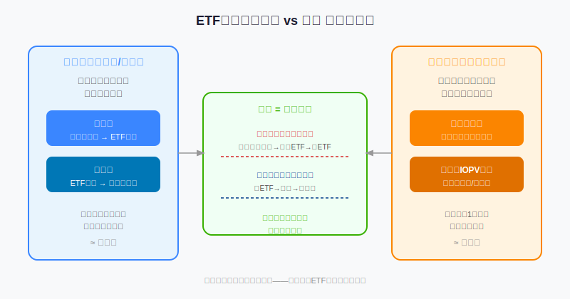
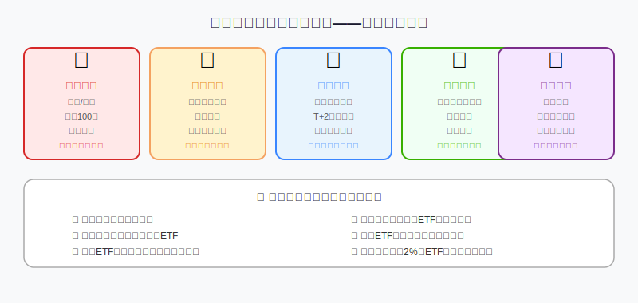
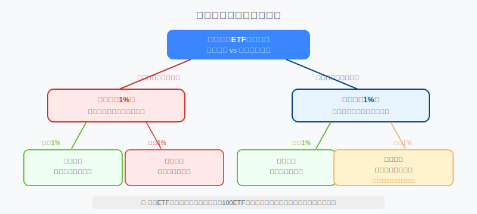

## 散户投资小白金融全品种操盘手册 - 4.9 ETF套利机会识别 —— 小白学原理，不轻易实操
  
### 作者  
digoal  
  
### 日期  
2026-06-02  
  
### 标签  
金融产品 , 金融工具 , 散户 , 投资小白 , 全品操盘手册  
  
----  
  
## 背景 
  

## 开篇：一个让人心动的故事

2020年3月，A股股市大跌，有一只跨境ETF因为停止申购，市场上的买盘挤爆，溢价率一度达到**20%以上**。

换句话说，如果你当时持有这只ETF，你卖出去能拿到比它真实价值多20%的钱。

同样，如果你知道原理，你本可以绕过去用其他路径低价买入对应资产，转手卖给那些焦急抢购的人——稳赚价差。

这就是ETF套利。

听起来像是"发现了漏洞"？没错。只是这个漏洞，机构每天都在用，你却很难用——因为进去的门槛，比你想象的高得多。

这节课我们要搞清楚两件事：**ETF套利是怎么运作的**，以及**小白从中能学到什么、应该避开什么**。

---

## 一、先搞懂ETF的两个"价格"

ETF有两个价格同时存在，很多人混淆：

**① 市场价格（Market Price）**：你在股票软件上看到的实时报价，是买卖双方在二级市场撮合出来的。

**② 净值（NAV，Net Asset Value）/实时估值（IOPV）**：ETF持有的一篮子成分股的实际市值，除以基金份额总数。基金公司每15秒公布一次估算值（IOPV）。

两个价格理论上应该相等，但由于市场供需的影响，它们之间会产生偏差：

- **溢价（Premium）**：市场价 > 净值 → 你买贵了
- **折价（Discount）**：市场价 < 净值 → 你买便宜了

这张图的核心逻辑是：**ETF同时存在两个市场，机构可以在两个市场之间搬砖，散户只能在一个市场玩。**

---

## 二、ETF套利是怎么运作的？

套利的本质是：**同样的资产在两个市场出现价差，同时低买高卖，锁定无风险利润。**

### 场景一：ETF溢价套利（市价 > 净值）

假设：沪深300 ETF净值是3.00元，但市场上有人愿意用3.06元买（溢价2%）。

机构的操作流程：
1. 按市场价买入沪深300的所有成分股（接近净值3.00元的价格）
2. 把这一篮子股票送到基金公司申购ETF份额
3. 拿到ETF份额后，在二级市场按3.06元卖出
4. **净赚约2%的价差（扣除手续费后）**

这叫**实物申购套利**。

### 场景二：ETF折价套利（市价 < 净值）

假设：ETF净值是3.00元，但市场上只卖2.94元（折价2%）。

机构的操作流程：
1. 在二级市场以2.94元买入ETF份额
2. 向基金公司赎回，换回一篮子成分股
3. 把成分股在股票市场按市价卖出（接近3.00元）
4. **净赚约2%的价差**

这叫**实物赎回套利**。

### 套利行为产生的效果

当大量机构同时做溢价套利（买股票+卖ETF），会推高股票价格、压低ETF价格，让两者重新接近。折价套利同理。

这就是为什么**ETF的价格不会长期大幅偏离净值**——套利机制会自动修正，就像弹簧，偏离越多，弹回的力量越大。

---

## 三、第一性原理：套利机会为什么存在？

【前提清单】

支撑"ETF套利能赚钱"成立需要以下前提：

- **前提A：价差大于交易成本** → 【变量】→ 成本包括印花税、手续费、买卖价差、冲击成本，通常加起来0.3%～0.6%，价差必须超过这个门槛才有利可图
- **前提B：申购赎回通道畅通** → 【变量】→ 跨境ETF、商品ETF等有特殊规则，可能暂停申购赎回，导致套利通道关闭，价差长期偏离（这就是开头溢价20%的根本原因）
- **前提C：两市场同步操作可执行** → 【变量】→ 申购T+2结算，赎回也需时间，期间市场可能大幅波动，锁定的是风险，不是利润
- **前提D：资金规模满足最低门槛** → 【常量】→ A股ETF申购/赎回最低单位通常是50万份起，市值百万级别

【情景推演】

| 情景 | 描述 | 结论 |
|------|------|------|
| 正常情景 | 所有前提成立 | 机构可稳定套利，价差维持在0.1%～0.3%以内 |
| 申购暂停 | 前提B被推翻 | 溢价失控，可高达5%～30%，散户此时追买极危险 |
| 市场暴跌 | 前提C被推翻 | 持仓期间亏损超过价差，"套利"变成"亏损" |
| 流动性差小ETF | 前提A+D均受影响 | 价差看似大，但根本买不进去/卖不出去 |

---

## 四、小白为什么不轻易实操？

这不是"努力就能做到"的问题，是**结构性劣势**。

让我们逐一拆解：

**门槛一：资金要求**
A股ETF一级市场申购/赎回起步通常是50万份，按沪深300 ETF约4元的价格算，起步资金约200万元。这还不算为了对冲风险需要两边同时建仓的配套资金。

**门槛二：速度要求**
套利机会出现时，机构的程序化交易系统会在毫秒级别捕捉并执行。当你在软件上发现溢价、考虑是否操作的时候，机构已经成交了几十万份，价差正在快速收窄。

**门槛三：T+2结算**
ETF申购以实物股票换份额，整个流程需要T+2个工作日才能完成。这两天内市场可能大幅变动，"套利"变成赌博。

**门槛四：隐性成本**
不只是手续费。你在市场上大规模买入成分股，会推高成分股价格（这叫冲击成本，Impact Cost），等到你卖ETF时，已经帮竞争者把利润侵蚀了一部分。

**门槛五：执行风险**
实操需要同时管理几十只成分股的买卖，一旦某只成分股临时停牌，整个套利计划就崩了，可能被迫持有大量不想要的仓位。

---

## 五、权威数据：套利的现实效果

根据中国证券投资基金业协会（2024年度数据）及交易所公开数据：

- 沪深300ETF等大型宽基ETF，日均折溢价通常维持在 **0.05%～0.15%** 以内，机构套利效率极高；
- 规模小于1亿元的行业小ETF，折溢价可达 **0.5%～2%**，但流动性差，套利执行成本反而更高；
- 跨境ETF在国内停市但海外市场开市期间，折溢价可突破 **10%甚至更高**（典型：2020年3月、2022年港股大跌期间均出现过）；
- 学术研究（华泰证券研究所，2023）显示，参与ETF套利的机构中超过95%使用自动化程序化系统，手动套利占比极低，利润也远低于程序化。

历史数据说明：机构套利已经把ETF的定价效率逼到很高，留给个人的空间极小。这个规律在未来大概率仍然成立，因为机构的速度和资本优势是结构性的，不会消失。

---

## 六、小白真正该关注什么：折溢价的实用读法

虽然我们不套利，但折溢价是一个**有用的买入参考指标**。

### 核心使用原则：

**1. 买入前查一眼折溢价**
大多数基金软件（天天基金、同花顺、东方财富）都可以查到ETF的实时溢价率（IOPV偏差）。花10秒看一眼，是个好习惯。

**2. 溢价超过1%的ETF，暂缓买入**
你多付出的这1%，不是给了任何有价值的东西，而是白白送给了市场上的其他买家。等溢价收窄，通常几天内就会回归。

**3. 折价时可以小加仓，但要查原因**
折价偶尔是机会，但大幅折价（超过1%）往往有原因：市场极度悲观、流动性差、成分股停牌等。不能盲目认为"便宜就是好事"。

**4. 跨境ETF的溢价要单独理解**
QDII类跨境ETF（如恒生科技ETF、纳斯达克ETF）的申购额度受外管局管控，有时停止申购，导致溢价与A股ETF逻辑完全不同。遇到跨境ETF高溢价，大概率是追高陷阱。详见第十二章。

---

## 七、实操例子：买ETF前的折溢价检查流程

**场景**：你有10万元，想买中证500ETF，打算长持3年。

**第一步**：打开东方财富或天天基金，搜索"中证500ETF"。

**第二步**：选择规模前三的产品（流动性更好，折溢价更小），例如南方中证500 ETF（510500）。

**第三步**：查看当日折溢价率。假设显示溢价0.08%。

**判断**：溢价0.08% < 1%，完全可以接受，正常下单。

---

**反面案例**：

同样的10万元，你想买一只小众行业ETF，规模只有5000万。当日溢价显示1.8%。

**错误操作**：忽视溢价，直接以市价买入。

**后果**：你实际支付了比净值贵1.8%的价格，相当于买入后立刻亏了1.8%——即使这个ETF后续如期上涨，你的起跑线已经落后。

**正确操作**：今天挂限价单，价格设在净值附近（可以接受轻微折价），等市场自然成交。如果几天内都没成交，说明流动性太差，换一只规模更大的ETF。

**如果操作错了，如何纠偏**：已经买入高溢价ETF后，不用急着卖出（会额外损失手续费），等溢价自然收窄即可。如果溢价持续扩大，说明可能有特殊情况（比如申购暂停），再评估是否换仓。

---

## 八、可复用方法论

【ETF折溢价三步检查法】

**适用场景**：每次买入ETF前

**核心逻辑**：ETF价格会短期偏离净值，但最终回归——利用这个特性，避免在高溢价时买入，等效于"花同样的钱买更多份额"

**操作步骤**：
1. 查当日折溢价率（各大平台均可查）
2. 按"溢价>1%暂缓、折价大于1%查原因"的规则判断
3. 若溢价过高，改用挂单方式，设置不超过净值的限价单，等待成交

**举一反三**：这个框架同样适用于封闭式基金（折溢价更大，更有参考价值）、QDII基金（额度受限时溢价极高，要特别警惕）

---

## 本节行动清单

1. **现在就查一下**：打开你持有或想买的某只ETF，找到"实时估值（IOPV）"和"市价"，算一下当前折溢价率
2. **设定个人规则**：规定自己买ETF前必须检查折溢价，溢价超过1%则等待
3. **认识跨境ETF的特殊性**：找一只你感兴趣的跨境ETF，查看它过去一年的折溢价历史走势（Choice或同花顺可查），感受它的波动规律
4. **别追高溢价**：如果你发现某只ETF溢价超过3%，把这只ETF的代码记下来，观察接下来一周溢价如何变化——这个观察会给你直觉感受
5. **优先大规模ETF**：同类ETF优先选规模超过50亿的产品，它们的套利活跃度更高，折溢价更小，你的买卖更接近公允价格

---

## 一句话总结

ETF套利是机构用来维持定价效率的机制，小白学懂原理就够了，实操是机构的游戏；真正的收益来自识别折溢价、避开高溢价买入，让别人替你把价格调正。

---

> ⚠️ **声明**：本文内容为投资教育目的，所有历史数据、策略框架均为辅助学习工具，不构成证券投资建议。市场有风险，投资需谨慎。实际操作请结合自身风险承受能力，必要时咨询专业投顾。
  
  
#### [PostgreSQL 解决方案集合](../201706/20170601_02.md "40cff096e9ed7122c512b35d8561d9c8")
  
  
#### [德哥 / digoal's Github - 公益是一辈子的事.](https://github.com/digoal/blog/blob/master/README.md "22709685feb7cab07d30f30387f0a9ae")
  
  
#### [About 德哥](https://github.com/digoal/blog/blob/master/me/readme.md "a37735981e7704886ffd590565582dd0")
  
  

  
