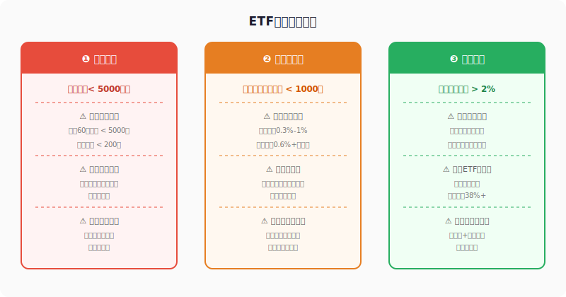
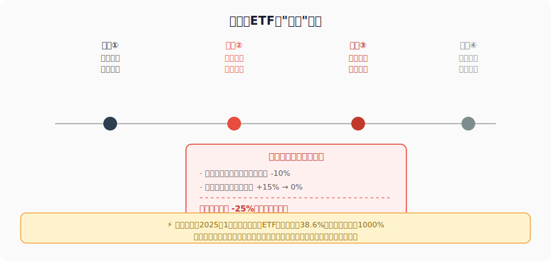
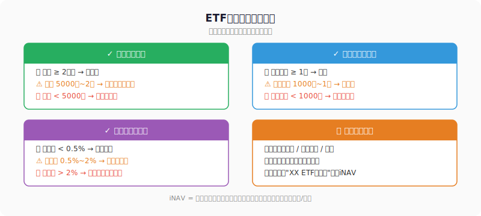

## 散户投资小白金融全品种操盘手册 - 4.10 规模太小、流动性太差、溢价太高的ETF为什么危险
  
### 作者  
digoal  
  
### 日期  
2026-06-02  
  
### 标签  
金融产品 , 金融工具 , 散户 , 投资小白 , 全品操盘手册  
  
----  
  
## 背景 
  

## 先说一件让人哭笑不得的事

2025年1月，A股投资者发现美国消费股可能受政策利好，大批资金涌入市场上一只跨境ETF。结果怎么了？

这只ETF的净值当天只涨了不到2%，但它的场内交易价格却飙涨4.92%——溢价率一度达到**38.6%**。换句话说，你花1.38元买了一个实际只值1元的东西，剩下那0.38元是你替情绪买的单。

更戏剧性的是：基金公司当天上午已经发出风险提示公告，甚至临时停牌，但复牌后资金依然蜂拥而入。

结局可以预料：溢价收敛，高价买入的投资者不管后来指数涨没涨，都先亏了这块溢价差。

ETF是好工具，但并不是所有ETF都值得买。这节课只讲一件事：**如何识别和远离三类危险ETF**。

---

## 先搞清楚ETF为什么需要考察这三个维度

ETF（交易所交易基金）的优势在于：低费率、透明、能实时交易。但这三个优势都有一个前提——你得买的是一只"正常运转"的产品。

一只ETF在以下三个维度出问题，你就可能在不知情的情况下承担额外风险：

1. **规模**：决定这只ETF能不能活下去
2. **流动性**：决定你能不能在想卖的时候卖掉，以及买卖的损耗有多大
3. **溢价率**：决定你买的是"产品本身"，还是"产品+别人的情绪泡沫"

---

## 危险一：规模太小——"随时可能被关门"的基金

### 为什么规模小是个问题？

ETF的规模，就是这只基金管着多少钱。规模太小，有三层风险：

**第一层：被强制清盘**

中国证监会有明确规定：如果一只基金连续60个自然日，资产净值低于5000万元，或者基金持有人数量低于200人，基金公司有权申请提前终止。

这个"提前终止"，就是清盘——你的持仓被强制按净值结算，然后打给你。

听起来还好，钱还是能拿回来。但问题在于：**清盘时机不由你选择**。假设你是长期投资者，你选定了某个行业，打算持有3年，结果基金1年就清盘了，你的策略被强制中断，拿到钱之后还要重新建仓，摩擦成本全算上来不是小数字。

**第二层：跟踪误差放大**

ETF的核心价值是"精准复制指数"。但规模太小，基金经理就很难完整买入指数中的所有成分股，有时候不得不买替代品，有时候只能买大权重忽略小权重，最终导致跟踪误差变大——你以为买的是"行业平均"，其实买到了"行业近似"。

**第三层：机构不来，流动性更差**

大机构买ETF，首选规模大的产品。规模小的ETF越来越难吸引新资金，流动性越来越差，而流动性差又进一步加剧规模缩水，形成死亡螺旋。

### 数据说话

截至2026年3月，全市场1457只ETF中，**138只规模低于5000万元，其中32只低于2000万元**（证券时报，2026年3月）。这些产品随时可能触发清盘条件，但还挂在交易所上，普通投资者完全可能在不知情的情况下买入。

**安全区判断标准：**
- 规模 ≥ 2亿元：基本安全
- 规模 5000万~2亿：谨慎，要定期追踪规模变化
- 规模 < 5000万：红灯，坚决不买

---

## 危险二：流动性太差——"想卖卖不掉，想买价被推高"

### 流动性是什么？

流动性，就是你想交易时市场上有没有对手盘。

一只流动性好的ETF，你挂单几秒内成交，买卖价差极小（比如0.02%）。一只流动性差的ETF，你挂市价单可能一笔买单就把价格推高了，你挂限价单可能等很久也没人接。

### 流动性差的三个后果

**① 买卖价差吃掉你的收益**

ETF的场内交易和股票一样，有买一价和卖一价之差（即买卖价差）。流动性好的ETF，这个差距极小；流动性差的ETF，每次买卖你都在一进一出中白白损耗。

上交所白皮书数据显示：有做市商的ETF平均买卖价差为0.10%，没有做市商的ETF平均达到0.144%。听起来差距不大，但一年来回几次，损耗就积累起来了。有行业人士指出，"辛辛苦苦省出来的0.2%管理费优势，可能抵不上卖出一次折价亏的钱"（海富通基金，2024年12月）。

**② 急用钱时卖不掉**

流动性差的ETF，如果你急着卖出，可能面临这种情况：挂市价单价格被你自己的卖单砸低；挂限价单等了半小时没成交，只能不断降价。市场没给你机会，你只能接受更差的价格。

**③ 价格波动异常**

小规模ETF有时会出现"尾盘诡异拉升"现象：因为流通盘太小，少量资金就能拉动价格，形成看起来"连涨"的假象，吸引不明情况的投资者追入。但这种拉升缺乏基本面支撑，往往第二天就回落甚至套利资金砸盘。

### 安全区判断标准

行业普遍认可的标准是：
- 日均成交额 ≥ 1亿元：优质流动性
- 日均成交额 1000万~1亿：最低可接受标准
- 日均成交额 < 1000万：红灯，极力回避

---

## 危险三：溢价太高——"你买的是泡沫，不是资产"

### 溢价是怎么来的？

ETF有两个价格：
- **场内交易价格**：就像股票一样，在二级市场实时撮合，由买卖双方的情绪决定
- **基金净值（iNAV）**：根据持仓股票的实时价格计算出来，反映真实价值

当场内价格 > 净值，就是溢价；当场内价格 < 净值，就是折价。

正常情况下，套利机制会让两者保持接近：溢价太高时，机构在场外申购ETF份额，拿到场内卖出，溢价自动收敛。

**但有一种ETF，套利机制失效：跨境ETF。**

跨境ETF追踪的是海外指数，但它的一级市场申购往往受额度限制——很多跨境ETF已经暂停或限制大额申购。这意味着机构没法套利，溢价就可以一直高下去，甚至越炒越高。

### 真实代价

溢价是透明可见的，但很多散户视而不见，理由是："指数要涨，溢价是小事。"

错。溢价是你的成本。看下面这个简单的算术：

**场景：你在溢价10%时买入跨境ETF**
- 之后指数涨了5%，净值随之上涨5%
- 但溢价从10%收敛回0%
- 你的持有价值：净值 × (1+0%) = 净值本身
- 而你的买入成本：净值 × 1.10
- 实际损益：+5% - 10% = **净亏损5%，指数还是涨的**

溢价和净值是两码事，两者同时影响你的收益。

### 跨境ETF溢价特别危险

2025年1月初，A股市场出现了一波跨境ETF高溢价潮。超过20只跨境ETF发布溢价风险提示公告，4只直接停牌。其中一只标普消费ETF溢价率达到**38.6%**，当日换手率超过**1028%**——相当于当天全部流通份额换手了10遍（证券时报，2025年1月）。

最终结果：热炒资金在风险提示和套利压力下撤出，溢价迅速收缩，高价买入的投资者不管指数本身走势如何，先承担了这块溢价损失。

### 安全区判断标准

- 溢价率 < 0.5%：正常区间，可以交易
- 溢价率 0.5%~2%：留意，追踪变化趋势
- 溢价率 > 2%：红灯，等待回落再入场，或换其他品种

---

## 第一性原理分析

**支撑"小规模、低流动性、高溢价的ETF更危险"成立的前提：**

- 前提A：基金清盘规则存在且被严格执行 → 【常量】→ 由证监会法规界定，不会轻易改变
- 前提B：市场存在套利机制，溢价能收敛 → 【常量（对普通ETF）/ 变量（对跨境ETF）】→ 跨境ETF申购受限时套利失效，溢价可以更长期维持
- 前提C：散户的交易资金量相对于迷你ETF有一定体量 → 【变量】→ 资金极少时，可能流动性风险影响也小

**情景推演：**

正常情景（三个前提成立）：规模小 → 清盘风险高、流动性差 → 买卖损耗大、溢价高 → 追涨亏溢价，三种风险都成立。

压力情景（前提B被推翻，即跨境ETF申购暂停）：溢价可以维持更长时间，看起来"高溢价稳定"，但这是陷阱——一旦申购重新开放，套利资金瞬间涌入，溢价暴跌。持有者什么都没做，就因为制度变化被动受损。

**结论**：在任何情景下，规模、流动性、溢价三项检查都有意义，且应在买入前完成，而不是买入后才发现。

---

## 实操例子

**场景：你有1万元，想买一只细分行业ETF参与某主题行情**

假设你看好某个科技细分方向，找到了两只相关ETF：

- **ETF A**：规模3亿元，日均成交2000万，当前溢价0.3%
- **ETF B**：规模3000万元，日均成交200万，当前溢价5.2%

**第一步：规模检查**
- ETF A：3亿 > 2亿，安全
- ETF B：3000万 < 5000万，红灯

**第二步：流动性检查**
- ETF A：日均2000万 > 1000万，可接受
- ETF B：日均200万 < 1000万，红灯

**第三步：溢价检查**
- ETF A：0.3% < 0.5%，正常
- ETF B：5.2% > 2%，红灯

**结论**：ETF B亮了三盏红灯，哪怕你对这个主题的判断正确，也可能因为清盘、流动性差或溢价收敛而损失本不应该亏的钱。

**正确操作**：
- 第一步：选ETF A进场
- 如果ETF A不存在同赛道大规模产品：考虑用宽基ETF代替，或改用场外指数基金
- 第二步：买入前在交易软件中查当日成交量和溢价率，确认三项指标在安全区
- 第三步：买入后定期（每月至少一次）检查规模变化，如果跌破2亿，考虑是否换仓

**如果操作错误（买了ETF B）：**
- 发现规模接近5000万时，应立即评估是否离场，不要等到清盘通知
- 清盘通知发出后通常有30天赎回期，按净值结算，但场内流动性可能更差，要尽早行动

---

## 可复用框架

**【三灯检查法】**

适用场景：任何ETF的买入前评估

核心逻辑：排除因规模、流动性、溢价带来的"结构性风险"，让你的投资决策只承担"市场风险"，不承担额外的"产品风险"

操作步骤：
1. 查规模：≥ 2亿为绿灯，< 5000万为红灯，中间黄灯谨慎
2. 查流动性：日均成交 ≥ 1000万为绿灯，< 1000万为红灯
3. 查溢价率：< 0.5%绿灯，> 2%红灯（在交易软件或天天基金查"折溢价率"）
4. 三项均绿灯方可买入，任何一项红灯即放弃该产品

举一反三：这个框架适用于所有场内基金，包括ETF、LOF（上市开放式基金）、REITs等，只要是场内可交易的基金产品，都应做这三项检查。

---

---

## 本节行动清单

1. **马上做**：打开你现在持有的所有ETF，逐一查规模、成交量、溢价率。任何一项亮红灯，纳入"待处理"清单
2. **买之前**：任何ETF买入前，花30秒跑一遍三灯检查，形成习惯
3. **定期跟踪**：规模在2亿以下的ETF，每月检查一次规模变化，规模持续下滑时提前考虑是否换仓
4. **遇到高溢价**：看到某ETF涨幅明显超过其追踪指数，先查溢价率。溢价率 > 2%，按住手，等回落再说
5. **跨境ETF特别注意**：买入前额外确认该产品是否有申购限制，申购受限意味着套利失效，溢价可能更极端

---

## 一句话总结

ETF好不好，不只看追踪指数好不好——规模太小会被关门，流动性太差会被套住，溢价太高是把情绪当资产买，三条红线任何一条碰到，都是花钱买没必要的麻烦。

---

> ⚠️ **声明**：本文内容为投资教育目的，所有历史数据、策略框架均为辅助学习工具，不构成证券投资建议。市场有风险，投资需谨慎。实际操作请结合自身风险承受能力，必要时咨询专业投顾。
  
  
#### [PostgreSQL 解决方案集合](../201706/20170601_02.md "40cff096e9ed7122c512b35d8561d9c8")
  
  
#### [德哥 / digoal's Github - 公益是一辈子的事.](https://github.com/digoal/blog/blob/master/README.md "22709685feb7cab07d30f30387f0a9ae")
  
  
#### [About 德哥](https://github.com/digoal/blog/blob/master/me/readme.md "a37735981e7704886ffd590565582dd0")
  
  

  
